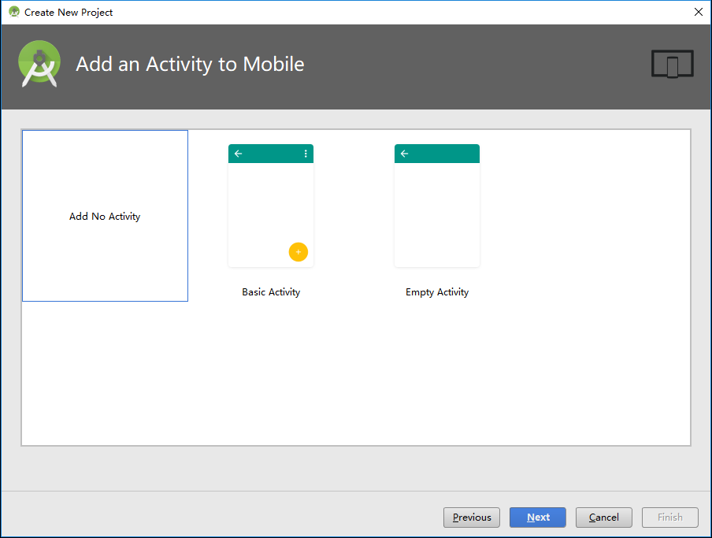
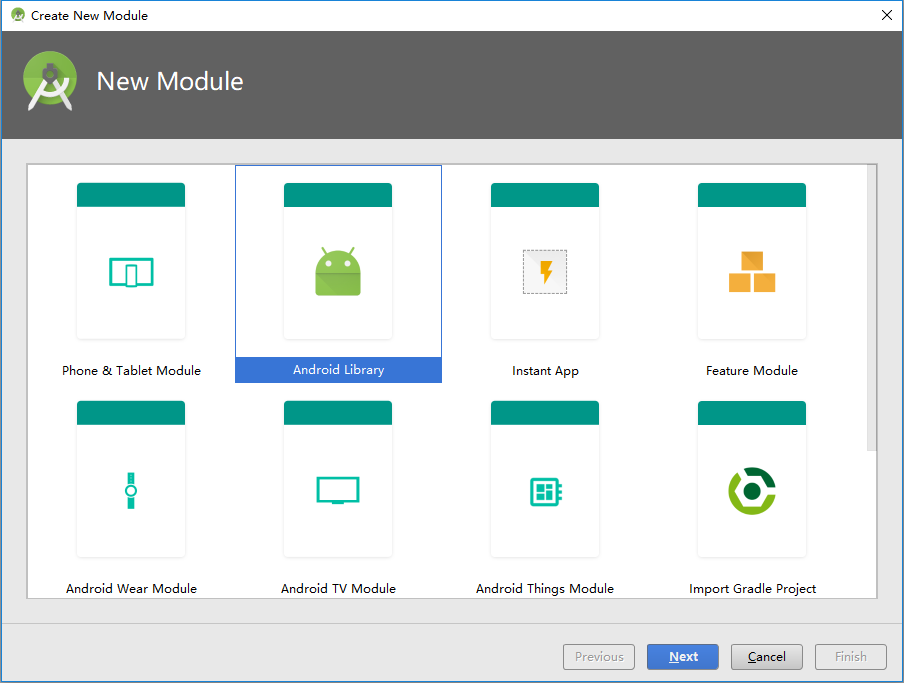
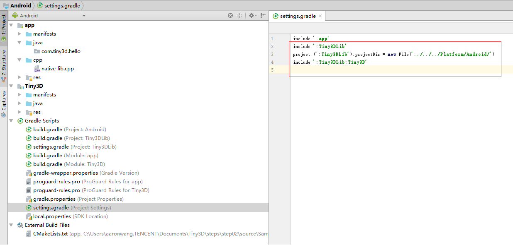
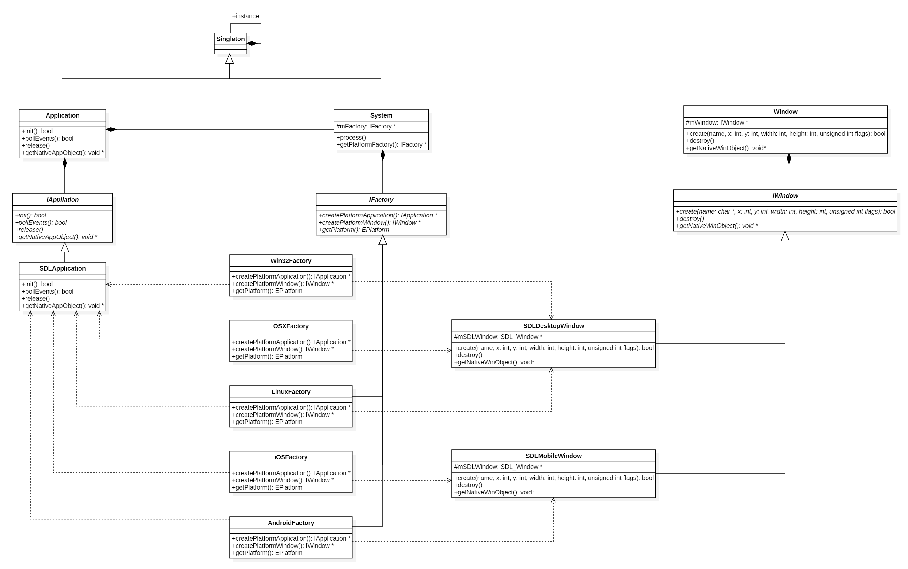
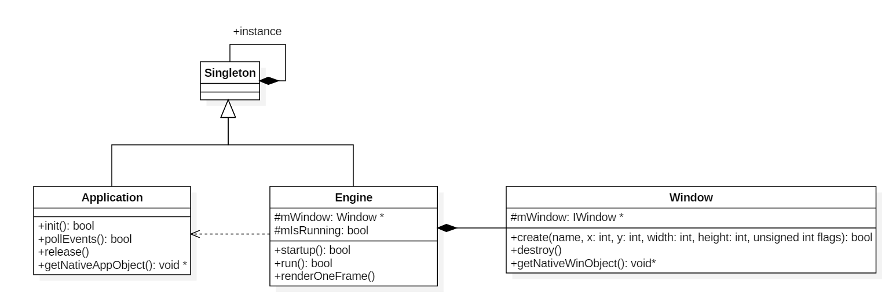
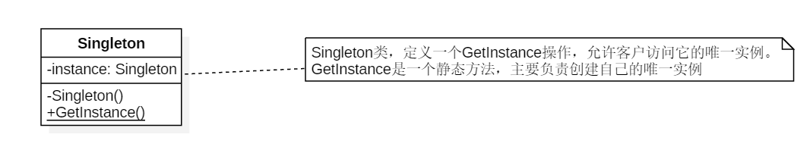
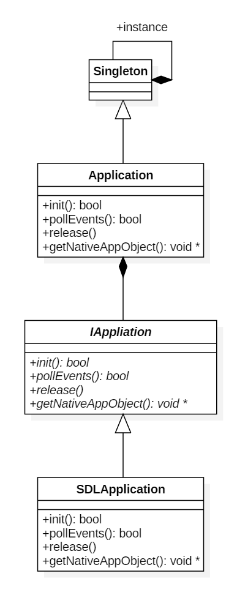
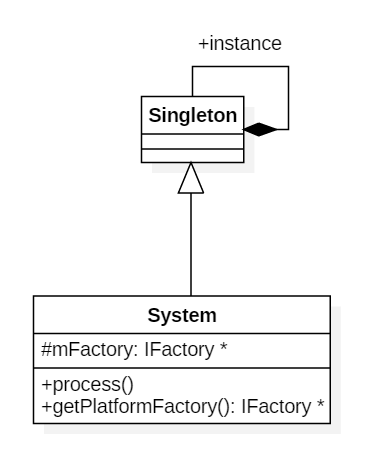

# 一起动手实现3D渲染引擎（Tiny3D ）
A Tiny 3D Engine

[TOC]


​	我曾经做过许多游戏非游戏类项目或者Demo，但是从来没有认真的把这中间的过程记录下来。写这些系列文章主要目的就是自己亲自动手实现一个渲染引擎，并且把中间经历过的所有都记录下来，作为一种沉淀积累以作未来回顾，做到温故而知新。有兴趣的小伙伴，可以跟着一起来动手实现一个渲染引擎。好，闲话休叙，那下面开始我们这段旅程。

# 一、整体设计

本篇目标

- 了解整体目标
- 了解整体架构设计

## 1.1 整体目标

　　所有事情开始都需要设定一个目标，只有一步一个脚印的向着明确目标走下去，才能到达终点。所以在这里我们简单设定一个设计目标，简单点说就是我们最终要完成的3D渲染引擎具备什么功能。以下简单罗列功能点：

1. 跨平台。支持：Windows、Mac OS X、iOS、Android、Linux五个主流的桌面平台和移动平台
2. 跨渲染API。支持：Open GL (3.0、4.0)、OpenGL ES（2.0、3.0）、Vulkan、DirectX 9、DirectX 11
3. 日志系统。支持：输出到文件和平台相关Console以方便定位问题
4. 数学库。支持：2D向量、3D向量、4D向量、四元素、3x3矩阵、4x4矩阵、三角函数、平面、距离运算、AABB碰撞检测、OBB碰撞检测、Sphere碰撞检测等
5. 内存管理。支持：智能指针
6. 场景管理。支持：内置默认场景管理器、场景剔除、简单Scene Graph组织场景物体、各种渲染物体对象
7. 渲染器。支持：不同渲染API使用统一接口通过插件形式无缝替换不同渲染API
8. 渲染队列。支持：对不同材质的物体做渲染队列的分层来实现渲染和提高渲染性能
9. 资源管理。支持：动态库、纹理、材质、网格、地形、字体、档案等资源的统一管理
10. 插件系统。支持：动态加载以切换不同的插件库
11. 图片加载系统。支持：PNG、JPG、JPEG、TGA、DDS、ETC、PVR等各种常用图片格式的图片加载和保存
12. 模型数据加载系统。支持：自定义格式模型文件加载和保存
13. 材质脚本系统。支持：vertex shader、fragment shader、HLSL的编译、HLSL到GLSL之间转译、材质参数的设定
14. 地形系统。支持：简单的高度图地形
15. 粒子系统。支持：粒子发射器、粒子的批次渲染、粒子缓存复用
16. 光照系统。支持：默认光照（顶点光照、像素光照）
17. 动画系统。支持：骨骼动画、软件蒙皮和硬件蒙皮
18. 字体管理。支持：TTF字体、BMFont字体
19. 事件系统。支持：事件注册、事件分发
20. FBX转自定义格式的工具。支持：支持在Windows上把FBX格式文件转换成自定义格式文件，方便引擎加载

从上面简单罗列来看，已经有很多功能了，看起来不可能完成，但是这个就是我们目标，我们不去尝试，怎么就知道无法实现呢？接下来，让我们一起朝着这个目标出发，前进！！！


## 1.2 整体架构

　　从上面目标来看，我们有很多功能点需要做。正所谓万丈高楼平地起，地基是需要打好的，所以下面我们来看看我们的整体架构设计，架构设计合理才能让我们后面的旅程事半功倍。我们就专业点来看看架构设计图：


<center>图1-1 整体架构设计</center>

从图1-1来看，我们分成几大模块：

1. **Platform** —— 平台库，专门实现跨平台的功能，给上层提供平台无关的接口，统一平台的底层处理
2. **Plugins** —— 各种插件，引擎核心功能之外的各种可通过外部插件替换功能的插件
3. **3rd Party** —— 虽然我们引擎都是自己造车实现的，但是非引擎功能的部分，我们还是借助一些第三方库来实现其功能就好了
4. **Core** —— 渲染引擎核心模块，场景管理、资源管理、数学库、插件系统、渲染器、渲染队列、渲染对象、日志系统、事件系统等都在这里面实现了。当然，我们最后还是会简单分成多个库以实现可重用的模块分离。

简单的就说这么多了，下面按照这个标着目标的地图来逐步前进吧

# 二、开发环境

本篇目标

- Windows上搭建Windows开发环境
- Windows上搭建Android开发环境
- Mac OS X上搭建Mac OS X开发环境
- Mac OS X上搭建iOS开发环境

　　既然要开发，首先面对的是使用什么开发语言，这里的3D渲染引擎主要是使用C++来实现。为啥使用C++？因为性能好呀。那C更快，为啥不用C？因为C没有面向对象，抽象行为的实现比较麻烦，当然不是不能实现。那其他语言呢？实话实说，其他语言我也不精通啊，所以我们不纠结，果断选择C++吧。

　　选择好开发语言后，就要开始选择各种开发工具了。后面我们详细说说各种开发环境及其搭建。这里先说说另外一个问题。我们是跨平台开发，每种平台的代码工程都是多种多样、千差万别，那如何让我们工作更加简单呢？这里介绍一个简单的跨平台工程生成工具作为我们所有平台工程的基础工具。这个工具就是cmake。大家可以从cmake官网下载（官网地址：https://cmake.org/ ）。这里使用的版本是3.10.0。大家安装完cmake后，请记得安装cmake命令行工具，因为接下来我们所有工程的生成都是依赖命令行来进行的，具体安装请参考官方文档，这里就不多说了。

　　接下来先从大家平时用得最多的Windows平台开始搭建环境。


## 2.1 Windows开发环境

　　我这里是直接用Win10和Visual Studio 2015作为开发工具的。Visual Studio 2015下载地址：https://www.visualstudio.com/zh-hans/vs/older-downloads/ 。下载完记得要安装各种C++相关模块即可。安装后，需要设置一下环境变量，过程如下图：

首先在资源管理器中此电脑右键菜单选择属性，如下图2-1：


<center>图2-1 设置Visual Studio 2015环境变量</center>

选择属性后，弹出系统设置窗口，如下图2-2：


<center>图2-2 设置Visual Studio 2015环境变量</center>

点击高级系统设置，弹出系统属性窗口，如下图2-3：


<center>图2-3 设置Visual Studio 2015环境变量</center>

在系统属性窗口里面点击环境变量按钮，弹出环境变量设置窗口，然后我们要在系统环境变量中的Path变量添加一个新的路径，如下图2-4：


<center>图2-4 设置Visual Studio 2015环境变量</center>

点击新建，在最后一行加入一个路径：C:\Program Files (x86)\Microsoft Visual Studio 14.0\Common7\IDE。当然，这个是我的Visual Studio 2015 IDE的路径，大家要根据自己的安装路径来设置，主要是为了后续生成项目工程使用到devenv.exe做准备。

　　至此Windows上的开发环境就已经搭建完了。稍后我们下一篇我们再用程序来实际验证我们的环境是否能正常使用。接下来我们继续下一个平台开发环境搭建——Android开发环境。


## 2.2 Android开发环境

　　上一篇我们已经搭建了Win 10的开发环境，这一篇我们简单介绍Android开发环境的搭建。因为我们用C++作为主要开发语言，在Android上开发C++，必然要用到NDK。以前，在Android上使用NDK开发，主要也是用Makefile来编译，用Eclipse或者Visual GDB来来调试等。但是无论用那种方式，都会碰到各种繁琐的事情，要么构建麻烦，要么就是调试麻烦，很多人使用过的人都深有体会。而且这一条工具链对于我们之前说过的使用CMake也不是很友好和方便。而最近几年出现的Android Studio，特别是新版本的Android Studio，就很好解决了这个问题。Android Studio里面对native的开发主要就是使用CMake来生成工程并且用clang++来编译，这一套工具链恰好跟我们之前的开发环境目标很一致，所以我们在Android开发上果断选择Android Studio。

　　既然选择了Android Studio作为我们开发工具链，那我们可以到Android Studio官网下载并且安装（官网地址：https://developer.android.com/studio/index.html ）。这里使用的版本是Android Studio 3.0.1。另外我们是在Win10上使用Android Studio。下载完后，安装完之后还没完，这里还需要做一些工具下载和设置。接下来我们看看具体使用什么SDK和工具

　　首先，我们设置使用的SDK，如下图2-5：


<center>图2-5 Android Studio SDK设置</center>

接着安装各种其他工具：

- GPU Debugging tools：我们开发的是游戏，需要用GPU工具来调试
- CMake：之前提到我们使用这套工具链来生成native工程
- LLDB：我们使用这个来作为调试工具
- Android SDK Tools：SDK一些工具
- NDK：Native Develop Kit这个在Android上开发C++程序必不可少的库

全部各种SDK Tools安装，如下图2-6：


　　安装完这个工具后，我们还要安装模拟器，因为我们使用Open GL ES，这里会用到硬件加速，一般自带的模拟器都无法运行起来，所以这里给大家推荐另外一个模拟器，实际上是一个虚拟机——Genymotion（官网地址：http://www.genymotion.net/ ）。安装上这个，我们就基本上可以不用真机来开发了。当然，有些特殊情况仍然需要具体设备来验证，这个是特殊情况特殊处理了。

　　至此，我们Android开发环境就搭建完成了。验证环境是否正常，我们留到后面一个简单程序来实现。最后我们来看看在Mac OS X上搭建iOS和Mac OS X开发环境


## 2.3 iOS和Mac OS X开发环境

　　在Mac OS X搭建这个开发环境就相对容易多了，只要到App Store上安装最新版xcode就完事了。不过，想要发布还需要花费$99USD去苹果那里搞个开发者账号生成个发布证书才可以提交苹果审核发布的。这里就不想详细述说这些了。


## 2.4 Linux开发环境

这部分暂时没有涉及，后续补充，To be continued

# 三、Hello World

本篇目标

- 项目文件组织结构
- 简单的平台库和核心库设计
- 简单的平台库和核心库的实现
- 验证开发环境能正常运作
- 一个在Windows、Mac OS X、iOS、Android平台上都能运行起来的简单Demo——HelloApp

　　上面各平台开发环境我们已经搭建好了，那我们接着需要做个程序来验证环境是否能正常运行。这里，我们通过一个简单的Demo来验证这个问题。在实现这个Demo过程中，我们也开始平台层的简单设计和实现，避免后面再返回来做设计了。

## 3.1 项目文件组织结构

　　现在就让我们从项目文件组织结构开始，一步步完善引擎，逐步向目标靠近。既然是写代码，肯定需要存放源码文件，怎样存放源代码文件、第三方库文件、资源文件，这个就需要我们考虑了。其实，这个问题还比较简单，不用过多考虑，为什么呢？因为我们使用的CMake生成工程就已经给我们大概规范好了源码存放文件的结构了。下面，我们通过简单的图来看看如何存放。

```
.
├─dependencies
│  └─SDL2
│      ├─include
│      │  └─SDL2
│      └─prebuilt
│          ├─Android
│          │  ├─armeabi
│          │  ├─armeabi-v7a
│          │  └─x86
│          ├─iOS
│          ├─OSX
│          └─win32
│              ├─x64
│              └─x86
└─source
    ├─CMake
    │  ├─Packages
    │  ├─Toolchains
    │  └─Utils
    ├─Core
    │  ├─Include
    │  │  └─Kernel
    │  └─Source
    │      └─Kernel
    ├─Platform
    │  ├─Android
    │  ├─Include
    │  │  └─Adapter
    │  │      ├─Android
    │  │      ├─Common
    │  │      ├─Desktop
    │  │      ├─iOS
    │  │      ├─Mobile
    │  │      ├─OSX
    │  │      └─Windows
    │  └─Source
    │      └─Adapter
    │          ├─Android
    │          ├─Common
    │          ├─Desktop
    │          ├─iOS
    │          ├─Mobile
    │          ├─OSX
    │          └─Windows
    ├─Projects
    └─Samples
        └─hello
            ├─Android
            ├─iOS
            └─OSX
```

### 3.1.1 一般的项目文件组织结构

　　Dependencies文件夹，存放第三方库的文件夹，子文件夹根据不同的库名称来区分，如SDL2。在SDL2里面进一步划分为：

- include文件夹，存放了第三方库提供的头文件，这里是SDL2库提供的头文件。
- prebuilt文件夹，里面按照不同平台来进一步划分文件夹：
  - Android文件夹，存放Android平台的已经编译好的库文件。由于Android平台有针对不同CPU架构的库，所以进一步划分成（不局限于以下列出来的，因为SDL2库只提供了这三种CPU架构，有的库提供更多CPU架构，所以有的库会有更多文件夹）：
    - armeabi文件夹，一般存放的是\*.so或者\*.a。
    - armeabi-v7a文件夹，一般存放的是\*.so或者\*.a。
    - x86文件夹，一般存放的是\*.so或者\*.a。
  - Win32文件夹，存放Windows平台的已经编译好的库文件。由于Win32平台有分别针对不同CPU架构的库，所以进一步划分成：
    - x86文件夹，存放x86结构的\*.dll或者\*.lib。
    - x64文件夹，存放x64结构的\*.dll或者\*.lib。
  - iOS文件夹，存放iOS平台的已经编译好的库文件。虽然iOS平台也有多种CPU架构的区别，但是苹果提供了一个库文件可以集成所有CPU架构在一起，所以这里一般不需要进一步划分子文件夹来区分不同的CPU架构了。这里面一般存放的是\*.a或者\*.framework。因为iOS不支持动态库，所以这里面一般没有\*.so或者*.dylib。
  - OSX文件夹，存放Mac OS X平台的已经编译好的库文件。Mac OS X平台也跟iOS类似，因为苹果提供了合并多种CPU架构在一个库里面的支持，所以这里面一般也是不需要进一步划分子文件夹来区分不同的CPU架构的。这里面一般存放的是\*.a、*.dylib或者\*.framework。

　　Source文件夹，这里就是存放所有源代码的地方。在这里面，会进一步按照引擎提供的库来划分文件夹：

- Core文件夹，里面就是存放T3DCore这个库的所有源码文件。在Core里面，又进一步划分：
  - Include文件夹，用来存放T3DCore库对外的头文件。因为一个库还有许多小的功能模块，所以里面进一步划分为：
    - Kernel文件夹，引擎核心功能头文件。
  - Source文件夹，用来存放T3DCore的源码文件和不对外公开的头文件。
    - Kernel文件件，引擎核心功能源码文件。
- Platform文件夹，里面就是存放T3DPlatform这个库的所有源码文件。在Platform里面，又进一步划分：
  - Include文件夹，用来存放T3DPlatform库对外的头文件。而Platform因为跟平台有关，下面进一步划分为：
    - Adapter文件夹，存放各种平台抽象出来接口类的头文件，以及每种平台或者公用实现的头文件，进一步划分为：
      - Android文件夹，存放Android平台相关实现的头文件。
      - Common文件夹，存放所有平台公用实现的头文件。
      - Desktop文件夹，存放跟桌面系统公用实现的头文件。
      - iOS文件夹，存放iOS平台相关实现的头文件。
      - Mobile文件夹，存放移动终端平台相关实现的头文件。
      - OSX文件夹，存放Mac OS X平台相关的头文件。
      - Windows文件夹，存放Windows平台相关的头文件。
  - Source文件夹，用来存放T3DCore库的源码文件以及内部使用的头文件。具体结构跟Include底下的文件夹组织结构类似，这里就不详细列出来了，请各位参考Include低下文件夹组织结构说明。
  - Android文件夹，这里是Android特有的文件，这里先忽略这个，后面会有详细说明。
- Samples文件夹，存放所有验证引擎的例子程序源码，是所有Sample工程入口。里面进一步按照不同的Sample Application来进一步划分，目前里面只有：
  - Hello文件夹，存放HelloApp相关的源码文件，里面按照不同平台需要的配置文件进一步划分：
    - iOS文件夹，存放HelloApp在iOS平台用到的各种配置文件。
    - OSX文件夹，存放HelloApp在Mac OS X平台用到的各种配置文件。
    - Android文件夹，这个稍后特别说明。
- CMake文件夹，存放CMake公用脚本文件，给每个工程使用，用于生成不同平台的工程文件。具体这里就不说了，有兴趣的可以直接到CMake官网看教程。
- Projects文件夹，这里不是工程文件，我们工程文件是通过CMake来生成出来的。这里面仅仅是一些不同平台的辅助脚本，后面会详细说一下，这里先忽略。

### 3.1.2 特别的Android工程

　　本篇开头说过，我们工程都是通过CMake生成的，但是在Android上却是例外。为什么呢？因为Android工程比较特殊，程序的入口是用Java写的，而Android工程原生对native支持并不好，所以只能先通过Android Studio生成工程，然后再用CMake来生成对应的native工程来做native的开发。好，既然这么特别，我们下面一步步来看看如何生成这个Android Studio的工程。

#### 3.1.2.1 库工程

 　　首先，我们用Android Studio创建编译aar库和so库的工程，并且在里面创建一个Module，这样做主要是两个目的：

- 方便后续所有Samples工程引用Module，可以共享Module工程，不用重复新建工程和复制代码
- 可以单独编译aar库和so库文件，独立发布

下面我们一步步来建立：

新建一个工程，选择“Start a new Android Studio project”项，如下图3-1：


<center>图3-1 新建Android工程</center>

出现“Create New Project”窗口。把里面各字段按照如下填入：

- Application Name里面填入Tiny3DLib，表示这个工程名称；
- Company domain里面填入公司域名，这里我们随便填就好了；
- Project location里面填入工程路径，我们按照上面项目组织结构来看，我们这个属于平台库里面的，直接放到source/Platform/Android这个文件夹下；
- Package name里面填入我们的包名com.tiny3d.library；
- 勾上“Include C++ support”，因为我们要用native开发；

如下图3-2：


<center>图3-2 Create Android Project</center>

填完上述的信息后，点击Next，进入选择Android设备和SDK最低版本等信息界面。因为这里只需要支持手机终端，所以只选择“Phone and Tablet”，如下图3-3选择：


<center>图3-3 Create Android Project</center>

选择完支持平台和SDK后，点击“Next”，进入选择添加Activity界面。在这里，我们因为是库，所以直接选择“Add Not Activity”。如下图3-4：



<center>图3-4 Create Android Project</center>

选择完Activity后，点击"Next"进入配置C++支持界面。在这里的C++ Standard里面选择"C++ 11"，因为引擎使用C++ 11语法来实现。在下面的Exceptions Support和RTTI都勾上，当然这两个也可以后续在build.gradle里面再添加，这个只是编译选项而已。如下图3-4：


<center>图3-5 Create New Project</center>

最后点击“Finish“完成创建新项目。这个项目是给编译库使用的，但是库所属的Module还没有创建，所以我们要创建一个Module，方便后面所有Samples项目引用，而不是导入。

　　接下来，在刚才新建的项目里面新创建一个Module。这里简单说一下，Android Studio里面的Project其实是相当于很多项目的集合，跟Visual Studio里面的Solution解决方案类似，只是它里面还附带创建一个app类型的工程而已。下面继续一步步新建Module：

在菜单里面新建一个Module，如下图3-6：


<center>图3-6 新建Module</center>

点击后会出现一个"Create New Module"窗口，在里面选择"Android Library"，如下图3-7：



<center>图3-7 Create New Module</center>

点击"Next"后，进入配置新Module信息界面，填写如下信息：

- Application/Library name里面填入Tiny3D，表示库名称；
- Module name里面填入Tiny3D，表示项目名称；
- Package name里面填入com.tiny3d.lib，表示包名；
- Minimum SDK选择最低支持的SDK版本；

如下图3-8：


<center>图3-8 Create New Module</center>

点击"Finish"后，完成新建Module工作。

自此，这里就完成了工程的创建了，但是还要稍作修改才能进一步应用。首先，我们这里是一个库，是被其他App项目引用的，所以这里要简单修改一下app/build.gradle。修改如下图3-9：


<center>图3-9 修改构建脚本</center>

如上图所示，需要修改一下几点：

- 把apply plugin'com.android.application'修改成apply plugin 'com.android.library'
- 注释掉applicationId 'com.tiny3d.library'，因为我们是库，不是应用程序
- 添加CMake参数，arguments "-DTINY3D_BUILD_SAMPLES=FALSE"，表示告知CMake脚本不构建Samples程序，这个我们留在后面创建的Samples App工程里面去构建，这样子能做到单独构建出独立的库来
- 添加支持的CPU架构，加入abiFilters "x86 armeabi armeabi-v7a"，因为这里我们使用的SDL2只有这三种CPU架构，SDL2的构建需要依赖这三个配置值
- 修改CMake使用的脚本路径，让其指向我们根目录下的CMakeLists.txt，可以直接构建所有的相关的库

通过以上的修改，就完成了基本的配置了。最后加入依赖的SDL2的Java源码以及引擎从SDL2派生出来的Activity类，方便应用层直接从引擎类派生，而对SDL2的存在是透明的。

　　搞完以上配置后，我们到菜单里面Clean一下，重新Make Project，就能生成最终的\*.so和\*.aar了。

#### 3.1.2.2 应用工程

　　创建完库工程后，接下来要创建应用工程，因为只有应用程序才是真正能够运行起来的程序。下面一步步来看如何创建应用工程以及如何引用库工程。

启动另外一个Android Studio进程，选择"Start a new Android Studio project"，如下图3-10：


<center>图3-10 新建应用程序工程</center>

在出现的"Create New Project"窗口，如下图3-11设置：


<center>图3-11 Create New App Project</center>

设置完后，点击"Next"，进入选择支持设备和最小SDK版本界面，按照如下图3-12设置：


<center>图3-12 Create New App Project</center>

点击"Next"，进入选择Activity界面，如下图3-13设置：


<center>图3-13 Create New App Project</center>

点击"Next"后，进入最后C++配置界面，如下图3-14设置：


<center>图3-14 Create New App Project</center>

最后点击"Finish"，完成新建App工程。

　　新建完工程后，我们要引入刚才上面新建的Module工程，这样子以后所有Samples都可以共用同一个Module工程（注意：这里不是Import而是一个简单的引用，不会改变任何工程路径）。打开settings.gradle配置文件，如下图3-15添加入红框部分脚本：



<center>图3-15 引入Module工程修改</center>

接着点击菜单Refresh Linked C++ Project，刷新后就会有一个Tiny3D的工程出现在主工程里面。然后打开build.gradle(Module:app)配置文件，如下图3-16修改：


<center>图3-16 修改App的构建脚本</center>

按照上图修改，最后再加入我们Samples的一个Activity类。这样子工程修改完毕。

　　大功告成！等等，不对，还漏了一样没修改。那就是程序配置的AndroidManifest.xml。打开在app下的AndroidManifest.xml，如下图3-17修改：


<center>图3-17 修改AndroidManifest.xml</center>

经过上面的修改，这样子才真的大功告成。然后就是菜单里面"Build APK"，就能最终得到第一个Android程序的安装包Hello.apk了。

　　接下来不管是用Genymotion模拟器还是用真机，都可以完美的运行了。

### 3.1.3 辅助脚本

　　本篇前面提到过Projects这个文件夹，那么这个文件夹里面存放了什么呢？我们来看看。

　　generate-android.txt，这个文件什么都没有，仅仅是说明，因为我们无法通过CMake去完整生成整个Android工程，而是通过Android Studio来生成工程的，这个上面说过了，这里就不多说了。

　　generate-vs2015.bat，这个在Windows上生成Visual Studio 2015的解决方案文件，在命令行运行则可以生成并且打开相应的工程。代码如下：

```bash
cd ..
rmdir /Q /S vs2015
mkdir vs2015 && cd vs2015
cmake -G "Visual Studio 14 2015" ../
devenv Tiny3D.sln
cd ../Projects
```

　　generate-xcode-ios.sh，这个是在Mac OS X下生成iOS真机的xcode工程脚本，在命令行运行则可以生成并且打开相应的工程。代码如下：

```bash
cd ../
rm -rf xcode-ios
mkdir -p xcode-ios && cd xcode-ios
cmake -GXcode -DCMAKE_TOOLCHAIN_FILE=../CMake/Toolchains/iOS.cmake -DIOS_PLATFORM=OS -DCMAKE_OSX_ARCHITECTURES=arm64 ../
open Tiny3D.xcodeproj
cd ..
```

　　generate-xcode-simulator.sh，这个是在Mac OS X平台下生成iOS模拟器的xcode工程脚本，在命令行运行则可以生成并且开打相应的工程，代码跟上面类似，这里不列出来了，详情请自行查看源码。

　　generate-xcode-osx.sh，这个是在Mac OS X平台下生成OSX的xcode工程脚本，在命令行运行则可以生成并且打开相应的工程，代码也跟generate-xcode-ios.sh类似，这里也不列出来了。

　　通过以上脚本，可以直接在命令行直接执行生成各种平台工程并且打开，不用每次都去运行CMake-GUI或者逐个敲入CMake命令来执行生成工程的事情，进一步提高我们的开发效率。好了，下面我们直接进入我们的代码设计阶段了。

## 3.2 平台库（T3DPlatform）和核心库（T3DCore）设计

　　首先，我们把引擎层简单分成两个库，一个是引擎核心库——T3DCore，另外一个是平台相关抽象库——T3DPlatform。划分成两个库后，我们先来看T3DPlatform库的类图的设计，如下图3-1：



<center>图3-1 T3DPlatform库类图设计</center>

看到图3-1，各位看官是否觉得这里面的设计有似曾相识的感觉？是的，这里面用到了GoF提出的24中设计模式中的三种：单例模式、抽象工厂模式、桥接模式。在后面我们详细介绍，现在我们再来看看T3DCore的类图设计，这样子有个稍微全面的认识，如下图3-2：



<center>图3-2 T3DCore库类图设计</center>

从上图看出来，T3DCore库在本篇里面仅仅有一个Engine类，其负责创建Window对象，并且调用Application一些事件接口，通知引擎发生的最重要事情。各位看完这两个库的类图设计后，接下来我们详细讲讲一些中间用到的设计模式及其使用的目的。

### 3.2.1 单例模式的应用

　　先来看看标准的单例模式的定义是：

> 单例模式（Singleton），保证一个类仅有一个实例，并提供一个访问它的全局访问点。

看完定义，我们来看看标准的单例类图是什么样的，如下图3-2：



<center>图3-3 单例模式标准定义类图示例</center>

从标准定义可以看到单例的对象是通过在Singleton内部创建Singleton对象出来，所以这里构造函数是私有访问权限，防止外部创建。然而，按照这个标准来实现单例，会有一个小小的问题，那就是如果存在多个单例，那么这个全局的instance创建顺序就不由我们控制了，这样子就会出现一些意想不到的问题。因此，为了避免这个问题的出现，我们稍微对其做一点点改造，那就是把Singleton构造函数改造成公有，由一个地方统一创建这个单例对象，这样子就能由我们控制这些全局对象的创建顺序。当然，单例模式其实就是一种全局，相对来说，我们还是减少这种单例模式的使用，避免到处都是全局对象，造成全局污染。下面我们从上面设计图看出来存在三个这样的单例对象，我们逐个来说明下如此设计的目的。

　　唯一的应用对象——Application类。每个程序或者进程有且仅有一个应用对象，所以在这里我们直接用单例模式来设计Application类，避免应用对象多实例导致任何错误的出现。我们局部放大来详细看看这个单例的具体设计，如下图3-4：



<center>图3-4 T3DPlatform库Application相关类图</center>

这个Application类提供了应用程序初始化、事件轮询、释放资源等基本接口操作，同时也提供一些基本程序事件回调。我们把Application类放到T3DPlatform库里面应用层（使用引擎方）可以通过继承Application类做到同样是单例的实现，并且该对象是用应用层（使用引擎方）负责创建实例化。此外，我们这个Application类除了是一个单例模式应用外，也用了桥接模式来屏蔽不同操作系统之间的差异，具体在后面的桥接模式的应用里面会讲到。

　　唯一的系统对象——System类。每个操作系统平台有且仅有一个这种对象，所以在这里我们也是直接使用单例模式来设计System类。我们局部放大来详细看看这个单例的具体设计，如下图3-5：



<center>图3-5 T3DPlatform库System类单例模式类图</center>

这里的System类，作为操作系统相关操作的入口，其实是指具体跟操作系统平台相关的一些初始化、创建操作系统相关工厂对象以及内部轮询操作的接口的实现。我们把System类放到T3DPlatform库里面。这个System单例对象会在Application对象创建的时候在Application对象内部创建出来，做到第一时间创建平台相关工厂对象，避免后续各种调用平台相关功能的时候因为没有System对象而无法使用。后续随着我们的引擎的逐步构建，System类里面的操作系统相关的接口会逐步增多，后面碰到的时候，我们再讲。

　　唯一的引擎对象——Engine类。这里的引擎类就是我们的引擎入口了。这个当然是有且仅有一个这种对象了，引擎嘛，肯定是唯一的。这个我们直接从上面图3-2可以比较直观的看到类图设计。目前这个类很简单，仅仅提供了发动引擎操作、运行引擎操作、渲染单帧操作三个接口给应用使用。但是后续随着我们的引擎的逐步构建，功能逐步增加，Engine类里面的接口会逐步增加，后面我们再增加接口的时候再来谈谈具体的接口设计和实现。

　　到目前为止，我们就讲完了三个使用了单例模式的类的设计，本篇后面部分会有这三个类的接口设计和讲解。接下来我们看看前文提到的另外两种模式。

### 3.2.2 抽象工厂模式的应用

　　抽象工厂模式，这个从上图3-1应该能看出点端倪，下面我们详细来分析下这个设计。首先，什么是抽象工厂模式？我们直接看看定义：

> 抽象工厂模式（Abstract Factory），提供一个创建一系列相关或相互依赖对象的接口，而无需指定它们具体的类。

接着我们来看看抽象工厂模式的标准类图，如下图3-5：


<center>图3-6 抽象工厂模式标准定义类图示例</center>

我们来看看本篇开始提到的T3DPlatform中的类设计图，如下图3-7：


<center>图3-7 T3DPlatform库中使用到的抽象工厂模式类图</center>

看过上图，我们就会发现其实我们对于各种操作系统相关的对象创建就是使用了抽象工厂模式。好，接下来我们逐个列出来我们实际抽象工厂模式应用中的类和抽象工厂模式定义中的对应关系。如下表3-1

| 抽象工厂模式定义中的类                       | 实际应用中的类                                  |
| --------------------------------- | ---------------------------------------- |
| Client                            | Application和Window                       |
| AbstractFactory                   | IFactory                                 |
| ConcreteFactory1和ConcreteFactory2 | Win32Factory、OSXFactory、iOSFactory、AndroidFactory |
| AbstractProductA                  | IApplication                             |
| AbstractProductB                  | IWindow                                  |
| ProductA1和ProductA2               | SDLApplication                           |
| ProductB1和ProductB2               | SDLDesktopWindow和SDLMobileWindow         |

<center>表3-1</center>

从表3-1我们可以找出所有实际应用的类在定义中的类影子。为什么要用抽象工厂模式呢？因为每个操作系统平台对于窗口、应用等实现都有差异，抽象类IApplication（AbstractProductA）和IWindow（AbstractProductB）抽取了公用接口，让各平台相关子类各自去实现具体的接口，这样子Application（Client）和Window（Client）都无需关注具体平台实现，仅仅是调用就能达到具体的功能目的。同时，这里Application类和Window类使用了另外一种模式来进一步隐藏操作系统相关的操作，这个就是接下来要讲的桥接模式。

### 3.2.3 桥接模式的应用

　　桥接模式，估计很多人对这个模式都比较陌生，没有前面提到那两种设计模式那么常用。那么我们先来看看桥接模式的定义是什么：

> 桥接模式（Bridge），将抽象部分与它的实现部分分离，使他们都可以独立地变化。
>

看完定义，我们再直观的看看标准定义的类图是怎样的，如下图3-8：


<center>图3-8 桥接模式标准定义类图</center>

看完定义和类图，应该有个较直观的认识了。那为什么要用桥接模式呢？按照开篇时候提到的目标导向，所以从这个设计主要是为了解决什么问题来看。其实主要是基于以下几个目的：

- T3DPlatform作为一个库，对外需要隐藏操作系统实现细节
- T3DPlatform作为一个库，对外需要隐藏依赖操作系统的头文件
- 虽然目前只支持5中操作系统，但是将来要扩展，对T3DPlaform库对外接口可以无修改的桥接到新支持的操作系统上

基于以上三个目的，我们对照着桥接模式的定义，刚好发现其能够把功能作为抽象部分剥离出来，而具体操作系统的实现是另外一部分，这样刚好可以让相互之间都能独立变化，而互不影响。不过这里还有一点点区别，那就是我们的Window类，并没有RefinedAbstraction子类，而Application类的RefinedAbstraction类交给最后上层写App层的来负责实现。为什么Window类没有RefinedAbstraction子类呢？因为这个窗口系统是个简单窗口系统，主要就是给渲染器一个渲染目标，这里基本上不存在什么变化，所以这里就简单化了。当然，如果后续要很复杂的需求，那我们再去修改这部分。毕竟设计模式是死的，用的人是活的，要灵活运用才行。这里就不再给出细节的类图了，大家可以直接看图3-1或者图3-7。

## 3.3 T3DPlatform的实现

### 3.3.1 公用头文件

T3DType.h——重定义了各种引擎需要用到的基本类型。

T3DMacro.h——定义了一些辅助宏，包括T3D_SAFE_DELETE、T3D_SAFE_DELETE_ARRAY、T3D_EXPORT_API和T3D_IMPORT_API等通用的宏。

T3DPlatformPrerequisites.h——平台库需要依赖的一些只有平台库需要的宏以及平台库包的所有类的前置声明。

下面我们看看代码片段：

T3DType.h
```c++
typedef signed char         char_t;
typedef unsigned char       uchar_t;
typedef signed short        short_t;
typedef unsigned short      ushort_t;
typedef signed int          int_t;
typedef unsigned int        uint_t;
typedef signed long         long_t;
typedef unsigned long       ulong_t;

typedef signed char         int8_t;
typedef unsigned char       uint8_t;
typedef signed short        int16_t;
typedef unsigned short      uint16_t;
typedef signed int          int32_t;
typedef unsigned int        uint32_t;

#ifndef T3D_OS_ANDROID	// Android平台已经定义了这两个类型了，所以Anroid平台忽略不重复定义了
typedef signed long long    int64_t;
typedef unsigned long long  uint64_t;
#endif

typedef std::string         String;
typedef std::wstring        WString;

typedef std::string         UTF8String;
typedef std::u16string      UTF16String;
typedef std::u32string      UTF32String;

typedef void*               THandle;
```

T3DMacro.h

```c++
#if defined T3D_OS_WINDOWS      
	// Win32

    #ifdef _DEBUG   // debug
        #define T3D_DEBUG
    #else           // release
        #undef T3D_DEBUG
    #endif
    
    #pragma warning(disable:4996)
    #pragma warning(disable:4251)
    
    #define snprintf    _snprintf
    #define vsnprintf   _vsnprintf
    
    #define T3D_EXPORT_API      __declspec(dllexport)
    #define T3D_IMPORT_API      __declspec(dllimport)

#elif defined T3D_OS_IOS || defined T3D_OS_OSX || defined T3D_OS_LINUX  
	// iOS or Mac OS x or Linux

    #ifdef DEBUG    // debug
        #define T3D_DEBUG
    #else           // release
        #undef T3D_DEBUG
    #endif
    
    #define T3D_EXPORT_API
    #define T3D_IMPORT_API

#elif defined T3D_OS_ANDROID    
	// Android

    #ifdef NDK_DEBUG    // debug
        #define T3D_DEBUG
    #else               // release
        #undef T3D_DEBUG
    #endif
    
    #define T3D_EXPORT_API
    #define T3D_IMPORT_API

#endif

// 重定义断言
#ifndef T3D_ASSERT
    #ifdef T3D_DEBUG
        #define T3D_ASSERT(x)   assert(x)
    #else
        #define T3D_ASSERT(x)
    #endif
#endif

// 声明接口类辅助宏
#define T3D_DECLARE_INTERFACE(T)    \
    public:     \
        virtual ~T()    {}

// 禁止复制拷贝对象辅助宏
#define T3D_DISABLE_COPY(T) \
    private:    \
        T(const T &);   \
        T &operator =(const T &);

// 安全释放指针
#define T3D_SAFE_DELETE(p)  \
    if (p != nullptr)   \
    {   \
        delete p;   \
        p = nullptr;    \
    }

// 安全释放数组
#define T3D_SAFE_DELETE_ARRAY(p)    \
    if (p != nullptr)   \
    {   \
        delete []p; \
        p = nullptr;    \
    }
```

T3DPlatformPrerequisites.h

```c++
#if defined T3DPLATFORM_EXPORT
    #define T3D_PLATFORM_API    T3D_EXPORT_API
#else
    #define T3D_PLATFORM_API    T3D_IMPORT_API
#endif

namespace Tiny3D
{
    class System;
    class Application;
    class Window;
}
```

　　涉及源码文件：

- Source/Platform/Include/T3DType.h
- Source/Platform/Include/T3DMacro.h
- Source/Platform/Include/T3DPlatformPrerequisites.h

### 3.3.2 Singleton类实现

　　Singleton类在这里作为所有单例的基类，而且这是个模板类，可以适应各种类型。这里让所有单例类从这里继承，Singleton类封装各种单例行为。下面我们简单看看Singleton类实现：

```c++
template <typename T>
class Singleton
{
public:
    typedef T  value_type;
    typedef T* pointer;
    typedef T& reference;

    Singleton()
    {
        T3D_ASSERT(m_pInstance == nullptr);
        m_pInstance = static_cast<pointer>(this);
    }

    virtual ~Singleton()
    {
        m_pInstance = nullptr;
    }

    static reference getInstance()
    {
        return *m_pInstance;
    }

    static pointer getInstancePtr()
    {
        return m_pInstance;
    }

protected:
    static pointer m_pInstance;
};
```

详细的实现各位看官请参阅源码：

- Source/Platform/Include/T3DSingleton.h

### 3.3.3 Application相关类实现

　　前面我们看整体设计的时候，已经大概了解过有Application类，IApplication类，以及具体平台相关的Application类。这里我们要面临一个选择的问题。虽然我们是从造轮子开始的，但是我们不用连轮子上的橡胶也自己生产，毕竟我们不是专业跨平台窗口程序制作人员，所以这些造轮子所用的橡胶就交给第三方生产了。窗口系统有很多，但是我们选择基于三点原则：

1. 跨平台，支持Windows、Mac OS X、Linux、iOS、Android等五种主流操作系统平台
2. 简单能提供渲染的窗口，目标不是开发编辑器
3. 同时支持Open GL和Direct X两种不同系列的API

一开始考虑使用GLFW这个第三方库来实现应用和窗口系统的，但是后面发现GLFW首先只支持Open GL，其次其只支持桌面系统，对于手机终端系统暂无支持，结合上面三点原则，无法同时满足第一点和第三点，所以最后还是放弃了。经过一轮选择，最终选择了SDL2这个库。首先，它能满足跨平台，第一点原则上列出来的平台它都支持。其次，它能完美支持Open GL和Direct X两种不同系列的API。最后，SDL2也提供了不同平台的一些输入事件的封装，甚至更多的一些平台功能。综合分析，最后我们选择SDL2作为我们底层应用入口和窗口系统的构建基础。

　　那接下来看看几个Application类提供一些什么功能。

Application类

```c++
class T3D_PLATFORM_API Application : public Singleton<Application>
{
public:
	/**
 	 * @brief 应用初始化，这个由具体平台来调用，用户不需要调用
 	 * @return 调用成功返回true，否则返回false
 	 */
	bool init();

	/**
	 * @brief 应用事件处理
	 */
	bool pollEvents();

	/**
	 * @brief 应用程序退出释放资源
	 * @return void
	 */
	void release();

	/**
	 * @brief 获取平台相关的应用程序对象
	 * @return 返回平台相关的应用程序对象，不同平台各自去解析返回的指针
	 */
	void *getNativeAppObject();

	/**
	 * @brief 子类实现关注程序启动事件，引擎启动后被调用
	 * @return 返回true，引擎会继续执行下去，返回false，引擎会退出
	 */
	virtual bool applicationDidFinishLaunching() = 0;

	/**
	 * @brief 子类实现关注程序退后台事件
	 */
	virtual void applicationDidEnterBackground() = 0;

	/**
	 * @brief 子类实现关注程序回到前台事件
	 */
	virtual void applicationWillEnterForeground() = 0;

	/**
	 * @brief 子类实现关注程序退出事件，在某些平台上没有该事件
	 */
	virtual void applicationWillTerminate() = 0;
};
```

init() —— 初始化引用程序。目前主要调用IApplication具体操作系统相关子类对象实现来处理程序初始化的事情。

pollEvents() —— 轮询应用程序事件。目前主要是调用IApplication具体操作系统相关子类对象实现来处理程序轮询事件的事情。

release() —— 应用程序释放对应资源。目前主要是调用IApplication具体操作系统相关子类对象实现来处理程序退出的清理事情。

getNatvieAppObject() —— 返回操作系统相关的用于标识程序的唯一句柄对象。目前主要是调用IApplication具体操作系统相关子类对象实现来返回平台相关句柄，这里有的平台可能是没有该标识。

最后，一个很重要的实现，那就是在构造函数的时候，会对上述提到的System单例类实例化，让所有程序在启动时候就能识别出具体的操作系统平台，方便后续调用平台相关的接口。

IApplication类

　　上面再平台库设计的时候谈到过我们的Application类只是一个桥接者，而IApplication类才是实现者的抽象接口类，各操作系统平台或者第三方库负责继承出子类来实现各自接口跟平台相关的功能。具体的在这里不逐一列出来了，详情还请各位看官直接参阅源码IApplicationInterface.h。

SDLApplication类

　　参考上面类图设计，还有一个SDLApplication类，这个我们直接使用SDL2这个第三方库来实现应用程序初始化、事件轮询以及程序释放资源等这些功能。这个类是IApplication具体的实现类。为什么这里我们没有各种平台相关的IApplication子类，而只有一个SDLApplication类呢？因为SDL已经替我们实现了各种操作系统平台相关的事情，所以我们这里只需要简单的封装一下就能达到最初设计的目的了。具体的在这里也不一一列出来了，详情还请各位看官直接参阅源码SDLApplication.h和SDLApplication.cpp。而关于SDL2库的使用，可以直接到其官网 www.libsdl.org 上查阅。如果各位有兴趣，可以自己派生子类实现各种平台的行为或者使用其他第三方库来实现IApplication各种接口行为。

　　涉及源码文件：

- Source/Platform/Include/T3DApplication.h
- Source/Platform/Source/T3DApplication.cpp
- Source/Platform/Include/Adapter/T3DApplicationInterface.h
- Source/Platform/Include/Adapter/Common/T3DSDLApplication.h
- Source/Platform/Source/Adapter/Common/T3DSDLApplication.cpp

### 3.3.4 Window相关类实现


### 3.3.5 各操作系统平台相关工厂类实现

### 3.3.6 System类平台库的总入口

## 3.4 T3DCore的实现

### 

## 3.5 跑起来吧，HelloApp！

