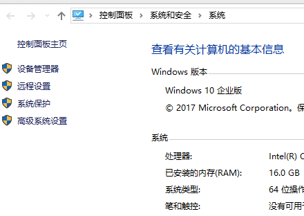

# 一起动手实现3D渲染引擎（Tiny3D ）
A Tiny 3D Engine

[TOC]

​	我曾经做过许多游戏非游戏类项目或者Demo，但是从来没有认真的把这中间的过程记录下来。写这些系列文章主要目的就是自己亲自动手实现一个渲染引擎，并且把中间经历过的所有都记录下来，作为一种沉淀积累以作未来回顾，做到温故而知新。有兴趣的小伙伴，可以跟着一起来动手实现一个渲染引擎。好，闲话休叙，那下面开始我们这段旅程。

# 一、整体设计

本篇目标

- 了解整体目标
- 了解整体架构设计

## 1.1 整体目标

　　所有事情开始都需要设定一个目标，只有一步一个脚印的向着明确目标走下去，才能到达终点。所以在这里我们简单设定一个设计目标，简单点说就是我们最终要完成的3D渲染引擎具备什么功能。以下简单罗列功能点：

1. 跨平台。支持：Windows、Mac OS X、iOS、Android、Linux五个主流的桌面平台和移动平台
2. 跨渲染API。支持：Open GL (3.0、4.0)、OpenGL ES（2.0、3.0）、Vulkan、DirectX 9、DirectX 11
3. 日志系统。支持：输出到文件和平台相关Console以方便定位问题
4. 数学库。支持：2D向量、3D向量、4D向量、四元素、3x3矩阵、4x4矩阵、三角函数、平面、距离运算、AABB碰撞检测、OBB碰撞检测、Sphere碰撞检测等
5. 内存管理。支持：智能指针
6. 场景管理。支持：内置默认场景管理器、场景剔除、简单Scene Graph组织场景物体、各种渲染物体对象
7. 渲染器。支持：不同渲染API使用统一接口通过插件形式无缝替换不同渲染API
8. 渲染队列。支持：对不同材质的物体做渲染队列的分层来实现渲染和提高渲染性能
9. 资源管理。支持：动态库、纹理、材质、网格、地形、字体、档案等资源的统一管理
10. 插件系统。支持：动态加载以切换不同的插件库
11. 图片加载系统。支持：PNG、JPG、JPEG、TGA、DDS、ETC、PVR等各种常用图片格式的图片加载和保存
12. 模型数据加载系统。支持：自定义格式模型文件加载和保存
13. 材质脚本系统。支持：vertex shader、fragment shader、HLSL的编译、HLSL到GLSL之间转译、材质参数的设定
14. 地形系统。支持：简单的高度图地形
15. 粒子系统。支持：粒子发射器、粒子的批次渲染、粒子缓存复用
16. 光照系统。支持：默认光照（顶点光照、像素光照）
17. 动画系统。支持：骨骼动画、软件蒙皮和硬件蒙皮
18. 字体管理。支持：TTF字体、BMFont字体
19. 事件系统。支持：事件注册、事件分发
20. FBX转自定义格式的工具。支持：支持在Windows上把FBX格式文件转换成自定义格式文件，方便引擎加载

从上面简单罗列来看，已经有很多功能了，看起来不可能完成，但是这个就是我们目标，我们不去尝试，怎么就知道无法实现呢？接下来，让我们一起朝着这个目标出发，前进！！！

## 1.2 整体架构

　　从上面目标来看，我们有很多功能点需要做。正所谓万丈高楼平地起，地基是需要打好的，所以下面我们来看看我们的整体架构设计，架构设计合理才能让我们后面的旅程事半功倍。我们就专业点来看看架构设计图：

图1-1 整体架构设计

从图1-1来看，我们分成几大模块：

1. **Platform** —— 平台库，专门实现跨平台的功能，给上层提供平台无关的接口，统一平台的底层处理
2. **Plugins** —— 各种插件，引擎核心功能之外的各种可通过外部插件替换功能的插件
3. **3rd Party** —— 虽然我们引擎都是自己造车实现的，但是非引擎功能的部分，我们还是借助一些第三方库来实现其功能就好了
4. **Core** —— 渲染引擎核心模块，场景管理、资源管理、数学库、插件系统、渲染器、渲染队列、渲染对象、日志系统、事件系统等都在这里面实现了。当然，我们最后还是会简单分成多个库以实现可重用的模块分离。

简单的就说这么多了，下面按照这个标着目标的地图来逐步前进吧

# 二、开发环境

本篇目标

- Windows上搭建Windows开发环境
- Windows上搭建Android开发环境
- Mac OS X上搭建Mac OS X开发环境
- Mac OS X上搭建iOS开发环境

　　既然要开发，首先面对的是使用什么开发语言，这里的3D渲染引擎主要是使用C++来实现。为啥使用C++？因为性能好呀。那C更快，为啥不用C？因为C没有面向对象，抽象行为的实现比较麻烦，当然不是不能实现。那其他语言呢？实话实说，其他语言我也不精通啊，所以我们不纠结，果断选择C++吧。

　　选择好开发语言后，就要开始选择各种开发工具了。后面我们详细说说各种开发环境及其搭建。这里先说说另外一个问题。我们是跨平台开发，每种平台的代码工程都是多种多样、千差万别，那如何让我们工作更加简单呢？这里介绍一个简单的跨平台工程生成工具作为我们所有平台工程的基础工具。这个工具就是cmake。大家可以从cmake官网下载（官网地址：https://cmake.org/）。这里使用的版本是3.10.0。大家安装完cmake后，请记得安装cmake命令行工具，因为接下来我们所有工程的生成都是依赖命令行来进行的，具体安装请参考官方文档，这里就不多说了。

　　接下来先从大家平时用得最多的Windows平台开始搭建环境。

## 2.1 Windows开发环境

　　我这里是直接用Win10和Visual Studio 2015作为开发工具的。Visual Studio 2015下载地址：https://www.visualstudio.com/zh-hans/vs/older-downloads/。下载完记得要安装各种C++相关模块即可。安装后，需要设置一下环境变量，过程如下图：

首先在资源管理器中此电脑右键菜单选择属性，如下图2-1：

图2-1 设置Visual Studio 2015环境变量

选择属性后，弹出系统设置窗口，如下图2-2：

图2-2 设置Visual Studio 2015环境变量

点击高级系统设置，弹出系统属性窗口，如下图2-3：

图2-3 设置Visual Studio 2015环境变量

在系统属性窗口里面点击环境变量按钮，弹出环境变量设置窗口，然后我们要在系统环境变量中的Path变量添加一个新的路径，如下图2-4：

图2-4 设置Visual Studio 2015环境变量

点击新建，在最后一行加入一个路径：C:\Program Files (x86)\Microsoft Visual Studio 14.0\Common7\IDE。当然，这个是我的Visual Studio 2015 IDE的路径，大家要根据自己的安装路径来设置，主要是为了后续生成项目工程使用到devenv.exe做准备。

　　至此Windows上的开发环境就已经搭建完了。稍后我们下一篇我们再用程序来实际验证我们的环境是否能正常使用。接下来我们继续下一个平台开发环境搭建——Android开发环境。

## 2.2 Android开发环境

　　上一篇我们已经搭建了Win 10的开发环境，这一篇我们简单介绍Android开发环境的搭建。因为我们用C++作为主要开发语言，在Android上开发C++，必然要用到NDK。以前，在Android上使用NDK开发，主要也是用Makefile来编译，用Eclipse或者Visual GDB来来调试等。但是无论用那种方式，都会碰到各种繁琐的事情，要么构建麻烦，要么就是调试麻烦，很多人使用过的人都深有体会。而且这一条工具链对于我们之前说过的使用CMake也不是很友好和方便。而最近几年出现的Android Studio，特别是新版本的Android Studio，就很好解决了这个问题。Android Studio里面对native的开发主要就是使用CMake来生成工程并且用clang++来编译，这一套工具链恰好跟我们之前的开发环境目标很一致，所以我们在Android开发上果断选择Android Studio。

　　既然选择了Android Studio作为我们开发工具链，那我们可以到Android Studio官网下载并且安装（官网地址：https://developer.android.com/studio/index.html）。这里使用的版本是Android Studio 3.0.1。另外我们是在Win10上使用Android Studio。下载完后，安装完之后还没完，这里还需要做一些工具下载和设置。接下来我们看看具体使用什么SDK和工具

　　首先，我们设置使用的SDK，如下图2-5：

图2-5 Android Studio SDK设置

接着安装各种其他工具：

- GPU Debugging tools：我们开发的是游戏，需要用GPU工具来调试
- CMake：之前提到我们使用这套工具链来生成native工程
- LLDB：我们使用这个来作为调试工具
- Android SDK Tools：SDK一些工具
- NDK：Native Develop Kit这个在Android上开发C++程序必不可少的库

全部各种SDK Tools安装，如下图2-6：

　　安装完这个工具后，我们还要安装模拟器，因为我们使用Open GL ES，这里会用到硬件加速，一般自带的模拟器都无法运行起来，所以这里给大家推荐另外一个模拟器，实际上是一个虚拟机——Genymotion（官网地址：http://www.genymotion.net/）。安装上这个，我们就基本上可以不用真机来开发了。当然，有些特殊情况仍然需要具体设备来验证，这个是特殊情况特殊处理了。

　　至此，我们Android开发环境就搭建完成了。验证环境是否正常，我们留到后面一个简单程序来实现。最后我们来看看在Mac OS X上搭建iOS和Mac OS X开发环境

## 2.3 iOS和Mac OS X开发环境

　　在Mac OS X搭建这个开发环境就相对容易多了，只要到App Store上安装最新版xcode就完事了。不过，想要发布还需要花费$99USD去苹果那里搞个开发者账号生成个发布证书才可以提交苹果审核发布的。这里就不想详细述说这些了。

## 2.4 Linux开发环境

这部分暂时没有涉及，后续补充，To be continued

# 三、第一个跨平台Demo

本篇目标

- 简单的平台层设计
- 验证开发环境能正常运作
- 一个在Windows、Mac OS X、iOS、Android平台上都能运行起来的简单Demo

　　上面各平台开发环境我们已经搭建好了，那我们接着需要做个程序来验证环境是否能正常运行。这里，我们通过一个简单的Demo来验证这个问题。在实现这个Demo过程中，我们也开始平台层的简单设计和实现，避免后面再返回来做设计了。

## 3.1 平台层设计

　　虽然我们是从造轮子起家，但是我们不用连轮子上的橡胶也自己生产，毕竟我们不是专业跨平台窗口程序制作人员，所以这些造轮子所用的橡胶就交给第三方生产了。窗口系统有很多，但是我们选择基于两点原则：

1. 跨平台，支持Windows、Mac OS X、Linux、iOS、Android等五种主流系统
2. 我们开发的不是开发编辑器，简单窗口就好了