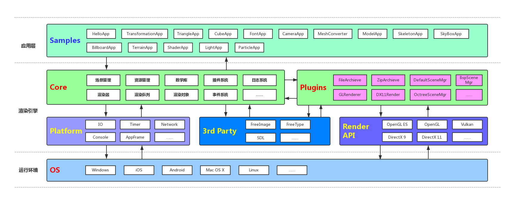

# 一起动手实现3D渲染引擎（Tiny3D ）
A Tiny 3D Engine

[TOC]

​	我曾经做过许多游戏非游戏类项目或者Demo，但是从来没有认真的把这中间的过程记录下来。写这些系列文章主要目的就是自己亲自动手实现一个渲染引擎，并且把中间经历过的所有都记录下来，作为一种沉淀积累以作未来回顾，做到温故而知新。有兴趣的小伙伴，可以跟着一起来动手实现一个渲染引擎。好，闲话休叙，那下面开始我们这段旅程。

# 一、整体设计

## 1.1 整体目标

　　所有事情开始都需要设定一个目标，只有一步一个脚印的向着明确目标走下去，才能到达终点。所以在这里我们简单设定一个设计目标，简单点说就是我们最终要完成的3D渲染引擎具备什么功能。以下简单罗列功能点：

1. 跨平台。支持：Windows、Mac OS X、iOS、Android、Linux五个主流的桌面平台和移动平台
2. 跨渲染API。支持：Open GL (3.0、4.0)、OpenGL ES（2.0、3.0）、Vulkan、DirectX 9、DirectX 11
3. 日志系统。支持：输出到文件和平台相关Console以方便定位问题
4. 数学库。支持：2D向量、3D向量、4D向量、四元素、3x3矩阵、4x4矩阵、三角函数、平面、距离运算、AABB碰撞检测、OBB碰撞检测、Sphere碰撞检测等
5. 内存管理。支持：智能指针
6. 场景管理。支持：内置默认场景管理器、场景剔除、简单Scene Graph组织场景物体、各种渲染物体对象
7. 渲染器。支持：不同渲染API使用统一接口通过插件形式无缝替换不同渲染API
8. 渲染队列。支持：对不同材质的物体做渲染队列的分层来实现渲染和提高渲染性能
9. 资源管理。支持：动态库、纹理、材质、网格、地形、字体、档案等资源的统一管理
10. 插件系统。支持：动态加载以切换不同的插件库
11. 图片加载系统。支持：PNG、JPG、JPEG、TGA、DDS、ETC、PVR等各种常用图片格式的图片加载和保存
12. 模型数据加载系统。支持：自定义格式模型文件加载和保存
13. 材质脚本系统。支持：vertex shader、fragment shader、HLSL的编译、HLSL到GLSL之间转译、材质参数的设定
14. 地形系统。支持：简单的高度图地形
15. 粒子系统。支持：粒子发射器、粒子的批次渲染、粒子缓存复用
16. 光照系统。支持：默认光照（顶点光照、像素光照）
17. 动画系统。支持：骨骼动画、软件蒙皮和硬件蒙皮
18. 字体管理。支持：TTF字体、BMFont字体
19. 事件系统。支持：事件注册、事件分发
20. FBX转自定义格式的工具。支持：支持在Windows上把FBX格式文件转换成自定义格式文件，方便引擎加载

从上面简单罗列来看，已经有很多功能了，看起来不可能完成，但是这个就是我们目标，我们不去尝试，怎么就知道无法实现呢？接下来，让我们一起朝着这个目标出发，前进！！！

## 1.2 整体架构

　　从上面目标来看，我们有很多功能点需要做。正所谓万丈高楼平地起，地基是需要打好的，所以下面我们来看看我们的整体架构设计，架构设计合理才能让我们后面的旅程事半功倍。我们就专业点来看看架构设计图：

图1-1

从图1-1来看，我们分成几大模块：

1. **Platform** —— 平台库，专门实现跨平台的功能，给上层提供平台无关的接口，统一平台的底层处理
2. **Plugins** —— 各种插件，引擎核心功能之外的各种可通过外部插件替换功能的插件
3. **3rd Party** —— 虽然我们引擎都是自己造车实现的，但是非引擎功能的部分，我们还是借助一些第三方库来实现其功能就好了
4. **Core** —— 渲染引擎核心模块，场景管理、资源管理、数学库、插件系统、渲染器、渲染队列、渲染对象、日志系统、事件系统等都在这里面实现了。当然，我们最后还是会简单分成多个库以实现可重用的模块分离。

简单的就说这么多了，下面按照这个标着目标的地图来逐步前进吧

# 二、开发环境

　　既然要开发，首先面对的是使用什么开发语言，这里的3D渲染引擎主要是使用C++来实现。为啥使用C++？因为性能好呀。那C更快，为啥不用C？因为C没有面向对象，抽象行为的实现比较麻烦，当然不是不能实现。那其他语言呢？实话实说，其他语言我也不精通啊，所以我们不纠结，果断选择C++吧。

　　选择好开发语言后，就要开始选择各种开发工具了。后面我们详细说说各种开发环境及其搭建。这里先说说另外一个问题。我们是跨平台开发，每种平台的代码工程都是多种多样、千差万别，那如何让我们工作更加简单呢？这里介绍一个简单的跨平台工程生成工具作为我们所有平台工程的基础工具。这个工具就是cmake。大家可以从cmake官网下载（官网地址：https://cmake.org/）。这里使用的版本是3.10.0。大家安装完cmake后，请记得设置好cmake命令行工具，因为接下来我们所有工程的生成都是依赖命令行来进行的，具体设置请参考官方文档，这里就不多说了。

　　接下来先从大家平时用得最多的Windows平台开始搭建环境

## 2.1 Windows开发环境搭建

　　我这里是直接用Win10和Visual Studio 2015作为开发工具的。

## 2.2 Android开发环境

## 2.3 iOS开发环境

## 2.4 Mac OS X开发环境