# Tiny3D 引擎架构文档

> 作者：Answer Wong | 许可证：MIT | 语言：C++17 | 构建系统：CMake  
> 支持平台：Windows / macOS / Linux / iOS / Android

---

## 一、整体分层架构

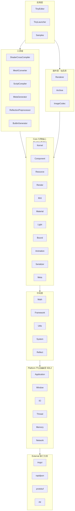

---

## 二、模块依赖关系

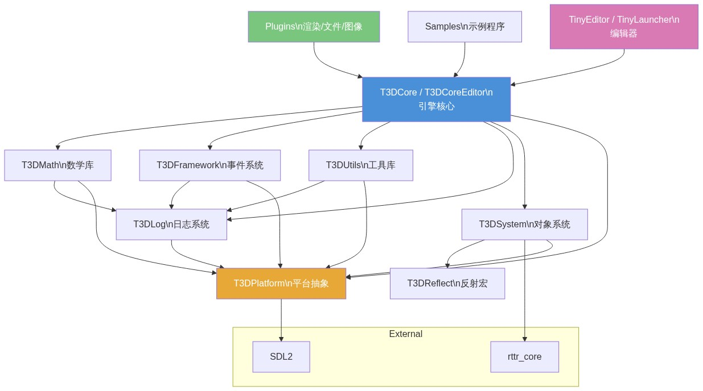

**构建目标一览：**

| 目录 | 库名 | 类型 | 职责 |
|------|------|------|------|
| `Platform/` | T3DPlatform | 动态库 | 平台抽象（窗口/IO/线程/内存/网络） |
| `Log/` | T3DLog | 动态库 | 分级日志系统 |
| `Utils/` | T3DUtils | 动态库 | 通用工具（哈希/编码/字符串/多叉树/Variant） |
| `Reflect/` | T3DReflect | 静态库 | 反射宏定义（TCLASS/TPROPERTY/TFUNCTION） |
| `System/` | T3DSystem | 动态库 | Object 基类 / SmartPtr / UUID / ObjectTracer |
| `Math/` | T3DMath | 动态库 | 全模板化数学库 |
| `Framework/` | T3DFramework | 动态库 | 事件系统（同步/异步/广播/多播） |
| `Core/Runtime/` | T3DCore | 动态库 | 引擎运行时核心 |
| `Core/Editor/` | T3DCoreEditor | 动态库 | 编辑器版本核心 |
| `Plugins/` | 各插件 | 动态库 | 渲染后端 / 文件系统 / 图像编解码 |
| `Editor/` | TinyEditor / TinyLauncher | 可执行文件 | 场景编辑器 / 项目启动器 |

---

## 三、核心子系统详解

### 3.1 对象系统 (`System/`)

引擎所有对象的根基，提供**引用计数 + 侵入式智能指针 + 运行时反射**。

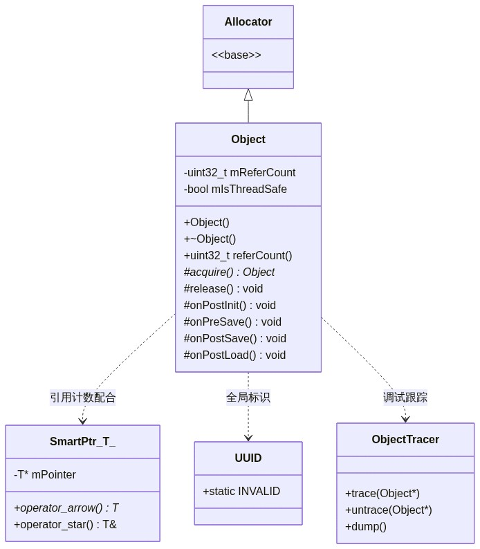

- **UUID**：全局唯一标识，用于 GameObject、Component、Resource 的索引
- **RTTR**：运行时类型反射库，配合自定义宏（`TCLASS` / `TPROPERTY` / `TFUNCTION` / `TENUM`）实现属性自动序列化/反序列化、编辑器属性面板、动态组件创建

### 3.2 平台抽象层 (`Platform/`)

使用**适配器/工厂模式**封装跨平台差异，底层依赖 SDL2：

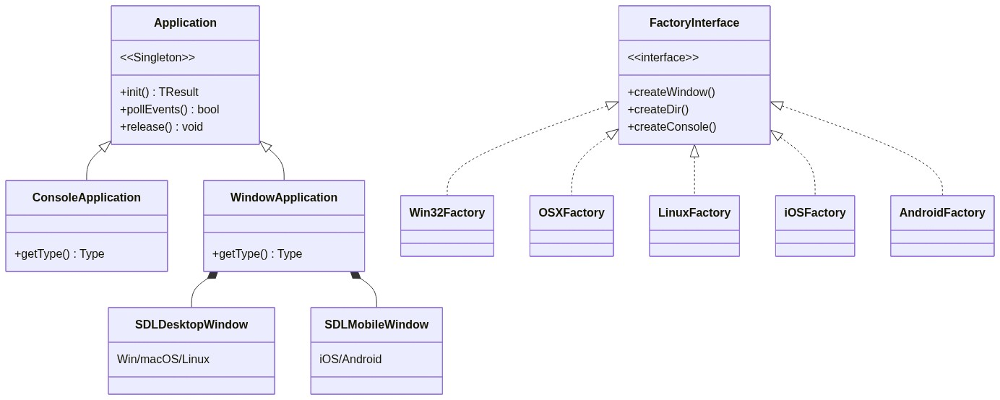

**Platform 子系统：**
- **IO**：DataStream / FileDataStream / MemoryDataStream / Dir / FileSystemMonitor
- **Thread**：RunnableThread / SyncObject / QueuedJobPool
- **Memory**：MemoryManager（Win32 下支持调试内存跟踪）
- **Network**：TCP Socket 封装
- **Time**：DateTime / TimerManager

### 3.3 引擎入口：Agent (`Core/Kernel/`)

`Agent` 是引擎的**核心单例**，相当于 Engine 类：

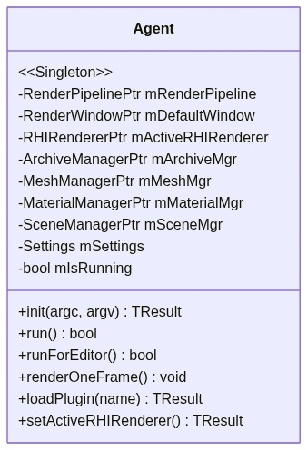

**每帧流程：**

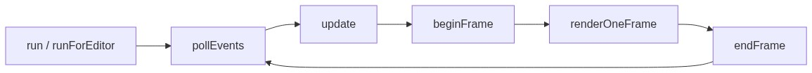

**Agent 持有的管理器：**
- ArchiveManager / SerializerManager / DylibManager
- MeshManager / SkeletonManager / AnimationManager
- MaterialManager / ShaderManager / TextureManager
- SceneManager / PrefabManager / ImageManager
- RenderStateManager / RenderBufferManager
- AnimationPlayerMgr

### 3.4 GameObject-Component 架构

采用**类 Unity 的 GameObject-Component 模式**：

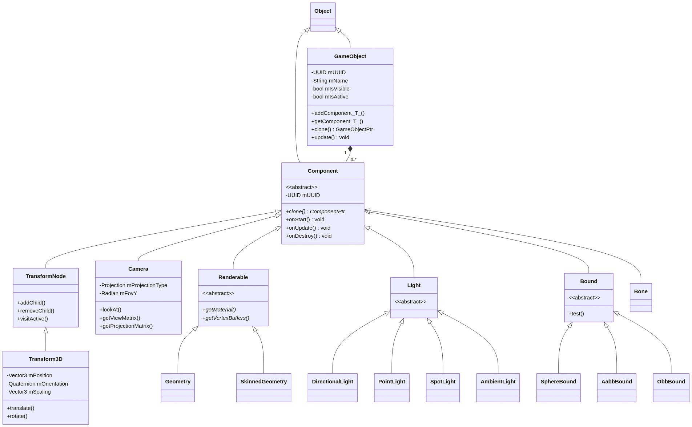

**GameObject 核心能力：**
- `addComponent<T>()` / `removeComponent<T>()` / `getComponent<T>()` — 组件增删查
- `clone()` — 深拷贝整棵子树（含所有组件和子节点）
- `collectHierarchy()` — 收集子树所有节点到扁平表
- `update()` → `frustumCulling()` → `setupLights()` — 每帧流程
- 组件按 `Settings` 中配置的优先级排序更新（Transform3D → Camera → Geometry）

### 3.5 资源管理 (`Core/Resource/`)

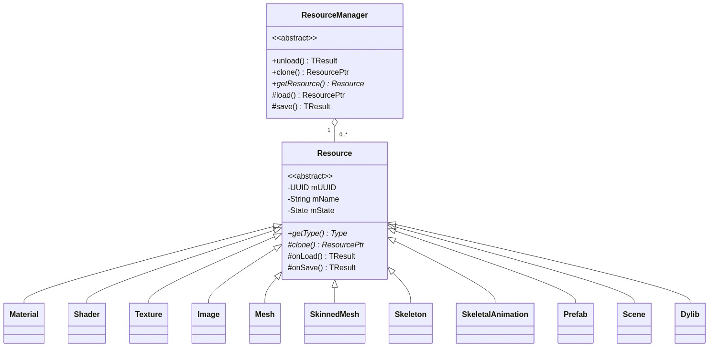

**ResourceManager 特性：**
- 每种资源由对应的 Manager 单例管理（MaterialManager、MeshManager 等）
- 双索引：UUID (Cache) + 文件名 (LUT)，避免重复加载
- 支持克隆、异步加载回调
- 资源状态：`kUnloaded → kLoading → kLoaded`

### 3.6 渲染管线 (`Core/Render/`)

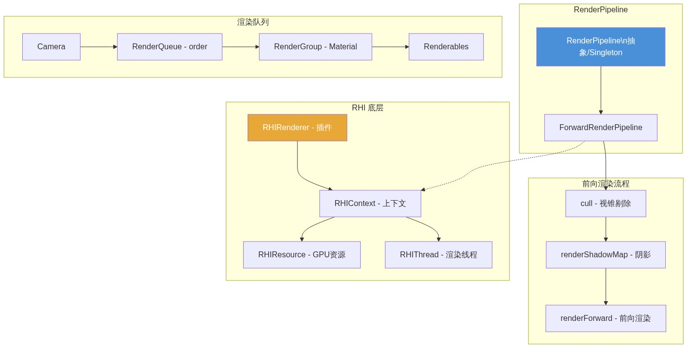

**支持的渲染后端（插件化，每个有 Runtime/Editor 版本）：**

| 后端 | 平台 | 状态 |
|------|------|------|
| Direct3D 11 | Windows | 主要后端 |
| D3D11Console | Windows（控制台） | 编辑器用 |
| Direct3D 9 | Windows | 可选 |
| OpenGL 3 | macOS/Linux | 可选 |
| OpenGL ES 2/3 | Android | 可选 |
| Vulkan | Android | 可选 |
| Metal | macOS/iOS | 可选 |
| Null Renderer | 全平台 | 空渲染器 |

### 3.7 材质系统

采用**类 Unity ShaderLab 的多层结构**：

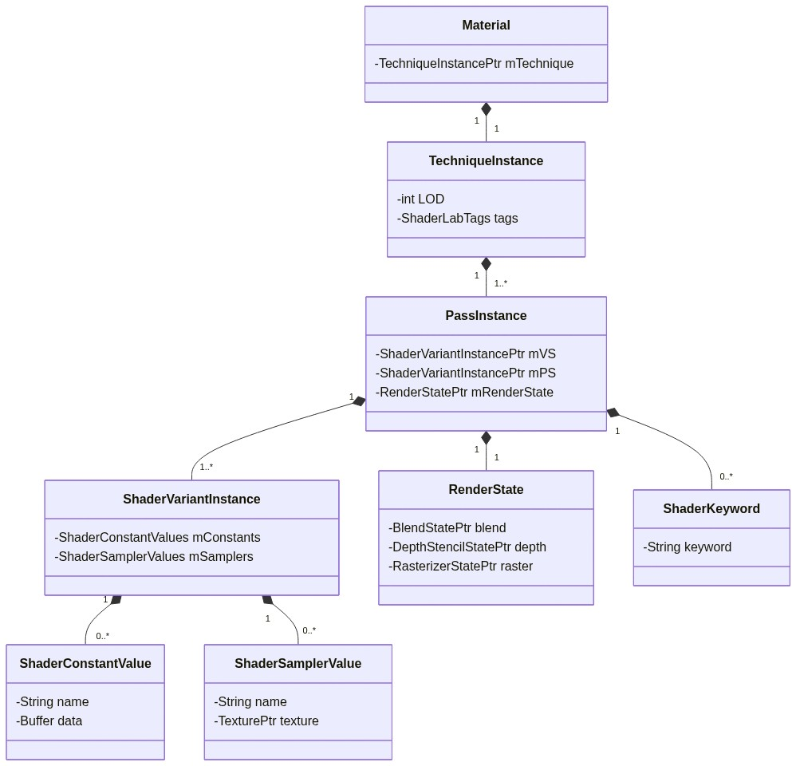

### 3.8 场景管理

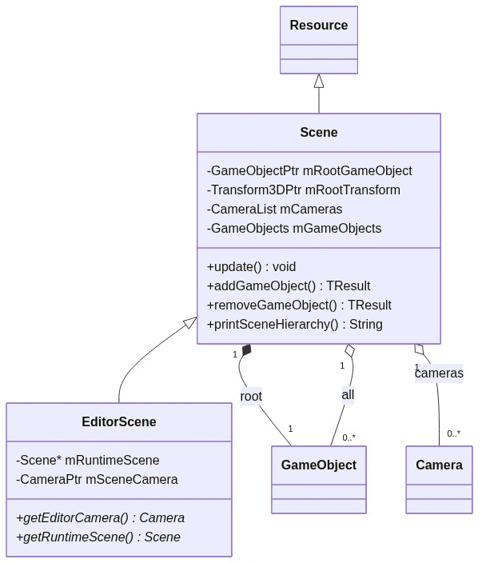

### 3.9 数学库 (`Math/`)

完全**模板化**，支持 float32 / float64 / fix32 / fix64：

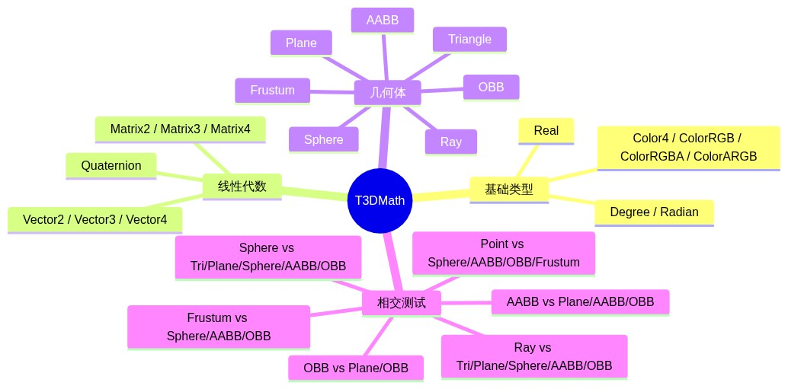

**约定：** 左手坐标系，矩阵 x 列向量，NDC z ∈ [-1, 1]，欧拉角顺序 Z-X-Y。

### 3.10 事件系统 (`Framework/`)

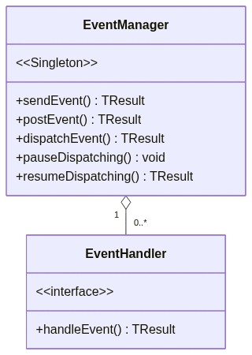

- 支持**同步**（sendEvent）和**异步**（postEvent）
- 支持**广播 / 多播 / 单播**三种模式
- **双缓冲**事件队列 + 时间限制 + 调用栈深度保护

### 3.11 序列化系统

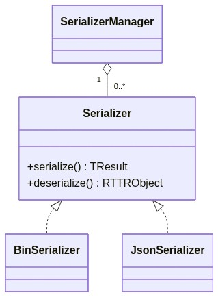

基于 RTTR 反射自动序列化/反序列化对象属性，支持二进制和 JSON（rapidjson）两种格式。

### 3.12 骨骼动画系统

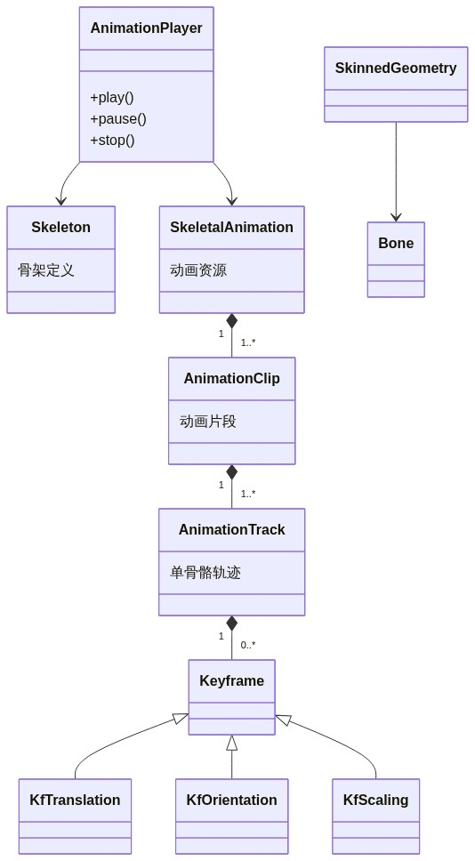

### 3.13 Meta 资产系统 (仅桌面/编辑器)

类似 Unity 的 `.meta` 文件机制，为每个资产维护 UUID 和元信息：

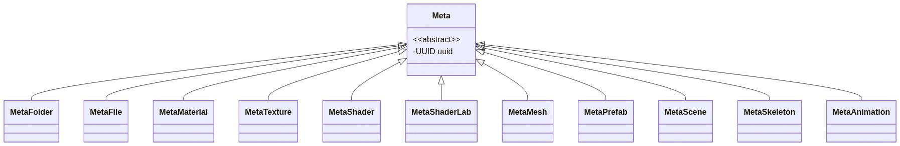

---

## 四、插件体系 (`Plugins/`)

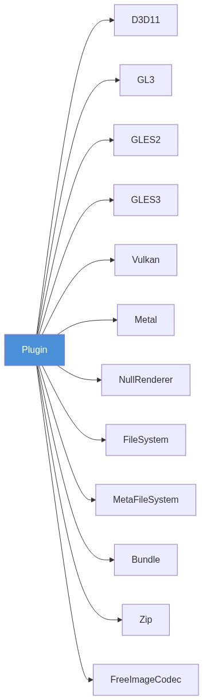

> 每个插件均有 **Runtime / Editor** 两个版本，编辑器版本链接 `T3DCoreEditor`。

---

## 五、工具链 (`Tools/`)

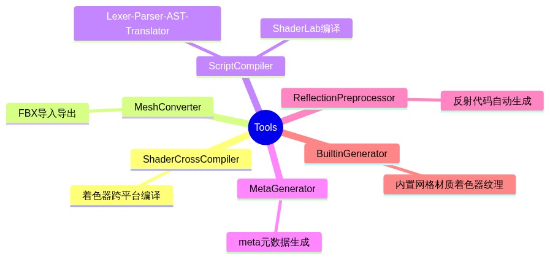

---

## 六、编辑器 (`Editor/`)

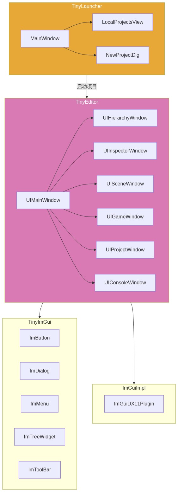

---

## 七、关键设计模式总结

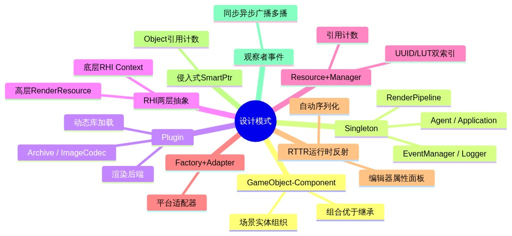

---

## 八、构建配置要点

- **C++17** 标准
- **CMake** 构建系统，模块路径：`CMake/Packages/`（FindSDL2 / FindDirectX11 等）
- 工程生成脚本：`Projects/generate-vs2019-x64-debug.bat` 等
- 关键 CMake 选项：

| 选项 | 说明 |
|------|------|
| `TINY3D_BUILD_SHARED_LIBS` | 动态库 / 静态库 |
| `TINY3D_BUILD_SAMPLES` | 构建示例程序 |
| `TINY3D_BUILD_TOOLS` | 构建工具链 |
| `TINY3D_BUILD_EDITOR` | 构建编辑器 |
| `TINY3D_BUILD_RTTR_TOOL` | 仅构建反射预处理工具 |
