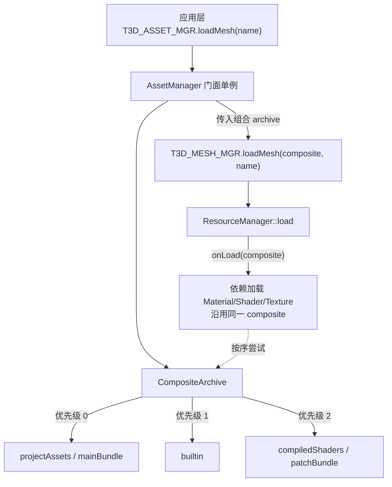
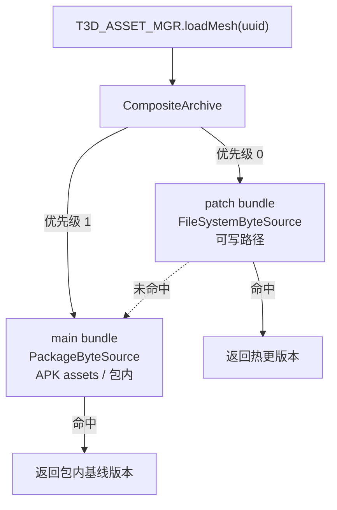

# AssetManager 资源加载门面设计

## 一、背景与动机

当前 Tiny3D 的资源加载是“显式 Archive + 两步”模型，应用层必须自己管理 `Archive`：

```cpp
ArchivePtr archive = T3D_ARCHIVE_MGR.loadArchive(path, ARCHIVE_TYPE_BUNDLE, Archive::AccessMode::kRead);
mMesh = T3D_MESH_MGR.loadMesh(archive, "tortoise.tmesh");
```

存在的问题：

- 应用层必须感知 `Archive` 的类型（`BundleFileSystem` / `MetaFileSystem` / ...）、路径与访问模式，业务代码与存储细节耦合。
- editor 与 runtime 的资源来源不同（editor 用 `MetaFileSystem`，runtime 用 `BundleFileSystem`），导致上层加载代码需要按模式分叉。
- 每一次 `loadMesh / loadTexture / loadMaterial / ...` 都要重复传入 `archive`。

**目标：** 引入统一资源门面单例 `AssetManager`，让应用层像 Unity `Resources.Load` 那样一步加载，无需感知 `Archive`：

```cpp
mMesh = T3D_ASSET_MGR.loadMesh("tortoise.tmesh");
```

editor 与 runtime 仅是“挂载哪种 archive 搜索链”的差别，业务加载代码完全一致。

---

## 二、设计目标

1. 应用层不再显式管理 `Archive`，加载接口无 `archive` 参数。
2. editor 模式挂载 `MetaFileSystem` 搜索链；runtime 模式挂载 `BundleFileSystem` 搜索链。
3. 支持“多 archive 搜索链”：按优先级在多个包/目录中查找资源（builtin + 工程/项目资源 + 补丁包）。
4. 跨包依赖加载（`Mesh -> Material -> Shader -> Texture`）自动生效，无需上层干预。
5. 现有 `ResourceManager` 与各 `*Manager` 的接口签名保持不变，旧代码可继续使用。
6. 为未来热更 / StreamingAssets（读取可写路径下的 bundle）预留平滑扩展点。

---

## 三、现状分析

### 3.1 Archive 抽象

`Archive`（`source/Core/Include/Kernel/T3DArchive.h`）是纯虚基类，提供 `read/write/exists/clone` 的按名与按 UUID 两套接口，用回调 + `DataStream` 模式隔离底层存储。`ArchiveManager`（`T3D_ARCHIVE_MGR`）按 `archiveType + name + accessMode` 缓存 archive 实例，通过 creator 注册各插件类型。

### 3.2 依赖加载沿调用链透传 archive（关键）

根 `loadXxx(archive, ...)` 传入的 `archive` 会经 `onLoad(archive)` 一路透传给依赖资源加载：

- `Mesh::onLoad` -> `generateRenderResource(archive)` -> `T3D_MATERIAL_MGR.loadMaterial(archive, ...)`（`source/Core/Source/Resource/T3DMesh.cpp`）
- `Material::onLoad` -> `T3D_SHADER_MGR.loadShader(archive, ...)` 与 `loadTexture(archive, ...)`（`source/Core/Source/Resource/T3DMaterial.cpp`）
- `Prefab/Scene` 反序列化 -> `Component::onLoadResource(archive)`（`source/Core/Source/Component/T3DGeometry.cpp`）

`Resource` 本身不保存 `archive` 指针，依赖加载完全依赖调用栈中的 `archive` 参数。这决定了“搜索链”不能只在门面层循环尝试，否则跨包依赖会拿错 archive（详见第五节）。

### 3.3 UUID 定位

`ResourceManager` 按 UUID 加载时不自行解析路径，完全委托 `archive->read(uuid, ...)`。`BundleFileSystem` 用 `bundle.manifest`（相对路径 → UUID、UUID 别名重定向）定位散列文件；`MetaFileSystem` 用 `MetaFSMonitor` 维护 UUID → 路径映射并支持跨 monitor 全局搜索。

### 3.4 editor 已是多 archive 结构

`ProjectManager`（`source/Editor/TinyEditor/ProjectManager.h`）已同时持有 `mAssetsArchive`、`mBuiltinArchive`、`mCompiledShadersArchive`（均 `MetaFileSystem`），印证“搜索链”方向。

---

## 四、总体架构



核心思路：新增一个自身实现 `Archive` 接口、内部按优先级委托子 archive 的 `CompositeArchive`。把它作为传给各 Manager 的唯一 archive，整条依赖链自动获得跨包搜索能力，且 `ResourceManager` / `Resource` 全部零改动。

---

## 五、方案对比（采用 A）

- 方案 A（采用）：门面 `AssetManager` + `CompositeArchive`。依赖链零侵入，天然支持搜索链，现有各 Manager 与 `ResourceManager` 不改签名。
- 方案 B（不采用）：门面内部保存 archive 列表并逐个 `loadXxx(archive, ...)` 尝试。问题：跨包依赖加载会失败（依赖用的是根 archive），需要改造 `ResourceManager` / 各 `onLoad` 让依赖也走门面，侵入大。
- 方案 C（后续演进）：把 `CompositeArchive` / 挂载点上升为 `ArchiveManager` 一等公民（新增 `mount/unmount/search`），门面更薄。本次先在门面内持有。

---

## 六、详细设计

### 6.1 CompositeArchive（Core 层）

- 新文件 `source/Core/Include/Kernel/T3DCompositeArchive.h` + `source/Core/Source/Kernel/T3DCompositeArchive.cpp`，继承 `Archive`。
- 内部持有有序 `TArray<ArchivePtr> mArchives`（按优先级）。
- `read(name, cb, ud)` / `read(uuid, cb, ud)`：依次委托子 archive，命中即返回，全部失败返回 `T3D_ERR_FILE_NOT_EXIST`。
- `exists(name)`：任一子 archive 存在即 true。
- `write(...)`：仅 editor 会用到，默认写入第一个子 archive（editor 下第一个即工程 assets 路径，可写）；runtime 不挂载可写链，若调用 `write` 直接 `assert` 断言不支持。
- `getArchiveType()` 返回 `"Composite"`；`clone()` 逐个克隆子 archive。

### 6.2 AssetManager 门面（Core 层）

- 新文件 `source/Core/Include/Resource/T3DAssetManager.h` + 对应 `.cpp`，`Singleton<AssetManager>`，宏 `T3D_ASSET_MGR`（参照 `source/Core/Include/Resource/T3DMeshManager.h` 的单例写法）。
- 模式枚举 `enum class Mode { kEditor, kRuntime }`（引擎首次引入该标志）。
- 挂载 API：`mount(ArchivePtr, int priority)` / `unmountAll()`，内部维护 `CompositeArchive`。
- 便捷初始化：`initEditor(...)` / `initRuntime(...)`，按模式创建并挂载对应 archive（类型字符串与路径由调用方或配置提供，门面不写死类型）。
- 门面加载接口（无 archive），内部转调现有 Manager 并传入组合 archive：
  - `loadMesh(name/uuid)` -> `T3D_MESH_MGR.loadMesh(composite, ...)`
  - `loadTexture` / `loadMaterial` / `loadShader` / `loadPrefab` / `loadScene` 同理。
- 现有各 `*Manager` 与其 `loadXxx(Archive*, ...)` 签名保持不变。

### 6.3 生命周期接入 Agent

在 `source/Core/Source/Kernel/T3DAgent.cpp` 现有 Manager 创建处（`mArchiveMgr = ArchiveManager::create()` 附近）创建 `AssetManager` 单例，销毁时对称释放。门面创建但不自动挂载，挂载由上层按模式触发。

### 6.4 editor 模式挂载策略

复用 `source/Editor/TinyEditor/ProjectManager.cpp` 打开工程流程，在其加载 `mAssetsArchive` / `mBuiltinArchive` / `mCompiledShadersArchive`（均 `MetaFileSystem`）后，调用 `T3D_ASSET_MGR.mount()` 依次挂载，优先级：assets > compiledShaders > builtin；关工程时 `unmountAll()`。

### 6.5 runtime 模式挂载策略

在 runtime 启动流程（Application 初始化）挂载 `BundleFileSystem`（桌面）/ 平台对应 bundle，优先级：主包 > 补丁包 > builtin 包。参照 `source/Samples/ResourceApp/ResourceApp.cpp` 现有 bundle 加载路径。

### 6.6 渐进迁移调用点

先让门面可用并保留旧 API，逐步把 Sample / Editor 里 `loadArchive + loadXxx(archive, ...)` 改为 `T3D_ASSET_MGR.loadXxx(name)`。首批迁移 `ResourceApp`，作为 runtime 门面用法样例。

---

## 七、已确认的设计决策

- 写回（save）语义：保存只在 editor 使用。`CompositeArchive.write` 默认写入第一个子 archive——editor 下第一个即工程 assets 路径（可写）。runtime 模式不挂载可写链，调用 `write` 直接 `assert` 断言不支持，不做静默降级。
- runtime 平台策略：Android runtime 直接用 `BundleFileSystem`（支持 UUID + manifest），不走 `FileSystem`。`FileSystem` / `AndroidAsset` 暂不支持按 UUID 读取，本次不补该能力。
- Android 下 `AAssetManager` 是透明的实现细节，门面 / 搜索链无需感知：`BundleFSArchive::readRaw` 经 Platform 层 `Dir::openAsset` 读取，Android 上 `AndroidDir::openAsset` 通过 `T3D_ZIP_ASSET_MGR.getNativeHandle()` 拿 `AAssetManager*` 直读 APK `assets/` 内的 bundle。因此：
  - runtime 只需挂 `BundleFileSystem`，不需要额外挂 `AndroidAsset` archive 插件（该插件仅用于 `loadConfig` 读 `Tiny3D.cfg`）。
  - bundle 由 CMake POST_BUILD 打进 APK `assets/`，运行时直接 AAsset 读取，不需要 `extractToPath` 提取。
  - 前提：Java 层 `Tiny3DActivity.onCreate -> initAssetManager` 已提前注册 `AAssetManager`（现状已满足）。

---

## 八、未来扩展（不在本次实现）：可插拔字节来源，支持热更 / StreamingAssets

> 目标：像 Unity AssetBundle 那样，从可写路径（`persistentDataPath` 之类）读取下载 / 热更的 bundle，而不是只读包内资源。本节为前瞻设计，本次不落地，但当前实现须遵守末尾的“设计约束”，保证未来平滑接入。

### 8.1 背景问题

当前 `BundleFileSystem` 把两件事耦合在了一起：

- bundle 的“格式解析”（`bundle.manifest`、UUID → 散列文件名映射）——与来源无关。
- 字节的“存储后端”——Android 上 `AndroidDir::openAsset` 写死了 `AAssetManager`，只能读 APK 内 `assets/`，读不到可写路径。

热更需要“同一套 bundle 格式 + 不同存储后端（包内 / 可写路径 / 未来网络）”。

### 8.2 方案二：把字节来源抽象成 provider

将 `BundleFSArchive` 依赖的“字节读取”抽象为 `IArchiveByteSource`，格式逻辑与来源彻底解耦：

```cpp
// source/Plugins/Archive/BundleFileSystem/Include/T3DArchiveByteSource.h
namespace Tiny3D
{
    // 只负责“给定相对路径 -> 打开字节流”，不理解 bundle 格式
    class IArchiveByteSource
    {
    public:
        virtual ~IArchiveByteSource() = default;
        // 打开根路径下的相对文件（散列文件名 / bundle.manifest）
        virtual DataStream *open(const String &relativePath) = 0;
        virtual bool exists(const String &relativePath) const = 0;
        virtual String getRoot() const = 0;
    };
}
```

两个实现（未来可加 `NetworkByteSource`）：

- `PackageByteSource`：包内只读资源。内部走 `Dir::openAsset`（Android = `AAssetManager`，桌面 / iOS = `FileDataStream`）。对应现状。
- `FileSystemByteSource`：可写路径 / StreamingAssets。内部直接用 `FileDataStream::open(absolutePath)`，读 `Dir::getWritablePath()` / `Dir::getCachePath()` 下的 bundle。

`BundleFSArchive` 改造为持有 provider，`readRaw` 不再直接 `Dir::openAsset`：

```cpp
// 改造后：readRaw 委托 provider，格式逻辑不变
TResult BundleFSArchive::readRaw(const String &relativeName,
    const ArchiveReadCallback &callback, void *userData)
{
    DataStream *stream = mByteSource->open(relativeName);   // 来源可插拔
    if (stream == nullptr) return T3D_ERR_FILE_NOT_EXIST;
    // ... manifest / UUID 解析逻辑保持不变
}
```

### 8.3 来源类型如何选择

`ArchiveManager` 的 creator 签名为 `(const String &name, AccessMode)`，用新增 archiveType 常量区分来源，creator 内注入对应 provider：

- `ARCHIVE_TYPE_BUNDLE`（现状，包内）-> 注入 `PackageByteSource`
- `ARCHIVE_TYPE_BUNDLE_FS`（新增，可写路径）-> 注入 `FileSystemByteSource`

两者复用同一个 `BundleFSArchive` + `BundleManifest` 格式代码，仅 provider 不同。

### 8.4 热更时的用法（门面 / CompositeArchive 零改动）

```cpp
// 高优先级：可写路径下载 / 热更的补丁包（文件系统来源）
auto patch = T3D_ARCHIVE_MGR.loadArchive(
    Dir::getWritablePath() + "/patch", ARCHIVE_TYPE_BUNDLE_FS, Archive::AccessMode::kRead);
T3D_ASSET_MGR.mount(patch, /*priority*/ 0);

// 低优先级：APK / 包内初始主包（包内来源）
auto main = T3D_ARCHIVE_MGR.loadArchive(
    Dir::getResourcePath("assets/bundle"), ARCHIVE_TYPE_BUNDLE, Archive::AccessMode::kRead);
T3D_ASSET_MGR.mount(main, /*priority*/ 1);
```

同一 UUID 先命中可写路径的新版本，未命中回退包内——正是 `CompositeArchive` 搜索链的天然能力。



### 8.5 平台差异

- Windows / Linux / macOS：包内与可写路径都是普通文件系统，`FileSystemByteSource` 即可覆盖，甚至无需区分来源。
- iOS：包内为 app bundle 目录（普通文件路径），可写为 `Documents`，两者都可用 `FileSystemByteSource`。
- Android：唯一需要 `PackageByteSource`（`AAssetManager`）的平台——因为 APK 内 `assets/` 无法用 `fopen` 直读；可写路径（`filesDir`）用 `FileSystemByteSource`。

即真正需要“特殊后端”的只有 Android APK assets，其余平台两种来源都归一到文件系统。

### 8.6 本次实现须遵守的设计约束（为未来铺路）

- `AssetManager` 门面与 `CompositeArchive` 必须保持“来源无关”：只认 `Archive` 接口 + 优先级，绝不感知平台 / 包内 / 可写路径 / `AAssetManager`。
- 不要把 `openAsset` 的“包内语义”泄漏到门面或搜索链层。
- `mount(ArchivePtr, priority)` 保持通用，未来热更只是“多 mount 一个更高优先级的 archive”，不需要新增门面 API。

---

## 九、实施步骤

1. 新增 `CompositeArchive`（继承 `Archive`）：`read/exists` 按优先级委托子 archive；`write` 默认写第一个子 archive（editor），runtime 无可写链时 `write` 直接 `assert`。
2. 新增 `AssetManager` 门面单例（`T3D_ASSET_MGR`）：含 `Mode` 枚举、`mount/unmountAll`、`loadMesh/Texture/Material/Shader/Prefab/Scene` 无 archive 接口。
3. 在 `T3DAgent` 中创建 / 销毁 `AssetManager` 单例。
4. `ProjectManager` 打开 / 关闭工程时挂载 / 卸载 `MetaFileSystem` 搜索链（assets > compiledShaders > builtin）。
5. runtime 启动流程挂载 `BundleFileSystem` 搜索链（主包 > 补丁包 > builtin），Android 同样用 `BundleFileSystem`，不走 `FileSystem`。
6. 迁移 `ResourceApp` 等调用点到 `T3D_ASSET_MGR`，验证一步加载与跨包依赖。
7. （未来）实现第八节可插拔字节来源，支持热更 / StreamingAssets。

---

## 十、关键文件索引

- Archive 基类：`source/Core/Include/Kernel/T3DArchive.h`
- ArchiveManager：`source/Core/Include/Kernel/T3DArchiveManager.h`
- ResourceManager 加载逻辑：`source/Core/Source/Resource/T3DResourceManager.cpp`
- 依赖透传：`source/Core/Source/Resource/T3DMesh.cpp`、`source/Core/Source/Resource/T3DMaterial.cpp`
- Mesh Manager 接口样例：`source/Core/Include/Resource/T3DMeshManager.h`
- BundleFileSystem 插件：`source/Plugins/Archive/BundleFileSystem/`
- MetaFileSystem 插件：`source/Plugins/Archive/MetaFileSystem/`
- Android 文件抽象：`source/Platform/Source/Adapter/Android/T3DAndroidDir.cpp`
- 可写路径接口：`source/Platform/Include/IO/T3DDir.h`
- Engine 初始化：`source/Core/Source/Kernel/T3DAgent.cpp`
- editor 多 archive：`source/Editor/TinyEditor/ProjectManager.h` / `.cpp`
- 示例用法：`source/Samples/ResourceApp/ResourceApp.cpp`
