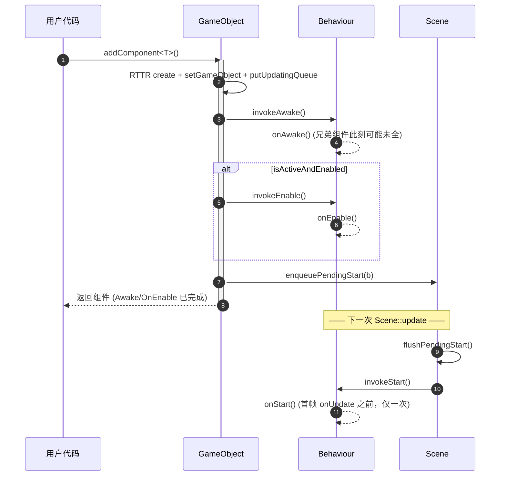
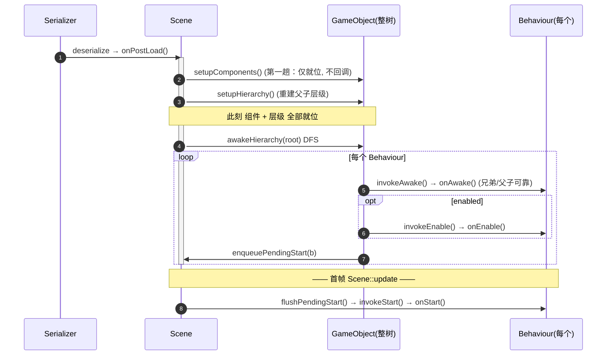
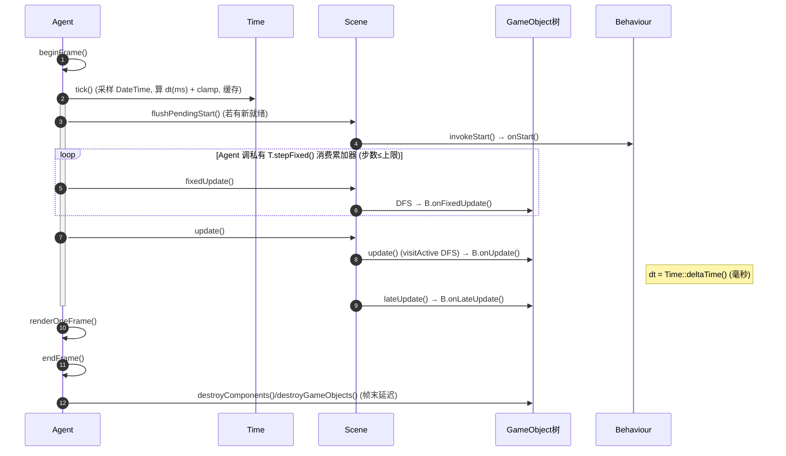
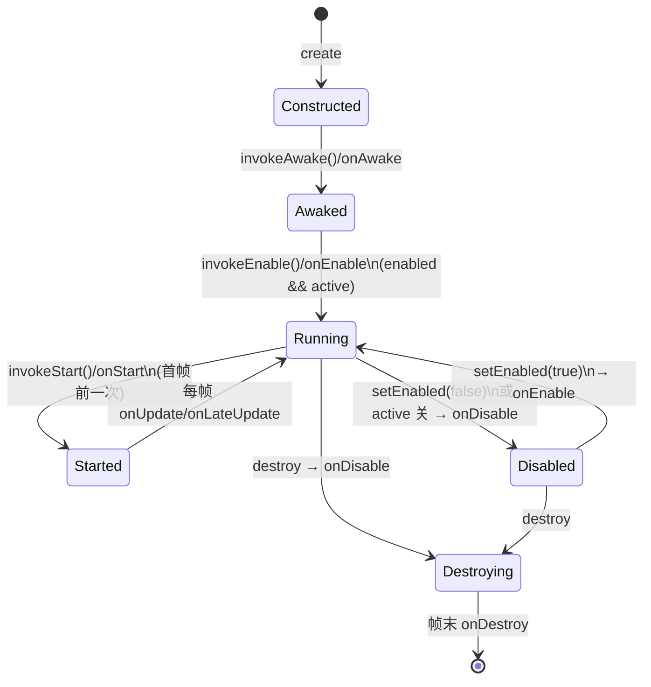

# Behaviour 脚本组件系统设计与改造计划（对齐 Unity MonoBehaviour）

> 目标：让开发者能够「写一个脚本类、挂到 GameObject 上、用它驱动该 GameObject 的行为」，对齐 Unity 的 **MonoBehaviour** 体验。核心是在现有 `Component` 之上引入面向 gameplay 的 **`Behaviour` 基类**，补齐**组件级 enabled 开关**与**完整生命周期回调**（Awake / OnEnable / Start / Update / LateUpdate / OnDisable / OnDestroy），并复用现有 RTTR 反射 + 序列化 + 编辑器属性面板，使脚本字段可序列化、可在 Inspector 调参。

---

## 1. 背景与目标

Tiny3D 已经是 **GameObject + Component** 架构，与 Unity 对象模型高度相似，并具备 RTTR 反射、自动序列化、按类名动态 `addComponent("XXX")` 的能力。但目前**没有面向 gameplay 的脚本组件**：要写游戏逻辑只能直接继承 `Component` 或 `EventHandler`，且生命周期回调不完整、缺少组件级开关、缺少播放/编辑态区分。

本方案目标：

1. 提供一个 `Behaviour` 基类，开发者继承它即可编写 gameplay，并能挂到任意 GameObject。
2. 提供对齐 Unity 的完整生命周期与确定的调用时机。
3. 提供组件级 `enabled`（独立于 GameObject 的 `Active`）。
4. 复用现有序列化/反射，脚本字段自动持久化并在编辑器暴露。
5. 区分 Play / Edit 模式，脚本逻辑默认仅在播放态执行。
6. 为将来嵌入脚本语言（**TypeScript + V8**，见 §6.2）预留桥接点。

---

## 2. 现状分析

### 2.1 现有对象/组件模型与 Unity 的对应

| Unity 概念 | Tiny3D 现状 | 差距 |
|---|---|---|
| `GameObject` | `GameObject`（`source/Core/Include/Kernel/T3DGameObject.h`，组件容器） | 基本一致 |
| `Component` | `Component`（`source/Core/Include/Component/T3DComponent.h`，继承 `Object`） | 基本一致 |
| `Transform` | `Transform3D` / `TransformNode`（承载父子层级树） | 一致 |
| `MonoBehaviour`（可挂脚本、写 gameplay） | **缺失**，只能直接继承 `Component`/`EventHandler` | 核心缺口 |
| `Awake / OnEnable / Start / Update / LateUpdate / OnDisable / OnDestroy` | 仅 `onStart()` / `onUpdate()` / `onDestroy()` | 生命周期不完整 |
| `enabled`（组件级开关） | **无**，只有 GameObject 级 `Active` / `Visible` | 缺组件级开关 |
| 脚本字段在 Inspector 暴露 + 序列化 | RTTR `TPROPERTY` + `ReflectionPreprocessor` 已具备 | 可直接复用 |
| Play / Edit 模式区分 | **无**，编辑器与运行时跑同一个 `Agent::update()` | 缺 play mode |
| `[ExecuteInEditMode]` | 无 | 缺 |

### 2.2 现有生命周期与调度

`Component`（`source/Core/Include/Component/T3DComponent.h`）只暴露三个回调：

```cpp
virtual void onStart();                       // 默认空实现
virtual void onUpdate();                       // 默认空实现
virtual void onLoadResource(Archive *archive); // 资源加载
// 受保护：
virtual void onDestroy();                      // 默认置空 mGameObject + 注销
virtual ComponentPtr clone() const = 0;        // 纯虚，子类必须实现
```

更新调用链（已确认）：

```
Agent::run() / runForEditor()
  └── Agent::update()                                  // T3DAgent.cpp:695
        └── Scene::update()
              └── GameObject(root)::update()           // T3DGameObject.cpp:303
                    └── TransformNode::visitActive(...) // 仅遍历 active 节点（DFS）
                          └── GameObject::onUpdate()    // T3DGameObject.cpp:328
                                ├── 按 updateOrders 顺序的组件 onUpdate()
                                └── 无序队列组件 onUpdate()
```

组件挂载时机（已确认）：

- `GameObject::addComponent()`（`T3DGameObject.cpp:503`）：RTTR `type.create()` → `setGameObject` → `putUpdatingQueue` → **立即 `onStart()`**（`:548`）。
- 反序列化 `GameObject::setupComponents()`（`:471`）：逐个组件 `setGameObject` → `putUpdatingQueue` → **立即 `onStart()`**（`:479`）。
- 销毁延迟到帧末：`Agent::endFrame()`（`T3DAgent.cpp:709`）调用 `GameObject::destroyComponents()` / `destroyGameObjects()`。

更新顺序：`GameObject::putUpdatingQueue()`（`:443`）按 `Settings.componentSettins.updateOrders`（默认 `Transform3D → Camera → Geometry`）将组件放入有序队列 `mUpdateComponents`；不在列表的组件放入无序 `mUpdateComponents2`（multimap）。

### 2.3 现状隐患（设计中必须处理）

1. **`onStart()` 调用时机过早**：在 `addComponent` 刚加入时即调用，反序列化也逐个调用。脚本若在 `onStart` 里 `getComponent<其它组件>()` 可能拿不到尚未添加的兄弟组件。Unity 用 `Awake`（实例化即全部就绪）+ `Start`（首帧前）两段式解决。
2. **脚本组件默认进无序队列**：`updateOrders` 没有脚本段位，更新次序不确定。
3. **`clone()` 是纯虚**：每个 `Component` 子类都要手写 `clone()`，对 gameplay 脚本是负担。
4. **编辑器无播放态**：`runForEditor()`（`T3DAgent.cpp:731`）每帧照常 `update()`，脚本逻辑会在编辑模式也执行。
5. **`onUpdate()` 无 deltaTime**：gameplay 普遍需要帧间隔。

### 2.4 涉及的关键文件

| 模块 | 文件 |
|---|---|
| 组件基类 | `source/Core/Include/Component/T3DComponent.h`、`source/Core/Source/Component/T3DComponent.cpp` |
| GameObject | `source/Core/Include/Kernel/T3DGameObject.h`、`source/Core/Source/Kernel/T3DGameObject.cpp` |
| 引擎主循环 | `source/Core/Include/Kernel/T3DAgent.h`、`source/Core/Source/Kernel/T3DAgent.cpp` |
| 设置/更新顺序 | `source/Core/Include/Kernel/T3DSettings.h` |
| 场景 | `source/Core/Include/Resource/T3DScene.h`、`source/Core/Source/Resource/T3DScene.cpp` |
| 变换/层级 | `source/Core/Include/Component/T3DTransformNode.h`、`T3DTransform3D.h` |
| 反射宏 | `source/System/Include/T3DSystem.h`（`TCLASS/TPROPERTY/TFUNCTION/TRTTI_ENABLE`） |
| 反射代码生成 | `source/Tools/ReflectionPreprocessor/` |
| 序列化 | `source/Core/Include/Serializer/T3DSerializerManager.h` |

---

## 3. 核心设计决策

> **在 `Component` 与具体 gameplay 之间，插入一个 `Behaviour` 基类（对标 Unity 的 `Behaviour` / `MonoBehaviour`），承载「组件级 enabled + 完整生命周期 + 默认 clone」。开发者继承 `Behaviour`，用 `TCLASS` / `TPROPERTY` 标注，即可被 `addComponent` 挂载、被序列化、在编辑器面板暴露字段。**

### 3.1 为什么 enabled 放在 Behaviour 而不是 Component

与 Unity 一致：`Transform` 等不可禁用的组件不继承 `Behaviour`。把 `enabled` 与生命周期放在 `Behaviour`，既能让脚本拥有开关，又不污染 `Transform3D / Camera / Geometry / Light` 等内置组件的语义。

### 3.2 类层次

```
Object
└── Component                       (现有，保留不动)
    ├── TransformNode → Transform3D  (现有内置组件，不继承 Behaviour)
    ├── Camera / Geometry / Light …  (现有内置组件)
    └── Behaviour                    ★新增：可启用/禁用 + 完整生命周期
        ├── (用户) PlayerController : Behaviour
        ├── (用户) Rotator          : Behaviour
        └── ScriptBehaviour         ☆路线 B 预留：桥接到 TypeScript(V8) 脚本对象
```

### 3.3 两条路线

| 路线 | 内容 | 取舍 |
|---|---|---|
| **A（先做，推荐）** | C++ 原生 `Behaviour`。脚本 = 编译进 DLL/插件的 C++ 派生类 | 与 Unity 编译后的 MonoBehaviour 引擎侧语义等价；工程量小、性能最好；完全复用现有 RTTR / 序列化 / 插件体系 |
| **B（长期可选）** | 在 A 之上做 `ScriptBehaviour`，桥接到 **TypeScript + V8**（见 §6.2） | 可「不重编译改 gameplay」、编译期类型安全、脚本可复用到 web/小游戏；但需 V8 绑定层、C++/JS 生命周期协调、热重载，工程量大 |

本计划主体为路线 A，并在 §6 说明如何为路线 B 预留接口。

---

## 4. Behaviour 生命周期设计（路线 A 核心）

### 4.1 回调与调用时机

| 回调 | 调用时机 | 次数 | 条件 |
|---|---|---|---|
| `onAwake()` | **同步、立即**：在实例化调用栈内、返回前完成（非延迟到下一帧）。Instantiate/反序列化先把整树构建就位再同步遍历调用；单个 `addComponent` 在构建后立即调用 | 1 | 进入 Play（或 ExecuteInEditMode） |
| `onEnable()` | **同步**：紧随 `onAwake` 之后（或 `enabled` false→true 时）立即调用 | N | enabled |
| `onStart()` | **延迟**：第一次 `onUpdate()` 之前统一 flush 调用（唯一延迟到统一点的初始化回调） | 1 | 已 enabled |
| `onUpdate(dt)` | 每帧 | 每帧 | enabled && GameObject.active |
| `onLateUpdate(dt)` | 每帧，在所有 `onUpdate` 之后 | 每帧 | enabled && GameObject.active |
| `onFixedUpdate(fdt)`（可选） | 固定步长（接物理时） | 0~N | enabled && GameObject.active |
| `onDisable()` | `enabled` true→false，或销毁前 | N | — |
| `onDestroy()` | 帧末延迟销毁时 | 1 | 已 Awake 过 |

> 兼容性：保留 `Component::onStart()` / `onUpdate()` 现有**无参**签名，`Behaviour` 在其上引入 **Awake/OnEnable 同步 + Start 延迟** 的初始化模型。所有回调均不带 dt 参数，帧间隔由全局 `Time` 单例提供（见 §4.5），与 Unity `Time.deltaTime` 一致。

### 4.2 初始化模型：Awake/OnEnable 同步、Start 延迟

对齐 Unity 真实时机：**`Awake` / `OnEnable` 是同步的，在实例化的调用栈内、函数返回前就执行完毕；只有 `Start` 延迟到首帧 `Update` 之前的统一点**。切忌把 Awake 也排队到下一帧（那是 Start 的语义）。

按两条实例化路径分别处理 Awake/OnEnable：

1. **`Instantiate(prefab)` / 反序列化（`setupComponents`）**：先把整棵对象 + 组件树**全部构建并就位**（先 `setupHierarchy()` 重建父子层级、所有组件 `setGameObject` 完成），**然后在同一调用内**同步遍历每个 `Behaviour` 调 `onAwake() → onEnable()`，再返回。此时兄弟组件、父子层级均已就位，`getComponent` 可靠。
2. **单个 `addComponent()`**：构建该组件后**立即同步**调 `onAwake() → onEnable()`。这与 Unity 一致——此刻尚未添加的兄弟组件本来就拿不到（已知语义，不应靠延迟来掩盖）。

`Start` 则统一延迟：上述任一路径新就绪的 `Behaviour` 推入 **pending-start 队列**，在首次 `onUpdate()` 之前 flush，调 `onStart()`（仅 enabled，一次）。

此模型**修复 §2.3-1 的隐患**靠的是「整树先就位、再同步 Awake」（路径 1），而**不是**把回调延迟到下一帧。

### 4.3 组件级 enabled 与更新过滤

- `Behaviour` 增加 `bool mEnabled{true}` + `setEnabled()` / `isEnabled()`，标注 `TPROPERTY` 以序列化并在 Inspector 显示。
- 「有效执行 = `GameObject.active && behaviour.enabled`」。`GameObject::update()` 已用 `visitActive` 过滤 active；在 `GameObject::onUpdate()`（`T3DGameObject.cpp:328`）遍历组件时再加 `if (auto b = dynamic/rttr_cast<Behaviour>(comp); b && !b->isEnabled()) continue;`。
- `setEnabled()` 切换时触发 `onEnable()` / `onDisable()`。

### 4.4 更新顺序与 LateUpdate

- 在 `Settings.componentSettins.updateOrders`（`T3DSettings.h`）中为脚本预留段位（如追加 `"Behaviour"`，或预留一段优先级区间），让脚本组件具有确定更新次序，而非落入无序 `mUpdateComponents2`。
- **LateUpdate** 建议在 `Scene::update()` 层分两趟遍历：先全场景 `onUpdate`，再全场景 `onLateUpdate`，符合 Unity「LateUpdate 总在所有 Update 之后、跨对象」的语义。

### 4.5 全局 Time 单例（基于 DateTime）

不给回调传 dt 参数，而是提供一个**引擎层 `Time` 单例**，用户在 `onUpdate` / `onFixedUpdate` 内按需 `Time::deltaTime()` 取回，完全对齐 Unity 的 `Time.deltaTime`。

**底层时钟源**：基于 `DateTime`（`source/Platform/Include/Time/T3DDateTime.h`）的 `currentMSecsSinceEpoch()`（毫秒、自 1970 epoch）。

**推进方式**：`Agent::beginFrame()` 每帧采样一次当前时间，由 `Time` 内部算出本帧 `deltaTime`（毫秒）并**缓存**；用户在该帧内任意位置、任意次读取 `deltaTime()` 都得到同一固定值（与 Unity 语义一致）。

#### 4.5.1 单例形态（沿用引擎 `Singleton<T>`）

引擎现有单例（`Agent`、`ObjectTracer` 等）统一继承 `Singleton<T>`（`source/Platform/Include/T3DSingleton.h`）：**构造时即把 `this` 写入 `m_pInstance`**（非懒加载），通过 `getInstance()` / `getInstancePtr()` 访问，并配宏（如 `T3D_AGENT`）。`Time` 照此模式，由 `Agent` 显式持有、负责创建与销毁。

**时间单位约定**：`Time` 内所有**保存的与返回的时间量一律用 `uint64_t` 毫秒**，不使用浮点数——与底层 `DateTime::currentMSecsSinceEpoch()` 天然对齐，累计不漂移、跨平台稳定。`timeScale` 是比例系数而非时间量，用**千分比整数**表示（`1000 = 1.0x`、`500 = 0.5x`、`0 = 暂停`），使 dt 计算保持全整数。

**访问控制**：`start / tick / stepFixed` 三个**驱动接口**设为 `private`，配置写入 `setFixedDeltaTime / setMaximumDeltaTime` 设为 `protected`，仅将 `Agent` 声明为 `friend`，杜绝外部（含 `Scene` / 用户脚本）误调。即便是友元 `Agent`，也**不直接写私有成员**（如 `mTime->mFixedDeltaTime = ...`），一律通过 `setXXX` 封装设置，保持不变量与后续校验的单一入口。只读取值接口与 `setTimeScale`（运行期慢放/暂停）公开。

```cpp
// source/Core/Include/Kernel/T3DTime.h（新增）
namespace Tiny3D
{
    class T3D_ENGINE_API Time : public Singleton<Time>
    {
        friend class Agent;   // 仅 Agent 可驱动 start/tick/stepFixed

    public:
        Time() = default;
        ~Time() = default;

        // —— 实例只读访问（单位：毫秒 ms；帧内固定值）——
        uint64_t getDeltaTime()         const { return mDeltaTime; }      // 已应用 timeScale (ms)
        uint64_t getUnscaledDeltaTime() const { return mUnscaledDelta; }  // 未缩放 (ms)
        uint64_t getTime()              const { return mTime; }           // 累计已缩放 (ms)
        uint64_t getUnscaledTime()      const { return mUnscaledTime; }   // 累计真实 (ms)
        uint64_t getFixedDeltaTime()    const { return mFixedDeltaTime; } // 固定步长 (ms)
        uint64_t getFrameCount()        const { return mFrameCount; }
        uint32_t getTimeScale()         const { return mTimeScale; }      // 千分比，1000=1.0x
        void     setTimeScale(uint32_t permille) { mTimeScale = permille; }  // 运行期慢放/暂停，公开

    protected:
        // —— 配置写入：仅供 Agent（友元）在 init 注入；即便友元也走 setter，不直接写成员 ——
        void setFixedDeltaTime(uint64_t ms)   { mFixedDeltaTime = ms; }
        void setMaximumDeltaTime(uint64_t ms) { mMaxDeltaTime = ms; }

    private:
        // —— 驱动：仅 Agent（友元）可调用 ——
        void start();                 // init 时采样基准时刻，清零累计量
        void tick();                  // beginFrame 每帧推进一次，计算并缓存本帧 dt
        bool stepFixed();             // 消费一个固定步长，供 Agent 的 FixedUpdate 循环驱动（见 4.5.4）

    private:
        uint64_t mStartMSec    {0};   // 启动基准（currentMSecsSinceEpoch）
        uint64_t mLastMSec     {0};   // 上一帧时刻 (ms)
        uint64_t mDeltaTime    {0};   // 本帧已缩放间隔 (ms)
        uint64_t mUnscaledDelta{0};   // 本帧真实间隔 (ms)
        uint64_t mTime         {0};   // 累计已缩放 (ms)
        uint64_t mUnscaledTime {0};   // 累计真实 (ms)
        uint64_t mFixedDeltaTime {20};   // 固定步长，默认 20ms(=50Hz)，由 Settings 注入
        uint64_t mMaxDeltaTime {333};    // dt clamp 上限，默认 333ms，由 Settings 注入
        uint32_t mTimeScale    {1000};   // 千分比，1000 = 1.0x
        uint64_t mFrameCount   {0};
        uint64_t mFixedAccumulator {0};  // FixedUpdate 累加器 (ms)
    };

    #define T3D_TIME    Time::getInstance()     // 与 T3D_AGENT 同风格
}
```

> Unity 风味的静态写法（`Time::deltaTime()`）可作为**可选便捷包装**叠加：`static uint64_t deltaTime() { return getInstance().getDeltaTime(); }`。文档其余示例沿用 `Time::deltaTime()` 简写，返回值单位是**毫秒**，用户按毫秒参与运算（如角速度以「度/毫秒」表示，或运算时自行 `* dtMS / 1000` 折算）。

#### 4.5.2 推进实现（基于 DateTime + clamp）

```cpp
void Time::start()
{
    mStartMSec = mLastMSec = DateTime::currentMSecsSinceEpoch();
    mTime = mUnscaledTime = 0.0f;
    mFrameCount = 0;
    mFixedAccumulator = 0.0f;
}

void Time::tick()   // 每帧由 Agent::beginFrame 调用一次
{
    uint64_t now = DateTime::currentMSecsSinceEpoch();

    // 墙钟非单调保护：回退/跳变时钳到 [0, mMaxDeltaTime]
    int64_t deltaMSec = (int64_t)(now - mLastMSec);
    float raw = (deltaMSec <= 0) ? 0.0f : (float)deltaMSec / 1000.0f;
    if (raw > mMaxDeltaTime) raw = mMaxDeltaTime;   // 断点/暂停/后台切回
    mLastMSec = now;

    mUnscaledDelta = raw;
    mDeltaTime     = raw * mTimeScale;
    mUnscaledTime += mUnscaledDelta;
    mTime         += mDeltaTime;
    mFixedAccumulator += mDeltaTime;   // 用缩放后时间累积，使慢放/暂停同样作用于物理
    ++mFrameCount;
}
```

#### 4.5.3 Agent 接入点

`Time` 随 `Agent` 生命周期管理；`beginFrame()` 现仅恢复 RHI 线程（`T3DAgent.cpp:686`），在其**最前面**插入 `tick()`，保证本帧 `update()` 读到的 dt 已就绪。

```cpp
TResult Agent::init(/* ...args, const Settings &settings... */)
{
    // ... 现有初始化 ...
    mTime = new Time();                                  // 构造即注册 Singleton
    // 友元也走 setter，不直接写成员：保持不变量/校验的单一入口
    mTime->setFixedDeltaTime(settings.timeSettings.fixedDeltaTimeMS);   // protected
    mTime->setMaximumDeltaTime(settings.timeSettings.maximumDeltaTimeMS); // protected
    mTime->setTimeScale(settings.timeSettings.timeScalePermille);        // public
    mTime->start();
    // ...
}

void Agent::beginFrame()
{
    T3D_TIME.tick();          // ★ 新增：每帧最先推进时间
#if (T3D_ENABLE_RHI_THREAD)
    T3D_RHI_THREAD.resume();
#endif
}

void Agent::update()          // ★ FixedUpdate 循环由 Agent 驱动（stepFixed 为 Time 私有，仅 Agent 友元可调）
{
    T3D_EVENT_MGR.dispatchEvent();
    Scene *scene = mSceneMgr ? mSceneMgr->getCurrentScene() : nullptr;
    if (scene != nullptr)
    {
        scene->flushPendingStart();          // 首帧前 onStart
        uint32_t steps = 0;
        while (T3D_TIME.stepFixed() && steps++ < kMaxFixedStepsPerFrame)
            scene->fixedUpdate();            // DFS → Behaviour::onFixedUpdate()
        scene->update();                     // 普通 update + lateUpdate（Scene 内部编排）
    }
}

// 退出时（与其它管理器一致）：delete mTime; mTime = nullptr;
```

> 因 `stepFixed()` 是 `Time` 私有、仅 `Agent` 友元可调，**FixedUpdate 的固定步长循环放在 `Agent::update()` 驱动**（不再放 `Scene::update()`），并对单帧步数设上限 `kMaxFixedStepsPerFrame` 防"死亡螺旋"。`Scene` 只保留 `flushPendingStart / fixedUpdate / update` 等公开遍历方法供 `Agent` 调用。

> `runForEditor()`（`T3DAgent.cpp:731`）同样走 `beginFrame()`，故编辑器循环天然获得正确 dt；编辑态是否驱动 `Behaviour` 由 §6.1 的 play mode 决定，与 Time 推进解耦（Time 始终走时，保证编辑器动画/工具也能用）。

#### 4.5.4 FixedUpdate 累加器（可选，接物理时启用）

`onFixedUpdate` 以固定步长运行，与帧率解耦，用经典累加器。因 `stepFixed()` 是 `Time` 私有、仅 `Agent` 友元可调，**循环放在 `Agent::update()` 驱动**（见 §4.5.3），全整数毫秒：

```cpp
bool Time::stepFixed()   // private，仅 Agent 调用
{
    if (mFixedAccumulator < mFixedDeltaTime) return false;
    mFixedAccumulator -= mFixedDeltaTime;   // 单位：毫秒
    return true;
}
```

> `onFixedUpdate` 内若需步长用 `Time::getFixedDeltaTime()`（毫秒固定配置值，非实测）。`Agent::update()` 已对单帧步数设上限 `kMaxFixedStepsPerFrame`，防"死亡螺旋"（一帧过卡导致 fixed 次数暴涨）。

#### 4.5.5 Settings 注入项

在 `Settings`（`T3DSettings.h`）新增 `TimeSettings`，与现有 `RenderSettings` / `ComponentSettings` 同构（`TSTRUCT` + `TPROPERTY`，可序列化）：

```cpp
TSTRUCT()
struct TimeSettings
{
    TPROPERTY()
    uint64_t fixedDeltaTimeMS = 20;     // 固定步长(ms)，20ms=50Hz
    TPROPERTY()
    uint64_t maximumDeltaTimeMS = 333;  // dt clamp 上限(ms)
    TPROPERTY()
    uint32_t timeScalePermille = 1000;  // 初始时间缩放，千分比 1000=1.0x
};
// Settings 内追加： TimeSettings timeSettings {};
```

#### 4.5.6 风险与取舍

1. **非单调风险**：epoch 墙钟受系统改时间 / NTP 同步影响，可能回退或跳变；已在 `tick()` 对 dt 做 `[0, maximumDeltaTime]` clamp 规避。
2. **毫秒精度量化**：60fps 下一帧约 16.6ms，毫秒精度令 dt 在 16/17ms 间抖动（约 6%）。gameplay 一般可接受；时钟源封装在 `Time` 内部，后续可无痛替换为高精度单调时钟（`std::chrono::steady_clock` / `QueryPerformanceCounter`）而**不改对外接口**。
3. **暂停语义**：`timeScale = 0` 时 `deltaTime` 为 0、`fixedAccumulator` 不增长（FixedUpdate 暂停），但 `unscaledDeltaTime` 仍走时——UI / 相机等需要无视暂停的逻辑用 unscaled 版本。

### 4.6 Behaviour 基类接口草案

沿用 `Component`（`source/Core/Include/Component/T3DComponent.h`）的写法约定：`TCLASS()` 标注 + `TRTTI_ENABLE(基类)` + `TRTTI_FRIEND`，构造函数接收 `UUID`（供 `addComponent` 内 `type.create({uuid})` 调用），生命周期回调为 `virtual` 空实现供子类覆写。

```cpp
// source/Core/Include/Component/T3DBehaviour.h（新增）
namespace Tiny3D
{
    TCLASS()
    class T3D_ENGINE_API Behaviour : public Component
    {
        friend class GameObject;   // 由 GameObject 调度生命周期 / enabled 过滤
        friend class Scene;

        TRTTI_ENABLE(Component)
        TRTTI_FRIEND

    public:
        ~Behaviour() override;

        // ===== 组件级开关（对标 Unity Behaviour.enabled）=====
        TPROPERTY(RTTRFuncName="Enabled", RTTRFuncType="getter")
        bool isEnabled() const { return mEnabled; }

        TPROPERTY(RTTRFuncName="Enabled", RTTRFuncType="setter")
        void setEnabled(bool enabled);   // 切换时触发 onEnable/onDisable（见实现要点）

        // 有效执行 = 所属 GameObject.active && 本组件 enabled
        bool isActiveAndEnabled() const;

        // 是否在编辑态也执行（对标 Unity [ExecuteInEditMode]）；默认仅 Play 模式跑
        virtual bool executeInEditMode() const { return false; }

        // ===== 默认 clone：基于 RTTR 属性拷贝，子类一般无需再覆写 =====
        ComponentPtr clone() const override;

    protected:
        Behaviour() = default;
        explicit Behaviour(const UUID &uuid);

        // ===== 生命周期回调（子类按需覆写；默认空实现）=====
        virtual void onAwake();          // 同步：实例化栈内、全部组件就位后
        virtual void onEnable();         // 同步：紧随 Awake 或 enabled 置真
        // onStart() 继承自 Component：延迟到首次 onUpdate 之前
        // onUpdate() 继承自 Component：每帧（无参，dt 取 Time::deltaTime()）
        virtual void onLateUpdate();     // 每帧，在所有 onUpdate 之后
        virtual void onFixedUpdate();    // 固定步长（接物理时）
        virtual void onDisable();        // enabled 置假 / 销毁前
        // onDestroy() 继承自 Component：帧末延迟销毁

        // 默认 clone 的属性拷贝钩子（沿用 Component::cloneProperties 约定）
        TResult cloneProperties(const Component * const src) override;

    protected:
        TPROPERTY(RTTRFuncName="Enabled")
        bool mEnabled {true};

        // 生命周期状态机，避免重复/错配回调（不序列化）
        bool mAwaked  {false};   // onAwake 是否已调用
        bool mStarted {false};   // onStart 是否已调用
        bool mActiveState {false};   // 当前是否处于 enabled+active 的“运行态”（OnEnable/OnDisable 配对依据）
    };
}
```

#### 4.6.1 关键实现要点（与调度协作）

- **`setEnabled()` 的回调配对**：仅当 `mAwaked` 为真时才在 `false→true` 触发 `onEnable()`、`true→false` 触发 `onDisable()`，且用 `mActiveState` 防重复。GameObject `active` 状态变化同样要联动刷新 `mActiveState`（active 关闭等价于禁用，触发 `onDisable`）。
- **`onAwake` 同步时机**：由 `GameObject::addComponent`（单个）/ `setupComponents`（反序列化整树就位后）同步调用，见 §4.2；`Behaviour` 自身不排队 awake。
- **`onStart` 延迟**：Awake 后把自己投入 `Scene` 的 pending-start 队列，首帧 `onUpdate` 前 flush，置 `mStarted`。
- **更新过滤**：`GameObject::onUpdate/onLateUpdate/fixedUpdate` 遍历到 `Behaviour` 时按 `isActiveAndEnabled() && (Agent.isPlaying() || executeInEditMode())` 决定是否调用（§4.3 / §8 的 `isExecutable`）。
- **默认 `clone()`**：基于 RTTR 遍历本类型 `TPROPERTY` 属性，`type.create({新UUID})` 后逐属性 set，免去子类手写（解决 §2.3-3）。克隆出的实例 **不复制运行期状态**（`mAwaked/mStarted/mActiveState` 保持初值），由实例化流程重新走 Awake/Start（见 §10-5）。
- **`executeInEditMode()`**：以虚函数覆写为最简形态；若希望像 Unity 那样用注解驱动，可改为读取 `TCLASS` 元数据（RTTR metadata），二选一。

#### 4.6.2 RTTR 注册补充（ReflectionPreprocessor 生成）

`Behaviour` 的 `Enabled` 属性、构造函数（`UUID` 入参）会由 `ReflectionPreprocessor` 扫描 `TCLASS/TPROPERTY` 生成注册代码；子类脚本（如 `Rotator`）只需各自 `TCLASS()` + 字段 `TPROPERTY()`，注册链经 `TRTTI_ENABLE(Behaviour)` 串起，`addComponent("Rotator")` 即可按名创建（与现有内置组件完全同一条流水线）。

---

## 5. 序列化与编辑器集成（复用现有能力）

几乎零新增基础设施，直接沿用现有 RTTR 流水线。

### 5.1 用户脚本示例

```cpp
// Rotator.h —— 让 GameObject 绕 Y 轴匀速旋转
TCLASS()
class Rotator : public Behaviour
{
    TRTTI_ENABLE(Behaviour)
    TRTTI_FRIEND
public:
    void onUpdate() override
    {
        auto t = getGameObject()->getComponent<Transform3D>();
        // Time::deltaTime() 返回毫秒(uint64_t)；mSpeed 以「度/秒」表示，故 /1000 折算
        t->rotate(Vector3::UNIT_Y, mSpeed * Time::deltaTime() / 1000.0f);
    }

private:
    TPROPERTY(RTTRFuncName="Speed", RTTRFuncType="getter")
    float getSpeed() const { return mSpeed; }
    TPROPERTY(RTTRFuncName="Speed", RTTRFuncType="setter")
    void setSpeed(float v) { mSpeed = v; }

    float mSpeed{90.0f};
};
```

### 5.2 自动化点

- `TPROPERTY` 标注字段 → `ReflectionPreprocessor` 生成 RTTR 注册 → 自动序列化进 `.tscene` / `.tprefab`，并可在 Inspector 自动生成控件（与内置组件同一套机制）。
- `addComponent("Rotator")` 按类名动态挂载已天然支持（`T3DGameObject.h:118`）。
- **`Behaviour` 提供基于 RTTR 属性拷贝的默认 `clone()`**，免去每个脚本手写 clone（现 `Component::clone()` 为纯虚，是负担）。

---

## 6. Play / Edit 模式与脚本语言桥接

### 6.1 Play / Edit 模式（对齐 Unity 播放态）

- `Agent` 增加 `bool mIsPlaying` + `enterPlayMode()` / `exitPlayMode()`。
- `Behaviour` 生命周期 / `onUpdate` **默认仅在 Play 模式执行**；增加 `ExecuteInEditMode` 类元数据（经 `TCLASS` 标注），允许特定脚本在编辑态执行。
- `runForEditor()`（`T3DAgent.cpp:731`）据此决定是否驱动 `Behaviour` 回调。
- 进入 Play 前对场景快照、退出时还原（Unity 行为）可作为后续迭代。

### 6.2 路线 B：嵌入脚本语言 —— TypeScript + V8

> **选型定论：脚本语言用 TypeScript，运行时用 V8。** TS 提供编译期类型安全（补 Lua 无类型之短），V8 提供最强 JIT 性能与最成熟的调试生态。`ScriptBehaviour : Behaviour` 持有 V8 中的 JS 实例，把生命周期回调转发过去；借助现有 RTTR 自动生成 V8 绑定与 `.d.ts` 类型声明。

**完整设计（架构、`ScriptEngine`/`ScriptBehaviour`、RTTR 绑定与 `.d.ts` 生成、C++↔JS 生命周期/GC、TS 工具链与脚本资源、热重载、帧循环接入、专属风险，M4.1–M4.7）见独立文档：《引擎接入 TypeScript 与 V8 设计》(`引擎接入TypeScript和V8.md`)。**

---

## 7. 引擎改造清单（最小侵入，叠加式）

| # | 改动点 | 文件 |
|---|---|---|
| 1 | 新增 `Behaviour`：`enabled` + 完整生命周期虚函数 + 默认 `clone()` | `source/Core/Include/Component/T3DBehaviour.h` / `Source/...cpp`（新增） |
| 2 | `addComponent` / `setupComponents` 不再立即 `onStart`，改投递 awake/start 队列 | `T3DGameObject.cpp:503` / `:471` |
| 3 | `GameObject::onUpdate` 增加 enabled 过滤；新增 LateUpdate 遍历入口 | `T3DGameObject.cpp:328` |
| 4 | `Scene::update()` 编排：flush awake → flush start → update → lateUpdate | `T3DScene.cpp` |
| 5 | `updateOrders` 增加 `Behaviour` 段位 | `T3DSettings.h` |
| 6 | `Agent` 增加 Play/Edit 状态位并据此驱动 `Behaviour` | `T3DAgent.cpp:695` / `:731` |
| 7 | 新增基于 `DateTime` 的引擎层 `Time` 单例（`Singleton<Time>` + `T3D_TIME` 宏，含 deltaTime/unscaled/timeScale + dt clamp + fixed 累加器）；`Agent` 持有并在 `init` 创建/`start`、退出销毁；`beginFrame` 最前调 `Time::tick()`；新增 `TimeSettings` 注入步长/上限 | 新增 `T3DTime.h/.cpp`；`T3DAgent.cpp`（init/beginFrame/shutdown）；`T3DSettings.h`；时钟源 `T3DDateTime.h` |

> 以上均为叠加式改动，不破坏 `Camera / Geometry / Light` 等内置组件现有行为。

---

## 8. 调度伪代码（参考）

```cpp
// 实例化路径：Awake/OnEnable 同步完成（非排队到下一帧）
GameObjectPtr Scene::instantiate(Prefab *prefab)
{
    GameObjectPtr go = prefab->build();   // 整树构建 + setupHierarchy + setGameObject 就位
    for (Behaviour *b : collectBehaviours(go))   // 同一调用内同步遍历
    {
        b->onAwake();                     // 兄弟组件/层级已就位，getComponent 可靠
        if (b->isEnabled()) b->onEnable();
        enqueuePendingStart(b);           // 仅 Start 延迟
    }
    return go;                            // 返回时 Awake/OnEnable 已执行完
}

// 帧内编排由 Agent 驱动（stepFixed 为 Time 私有，仅 Agent 友元可调）。dt 已由 beginFrame→tick 备好
void Agent::update()
{
    T3D_EVENT_MGR.dispatchEvent();
    Scene *scene = mSceneMgr ? mSceneMgr->getCurrentScene() : nullptr;
    if (scene == nullptr) return;

    scene->flushPendingStart();                 // onStart（仅 enabled，首帧前一次）
    uint32_t steps = 0;
    while (T3D_TIME.stepFixed() && steps++ < kMaxFixedStepsPerFrame)
        scene->fixedUpdate();                   // DFS → Behaviour::onFixedUpdate()
    scene->update();                            // 普通 Update + LateUpdate（Scene 内部编排）
}

// Scene 只保留公开遍历方法（无 stepFixed）
void Scene::update()
{
    root->update();               // DFS visitActive → GameObject::onUpdate → Behaviour::onUpdate()
    root->lateUpdate();           // 第二趟 DFS → Behaviour::onLateUpdate()
}

// GameObject::onUpdate() 增加 enabled 过滤（示意）；dt 不再透传，回调内自取 Time::deltaTime()
void GameObject::onUpdate()
{
    for (auto &slot : mUpdateComponents)
        for (auto *c : slot.second)
            if (isExecutable(c)) c->onUpdate();
    for (auto &kv : mUpdateComponents2)
        if (isExecutable(kv.second)) kv.second->onUpdate();
}

// isExecutable：Behaviour 受 enabled + playMode 约束；非 Behaviour 组件维持原行为
static bool isExecutable(Component *c)
{
    if (auto *b = rttr_cast<Behaviour*>(c))
        return b->isEnabled() && (T3D_AGENT.isPlaying() || b->executeInEditMode());
    return true;
}
```

---

## 9. 落地里程碑

| 里程碑 | 内容 | 产出 |
|---|---|---|
| **M1** | `Behaviour` 基类 + `enabled` + 完整生命周期 + Awake/OnEnable 同步、Start 延迟调度（修复 onStart 隐患） | 可继承写脚本、可挂载、生命周期正确 |
| **M2** | `Time`/deltaTime、LateUpdate、`updateOrders` 段位、默认 `clone()` | 脚本可用帧间隔、顺序确定、免写 clone |
| **M3** | Play/Edit 模式 + `ExecuteInEditMode` + Inspector 脚本字段呈现打磨 | 编辑器播放态、字段调参 |
| **M4（可选）** | 路线 B：TypeScript + V8 桥接（`ScriptBehaviour` + RTTR 自动绑定/`.d.ts` + 热重载） | 不重编译改 gameplay、TS 类型安全 |

完成 **M1 + M2** 后，开发者即可「写一个 C++ 类继承 `Behaviour`、标注字段、`addComponent` 挂到 GameObject、在编辑器调参」，体验已非常接近 Unity 的 MonoBehaviour。

---

## 10. 风险与注意点

1. **`onStart` 语义变更**：现有内置组件依赖「addComponent 即 onStart」的行为需排查；建议内置组件保持原 `Component::onStart` 路径，仅 `Behaviour` 走「Awake 同步 / Start 延迟」模型，避免回归。注意 `Behaviour` 的 `onAwake` 仍是同步的，只有 `onStart` 改为延迟。
2. **RTTR 类型判定开销**：`onUpdate` 内每帧 `rttr_cast` 判断是否 Behaviour，建议在 `putUpdatingQueue` 时缓存「是否 Behaviour / 是否可禁用」标志，避免热路径反射开销。
3. **反序列化顺序**：`setupComponents()` 当前在 `setAllComponents` 里同步执行；两段式后需保证 `setupHierarchy()`（层级重建）先于 Awake，使脚本 Awake 时父子关系已就绪。
4. **延迟销毁与 onDisable/onDestroy 配对**：销毁在帧末（`Agent::endFrame`），需保证销毁前补发 `onDisable()` 再 `onDestroy()`，且只对已 Awake 的实例调用。
5. **克隆/Prefab 实例化**：默认 `clone()` 基于 RTTR 属性拷贝后，克隆出的实例应重新走 Awake/Start 流程，而非复制运行期状态。
6. **Time 时钟源**：`DateTime` 是墙钟、毫秒精度、**非单调**，必须在 `Time::tick()` 内对 dt 做 clamp 防回退/跳变；时钟源需封装在 `Time` 内部，便于将来无痛替换为高精度单调时钟（见 §4.5）。

---

## 11. GameObject / Scene 调度逐函数改动草案

> 本节把 §4 的调度语义落到**具体函数级别**的改动清单，标注「文件:现状行号」，均以现有实现为基准增量修改，不推倒重来。签名为示意，落地以实际类型为准。

### 11.1 改动总览

| 层 | 函数 | 改动类型 | 目的 |
|---|---|---|---|
| GameObject | `addComponent(const RTTRType&)`（`T3DGameObject.cpp:503`） | 改 | 单个挂载：`onStart` → 同步 `onAwake/onEnable` + 投递 pending-start |
| GameObject | `setupComponents()`（`:471`） | 改 | 反序列化：整树就位后**统一** Awake，不再逐个 `onStart` |
| GameObject | `onUpdate()`（`:328`） | 改 | 增加 `isExecutable` 过滤（enabled + playMode） |
| GameObject | `onLateUpdate()` | 新增 | 第二趟遍历入口 |
| GameObject | `fixedUpdate()` | 新增 | 固定步长遍历入口 |
| GameObject | `putUpdatingQueue()`（`:443`） | 改 | 缓存 `Behaviour*` 分类，避免热路径 `rttr_cast` |
| GameObject | `removeComponent* / removeAllComponents()`（`:556`） | 改 | 销毁前补发 `onDisable`（对已 Awake 的 Behaviour） |
| GameObject | `cloneSelf()`（`:160` 附近） | 改 | 克隆后走 Awake/Start，不复制运行期状态 |
| Scene | `update()`（`T3DScene.cpp:98`） | 改 | 只保留 `root->update() + lateUpdate()`；不含 fixed 循环 |
| Scene | `fixedUpdate()` | 新增 | 固定步长遍历入口，供 `Agent` 调用 |
| Scene | `onPostLoad()`（`:207`） | 改 | `setupHierarchy` 之后统一触发整树 Awake |
| Scene | 新增 pending-start 队列 + `enqueuePendingStart/flushPendingStart` | 新增 | 承载「Start 延迟」 |
| Agent | `beginFrame()`（`T3DAgent.cpp:686`） | 改 | 最前调用 `Time::tick()`（见 §4.5.3） |
| Agent | `update()`（`T3DAgent.cpp:695`） | 改 | 编排 flushStart → **fixedUpdate loop（驱动私有 `stepFixed`）** → scene update；含单帧步数上限 |

### 11.2 GameObject 改动

**(a) 新增数据成员 / 分类缓存**（`T3DGameObject.h`）

```cpp
// 更新队列元素改为携带分类标志，避免每帧 rttr_cast（对应风险点 §10-2）
struct UpdateEntry { Component *comp; Behaviour *behaviour; };  // behaviour 非空即脚本
// mUpdateComponents / mUpdateComponents2 的 value 由 Component* 换成 UpdateEntry
```

**(b) `addComponent(const RTTRType&)`** —— 单个挂载路径（现状 `:548` 是 `component->onStart();`）

```cpp
// … 现有：create → setGameObject → mComponents/mComponentObjects.emplace → putUpdatingQueue …
if (auto *b = rttr_cast<Behaviour*>(component.get()))
{
    // 单加语义与 Unity 一致：此刻尚未添加的兄弟组件本就拿不到
    b->invokeAwake();                       // 置 mAwaked，调 onAwake()
    if (b->isActiveAndEnabled()) b->invokeEnable();
    T3D_SCENE_MGR.getCurrentScene()->enqueuePendingStart(b);   // Start 延迟
}
else
{
    component->onStart();                   // 内置组件保持原路径（§10-1）
}
```

**(c) `setupComponents()`** —— 反序列化路径（现状 `:471`，循环内逐个 `onStart()`）

```cpp
void GameObject::setupComponents()
{
    for (const auto &item : mComponentObjects)   // 第一趟：只就位，不回调
    {
        RTTRType type = RTTRType::get_by_name(item.first);
        mComponents.emplace(type, item.second);
        item.second->setGameObject(this);
        putUpdatingQueue(type, item.second);
    }
    // Awake 不在此触发；改由 Scene::onPostLoad 在 setupHierarchy 之后对整树统一调用
    // （保证 Awake 时兄弟组件 + 父子层级都就位，见 §4.2 路径1 / §10-3）
}
```

**(d) `onUpdate()` / 新增 `onLateUpdate()` / `fixedUpdate()`**（现状 `:328`）

```cpp
void GameObject::onUpdate()      { dispatch(&Component::onUpdate,     /*phase*/Update); }
void GameObject::onLateUpdate()  { dispatch(&Behaviour::onLateUpdate, /*phase*/Late);   }
void GameObject::fixedUpdate()   { dispatch(&Behaviour::onFixedUpdate,/*phase*/Fixed);  }

// 统一分发：按 mUpdateComponents(有序) + mUpdateComponents2(无序) 遍历，加执行过滤
// Update 阶段对所有组件；Late/Fixed 阶段只对 behaviour!=nullptr 的条目
// isExecutable(entry) = 非Behaviour ? true
//                     : b->isActiveAndEnabled() && (Agent.isPlaying() || b->executeInEditMode())
```

**(e) `removeComponent* / removeAllComponents()`**（现状 `:556`）

```cpp
// destroyComponent 入队前，对已 Awake 的 Behaviour 先补发 onDisable（§10-4）
if (auto *b = rttr_cast<Behaviour*>(comp)) { if (b->wasAwaked()) b->invokeDisable(); }
// 真正 onDestroy 仍在帧末 Agent::endFrame → destroyComponents 延迟触发
```

**(f) `cloneSelf()`** —— 克隆走默认 `Behaviour::clone()`（RTTR 属性拷贝），克隆出的组件 `mAwaked/mStarted=false`；挂到新 GameObject 后经 (b)/(c) 的路径重新 Awake/Start（§10-5）。

### 11.3 Scene 改动

**(a) 新增 pending-start 队列 + 接口**（`T3DScene.h/.cpp`）

```cpp
// 承载「Start 延迟」；Behaviour 在 Awake 后入队，首帧 update 前 flush 一次
TList<BehaviourPtr> mPendingStart;

void Scene::enqueuePendingStart(Behaviour *b) { mPendingStart.emplace_back(b); }

void Scene::flushPendingStart()
{
    // 用交换避免 onStart 内再 addComponent 造成的迭代失效（本帧新增留到下帧）
    TList<BehaviourPtr> batch; batch.swap(mPendingStart);
    for (auto &b : batch)
        if (!b->wasStarted() && b->isActiveAndEnabled())
            b->invokeStart();      // 置 mStarted，调 onStart()
}
```

**(b) `update()` / `fixedUpdate()`** —— 遍历入口（现状 `T3DScene.cpp:98` 仅 `mRootGameObject->update();`）

编排放在 `Agent::update()`（因 `stepFixed()` 是 `Time` 私有、仅 `Agent` 友元可调，见 §4.5.3 / §8）；`Scene` 只暴露公开遍历方法：

```cpp
void Scene::fixedUpdate()   // 由 Agent 的固定步长循环调用
{
    mRootGameObject->fixedUpdate();            // DFS → Behaviour::onFixedUpdate()
}

void Scene::update()        // 普通帧遍历
{
    mRootGameObject->update();                 // ① 普通 Update（DFS visitActive）
    mRootGameObject->lateUpdate();             // ② LateUpdate（跨对象，在所有 Update 之后）
}

// Agent::update() 编排（见 §4.5.3）：
//   scene->flushPendingStart();
//   while (T3D_TIME.stepFixed() && steps++ < kMaxFixedStepsPerFrame) scene->fixedUpdate();
//   scene->update();
```

**(c) `onPostLoad()`** —— 反序列化整树 Awake（现状 `:207`，已做 `setupHierarchy` 重建）

```cpp
void Scene::onPostLoad()
{
    // … 现有：定位 mRootGameObject / mRootTransform，对所有 GameObject setupHierarchy() …
    // 新增：层级 + 组件全部就位后，按 DFS 对整树 Behaviour 同步触发 Awake→OnEnable
    //       再把各 Behaviour enqueuePendingStart（Start 仍延迟到首帧 update 前）
    awakeHierarchy(mRootGameObject);   // 遍历子树：invokeAwake + (enabled?invokeEnable) + enqueuePendingStart
}
```

> 说明：`Instantiate(prefab)`（§8 伪代码）走同款「build 整树 → 同步 Awake/OnEnable → enqueuePendingStart」流程，与 `Scene::onPostLoad` 复用同一 `awakeHierarchy` 辅助函数，保证两条路径语义一致（§4.2 路径1）。

### 11.4 Behaviour 内部调用入口（供上面各处调用）

为集中生命周期状态机（`mAwaked/mStarted/mActiveState`），在 `Behaviour` 提供受 `friend`（GameObject/Scene）访问的 `invokeXxx` 包装，覆写点仍是 `onXxx`：

| 入口 | 职责 | 触发 |
|---|---|---|
| `invokeAwake()` | `if(!mAwaked){mAwaked=true; onAwake();}` | GameObject 单加 / Scene 整树 |
| `invokeEnable()` | `if(!mActiveState){mActiveState=true; onEnable();}` | Awake 后 / setEnabled(true) |
| `invokeStart()` | `if(!mStarted){mStarted=true; onStart();}` | flushPendingStart |
| `invokeDisable()` | `if(mActiveState){mActiveState=false; onDisable();}` | setEnabled(false) / active 关 / 销毁前 |

`setEnabled(bool)` 与 GameObject `setActive(bool)` 变化时都调用 `refreshActiveState()`：依 `isActiveAndEnabled()` 结果决定补发 `invokeEnable()` 或 `invokeDisable()`，实现 OnEnable/OnDisable 的可靠配对。

---

## 12. 生命周期时序图

### 12.1 运行时单个 `addComponent`（Awake/OnEnable 同步、Start 延迟）



### 12.2 场景加载 / 反序列化（整树就位后统一 Awake）



### 12.3 每帧调度（Agent 主循环）



### 12.4 enabled 切换与销毁（OnEnable/OnDisable/OnDestroy 配对）



> 状态机要点：`onEnable`/`onDisable` 依据「`enabled && GameObject.active`」的**复合运行态**变化配对触发；`onStart` 仅在进入运行态后的首帧前触发一次；`onDestroy` 一律在帧末延迟阶段、且只对已 Awake 的实例触发（销毁前若处于运行态先补 `onDisable`）。

---

## 13. 路线 B（TypeScript + V8）落地拆解（M4）

> 本节已抽出为独立文档：**《引擎接入 TypeScript 与 V8 设计》(`引擎接入TypeScript和V8.md`)**。其中包含选型定论、整体架构、RTTR 自动绑定 + `.d.ts` 生成、`ScriptEngine`/`ScriptBehaviour` 设计、C++↔JS 生命周期/GC、TS 工具链与脚本资源、热重载、帧循环接入与专属风险等 M4.1–M4.7 全部细节。

> 生命周期/调度/Time 等前置能力见本文 §4、§8、§11、§12；路线 B 只是把 `Behaviour` 的回调转发到 V8 中的 TS 对象。
