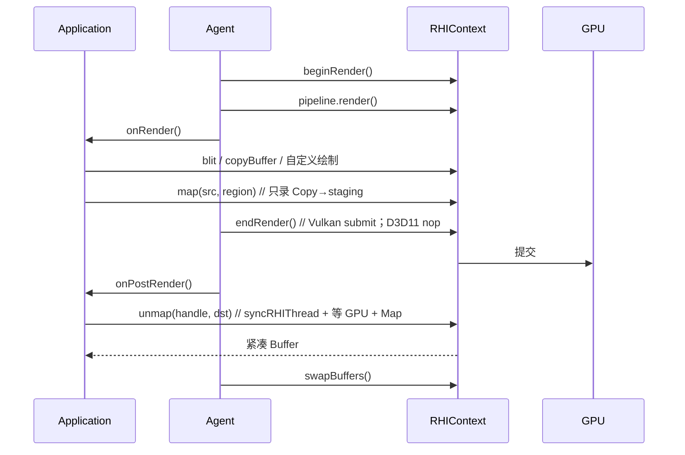

# GPU Readback 与 `onRender` 挂钩点：设计与实现

> 本文解决 `D3D11-Renderer-Backend-Validation-Sample-Plan.md` §1.1 / §1.2 / §9.1 / §9.4 指出的两处缺口：引擎无法把 GPU 数据读回 CPU，应用层在 `beginRender` / `endRender` 之间没有合法的 RHI 挂钩点。
>
> 结论先行：这两件事是**同一条 GPU 生命周期上的两段**，必须一起设计。Copy→staging 必须录在 `endRender` 之前，Map 必须发生在 `endRender` 提交之后。中间缺的就是 `onRender`。
>
> **第一期（A0–A7）已落地。** 下文保留设计 Rational；接口名、同步原语、sample 接线以代码为准，和当初草案的差异见 §0.3。剩余工作见 §14。
>
> 相关文档：
>
> - 验证计划：`doc/todo/D3D11-Renderer-Backend-Validation-Sample-Plan.md`（§1.1 / §1.2 / §9.1 / §9.4 描述的是立项前缺口，现状见该文档文首状态）
> - Compute / UAV：`doc/todo/RHI-Compute-UAV-Indirect-Draw-Design-todo.md` §12.3（同步读回已由本立项承接；异步 query / UAV 计数回读仍待 §8）
> - 相机后处理与渲染后业务回调：`doc/todo/Camera-PostProcess-Design-todo.md`（§2.5 拒绝 `Behaviour::onRender` 的正面替代：`onLateUpdate` / 相机组件 / 订阅回调）
> - 命令线程化：`source/Core/Include/RHI/T3DRHIThread.h`

涉及的主要文件：

- `source/Platform/Include/Application/T3DApplication.h`（下称 `T3DApplication.h`）
- `source/Core/Include/Kernel/T3DAgent.h` / `source/Core/Source/Kernel/T3DAgent.cpp`
- `source/Core/Include/RHI/T3DRHIContext.h` / `T3DRHICapabilities.h`
- `source/Core/Include/Render/T3DRenderBuffer.h` / `source/Core/Source/Render/T3DRenderBuffer.cpp`
- `source/Plugins/Renderer/Direct3D11/Window/Include|Source/T3DD3D11Context.{h,cpp}`
- 其它后端 `*Context.{h,cpp}`：纯虚落地后的 `T3D_RHI_UNSUPPORTED` stub

---

## 0. 目标与非目标

### 0.1 本期目标

| # | 目标 | 状态 | 说明 |
|---|------|------|------|
| 1 | **应用层 `onRender`** | ✅ | `Application::onPreRender` / `onRender` / `onPostRender`；`run` / `runForEditor` 走同一条三参数 `renderOneFrame` |
| 2 | **两阶段 GPU 读回** | ✅ | `RHIContext::map` 只录 Copy→staging；`unmap` 在提交后 Map，把数据打成紧凑 CPU `Buffer` |
| 3 | **D3D11 真实现** | ✅ | staging 池 + `CopySubresourceRegion` / MSAA Resolve + 按行打包；`supportsReadback = true` |
| 4 | **其它后端强制表态** | ✅ | 三个纯虚；未实现的后端走 `T3D_RHI_UNSUPPORTED_VALUE` / `T3D_RHI_UNSUPPORTED` |
| 5 | **接通 `kCPURead` 作为读回许可** | ✅ | 创建时带 `kCPURead` 才允许 `map`；**不**把该位置成 D3D11 `CPU_ACCESS_READ`（见 §3.0） |
| 6 | **修正 `CPUAccessMode` → 原生 flag 的错误绑定** | ✅ | `D3D11Mapping::get(Usage, mode)` 按 §3.0.4：`kCPURead` 不再建成 `STAGING` |

### 0.3 落地对照（以代码为准）

当初草案把接口写成 `beginReadBuffer` / `beginReadTexture` / `endReadBuffer` / `endReadTexture`。落地时收成三个纯虚，名字跟引擎其它缓冲 API 对齐：

| 草案 | 落地 | 位置 |
|------|------|------|
| `beginReadBuffer(src, offset, size)` | `RHIContext::map(src, offset, size)` | `T3DRHIContext.h` |
| `beginReadTexture(src, region)` | `RHIContext::map(src, region)` | 同上，重载 |
| `endReadBuffer` / `endReadTexture` | `RHIContext::unmap(handle, dst)` | 一条消费接口，线性 / 纹理共用 |
| `RenderBuffer::beginRead` / `endRead` | `RenderBuffer::map` / `unmap` | `T3DRenderBuffer.h` |
| `Texture::beginRead` / `endRead` | `Texture::map` / `unmap` | `T3DTexture.h`，内部转到 PixelBuffer |

其它和草案不一致、但已经写进代码的决定：

1. **`unmap` 用 `Agent::syncRHIThread()`，不是直接 `drainRHICommands()`。** `onPostRender` 发生在 `endFrame` 的 wait 之前，本帧 Copy 还在入队表。直接 drain 会和 RHI 线程正在遍历的那张表撞车。`syncRHIThread` 先 `waitRHIBatch()` 再 drain，并把这次 wait 记账，避免 `endFrame` 再等一次（`T3DAgent.h:347-355`，`T3DAgent.cpp:768-783`）。§11 当初标成「第一期最大实现风险」的 drain 时序，落地时就是靠这个函数收住的。
2. **pending 表是 `std::map`，不是 `TArray`。** 节点地址稳定，RHI 线程持有的 `ReadbackRequest*` 不会因为后续 insert 失效（`T3DD3D11Context.h:966-968`）。
3. **staging 池按 Kind 分三类**：STAGING 线性缓冲、STAGING 纹理、DEFAULT 非 MSAA Resolve 中转。Resolve 目标不能是 STAGING，所以多一跳（`T3DD3D11Context.h:1012-1017`）。
4. **`T3D_RHI_UNSUPPORTED_VALUE` 已补。** stub 的 `map` 用它返回 `ReadbackHandle::invalid()`（`T3DPrerequisites.h:117-123`）。
5. **创建路径的 `accMode` 只接到了 2D 纹理和 RenderTexture。** `createTexture2D` 两个重载、`createRenderTexture` 有默认 `kCPUNone` 的 `accMode`。`createTexture1D` / `3D` / `Cubemap` / `Texture2DArray` / `CubemapArray` 还没有，要读回这些类型目前只能走底层 `RenderBuffer` 的 `accMode`，或等后续补参数。
6. **TextureApp 已经接上读回冒烟**（当初 §0.2 写「第一期不改 sample」）。启动后第一帧：`kCPURead` 的 64×64 程序化纹理 `map`/`unmap` 比对像素；`kCPUNone` 对照被拒；consumed handle 再 `unmap` 得到 `T3D_ERR_INVALID_PARAM`。BlitApp **还没**改，仍是验证计划的后续。
7. **异步 `readData(callback)` 仍只做校验。** TODO 文案改成「请改用 `map` / `unmap`」（`T3DRenderBuffer.cpp:137-138`）。真正接通仍待 §8。

### 0.2 本期边界（明确不做）

- **不把同步 `RenderBuffer::readData(offset, size, void *dst)` 改成隐式 GPU 阻塞读。** 它继续只读 CPU 镜像（`MemoryType != kVRAM` 时的缓存）。偷偷改语义会让所有「我以为在读上传前副本」的调用点变成帧率杀手。GPU 权威数据一律走 `map` / `unmap`。
- **不把 `CPUAccessMode` 和 `GPUAccessFlags` 合成一个枚举。** 它们对应 D3D11 两套完全不同的字段，组合约束正交（见 §3.0.3）。
- **不把 `kCPURead` 映射成源资源自身的 `D3D11_CPU_ACCESS_READ`。** 活纹理 / RT / VB 仍然是 DEFAULT 或 IMMUTABLE；读回用引擎内部 staging。创建时带 `kCPURead` 只表示「引擎允许对这块 GPU 数据做读回」。
- **不在 `Behaviour` 上加 `onRender`。** 那是 Unity `OnRenderObject` 一类「跟相机 pass 走」的回调，会再次和 `setRenderTarget` 抢状态。验证计划 §1.2 已经否过这条路。业务层「渲染后逻辑 / 后处理」的替代路径见 `Camera-PostProcess-Design-todo.md`，本文 §2.5 只记账不展开。
- **不改编辑器 ImGui 时序。** 现在 `preRender` 在 `beginRender` 前清屏、`postRender` 在 `endRender` 后画，对 Vulkan 同样不合法，但本期只把新钩子放到正确位置，ImGui 迁移另立项。
- **第一期不做**：压缩格式（BC1–BC7）读回、深度/模板 CPU 解释、异步环形缓冲 + `ID3D11Query`（作为二期，见 §8）、游戏帧里的常规阻塞读回。
- **BlitApp / 验证计划其它用例仍未升级。** TextureApp 已接冒烟（见 §0.3 / §6）；BlitApp 的 blit / copyBuffer 断言、以及验证计划正文回填，仍是后续任务。

---

## 1. 现状：两处缺口为什么必须一起修

### 1.1 帧循环没有「录制阶段」的应用挂钩点

`Agent::run()`（`T3DAgent.cpp:640-665`）每帧固定：

```
beginFrame → pollEvents → update → renderOneFrame → endFrame
```

`renderOneFrame`（`T3DAgent.cpp:676-712`）实际是：

```
preRender()                     // 在 beginRender 之前
ctx->beginRender()              // Vulkan：waitFence + acquire + beginCmdBuf；D3D11：空
pipeline->cull / render         // 内部 beginPass / 绘制 / endPass
ctx->endRender()                // Vulkan：endCmdBuf + submit；D3D11：空
postRender()                    // 在 endRender 之后、swapBuffers 之前
swapBuffers
GC
```

`Application`（`T3DApplication.h:95-103`）只有五个 OS 生命周期纯虚函数，没有渲染回调。`Behaviour::onUpdate` 发生在 `Agent::update()` 里，整段都在渲染 pass 之外。

唯一能塞 GPU 命令的口子是 `EditorRunningData` 的 `preRender` / `postRender`（`T3DAgent.h:57-63`），而且只有 `runForEditor` 才走。验证计划因此要求 BlitApp 重写 `go()` —— 这是权宜之计，不是架构。

### 1.2 GPU 读回路径全部不可用

| 候选路径 | 位置 | 为什么不可用 |
|---------|------|-------------|
| `Image::save` | `T3DImage.h:129-131` | 声明与实现都是注释状态 |
| `RenderBuffer::readData`（同步） | `T3DRenderBuffer.cpp:83-103` | 仅当 `kStatic && memType != kVRAM` 时读 CPU 镜像 |
| `RenderBuffer::readData`（异步） | `T3DRenderBuffer.cpp:137` | `// TODO: 通过 RHIContext 读数据`，校验通过后仍是空的 |
| `RenderBuffer::copyData` | `T3DRenderBuffer.cpp:189-201` | 两个重载都是 `// TODO: 暂不支持` |
| `TextureManager::saveTexture` | `T3DTextureManager.h:192-200` | 序列化磁盘资源，不是从 GPU 读像素 |

异步 `readData` 已经要求源带 `kCPURead`（`T3DRenderBuffer.cpp:129-134`），这个**校验方向是对的**（许可）。错的是 D3D11 映射：`kCPURead` 会把资源建成 `STAGING`（`T3DD3D11Mapping.cpp:748-752`），活纹理 / RT 加了许可反而不能用。见 §3.0。

`Usage::kCopy → D3D11_USAGE_STAGING` 的映射已经在，只是没人用它做中转。

### 1.3 读回本身也是两阶段，和钩子位置锁死

```
GPU 工作（draw / blit / copyBuffer）
        ↓ 必须还在同一条 command buffer 里
CopyResource → staging              ★ 录制阶段，必须在 endRender 之前
        ↓ endRender 提交
Map(READ) + 按行 memcpy             ★ 消费阶段，必须在 GPU 完成之后
```

| 后端 | Copy 的时机 | Map 的时机 |
|------|-------------|------------|
| D3D11 immediate | 调用即提交到 GPU | Copy 之后立刻 Map 会卡住等 GPU，看起来像一步 |
| Vulkan | 只是录进 command buffer | `endRender` 提交之前 Map 读到的是未定义数据 |
| RHI 线程 | Copy 在 RHI 线程执行 | Map 必须和 Copy 在同一线程、且在 Copy 之后 |

如果把 Copy 和 Map 都塞进现在的 `postRender`：D3D11 能骗过自己（`endRender` 是空实现，`T3DD3D11Context.h` 注释与 `T3DRHIContext.h:828-841` 一致），Vulkan 两边都错。验证计划 §9.4 已经写了这条保留意见。

**跨后端唯一合法的同步读回**：`onRender` 里 `map`（只录 Copy），`endRender` 提交，`onPostRender` 里 `unmap`（`syncRHIThread` + Map）。



---

## 2. 帧循环：补上 `onRender`

### 2.1 三个钩子按 GPU 生命周期切，不按「编辑器 / sample」切

| 钩子 | 时序 | 允许做的事 | 禁止做的事 |
|------|------|-----------|-----------|
| `preRender` | `beginRender` 之前 | CPU 准备（ImGui::Render 生成 draw list） | 录制需要进**当前** command buffer 的 GPU 命令 |
| **`onRender`** | `pipeline->render` 之后、`endRender` 之前 | blit、copyBuffer、自定义 beginPass/draw/endPass、`map` | 假设管线的 RT / viewport / shader 还在；在热路径 new/delete GPU 资源 |
| `postRender` | `endRender` 之后、`swapBuffers` 之前 | `unmap`、断言、读回回调 | 把这里当成跨后端的 GPU 录制点 |

Vulkan 的 `beginPass` / `endPass` 由管线自己配对。`onRender` 发生在管线 `endPass` 之后，正好是 blit / `CopyResource` 该在的位置（`T3DRHIContext.h:856` 已写：blit 在 pass 外）。

### 2.2 挂点：`Application` 可选虚函数 + `EditorRunningData` 同步加一项

`Application` 已经是 sample 的入口（`SampleWindowApp`），`Agent::run()` 每帧已经拿得到 `Application*`（`T3DAgent.cpp:642`）。加**默认空实现**，不要做成纯虚，否则所有现有 Application 都得改。

```cpp
// T3DApplication.h，与 applicationFocusGained 同类：有默认空实现，不是纯虚
virtual void onPreRender() {}
virtual void onRender() {}          // ★ 真正缺的
virtual void onPostRender() {}
```

实现放在 `T3DApplication.cpp`，空函数体即可。`WindowApplication` / `ConsoleApplication` / `SampleWindowApp` 都不强制覆写。

`EditorRunningData` 现有 `preRender` / `postRender`，补 `onRender`：

```cpp
// T3DAgent.h
using OnEngineRender = TFunction<void()>;

struct EditorRunningData
{
    Update              update {nullptr};
    PreEngineRender     preRender {nullptr};
    OnEngineRender      onRender {nullptr};     // ★ 新增：beginRender 内、endRender 前
    PostEngineRender    postRender {nullptr};
};
```

`PreEngineRender` / `OnEngineRender` / `PostEngineRender` 底层都是 `TFunction<void()>`，分开 typedef 只为注释语义，不要合并成一个名字以免调用点看不出时序。

### 2.3 `run()` 与 `runForEditor()` 走同一条 `renderOneFrame`

现在 `Agent::run()` 调无参 `renderOneFrame()`，再转到 `renderOneFrame(nullptr, nullptr)`（`T3DAgent.cpp:669-672`）。改成三参数，并在 `run()` 里把 Application 钩子接上：

```cpp
// 建议伪代码，T3DAgent.cpp
static EngineRender combine(const EngineRender &a, const EngineRender &b)
{
    if (a == nullptr) return b;
    if (b == nullptr) return a;
    return [a, b]() { a(); b(); };
}

bool Agent::run()
{
    Application *theApp = Application::getInstancePtr();
    while (mIsRunning)
    {
        beginFrame();
        mIsRunning = theApp->pollEvents();
        update();
        renderOneFrame(
            [theApp]() { theApp->onPreRender(); },
            [theApp]() { theApp->onRender(); },
            [theApp]() { theApp->onPostRender(); });
        endFrame();
    }
    theApp->applicationWillTerminate();
    return true;
}

bool Agent::runForEditor(const EditorRunningData &updateData)
{
    Application *theApp = Application::getInstancePtr();
    while (mIsRunning)
    {
        beginFrame();
        mIsRunning = theApp->pollEvents();
        update();
        if (updateData.update != nullptr)
            updateData.update();

        renderOneFrame(
            combine(updateData.preRender,  [theApp]() { theApp->onPreRender(); }),
            combine(updateData.onRender,   [theApp]() { theApp->onRender(); }),
            combine(updateData.postRender, [theApp]() { theApp->onPostRender(); }));
        endFrame();
    }
    theApp->applicationWillTerminate();
    return true;
}

void Agent::renderOneFrame(const PreEngineRender &preRender,
                           const OnEngineRender &onRender,
                           const PostEngineRender &postRender)
{
    if (preRender != nullptr)
        preRender();

    auto ctx = mActiveRHIRenderer->getContext();
    ctx->beginRender();

    if (mRenderPipeline != nullptr)
    {
        mRenderPipeline->cull(mSceneMgr->getCurrentScene());
        mRenderPipeline->render(ctx);
    }

    if (onRender != nullptr)        // ★ 在 endRender 之前
        onRender();

    ctx->endRender();

    if (postRender != nullptr)
        postRender();

    for (auto win : mRenderWindows)
        win.second->swapBuffers();

    mRenderStateMgr->GC();
    mRenderBufferMgr->GC();
}
```

两个来源都非空时顺序固定为：**先编辑器回调，后 Application**。编辑器 ImGui 若以后把 GPU 绘制迁进 `onRender`，不会被 sample 的 blit 挡住。

无参 `renderOneFrame()` 仍保留，转调三参数且三项都为空，避免破坏现有调用点。

`Agent::renderOneFrame` 的头文件声明（`T3DAgent.h:439-442`）同步改成三参数，注释改成：

```
preRender  : beginRender 之前，可为空
onRender   : pipeline.render 之后、endRender 之前，可为空
postRender : endRender 之后、swapBuffers 之前，可为空
```

### 2.4 `onRender` 里的约定

进来时管线已经 `endPass`，且 `ForwardRenderPipeline` 各相机结束时会 `reset`。**不要假设当前 RT / viewport / 着色器还在。**

允许：`blit`、`copyBuffer`、`setRenderTarget`、自定义 `beginPass` / `render` / `endPass`、`map`。

约束：

1. 自己绑 RT、设 viewport，用完 `ctx->reset()`。
2. `setViewport` 必须在 `setRenderTarget` 之后（`Viewport` 按当前 RT 尺寸把 [0,1] 换算成像素，见 `T3DViewport.h:36-60`）。
3. 不要在这里改场景图。
4. GPU 资源创建放 `applicationDidFinishLaunching`，销毁走 `Agent::postFrameEndTask`（`T3DAgent.cpp:743-775`），不要在热路径 new/delete。

### 2.5 明确拒绝的替代方案

| 方案 | 为什么不采用 |
|------|-------------|
| BlitApp 继续劫持 `runForEditor` | 把 D3D11 空 `endRender` 当成跨后端事实，验证计划 §9.4 已否 |
| 只加 `Application::onRender`、编辑器不改 | sample 和编辑器时序分叉，以后 ImGui 迁移还得再改一遍 Agent |
| `Behaviour::onRender` | 跟相机 pass 绑定，BlitApp 要的是「所有相机画完、command buffer 还开着」。全场景再扫一趟 update 组件既贵又会诱导在任意对象里 `setRenderTarget`。**业务层「渲染后」不是没地方挂**：纯 CPU 收尾用已有 `onLateUpdate`；读回结果下一帧 `onUpdate` 消费；图像后处理挂在相机 GameObject 上插进现有 blit；非相机对象发 GPU 命令用订阅式回调。正面方案见 `doc/todo/Camera-PostProcess-Design-todo.md` |
| 把 blit 塞进 `preRender` | 发生在 `beginRender` 之前，Vulkan 没有 command buffer |
| 把 blit 留在 `postRender` | 发生在 submit 之后，Vulkan 再录命令是错的 |

`Application::onRender` 和相机后处理不冲突：前者是应用级最后一个录制窗口（本立项 A1），后者是管线内、每台相机 blit 之前的效果链。时序关系见后处理文档 §6。

### 2.6 编辑器现状（本期不动，只记账）

`EditorApp::enginePreRender`（`EditorApp.cpp:904-920`）在 `beginRender` 前 `setRenderTarget` + `clearColor`；`enginePostRender` 在 `endRender` 后画 ImGui。Launcher 同样（`LauncherApp.cpp:492-499`）。

本期 `EditorRunningData::onRender` 可以保持 `nullptr`。日后把 ImGui 的 GPU 绘制迁到 `onRender`，CPU 的 `ImGui::Render()` 留在 `preRender`。

---

## 3. GPU 读回：`kCPURead` 是许可，staging 是实现

### 3.0 四套标记：原先的意图、现在的错位、能不能合成一套

资源创建现在要填四个旋钮：`Usage`、`CPUAccessMode`、`GPUAccessFlags`、`MemoryType`。读回方案之前写成「不要源带 `kCPURead`」，是被**当前 D3D11 映射**带偏了，不是原设计意图。这里把四套标记拆开，后面的接口都按这张表走。

#### 3.0.1 原设计意图（对的）

| 标记 | 回答的问题 | 不回答的问题 |
|------|-----------|-------------|
| **`CPUAccessMode`** | CPU **被允许**对这块 **GPU 数据**做什么：`kCPUNone` / `kCPUWrite` / `kCPURead` / `kCPURead\|kCPUWrite` | GPU 资源建成 DEFAULT 还是 STAGING；要不要留 RAM 镜像 |
| **`GPUAccessFlags`** | GPU 管线上**额外**开放的绑定：SRV / UAV / IndirectArgs。本职绑定由资源类型隐含（VB→IA、普通纹理→采样） | CPU 能不能读 |
| **`Usage`** | GPU 资源的更新频率 / 堆类型：Immutable / Default(Static) / Dynamic / Staging(`kCopy`) | 有没有 RAM 缓存 |
| **`MemoryType`** | 要不要留一份 **CPU 镜像当缓存**，避免每次都碰 GPU。`kVRAM` 无镜像，`kBoth` 双份，`kRAM` 只有镜像 | GPU 写过之后镜像还准不准 |

`kCPURead` 的原意是：「运行时允许把这块 GPU 数据读回 CPU」。它**不是**「把这个资源本身建成 STAGING」。

`MemoryType` 的原意是：「热路径用 RAM 镜像快读快写，不必每次 Map GPU」。镜像存的是**上次 CPU 写入的版本**。GPU 后来用 UAV / RT 改过的内容，镜像是过期的，必须走读回才能看到权威数据。这两件事正交：

| 组合 | 同步 `readData(void*)` | `map` / `unmap` |
|------|----------------------|--------------|
| `kVRAM + kCPUNone` | 读不到（无镜像，也无许可） | 拒绝 |
| `kVRAM + kCPURead` | 读不到（无镜像） | 允许，staging 中转，看到 GPU 权威数据 |
| `kBoth + kCPUNone` | 读镜像（上传时的副本） | 拒绝 |
| `kBoth + kCPURead` | 读镜像（快，可能过期） | 允许（慢，权威） |
| `kBoth + kCPUWrite` | 镜像 + `writeBuffer` 双写 | 拒绝读回 |

#### 3.0.2 当前实现把许可做成了堆类型（错的）

`D3D11Mapping::get(Usage, mode)`（`T3DD3D11Mapping.cpp:690-783`）用 `CPUAccessMode` **改写** `D3D11_USAGE`：

| 引擎组合 | 现在建成 | 问题 |
|----------|---------|------|
| `kDynamic + kCPURead` | `STAGING + CPU_READ` | 不能绑 IA / SRV / RT。等于把「我想读回」做成「这就是 staging 资源」 |
| `kDynamic + kCPUReadWrite` | 同上 | 同上 |
| `kStatic + kCPUWrite` | `DEFAULT + CPU_ACCESS_WRITE` | **D3D11 非法**：DEFAULT 的 `CPUAccessFlags` 必须为 0。`CreateBuffer` 会失败 |
| `kStatic + kCPUNone` | `IMMUTABLE` | Usage 叫 Static，实际建成 Immutable，和 `Usage::kImmutable` 撞车 |
| `kImmutable + 非 kCPUNone` | 直接报错 | 合理 |

`D3D11Mapping::get(uint32_t accMode)`（`:122-143`）又把 `kCPURead` 一对一译成 `D3D11_CPU_ACCESS_READ`，创建纹理时写进 `d3dDesc.CPUAccessFlags`（`T3DD3D11Context.cpp:2505` 等）。DEFAULT / IMMUTABLE 资源带这个 flag 同样非法。

所以文档初稿才写「不要给活纹理加 `kCPURead`」——**在错误映射下**，加了就不能当纹理用。映射按原意修正之后，这个限制消失。

全仓几乎没有人传 `kCPURead`（除了异步 `readData` 那条失败的校验）。`kCPUWrite` 用在动态 VB（`T3DMesh.cpp:331`）、动态 CB（`T3DShaderVariantInstance.cpp:92`）、ImGui 动态缓冲。改 `kCPURead` 的映射风险低；动 `kCPUWrite` 的 DYNAMIC 路径要保持现状。

#### 3.0.3 能不能把 `CPUAccessMode` 和 `GPUAccessFlags` 合成一个枚举？

**位域不要合并。** 它们对应 D3D11 两套字段，互斥规则也不是同一张表：

| | `CPUAccessMode` | `GPUAccessFlags` |
|--|-----------------|------------------|
| D3D11 字段 | `CPUAccessFlags`（以及**不应该**再用来改 `Usage`） | `BindFlags` 附加位 + `MiscFlags`（IndirectArgs） |
| Vulkan | `VkMemoryPropertyFlags` / 是否允许 copy-to-host | `VkBufferUsageFlags` / `VkImageUsageFlags` |
| 互斥例子 | STAGING 才能带 `CPU_ACCESS_READ`；DEFAULT 必须为 0 | STAGING 的 `BindFlags` 必须为 0；UAV 不能挂 IMMUTABLE |
| 语义角色 | 对**数据**的 CPU 操作许可 | 对**管线槽位**的 GPU 绑定许可 |
| 「附加」 | 不是附加，是这块数据允不允许 CPU 碰 | 是附加：VB 的 IA 绑定、纹理的采样绑定由类型隐含 |

合成一个 `ResourceAccess = kCPURead \| kGPUShaderResource \| …` 看起来省事，调用点和校验矩阵都会把「CPU 许可」和「GPU 绑定」缠在一起。`GPUAccessFlags` 当初单独加（Compute 文档 §5.1）就是为了避免再堆 `shaderReadable` / `shaderWritable` / `indirectArgs` 三个平行 bool，不是为了取代 `CPUAccessMode`。

可以接受的「统一」只有调用层糖衣，**不改两套枚举**：

```cpp
struct ResourceAccess
{
    uint32_t cpu {kCPUNone};     // CPUAccessMode
    uint32_t gpu {kGPUNone};     // GPUAccessFlags
};
```

`loadVertexBuffer(..., ResourceAccess access)` 少一个参数。第一期不必做，现有 `accMode` + `gpuAccess` 两个参数已经对称。

#### 3.0.4 修正后的 D3D11 映射（许可 ≠ 原生 CPUAccessFlags）

`Usage` 单独决定 `D3D11_USAGE`。`CPUAccessMode` 只在 `Usage::kCopy` / `kDynamic` 时写进原生 `CPUAccessFlags`；DEFAULT / IMMUTABLE 上恒为 0。`kCPURead` 由引擎记住，读回时查许可，Copy 进**内部** staging 再 Map。

| Usage | CPUAccess | 原生 USAGE | 原生 CPUAccessFlags | 引擎行为 |
|-------|-----------|------------|---------------------|----------|
| `kImmutable` | `kCPUNone` | IMMUTABLE | 0 | 初始化上传，之后 CPU 不碰 |
| `kImmutable` | `kCPURead` | IMMUTABLE | 0 | 同上，但允许 `map`（staging 中转） |
| `kStatic` | `kCPUNone` | DEFAULT | 0 | GPU 可写（RT / UAV），CPU 不碰 |
| `kStatic` | `kCPUWrite` | DEFAULT | 0 | CPU 写走 `UpdateSubresource`，**不是** Map |
| `kStatic` | `kCPURead` | DEFAULT | 0 | 允许 `map` |
| `kStatic` | `kCPUReadWrite` | DEFAULT | 0 | UpdateSubresource + 读回 |
| `kDynamic` | `kCPUWrite` | DYNAMIC | WRITE | `Map(WRITE_DISCARD)`，现状保留 |
| `kDynamic` | `kCPURead` | **非法** | — | D3D11 DYNAMIC 不能 Map READ。要读回改用 `kStatic\|kCPURead` 或 `kCopy` |
| `kCopy` | `kCPURead` | STAGING | READ | 这才是真正可 Map 的资源，不能绑管线 |
| `kCopy` | `kCPUReadWrite` | STAGING | READ\|WRITE | 同上 |

要点：

1. **`Usage::kCopy` 才是 STAGING。** `kDynamic + kCPURead` 不再偷偷建成 STAGING（现在的 748-752 行删掉这条分支，改为报错）。
2. **`kStatic + kCPUWrite` 不再写 `CPU_ACCESS_WRITE`。** 那是非法组合；改成 DEFAULT + 0，写入走 `UpdateSubresource`。
3. **`kStatic + kCPUNone` 建成 DEFAULT 而不是 IMMUTABLE**，这样 RT / UAV（`validateGPUAccess` 要求 `kStatic`）和「不可变贴图」分得开。`Usage::kImmutable` 专管后者。这和现在 714-718 行不一致，改的时候要回归：现有普通纹理走的是 `kImmutable + kCPUNone`（`T3DTexture.cpp:282`），不受这条影响。
4. 内部 staging 池的资源：`Usage::kCopy + kCPURead`，**不**暴露给用户当普通纹理用。

#### 3.0.5 创建路径要能把 `kCPURead` 传进去

现状：`Texture::onCreate` / `RenderTexture` 写死 `kCPUNone`（`T3DTexture.cpp:282`、`T3DRenderTexture.cpp:119`）。即便许可语义修好，默认纹理仍然读不回——这是对的：大多数贴图不该付读回成本。

要读回的资源在创建时显式带上 `kCPURead`：

- PixelBuffer / VertexBuffer 已经有 `accMode` 参数，直接传。
- `TextureManager::createTexture2D` 等目前没有 `accMode`，第一期给要读回的用例加可选参数，默认仍 `kCPUNone`。验证 sample 建程序化纹理时传入 `kCPURead`。
- `RenderTexture` 同理：离屏 RT 若要断言像素，创建时 `kStatic + kCPURead`（原生仍是 DEFAULT，可当 RTV）。

`map` 对 `kCPUNone` 的源返回 invalid handle 并打日志，与现在异步 `readData` 的校验**同方向**，但错误文案改成「创建时未声明 kCPURead，不是把资源建成 STAGING」。这已经落地（`T3DD3D11Context.cpp:4423-4430`）。

### 3.1 数据路径（许可通过之后）

用户从来不 Map 活纹理。活资源按 §3.0.4 仍是 DEFAULT / IMMUTABLE / DYNAMIC。

```
源（DEFAULT / IMMUTABLE / RT / VB，创建时带 kCPURead）
    -- CopyResource / CopySubresourceRegion / Resolve --
内部 staging（Usage::kCopy → D3D11_USAGE_STAGING + CPU_READ）
    -- Map(READ) --
CPU 紧凑 Buffer（rowPitch = width * bpp）
```

`Usage::kCopy` 的映射已经在 `T3DD3D11Mapping.cpp:112-114`，GL4 / GLES3 映到 `GL_STREAM_READ`，Vulkan 也有对应分支。第一期只把 D3D11 这条路走通。

### 3.2 RHI 接口（纯虚，所有后端必须表态）

已落地在 `T3DRHIContext.h` 的 `copyBuffer` / `writeBuffer` 附近。结构体放在 `T3DRenderConstant.h`（和 `Usage` / `CPUAccessMode` 一起），**没有**放进 `T3DTypedef.h`。

```cpp
// T3DRenderConstant.h
struct ReadbackRegion
{
    uint32_t mipLevel {0};
    uint32_t arraySlice {0};
    Vector3  offset {Vector3::ZERO};    // 像素 / 纹素起点
    Vector3  size {Vector3::ZERO};      // 全 0 = 该 mip / slice 整层
};

struct ReadbackHandle
{
    uint32_t generation {0};
    uint32_t index {0xFFFFFFFFu};
    bool isValid() const { return index != 0xFFFFFFFFu; }
    static ReadbackHandle invalid() { return ReadbackHandle(); }
};

// T3DRHIContext.h —— 三个纯虚，线性 / 纹理共用 unmap
virtual ReadbackHandle map(RenderBuffer *src, size_t offset, size_t size) = 0;
virtual ReadbackHandle map(RenderBuffer *src, const ReadbackRegion &region) = 0;
virtual TResult        unmap(ReadbackHandle handle, Buffer &dst) = 0;
```

约定：

1. **`dst` 由引擎填成紧凑排布。** D3D11 `Map` 回来的 `RowPitch` 经常大于 `width * bpp`，直接整块 memcpy 会把 padding 算进像素。调用方（`SamplePattern::expectedColor`）按紧密布局比对。
2. **源必须带 `kCPURead`。** 这是引擎许可，不是原生 `CPU_ACCESS_READ`。`kCPUNone` 的源返回 invalid handle。内部 staging 是实现细节，调用方看不到。
3. `map` 在 `src == nullptr`、无 RHI 资源、越界、无 `kCPURead` 时返回 `ReadbackHandle::invalid()` 并打错误日志，不要崩。
4. `unmap` 遇到 invalid / 已消费 handle 返回 `T3D_ERR_INVALID_PARAM`。
5. `unmap` 在数据未就绪时**阻塞**。这是验证 / CI / 按键截一帧的路径，注释已写明「会卡住等 GPU，禁止当游戏热路径」。
6. 窗口 BackBuffer 可以 Copy 到同格式 staging（截屏）；验证优先读离屏 RT，少踩 sRGB / tearing。
7. MSAA 源：staging 不能是 MSAA。先 `ResolveSubresource` 到一张非 MSAA DEFAULT，再 Copy 进 staging。复用 `doBlit` 已有的 Resolve 分支。
8. 第一期只保证非压缩 UNORM 8-bit 颜色，以及线性缓冲的原始字节。压缩格式、深度模板返回 `T3D_ERR_NOT_IMPLEMENT` 或 `T3D_ERR_D3D11_UNSUPPORTED_OPERATION`。

**禁止**提供「在 `onRender` 里一次 `readTexture` 就把像素填进 `void*`」的同步 API 当正式接口。D3D11 能实现，Vulkan 会把错误语义写死。落地时也没有加这种一步接口。

### 3.3 能力位

`RHICapabilities`（`T3DRHICapabilities.h:47-74`）追加：

```cpp
/// 支持 GPU→CPU 读回（map / unmap）
bool supportsReadback {false};
```

D3D11 Window 后端在 `init()` 填 `true`（`T3DD3D11Context.cpp:187`）。其它后端保持默认 `false`。

`map` 的 stub 用已补的 `T3D_RHI_UNSUPPORTED_VALUE(supportsReadback, ReadbackHandle::invalid())`；`unmap` 用 `T3D_RHI_UNSUPPORTED(supportsReadback)`。

### 3.4 引擎层封装

#### `RenderBuffer::readData` 两个重载各司其职

| 现有接口 | 新语义 |
|----------|--------|
| 同步 `readData(offset, size, void *dst)` | **保持原样**：只读 CPU 镜像。不碰 GPU。 |
| 异步 `readData(offset, size, callback)` | **第一期未接通。** 保留 `kCPURead` 许可校验，TODO 改为「请改用 map / unmap」。真正接通放到二期和 query 一起做。 |

异步版本改造要点（`T3DRenderBuffer.cpp:107-141`）：

1. **保留「必须 `kCPURead`」分支**（129-134 行），文案改为「创建时未声明 kCPURead，读回被拒绝」。不要让人以为要给资源加 `D3D11_CPU_ACCESS_READ`。
2. `MemoryType != kVRAM` 且只想读镜像时继续建议走同步接口，这条警告保留。镜像可能过期，见 §3.0.1。
3. `kVRAM` / `kBoth` 且带 `kCPURead`：调用方自己在 `onRender` 里 `map`、`onPostRender` 里 `unmap`。不要在 `readData(callback)` 内部立刻 Map。
4. 第一期异步接口仍只做校验 + TODO「请改用 map / unmap」。真正接通放到二期和 query 一起做。

引擎层薄封装已落地，不改异步 `readData` 的完成语义：

```cpp
// T3DRenderBuffer.h
ReadbackHandle map(size_t offset = 0, size_t size = 0);
TResult        unmap(ReadbackHandle handle, Buffer &dst);
```

内部转到 `T3D_AGENT.getActiveRHIContext()->map/unmap`。`Texture` 对称：

```cpp
// T3DTexture.h（基类）
ReadbackHandle map(const ReadbackRegion &region);
TResult        unmap(ReadbackHandle handle, Buffer &dst);
```

内部 `getPixelBuffer()` 转 `ctx->map(pixelBuffer, region)`。Cubemap 走 `getPixelBuffer()`。

### 3.5 错误码

尽量复用，少加新枚举：

| 情况 | 返回 |
|------|------|
| 后端未实现 | `T3D_ERR_NOT_IMPLEMENT`（stub 宏） |
| 空指针 / invalid handle | `T3D_ERR_INVALID_PARAM` 或 `T3D_ERR_INVALID_POINTER` |
| Map 失败 | 已有 `T3D_ERR_D3D11_MAP_RESOURCE` |
| 压缩格式 / 深度 | `T3D_ERR_D3D11_UNSUPPORTED_OPERATION`（或通用 `T3D_ERR_NOT_IMPLEMENT`） |
| 越界 | `T3D_ERR_INVALID_PARAM`，与 `copyBuffer` 的 `ByteWidth` 校验一致 |

若需要「handle 已消费 / 过期」，再在 `T3DErrorDef.h` 的渲染段（`+0x0200`）追加 `T3D_ERR_RENDER_BUFFER_READBACK_EXPIRED`。第一期可以先不加，过期 handle 当 invalid 处理。

---

## 4. D3D11 实现

实现放在 `D3D11Context`（Window），不放 `D3D11ContextBase`：`copyBuffer` / `blit` / `getD3DResource` 都在 Window 这份上（`T3DD3D11Context.cpp:4091,4715`）。Console 后端的 `blit` / `copyBuffer` 目前是空壳返回 `T3D_OK`（`T3DD3D11ConsoleContext.cpp:121-125`），读回同样 stub，能力位保持 `false`。

### 4.1 待完成请求与 staging 池

```cpp
// T3DD3D11Context.h 私有
struct ReadbackRequest
{
    ReadbackHandle          handle;
    RenderBufferPtr         src;            // 自持有，过 RHI 线程
    bool                    isTexture {false};
    size_t                  bufferOffset {0};
    size_t                  bufferSize {0};
    ReadbackRegion          region {};
    ID3D11Resource         *staging {nullptr};  // 池里租来的，不要在请求里 Release
    uint32_t                subresource {0};
    uint32_t                tightRowPitch {0};
    uint32_t                tightSlicePitch {0};
    uint32_t                copyWidth {0};
    uint32_t                copyHeight {0};
    uint32_t                copyDepth {0};
    bool                    copyRecorded {false};
};

struct StagingKey
{
    RHIResource::ResourceType type {RHIResource::ResourceType::kNone};
    DXGI_FORMAT               format {DXGI_FORMAT_UNKNOWN};
    uint32_t                  width {0};
    uint32_t                  height {0};
    uint32_t                  depth {0};
    bool                      isBuffer {false};
    uint32_t                  byteWidth {0};
};

TMap<uint64_t, ID3D11Resource*>     mStagingPool;   // 或 TMap<StagingKey, ...>，第一期用 vector + 线性查找即可
TArray<ReadbackRequest>             mPendingReadbacks;
uint32_t                            mReadbackGeneration {1};
```

Staging 资源：`D3D11_USAGE_STAGING` + `D3D11_CPU_ACCESS_READ`，BindFlags = 0。按尺寸分桶，用时取、用完还，不要每帧 Create/Release。退出时在 context 析构里全部 Release，避免 `ReportLiveDeviceObjects` 报账。

### 4.2 `map`（线性缓冲）

主线程（`onRender` 调用点）做校验，lambda 只做 Copy：

1. `src == nullptr` / 无 RHI 资源 → invalid handle。
2. 资源类型必须是 `kVertexBuffer` / `kIndexBuffer` / `kConstantBuffer` / `kStructuredBuffer`。纹理走 `map(src, region)`。
3. 用 `ID3D11Buffer::GetDesc` 的真实 `ByteWidth` 做边界校验，与 `copyBuffer` 一致（`T3DD3D11Context.cpp:4143-4153`）。`size == 0` 表示从 offset 到末尾。
4. 从池里取或创建 `ByteWidth` 足够的 staging buffer。
5. 分配 handle，填 `ReadbackRequest`，`ENQUEUE_UNIQUE_COMMAND`：
   - `CopyResource`（整段且 offset 都为 0）或 `CopySubresourceRegion`（带 `D3D11_BOX`）。
   - 源是 `kImmutable` 也可以当 Copy **源**，不能当 Copy 目标（已有 `copyBuffer` 对 dst immutable 的拒绝，读回不受影响）。
6. lambda 参数传 `RenderBufferPtr(src)`，不要传裸指针（RHI 线程约束，见 Compute 文档 §3.2）。
7. 立刻返回 handle。**不要在这条命令里 Map。**

### 4.3 `map`（纹理）

1. 资源类型 `kPixelBuffer1D/2D/3D/Cubemap`。线性缓冲走 `map(src, offset, size)`。
2. `mipLevel` / `arraySlice` 换算 D3D11 子资源下标：`arraySlice * mipLevels + mipLevel`，与 `buildSubresourceData`（`T3DD3D11Context.cpp:1959`）一致。Cubemap 的 `arraySlice` 是面号（0–5）或 `cubeIndex * 6 + face`。
3. `region.size` 为 0 时用该 mip 的 `max(1, dim >> mip)`。
4. 压缩格式、深度格式第一期拒绝。
5. MSAA（`SampleDesc.Count > 1`）：先 Resolve 到池里一张同尺寸非 MSAA DEFAULT（`D3D11PixelBuffer2D` 已有 `D3DResolveTex` 可复用则复用），再 Copy 到 staging。`ResolveSubresource` 的目标不能是 STAGING。
6. 窗口 BackBuffer：没有 `RenderBuffer`，第一期**不**从 swapchain 直接读。要读窗口内容，sample 应 blit 到离屏 RT 再 `map(src, region)`。若以后做截屏，另开 `map(RenderTarget*)`。
7. `ENQUEUE_UNIQUE_COMMAND` 录 `CopyResource` / `CopySubresourceRegion`。同样不 Map。

### 4.4 `unmap`

必须在 `endRender` 之后调用（sample 放 `onPostRender`）。

```
1. handle 对不上 pending 表 → T3D_ERR_INVALID_PARAM
2. 若 T3D_ENABLE_RHI_THREAD 且 RHI 线程在跑：
      T3D_AGENT.drainRHICommands();
      // 两次 flush，保证 Copy 那条命令已在 RHI 线程执行完
      // 见 T3DAgent.cpp:733-738
3. ENQUEUE 一条「Map + 按行拷贝 + Unmap」命令，payload 用 shared_ptr<Buffer> 或把 dst 的 Data 预分配后按值捕获不行（主线程 Buffer 地址）：
      正确：预分配 dst.Data，把指针和大小拷进 lambda；
            或 shared_ptr<Buffer> 进 lambda，drain 后再 move 给调用方。
4. 再 drain 一次（或与步骤 2 合并：Copy 和 Map 做成同一条 RHI 命令链，一次 drain 搞定）。
5. 把 request 从 pending 去掉，staging 还回池。
```

**Map 只能发生在 RHI 线程。** D3D11 immediate context 不是自由线程的。主线程禁止 `Map`。

按行拷贝（纹理）：

```
mapped.pData, mapped.RowPitch, mapped.DepthPitch   // GPU pitch
dst: tightRowPitch = copyWidth * bpp
     tightSlicePitch = tightRowPitch * copyHeight

for z in copyDepth:
    for y in copyHeight:
        memcpy(dst + z*tightSlicePitch + y*tightRowPitch,
               mapped + z*DepthPitch + y*RowPitch,
               tightRowPitch);
```

线性缓冲：`memcpy(dst, mapped.pData + 0, copySize)`。staging 是按请求 size 建的独立缓冲时，Map 起点就是 0。

`Buffer` 所有权：`end*` 内部分配 `dst.Data = T3D_POD_NEW_ARRAY(uint8_t, tightTotal)`，`dst.DataSize = tightTotal`。调用方负责 `dst.release()`，与引擎其它 `Buffer` 出口一致。若调用方预先分配了足够大的 `dst`，也可以直接填，两种都要在注释里写死一种，避免泄漏。建议：**由实现分配，调用方 release**，和 `SamplePattern::buildPattern` 的方向相反（那边是调用方生产、TextureManager 接管）。读回这边没有接管者，所以调用方释放。

### 4.5 把 Copy 和 Map 合成一条 RHI 命令？

可以，但不要在 `begin*` 里做。`begin*` 必须立刻返回，好让同一帧的 `endRender` 把 Copy 一起提交。

D3D11 的特殊之处：immediate context 上 `CopyResource` 调用返回时 GPU 未必做完，但随后同 context 的 `Map` 会隐式等待。所以 D3D11 上「`endRender` 是空的，`onPostRender` 里 drain 后 Map」仍然正确——Copy 在 `onRender` 入队，drain 时 RHI 线程先 Copy 再 Map，Map 等 GPU。

Vulkan 上同一套 API：`begin*` 录 Copy 进当前 command buffer；`endRender` submit；`end*` 等 fence 再 `vkMapMemory`。第一期不实现 Vulkan，但接口时序已经按它排好。

### 4.6 与现有 `copyBuffer` / `writeBuffer` 的关系

| 现有接口 | 读回如何复用 |
|----------|-------------|
| `copyBuffer`（`T3DD3D11Context.cpp:4091`） | 线性路径的 GPU Copy 逻辑几乎可直接调用。不要让用户先自己建 staging 再 `copyBuffer`，那会把 `Usage::kCopy` 资源暴露成公开约定。内部可以抽 `copyLinearToStaging`。 |
| `getD3DResource`（`:4715`） | begin/end 取 `ID3D11Resource*` 直接用 |
| `writeBuffer` 的深拷贝（`:4205-4211`） | 读回方向相反：GPU→CPU。lambda 里写的是调用方预分配的 dst，不是再拷一份源 |
| `ENQUEUE_UNIQUE_COMMAND` | 所有 GPU 调用都走它，包括 Map |

不要用 `copyBuffer(src, userVisibleStaging)` 当公开读回 API。staging 是实现细节。

---

## 5. 其它后端

`RHIContext` 新增三个纯虚（两个 `map` 重载 + `unmap`），漏写直接编译失败。这是 Compute 文档 §6.1 的同一条规约。已全部落地。

| 后端 | 第一期 |
|------|--------|
| D3D11 Window | 真实现，`supportsReadback = true` |
| D3D11 Console | stub，`supportsReadback` 保持 false（blit/copyBuffer 本身就是空壳） |
| GL4 Window / Console | stub |
| GLES3 | stub |
| Vulkan Window / Console | stub |
| Metal | stub |
| Null | stub |

后续 Vulkan 实现要点（只记账）：Copy 进 host-visible buffer / image，`endRender` 的 fence 就是完成信号；`unmap` 等 fence 后 `vkMapMemory`。`onRender` 的位置已经保证 Copy 和场景绘制在同一次 submit 里。

---

## 6. Sample 如何升级

**TextureApp 冒烟已落地**（`TextureApp.cpp`）：启动后第一帧对 `__rb_src__`（`kCPURead`）`map` / `unmap` 比对 64×64 程序化像素，对 `__rb_denied__`（`kCPUNone`）确认被拒，consumed handle 再 `unmap` 期望 `T3D_ERR_INVALID_PARAM`。`supportsReadback == false` 时打日志并跳过，不崩。画面仍走 Camera + Material。

BlitApp **还没改**。契约不变：`SampleWindowApp::go()` 继续 `theEngine->run()`，不要再劫持 `runForEditor`。应用覆写两个空虚函数：

```cpp
void BlitApp::onRender()
{
    RHIContext *ctx = T3D_AGENT.getActiveRHIContext();
    dispatchCurrentCase(ctx);     // blit / copyBuffer / 窗口 DSV 绘制
    ReadbackRegion region;
    mReadback = mDstColorRT->map(region);   // 或 ctx->map(pixelBuffer, region)
}

void BlitApp::onPostRender()
{
    if (!mReadback.isValid())
        return;
    Buffer pixels;
    if (mDstColorRT->unmap(mReadback, pixels) == T3D_OK)
    {
        const ColorRGB expected = SamplePattern::expectedColor(...);
        assertPixels(pixels, expected);
        pixels.release();
    }
    mReadback = ReadbackHandle::invalid();
}
```

`copyBuffer` 用例可以读回目标 VB 字节直接比，三角形可视化可留着给人看。

窗口 DepthStencil 用例：深度第一期不读回，继续看遮挡；颜色附件可以读回来确认绿盖住红。

能力位：非 D3D11 后端 `supportsReadback == false` 时，sample 打 warning、跳过断言，不要黑屏、不要崩。与验证计划 §6.3 同一条要求。

---

## 7. 文件改动清单

### 7.1 第一期已改（对照用，不必再做）

| 文件 | 落地结果 |
|------|---------|
| `T3DApplication.h` | `onPreRender` / `onRender` / `onPostRender` 默认空虚函数 |
| `T3DAgent.h` / `.cpp` | `OnEngineRender`；`EditorRunningData::onRender`；`renderOneFrame` 三参数；`syncRHIThread` |
| `T3DRHICapabilities.h` | `supportsReadback` |
| `T3DRenderConstant.h` | `ReadbackRegion` / `ReadbackHandle` |
| `T3DRHIContext.h` | 三个纯虚：`map` × 2 + `unmap` |
| `T3DRenderBuffer.h` / `.cpp` | `map` / `unmap` 薄封装；异步 `readData` 保留许可校验，TODO 改文案 |
| `T3DD3D11Mapping.cpp` | 按 §3.0.4：`kCPURead` 不再建成 STAGING |
| `T3DTextureManager.h` / `.cpp` | `createTexture2D` 两个重载、`createRenderTexture` 有可选 `accMode` |
| `T3DTexture.h` / `.cpp` | `map` / `unmap` 转到 PixelBuffer |
| `T3DD3D11Context.{h,cpp}` | pending 表、staging 池、三个 override；`init()` 置 `supportsReadback` |
| 其它后端 Context | 三个接口 stub，见 §5 |
| `TextureApp.{h,cpp}` | 第一帧读回冒烟（超出原「不改 sample」边界） |

### 7.2 仍未改

- `source/Samples/BlitApp/**`（blit / copyBuffer 断言跟验证计划走）
- `createTexture1D` / `3D` / `Cubemap` / `Texture2DArray` / `CubemapArray` 的 `accMode`
- `source/Editor/TinyEditor/EditorApp.cpp`、`LauncherApp.cpp`（`onRender` 保持空）
- `Image::save`、`TextureManager::saveTexture`
- `RenderBuffer::copyData` 两个 TODO（那是 GPU→GPU，不是读回）

### 7.3 文档回填

| 文档 | 状态 |
|------|------|
| 本文 §0.3 / §6 / §9 / §14 | 已按代码回填 |
| `D3D11-Renderer-Backend-Validation-Sample-Plan.md` §1.1 / §1.2 / §9.1 / §9.4 | 文首加状态说明；BlitApp 升级仍待做 |
| `RHI-Compute-UAV-Indirect-Draw-Design-todo.md` §12.3 | 标明同步读回已承接 |
| `GL4` / `GLES3` 后端 todo A.10.1 | stub 已进 RHI，不再写「接口尚未进入」 |

---

## 8. 二期：异步读回（本期只留接口形状）

与 Compute 文档 §12.3 合并，不要再做一个「永远阻塞」的正式游戏 API。

- `map` 录 Copy，同时插入 `ID3D11Query(D3D11_QUERY_EVENT)`（Vulkan 用 fence）。
- staging 做 2～3 帧环形缓冲，避免写正在 Map 的那块。
- 之后某帧 `onPostRender` 里 `GetData(..., D3D11_ASYNC_GETDATA_DONOTFLUSH)` / `Map(..., D3D11_MAP_FLAG_DO_NOT_WAIT)`，完成再把回调抛回主线程。
- 延迟帧数可放进 `RHICapabilities`（例如 `readbackLatencyFrames {2}`）。
- 那时再真正接通 `RenderBuffer::readData(callback)`：在 `onRender` 自动 `map`，在 N 帧后的 `onPostRender` 调 callback。这意味着 Agent 要在 `onRender` 前或后扫一圈「待发起的异步读」，所以二期才做，避免第一期就把 Agent 和读回队列缠死。

UAV 计数回读（`CopyStructureCount` → staging → Map）是这条异步路径的第一个非 sample 用户。

---

## 9. 分步实现顺序

A0–A7 **已落地**。顺序当时不能倒：没有 `onRender` 就把 Copy 录进 `postRender`，等于把 D3D11 空 `endRender` 写进 API。

| 步 | 内容 | 状态 |
|----|------|------|
| **A0** | 按 §3.0.4 修正 `D3D11Mapping::get(Usage, mode)` | ✅ |
| **A1** | `Application` 三个空虚函数；`EditorRunningData::onRender`；`renderOneFrame` 三参数；`syncRHIThread` | ✅ |
| **A2** | `RHIContext` 三纯虚 + `ReadbackRegion` / `ReadbackHandle` + `supportsReadback`；所有后端 stub | ✅ |
| **A3** | D3D11 线性 `map` / `unmap`；无 `kCPURead` 则拒绝 | ✅（和 A4 一起合进 D3D11Context） |
| **A4** | D3D11 纹理 `map` / `unmap`（2D + mip/slice + 区域）；Texture/RT 可选 `accMode` | ✅ TextureApp 冒烟覆盖 2D 整层 |
| **A5** | mip / array slice / cubemap face；MSAA Resolve | ✅ 代码路径在；sample 尚未用 mip/MSAA 断言 |
| **A6** | `RenderBuffer` / `Texture` 薄封装；异步 `readData` 改文案 | ✅ |
| **A7** | 线程同步用 `syncRHIThread`；staging 池析构 Release | ✅ 实现在；反复 1000 帧 + `ReportLiveDeviceObjects` 未单独记验收 |

最小脚手架已经是 TextureApp 自己：64×64 程序化纹理，`accMode = kCPURead`，`onRender` 里 `map`，`onPostRender` 里 `unmap` + 比对；另建 `kCPUNone` 对照。

---

## 10. 测试要点

### 10.1 A1 钩子时序

在 D3D11 上加三条临时日志（或 debug layer 标注）确认顺序：

```
beginRender
pipeline.render
Application::onRender        // ★
endRender
Application::onPostRender
swapBuffers
```

`runForEditor` 路径：编辑器 `preRender` → Application `onPreRender` → beginRender → … → 编辑器 `onRender`（空）→ Application `onRender` → endRender → 编辑器 `postRender` → Application `onPostRender`。

### 10.2 读回正确性

| 用例 | 期望 |
|------|------|
| VB 整段 | 与 `copyBuffer` 源字节一致 |
| VB 带 offset/size | 只读区间，越界返回 invalid / 错误码 |
| 2D 纯色 | 每个像素 RGB 与写入一致 |
| 2D 宽不是 32 对齐 | 无 pitch 条纹（这是按行拷贝的回归） |
| mip 1 / slice 2 | 颜色符合 `SamplePattern::expectedColor` 的编码规则（若图案函数已存在） |
| MSAA 源 | 能读，且不是未 resolve 的多样本脏数据 |
| 压缩 / 深度 | 明确错误码，不崩 |
| 源为 `kCPUNone` 的 Immutable 纹理 | 拒绝（默认贴图路径，这是故意的） |
| 源为 `kImmutable + kCPURead` | 成功，原生仍是 IMMUTABLE、无 CPU_ACCESS_READ，debug layer 不报错 |
| `kBoth + kCPURead` 先 `readData(void*)` 再 `map` | 镜像是上传副本；读回是 GPU 权威（RT/UAV 写过之后二者应不同） |
| invalid handle 调 `unmap` | `T3D_ERR_INVALID_PARAM`（TextureApp 已覆盖 consumed handle） |

### 10.3 线程与生命周期

- `T3D_ENABLE_RHI_THREAD` 开 / 关各跑一遍。关：lambda 同步执行，`drain` 是空操作。开：不 `drain` 就 `end*` 会读到未 Copy 的 staging。
- 连续 1000 帧读回同一张纹理，退出时 `ReportLiveDeviceObjects` staging 数量不随帧数涨。
- 读回进行中销毁源资源：`RenderBufferPtr` 持有应能撑过 Copy；Copy 之后源可以释放。不要在 pending 表里只存裸指针。

### 10.4 明确不测

- 游戏帧率（阻塞 Map 本来就会卡）
- Vulkan / GL 真实现
- 编辑器 ImGui 读回
- CI 无人值守（等验证计划把断言接上）

---

## 11. 风险

| 风险 | 缓解 |
|------|------|
| 有人在 `onRender` 里调 `unmap` | `unmap` 检查 `CopyRecorded`。没执行过 Copy 会打「map must be called inside onRender, unmap inside onPostRender」并返回 `T3D_ERR_FAIL`。没有单独的 `mInsideRender` 标志 |
| `drainRHICommands` 在 `onPostRender` 里和 RHI 线程撞车 | **已用 `syncRHIThread` 收住**：先 `waitRHIBatch()` 再 drain，并把 wait 记账，`endFrame` 不会重复等。这是落地时对 §11 原「最大实现风险」的实际解法 |
| staging `Map` 与源资源 HAZARD | Copy 后 Map staging，不要 Map 源。debug layer 若报，说明 Copy 没在 Map 之前执行，回到 RHI 线程顺序问题 |
| `Buffer::Data` 跨线程 | 分配在主线程，填在 RHI 线程，`drain` 的 happens-before 保证主线程随后可读。不要在 RHI 线程 `T3D_DELETE` 主线程还握着的指针 |
| 纯虚迫使 Console/Null 也要写三个函数 | 这是故意的，与 compute 接口同一策略 |

落地后的时序（写进 `syncRHIThread` / `unmap` 注释）：

```
beginFrame:        resume RHI 线程，交换队列，执行「上一帧入队」的命令
update / render:   主线程往入队队列写本帧命令（含 onRender 的 map / Copy）
endRender:         D3D11 空；Vulkan submit（也是入队命令）
onPostRender:      本帧 Copy 还在入队队列、尚未执行
  unmap:           syncRHIThread = waitRHIBatch + drain → Copy 执行完
                   再 ENQUEUE Map，再 syncRHIThread 一次
endFrame:          若本帧已被 syncRHIThread 等过，不再重复 wait
```

因此 **`onPostRender` 里本帧 Copy 默认还没执行**。`unmap` 必须用 `syncRHIThread`，不能直接 `drainRHICommands`。

---

## 12. 与既有文档的关系

| 文档 | 关系 |
|------|------|
| `D3D11-Renderer-Backend-Validation-Sample-Plan.md` | **本文是 §1.1 / §1.2 / §9.1 / §9.4 的立项落地。** 「BlitApp 重写 go() 用 postRender」在 A1 后作废；「无法自动断言」在 A4 后作废。验证计划文首已加状态；BlitApp 用例升级仍待做 |
| `RHI-Compute-UAV-Indirect-Draw-Design-todo.md` §12.3 | 同步读回由本文承接；异步 query / UAV 计数回读仍待 §8 |
| `D3D11-Renderer-Backend-Implementation-Plan.md` | 不新增 blit/copy 语义，只消费已落地的 Copy 路径 |
| `Camera-PostProcess-Design-todo.md` | **§2.5 拒绝 `Behaviour::onRender` 的正面替代，相机后处理已由该文档承接并落地（B1–B5）。** 相机效果链插在管线 blit 上，不占用 `Application::onRender`；读回不要塞进 `onRenderImage` |
| 各后端 todo | stub 清单见 §5 / §7.1 |

---

## 13. 一句话

**`onRender` 里 `map` 负责在提交前把 GPU→GPU 的 Copy 录进去，`onPostRender` 里 `unmap` 负责在提交后把 staging Map 回 CPU。** 缺中间那一格，读回在 D3D11 上能凑合、在 Vulkan 上从一开始就是错的。

---

## 14. 剩余工作

第一期引擎能力已经能用。还没做、也不该假装做完的：

| # | 内容 | 说明 |
|---|------|------|
| 1 | BlitApp 接 `onRender` / `map` / `unmap` | 验证计划 §1.2 的真正收口；不要再劫持 `runForEditor` |
| 2 | TextureApp 对其它 mip / slice / MSAA 做断言 | A5 代码在，sample 只测了 2D 整层 |
| 3 | `createTexture1D` / `3D` / `Cubemap` / Array 的 `accMode` | 现在只有 2D 和 RenderTexture 能在创建时声明 `kCPURead` |
| 4 | 异步 `readData(callback)` + query | §8，和 Compute 文档 §12.3 合并 |
| 5 | 其它后端真实现 | stub 已齐；Vulkan 按 §5 记账 |
| 6 | 压缩格式 / 深度模板读回 | 第一期明确拒绝，保持 |
| 7 | 编辑器 ImGui 迁到 `onRender` | 仍按 §2.6，另立项 |
