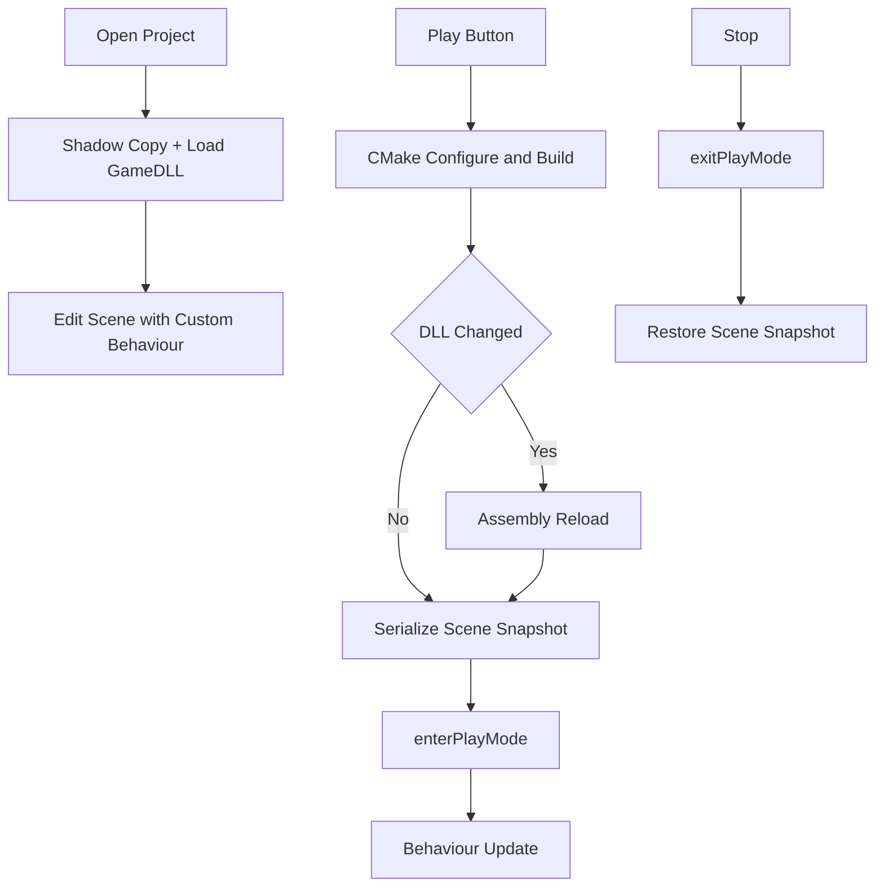
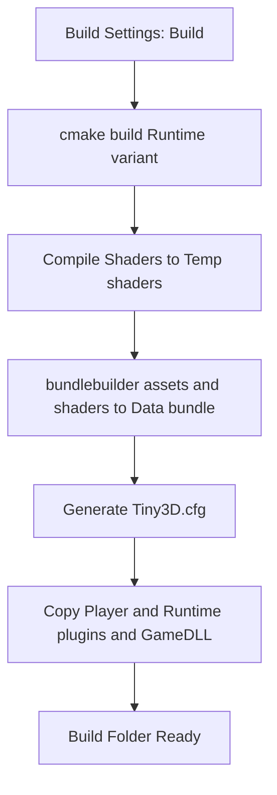

# TinyEditor Game Plugin + Play Mode 设计实现计划

> 目标：在 TinyEditor 新建工程时自动脚手架生成业务 **Game Plugin**（CMake 动态库 + `dllStartPlugin` 入口）；点 Play 时调 **CMake** 编译并加载该 DLL，再进入 Play Mode 执行业务 `Behaviour` 逻辑。对齐 Unity「脚本程序集由编辑器加载、Play 只切运行态」的思路，落到 Tiny3D 已有的 Plugin / Behaviour 体系上。

---

## 1. 背景与目标

### 1.1 现状

| 能力 | 现状 |
|------|------|
| 新建工程 | `ProjectManager::createProject`（`source/Editor/TinyEditor/ProjectManager.cpp`）已创建 `Assets/`、`Temp/`、默认场景，**无 Scripts / DLL 脚手架** |
| Play UI | `UIGameWindow` / `UIMainWindow` 仅有占位按钮与菜单项，未接线 |
| 插件加载 | `Agent::loadPlugin` + `dllStartPlugin` / `dllStopPlugin` 已成熟（Archive / Renderer / ImGui 等） |
| Play Mode API | `Agent::enterPlayMode` / `exitPlayMode` / `isPlaying` 已存在；默认 `mIsPlaying = true`；编辑器侧从未调用 |
| Behaviour | `Behaviour` 基类已实现；仅在 `isPlaying() \|\| executeInEditMode()` 时调度 |
| RTTR | `rttr_core` 以 **SHARED** 方式构建（`BUILD_RTTR_DYNAMIC`），类型注册表全局唯一 |
| Core 双构建 | `T3DCore`（Runtime）与 `T3DCoreEditor`（`-DT3D_EDITOR`）为两个独立且 **ABI 不兼容** 的库 |
| 资源打包 | `bundlebuilder`（`source/Tools/BundleBuilder/`）已可将带 `.meta` 的资源树打成 bundle |
| 独立 Player | **不存在**，各 Sample 均硬编码场景；Build Settings / Build And Run 菜单为占位 |

### 1.2 目标

1. 新建工程即带业务动态库工程（源码 + CMake）。
2. Play = **编译 → （必要时）重载 Plugin → 进 Play Mode → 跑 Behaviour**。
3. 编译时 DLL **不被编辑器占用**，改完代码可直接重新编译。
4. 改完代码点 Play 即生效，**无需重启编辑器**。
5. 入口复用现有 **T3D Plugin** 约定，不另造 GameModule API。
6. **一份业务源码**同时服务编辑器与 standalone 发布，导出无需改代码（见 §10）。

### 1.3 与 Unity 的对照

| | Unity | 本方案 |
|--|--------|--------|
| 业务代码载体 | C# 程序集（Assembly） | 原生 C++ Game Plugin DLL |
| 编译 | 改脚本后编辑器自动编译 | Play 时调 `cmake` 驱动平台工具链（见 §6.1） |
| 加载时机 | 打开工程即加载（Edit 态要用类型） | **同样打开工程即加载**（见 §2） |
| 避免文件占用 | 影子拷贝（Shadow Copy）后加载 | **同样采用影子拷贝**（见 §6.2） |
| 入口约定 | CLR 加载 + `MonoBehaviour` | `dllStartPlugin` / `dllStopPlugin` + `Behaviour` |
| 代码变更生效 | Domain Reload | 场景快照 + unload / load（见 §8） |
| Play | 切 Play Mode + 场景状态隔离 | `enterPlayMode` + 场景序列化快照 |
| Standalone 发布 | 同一份 C# 打进 Player（Mono 载程序集 / IL2CPP 静态化） | 同一份 C++ 源码再编一次 Runtime 变体，由 Player 加载（见 §10） |

大方向一致：业务代码在外部程序集，编辑器加载它，Play 只切运行态，发布时同一份代码换个宿主继续用。

---

## 2. 关键决策：加载时机为「打开工程即加载」

曾考虑「只在点 Play 时才加载 DLL」，**结论是不采用**。

原因在于反序列化对未注册类型的处理（`source/Core/Source/Serializer/T3DRttrArchive.cpp`）：

```cpp
type klass = type::get_by_name(typeName);
if (!klass.is_valid())
{
    T3D_LOG_ERROR(LOG_TAG_SERIALIZE,
        "RTTR type [%s] is not registered !", typeName.c_str());
    // endObject 会消费掉未读属性，维持流对齐
    r.endObject();
    break;
}
```

未注册类型会被**静默丢弃**。若 Edit 态未加载 Game DLL，则：

1. 打开工程加载场景 → 场景中自定义 `Behaviour` 组件全部丢失；
2. 用户在编辑器里改了任意别的东西并保存 → 脚本挂载信息**永久丢失**；
3. Inspector 也无法显示 / 挂载自定义脚本。

这是数据破坏级别的问题。因此采用与 Unity 相同的策略：**打开工程即加载 Game DLL**，而「编译时 DLL 被占用」这一真实痛点改由 **影子拷贝**（§6.2）解决。

---

## 3. 总体架构



**已选定约定：**

- 入口复用现有 T3D Plugin（`dllStartPlugin` / `dllStopPlugin`）。
- Play 时只调 `cmake`（configure + `--build`），由 CMake 驱动平台工具链，编辑器不感知具体构建器。
- 加载前做影子拷贝，原始编译产物永不被占用。

---

## 4. 工程目录约定

新建工程在现有结构上增加：

```
{Project}/
  Assets/
    Source/                         # 业务 C++（脚手架，在 Project 窗口可见；Scripts 留给后续真脚本）
      CMakeLists.txt                # 仅 add_subdirectory(Editor) + (Runtime)
      GamePlugin.h                  # ← 两个变体共享的业务源码，与 CMake 变体同层
      GamePlugin.cpp
      GamePluginDLL.cpp             # dllStartPlugin / dllStopPlugin
      ExampleBehaviour.h
      ExampleBehaviour.cpp          # 示例 Behaviour + RTTR_REGISTRATION
      Editor/CMakeLists.txt         # 目标 {Name}Editor，链 T3DCoreEditor
      Runtime/CMakeLists.txt        # 目标 {Name}，链 T3DCore
  Library/CppAssemblies/
    Editor/                         # {Name}Editor.dll，编辑器用
    Runtime/                        # {Name}.dll，导出打包用
  Temp/
    CppBuild/                       # 唯一的 CMake 构建目录，编辑器与 IDE 共用
      Generated/                    #   反射产物 + rpp 的 .deps 增量缓存
      *.sln                         #   「Open C++ Project」打开的解决方案
    ShadowAssemblies/               # 影子拷贝目标，编辑器实际加载这里
  Build/                            # standalone 导出产物（见 §10）
  ProjectSettings/
```

业务 `.h` / `.cpp` 与 `Editor/`、`Runtime/` 各一份 CMakeLists 同层。引擎自身插件仍用 Include/Source 拆分（参考 `source/Plugins/Archive/MetaFileSystem/`），游戏工程不再套这一层。用户只在 `Assets/Source/` 根下写代码，两个变体自动都有。

脚手架文件放在 `assets/editor/templates/GamePlugin/`（新建），`createProject` 时复制并做 `{ProjectName}` 替换，避免硬编码大段字符串。

---

## 5. 引擎侧小扩展

**问题：** `Dylib::onLoad`（`source/Core/Source/Resource/T3DDylib.cpp`）只从 `Agent::getPluginsPath()` 拼路径，业务 DLL 在工程目录。

**改动：**

1. 增加 `Agent::loadPluginFromPath(const String &name, const String &absDir)`（或 `Dylib` 支持绝对路径加载）。
2. 编辑器进程启动后调用 `exitPlayMode()`，保证 Edit 态 Behaviour 不 tick（Sample 仍默认 playing）。
3. `ProjectSettings` 增加字段：
   - `GamePluginName`（默认 = 工程名）
   - `CppSourceRelativePath`（默认 `Assets/Source`）

---

## 6. 编译管线（CMake + 影子拷贝）

新增编辑器类（建议）`CppBuildSystem`，或挂在 `ProjectManager`。

### 6.1 编译：只调 cmake，不直接调 MSBuild

编辑器**只执行 `cmake` 两条命令**，由 CMake 去驱动各平台的本地工具链（MSBuild / Ninja / Make / xcodebuild）。编辑器侧不出现任何平台专属的构建器命令，跨平台天然一致。

| 步骤 | 命令 |
|------|------|
| Configure（首次 / 文件集合变化 / 工程文件损坏） | `cmake -S Assets/Source -B Temp/CppBuild -DTINY3D_SDK_ROOT=... -DGAME_PROJECT_ROOT=... -DCMAKE_BUILD_TYPE=Debug [SDK 工具链参数]` |
| Build | `cmake --build Temp/CppBuild --target {Name}Editor --config Debug` |

**行为：**

- Play 前：若源码 / CMake 比 DLL 新，或 DLL 不存在 → 执行 build；失败则 Abort Play 并打日志 / 弹提示。
- 新鲜度判断基于**原始产物** `Library/CppAssemblies/{Name}.dll`，不是影子副本。
- `TINY3D_SDK_ROOT` = 编辑器 `appPath`（与现有插件、头文件布局一致的安装根）。

**一棵构建树，两个入口。** configure 的源目录是 `Assets/Source` 顶层（含 Editor / Runtime / Player 三个子工程），构建目录只有 `Temp/CppBuild` 一个，`--target` 决定编哪个变体。「编译 C++」菜单和「Open C++ Project」生成的解决方案指向同一棵树，因此在 VS 里编过之后回编辑器点编译会秒回，反之亦然。

早期版本是两棵树（编辑器 `Temp/CppBuild/{Variant}`、IDE `Temp/CppIDE`），target 同名、产物都落在 `Library/CppAssemblies/` 下，但 obj / `*.tlog` / 反射缓存各存一套——谁编过都会把对方的产物判成过期，换个入口就全量重编。`attachProject()` 会检测并删掉这两个旧目录的残留。

**reconfigure 判定刻意不看源码 mtime。** 只在 `CMakeCache.txt` 缺失、工程文件损坏、模板实际同步过、或「源码文件名集合 + `Generated/*.generated.cpp` 文件名集合」变化时才 reconfigure。改一行函数体就 reconfigure 的话，configure 期那趟 rpp、CMake 重新生成 vcxproj、以及 VS 的「工程已在外部修改」弹窗全都是白付出，而增量编译本来就该由 MSBuild / ninja 负责。产物集合放进判定是为了覆盖「给已有 .cpp 新增第一个 `TCLASS`」：源文件集合没变，但新产出的 `*.generated.cpp` 必须靠 configure 期的 `file(GLOB)` 才能进 target，所以 build 之后会再查一次集合，变了就 reconfigure 并重编一次。

### 6.1.1 反射生成的增量

`tiny3d_enable_reflection` 用 stamp 文件（`Generated/.rpp.stamp`）驱动 `add_custom_command`，而不是裸 `add_custom_target`——后者没有输出文件，CMake 一律视为 always-out-of-date，每次 build 都要把 rpp 启一遍扫全部头文件。CMake 侧的 `DEPENDS` 只能近似到业务源码加 `ReflectionSettings.json`（rpp 的真实依赖含引擎头，记在它自己的 `.deps` 里）。

reflect target 名按 `GENERATED_DIR` 派生而非 target 名：Editor 与 Runtime 两个变体共享同一个 `${CMAKE_BINARY_DIR}/Generated`，按 target 名派生会生成两个 target 并发往同一目录写。

rpp 写 `*.generated.cpp` 之前先跟旧内容比一遍，一样就跳过写入。它只要重解析过某个 `.cpp` 就必定重写产物，而重写出来的内容往往一模一样；真让 mtime 跳一下，下游 `.cpp` 会跟着重编再重链接。

### 6.1.2 并发与后台构建

- 编辑器四条会编译的路径（打开工程 / Play / 编译菜单 / Validate Runtime）都要先拿 `Temp/CppBuild/.build.lock` 的独占句柄。**VS 侧认不了这个锁**，MSBuild 不会去查，所以另外扫 cmake 输出里的 `LNK1104` / `MSB3021` / `being used by another process`，命中就提示「Visual Studio 可能正在编译同一个工程」而不是甩一屏日志。
- 除「打开工程」以外全部走 `buildAsync()` 后台线程，`PlayModeController::onFrameUpdate()` 每帧 poll，拿到终态后把热重载 / 进 Play 投递到 `postFrameEndTask` 的帧末安全点。构建期间 `ImProgressDialog`（不确定进度样式，无取消按钮）显示当前阶段，Compile / Play / Open C++ Project / Validate Runtime 一律置灰。
- 「打开工程」保持同步：场景反序列化必须等业务类型注册进 RTTR，改异步要把整个工程打开时序拆散，而它发生在启动阶段，阻塞可接受。

**同时传 `CMAKE_BUILD_TYPE` 与 `--config`。** 这不是冗余：单配置生成器（Ninja / Unix Makefiles）只认 configure 期的 `CMAKE_BUILD_TYPE` 并忽略 `--config`，多配置生成器（Visual Studio / Xcode）则相反。两个都给，同一套代码在任何生成器下都能拿到正确配置。

### 6.2 工具链一致性：SDK 导出生成器配置

不指定 `-G` 时 CMake 会用平台默认生成器，这对独立工程没问题，但业务 DLL 必须与编辑器 **ABI 兼容**——同一编译器、同一运行时库、同一配置。若编辑器用 VS2019 x64 构建，而业务工程 configure 时落到了别的编译器，加载后会以难以定位的方式崩溃。

做法：编辑器构建时把自身的工具链信息导出成 `Tiny3DSDK.cmake`（随编辑器一起安装）。

**这个文件本身就是平台相关的，但不需要写平台分支。** 它在编辑器构建时由 CMake 生成，天然带着当时那个平台的实际值——Windows 上构建出的 SDK 里写着 VS2019，macOS 上构建出的写着 Xcode。每个平台各发一份自己的编辑器，自然也各带一份自己的 SDK 配置。

按仓库现有构建脚本，三个平台导出的内容分别是：

**Windows**（`source/Projects/generate-vs2019-x64-debug.bat`）

```cmake
set(TINY3D_SDK_GENERATOR          "Visual Studio 16 2019")
set(TINY3D_SDK_GENERATOR_PLATFORM "x64")
set(TINY3D_SDK_GENERATOR_TOOLSET  "v142")
set(TINY3D_SDK_CXX_COMPILER       "")          # 由生成器决定，无需指定
set(TINY3D_SDK_MSVC_RUNTIME       "MultiThreadedDebugDLL")
set(TINY3D_SDK_CXX_STANDARD       17)
```

**macOS**（`source/Projects/generate-xcode-osx.sh`）

```cmake
set(TINY3D_SDK_GENERATOR          "Xcode")
set(TINY3D_SDK_GENERATOR_PLATFORM "")          # 不适用
set(TINY3D_SDK_GENERATOR_TOOLSET  "")          # 不适用
set(TINY3D_SDK_CXX_COMPILER       "/usr/bin/c++")   # xcrun -find c++ 的解析结果
set(TINY3D_SDK_MSVC_RUNTIME       "")          # 不适用
set(TINY3D_SDK_CXX_STANDARD       17)
```

**Linux**（`source/Projects/generate-codeblock-linux.sh`）

```cmake
set(TINY3D_SDK_GENERATOR          "Unix Makefiles")
set(TINY3D_SDK_GENERATOR_PLATFORM "")
set(TINY3D_SDK_GENERATOR_TOOLSET  "")
set(TINY3D_SDK_CXX_COMPILER       "/usr/bin/clang++")
set(TINY3D_SDK_MSVC_RUNTIME       "")
set(TINY3D_SDK_CXX_STANDARD       17)
```

`CppBuildSystem` 的逻辑是**平台无关**的：读文件，把非空项翻译成 configure 参数（`-G` / `-A` / `-T` / `-DCMAKE_CXX_COMPILER=` / `-DCMAKE_MSVC_RUNTIME_LIBRARY=`），空项直接跳过。编辑器代码里不出现任何 `#if defined(T3D_OS_WINDOWS)` 之类的构建分支。

三个导出细节要注意：

1. **VS 下平台与工具集要读对变量。** `generate-vs2019-x64-debug.bat` 只写了 `-G "Visual Studio 16 2019"`，没有 `-A` 也没有 `-T`（VS2019 在 64 位主机上默认 x64、默认工具集 v142）。此时 `CMAKE_GENERATOR_PLATFORM` 与 `CMAKE_GENERATOR_TOOLSET` **都是空值**，因为它们只反映命令行显式传了什么。应改读实际生效值：

   | 导出项 | 正确来源 | 不要用 |
   |--------|----------|--------|
   | 平台 | `CMAKE_VS_PLATFORM_NAME` | `CMAKE_GENERATOR_PLATFORM` |
   | 工具集 | `CMAKE_VS_PLATFORM_TOOLSET` | `CMAKE_GENERATOR_TOOLSET` |

2. **Linux 的 IDE 生成器前缀会自动剥离。** 脚本用的是 `-G "CodeBlocks - Unix Makefiles"`，但 CMake 会把它拆成 `CMAKE_GENERATOR` = `Unix Makefiles` 与 `CMAKE_EXTRA_GENERATOR` = `CodeBlocks`。导出 `CMAKE_GENERATOR` 正好得到底层生成器，业务工程不会被生成一堆无用的 CodeBlocks 工程文件。

3. **类 Unix 平台上编译器必须导出。** Linux 脚本用 `CC=clang CXX=clang++` 环境变量指定编译器，业务工程 configure 时不会继承这个环境。若漏了 `CMAKE_CXX_COMPILER`，业务 DLL 可能被 g++ 编译并链到 libstdc++，而编辑器是 clang++ + libc++，二者 ABI 不兼容。Windows 上反而不需要，生成器已经决定了编译器。

这样生成器由 SDK 决定而非编辑器代码硬编码；日后从 VS2019 升到 VS2022（仓库里已有 `generate-vs2022-x64-debug.bat`）只需重新导出 SDK，业务侧与编辑器侧代码都不用动。

### 6.3 影子拷贝（解决 DLL 被占用）

Windows 上 `LoadLibrary` 会锁定文件，导致下一次链接无法覆盖输出。做法与 Unity 一致：**编辑器永不直接加载编译产物**。

```
Library/CppAssemblies/Game.dll         ← 构建输出（始终可写）
        ↓ 加载前拷贝
Temp/ShadowAssemblies/Game_{stamp}.dll ← 编辑器实际加载这一份
```

要点：

1. `{stamp}` 保证每次 reload 拷到新文件名，旧文件即便还被锁也不影响新编译。
2. **调试符号一并拷贝**，否则断点失效。各平台伴随文件不同，由 `CppBuildSystem` 按平台处理：

   | 平台 | 动态库 | 需要一并拷贝的符号 |
   |------|--------|--------------------|
   | Windows (MSVC) | `Game.dll` | `Game.pdb` |
   | Linux | `libGame.so` | 无（DWARF 内嵌） |
   | macOS | `libGame.dylib` | `libGame.dylib.dSYM/`（若生成） |

   Windows 还需在模板 CMake 中设置
   `target_link_options(${TARGET} PRIVATE "/PDBALTPATH:$<TARGET_PDB_FILE_NAME:${TARGET}>")`，
   让 DLL 内记录的是 PDB 文件名而非绝对路径，调试器会在 DLL 同目录（影子目录）查找，从而不会锁住构建目录下的原始 PDB。

3. `{stamp}` 取**编译产物的最后修改时间**而非「当前时间」。同一份产物重复打开工程时影子名相同，可直接复用已有副本，不做多余拷贝。

**各平台统一走影子拷贝。** 严格说只有 Windows 必需——Linux / macOS 的链接器写新产物时会先 unlink 旧 inode，已 `dlopen` 的旧文件不受影响。但保持同一条代码路径可以避免平台分支带来的行为差异，拷贝成本相对编译本身可以忽略。库文件名的平台前后缀差异由现有 `Dylib::onLoad` 处理，影子层只需按同样规则命名。

**磁盘占用不会累积。** 时间戳是**容错**手段而非保留历史：旧影子在 `FreeLibrary` 之后即解锁，Reload 流程中「卸载旧的」紧接着就是「删除旧的」（见 §8），稳态下影子目录只有**当前加载的 1 份**。

之所以不用固定文件名 `Game.dll`，是因为删除偶尔会失败（调试器仍持有 PDB、杀毒软件正在扫描）。固定名一旦删不掉，新副本就拷不进去，Reload 直接失败；带时间戳则「旧的删不掉也不挡路」，最坏情况是多留一两份，由下次清理回收。

清理时机（三重保险）：

| 时机 | 动作 |
|------|------|
| 每次 Reload 卸载后 | 立即删除刚卸载的那份 DLL + PDB |
| 打开工程时 | 扫描影子目录，删除全部残留 |
| 关闭工程时 | 扫描影子目录，跳过当前加载的那份，删除其余 |

删除失败一律忽略（记 debug 日志即可），留给下一次清理。

---

## 7. Play / Stop 流程

新增 `PlayModeController`（编辑器内，协调 UI 与引擎）。

### 7.1 打开工程

1. 若 `Library/CppAssemblies/{Name}.dll` 存在 → 影子拷贝 → `loadPluginFromPath`
2. 再加载启动场景（顺序不可颠倒，否则自定义组件被丢弃，见 §2）
3. 后台 configure，为首次 Play 预热

### 7.2 Enter Play

1. 若场景脏：先保存（或提示）
2. `buildGamePlugin()`（cmake configure + build）
3. 若产物比当前已加载的影子副本新 → 执行 **Assembly Reload**（§8）
4. **场景快照**：把当前 runtime scene 序列化到内存
5. `Agent::enterPlayMode()`
6. 更新工具栏状态（Play 禁用 / Stop 可用）

### 7.3 Exit Play（Stop）

1. `Agent::exitPlayMode()`
2. 从快照恢复场景（反序列化替换 runtime scene）
3. 保持 Game Plugin 加载（Edit 态 Inspector / 反序列化仍需 RTTR 类型）

### 7.4 UI 接线

- `UIGameWindow::createToolBar`：Play / Pause / Step 回调
- `UIMainWindow`：菜单 `ID_MENU_ITEM_PLAY` 等取消 disable，接到同一 Controller
- Pause / Step：首期可只做 Pause（`mIsPlaying` 或独立 `mIsPaused`）；Step 可二期

---

## 8. Assembly Reload（改代码后免重启生效）

RTTR 支持 DLL 卸载时自动注销其注册的类型
（`source/External/rttr/src/rttr/detail/registration/registration_manager.h`）：

```cpp
~registration_manager()
{
    unregister();   // 注销该 DLL 注册的所有 type / property / method
}
```

因为 `rttr_core` 是 SHARED 库、注册表全局唯一，`FreeLibrary` 时该 DLL 内的 `registration_manager`
静态对象析构，类型条目会被干净移除。这使得「Domain Reload」等价流程可行。

**Reload 步骤（必须严格按序）：**

1. 将当前场景序列化为**内存字节快照**（纯数据，不持有任何对象引用）
2. 销毁场景中所有 GameObject / Component，确保**没有任何实例来自旧 DLL**
3. `unloadPlugin` → `dllStopPlugin` → `FreeLibrary` → RTTR 自动注销旧类型
4. **删除刚卸载的影子副本**（DLL + PDB），此时文件已解锁；删除失败仅记日志，留待下次清理
5. 影子拷贝新产物 → `loadPluginFromPath` → RTTR 重新注册新类型
6. 从快照反序列化恢复场景，此时新类型已就位

**约束：**

- 第 2 步必须彻底。任何残留的智能指针（缓存、事件订阅、Inspector 选中项）指向旧 DLL 内对象，`FreeLibrary` 后即为悬垂指针。实现时需清理 Inspector 选中态、事件订阅表等编辑器侧引用。
- Reload 只在 **Edit 态**执行（Play 中不允许），避免运行时对象生命周期与卸载交叉。
- 编辑器默认 `mIsPlaying = false`，避免未点 Play 就跑 `onUpdate`。

---

## 9. 新建工程脚手架

在 `ProjectManager::createProject` 末尾调用 `createGamePluginScaffold()`：

1. 复制 `assets/editor/templates/GamePlugin/` → `{project}/Assets/Source/`（须在 MetaFS 挂载扫描之前，以便生成 `.meta`）
2. 替换模板中的工程名 / DLL 名
3. 写入 `ProjectSettings` 中的插件名与 `CppSourceRelativePath=Assets/Source`

### 9.1 模板 CMakeLists.txt 要点

两个变体共用 `Assets/Source/` 根下同一份 `.h` / `.cpp`，差异只在 CMake：

| | `Editor/CMakeLists.txt` | `Runtime/CMakeLists.txt` |
|--|--------------------------|---------------------------|
| 目标名 | `{Name}Editor` | `{Name}` |
| 链接 Core | `T3DCoreEditor` | `T3DCore` |
| 定义 | `-DT3D_EDITOR` | 无 |
| 输出目录 | `Library/CppAssemblies/Editor` | `Library/CppAssemblies/Runtime` |
| 何时构建 | 每次 Play（见 §7） | 仅导出时（见 §10） |

两者共同点：

- `add_library(... SHARED ...)`，源码取自 `Assets/Source/` 根目录（`*.h` / `*.cpp`）
- 通过 `-DTINY3D_SDK_ROOT=` 指向编辑器安装目录（含 Include、已编译的 Core / RTTR）
- `target_link_libraries(... T3DPlatform T3DSystem T3DLog T3DUtils T3DMath rttr_core)`
- `RUNTIME_OUTPUT_DIRECTORY` / `LIBRARY_OUTPUT_DIRECTORY` 都设（Windows 用前者，Unix 用后者）
- MSVC 下的 `/PDBALTPATH` 设置（见 §6.3）
- 导出宏 + `GamePluginDLL.cpp` 与现有插件一致（参考 `source/Plugins/Archive/MetaFileSystem/Source/T3DMetaFSArchivePluginDLL.cpp`）

### 9.2 GamePlugin 生命周期

- `install` / `startup`：可空或做轻量初始化；**类型注册靠 DLL 加载时的 `RTTR_REGISTRATION`**
- 业务逻辑写在 `Behaviour` 派生类中（与 `source/Samples/BehaviourApp/RotateBehaviour` 同模式）

### 9.3 业务代码必须只用 Runtime 稳定 API

为保证同一份源码能编出 Runtime 变体，模板注释与文档需明确：业务代码**不得使用 Editor-only API**，包括

- `Scene::getEditorCamera` / `getEditorGameObject` / `getRuntimeScene` 等 `#if defined(T3D_EDITOR)` 方法
- `EditorScene`、`PrefabUtility`
- `PrefabInstance` 的编辑器方法（`revertAll` 等）
- `ResourceManager::clone(..., uuid)`、`ShaderManager::createShader(name, uuid)` 等带 UUID 的编辑器重载

`GameObject`、`Component`、`Behaviour`、`Transform3D` 以及 `Scene` 的常规 API 在两种构建下完全一致，正常 gameplay 不会碰到边界。误用的后果是 Runtime 变体编译失败——**在导出时才暴露**，因此提供 §10.7 的提前校验入口。

---

## 10. Standalone 导出

> 本节是**二期**内容，但一期的目录结构与模板必须按此设计，否则后续要返工。

### 10.1 Player 是什么，为什么编辑器加载了 DLL 还需要它

两者服务的是**完全不同的场景**：

| | TinyEditor | Tiny3DPlayer |
|--|-----------|--------------|
| 使用者 | 开发者 | 玩家 |
| 什么时候跑 | 开发期，点 Play 在编辑器进程内运行 | 游戏发布后，玩家双击运行 |
| 界面 | ImGui 编辑器面板 + Game 视图 | 只有游戏画面 |
| 加载哪个 Game DLL | Editor 变体（链 `T3DCoreEditor`） | Runtime 变体（链 `T3DCore`） |
| 资源来源 | 工程 `Assets/` 目录，MetaFS 逐文件读 | `Data/bundle`，打包后只读 |
| 是否需要 CMake / VS | 需要，要现场编译业务代码 | 不需要 |
| 是否需要工程源码 | 需要 | 不需要 |

编辑器确实直接加载 Game DLL，但那是**开发时**，宿主是 `TinyEditor.exe`。游戏发出去时不可能要求玩家装一套 TinyEditor 再打开工程点 Play——所以需要一个不带编辑功能、不依赖工程目录、不需要编译工具链的轻量宿主，这就是 Player。

对应 Unity：编辑器里点 Play 跑在 Unity Editor 进程内，而 Build 出来的 `MyGame.exe` 就是 Unity 所说的 **Player**，本节沿用这个术语。

### 10.2 为什么必须编两份

`T3DCore` 与 `T3DCoreEditor` 是两个 **ABI 不兼容** 的库。`source/Core/Include/Resource/T3DScene.h` 在 Editor 构建下向 `Scene` 插入了 5 个额外虚函数：

```cpp
#if defined(T3D_EDITOR)
        virtual Camera *getEditorCamera() const { return nullptr; }
        virtual GameObject *getEditorGameObject() const { return nullptr; }
        virtual Transform3D *getEditorRootTransform() const { return nullptr; }
        virtual void setRuntimeScene(Scene *scene) {}
        virtual Scene *getRuntimeScene() const { return nullptr; }
#endif
```

vtable 槽位因此不同（`SceneManagerImpl` 还多一个纯虚函数）。把编辑器版 Game DLL 丢给 Runtime 宿主加载 = 未定义行为。

**但这不影响「一份代码」的目标**：`GameObject`、`Component`、`Behaviour` 三个头文件里**没有任何** `T3D_EDITOR` 条件成员，对象布局在两种构建下完全一致。所以业务源码不需要改，只需要**用两套 CMake 配置各编一次**——这正是引擎自身每个插件在做的事。

### 10.3 导出产物布局

```
{Project}/Build/{Platform}/
  {GameName}.exe          # Tiny3DPlayer 改名，或原名 + 配置指定标题
  Tiny3D.cfg              # 生成，含插件列表 + 启动场景 UUID
  T3DCore.dll  T3DPlatform.dll  ...  rttr_core.dll
  {Name}.dll              # ← Library/CppAssemblies/Runtime 的产物
  FileSystemArchive.dll  BundleFSArchive.dll  D3D11Renderer.dll  FreeImageCodec.dll
  Data/bundle/            # bundlebuilder 产物
    bundle.manifest
    <uuid 散列文件>...
```

### 10.4 导出流程



1. **编译 Runtime 变体**：`cmake --build Temp/CppBuild --target {Name}` → `Library/CppAssemblies/Runtime/{Name}.dll`
2. **编译 shader**：复用现有 `ProjectManager::compileAllShaders`
3. **打包资源**：调用已有工具
   `bundlebuilder --assets {Project}/Assets --assets {Project}/Temp/shaders --out Build/{Platform}/Data/bundle --binary --keep-languages hlsl`
   （语言按目标平台裁剪，可显著减小体积）
4. **生成 `Tiny3D.cfg`**：用 RTTR 序列化 `Settings`，插件列表为 Runtime 变体名 + **业务 DLL 名**
5. **复制**：Player 可执行文件、引擎 Runtime DLL、Runtime 插件、Game DLL

### 10.5 Player 的启动路径

新增 `Tiny3DPlayer` 目标（`source/Player/`，链 `T3DCore`）。它不硬编码任何场景，逻辑约百行：

```
Agent::init(argc, argv, true, true)      // 读 Tiny3D.cfg
  └─ loadPlugins()                        // 含 Game DLL → RTTR_REGISTRATION 执行
applicationDidFinishLaunching:
  mount Data/bundle (BundleFileSystem, kRuntime)
  T3D_ASSET_MGR.loadScene(startupSceneUUID)
  setCurrentScene
Agent::run()                              // mIsPlaying 默认 true，Behaviour 直接跑
```

有三点正好天然成立，不需要额外机制：

- **加载顺序自动正确。** `Agent::loadPlugins()` 在 `loadConfig` 之后、场景加载之前执行，Game DLL 只要写进 cfg 的 `plugins` 列表就会先于场景就绪，§2 描述的「类型未注册导致组件被丢弃」不会发生。
- **不需要影子拷贝，也不需要 `loadPluginFromPath`。** Player 不热重载，Game DLL 就放在插件目录，走标准 `loadPlugin` 即可。
- **不需要切 Play Mode。** `Agent::mIsPlaying` 默认为 `true`，只有编辑器才需要 `exitPlayMode()`（见 §5）。

### 10.6 启动场景 UUID 的传递

`ProjectSettings` 是 `Tiny3D::Editor` 命名空间的类型，Player 链 `T3DCore` 用不了。因此在 `source/Core/Include/Kernel/T3DSettings.h` 的 `Settings` 中新增一节：

```cpp
TSTRUCT()
struct GameSettings
{
    TPROPERTY() String startupSceneUUID {};
    TPROPERTY() String bundlePath {"Data/bundle"};
};
```

导出时由编辑器把 `ProjectSettings.StartupSceneUUID` 写进去。这样 Player 只读 `Tiny3D.cfg` 一个文件就拿到全部启动信息，不引入新的配置文件格式。

### 10.7 提前校验 Runtime 变体

误用 Editor-only API（§9.3）的后果是 Runtime 变体编译失败，而它平时不编译，问题会拖到导出时才爆发。因此在菜单提供 **Validate Runtime Build**：只跑 Runtime 变体的编译，不做打包，让用户随时确认代码仍是可发布的。二期可改为在 Play 编译后台顺带增量编一次 Runtime 变体。

---

## 11. 主要改动文件

| 区域 | 文件 |
|------|------|
| 模板 | 新建 `assets/editor/templates/GamePlugin/*`（含 Editor / Runtime 两套 CMakeLists） |
| 工程创建 | `source/Editor/TinyEditor/ProjectManager.cpp/.h`、`ProjectSettings.h/.cpp` |
| 编译 + 影子拷贝 | 新建 `CppBuildSystem.cpp/.h` |
| Play / Reload | 新建 `PlayModeController.cpp/.h`；改 `UIGameWindow` / `UIMainWindow` |
| 引擎 | `T3DAgent`、`T3DDylib` 支持按目录加载 |
| 编辑器启动 | `EditorApp` 初始化后 `exitPlayMode()` |
| 导出（二期） | 新建 `source/Player/`（`Tiny3DPlayer`）、`BuildPipeline.cpp/.h`、`T3DSettings.h` 增 `GameSettings` |

---

## 12. 分期与任务清单

### 12.1 一期（本计划交付）

- [x] 扩展 Agent / Dylib：支持从工程目录 `loadPluginFromPath`；编辑器启动后 `exitPlayMode`
- [x] 新增 `assets/editor/templates/GamePlugin` 模板：业务 `.h` / `.cpp` 与 CMake 变体同层 + Editor / Runtime 两套 CMakeLists（跨平台输出目录 + MSVC `/PDBALTPATH`），并在 `createProject` 中复制生成 `Assets/Source/`
- [x] 编辑器构建时导出 `Tiny3DSDK.cmake`（生成器 / 平台 / 工具集 / 编译器 / 运行时库），随编辑器安装；VS 下取 `CMAKE_VS_PLATFORM_NAME` 与 `CMAKE_VS_PLATFORM_TOOLSET` 以免空值，类 Unix 下必须导出 `CMAKE_CXX_COMPILER`
- [x] 实现 `CppBuildSystem`：读取 `Tiny3DSDK.cmake` 拼参数，`cmake` configure + `cmake --build`（同时传 `CMAKE_BUILD_TYPE` 与 `--config`），输出到 `Library/CppAssemblies`
- [x] 实现影子拷贝：加载前拷动态库 + 平台对应符号文件到 `Temp/ShadowAssemblies/{Name}_{stamp}`（stamp 取产物 mtime，同名可复用）
- [x] 实现影子清理：卸载后立即删除该副本 + 工程打开 / 关闭时扫描清空残留
- [x] `ProjectSettings` 增加 `GamePluginName` 等字段；**打开工程时先加载 Game DLL 再加载场景**
- [x] 实现 `PlayModeController`：build → 必要时 Assembly Reload → 场景快照 → `enterPlayMode`；Stop 恢复快照
- [x] 实现 Assembly Reload：快照 → 销毁场景对象 → unload → 影子加载 → 恢复场景；清理 Inspector 选中态等编辑器侧引用
- [x] 接线 `UIGameWindow` / `UIMainWindow` 的 Play / Stop
- [ ] 示例 `ExampleBehaviour` 可在场景上手动挂上后 Play 可见效果（需在编辑器里手动挂载验证）
- [x] 「Validate Runtime Build」菜单：只编 Runtime 变体，提前暴露 Editor-only API 误用（§10.7）

### 12.2 二期：Standalone 导出

- [ ] `T3DSettings.h` 新增 `GameSettings`（`startupSceneUUID` / `bundlePath`）
- [ ] 新建 `Tiny3DPlayer` 目标（`source/Player/`，链 `T3DCore`）：读 cfg → 挂 bundle → `loadScene` → `run`
- [ ] 实现 `BuildPipeline`：编 Runtime 变体 → 编 shader → 调 `bundlebuilder` → 生成 cfg → 复制产物
- [ ] 实现 Build Settings 窗口 + 接线 Build And Run（启动 Player 子进程）

### 12.3 三期（暂不排期）

- Pause / 单帧 Step
- 文件监听自动触发编译（保存即编译，而非等到 Play）
- Inspector「Add Component」列出 DLL 内 Behaviour
- Android / iOS 发布打包（APK 内 `.so` 提取见 `.cursor/rules/zip-asset-manager-design.mdc`）
- 在 Linux / macOS 上实机验证构建与 Reload 流程（设计已跨平台，一期只在 Windows 验证）

---

## 13. 风险与约束

1. 用户工程必须能链接到编辑器同 ABI 的 `T3DCoreEditor`；工具链与 Debug / Release 配置需与 TinyEditor 一致，这依赖 §6.2 的 `Tiny3DSDK.cmake` 导出是否准确。导出信息与实际编辑器构建不符时，症状是加载后随机崩溃而非明确报错。
2. 依赖本机已安装 CMake 及可用的原生工具链（Windows 上为 Visual Studio，Linux 为 GCC/Clang + Make/Ninja，macOS 为 Xcode Command Line Tools）。编辑器侧只调 `cmake`，工具链缺失由 CMake 报错并透传到编辑器日志。
3. RTTR 跨 DLL：业务 DLL 与引擎必须共用 **SHARED** 的 `rttr_core`，否则注册表分裂、卸载注销失效。
4. Assembly Reload 的正确性取决于「销毁阶段是否彻底」。任何遗漏的跨 DLL 引用都会在 `FreeLibrary` 后变成悬垂指针，表现为难以定位的崩溃。实现时优先保证清理完整，必要时先以「reload 失败则提示重启编辑器」兜底。
5. 影子副本靠「卸载后立即删除 + 开关工程各扫一次」回收，稳态为 1 份。若这套清理失效（例如卸载路径异常退出），`Temp/ShadowAssemblies` 会随 reload 次数累积，Debug 版 PDB 体积可观，需保证清理逻辑在异常分支也会执行。
6. Editor 与 Runtime 两个变体的产物名不同（`{Name}Editor` / `{Name}`）且**不可混用**。加载错变体不会立刻报错，而是在虚调用 `Scene` 时崩溃。`CppBuildSystem` 与 `BuildPipeline` 必须各自锁定自己的输出目录，不做任何回退查找。
7. `source/Core/Editor/CMakeLists.txt` 引用的 `Include/Editor/`、`Source/Editor/` 目录当前并不存在；若后续这两个目录被填充，需重新评估 Editor / Runtime 的 ABI 差异是否扩大。
8. Standalone 导出依赖 `bundlebuilder` 的既有行为（`.meta` 扫描、ShaderLab ALIAS、`--keep-languages` 裁剪）。它自身要以 NullRenderer 起一个引擎实例并加载 Editor 版 Archive 插件，因此导出机器上必须具备完整的编辑器运行环境。
