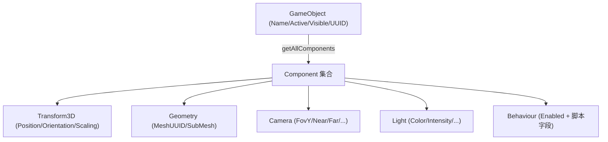
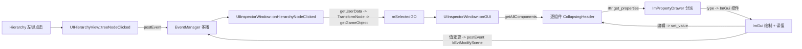

# Inspector 面板实现设计与分步计划（对齐 Unity Inspector）

> 目标：把 TinyEditor 当前的空壳 Inspector 面板实现为「选中 GameObject → 显示并编辑其所有组件属性」的可用检查器，逐步对齐 [Unity-Inspector-功能分析](../Unity-Inspector-功能分析.md) 中梳理的能力。核心思路是复用引擎已就绪的 **RTTR 反射 + `TPROPERTY`** 数据层，新增一层 **反射驱动的属性绘制模块**，并打通 Hierarchy 选中联动。
>
> 本文档为施工蓝图，代码片段均以「建议实现」形式给出并标注现有参考位置，不代表已落地。

---

## 1. 背景与目标

TinyEditor 是基于 C++17 + Dear ImGui + RTTR 反射的原生编辑器，采用与 Unity 高度相似的 **GameObject + Component** 对象模型。引擎侧各组件（`Transform3D`、`Camera`、`Light`、`Geometry` 等）已通过 `TCLASS`/`TPROPERTY` 标注可序列化属性，序列化子系统 [`T3DBinSerializer.cpp`](../../source/Core/Source/Serializer/T3DBinSerializer.cpp) 已在用 `rttr::type::get_properties()` 遍历并读写这些属性。

**数据层已就绪，UI 层是唯一缺口。** 本方案要补齐这层 UI，并明确分阶段落地。

### 1.1 本期目标

1. 打通 Hierarchy → Inspector 的选中联动。
2. 选中 GameObject 后，显示其头部信息（Name / Active / Visible）与全部组件列表。
3. 基于反射自动为组件属性生成编辑控件（基础类型 + 常用复合类型）。
4. 支持添加 / 移除组件、组件 Reset。
5. 为 metadata 驱动的 UI（Tooltip / Range / Header）与进阶能力（多选编辑 / Undo / Custom Editor）预留清晰扩展点。

### 1.2 本期边界（暂不实现）

- 完整 Prefab override 蓝条与 Apply/Revert（依赖 Prefab 系统成熟度）。
- 曲线（AnimationCurve）/ 渐变（Gradient）编辑器。
- 完整 Undo/Redo 命令栈（仅预留接口，Phase 6 视情况实现）。

对标能力的完整清单见 [Unity-Inspector-功能分析](../Unity-Inspector-功能分析.md)。

---

## 2. 现状分析

### 2.1 缺口与已就绪基础设施对照

| 环节 | 现状 | 结论 |
|------|------|------|
| Inspector 窗口 | [`UIInspectorWindow.cpp`](../../source/Editor/TinyEditor/UIInspectorWindow.cpp) 的 `onGUI()` 为空，未继承 `EventHandler` | 需实现绘制 + 订阅事件 |
| 选中发送端 | `UIHierarchyView::treeNodeClicked()`（[`UIHierarchyWindow.cpp:270`](../../source/Editor/TinyEditor/UIHierarchyWindow.cpp)）为空，不发事件 | 需补 `postEvent` |
| 选中事件定义 | `kEvtHierarchyNodeClicked` 已定义，payload 为 `EventParamT1<ImTreeNode*>`（[`EditorEventDefine.h`](../../source/Editor/TinyEditor/EditorEventDefine.h)） | 可复用，但被 Project 资产树共用（见 §4.1） |
| 节点→对象 | `ImTreeNode::getUserData()` → `TransformNode*` → `getGameObject()`；双向 userdata 在 `createTreeNode()`（`UIHierarchyWindow.cpp:325`）建立 | 链路已存在 |
| 事件订阅范式 | `ON_MEMBER(evid, Class::func)` 注册 + `unregisterAllEvent()` 反注册，参考 `UIAssetPathBar` | 直接套用 |
| 属性控件封装 | TinyImGui 仅有 `ImInputText`，无 `InputFloat/Checkbox/ColorEdit/Combo/CollapsingHeader` 封装 | 直接调 `ImGui::` 原生 API（`imgui.h` 已全局可用） |
| 反射遍历 | `T3DBinSerializer` 的 `WriteObject`/`FillObjectMembers` 提供成熟范式 | 复用其分派逻辑 |
| 类型注册 | `Vector3/Quaternion/ColorRGBA/UUID` 均为带子属性的 class | 可递归子属性，或整体用 `DragFloatN` |
| 组件遍历 | `GameObject::getAllComponents()` 返回组件集合；`addComponent(name)`/`removeComponent(type)` 可用 | 直接套用 |
| 场景 Dirty | 已有 `kEvtModifyScene`（`EventParamT1<bool>`） | 编辑写回后发此事件标脏 |

### 2.2 关键约束

- **IMGUI 模式**：每帧重建 UI，控件的值直接绑定到组件属性的即时读写，不存在中间 model 缓存（除非刻意引入）。
- **值类型属性**：`Vector3`/`Quaternion`/`ColorRGBA` 在 RTTR 中是 class，读回后修改需**整体 `set_value`**（不能对内部字段就地写）。
- **多播事件歧义**：`kEvtHierarchyNodeClicked` 同时被 Project 资产树发送，其 `ImTreeNode` 的 userdata 是 `UIAssetNode*` 而非 `TransformNode*`，订阅方必须能区分来源（见 §4.1）。

### 2.3 现有对象模型（供绘制参考）



---

## 3. 总体架构设计

### 3.1 数据流



### 3.2 新增核心模块：`ImPropertyDrawer`

反射驱动的「类型 → 控件」分派层，是本方案唯一的新增核心模块。放在 Editor 层（建议 `source/Editor/TinyEditor/GUIExtension/ImPropertyDrawer.h/.cpp`，与 `ImSearchInputText` 同目录）。

职责：输入一个 `rttr::instance` + `rttr::property`，读值 → 匹配 ImGui 控件 → 绘制 → 若被编辑则写回，并返回「是否发生变更」。

接口草案（建议实现）：

```cpp
namespace Tiny3D { NS_BEGIN(Editor)

class ImPropertyDrawer
{
public:
    // 绘制某对象的全部属性；返回是否有任一属性被修改
    static bool drawObject(const rttr::instance &obj);

    // 绘制单个属性（供递归复合类型使用）
    static bool drawProperty(const rttr::instance &obj, const rttr::property &prop);

private:
    // 按 variant/type 分派到具体控件；label 为显示名
    static bool drawValue(const String &label, const rttr::type &type,
                          rttr::variant &value);

    static bool drawArithmetic(const String &label, const rttr::type &t, rttr::variant &v);
    static bool drawEnum(const String &label, const rttr::type &t, rttr::variant &v);
    static bool drawString(const String &label, rttr::variant &v);
    static bool drawVector3(const String &label, rttr::variant &v);
    static bool drawQuaternion(const String &label, rttr::variant &v);   // 以欧拉角编辑
    static bool drawColor(const String &label, rttr::variant &v);
    static bool drawUUID(const String &label, rttr::variant &v);
    static bool drawObjectRef(const String &label, rttr::variant &v);    // Phase 4
    static bool drawSequential(const String &label, rttr::variant &v);   // Phase 4
};

NS_END }
```

`drawObject` 的骨架对齐 `T3DBinSerializer::WriteObject` 的遍历方式（建议实现）：

```cpp
bool ImPropertyDrawer::drawObject(const rttr::instance &obj)
{
    bool changed = false;
    const rttr::instance real = obj.get_type().get_raw_type().is_wrapper()
        ? obj.get_wrapped_instance() : obj;
    const rttr::type derived = real.get_derived_type();

    for (auto prop : derived.get_properties())
    {
        if (prop.get_metadata("NO_SERIALIZE")) continue;   // 与序列化一致的过滤
        if (prop.get_metadata("HIDE_IN_INSPECTOR")) continue; // Phase 5 扩展
        changed |= drawProperty(real, prop);
    }
    return changed;
}
```

### 3.3 Inspector 窗口职责

`UIInspectorWindow` 负责：订阅选中事件、维护 `mSelectedGO`、绘制 GameObject 头部与组件列表，把每个组件交给 `ImPropertyDrawer::drawObject()`。

---

## 4. 关键设计决策

### 4.1 选中事件方案（复用 vs 新增）

| 方案 | 做法 | 优点 | 缺点 |
|------|------|------|------|
| A. 复用 `kEvtHierarchyNodeClicked` | 场景树补 `postEvent`，Inspector 订阅并从 `ImTreeNode` 取 `TransformNode` | 改动最小，事件已存在 | 与 Project 资产树共用，userdata 类型不同（`TransformNode*` vs `UIAssetNode*`），Inspector 需能识别来源，易出错 |
| **B. 新增 `kEvtGameObjectSelected`（推荐）** | 新增事件 `EventParamT1<GameObject*>`，场景树点击时解析出 `GameObject*` 再发送 | 语义清晰、类型安全、无歧义；Inspector 直接拿 `GameObject*` | 需在 `EditorEventDefine.h` 加一个事件 ID + param 别名 |

**推荐方案 B**。在 `EditorEventDefine.h` 增加：

```cpp
// 选中 GameObject，参数：EventParamGameObjectSelected（可为 nullptr 表示清空）
kEvtGameObjectSelected,
// ...
using EventParamGameObjectSelected = EventParamT1<GameObject*>;
```

场景树发送端（`UIHierarchyView::treeNodeClicked`，建议实现）：

```cpp
void UIHierarchyView::treeNodeClicked(ImTreeNode *node)
{
    TransformNode *xform = static_cast<TransformNode *>(node->getUserData());
    GameObject *go = (xform && !EDITOR_SCENE.isSceneRoot(xform))
        ? xform->getGameObject() : nullptr;
    EventParamGameObjectSelected param(go);
    postEvent(kEvtGameObjectSelected, &param);
}
```

> 若倾向最小改动，可选方案 A，但订阅方必须用「仅当 userdata 能安全解释为 TransformNode 时才处理」的策略，并注意资产树点击也会触发。本文后续片段以方案 B 为准。

### 4.2 PropertyDrawer 类型分派表

| RTTR 类型判断 | ImGui 控件 | 备注 |
|---------------|-----------|------|
| `t == type::get<bool>()` | `ImGui::Checkbox` | |
| `t.is_arithmetic()`（int 系） | `ImGui::DragInt` / `InputInt` | 按位宽转换 |
| `t.is_arithmetic()`（float/double） | `ImGui::DragFloat` | |
| `t == type::get<std::string>()` | `ImGui::InputText`（或复用 `ImInputText`） | 需 char buffer |
| `t.is_enumeration()` | `ImGui::BeginCombo` + `get_enumeration().get_names()` | 名称↔值转换 |
| `t == type::get<Vector3>()` | `ImGui::DragFloat3` | 整体读回改后 `set_value` |
| `t == type::get<Quaternion>()` | `ImGui::DragFloat3`（欧拉角） | UI 欧拉↔内部四元数转换 |
| `t == type::get<ColorRGBA>()` | `ImGui::ColorEdit4` | |
| `t == type::get<UUID>()` | `InputText`（只读显示）/ 资源选择器 | Phase 1 只读显示，Phase 4 接选择器 |
| `t.is_sequential_container()` | 折叠列表 + 增删 | Phase 4 |
| `t.is_pointer()` 或 wrapper 派生自 `Object` | Object 引用字段 | Phase 4 |
| `prop.is_readonly()` | 以 `BeginDisabled/EndDisabled` 包裹 | 只显示不可编辑 |

### 4.3 `TPROPERTY` metadata 扩展映射 Unity 特性（Phase 5）

现有 `TPROPERTY` 已支持 metadata（序列化用到 `NO_SERIALIZE`、`SERIALIZE_ALIAS`）。可扩展一批 UI metadata，让绘制层读取：

| Unity 特性 | 建议 metadata key | 绘制层行为 |
|-----------|-------------------|-----------|
| `[Tooltip]` | `"Description"`（已有）或 `TOOLTIP` | `ImGui::IsItemHovered()` → `SetTooltip` |
| `[Range(a,b)]` | `RANGE_MIN` / `RANGE_MAX` | float/int 改用 `ImGui::SliderFloat/Int` |
| `[Header]` | `HEADER` | 在该属性前插入分组标题 |
| `[HideInInspector]` | `HIDE_IN_INSPECTOR` | 跳过绘制 |
| 显示名 | `DISPLAY_NAME` | 覆盖默认属性名作为 label |

> `Vector3` 的子属性 `x()` 已带 `"Description"` metadata，是 Tooltip 落地的现成样例。

### 4.4 写回、Dirty 与 Undo

- **写回**：控件返回「已编辑」时立即 `prop.set_value(obj, newVariant)`。值类型走「读回 variant → 改 → set_value」。
- **Dirty**：任一属性变更后 `postEvent(kEvtModifyScene, &EventParamModifyScene(true))`，触发标题栏星号 / 保存提示。
- **Undo（预留）**：Phase 6 引入命令栈时，在 `set_value` 前后记录旧值/新值。当前先以 `changed` 返回值为唯一副作用入口，便于后续统一接管。

---

## 5. 分步实现计划

各阶段可独立提测，后一阶段依赖前一阶段。每阶段列出目标、改动文件、关键片段、验收标准。

### Phase 0：打通 Hierarchy → Inspector 选中联动

**目标**：点击 Hierarchy 节点，Inspector 能拿到对应 `GameObject*`（暂只打印/显示名字）。

**改动文件**
- [`EditorEventDefine.h`](../../source/Editor/TinyEditor/EditorEventDefine.h)：新增 `kEvtGameObjectSelected` + `EventParamGameObjectSelected`
- [`UIHierarchyWindow.cpp`](../../source/Editor/TinyEditor/UIHierarchyWindow.cpp)：实现 `treeNodeClicked`（§4.1 片段）
- [`UIInspectorWindow.h/.cpp`](../../source/Editor/TinyEditor/UIInspectorWindow.cpp)：多继承 `EventHandler`，`onCreate` 订阅、`onDestroy` 反注册

**关键片段（Inspector 侧，建议实现）**

```cpp
// UIInspectorWindow.h
class UIInspectorWindow : public UIDockingWindow, public EventHandler
{
protected:
    TResult onCreate() override;
    void onDestroy() override;
    void onGUI() override;
    bool onGameObjectSelected(EventParam *param, TINSTANCE sender);
    GameObject *mSelectedGO {nullptr};
};

// UIInspectorWindow.cpp
TResult UIInspectorWindow::onCreate()
{
    ON_MEMBER(kEvtGameObjectSelected, UIInspectorWindow::onGameObjectSelected);
    return T3D_OK;
}
void UIInspectorWindow::onDestroy()
{
    unregisterAllEvent();
    UIDockingWindow::onDestroy();
}
bool UIInspectorWindow::onGameObjectSelected(EventParam *param, TINSTANCE sender)
{
    mSelectedGO = param ? static_cast<EventParamGameObjectSelected*>(param)->arg1 : nullptr;
    return true;
}
```

**验收**：点击不同 Hierarchy 节点，Inspector 标题区显示对应 GameObject 名称；点击场景根或空白清空。

---

### Phase 1（MVP）：GameObject 头部 + 组件列表 + 基础类型

**目标**：完成一条可用闭环——选中对象后展示头部与所有组件，组件内基础类型属性（bool/int/float/string）可编辑并写回生效。

**改动/新增文件**
- 新增 [`ImPropertyDrawer.h/.cpp`](../../source/Editor/TinyEditor/GUIExtension)（§3.2）
- `UIInspectorWindow.cpp`：实现 `onGUI()` 头部 + 组件循环
- `CMakeLists.txt`（Editor）：纳入新文件

**关键片段（`onGUI`，建议实现）**

```cpp
void UIInspectorWindow::onGUI()
{
    if (mSelectedGO == nullptr) { ImGui::TextDisabled("No selection"); return; }

    // 头部
    bool active = mSelectedGO->isActive();
    if (ImGui::Checkbox("##Active", &active)) mSelectedGO->setActive(active);
    ImGui::SameLine();
    char name[256]; strncpy(name, mSelectedGO->getName().c_str(), sizeof(name));
    if (ImGui::InputText("##Name", name, sizeof(name))) mSelectedGO->setName(name);

    // 组件列表
    for (auto &comp : mSelectedGO->getAllComponents())
    {
        rttr::instance inst(*comp);
        String title = inst.get_derived_type().get_name().to_string();
        ImGui::PushID(comp.get());
        if (ImGui::CollapsingHeader(title.c_str(), ImGuiTreeNodeFlags_DefaultOpen))
        {
            if (ImPropertyDrawer::drawObject(inst))
            {
                EventParamModifyScene p(true);
                postEvent(kEvtModifyScene, &p);
            }
        }
        ImGui::PopID();
    }
}
```

**基础类型 drawer（建议实现）**

```cpp
bool ImPropertyDrawer::drawArithmetic(const String &label, const rttr::type &t, rttr::variant &v)
{
    if (t == rttr::type::get<bool>()) {
        bool b = v.to_bool();
        if (ImGui::Checkbox(label.c_str(), &b)) { v = b; return true; }
    } else if (t == rttr::type::get<float>()) {
        float f = v.to_float();
        if (ImGui::DragFloat(label.c_str(), &f)) { v = f; return true; }
    } else if (t == rttr::type::get<int32_t>()) {
        int i = v.to_int32();
        if (ImGui::DragInt(label.c_str(), &i)) { v = i; return true; }
    } // ... 其它整型/浮点
    return false;
}
```

**验收**：选中一个含 Behaviour 或基础字段的对象，可勾选 bool、拖动 float/int、编辑字符串，值变更后场景标脏；改动经序列化保存后重开仍生效。

---

### Phase 2：复合类型 + enum + readonly

**目标**：覆盖引擎最常见的属性类型，使 Transform / Camera / Light 等核心组件完整可编辑。

**改动文件**：`ImPropertyDrawer.cpp`

**要点**
- **Vector3**：读回 `Vector3`，`ImGui::DragFloat3`，改后整体 `set_value`。
- **Quaternion**：内部四元数 ↔ UI 欧拉角互转（读时 quat→euler，写时 euler→quat）。
- **ColorRGBA**：`ImGui::ColorEdit4`。
- **enum**：`get_enumeration().get_names()` 填充 `BeginCombo`，选择后 `name_to_value`。
- **readonly**：`prop.is_readonly()` 时 `ImGui::BeginDisabled()/EndDisabled()` 包裹。
- **UUID**：`toString()` 只读显示（可编辑留待 Phase 4）。

**Vector3 片段（建议实现）**

```cpp
bool ImPropertyDrawer::drawVector3(const String &label, rttr::variant &v)
{
    Vector3 vec = v.get_value<Vector3>();
    float f[3] = { vec.x(), vec.y(), vec.z() };
    if (ImGui::DragFloat3(label.c_str(), f)) {
        v = Vector3(f[0], f[1], f[2]);   // 整体替换后由调用方 set_value
        return true;
    }
    return false;
}
```

**验收**：Transform 的 Position/Scaling 可拖动、Rotation 以欧拉角编辑且与 Gizmo 一致；Light 颜色可用取色器；Camera 的 ProjectionType 枚举可下拉切换。

---

### Phase 3：添加 / 移除组件 + Reset

**目标**：对齐 Unity 的 Add Component 与组件右键菜单。

**改动文件**：`UIInspectorWindow.cpp`（+ 可选 `ImContextMenu` 复用）

**要点**
- **Add Component**：底部按钮弹出带搜索的菜单，候选来自 RTTR 中派生自 `Component` 且可实例化的类型；选择后 `mSelectedGO->addComponent(typeName)`。
- **Remove Component**：组件标题右键菜单 → `mSelectedGO->removeComponent(type)`（Transform 禁止移除）。
- **Reset**：重新构造该组件默认实例，逐属性 `set_value` 覆盖（参考 `T3DBehaviour.cpp` 的属性拷贝逻辑）。
- 增删组件后同样发 `kEvtModifyScene`。

**候选类型枚举（建议实现）**

```cpp
for (auto t : rttr::type::get<Component>().get_derived_classes())
{
    if (!t.is_valid()) continue;
    if (t.get_constructor().is_valid())  // 可实例化
        candidates.push_back(t.get_name().to_string());
}
```

**验收**：可搜索并添加 Geometry/Light 等组件；可移除非 Transform 组件；Reset 后组件恢复默认值；操作均可保存。

---

### Phase 4：Object 引用 + 数组/List

**目标**：支持资源引用字段与容器属性，覆盖 Mesh/Material 等。

**改动文件**：`ImPropertyDrawer.cpp`（+ 资源选择弹窗，可复用 Project 窗口的资产树）

**要点**
- **UUID 资源引用**：显示当前资源名 + 「选择」按钮，弹出资产选择器（复用 `UIProjectWindow` 的资产树 / `ImOpenFileDialog`），选定后写回 UUID。支持从 Project 拖拽（ImGui `BeginDragDropTarget`）。
- **Object 引用**（`is_pointer()` / wrapper 派生自 `Object`）：显示引用对象名，支持拖拽赋值。
- **sequential container**：`create_sequential_view()` 遍历，折叠列表显示 Size、逐元素递归 `drawValue`、增删按钮。

**验收**：Geometry 的 MeshUUID 可通过选择器/拖拽更换网格；MeshRenderer 类材质数组可增删元素并更换材质。

---

### Phase 5：metadata 驱动 UI（Header / Tooltip / Range）

**目标**：无需为每个组件写自定义 Editor，即可美化与约束字段呈现。

**改动文件**
- ReflectionPreprocessor / `TPROPERTY` 宏：透传 §4.3 的 metadata（如已支持 `Description` 则直接读取）
- `ImPropertyDrawer.cpp`：读取 metadata 调整绘制

**要点**
- `RANGE_MIN/MAX` → `SliderFloat/Int`。
- `Description`/`TOOLTIP` → 悬停提示。
- `HEADER` → 属性前插入分组标题。
- `HIDE_IN_INSPECTOR` → 跳过。
- `DISPLAY_NAME` → 覆盖 label。

**验收**：给某组件属性加 `Range`/`Header`/`Tooltip` metadata 后，Inspector 呈现对应滑条/分组/提示，无需改绘制代码。

---

### Phase 6（进阶）：多选 / Undo / Custom Editor / Debug 模式

**目标**：对齐 Unity 高级能力，按需推进。

**要点**
- **多对象编辑**：`mSelectedGOs` 列表，绘制交集属性，值不一致显示占位并统一写回。
- **Undo/Redo**：引入编辑器命令栈，`set_value` 前后记录，接入全局快捷键。
- **Custom Editor**：建立「组件类型 → 自定义绘制函数」注册表，`drawObject` 前查表，命中则接管绘制（对标 `OnInspectorGUI`）。
- **Debug 模式**：Inspector 顶部切换，绕过 Custom Editor 平铺所有序列化字段。

**验收**：多选同类对象可批量改值；编辑可撤销重做；特定组件可注册自定义布局；Debug 模式平铺显示。

---

## 6. 涉及文件清单

### 新增

| 文件 | 用途 | 阶段 |
|------|------|------|
| `source/Editor/TinyEditor/GUIExtension/ImPropertyDrawer.h` | 反射驱动属性绘制层声明 | Phase 1 |
| `source/Editor/TinyEditor/GUIExtension/ImPropertyDrawer.cpp` | 类型分派与控件实现 | Phase 1-5 |

### 改动

| 文件 | 改动 | 阶段 |
|------|------|------|
| [`EditorEventDefine.h`](../../source/Editor/TinyEditor/EditorEventDefine.h) | 新增 `kEvtGameObjectSelected` + param 别名 | Phase 0 |
| [`UIHierarchyWindow.cpp`](../../source/Editor/TinyEditor/UIHierarchyWindow.cpp) | 实现 `treeNodeClicked` 发送选中事件 | Phase 0 |
| [`UIInspectorWindow.h`](../../source/Editor/TinyEditor/UIInspectorWindow.h) | 多继承 `EventHandler`，加 `mSelectedGO`、回调声明 | Phase 0 |
| [`UIInspectorWindow.cpp`](../../source/Editor/TinyEditor/UIInspectorWindow.cpp) | 订阅事件 + `onGUI` 头部/组件列表/Add Component | Phase 0-3 |
| `source/Editor/TinyEditor/CMakeLists.txt` | 纳入 `ImPropertyDrawer` | Phase 1 |
| `TPROPERTY` 宏 / ReflectionPreprocessor | 透传 UI metadata | Phase 5 |

### 参考（不改动，仅借鉴）

- [`T3DBinSerializer.cpp`](../../source/Core/Source/Serializer/T3DBinSerializer.cpp)：`WriteObject`/`FillObjectMembers` 的遍历与分派
- [`T3DBehaviour.cpp`](../../source/Core/Source/Component/T3DBehaviour.cpp)：属性拷贝（用于 Reset）
- [`UIProjectWindow.cpp`](../../source/Editor/TinyEditor/UIProjectWindow.cpp)：`ON_MEMBER` 订阅范式、资产树（用于资源选择器）
- [`ImInputText`](../../source/Editor/TinyImGui/Include/ImInputText.h)：文本输入封装参考

---

## 7. 风险与注意事项

1. **值类型必须整体写回**：`Vector3`/`Quaternion`/`ColorRGBA` 是带子属性的 class，绘制时应「`get_value` 读回 → 改本地副本 → `set_value` 整体写回」，切勿试图对 RTTR 返回值就地修改。
2. **场景根过滤**：`EDITOR_SCENE.isSceneRoot(node)` 为 true 时不作为普通 GameObject 编辑，Inspector 应清空。
3. **多播事件歧义**：若选用方案 A 复用 `kEvtHierarchyNodeClicked`，务必区分资产树（`UIAssetNode*`）与场景树（`TransformNode*`）来源；推荐方案 B 从源头规避。
4. **IMGUI ID 冲突**：同一帧内多个同名控件会冲突，务必对每个组件 `PushID(comp.get())`、对每个属性用唯一 label（可用 `##propName` 隐藏可见文本）。
5. **每帧读写一致性**：IMGUI 每帧从对象读值绘制、有编辑立即写回，避免额外缓存导致的显示滞后；跨帧编辑（如 InputText 未提交）注意用 `EnterReturnsTrue` 或失焦提交语义。
6. **枚举名值转换**：`BeginCombo` 用 `get_enumeration().get_names()`，回写用 `name_to_value`，注意 `[Flags]` 类多选枚举需单独处理。
7. **组件增删的迭代安全**：在遍历 `getAllComponents()` 的循环内触发 add/remove 会改动集合；应把增删动作延迟到本帧绘制结束后执行。
8. **Reset/克隆的只读与 UUID**：拷贝属性时跳过 `UUID` 与 `is_readonly()` 属性（参考 `T3DBehaviour.cpp` 逻辑）。
9. **性能**：属性较多时每帧反射遍历成本可接受（Inspector 仅绘制单个/少量对象），但避免在绘制中做重分配；`get_properties()` 结果可按类型缓存作为后续优化。
