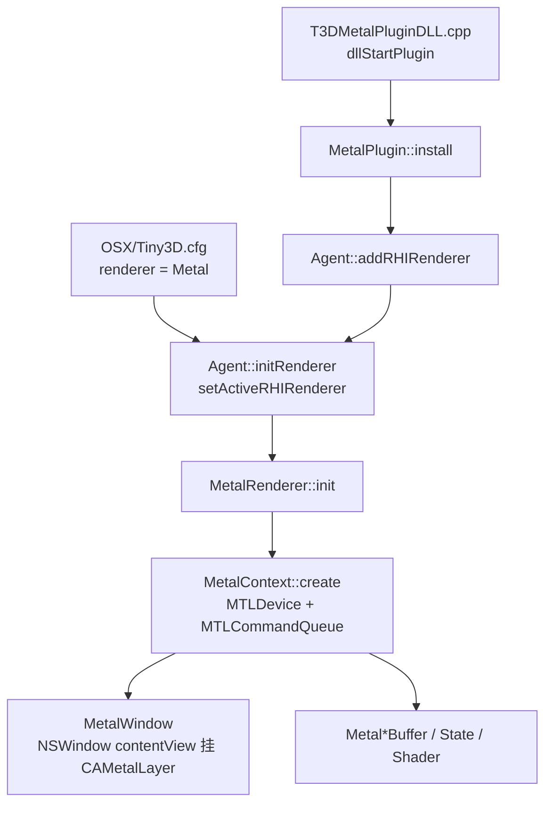
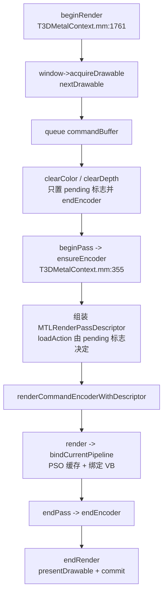
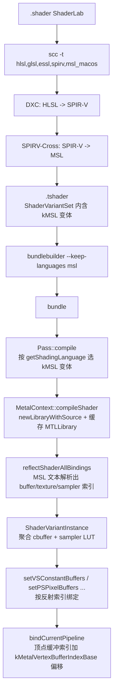

# Metal 渲染后端实现方案

> 本文档基于 `RHIContext` 纯虚接口定义，逐一审计 `MetalContext` 的实现现状，并给出缺口补齐方案。
>
> - **接口定义**：`source/Core/Include/RHI/T3DRHIContext.h`
> - **参考实现（D3D11）**：`source/Plugins/Renderer/Direct3D11/Base/Source/T3DD3D11ContextBase.cpp`、`source/Plugins/Renderer/Direct3D11/Window/Source/T3DD3D11Context.cpp`
> - **参考实现（GL4）**：`source/Plugins/Renderer/OpenGL4/Base/Source/T3DGL4ContextBase.cpp`、`source/Plugins/Renderer/OpenGL4/Window/Source/T3DGL4Context.cpp`
> - **Metal 头文件**：`source/Plugins/Renderer/Metal/Include/T3DMetalContext.h`
> - **Metal 实现**：`source/Plugins/Renderer/Metal/Source/T3DMetalContext.mm`
> - **目标目录**：`source/Plugins/Renderer/Metal/`
>
> 本文所有 `T3DMetalContext.mm:NNN` 形式的行号，均指提交 `【OSX】移植到OSX` 之后的当前版本。

---

## 0. 现状基线

### 0.1 与其他后端不同：Metal 插件已有可编译骨架

与 `GLES3-Renderer-Backend-todo.md`（从零规划）不同，Metal 插件**已经存在一套完整的、基于新 RHI 架构的骨架代码**，目录内不存在任何旧 `RenderContext` 时代的残留。因此本文档采用「现状审计 + 缺口补齐」的形态，而非从零设计。

| 文件 | 行数 | 说明 |
|------|------|------|
| `Include/T3DMetalPrerequisites.h` | 95 | 导出宏、前向声明、智能指针 typedef |
| `Include/T3DMetalContext.h` | 611 | `MetalContext : RHIContext`，声明全部 RHI 纯虚 override |
| `Include/T3DMetalRenderer.h` | 61 | `MetalRenderer : RHIRenderer, Singleton<MetalRenderer>` |
| `Include/T3DMetalPlugin.h` | 60 | `MetalPlugin : Plugin`，持有 `RHIRendererPtr` |
| `Include/T3DMetalWindow.h` | 74 | `MetalWindow : RHIRenderWindow`，CAMetalLayer / drawable |
| `Include/T3DMetalRenderBuffer.h` | 186 | VB / IB / CB / PixelBuffer1D-2D-3D-Cubemap 包装 |
| `Include/T3DMetalRenderState.h` | 118 | Blend / Rasterizer / DepthStencil / Sampler 包装 |
| `Include/T3DMetalShader.h` | 107 | VS / PS / HS / DS / GS / CS 子类 |
| `Include/T3DMetalMapping.h` | 62 | 引擎枚举到 Metal 枚举的映射声明 |
| `Include/T3DMetalNative.h` | 64 | ObjC 对象生命周期辅助 |
| `Include/T3DMetalError.h` | 49 | `T3D_ERR_METAL_*` 错误码 |
| `Source/T3DMetalContext.mm` | 1820 | **核心**：设备、队列、encoder、PSO、draw、blit |
| `Source/T3DMetalWindow.mm` | 208 | CAMetalLayer 挂载、`nextDrawable` |
| `Source/T3DMetalMapping.mm` | 241 | 映射实现 |
| `Source/T3DMetalRenderBuffer.cpp` | 210 | RHI 资源对象 create / 析构 |
| `Source/T3DMetalRenderState.cpp` | 100 | 状态对象；Blend / Rasterizer 只存 desc |
| `Source/T3DMetalShader.cpp` | 72 | RHIShader 工厂 |
| `Source/T3DMetalRenderer.cpp` | 97 | 创建 `MetalContext`；`destroy` / `getEditorInfo` 空实现 |
| `Source/T3DMetalPlugin.cpp` | 111 | install / uninstall 注册 RHIRenderer |
| `Source/T3DMetalPluginDLL.cpp` | 51 | `dllStartPlugin` / `dllStopPlugin` |
| `CMakeLists.txt` | 9 | 仅 `add_subdirectory(Runtime)` |
| `Runtime/CMakeLists.txt` | 83 | 编译 `.cpp` + `.mm`，链接 Metal / Cocoa，开启 ARC |
| `Editor/CMakeLists.txt` | 74 | **存在但未被父 CMake 引用，且未收 `.mm` 源** |

`MetalContext` 声明了 `RHIContext` 的**全部** 75 个纯虚接口；未 override 的可选基类方法有三个：`getDepthRemapMatrix()`（沿用基类单位矩阵，见 §1.2）、`getNativeContext()`、`restoreNativeContext()`（均沿用基类默认，见 §19）。

### 0.2 架构与帧循环

插件的加载与桥接链路与 D3D11 / GL4 完全同构：



帧循环是 Metal 后端与 D3D11 / GL4 差别最大的部分。D3D11 / GL4 的 `beginRender` / `endRender` / `beginPass` / `endPass` 都是空实现，Metal 则必须依赖它们建立 command buffer 与 render command encoder 的生命周期：



关键设计已经就位的部分：

- **延迟清屏**：`clearColor`（860）/ `clearDepth`（870）/ `clearDepthStencil`（880）不发起任何 GPU 操作，只记录清屏值与 `pendingXxxClear` 标志并结束当前 encoder；真正的清屏在 `ensureEncoder` 里翻译成 `MTLLoadActionClear`。这是把 D3D11 的即时 `ClearRenderTargetView` 语义映射到 Metal load action 的正确做法。
- **PSO 缓存**：`bindCurrentPipeline`（536）以 `unordered_map<uint64_t, id<MTLRenderPipelineState>>` 缓存管线对象，避免每帧重建。
- **MSAA resolve**：`createRenderTexture`（697）为多重采样颜色目标额外创建 resolve 纹理，`ensureEncoder` 用 `MTLStoreActionMultisampleResolve` 自动 resolve。

### 0.3 构建与配置接入现状

- `source/Plugins/Renderer/CMakeLists.txt:28` 声明 `TINY3D_BUILD_RENDERSYSTEM_METAL`，默认 `FALSE`
- 同文件 47-48 行：macOS 上 `FORCE` 置为 `TRUE`
- 同文件 180-193 行：`find_package(Metal)` 成功后 `add_subdirectory(Metal)` 并 `add_dependencies(MetalRenderer ...)`
- 同文件 43-46 行：iOS 分支的 Metal 开关**被注释掉**
- `assets/config/OSX/Tiny3D.cfg`：`plugins` 含 `MetalRenderer`，`renderer` 为 `"Metal"`
- `source/Core/Source/RHI/T3DRHIRenderer.cpp:46`：`RHIRenderer::METAL = "Metal"`；第 66-69 行 `getShadingLanguage()` 已把 `METAL` 映射到 `SHADER_LANGUAGE::kMSL`

也就是说：**从插件加载到渲染器激活、再到着色语言选择，引擎侧的接线已经全部完成**，缺的是 Metal 后端自身的正确性与完整性，以及 MSL 变体资产。

### 0.4 实现状态图例

| 标记 | 含义 |
|------|------|
| ✅ 已完成 | 功能完整实现，无已知缺陷 |
| ⚡ 需适配 | 已有实现，但存在正确性缺陷或未覆盖 Metal 特有约束，必须改 |
| ⚠️ 部分完成 | 主路径可用，边界情况或次要分支缺失 |
| ❌ 未实现 | 函数体为空或直接返回 `T3D_OK`，无实际逻辑 |
| 🔇 按设计为空 | Metal API 不提供对应能力，或按设计不映射 |

优先级定义：

| 优先级 | 含义 |
|--------|------|
| **P0** | 阻塞级。不修则基础渲染或阴影管线无法出图 |
| **P1** | 核心功能缺失，影响完整渲染管线 |
| **P2** | 增强与健壮性，影响特定特性或特定硬件 |
| **P3** | 优化与工程化 |

---

## 1. 变换 (Transform)

### 1.1 setViewProjectionTransform

| 项目 | 内容 |
|------|------|
| **状态** | ✅ 已完成 |
| **签名** | `TResult setViewProjectionTransform(const Matrix4 &viewMat, const Matrix4 &projMat)` |
| **D3D11 / GL4 参考** | D3D11 直接缓存矩阵（引擎投影矩阵已产出 [0,1] 深度语义）；GL4 用 `glClipControl` 把深度改为 [0,1]，并通过 `conversionMat` 把 Z 从 [-1,1] 重映射，渲染到 FBO 时额外翻转 Y 轴 |
| **Metal 现状** | T3DMetalContext.mm:264。用 `conversionMat`（对角 0.5 / 平移 0.5）把 Z 从 [-1,1] 映到 [0,1]，与 GL4 的 remap 完全一致；不做 Y 翻转，`mProjectionFlipped` 保持默认 `false` |
| **补齐方案** | 逻辑正确，无需改动。**关键点需在代码注释中固化**：Metal 的 NDC 深度范围为 [0,1]（同 D3D11），纹理与 framebuffer 原点为**左上角**（同 D3D11，异于 OpenGL 的左下角），因此**绝不能照搬 GL4 渲染到 FBO 时的 Y 轴翻转与 CullFace 交换逻辑** |
| **优先级** | — |

### 1.2 getDepthRemapMatrix

| 项目 | 内容 |
|------|------|
| **状态** | ⚡ 需适配 |
| **签名** | `const Matrix4& getDepthRemapMatrix() const` |
| **D3D11 / GL4 参考** | D3D11 不 override，返回基类单位矩阵（投影矩阵已内含 Z remap）；GL4 override 返回与 `setViewProjectionTransform` 中同一个 Z remap 矩阵（`T3DGL4Context.cpp:464`），GLES3 同（`T3DGLES3Context.cpp:185`） |
| **Metal 现状** | **未 override**，沿用基类单位矩阵 |
| **问题** | `ForwardRenderPipeline` 用 `mLightSpaceMatrix = ctx->getDepthRemapMatrix() * ctx->getProjViewMatrix()` 计算阴影采样矩阵（`T3DForwardRenderPipeline.cpp:387`）。Metal 后端在 `setViewProjectionTransform` 里做了 Z remap，说明引擎投影矩阵产出的是 [-1,1] 深度，与 GL 系列同构；但 `getDepthRemapMatrix()` 返回单位矩阵，导致光空间 Z 未被映射到深度缓冲的 [0,1] 存储范围，**阴影比较全错** |
| **补齐方案** | 完全照抄 `GL4Context::getDepthRemapMatrix()`：override 并返回同一个 `zRemapMat`（对角 0.5 / 平移 0.5 的 Z remap 矩阵），与 `setViewProjectionTransform` 里的 `conversionMat` 保持同一常量，建议抽成文件内匿名命名空间的共享常量避免两处漂移 |
| **优先级** | **P0** |

---

## 2. 渲染目标 (Render Target)

### 2.1 createRenderWindow

| 项目 | 内容 |
|------|------|
| **状态** | ⚠️ 部分完成 |
| **签名** | `RHIRenderTargetPtr createRenderWindow(RenderWindow *renderWindow)` |
| **D3D11 / GL4 参考** | D3D11 从 `SysWMInfo.hWnd` 建 `IDXGISwapChain` + RTV；GL4 从 `info.hDC` 建 WGL Core Profile 4.5 上下文 + MSAA 像素格式，并支持把上下文转移到 RHI 线程 |
| **Metal 现状** | T3DMetalContext.mm:280 委托 `MetalWindow::create`。`T3DMetalWindow.mm:78` 从 `SysWMInfo.window`（NSWindow）取 `contentView`，新建 `CAMetalLayer` 并挂上去，设置 `pixelFormat = BGRA8Unorm`、`framebufferOnly = NO`、按 `RenderWindowDesc` 的宽高设 `drawableSize` 与 `contentsScale` |
| **缺口** | 1) 窗口不支持 MSAA：`RenderWindowDesc` 的多重采样描述被忽略，`ensureEncoder` 的窗口路径也没有多重采样附件与 resolve；2) 无 vsync 控制，未暴露 `CAMetalLayer.displaySyncEnabled`；3) `framebufferOnly = NO` 是为了让 `blit` 能把 drawable 当 copy 目标，代价是放弃驱动的 framebuffer-only 优化；4) `pixelFormat` 硬编码 BGRA8Unorm，未考虑 sRGB 与 HDR（`wantsExtendedDynamicRangeContent`） |
| **补齐方案** | MSAA：按 `RenderWindowDesc` 创建 `MTLTextureType2DMultisample` 的颜色附件，`ensureEncoder` 窗口路径把它设为 `colorAttachments[0].texture`、drawable 纹理设为 `resolveTexture`、`storeAction = MultisampleResolve`；vsync 直接映射到 `displaySyncEnabled`；`framebufferOnly` 改为按需——只在确实需要把 drawable 作为 blit 目标时才置 `NO`，§17 引入全屏四边形 blit 后即可恢复为 `YES` |
| **优先级** | P2（MSAA 与 vsync）、P3（sRGB / HDR） |

### 2.2 createRenderTexture

| 项目 | 内容 |
|------|------|
| **状态** | ✅ 已完成 |
| **签名** | `RHIPixelBuffer2DPtr createRenderTexture(PixelBuffer2D *buffer)` |
| **D3D11 / GL4 参考** | D3D11 建 `ID3D11Texture2D` + RTV / DSV；GL4 建 GLTexture + FBO + 可选的 MSAA resolve 纹理与 resolve FBO |
| **Metal 现状** | T3DMetalContext.mm:697。按格式判断颜色 / 深度目标；`ClampSampleCount` 会用 `supportsTextureSampleCount:` 逐级折半到设备支持的采样数并告警；MSAA 颜色目标额外创建 sampleCount=1 的 resolve 纹理存入 `setResolveNative`；深度目标默认 `StorageModePrivate` + `UsageRenderTarget`，`desc.shaderReadable` 时追加 `UsageShaderRead` |
| **补齐方案** | 主路径实现质量良好。可选增强：`mipmapLevelCount` 固定为 1，若将来需要带 mip 的 render texture（如后处理链）需放开 |
| **优先级** | P3 |

### 2.3 setRenderTarget

| 项目 | 内容 |
|------|------|
| **状态** | ⚠️ 部分完成 |
| **签名** | `TResult setRenderTarget(RenderTarget *renderTarget)` |
| **D3D11 / GL4 参考** | 两者都支持 MRT（最多 8 个颜色附件）与 depth-only 目标 |
| **Metal 现状** | T3DMetalContext.mm:779。先 `endEncoder()` 结束当前 pass，再按类型分派：Window 类型取 `MetalWindow`；Texture 类型只取 `renderTarget->getRenderTexture()` 一个颜色附件（799-808），并读取其 resolve 纹理；深度附件取自 `getDepthStencil()` |
| **缺口** | **不支持 MRT**。只填了单个 `currentColor`，`ensureEncoder` 也只组装 `colorAttachments[0]`（418-434） |
| **补齐方案** | `Impl` 里把 `currentColor` / `currentResolve` 改为 `id<MTLTexture> currentColor[8]` / `currentResolve[8]` 加一个 `colorCount`；`setRenderTarget` 用 `getNumOfRenderTextures()` 循环填充；`ensureEncoder` 按 `colorCount` 循环组装附件；`bindCurrentPipeline` 的 PSO 描述符同步按 `colorCount` 设置每个 `colorAttachments[i].pixelFormat`，PSO cache key 也要把全部颜色格式纳入 |
| **优先级** | P1 |

### 2.4 resetRenderTarget

| 项目 | 内容 |
|------|------|
| **状态** | ✅ 已完成 |
| **签名** | `TResult resetRenderTarget()` |
| **Metal 现状** | T3DMetalContext.mm:820。`endEncoder()` 后清空 `currentRT` / `currentColor` / `currentResolve` / `currentDepth` |
| **补齐方案** | 无需改动。注意 `mImpl->window` 被有意保留，使后续 `ensureEncoder` 能回落到窗口 drawable，这与 D3D11 `resetRenderTarget` 恢复 back buffer 的语义一致 |
| **优先级** | — |

---

## 3. 视口与裁剪 (Viewport & Scissor)

### 3.1 setViewport

| 项目 | 内容 |
|------|------|
| **状态** | ✅ 已完成 |
| **签名** | `TResult setViewport(const Viewport &viewport)` |
| **D3D11 / GL4 参考** | 按当前 RenderTarget 尺寸把归一化 Left/Top/Width/Height 换算成像素矩形；GL4 需额外把原点翻成左下 |
| **Metal 现状** | T3DMetalContext.mm:832 只缓存 viewport，encoder 存在时立刻 `applyEncoderState()`；实际换算在 `applyEncoderState`（485-507）中完成：`getCurrentTargetSize` 依次尝试 `currentColor` → `currentDepth` → `window` 拿宽高，再按归一化比例算 `MTLViewport`，宽高做了 `max(1.0)` 保护 |
| **补齐方案** | 无需改动。Metal 的 viewport 原点在左上，与归一化 Top 的语义天然一致，**不需要 GL 系列的 Y 翻转** |
| **优先级** | — |

### 3.2 setScissorRect

| 项目 | 内容 |
|------|------|
| **状态** | ⚡ 需适配 |
| **签名** | `TResult setScissorRect(int32_t x, int32_t y, uint32_t width, uint32_t height)` |
| **D3D11 / GL4 参考** | D3D11 `RSSetScissorRects`，超界会被驱动裁掉；GL4 `glScissor` 并翻成左下原点 |
| **Metal 现状** | T3DMetalContext.mm:844。只对 x / y 做了 `max(0, ...)`，width / height 直接透传，然后立刻 `setScissorRect:` |
| **问题** | 1) **Metal 对 scissor 超出 render target 边界是硬性校验失败**（validation layer 直接 assert / API 报错），必须 clamp 到当前目标尺寸；2) `hasScissor` 一旦置 `true` 就**永远无法复位**，`applyEncoderState`（509-512）会在每个新 encoder 上无条件重新应用旧矩形；3) 未与 `RasterizerDesc::ScissorEnable` 联动，而 `RHIContext` 文档明确要求「须配合 ScissorEnable=true 才生效」 |
| **补齐方案** | 用 `getCurrentTargetSize` 取 `w/h`，把矩形 clamp 到 `[0,w] × [0,h]`，clamp 后宽或高为 0 时视为「禁用 scissor」而非下发非法矩形；`hasScissor` 的最终生效条件改为 `mScissorValid && rasterState->getDesc().ScissorEnable`；`setRasterizerState` 与 `setRenderTarget` 都要触发一次重算 |
| **优先级** | **P0**（超界会直接崩） |

---

## 4. 清除操作 (Clear)

### 4.1 clearColor

| 项目 | 内容 |
|------|------|
| **状态** | ✅ 已完成 |
| **签名** | `TResult clearColor(const ColorRGB &color)` |
| **D3D11 / GL4 参考** | D3D11 `ClearRenderTargetView` 即时执行；GL4 `glClearColor` + `glClear` |
| **Metal 现状** | T3DMetalContext.mm:860。记录 `MTLClearColorMake(r,g,b,1.0)`、置 `pendingColorClear`、`endEncoder()`，实际清屏由下一个 `ensureEncoder` 翻译成 `MTLLoadActionClear` |
| **补齐方案** | 语义正确。可选：alpha 硬编码 1.0 与 GL4 / D3D11 行为一致，保持不变 |
| **优先级** | — |

### 4.2 clearDepth / 4.3 clearDepthStencil

| 项目 | 内容 |
|------|------|
| **状态** | ✅ 已完成 |
| **签名** | `TResult clearDepth(Real depth)` / `TResult clearDepthStencil(Real depth, uint32_t stencil)` |
| **Metal 现状** | T3DMetalContext.mm:870 / 880。同上，置 `pendingDepthClear` / `pendingStencilClear` 后 `endEncoder()` |
| **补齐方案** | 语义正确。需注意的**共性隐患**：`setRenderTarget`、三个 `clear*` 都会调 `endEncoder()`，若一帧内出现「clear color → clear depth → 绘制」的常见序列，会产生多次 encoder 创建；由于清屏本身是延迟的，实际只会创建一个 encoder，不构成问题。但**绘制中途再调 clear** 会真实地切 pass，在 Apple 的 TBDR 架构上代价高昂，应在文档与代码注释中明确「一个 pass 内只允许在开头 clear」 |
| **优先级** | P3（性能注记） |

---

## 5. 渲染状态 (Render State)

Metal 与 D3D11 / GL4 最本质的结构性差异在此：**blend 状态与光栅化的 fill mode 属于 `MTLRenderPipelineState`（不可变对象），而 cull mode / winding / depth bias / depth-stencil state 属于 encoder 的即时状态**。因此 Metal 后端把 blend / rasterizer 拆成了「只存 desc，在建 PSO 或 apply encoder 时才翻译」的两段式处理。

### 5.1 createBlendState

| 项目 | 内容 |
|------|------|
| **状态** | ⚠️ 部分完成 |
| **签名** | `RHIBlendStatePtr createBlendState(BlendState *state)` |
| **D3D11 / GL4 参考** | D3D11 建 `ID3D11BlendState`；GL4 把 desc 映射成 POD 结构体 |
| **Metal 现状** | T3DMetalContext.mm:892。只 `setDesc(state->getStateDesc())` 保存描述，无 native 对象。真正的翻译在 `bindCurrentPipeline`（567-579），只读 `RenderTargetStates[0]` |
| **缺口** | 与 GL4 相同的限制：不支持每个 RT 独立混合 |
| **补齐方案** | 结合 §2.3 的 MRT 支持，`bindCurrentPipeline` 按 `colorCount` 循环读取 `RenderTargetStates[i]` 填 `desc.colorAttachments[i]` |
| **优先级** | P2 |

### 5.2 createDepthStencilState

| 项目 | 内容 |
|------|------|
| **状态** | ✅ 已完成 |
| **签名** | `RHIDepthStencilStatePtr createDepthStencilState(DepthStencilState *state)` |
| **Metal 现状** | T3DMetalContext.mm:904。建真正的 `MTLDepthStencilState`：`DepthTestEnable` 为 false 时用 `CompareFunctionAlways`，`StencilEnable` 时分别填前后面 `MTLStencilDescriptor`（含 read / write mask 与三种操作），并把 `StencilRef` 存到状态对象上供 encoder 的 `setStencilReferenceValue:` 使用 |
| **补齐方案** | 无需改动，是当前 Metal 后端里映射得最完整的状态 |
| **优先级** | — |

### 5.3 createRasterizerState

| 项目 | 内容 |
|------|------|
| **状态** | ✅ 已完成（两段式设计） |
| **签名** | `RHIRasterizerStatePtr createRasterizerState(RasterizerState *state)` |
| **Metal 现状** | T3DMetalContext.mm:947 只存 desc。`applyEncoderState`（514-521）把 CullMode / FrontFacing / TriangleFillMode / DepthBias 下发到 encoder |
| **缺口** | `RasterizerDesc::ScissorEnable` 与 `DepthClipEnable` 未被消费。Metal 的深度裁剪对应 `MTLDepthClipMode`（`setDepthClipMode:`），当前完全没设置 |
| **补齐方案** | `applyEncoderState` 追加 `setDepthClipMode:` 映射（`DepthClipEnable` 为 true 用 `MTLDepthClipModeClip`，否则 `Clamp`）；`ScissorEnable` 按 §3.2 联动 |
| **优先级** | P2 |

### 5.4 createSamplerState

| 项目 | 内容 |
|------|------|
| **状态** | ⚠️ 部分完成 |
| **签名** | `RHISamplerStatePtr createSamplerState(SamplerState *state)` |
| **Metal 现状** | T3DMetalContext.mm:959。建真正的 `MTLSamplerState`，映射 Min / Mag / Mip filter、三轴 AddressMode、LOD clamp、`maxAnisotropy`、比较函数 |
| **缺口** | 1) **未设置 `sd.supportArgumentBuffers`**（用不到，可忽略）；2) 比较采样器需要 `MTLSamplerDescriptor.compareFunction` 且**着色器侧必须声明为 `depth2d` + `sampler_compare`**，需与 MSL 变体对齐；3) `MetalMapAddress` 会把 `kBorder` 映射为 `MTLSamplerAddressModeClampToBorderColor`，但该模式在部分设备上需要 feature 检查，且**未设置 `borderColor`**，引擎的 `SamplerDesc::BorderColor` 被丢弃 |
| **补齐方案** | `borderColor` 映射到 `MTLSamplerBorderColor` 的三个枚举值（transparentBlack / opaqueBlack / opaqueWhite），无法精确表达任意颜色时按最近值取并告警；`ClampToBorderColor` 前用 `device.supportsFamily:` 做能力检查，不支持时降级为 `ClampToEdge` 并打日志 |
| **优先级** | P2 |

### 5.5 setBlendState / 5.6 setDepthStencilState / 5.7 setRasterizerState

| 项目 | 内容 |
|------|------|
| **状态** | ✅ 已完成 |
| **Metal 现状** | T3DMetalContext.mm:987 / 997 / 1011。均只把 RHI 状态对象缓存到 `Impl`；depth 与 raster 在 encoder 已存在时立刻 `applyEncoderState()`，blend 因属于 PSO 只等下次 `bindCurrentPipeline` |
| **补齐方案** | `setBlendState` 变更后必须让 PSO key 变化才能生效——当前 key 用的是 `blendState.get()` 指针（546），同一个 `MetalBlendState` 对象内容被改写时不会触发重建。改用内容摘要即可，见 §15.2 的 cache key 重构 |
| **优先级** | P1（随 cache key 重构一并解决） |

---

## 6. 顶点输入 (Vertex Input)

### 6.1 createVertexDeclaration

| 项目 | 内容 |
|------|------|
| **状态** | ✅ 已完成 |
| **签名** | `RHIVertexDeclarationPtr createVertexDeclaration(VertexDeclaration *decl)` |
| **D3D11 / GL4 参考** | D3D11 建 `ID3D11InputLayout`（需 VS 字节码）；GL4 只 `glGenVertexArrays`，属性在 `setVertexBuffers` 时延迟配置 |
| **Metal 现状** | T3DMetalContext.mm:1025。只保存 `VertexAttributes` 列表，`MTLVertexDescriptor` 在 `bindCurrentPipeline`（581-608）建 PSO 时才组装 |
| **补齐方案** | 设计正确——Metal 的 vertex descriptor 是 PSO 的一部分，与 D3D11 的 InputLayout 同属「需要与 shader 一起验证」的对象，延迟到 PSO 创建是必然选择 |
| **优先级** | — |

### 6.2 setVertexDeclaration

| 项目 | 内容 |
|------|------|
| **状态** | ✅ 已完成 |
| **签名** | `TResult setVertexDeclaration(VertexDeclaration *decl)` |
| **Metal 现状** | T3DMetalContext.mm:1037，缓存到 `mImpl->vertexDecl` |
| **补齐方案** | 无需改动。但 `MTLVertexDescriptor` 的组装逻辑有两个必须修的问题，见 §6.3 |
| **优先级** | — |

### 6.3 MTLVertexDescriptor 组装（bindCurrentPipeline 内）

| 项目 | 内容 |
|------|------|
| **状态** | ⚡ 需适配 |
| **实现位置** | T3DMetalContext.mm:581-608 |
| **现状** | 遍历 `VertexAttributes`，`attributes[i].format / offset / bufferIndex = a.getSlot()`；stride 由「同 slot 内 `offset + size` 的最大值」推导；`stepFunction` 固定 `PerVertex` |
| **问题 1（阻塞级）** | `bufferIndex` 直接用引擎的 vertex buffer slot，与常量缓冲共用同一张 buffer argument table，必然与 `cbuffer b0` 冲突。详见 §22.3 |
| **问题 2** | stride 由属性推导，而 `setVertexBuffers` 传入的 `strides` 参数被存进 `VBSlot::stride`（1081）后**从未被使用**。当顶点结构存在尾部 padding 或交错布局时，推导值与真实 stride 不符 |
| **补齐方案** | 1) 引入 §22.3 的 buffer index 偏移；2) stride 优先取 `mImpl->vb[slot].stride`，仅当为 0 时才回落到属性推导；3) 若将来支持 instancing，`stepFunction` 需按 slot 的用途切 `PerInstance` |
| **优先级** | **P0**（问题 1）、P1（问题 2） |

---

## 7. 缓冲区 (Buffer)

### 7.1 createVertexBuffer / 7.3 createIndexBuffer / 7.5 createConstantBuffer

| 项目 | 内容 |
|------|------|
| **状态** | ⚠️ 部分完成 |
| **签名** | `RHIVertexBufferPtr createVertexBuffer(VertexBuffer *buffer)` 等三个 |
| **Metal 现状** | T3DMetalContext.mm:1047 / 1095 / 1126，统一委托 `createMTLBuffer`（292）：`newBufferWithLength:options:MTLResourceStorageModeShared` 后 `memcpy` 初始数据。`createIndexBuffer` 额外保存 `IndexType` |
| **缺口** | 所有缓冲一律 `StorageModeShared`。在 Apple Silicon 的统一内存架构上这是合理默认；在 **Intel + 独立显卡的 Mac** 上，静态顶点 / 索引数据放 Shared 会常驻系统内存并每次访问走 PCIe，性能显著劣于 `StorageModePrivate` |
| **补齐方案** | 按引擎 `Usage` 分派存储模式：`kStatic` / 只读数据走 `StorageModePrivate` + 一次性 staging buffer blit 上传；`kDynamic` 保持 Shared（并配合 §17.6 的 ring buffer）。用 `device.hasUnifiedMemory` 判断是否值得区分，统一内存设备上全部 Shared 即可 |
| **优先级** | P2 |

### 7.2 setVertexBuffers

| 项目 | 内容 |
|------|------|
| **状态** | ⚡ 需适配 |
| **签名** | `TResult setVertexBuffers(uint32_t startSlot, const VertexBuffers &buffers, const VertexStrides &strides, const VertexOffsets &offsets)` |
| **Metal 现状** | T3DMetalContext.mm:1067。把 buffer / stride / offset 存进 `VBSlot vb[8]`，encoder 已存在时立刻 `setVertexBuffer:offset:atIndex:slot`；`bindCurrentPipeline`（624-631）在每次 draw 前重新绑定全部 8 个 slot |
| **问题** | `atIndex:slot` 与常量缓冲的 index 冲突，见 §22.3；slot 上限硬编码 8，与 `vb[8]` 数组一致但无越界日志（`slot >= 8` 时静默 `continue`） |
| **补齐方案** | index 加 `kMetalVertexBufferIndexBase` 偏移；`slot >= kMaxVertexBufferSlots` 时输出一次 warning 而非静默丢弃 |
| **优先级** | **P0** |

### 7.4 setIndexBuffer

| 项目 | 内容 |
|------|------|
| **状态** | ✅ 已完成 |
| **签名** | `TResult setIndexBuffer(IndexBuffer *buffer)` |
| **Metal 现状** | T3DMetalContext.mm:1116，缓存 RHI 对象；索引类型与偏移在 `render` 时换算（1520-1522） |
| **补齐方案** | 无需改动。Metal 没有「绑定索引缓冲」的独立状态，索引 buffer 是 `drawIndexedPrimitives` 的参数，缓存是正确做法 |
| **优先级** | — |

### 7.6 createPixelBuffer1D

| 项目 | 内容 |
|------|------|
| **状态** | ⚠️ 部分完成 |
| **签名** | `RHIPixelBuffer1DPtr createPixelBuffer1D(PixelBuffer1D *buffer)` |
| **Metal 现状** | T3DMetalContext.mm:1159。用 `texture2DDescriptorWithPixelFormat` 后强改 `textureType = MTLTextureType1D`，`usage = ShaderRead`，建纹理 |
| **问题** | 1) **不上传 CPU 数据**，纹理内容未定义；2) `mipmapped:desc.mipmaps > 1` 只影响 descriptor，无 mipmap 生成；3) 未设 `storageMode`，默认值随平台变化，若为 Private 则无法用 `replaceRegion` 上传；4) 创建失败无检查、无日志 |
| **补齐方案** | 显式 `storageMode = MTLStorageModeShared`，用 `replaceRegion:mipmapLevel:withBytes:bytesPerRow:` 上传（1D 的 region 高度为 1）；nil 检查 + `T3D_LOG_ERROR`；mipmap 走 §7.9 的统一方案 |
| **优先级** | P1 |

### 7.7 createPixelBuffer2D

| 项目 | 内容 |
|------|------|
| **状态** | ⚠️ 部分完成 |
| **签名** | `RHIPixelBuffer2DPtr createPixelBuffer2D(PixelBuffer2D *buffer)` |
| **Metal 现状** | T3DMetalContext.mm:1180。`usage = ShaderRead` + `storageMode = Shared`（深度格式改为 `RenderTarget|ShaderRead` + Private）；非 Private 时调 `uploadTexture2D`（1146）用 `replaceRegion` 上传；有 nil 检查与日志 |
| **问题** | 1) `mipmaps > 1` 时只上传 level 0，**不生成也不上传后续 mip**，采样带 mip 的纹理会取到未定义内容；2) `uploadTexture2D` 用 `tex.width * MetalBytesPerPixel(format)` 算 `bytesPerRow`，对**块压缩格式（BC / ASTC）完全错误**；3) 无压缩格式支持（见 §21.2） |
| **补齐方案** | mipmap：若 CPU 侧已有各级数据则逐级 `replaceRegion`，否则建 blit encoder 调 `generateMipmapsForTexture:`（需要 `usage` 追加 `ShaderWrite` 或改用 `MTLBlitCommandEncoder`，且纹理不能是 Shared+压缩）；`bytesPerRow` 改为按格式的块尺寸计算，压缩格式用 `ceil(width / blockW) * bytesPerBlock` |
| **优先级** | P1 |

### 7.8 createPixelBuffer3D

| 项目 | 内容 |
|------|------|
| **状态** | ⚠️ 部分完成 |
| **签名** | `RHIPixelBuffer3DPtr createPixelBuffer3D(PixelBuffer3D *buffer)` |
| **Metal 现状** | T3DMetalContext.mm:1216。`texture2DDescriptor` 后改 `textureType = MTLTextureType3D` 并设 `depth` |
| **问题** | 同 §7.6：不上传数据、无 nil 检查、`storageMode` 未显式指定 |
| **补齐方案** | 显式 Shared + `MTLRegionMake3D` 的 `replaceRegion:...bytesPerRow:bytesPerImage:` 上传；补 nil 检查与日志 |
| **优先级** | P1 |

### 7.9 createPixelBufferCubemap

| 项目 | 内容 |
|------|------|
| **状态** | ⚠️ 部分完成 |
| **签名** | `RHIPixelBufferCubemapPtr createPixelBufferCubemap(PixelBufferCubemap *buffer)` |
| **Metal 现状** | T3DMetalContext.mm:1238。`textureCubeDescriptorWithPixelFormat:size:mipmapped:` 建立立方体纹理 |
| **问题** | **不上传任何面的数据**。Skybox 是引擎已支持的特性（见 `doc/todo/Skybox-Support-Design-todo.md`），cubemap 无内容意味着天空盒在 Metal 上必然黑屏 |
| **补齐方案** | 按 6 个面循环 `replaceRegion:mipmapLevel:slice:withBytes:bytesPerRow:bytesPerImage:`，`slice` 对应 +X/-X/+Y/-Y/+Z/-Z。需确认引擎 `PixelBufferCubemap` 的面序与 Metal slice 序（+X,-X,+Y,-Y,+Z,-Z）一致，不一致时做重排；同时验证 Metal cubemap 的坐标系约定与 D3D11 一致（都是左手 +Y 向上），若采样方向不对需在 MSL 侧翻 Z |
| **优先级** | P1 |

---

## 8. 顶点着色器 (Vertex Shader)

### 8.1 createVertexShader

| 项目 | 内容 |
|------|------|
| **状态** | ⚠️ 部分完成 |
| **签名** | `RHIShaderPtr createVertexShader(ShaderVariant *shader)` |
| **D3D11 / GL4 参考** | D3D11 `CreateVertexShader(DXBC)`；GL4 `glCreateShader(GL_VERTEX_SHADER)` + 编译 |
| **Metal 现状** | T3DMetalContext.mm:1258，委托 `compileMSLFunction`（638），失败返回 nullptr |
| **问题** | 见 §8.3 `compileMSLFunction` 的 entry point 与库缓存问题 |
| **补齐方案** | 见 §8.3 |
| **优先级** | **P0** |

### 8.2 setVertexShader

| 项目 | 内容 |
|------|------|
| **状态** | ✅ 已完成 |
| **签名** | `TResult setVertexShader(ShaderVariant *shader)` |
| **Metal 现状** | T3DMetalContext.mm:1272。有 nullptr 检查（这一点比 D3D11 / GL4 都好，两者都缺 nullptr 保护） |
| **补齐方案** | 无需改动 |
| **优先级** | — |

### 8.3 compileMSLFunction（Metal 专有辅助）

| 项目 | 内容 |
|------|------|
| **状态** | ⚡ 需适配 |
| **实现位置** | T3DMetalContext.mm:638 |
| **现状** | 从 `ShaderVariant::getBytesCode()` 取 MSL 源码 → `newLibraryWithSource:options:error:` → 依次尝试函数名 `main` / `vertex_main` / `fragment_main` / `vs_main` / `ps_main`（670）→ 全部失败则取 `library.functionNames.firstObject`（679-684） |
| **问题 1（阻塞级）** | SPIRV-Cross 生成 MSL 时，因 `main` 是 MSL 保留字，会把入口点重命名为 **`main0`**。候选名列表里没有 `main0`，因此**每次都落到「取第一个函数」的兜底分支**。当 library 里存在多个函数（辅助函数被提升、或将来一个 library 含多个入口）时会取错函数 |
| **问题 2** | 每次调用都重新 `newLibraryWithSource`，同一 `ShaderVariant` 被 `createVertexShader` 与 `compileShader` 各编译一次（§14.1），编译成本翻倍 |
| **问题 3** | 未按 stage 校验：拿到的 `MTLFunction` 可能是 `MTLFunctionTypeFragment` 却被当作 vertex function 塞进 PSO，错误延后到 PSO 创建才暴露，日志不具指向性 |
| **补齐方案** | 1) 候选名列表加入 `main0` 并置于首位；2) 按 `ShaderVariant::getShaderStage()` 推导期望的 `MTLFunctionType`，遍历 `functionNames` 时用 `newFunctionWithName` 取到后校验 `function.functionType`，不匹配则继续；3) 以 `ShaderVariant*` 或源码哈希为键缓存 `id<MTLLibrary>`，避免重复编译；4) 编译失败时把 `error.localizedDescription` 与**源码前若干行**一起打日志，MSL 编译错误信息不含文件名时很难定位 |
| **优先级** | **P0**（问题 1）、P2（问题 2、3） |

### 8.4 setVSConstantBuffers / 8.5 setVSPixelBuffers / 8.6 setVSSamplers

| 项目 | 内容 |
|------|------|
| **状态** | ⚡ 需适配 |
| **签名** | `TResult setVSConstantBuffers(uint32_t startSlot, const ConstantBuffers &buffers)` 等三个 |
| **D3D11 / GL4 参考** | D3D11 `VSSetConstantBuffers` / `VSSetShaderResources` / `VSSetSamplers` 即时生效；GL4 把 cbuffer 暂存到 `mPendingUBOs`，在 `render()` 里 link 完 program 后统一绑定 |
| **Metal 现状** | T3DMetalContext.mm:1369 / 1375 / 1381，分别委托文件内静态函数 `bindConstantBuffers`（1282）/ `bindTextures`（1315）/ `bindSamplers`（1342），index 一律取 `startSlot + i` |
| **问题 1（阻塞级）** | 三个 helper 都以 `mImpl->encoder` 为第一参数，且**在 encoder 为 nil 时直接 return，绑定被静默丢弃**。虽然当前 `ForwardRenderPipeline` 的调用序是 `beginPass`（建 encoder）之后才设资源，但任何一次 `endEncoder`（`setRenderTarget` / `clear*` / `blit`）之后重建 encoder，之前下发的资源绑定都会**全部丢失**——Metal 的资源绑定是 encoder 局部状态，不像 D3D11 的 device context 全局状态 |
| **问题 2（阻塞级）** | 常量缓冲的 `atIndex:startSlot + i` 与顶点缓冲共用 buffer table，见 §22.3 |
| **补齐方案** | 改为 GL4 的 pending 模式：`Impl` 增加 `pendingVSBuffers[31]` / `pendingVSTextures[N]` / `pendingVSSamplers[N]`（以及 PS 的对应表）+ dirty 位图，`set*` 只写表，`bindCurrentPipeline` 统一下发；`ensureEncoder` 创建新 encoder 后把整表标脏强制重绑。这样既修掉丢绑定问题，又天然支持「跨 pass 保持绑定」的引擎语义 |
| **优先级** | **P0** |

---

## 9. 像素着色器 (Pixel Shader)

### 9.1 createPixelShader / 9.2 setPixelShader

| 项目 | 内容 |
|------|------|
| **状态** | ✅ 已完成（依赖 §8.3 修复） |
| **签名** | `RHIShaderPtr createPixelShader(ShaderVariant *shader)` / `TResult setPixelShader(ShaderVariant *shader)` |
| **Metal 现状** | T3DMetalContext.mm:1389 / 1401。`setPixelShader` 支持 nullptr 解绑 |
| **补齐方案** | 本身无需改动，但 `setPixelShader(nullptr)` 之后的 draw 会被 `bindCurrentPipeline` 拒绝，见 §15.2 |
| **优先级** | — |

### 9.3 setPSConstantBuffers / 9.4 setPSPixelBuffers / 9.5 setPSSamplers

| 项目 | 内容 |
|------|------|
| **状态** | ⚡ 需适配 |
| **Metal 现状** | T3DMetalContext.mm:1409 / 1415 / 1421，与 VS 侧共用 helper，只是 `vertex` 参数为 false，走 `setFragmentBuffer:` / `setFragmentTexture:` / `setFragmentSamplerState:` |
| **问题与方案** | 与 §8.4 完全相同 |
| **优先级** | **P0** |

---

## 10. Hull 着色器 (Tessellation Control)

### 10.1 createHullShader / setHullShader / setHS*

| 项目 | 内容 |
|------|------|
| **状态** | 🔇 按设计为空 |
| **Metal 现状** | T3DMetalContext.mm:1429-1433。`createHullShader` 返回空的 `MetalHullShader`，其余全部 `return T3D_OK` |
| **说明** | Metal **没有** D3D11 意义上的 Hull Shader。Metal 的曲面细分是另一套模型：由 compute kernel（或 CPU）写出 `MTLTessellationFactorsHalf` 到 tessellation factor buffer，再由 `MTLRenderPipelineDescriptor` 的 `tessellationPartitionMode` / `tessellationFactorStepFunction` / `maxTessellationFactor` 等属性驱动固定功能镶嵌器，最后用「post-tessellation vertex shader」（`[[patch(...)]]` 修饰）代替 Domain Shader |
| **长期方案** | 若引擎将来需要曲面细分：`createHullShader` 编译成 `MTLComputePipelineState`（factor 计算 kernel），`setHullShader` 记录它并在 draw 前用 `MTLComputeCommandEncoder` dispatch 出 factor buffer，`render` 改走 `drawPatches:` 系列；`setHS*` 系列映射到 compute encoder 的资源绑定 |
| **现阶段处置** | 保持空实现，但把返回值从 `T3D_OK` 改为 `T3D_ERR_NOT_IMPLEMENTED` 类错误码更利于早发现误用（需确认引擎调用方能容忍非 `T3D_OK`：`ForwardRenderPipeline.cpp:1115` 无条件调 `setHullShader(nullptr)`，因此 **nullptr 入参必须返回 `T3D_OK`**，仅非空入参才报错） |
| **优先级** | P3 |

---

## 11. Domain 着色器 (Tessellation Evaluation)

### 11.1 createDomainShader / setDomainShader / setDS*

| 项目 | 内容 |
|------|------|
| **状态** | 🔇 按设计为空 |
| **Metal 现状** | T3DMetalContext.mm:1435-1439，同 Hull |
| **说明** | 对应 Metal 的 post-tessellation vertex shader，不是独立的着色器阶段，无法单独创建与绑定 |
| **现阶段处置** | 同 §10，nullptr 入参返回 `T3D_OK`，非空入参报错并告警 |
| **优先级** | P3 |

---

## 12. 几何着色器 (Geometry Shader)

### 12.1 createGeometryShader / setGeometryShader / setGS*

| 项目 | 内容 |
|------|------|
| **状态** | 🔇 API 不支持 |
| **Metal 现状** | T3DMetalContext.mm:1441-1445 |
| **说明** | **Metal 完全没有几何着色器**，这是与 D3D11 / GL4 的硬性能力差异（GL4 后端已实现 `createGeometryShader`）。需要类似能力时的替代路径：a) compute shader 预处理生成扩展后的顶点流，再普通 draw；b) instancing + 顶点着色器内程序化生成（如 billboard / 粒子）；c) mesh shader（Metal 3 的 `MTLMeshRenderPipelineDescriptor`，需 Apple Silicon） |
| **现阶段处置** | 保持空实现并在头文件注释中标明「Metal API 不支持，需要时改用 compute / instancing / mesh shader」；nullptr 入参返回 `T3D_OK` |
| **优先级** | — （不计划实现） |

---

## 13. 计算着色器 (Compute Shader)

### 13.1 createComputeShader

| 项目 | 内容 |
|------|------|
| **状态** | ⚠️ 部分完成 |
| **签名** | `RHIShaderPtr createComputeShader(ShaderVariant *shader)` |
| **Metal 现状** | T3DMetalContext.mm:1447。调 `compileMSLFunction` 拿到 `MTLFunction` 并存入 `MetalComputeShader`；与 VS / PS 不同，编译失败也返回非空对象（只是 native 为空） |
| **缺口** | 只有 `MTLFunction`，没有 `MTLComputePipelineState`；没有 `MTLComputeCommandEncoder`；`setComputeShader` / `setCS*`（1458-1461）全空 |
| **补齐方案** | 1) `createComputeShader` 里顺带 `newComputePipelineStateWithFunction:error:` 并存到 `MetalComputeShader`；2) `Impl` 增加 `id<MTLComputeCommandEncoder> computeEncoder` 与独立的 pending 绑定表；3) `setComputeShader` 记录 pipeline，`setCS*` 写 pending 表 |
| **阻碍** | **`RHIContext` 层没有 dispatch 接口**。`setComputeShader` / `setCS*` 存在，但没有任何 `dispatch(x, y, z)` 纯虚函数，意味着即使 Metal 侧实现完整也无法被调用。这是 RHI 抽象层的缺口，不是 Metal 后端的缺口 |
| **补齐方案（RHI 层）** | 在 `T3DRHIContext.h` 增加 `virtual TResult dispatch(uint32_t groupX, uint32_t groupY, uint32_t groupZ) = 0;`，各后端分别映射到 `Dispatch` / `glDispatchCompute` / `vkCmdDispatch` / `dispatchThreadgroups:threadsPerThreadgroup:`。**该改动跨全部后端，需单独立项** |
| **优先级** | P3（等 RHI 层 dispatch 接口就绪） |

---

## 14. Shader 编译与反射

这是 Metal 后端**功能性缺口最大**的部分，也是 P0 的重心。完整的管线设计见 §23。

### 14.1 compileShader

| 项目 | 内容 |
|------|------|
| **状态** | ⚠️ 部分完成 |
| **签名** | `TResult compileShader(ShaderVariant *shader)` |
| **D3D11 / GL4 参考** | D3D11 `D3DCompile`（HLSL 源码 → DXBC 字节码）并写回 `setBytesCode`；GL4 用 glslang 在 CPU 侧 parse GLSL 并缓存反射结果 |
| **Metal 现状** | T3DMetalContext.mm:1465。调 `compileMSLFunction` 验证 MSL 能编译通过，然后有一段可疑代码：取 `getBytesCode` 拿到的指针再 `setBytesCode(code, length)` 写回同一份数据（1473-1478） |
| **问题** | 1) 这段自我赋值在 `hasCompiled()` 为 false 时把「源码」当作「字节码」写入 `mByteCode`，语义上把 MSL 文本冒充成编译产物，且存在**自赋值下的潜在悬垂**（`setBytesCode` 内部若先释放 `mByteCode` 再拷贝，而 `getBytesCode` 返回的正是 `mSourceCode` 时侥幸不崩，一旦实现细节变化即 UB）；2) 编译出的 `MTLFunction` 被丢弃，`createVertexShader` / `createPixelShader` 会再编一次 |
| **补齐方案** | MSL 是文本源码，**没有独立的字节码产物**（除非改走离线 `metallib`，见 §23.5），因此 `compileShader` 应当只做「验证能否编译 + 建立并缓存 `MTLLibrary`/`MTLFunction` + 执行反射」，**不再写 `setBytesCode`**。参考 Vulkan 后端的做法（`T3DVKContextBase.cpp` 的 `compileShader` 只校验 SPIR-V magic、不改字节码） |
| **优先级** | **P0** |

### 14.2 reflectShaderAllBindings

| 项目 | 内容 |
|------|------|
| **状态** | ❌ 未实现 |
| **签名** | `TResult reflectShaderAllBindings(ShaderVariant *shader, ShaderConstantParams &constantParams, ShaderSamplerParams &samplerParams)` |
| **D3D11 / GL4 参考** | D3D11 用 `D3DReflect` + `ID3D11ShaderReflection` 提取 cbuffer 成员与 `BindPoint`；GL4 从 glslang 反射结果提取 uniform block 成员与 sampler；Vulkan 用 spirv-reflect 枚举 descriptor binding |
| **Metal 现状** | T3DMetalContext.mm:1482，函数体只有 `return T3D_OK` |
| **影响** | `ShaderConstantParam::BindingPoint` / `mDataOffset` / `mDataSize` 与 `ShaderSamplerParam::TexBinding` / `SamplerBinding` 是 `ShaderVariantInstance` 聚合 cbuffer 大小、建立 sampler 查找表的**唯一依据**（`T3DShaderVariantInstance.cpp` 64-79 与 105-111 行）。当离线 `.tshader` 里的反射参数不可信或缺失时，材质常量与纹理全部绑不上 |
| **补齐方案** | 见 §23.3，采用「MSL 文本解析为主 + PSO reflection 为校验」的双轨方案 |
| **优先级** | **P0** |

### 14.3 reflectSamplerBindings

| 项目 | 内容 |
|------|------|
| **状态** | ❌ 未实现 |
| **签名** | `TResult reflectSamplerBindings(ShaderVariant *shader, ShaderSamplerParams &samplerParams)` |
| **Metal 现状** | T3DMetalContext.mm:1487，空实现 |
| **补齐方案** | 复用 §14.2 的解析结果，只更新传入 `samplerParams` 中已有条目的 `TexBinding` / `SamplerBinding`，语义与 D3D11 Window 版一致 |
| **优先级** | **P0** |

---

## 15. 图元与绘制 (Primitive & Draw)

### 15.1 setPrimitiveType

| 项目 | 内容 |
|------|------|
| **状态** | ⚠️ 部分完成 |
| **签名** | `TResult setPrimitiveType(PrimitiveType primitive)` |
| **Metal 现状** | T3DMetalContext.mm:1494，只缓存；`MetalMapPrimitive`（`T3DMetalMapping.mm:117`）映射 Point / Line / LineStrip / TriangleStrip / Triangle |
| **缺口** | 引擎若存在 `kTriangleFan`，Metal **不支持** triangle fan（需 CPU 侧转成 triangle list 或索引重排）；当前 `default` 分支会把未知图元静默当成 Triangle |
| **补齐方案** | 对不支持的图元类型输出一次 warning，不要静默降级 |
| **优先级** | P2 |

### 15.2 render（indexed 与 non-indexed）

| 项目 | 内容 |
|------|------|
| **状态** | ⚡ 需适配 |
| **签名** | `TResult render(uint32_t indexCount, uint32_t startIndex, uint32_t baseVertex)` / `TResult render(uint32_t vertexCount, uint32_t startVertex)` |
| **D3D11 / GL4 参考** | D3D11 `DrawIndexed` / `Draw`；GL4 先延迟 link program 再 `glDrawElementsBaseVertex` / `glDrawArrays` |
| **Metal 现状** | T3DMetalContext.mm:1500 / 1535。均为 `ensureEncoder()` → `bindCurrentPipeline()` → `drawIndexedPrimitives:` / `drawPrimitives:`。索引版正确按索引宽度换算 `indexBufferOffset`（1520-1528），并检查索引缓冲非空 |
| **问题 1（阻塞级）** | `bindCurrentPipeline`（538）要求 **`vs` 与 `ps` 同时非空**，否则返回 `T3D_ERR_INVALID_POINTER`。但 `ForwardRenderPipeline.cpp:1118` 会在没有像素着色器时调 `setPixelShader(nullptr)`——**shadow map 的 depth-only pass 正是这种情况**。Metal 本身允许 `fragmentFunction = nil` 的 depth-only 管线，因此这个前置检查直接把阴影管线堵死 |
| **问题 2（阻塞级）** | PSO 描述符**未设置 `rasterSampleCount`**（560-565 只设了三个 pixelFormat）。渲染到 §2.2 创建的 MSAA render texture 时，PSO 的采样数（默认 1）与 render pass 附件的采样数不匹配，`newRenderPipelineStateWithDescriptor` 直接失败 |
| **问题 3（阻塞级）** | PSO cache key 由指针异或拼成（543-550）：`vs->getNativeObject() << 1`、`ps->getNativeObject()`、`blendState.get() << 8`、`vertexDecl.get() << 16`，再异或三个 pixelFormat。缺陷有三：a) 漏 `sampleCount` 与 MRT 的其余颜色格式；b) 异或本身极易碰撞（两个指针低位相同即可能撞）；c) 用对象地址作键，对象被释放后地址复用会**命中过期 PSO**，且同一状态对象内容被改写时不会触发重建（§5.5） |
| **补齐方案** | 1) 允许 `ps == nullptr`：`desc.fragmentFunction = nil`，此时颜色附件格式应为 `MTLPixelFormatInvalid`，只保留深度附件；同时 key 里以 0 表示无 fragment function；2) 补 `desc.rasterSampleCount = <当前附件采样数>`，采样数从 `currentColor.sampleCount`（无颜色附件时取 `currentDepth.sampleCount`）读取，并存入 `Impl` 供 key 使用；3) cache key 改为显式 POD 结构体 `MetalPSOKey { void* vsFn; void* psFn; uint32_t colorFormats[8]; uint32_t depthFormat; uint32_t stencilFormat; uint8_t colorCount; uint8_t sampleCount; uint64_t blendHash; uint64_t vertexLayoutHash; }`，配 `std::hash` 特化与 `operator==`，`blendHash` / `vertexLayoutHash` 由 desc 内容而非指针算出 |
| **优先级** | **P0**（三项） |

---

## 16. 状态重置 (Reset)

### 16.1 reset

| 项目 | 内容 |
|------|------|
| **状态** | ⚠️ 部分完成 |
| **签名** | `TResult reset()` |
| **接口语义** | 「清除所有状态、渲染资源，**包括 RenderTarget**」 |
| **Metal 现状** | T3DMetalContext.mm:1554。清空 blend / raster / depth 状态、vertexDecl、vs / ps、ib 与 8 个 VB slot |
| **缺口** | 未清 `currentRT` / `currentColor` / `currentResolve` / `currentDepth`（与接口语义直接冲突）；未结束 encoder；未清纹理与采样器绑定；未重置 `hasScissor` 与 pending clear 标志 |
| **补齐方案** | 补 `endEncoder()`；复用 `resetRenderTarget()` 清 RT 相关字段；清空 §8.4 引入的 pending 绑定表；`hasScissor = false`；三个 pending clear 标志置 false。`psoCache` 通常不需要清（PSO 可跨帧复用），但若因为 §15.2 的 key 重构涉及资源生命周期，需在资源销毁路径上做失效 |
| **优先级** | P1 |

---

## 17. 数据传输 (Blit & Copy)

### 17.1 blit（RenderTarget → RenderTarget）

| 项目 | 内容 |
|------|------|
| **状态** | ✅ 已完成（转发） |
| **签名** | `TResult blit(RenderTarget *src, RenderTarget *dst, const Vector3 &srcOffset, const Vector3 &size, const Vector3 dstOffset)` |
| **Metal 现状** | T3DMetalContext.mm:1572。从 src 取出 render texture 后转发到 `blit(Texture*, RenderTarget*, ...)`。这比 GL4（该重载完全未实现）更完整 |
| **缺口** | src 为窗口类型时取不到 render texture，返回 `T3D_ERR_INVALID_PARAM`；窗口到窗口 / 窗口到纹理的传输不支持 |
| **补齐方案** | src 为 Window 类型时取当前 drawable 纹理作为源（需 `framebufferOnly = NO`） |
| **优先级** | P2 |

### 17.2 blit（Texture → RenderTarget）

| 项目 | 内容 |
|------|------|
| **状态** | ⚡ 需适配 |
| **签名** | `TResult blit(Texture *src, RenderTarget *dst, ...)` |
| **Metal 现状** | T3DMetalContext.mm:1591。实现相当细致：先处理 pending clear（若有未落地的清屏，先 `ensureEncoder` 让 load action 生效）再 `endEncoder`；`GetBlitSourceTexture`（118）优先取 MSAA resolve 纹理；目标为窗口时取 drawable，为纹理时取其 native；对 offset / size 做了完整的边界 clamp 与空区域早退；最后用 `MTLBlitCommandEncoder copyFromTexture:...` |
| **问题（阻塞级）** | `copyFromTexture` 是**逐字节的资源拷贝**，硬性要求 src 与 dst **像素格式完全相同、不做任何缩放与格式转换**。而 `CAMetalLayer.pixelFormat` 被固定为 `MTLPixelFormatBGRA8Unorm`（`T3DMetalWindow.mm:110`），`MetalMapPixelFormat` 又把引擎的 `E_PF_R8G8B8A8` 映射为 `MTLPixelFormatRGBA8Unorm`（`T3DMetalMapping.mm:63-65`）。因此「离屏 RT（RGBA8）→ 窗口（BGRA8）」这条**最常用的呈现路径必然失败**，只会打出 blit 错误日志 |
| **补齐方案** | 建立两条路径：a) **快路**——格式一致、尺寸一致、非 MSAA 时走现有 `copyFromTexture`；b) **通路**——其余情况用一次全屏四边形绘制：内置一段 MSL 的 fullscreen blit shader（顶点用 `vertex_id` 程序化生成三角形，片元 `texture.sample`），以 dst 为 render target 建临时 render pass，把 src 作为纹理绑定并按 srcOffset / size 计算 UV 变换。通路顺带解决缩放与 Y 翻转需求。另一个更简单的备选：把 `MetalMapPixelFormat` 的 `E_PF_R8G8B8A8` 与引擎默认 RT 格式统一到 BGRA8，使快路总能命中——但这只治标，后处理链一旦引入浮点 RT 仍需通路 |
| **优先级** | **P0** |

### 17.3 blit（RenderTarget → Texture）/ 17.4 blit（Texture → Texture）

| 项目 | 内容 |
|------|------|
| **状态** | ❌ 未实现 |
| **Metal 现状** | T3DMetalContext.mm:1695 / 1700，函数体只有 `return T3D_OK`（与 GL4 后端同样未实现） |
| **补齐方案** | 两者都可以复用 §17.2 重构后的核心：抽出 `blitTexture(id<MTLTexture> src, id<MTLTexture> dst, region...)` 私有函数，四个重载全部退化为「解析出 src / dst 的 `id<MTLTexture>`，再调用同一核心」 |
| **优先级** | P1 |

### 17.5 copyBuffer

| 项目 | 内容 |
|------|------|
| **状态** | ⚠️ 部分完成 |
| **签名** | `TResult copyBuffer(RenderBuffer *src, RenderBuffer *dst, size_t srcOffset, size_t size, size_t dstOffset)` |
| **Metal 现状** | T3DMetalContext.mm:1705。取双方 `id<MTLBuffer>`，校验范围后**在 CPU 侧 `memcpy`**（1726-1727） |
| **问题** | 1) 只对 `StorageModeShared` / `Managed` 有效，`[buffer contents]` 在 Private 存储上返回 nil，一旦 §7.1 引入 Private 存储即崩；2) CPU memcpy 不与 GPU 同步，可能读到或写到在飞行中的数据 |
| **补齐方案** | 改用 `MTLBlitCommandEncoder copyFromBuffer:sourceOffset:toBuffer:destinationOffset:size:`，在当前 command buffer 上录制，天然保序且兼容全部存储模式 |
| **优先级** | P1 |

### 17.6 writeBuffer

| 项目 | 内容 |
|------|------|
| **状态** | ⚡ 需适配 |
| **签名** | `TResult writeBuffer(RenderBuffer *renderBuffer, const Buffer &buffer, bool discardWholeBuffer)` |
| **Metal 现状** | T3DMetalContext.mm:1731。`kPixelBuffer2D` 类型走 `uploadTexture2D`（`replaceRegion`），其余类型直接 `memcpy([mtlBuffer contents], ...)`，拷贝长度取 `min(buffer.length, DataSize)` |
| **问题 1（阻塞级）** | **无任何 GPU 同步**。常量缓冲每帧甚至每个 draw 都会 `writeBuffer`，而上一帧的 command buffer 可能仍在 GPU 上执行同一块内存，直接 memcpy 会覆写在读数据，表现为随机闪烁 / 错帧。GL4 后端靠驱动的 orphaning（`glBufferData` 重新分配）规避，D3D11 靠 `Map(DISCARD)` 语义，Metal 没有等价的隐式机制，**必须显式处理** |
| **问题 2** | `discardWholeBuffer` 参数被完全忽略（形参连名字都省了） |
| **问题 3** | 纹理分支只上传 mip 0，`bytesPerRow` 对压缩格式错误（同 §7.7） |
| **补齐方案** | 引入 per-frame 动态缓冲环：`Impl` 维护 N（2 或 3）份 ring buffer 与当前帧索引，`beginRender` 递增帧索引并用 `MTLCommandBuffer addCompletedHandler:` + 信号量回收；`discardWholeBuffer == true` 时从当前帧的 ring 上分配一段新空间并把 `MetalConstantBuffer` 的 native 指向该段（需要 `RHIResource` 支持「本帧偏移」概念，或让 `MetalConstantBuffer` 持有 N 份 buffer 轮转）；`false` 时按 sub-range 更新并要求调用方自行保证不覆写在飞行数据。最小可用版本可先做「N 份轮转 + `beginRender` 切换」，无需完整 ring 分配器 |
| **优先级** | **P0**（问题 1）、P1（问题 2、3） |

---

## 18. 帧命令 (Frame Commands)

与 D3D11 / GL4 全部空实现相反，这四个接口在 Metal 后端承载了核心职责。

### 18.1 beginRender

| 项目 | 内容 |
|------|------|
| **状态** | ⚠️ 部分完成 |
| **签名** | `TResult beginRender()` |
| **Metal 现状** | T3DMetalContext.mm:1761。校验 window 与 queue → `acquireDrawable()`（失败返回 `T3D_ERR_METAL_DRAWABLE`）→ `[queue commandBuffer]` → 清 encoder 与三个 pending clear 标志 |
| **问题 1** | **每帧无条件 acquire drawable**。若这一帧只渲染到离屏 RT 而不呈现，drawable 被白占；更重要的是 `nextDrawable` 在三个 drawable 全部在飞行时会**阻塞最多一个 vsync**，在帧开头就阻塞会拉长 CPU 关键路径。Apple 的建议是尽量晚 acquire |
| **问题 2** | 没有 in-flight 帧数限流。Metal 不像 D3D11 / Vulkan 有显式的 frame fence，CPU 可以无限制地提交 command buffer，导致输入延迟累积 |
| **补齐方案** | 1) drawable 改为惰性获取——`ensureEncoder`（380-384）与 `blit`（1618-1622）已有「没有就 acquire」的回落逻辑，`beginRender` 里可以去掉预先 acquire，只建 command buffer；2) 引入 `dispatch_semaphore_t`（初值 = 最大 in-flight 帧数，通常 2 或 3），`beginRender` 前 wait、command buffer 的 completion handler 里 signal |
| **优先级** | P1 |

### 18.2 endRender

| 项目 | 内容 |
|------|------|
| **状态** | ✅ 已完成 |
| **签名** | `TResult endRender()` |
| **Metal 现状** | T3DMetalContext.mm:1782。`endEncoder()` → 若有 drawable 则 `presentDrawable:` → `commit` → 清空 cmd → `window->releaseDrawable()` |
| **补齐方案** | 结合 §18.1 的限流，在 `commit` 前挂 completion handler。另可考虑 `presentDrawable:afterMinimumDuration:` 做帧率上限控制 |
| **优先级** | P1（随 §18.1） |

### 18.3 beginPass / 18.4 endPass

| 项目 | 内容 |
|------|------|
| **状态** | ✅ 已完成 |
| **Metal 现状** | T3DMetalContext.mm:1807 / 1812。`beginPass` 直接 `ensureEncoder()`，`endPass` 直接 `endEncoder()` |
| **补齐方案** | 语义正确。需注意 `ensureEncoder` 在 encoder 已存在时会直接返回成功（357-360），因此 `beginPass` 是幂等的，与引擎「clear 之后、draw 之前调用」的约定兼容 |
| **优先级** | — |

### 18.5 ensureEncoder（Metal 专有核心）

| 项目 | 内容 |
|------|------|
| **状态** | ⚡ 需适配 |
| **实现位置** | T3DMetalContext.mm:355 |
| **现状** | 组装 `MTLRenderPassDescriptor`：颜色附件用 `currentColor`（无则回落到窗口 drawable）、MSAA 时挂 resolve 纹理与 `MultisampleResolve` store action；深度附件用 `currentDepth`，窗口路径会按需惰性创建并缓存 `windowDepthTex`（`Depth32Float` + Private，尺寸变化时重建）；有 stencil 的深度格式同时挂 stencil 附件；把三个 pixelFormat 记录到 `Impl` 供 PSO 使用；最后建 encoder 并 `applyEncoderState()` |
| **问题（阻塞级）** | 深度附件的 `storeAction` 被硬编码为 **`MTLStoreActionDontCare`**（445）。这对「窗口的临时深度缓冲」是正确且高效的，但对**渲染到深度 render texture 再作为 shader 输入采样**（即 shadow map）是致命的：pass 结束后深度内容被丢弃，采样到未定义数据。stencil 附件同样是 `DontCare`（454） |
| **补齐方案** | store action 按用途决定：深度附件是引擎显式指定的 depth-stencil render texture 时用 `MTLStoreActionStore`；仅为窗口临时创建的 `windowDepthTex` 时保持 `DontCare`。判定依据可以是「`currentDepth == windowDepthTex`」，或更清晰地在 `Impl` 里加一个 `depthIsTransient` 标志由 `setRenderTarget` 设置。同理，颜色附件在「只用于本 pass 中间结果」时也可以用 `DontCare` 省带宽，属于后续优化 |
| **其他缺口** | 1) 窗口深度缓冲硬编码 `Depth32Float`，不支持 stencil，窗口目标上的模板测试无效；2) 只组装 `colorAttachments[0]`（见 §2.3 MRT）；3) 窗口路径无 MSAA（见 §2.1） |
| **优先级** | **P0**（depth store action）、P1（窗口 stencil、MRT） |

---

## 19. 原生上下文接口 (Native Context)

### 19.1 getNativeContext / 19.2 restoreNativeContext

| 项目 | 内容 |
|------|------|
| **状态** | 🔇 按设计为空 |
| **签名** | `void* getNativeContext() const` / `void restoreNativeContext()` |
| **D3D11 / GL4 参考** | D3D11 沿用基类返回 nullptr；GL4 返回真实的 `HGLRC` / `GLXContext`，并用 `restoreNativeContext` 在 multi-viewport 子窗口渲染后恢复主窗口上下文 |
| **Metal 现状** | 均**未 override**，沿用基类默认（返回 nullptr / 空实现） |
| **说明** | Metal 没有 OpenGL 式的「当前上下文」概念，`MTLDevice` 与 `MTLCommandQueue` 是线程安全的显式对象，不需要 make-current / restore。因此不 override 在语义上是**正确的** |
| **副作用** | `ImGuiImplTiny3D` 用 `getNativeContext() != nullptr` 作为是否开启 `ImGuiBackendFlags_RendererHasViewports` 的判据。Metal 返回 nullptr，编辑器在 macOS 上退化为**单 viewport**（ImGui 窗口无法拖出主窗口）。这与 D3D11 在 Windows 上的现状一致，属于可接受的初期取舍 |
| **若要支持 multi-viewport** | 需要为每个 ImGui platform window 创建独立的 `CAMetalLayer` 与 drawable，并让 ImGui 的 renderer 回调能拿到「当前 viewport 对应的 layer」。这与 `getNativeContext` 的语义不匹配，正确做法是给 `ImGuiImplTiny3D` 增加一条不依赖 native context 的 viewport 判据（例如 `RHIContext::supportsMultiViewport()`），而不是让 Metal 强行返回一个假的 native context 指针 |
| **优先级** | P3 |

---

## 20. Metal 专有接口（非 RHIContext 纯虚接口）

| 接口 | 位置 | 状态 | 说明 |
|------|------|------|------|
| `create()` / `init()` | T3DMetalContext.mm:177 / 210 | ✅ | `MTLCreateSystemDefaultDevice` + `newCommandQueue` + 默认 DepthStencilState（Always / 不写深度）+ `collectInformation` |
| `getNativeDevice()` | 245 | ✅ | 返回 `id<MTLDevice>` 的 void*，供 `MetalWindow` 与将来的 Editor 使用 |
| `collectInformation()` | 252 | ⚠️ | 只打印设备名。应补齐能力探测：`hasUnifiedMemory`、`supportsFamily:`、`maxBufferLength`、`recommendedMaxWorkingSetSize`、各格式的 `supportsTextureSampleCount:`，并写入引擎的 capability 结构供上层查询 |
| `createMTLBuffer()` | 292 | ⚠️ | 见 §7.1 的存储模式问题 |
| `endEncoder()` | 316 | ✅ | `endEncoding` + 置 nil |
| `getCurrentTargetSize()` | 327 | ✅ | currentColor → currentDepth → window 三级回落 |
| `ensureEncoder()` | 355 | ⚡ | 见 §18.5 |
| `applyEncoderState()` | 485 | ⚠️ | viewport / scissor / raster / depth-stencil 下发。缺 `setDepthClipMode:`（§5.3）；`getCurrentTargetSize` 返回 0 时静默 return，会让 viewport 完全不生效且无日志 |
| `bindCurrentPipeline()` | 536 | ⚡ | 见 §15.2 |
| `compileMSLFunction()` | 638 | ⚡ | 见 §8.3 |

`MetalWindow` 专有接口：

| 接口 | 位置 | 状态 | 说明 |
|------|------|------|------|
| `init()` | T3DMetalWindow.mm:78 | ⚠️ | 见 §2.1 |
| `swapBuffers()` | 142 | 🔇 | 空实现返回 `T3D_OK`。正确——呈现由 `endRender` 的 `presentDrawable:` 完成 |
| `resize()` | 149 | ⚠️ | 只改 `drawableSize`，**未同步 `contentsScale`**。init 时 `contentsScale = pixelW / viewSize.width`（122），resize 后若窗口在不同 DPI 的显示器间移动或缩放比变化，layer 的逻辑尺寸与像素尺寸会失配，画面被拉伸。应在 resize 中重算 `contentsScale`，并监听 `NSWindowDidChangeBackingPropertiesNotification` |
| `acquireDrawable()` / `getDrawable()` / `releaseDrawable()` | 178 / 191 / 198 | ✅ | drawable 的获取与释放，配合 `beginRender` / `endRender` |

---

## 21. 枚举映射审计 (T3DMetalMapping.mm)

### 21.1 已完整映射

| 映射函数 | 覆盖度 |
|----------|--------|
| `MetalMapVertexFormat`（82） | ✅ 完整。Float1-4、Color / UByte4Norm、Byte4 系列、Short2/4 系列、UShort2/4 系列、Int1-4、UInt1-4、Half2/4 全部覆盖 |
| `MetalMapCompare`（130） | ✅ 完整，8 种比较函数一一对应 |
| `MetalMapStencilOp`（204） | ✅ 完整，8 种模板操作一一对应 |
| `MetalMapCull`（220）/ `MetalMapFill`（231）/ `MetalMapWinding`（236） | ✅ 完整 |
| `MetalMapFilter`（146）/ `MetalMapMipFilter`（151） | ✅ 完整（Point / Linear / None） |

### 21.2 需补齐

| 映射函数 | 问题 | 补齐方案 | 优先级 |
|----------|------|----------|--------|
| `MetalMapPixelFormat`（59） | 只映射了 RGBA8 / BGRA8 / D16 / D32F / D24S8 / D32FS8 六类，其余全部落到 `default: return MTLPixelFormatBGRA8Unorm`——**静默返回错误格式**比返回 Invalid 更危险。缺 sRGB（`RGBA8Unorm_sRGB` / `BGRA8Unorm_sRGB`）、单通道（R8 / R16F / R32F）、双通道、半浮点与浮点 RGBA（RGBA16Float / RGBA32Float）、BC1-7（仅 Intel Mac 支持）、ASTC / ETC2（仅 Apple Silicon 与 iOS） | 补齐全部引擎 `PixelFormat` 枚举；`default` 改为返回 `MTLPixelFormatInvalid` 并打一次 error 日志；压缩格式按 `device.supportsFamily:` 分平台可用性检查 | P1 |
| `MetalBytesPerPixel`（31） | 对块压缩格式返回值无意义（`default: return 4`），被 `uploadTexture2D` 用来算 `bytesPerRow` 会算出错误值 | 拆成 `MetalFormatBlockSize(format, &blockW, &blockH, &bytesPerBlock)`，`bytesPerRow = ceil(width / blockW) * bytesPerBlock`；非压缩格式 blockW = blockH = 1 | P1 |
| `E_PF_D24_UNORM_S8_UINT` → `Depth32Float_Stencil8`（73-74） | 这是**有意的格式替换**：Apple Silicon 不支持 `MTLPixelFormatDepth24Unorm_Stencil8`（该格式仅在部分 Intel Mac 上可用，且需 `device.depth24Stencil8PixelFormatSupported` 查询）。当前实现无条件替换成 D32FS8 是安全的，但**没有注释说明**，后来者容易误以为是笔误；且 `MetalBytesPerPixel` 里 D24S8 返回 4 而实际 D32FS8 占 8 字节，两处不一致 | 加注释说明替换原因；`MetalBytesPerPixel` 的 D24S8 分支同步改为 8，或直接改为先 `MetalMapPixelFormat` 再按 MTL 格式算大小 | P2 |
| `MetalMapBlendFactor`（173） | 只覆盖 10 种因子，缺 `BlendColor` / `OneMinusBlendColor`（对应 `MTLBlendFactorBlendColor`）、`SrcAlphaSaturate`、Src1 系列（双源混合）。`default: return MTLBlendFactorOne` 静默降级 | 按引擎 `BlendFactor` 枚举全集补齐；`default` 打日志 | P2 |
| `MetalMapBlendOp`（191） | ✅ 5 种操作完整 | — | — |
| `MetalMapAddress`（160） | `kBorder` → `ClampToBorderColor` 需 feature 检查，且 border color 值被丢弃（见 §5.4） | 见 §5.4 | P2 |
| `MetalMapPrimitive`（117） | `default` 静默当 Triangle（见 §15.1） | 加 warning | P2 |

### 21.3 错误码

`T3DMetalError.h` 定义了 7 个错误码：`DEVICE` / `LAYER` / `BUFFER` / `TEXTURE` / `SHADER` / `PSO` / `DRAWABLE`。建议补充 `T3D_ERR_METAL_REFLECTION`（供 §14.2 使用）与 `T3D_ERR_METAL_UNSUPPORTED_FORMAT`（供 §21.2 使用）。

---

## 22. Metal 与 D3D11 / GL4 的机制差异汇总

这一章是实现 Metal 后端时最容易踩坑的地方，也是审查代码时的检查清单。

### 22.1 坐标系与 NDC

| 维度 | D3D11 | GL4 | Metal | 对 Tiny3D 的影响 |
|------|-------|-----|-------|------------------|
| NDC 深度范围 | [0,1] | [-1,1]（GL4 后端用 `glClipControl` 改为 [0,1]） | **[0,1]** | 引擎投影矩阵产出 [-1,1]，Metal 需与 GL4 一样做 Z remap（已做，§1.1） |
| framebuffer 原点 | 左上 | 左下 | **左上** | **不需要** GL4 的 FBO Y 翻转与 CullFace 交换，`mProjectionFlipped` 恒为 false |
| 纹理坐标原点 | 左上 | 左下 | **左上** | 与 D3D11 一致，采样 UV 无需翻转 |
| viewport 原点 | 左上 | 左下 | **左上** | `setViewport` 直接用归一化 Top，无需换算（已正确，§3.1） |
| 阴影贴图光空间 Z | 投影矩阵已含 remap，`getDepthRemapMatrix` 返回单位矩阵 | override 返回 Z remap 矩阵 | **需 override 返回 Z remap 矩阵** | 当前未 override，是 P0 缺陷（§1.2） |

结论：**Metal 在坐标系上像 D3D11，在深度 remap 上像 GL4**。这个「一半一半」的特性是最容易照抄错的地方。

### 22.2 管线状态模型

| 状态 | D3D11 | GL4 | Metal |
|------|-------|-----|-------|
| Blend | 独立不可变对象 `ID3D11BlendState` | 即时 `glEnable(GL_BLEND)` 等 | **属于 PSO**（不可变，必须与 shader + 附件格式一起创建） |
| Fill mode | 属于 `ID3D11RasterizerState` | 即时 `glPolygonMode` | encoder 即时 `setTriangleFillMode:` |
| Cull / Winding | 属于 RasterizerState | 即时 | encoder 即时 |
| Depth bias | 属于 RasterizerState | 即时 `glPolygonOffset` | encoder 即时 `setDepthBias:slopeScale:clamp:` |
| Depth clip | 属于 RasterizerState | 即时 `glEnable(GL_DEPTH_CLAMP)` | encoder 即时 `setDepthClipMode:`（**当前未实现**，§5.3） |
| DepthStencil | 独立不可变对象 | 即时 | 独立不可变对象 `MTLDepthStencilState` + encoder 即时 `setDepthStencilState:` |
| Stencil ref | `OMSetDepthStencilState` 的参数 | 即时 `glStencilFunc` | encoder 即时 `setStencilReferenceValue:` |
| 顶点布局 | `ID3D11InputLayout`（需 VS 字节码） | VAO（独立） | **属于 PSO** 的 `MTLVertexDescriptor` |
| 附件格式 | RTV / DSV 与 PSO 无关 | FBO 与 program 无关 | **属于 PSO**，格式变化必须重建 PSO |
| 采样数 | 与 PSO 无关 | 与 program 无关 | **属于 PSO** 的 `rasterSampleCount`（**当前未设**，§15.2） |

结论：Metal 的 PSO 把 shader + 顶点布局 + blend + 附件格式 + 采样数**捆成一个不可变对象**，因此 PSO cache key 必须囊括全部这些维度，任何一维遗漏都会导致「用错管线」或「创建失败」。这直接解释了为什么 §15.2 的三个 P0 都集中在 `bindCurrentPipeline`。

### 22.3 资源绑定：buffer argument table 冲突（最关键的 P0）

D3D11 与 GL4 都为不同用途的缓冲提供**独立的绑定空间**：D3D11 的顶点缓冲用 `IASetVertexBuffers` 的 slot（0-31），常量缓冲用 `VSSetConstantBuffers` 的 `b#` 寄存器（0-13），两者互不干扰；GL4 的顶点属性走 VAO，UBO 走 `glBindBufferBase(GL_UNIFORM_BUFFER, ...)` 的独立 binding 点。

**Metal 只有一张 buffer argument table**（每阶段 31 个槽），顶点缓冲与常量缓冲共享：

```
setVertexBuffer:offset:atIndex:N   ← 顶点缓冲与常量缓冲都用这个 API
```

而 SPIRV-Cross 从 HLSL 交叉编译出的 MSL，会把 `cbuffer Foo : register(b0)` 翻译成：

```cpp
vertex main0_out main0(main0_in in [[stage_in]],
                       constant Foo& foo [[buffer(0)]])
```

即 **cbuffer b0 占用 buffer 索引 0**。而顶点属性通过 `[[stage_in]]` + `[[attribute(N)]]` 提供，其数据来源由 `MTLVertexDescriptor.layouts[bufferIndex]` 指定的 buffer 槽决定。

当前实现里：

- `T3DMetalContext.mm:592`：`vd.attributes[i].bufferIndex = slot`（slot 从 0 开始）
- `T3DMetalContext.mm:628`：`setVertexBuffer:...atIndex:i`（i 从 0 开始）
- `T3DMetalContext.mm:1306`：`setVertexBuffer:...atIndex:startSlot + i`（cbuffer，也从 0 开始）

**顶点缓冲 slot 0 与 cbuffer b0 在 buffer 索引 0 上直接冲突**，后绑定的覆盖先绑定的，几何或常量必有一方是垃圾数据。这是 Metal 后端目前最根本的阻塞问题。

**方案**：把顶点缓冲移到 buffer table 的高位区间，与 shader 反射出的 cbuffer 索引隔离。

```cpp
// T3DMetalPrerequisites.h 或 T3DMetalContext.mm 匿名命名空间
constexpr uint32_t kMetalMaxBufferSlots        = 31;  // Metal 保证的每阶段 buffer 槽数
constexpr uint32_t kMetalMaxVertexBufferSlots  = 8;   // 与 Impl::vb[8] 一致
constexpr uint32_t kMetalVertexBufferIndexBase =
    kMetalMaxBufferSlots - kMetalMaxVertexBufferSlots;   // = 23，顶点缓冲占 23..30
```

需要同步偏移的三处（必须完全一致，否则静默出错）：

1. `bindCurrentPipeline` 组装 `MTLVertexDescriptor`：`vd.attributes[i].bufferIndex = kMetalVertexBufferIndexBase + slot`，`vd.layouts[kMetalVertexBufferIndexBase + slot]`
2. `bindCurrentPipeline` 绑定顶点缓冲：`setVertexBuffer:... atIndex:kMetalVertexBufferIndexBase + i`
3. `setVertexBuffers` 里 encoder 已存在时的即时绑定：同样加偏移

cbuffer / texture / sampler 的索引**保持反射值不变**（`bindConstantBuffers` / `bindTextures` / `bindSamplers` 不改），因为纹理与采样器在 Metal 里有各自独立的 argument table，不存在跨类型冲突。

这个方案与业界惯例一致（Unreal 与 Unity 的 Metal 后端都把顶点流放在 buffer table 高位）。另一条理论上的路径是让 SPIRV-Cross 给 cbuffer 加索引偏移（`msl_options.shift_vertex_binding` 之类），但 Tiny3D 用的 ShaderConductor 封装**没有暴露任何 MSL 选项**（`ShaderConductor.hpp` 的 `TargetDesc` 只有 `language` 与 `version` 两个字段），因此只能在运行时侧偏移。

### 22.4 命令录制与提交

| 维度 | D3D11 | GL4 | Metal |
|------|-------|-----|-------|
| 命令提交 | immediate context，隐式 | 隐式 | **显式** `MTLCommandBuffer` + `commit` |
| Pass 概念 | 无（RTV 绑定即可） | 无（FBO 绑定即可） | **显式** `MTLRenderPassDescriptor` + encoder |
| Clear | 即时 API 调用 | 即时 API 调用 | **pass 的 load action**（已正确实现为延迟，§4） |
| 资源绑定作用域 | device context 全局 | GL 状态机全局 | **encoder 局部**，encoder 重建后全部丢失（§8.4 的 P0 根因） |
| 呈现 | `IDXGISwapChain::Present` | `SwapBuffers` / `glXSwapBuffers` | `presentDrawable:` + `commit` |
| 帧同步 | 驱动隐式 | 驱动隐式 | **需自行限流**（§18.1） |
| 动态缓冲更新 | `Map(WRITE_DISCARD)` 驱动做 orphaning | `glBufferData` 驱动做 orphaning | **无隐式机制，需自行做 ring buffer**（§17.6 的 P0 根因） |

结论：Metal 把 D3D11 / GL4 里由驱动隐式处理的三件事（资源绑定的持久化、帧同步、动态缓冲的版本化）**全部交给了应用层**。当前 Metal 后端这三件事都没做，构成了三个 P0。

### 22.5 着色器阶段能力

| 阶段 | D3D11 | GL4 | Metal | Tiny3D 现状 |
|------|-------|-----|-------|-------------|
| Vertex | ✅ | ✅ | ✅ | Metal 已实现 |
| Pixel / Fragment | ✅ | ✅ | ✅ | Metal 已实现 |
| Geometry | ✅ | ✅（后端已实现） | ❌ **API 不支持** | Metal 标记为不支持（§12） |
| Hull / Domain | ✅ | GL 支持但后端未实现 | 模型不同（compute + post-tessellation VS） | Metal 标记为不映射（§10、§11） |
| Compute | ✅ | GL 支持但后端未实现 | ✅ | Metal 缺 pipeline 与 encoder；**RHI 层缺 dispatch 接口**（§13） |
| Mesh | ❌ | ❌ | Metal 3 ✅ | 未规划 |

---

## 23. MSL 着色器管线

### 23.1 引擎侧现状：数据模型已就绪

`doc/todo/Shader-MultiBackend-Variant-Design-todo.md` 设计的三维变体模型 `(UUID) × (keyword) × (language)` 已经实现，Metal 需要的部分全部到位：

- `SHADER_LANGUAGE::kMSL` 枚举已存在（`T3DShaderVariant.h:57-67`）
- `RHIRenderer::getShadingLanguage()` 已把 `METAL` 映射到 `kMSL`（`T3DRHIRenderer.cpp:66-69`）
- `ShaderVariantSet` 按语言存放变体，`Pass::compile()` 只编译 active language 的变体
- `BundleBuilder` 的 `--keep-languages` 已支持 `msl`
- `ShaderConductor` 支持 `Msl_macOS` 与 `Msl_iOS` 两个目标（`ShaderConductor.hpp:77-78`）

**缺的不是设计，是三个具体的实现缺口**：scc 的 target 字符串错位、`.tshader` 资产未烘焙 MSL 变体、运行时反射未实现。

### 23.2 离线链路：修 scc 的 target 错位

`T3DShaderCompiler.cpp` 里有两个 target 字符串到语言的映射，**取值集合不一致**：

```cpp
// 第 266-288 行：target -> SHADER_LANGUAGE（写进 .tshader 的语言标记）
if (target == "msl" || target == "msl_macos" || target == "msl_ios")
    return SHADER_LANGUAGE::kMSL;
```

```cpp
// 第 718-736 行：target -> ShaderConductor::ShadingLanguage（实际交叉编译目标）
else if (str == "msl_macos") return ShadingLanguage::Msl_macOS;
else if (str == "msl_ios")   return ShadingLanguage::Msl_iOS;
else                          return ShadingLanguage::Hlsl;   // ← "msl" 落到这里
```

后果：执行 `scc -t msl` 会**交叉编译出 HLSL，却把它标记为 `kMSL`** 写进 `.tshader`。运行时 Metal 后端拿到一段 HLSL 去喂 `newLibraryWithSource`，编译失败但错误信息完全不指向根因。

**修法**（二选一，推荐前者）：

1. 让 `getShadingLanguage` lambda 也接受 `"msl"`，按当前构建平台或新增命令行开关映射到 `Msl_macOS` / `Msl_iOS`
2. 从 `toShaderLanguage` 里去掉 `"msl"`，强制使用者显式写 `msl_macos` / `msl_ios`，并在参数解析处对未知 target 直接报错退出

无论选哪种，**都必须让「未知 target 静默 fallback 到 Hlsl」这个行为消失**——它对 glsl / essl / spirv 同样危险。

### 23.3 运行时反射：MSL 文本解析为主、PSO reflection 为校验

Metal 没有 D3D 的 `D3DReflect`、也没有独立于管线的 shader 反射 API。可选路径有三条：

| 路径 | 优点 | 缺点 | 结论 |
|------|------|------|------|
| A. 解析 MSL 源码文本中的 `[[buffer(N)]]` / `[[texture(N)]]` / `[[sampler(N)]]` 与 struct 成员 | 不需要 `MTLDevice`，不需要完整 PSO；可在 Console 变体与 CI 上跑；能同时拿到 cbuffer 成员的名字、类型、偏移 | 需要写一个小型 MSL 声明解析器；对 SPIRV-Cross 输出格式有隐性依赖 | **主路径** |
| B. `newRenderPipelineStateWithDescriptor:options:MTLPipelineOptionArgumentInfo reflection:error:` 拿 `MTLRenderPipelineReflection` | 权威准确，直接来自编译器 | 需要完整合法的 PSO 描述符（含附件格式、vertex descriptor），而反射恰恰是建 PSO 的前置条件，存在鸡生蛋问题；Console 变体没有可用的附件格式 | **校验路径** |
| C. 信任离线 `.tshader` 里从 HLSL 复制来的反射参数 | 零运行时成本 | 正确性依赖「MSL 索引 == HLSL 寄存器号」这个未经验证的假设 | **兜底 + 需验证** |

**推荐组合**：

- `reflectShaderAllBindings` 实现路径 A，产出 `ShaderConstantParams`（`CBufferName` / `Name` / `BindingPoint` / `DataOffset` / `DataSize` / `DataType`）与 `ShaderSamplerParams`（`Name` / `TexType` / `TexBinding` / `SamplerBinding`）
- 解析器要处理 SPIRV-Cross 的命名习惯：结构体类型名带 `type_` 前缀、combined image sampler 拆分后的命名、`main0` 入口点
- 在 debug 构建下，`bindCurrentPipeline` 第一次成功创建 PSO 时用路径 B 取一次 reflection，与路径 A 的结果逐条比对，不一致就打 error 日志。这样既拿到了权威校验，又不阻塞正常流程
- 关于路径 C 的假设验证：DXC 生成 SPIR-V 时 binding 号通常沿用 HLSL 寄存器号，而 MSL 的 buffer / texture / sampler 是三张独立索引表，因此 `b0/t0/s0` 大概率分别对应 `buffer(0)/texture(0)/sampler(0)`。**结论是「先按复制走，用路径 A 的解析结果交叉校验；不一致时以 MSL 解析结果为准」**，务必在 Phase 1 的第一个材质上做实测确认

同时需要注意 scc 侧的一个既有决策：`T3DShaderCross.cpp:562-583` 只对 HLSL 基准变体调 `reflect()`，其余语言全部 `copyReflectionParamsFrom(*base)`，并在注释里说明「scc 的反射上下文（D3D11/HLSL）只能反射匹配语言的变体」。若 §25 的 Metal Console 变体建成，可以让 MSL 变体走自己的真实反射，彻底消除这个假设。

### 23.4 全链路



### 23.5 资产重烘焙

`assets/samples/meshes/Tiny3DStandard.tshader` 当前**只有 `kHLSL` 变体**。需要用如下命令重新烘焙全部样本 shader：

```
scc -t hlsl,glsl,essl,spirv,msl_macos <input>.shader
```

注意 `source/CMakeLists.txt:151` 附近的约束：ShaderConductor 的预编译库只有 x86_64，**macOS arm64 上 scc 可能被跳过**。因此 MSL 变体的烘焙应在 Windows 或 Intel Mac 上完成，产物提交到仓库，macOS arm64 只做运行时消费。

### 23.6 运行时编译到 metallib 的演进

当前每个 shader 变体都在运行时 `newLibraryWithSource` 编译 MSL 文本，启动期成本显著（Metal 的 MSL 编译比 GLSL 慢）。演进路径：

1. **短期**（Phase 1）：保持运行时源码编译，加上 §8.3 的 `MTLLibrary` 缓存，避免同一变体重复编译
2. **中期**（Phase 5）：引入 `MTLBinaryArchive`，首次运行时把编译好的 PSO 序列化到磁盘，后续启动直接加载
3. **长期**：离线用 Xcode toolchain 的 `metal` + `metallib` 把 MSL 编译成 `.metallib` 二进制，`.tshader` 的 `kMSL` 变体存二进制而非文本，运行时用 `newLibraryWithData:` 加载。这条路会让 `.tshader` 依赖 Xcode toolchain，与 scc 的跨平台烘焙冲突，需权衡

---

## 24. Editor 变体

### 24.1 CMake 挂接（当前完全未接入）

`Metal/Editor/CMakeLists.txt` 已存在（74 行，目标名 `MetalRendererEditor`，定义 `-DT3D_EDITOR`，链接 `T3DCoreEditor`），但有两个问题：

1. **父 CMake 未引用**。`Metal/CMakeLists.txt` 只有 `add_subdirectory(Runtime)`。参照 `Null/CMakeLists.txt`：

```cmake
add_subdirectory(Runtime)

if (TINY3D_BUILD_EDITOR)
    add_subdirectory(Editor)
endif (TINY3D_BUILD_EDITOR)
```

2. **未收 `.mm` 源文件**。Editor 版只有 `set_project_files(Source ... .cpp)`，缺 `.mm`，而 `T3DMetalContext.mm` / `T3DMetalWindow.mm` / `T3DMetalMapping.mm` 是核心实现，缺了必然链接失败。需补一行 `set_project_files(Source ${TINY3D_METALRENDERER_SOURCE_DIR}/Source/ .mm)`，并补 Runtime 版已有的 ARC 与 rpath 设置：

```cmake
if (APPLE)
    find_library(COCOA_LIBRARY Cocoa)
    target_link_libraries(${LIB_NAME} ${METAL_LIBRARIES} ${COCOA_LIBRARY})
    target_compile_options(${LIB_NAME} PRIVATE $<$<COMPILE_LANGUAGE:OBJCXX>:-fobjc-arc>)
    set_target_properties(${LIB_NAME} PROPERTIES
        BUILD_WITH_INSTALL_RPATH 1 MACOSX_RPATH 1
        INSTALL_NAME_DIR "@rpath"
        BUILD_RPATH "@loader_path" INSTALL_RPATH "@loader_path")
endif (APPLE)
```

3. `Plugins/Renderer/CMakeLists.txt` 的 Metal 块补 `add_dependencies(MetalRendererEditor T3DCore T3DMath T3DLog T3DPlatform)`（与 Null 插件同构）

### 24.2 Editor 插件壳

D3D11 与 GL4 的 Editor 变体都有一套独立的 Plugin 壳（`T3DD3D11PluginEditor.h/.cpp` + `T3DD3D11PluginEditorDLL.cpp`），Metal 目前没有——Editor CMake 直接编译 Runtime 的 `T3DMetalPlugin.cpp` 与 `T3DMetalPluginDLL.cpp`。这与 Null 插件的做法一致（Null 的 Editor 也是直接复用 Runtime 源码），**可以保持现状**，因为 Metal 的 Plugin 逻辑在 Editor 与 Runtime 下没有差异。

### 24.3 getEditorInfo

`MetalRenderer::getEditorInfo` 当前是空实现（`T3DMetalRenderer.cpp:82-86`），与 GL4 一样（`T3DGL4Renderer.cpp:84-87` 也是空 + TODO）。

分析编辑器的实际需求：

- `EditorApp.cpp` 在 `USE_DX_IMGUI` 未定义时（`ImPrerequisites.h:45` 该宏已被注释掉，即当前默认）走 `ImGuiTiny3D` 路径，`mImGuiImpl->init(renderWindow)` 只需要 `RenderWindow*`，**完全不调 `getEditorInfo`**
- `ImGuiTiny3D` 用引擎自己的 RHI 接口绘制 ImGui，不依赖任何后端原生对象

**结论：`getEditorInfo` 保持空实现即可**，只需在头文件注释说明「macOS 编辑器走 ImGuiTiny3D 路径，不需要原生对象」。

若将来要接原生 `imgui_impl_metal`（性能更好、支持 Metal 专属特性），则新增 `source/Common/T3DEditorInfoMetal.h`，与 `T3DEditorInfoDX11.h` 同构：

```cpp
struct EditorInfoMetal
{
    SDL_Window                  *sdlWindow {nullptr};
    void                        *mtlDevice {nullptr};        // id<MTLDevice>
    void                        *metalLayer {nullptr};       // CAMetalLayer*
    void                        *renderPassDescriptor {nullptr};  // MTLRenderPassDescriptor*
    void                        *commandBuffer {nullptr};    // id<MTLCommandBuffer>
};
```

注意 `imgui_impl_metal` 的绘制需要「当前帧的 command buffer 与 render pass descriptor」，而这两者在 Metal 后端是 `Impl` 的私有成员且生命周期只有一帧。因此 `getEditorInfo` 无法在帧外提供有意义的值，需要改为在帧内由 ImGui 回调主动向 `MetalContext` 索取——这是一个比 D3D11 更复杂的接口形态，属于后续独立立项。

### 24.4 ImGui multi-viewport

见 §19：Metal 后端不 override `getNativeContext()`（语义上正确），因此 `ImGuiImplTiny3D` 会关闭 multi-viewport，macOS 编辑器的 ImGui 窗口无法拖出主窗口。这与 Windows 上 D3D11 后端的现状相同，属于可接受的初期取舍。

若要支持，正确的改法是给 `RHIContext` 增加一个语义明确的 `supportsMultiViewport()` 查询，而不是让 Metal 返回一个假的 native context 指针——后者会让 `restoreNativeContext()` 的调用变成无意义操作，埋下更深的坑。

---

## 25. Console 变体

### 25.1 目的与必要性

Console 变体是「无窗口、只做 shader 编译与反射」的 stub 后端，供 `scc` 使用。当前 `scc` 的后端选择逻辑（`T3DShaderCrossApp.cpp:131-156`）：

```cpp
if (targetLang == "glsl" || targetLang == "essl") {
    plugins.push_back("GL4RendererConsole");
    renderer = RHIRenderer::OPENGL4_CONSOLE;
} else if (targetLang == "spirv") {
    plugins.push_back("VKRendererConsole");
    renderer = RHIRenderer::VULKAN_CONSOLE;
} else {
    plugins.push_back("D3D11RendererConsole");
    renderer = RHIRenderer::DIRECT3D11_CONSOLE;
}
```

`msl_macos` / `msl_ios` 会落到 `else` 分支用 D3D11 Console 去反射 MSL，必然失败。这也正是 §23.3 里 scc 只能「反射 HLSL 再复制给其他语言」的根本原因。

建 Metal Console 变体的收益：让 MSL 变体拥有**自己的真实反射结果**，消除「MSL 索引 == HLSL 寄存器号」这个假设。

### 25.2 结构：需要先拆出 MetalContextBase

D3D11 与 GL4 都是 `Base` + `Window` + `Console` 三层，公共的编译与反射能力沉在 `Base`。Metal 目前是扁平的 `Include` + `Source`，需要重构：

```
Metal/
  Base/
    Include/T3DMetalContextBase.h        新建
    Source/T3DMetalContextBase.mm        新建：compileShader + MSL 文本反射
    Include/T3DMetalMSLReflect.h         新建：MSL 声明解析器（不依赖 MTLDevice）
    Source/T3DMetalMSLReflect.cpp        新建
  Include/ Source/                       现有，MetalContext 改为继承 MetalContextBase
  Console/
    Include/T3DMetalConsoleContext.h     新建：其余接口 stub
    Include/T3DMetalConsoleWindow.h      新建：getNativeObject 返回 nullptr
    Include/T3DMetalConsoleRenderer.h    新建
    Include/T3DMetalConsolePlugin.h      新建
    Source/...                           新建
    CMakeLists.txt                       目标名 MetalRendererConsole
  Runtime/ Editor/
```

关键点：`MetalMSLReflect` 必须是**纯 C++、不依赖 Metal framework**的文本解析器。这样 Console 变体连 `MTLDevice` 都不需要创建，可以在无 GPU 的 CI 机器上跑，也顺带解决了 `D3D11RendererConsole` 需要真实 D3D 设备的问题在 Metal 侧不复现。

### 25.3 注册与接线

1. `T3DRHIRenderer.h/.cpp` 新增 `static const char * const METAL_CONSOLE;`，值为 `"Metal Console"`；`getShadingLanguage()` 里把 `METAL_CONSOLE` 一并映射到 `kMSL`（照 `OPENGL4 || OPENGL4_CONSOLE` 的写法）
2. `MetalConsolePlugin::getName()` 返回 `"MetalRendererConsole"`（CMake 目标名 / DLL 名），`MetalRendererConsole::mName = METAL_CONSOLE`
3. `T3DShaderCrossApp.cpp` 增分支：

```cpp
} else if (targetLang == "msl_macos" || targetLang == "msl_ios") {
    plugins.push_back("MetalRendererConsole");
    renderer = RHIRenderer::METAL_CONSOLE;
}
```

4. `Plugins/Renderer/CMakeLists.txt` 增 `TINY3D_BUILD_RENDERSYSTEM_METAL_CONSOLE`，仅在 `TINY3D_OS_DESKTOP`（实际是 macOS）下打开

### 25.4 优先级说明

Console 变体是**工程化收益**而非功能必需：即使不做，只要 §23.3 的路径 C 假设成立（MSL 索引沿用 HLSL 寄存器号），MSL 变体也能正常工作。因此排在 Phase 4，在运行时路径完全跑通之后再做。

但 `MetalMSLReflect` 解析器本身是 §14.2 的 P0 实现，**必须先做**，且从一开始就设计成纯 C++、不依赖 Metal framework，为 Console 变体留好接口。

---

## 26. iOS 适配

### 26.1 CMake 启用

`source/Plugins/Renderer/CMakeLists.txt:43-46` 当前：

```cmake
elseif (TINY3D_OS_IOS)
#    set (TINY3D_BUILD_RENDERSYSTEM_GLES2 TRUE CACHE STRING "T3DGLES2Renderer")
#    set (TINY3D_BUILD_RENDERSYSTEM_GLES3 TRUE CACHE STRING "T3DGLES3Renderer")
#    set (TINY3D_BUILD_RENDERSYSTEM_METAL TRUE)
```

取消 Metal 那行的注释并补 `CACHE STRING ... FORCE`。同时 `Metal/Runtime/CMakeLists.txt` 里 `find_library(COCOA_LIBRARY Cocoa)` 需按平台切换为 `UIKit`。

### 26.2 MetalWindow 的 UIKit 分支

`T3DMetalWindow.mm` 当前硬依赖 Cocoa：`#import <Cocoa/Cocoa.h>`、`NSWindow`、`nsWindow.contentView`、`NSSize`。

iOS 侧 `SysWMInfo`（`T3DSysWMInfo.h`）提供的是 `void *window`（`UIWindow`）加 `framebuffer` / `colorbuffer`（GL 遗留字段，Metal 不用）。适配方案：

```objc
#if defined (T3D_OS_IOS)
#   import <UIKit/UIKit.h>
    UIWindow *uiWindow = (__bridge UIWindow *)info.window;
    UIView *view = uiWindow.rootViewController.view;
    // iOS 上更常见的做法是让 view 的 layerClass 就是 CAMetalLayer；
    // SDL 创建的 view 无法改 layerClass，故新建 CAMetalLayer 作为 sublayer
    // 并用 view.bounds 与 view.contentScaleFactor 计算 drawableSize
#else
#   import <Cocoa/Cocoa.h>
    NSWindow *nsWindow = (__bridge NSWindow *)info.window;
    NSView *view = nsWindow.contentView;
#endif
```

差异要点：

- iOS 上 `contentsScale` 应取 `UIScreen.mainScreen.nativeScale` 或 `view.contentScaleFactor`，而非 macOS 的「像素宽 / 逻辑宽」推导
- iOS 没有 `view.wantsLayer`，layer 需作为 sublayer 添加并在 `layoutSubviews` 时同步 frame；SDL 的 `SDL_uikitview` 不便重写，实务上需要一个薄的 UIView 子类或直接操作 `view.layer` 的 sublayer 列表
- iOS 的 TBDR 架构对 §18.5 的 store action 更敏感：`DontCare` 能真正省下带宽，深度附件的 store action 判定（§18.5）在 iOS 上收益远大于 macOS
- iOS 不支持 BC 压缩格式，只支持 ASTC / ETC2 / PVRTC，`MetalMapPixelFormat`（§21.2）需按平台分支

### 26.3 着色器与资产

- 烘焙时用 `scc -t msl_ios`，`ShaderConductor` 的 `Msl_iOS` 与 `Msl_macOS` 产物有差异（如 `[[color(n)]]` 的可用性、texture barrier 语义）
- 发行包用 `bundlebuilder --keep-languages msl`
- 若一个 bundle 需同时支持 macOS 与 iOS，两个 MSL 变体会在 `ShaderVariantSet` 里**撞同一个 `kMSL` 键**。当前 `SHADER_LANGUAGE` 没有区分 macOS 与 iOS 的 MSL，因此**必须为两个平台分别打包**。若将来要合包，需要给 `SHADER_LANGUAGE` 增加 `kMSL_iOS` 或引入子平台维度——这是 `Shader-MultiBackend-Variant-Design` 的后续扩展点，本文档只做记录

### 26.4 平台层已知缺口（非 Metal 后端职责，但会阻塞 iOS 出图）

- `T3DiOSFactory.cpp:76-78`：`createPlatformZipAssetManager()` 返回 `nullptr`，iOS 无法从压缩包读资源
- `dependencies/sdl2` 没有 iOS 预编译库，只有 `include` 与 Android 工程模板；Samples 的 iOS CMake 里 `SDL2_LIBRARY` 被注释（如 `HelloApp/CMakeLists.txt:154-155`）
- `assets/config/` 下没有 iOS 目录，无 iOS 版 `Tiny3D.cfg`
- iOS Factory 相对 OSX 精简，缺 Thread / SyncObject / Process / FSMonitor / Platform 等适配

这四项需要在 iOS 分支立项前单独处理，Metal 后端本身无法绕开它们。

---

## 27. 汇总统计

按 `RHIContext` 的 **75 个纯虚接口**统计（合计 75）：

| 状态 | 数量 | 接口 |
|------|------|------|
| ✅ 已完成 | 21 | `setViewProjectionTransform`、`createRenderTexture`、`resetRenderTarget`、`setViewport`、`clearColor`、`clearDepth`、`clearDepthStencil`、`createDepthStencilState`、`setBlendState`、`setDepthStencilState`、`setRasterizerState`、`createVertexDeclaration`、`setVertexDeclaration`、`setIndexBuffer`、`setVertexShader`、`createPixelShader`、`setPixelShader`、`blit(RT→RT)`、`endRender`、`beginPass`、`endPass` |
| ⚡ 需适配 | 12 | `setScissorRect`、`setVertexBuffers`、`setVS*`(3)、`setPS*`(3)、`render`(2)、`writeBuffer`、`blit(Tex→RT)` |
| ⚠️ 部分完成 | 19 | `createRenderWindow`、`setRenderTarget`、`createBlendState`、`createRasterizerState`、`createSamplerState`、`createVertexBuffer`、`createIndexBuffer`、`createConstantBuffer`、`createPixelBuffer1D/2D/3D/Cubemap`、`createVertexShader`、`createComputeShader`、`compileShader`、`setPrimitiveType`、`reset`、`copyBuffer`、`beginRender` |
| ❌ 未实现 | 4 | `reflectShaderAllBindings`、`reflectSamplerBindings`、`blit(RT→Tex)`、`blit(Tex→Tex)` |
| 🔇 按设计为空 | 19 | Hull(5)、Domain(5)、Geometry(5)、`setComputeShader` 与 `setCS*`(4) |

另有 3 个**非纯虚**的可选基类方法：

| 接口 | 状态 | 说明 |
|------|------|------|
| `getDepthRemapMatrix` | ⚡ 需适配 | 未 override，导致阴影错误（§1.2，P0） |
| `getNativeContext` | 🔇 按设计为空 | Metal 无「当前上下文」概念，不 override 是正确的（§19） |
| `restoreNativeContext` | 🔇 按设计为空 | 同上 |

### 与其他后端的对照

| 项目 | D3D11 | GL4 | Metal |
|------|-------|-----|-------|
| `createPixelBuffer1D` | ❌ 未实现 | ✅ | ⚠️ 建纹理但不上传数据 |
| `createPixelBuffer3D` | ❌ 未实现 | ✅ | ⚠️ 建纹理但不上传数据 |
| `createPixelBufferCubemap` | ✅ | ✅ | ⚠️ 建纹理但不上传数据 |
| `blit(RT→RT)` | ✅ | ❌ 未实现 | ✅ 转发到 Tex→RT |
| `blit(RT→Tex)` / `blit(Tex→Tex)` | ✅ | ❌ 未实现 | ❌ 未实现 |
| `copyBuffer` | ✅ | ❌ 未实现 | ⚠️ CPU memcpy |
| `setVertexShader` nullptr 检查 | ⚠️ 缺失 | ⚠️ 缺失 | ✅ 有 |
| `setGeometryShader` | ✅ | 💬 实现被注释 | 🔇 API 不支持 |
| Compute Shader | ⚠️ 部分 | 🔇 未实现 | ⚠️ 缺 pipeline 与 dispatch |
| 反射 | ✅ D3DReflect | ✅ glslang | ❌ 空桩 |
| `beginRender` / `endRender` / `beginPass` / `endPass` | 🔇 空 | 🔇 空 | ✅ **承载核心职责** |

---

## 28. 待办优先级

### P0 — 阻塞级（不修则无法出图或阴影全错）

| 编号 | 项目 | 章节 | 说明 |
|------|------|------|------|
| P0-1 | Buffer argument table 索引偏移 | §22.3、§6.3、§7.2 | 顶点缓冲与 cbuffer 在 buffer 索引 0 上冲突，引入 `kMetalVertexBufferIndexBase` |
| P0-2 | PSO 允许 `fragmentFunction = nil` | §15.2 | `bindCurrentPipeline` 要求 ps 非空，堵死 shadow map 的 depth-only pass |
| P0-3 | PSO 补 `rasterSampleCount` | §15.2 | MSAA render texture 上 PSO 创建必失败 |
| P0-4 | PSO cache key 重构 | §15.2、§5.5 | 指针异或有碰撞与地址复用风险，漏 sampleCount 与 MRT 格式，状态内容变更不触发重建 |
| P0-5 | 深度附件 store action 按用途决定 | §18.5 | 硬编码 `DontCare` 使 shadow map 内容被丢弃 |
| P0-6 | `getDepthRemapMatrix()` override | §1.2 | 光空间 Z 未 remap，阴影比较全错 |
| P0-7 | 资源绑定改 pending 模式 | §8.4、§9.3 | encoder 为 nil 时静默丢绑定；encoder 重建后绑定丢失 |
| P0-8 | 实现 `reflectShaderAllBindings` / `reflectSamplerBindings` | §14.2、§14.3、§23.3 | 反射空桩使常量与纹理绑定模型不成立 |
| P0-9 | `compileMSLFunction` 支持 `main0` 入口 | §8.3 | SPIRV-Cross 的入口点名不在候选列表，永远走「取第一个函数」兜底 |
| P0-10 | `compileShader` 去掉源码自赋值 | §14.1 | 把 MSL 源码当字节码写回，语义错误且有 UB 风险 |
| P0-11 | `blit` 格式不一致时走全屏四边形路径 | §17.2 | RGBA8 离屏 RT 到 BGRA8 窗口 drawable 的呈现路径必然失败 |
| P0-12 | `writeBuffer` 加 GPU 同步 | §17.6 | 覆写在飞行数据，随机闪烁 / 错帧 |
| P0-13 | `setScissorRect` clamp 与可复位 | §3.2 | 超界会触发 Metal 校验失败；`hasScissor` 无法复位 |
| P0-14 | scc 的 `msl` target 错位修复 | §23.2 | `-t msl` 静默产出 HLSL 却标记为 kMSL |
| P0-15 | 烘焙 MSL 变体资产 | §23.5 | 样本 `.tshader` 只有 kHLSL，Metal 后端无变体可用 |

### P1 — 核心功能

| 编号 | 项目 | 章节 |
|------|------|------|
| P1-1 | MRT 支持（`setRenderTarget` + `ensureEncoder` + PSO） | §2.3、§5.1 |
| P1-2 | `blit(RT→Tex)` / `blit(Tex→Tex)` 实现（抽出共用核心） | §17.3 |
| P1-3 | `copyBuffer` 改用 blit encoder | §17.5 |
| P1-4 | `reset()` 补齐 RenderTarget、encoder、绑定表、scissor、pending clear | §16.1 |
| P1-5 | PixelBuffer 1D / 3D / Cubemap 的数据上传 | §7.6、§7.8、§7.9 |
| P1-6 | 2D 纹理的 mipmap 生成与上传 | §7.7 |
| P1-7 | `bytesPerRow` 按块格式计算 | §7.7、§21.2 |
| P1-8 | `MetalMapPixelFormat` 补齐格式，`default` 改 Invalid + 日志 | §21.2 |
| P1-9 | 顶点 stride 优先取 `setVertexBuffers` 传入值 | §6.3 |
| P1-10 | 帧同步限流 + drawable 惰性获取 | §18.1、§18.2 |
| P1-11 | 窗口深度缓冲支持 stencil | §18.5 |
| P1-12 | `writeBuffer` 消费 `discardWholeBuffer` | §17.6 |

### P2 — 增强与健壮性

| 编号 | 项目 | 章节 |
|------|------|------|
| P2-1 | 窗口 MSAA 与 vsync（`displaySyncEnabled`） | §2.1 |
| P2-2 | `setDepthClipMode:` 映射 | §5.3、§22.2 |
| P2-3 | Sampler border color 与 feature 检查 | §5.4 |
| P2-4 | 按 Usage 分派 buffer 存储模式（Private + staging） | §7.1 |
| P2-5 | `MetalWindow::resize` 同步 `contentsScale` | §20 |
| P2-6 | `collectInformation` 补齐设备能力探测 | §20 |
| P2-7 | `MetalMapBlendFactor` 补齐 | §21.2 |
| P2-8 | 未支持枚举的告警（图元、混合因子、地址模式） | §15.1、§21.2 |
| P2-9 | `MTLLibrary` 缓存与按 stage 校验 function type | §8.3 |
| P2-10 | D24S8 格式替换加注释，`MetalBytesPerPixel` 与之对齐 | §21.2 |
| P2-11 | `blit(RT→RT)` 支持窗口作为源 | §17.1 |

### P3 — 优化与工程化

| 编号 | 项目 | 章节 |
|------|------|------|
| P3-1 | Editor 变体 CMake 挂接与 `.mm` 源补全 | §24.1 |
| P3-2 | Metal Console 变体（`MetalContextBase` 拆分 + `METAL_CONSOLE` 注册） | §25 |
| P3-3 | iOS 适配（CMake + UIKit 分支 + `msl_ios`） | §26 |
| P3-4 | `MTLBinaryArchive` PSO 磁盘缓存 | §23.6 |
| P3-5 | 离屏 pass 的颜色附件 `DontCare` 优化 | §18.5 |
| P3-6 | 多 pass 内 clear 的性能注记与约束固化 | §4.2 |
| P3-7 | RHI 层增加 `dispatch` 接口后完成 Compute 支持 | §13 |
| P3-8 | `supportsMultiViewport()` 查询接口与 macOS multi-viewport | §19、§24.4 |
| P3-9 | Render texture 支持 mip 层级 | §2.2 |
| P3-10 | sRGB 与 HDR（`wantsExtendedDynamicRangeContent`） | §2.1 |

---

## 29. 分阶段实施

### Phase 0 — 打通第一个三角形

目标：macOS 上 `HelloApp` 出现正确的几何与颜色。

- P0-1（buffer 索引偏移）、P0-9（`main0`）、P0-10（`compileShader`）、P0-7（pending 绑定）
- P0-4（PSO cache key）、P0-3（`rasterSampleCount`）
- P0-14（scc target）、P0-15（烘焙 MSL 变体，至少一个测试 shader）
- P0-8 的最小版本：`MetalMSLReflect` 只解析 buffer / texture / sampler 索引，暂不解析 cbuffer 成员偏移（先信任离线复制来的 offset / size）
- 验收：几何位置正确、顶点色或单张贴图正确、无 Metal validation 报错（开启 `MTL_DEBUG_LAYER=1` 与 `MTL_SHADER_VALIDATION=1`）

### Phase 1 — 材质与渲染纹理

目标：`ResourceApp` 从 bundle 加载 `Tiny3DStandard`，材质常量与多张贴图正确。

- P0-8 完整版：cbuffer 成员解析 + debug 下用 `MTLRenderPipelineReflection` 交叉校验（§23.3）
- P0-11（blit 全屏四边形路径）、P0-13（scissor clamp）
- P0-12（`writeBuffer` 同步）
- P1-5、P1-6、P1-7、P1-8（纹理数据上传与格式）
- P1-9（顶点 stride）
- 验收：`Default-Material` / `Test-Material` 正确出图；离屏 RT 到窗口的呈现路径正常

### Phase 2 — 阴影与数据传输

目标：`ForwardRenderPipeline` 的 shadow map 路径正确。

- P0-2（`fragmentFunction = nil`）、P0-5（深度 store action）、P0-6（`getDepthRemapMatrix`）
- P1-2（blit 其余两个重载）、P1-3（`copyBuffer`）、P1-4（`reset`）
- P1-11（窗口 stencil）
- 验收：`Skybox-Cubemap` 正确出图（依赖 P1-5 的 cubemap 上传）；阴影位置与软硬边正确，与 D3D11 的截图目视一致

### Phase 3 — 编辑器

目标：`TinyEditor` 在 macOS 上可用。

- P3-1（Editor CMake 挂接与 `.mm` 补全）
- P1-1（MRT，编辑器的多个 viewport render texture 需要）
- P1-10（帧同步限流，编辑器交互延迟敏感）
- P2-1（窗口 MSAA 与 vsync）、P2-5（`contentsScale`）
- 验收：编辑器主窗口与 Scene / Game 视图正常绘制，缩放窗口与跨屏移动不失真

### Phase 4 — Console 与 iOS

- P3-2（Metal Console 变体）：让 MSL 变体走真实反射，验证并可能推翻 §23.3 的路径 C 假设
- P3-3（iOS）：需先解决 §26.4 的四项平台层缺口
- P2 系列的健壮性项目
- 验收：`scc -t msl_macos` 在 macOS 上独立完成编译与反射；iOS 模拟器或真机上 `HelloApp` 出图

### Phase 5 — 性能

- P2-4（Private 存储 + staging）
- P3-4（`MTLBinaryArchive`）、P3-5（`DontCare` 优化）
- P2-6（设备能力探测，用于自适应质量）
- 用 Xcode 的 Metal System Trace 与 GPU Frame Capture 做 profiling
- 验收：与 GL4 在同一 macOS 机器上做帧时间对比，Metal 不劣于 GL4

---

## 30. 验证策略

### 30.1 开发期必开的校验

macOS 上运行前设置环境变量，Metal 的 validation layer 能捕获绝大多数 §22 列出的坑：

```
MTL_DEBUG_LAYER=1              # API 用法校验（scissor 超界、PSO 与附件不匹配等）
MTL_SHADER_VALIDATION=1        # 着色器侧越界访问与未绑定资源
MTL_DEBUG_LAYER_ERROR_MODE=assert
```

`MTL_DEBUG_LAYER` 会直接报出「未绑定 buffer at index N」——这正是 P0-1 与 P0-7 的症状，应作为 Phase 0 的主要调试手段。

### 30.2 分层验收

| 层次 | 用例 | 验收标准 |
|------|------|----------|
| 冒烟 | `HelloApp` | 窗口创建、清屏颜色正确、无 validation 报错 |
| 几何与着色 | `HelloApp` 带贴图的三角形 / 立方体 | 顶点位置、UV、纹理采样正确 |
| 材质系统 | `ResourceApp`（`LOAD_FROM_BUNDLE=1`） | 从 bundle 加载 `Tiny3DStandard` 的 kMSL 变体成功编译，材质常量与多贴图正确 |
| 渲染纹理 | 离屏 RT 到窗口的呈现路径 | 无格式失配报错，画面无翻转、无错色 |
| 天空盒 | `Skybox-Cubemap` | 六个面朝向正确，无接缝 |
| 阴影 | `ForwardRenderPipeline` shadow map | 阴影位置正确，深度精度无条带 |
| 编辑器 | `TinyEditor` | 主窗口 + Scene / Game 视图，缩放与跨屏正常 |
| 离线工具 | `scc -t msl_macos` | 反射结果与 HLSL 基准的 binding 一致（或差异被记录并理解） |

### 30.3 回归比对

与 `Reference3D-Software-Renderer-Design-todo.md` 采用同一策略：在同一台 macOS 机器上，对同一场景分别用 Metal 与 GL4（若 macOS 上 GL4 可用）或用 Windows 上的 D3D11 golden image 做 PSNR 比对。

需要注意的比对陷阱：

- Metal 与 D3D11 的深度精度实现细节不同（D24S8 被替换为 D32FS8，见 §21.2），阴影边缘会有亚像素差异，PSNR 阈值需留余量
- MSAA resolve 的算法在不同 GPU 上有差异，比对时优先关闭 MSAA
- MSL 与 HLSL 的浮点运算重排（尤其是 `mad` 融合）会带来最低位差异，不应按逐位相等要求

### 30.4 特别需要人工确认的假设

以下三条是本文档中基于分析给出、但**尚未在真机上实测**的结论，实施时必须优先验证：

1. **MSL 的 buffer / texture / sampler 索引是否等于 HLSL 的 b# / t# / s# 寄存器号**（§23.3 路径 C）。验证方法：用 `scc -t hlsl,msl_macos` 编译同一个 shader，人工比对产出的 HLSL register 声明与 MSL 的 `[[buffer(N)]]` 属性。这条结论决定了「离线复制反射参数」是否可行，影响范围极大。
2. **`kMetalVertexBufferIndexBase` 取 23 是否足够**（§22.3）。若某个 shader 的 cbuffer 数量超过 23 个 buffer 索引，会与顶点缓冲区间重叠。验证方法：统计现有 shader 的最大 buffer 索引，并在 `bindCurrentPipeline` 里加断言。
3. **引擎 `PixelBufferCubemap` 的六面顺序是否与 Metal 的 slice 顺序（+X, -X, +Y, -Y, +Z, -Z）一致**（§7.9）。验证方法：用六张不同纯色的贴图做 cubemap，逐面确认朝向。
