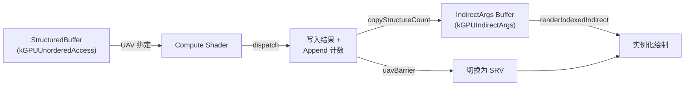
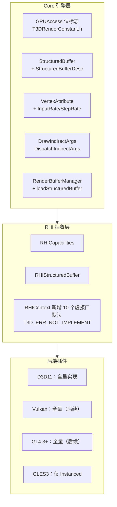

# RHI Compute Dispatch + UAV / Instanced + Indirect Draw 设计方案

> 本文是 `doc/todo/D3D11-Renderer-Backend-Implementation-Plan.md` **§8「F 组：RHI 层缺失接口」** 的独立立项文档。该节的结论是：`dispatch`、UAV、结构化缓冲、Instanced / Indirect Draw 必须作为**一个完整特性一次性设计好 RHI 抽象**，再落地到各后端，否则会在抽象层留下无人调用的孤立接口并在后续被迫返工。
>
> 本文覆盖：**RHI 抽象层设计**（主体）+ 为其服务的 **Core 层配套改动** + **D3D11 后端实现方案** + **其它后端映射与降级策略**。
>
> 本文档为施工蓝图，代码片段均以「建议实现」形式给出并标注现有参考位置，**不代表已落地**。
>
> 涉及的主要文件：
>
> - `source/Core/Include/RHI/T3DRHIContext.h`（下称 `T3DRHIContext.h`）
> - `source/Core/Include/RHI/T3DRHIResource.h`
> - `source/Core/Include/Render/T3DRenderBuffer.h` / `T3DRenderBufferDesc.h` / `T3DRenderConstant.h`
> - `source/Core/Include/Render/T3DVertexAttribute.h` / `T3DVertexDeclaration.h`
> - `source/Core/Include/Render/T3DRenderResourceManager.h`
> - `source/Plugins/Renderer/Direct3D11/Window/Include|Source/T3DD3D11Context.{h,cpp}`
> - `source/Plugins/Renderer/Direct3D11/Window/Include/T3DD3D11RenderBuffer.h`
> - `source/Plugins/Renderer/Direct3D11/Base/Source/T3DD3D11Mapping.cpp` / `T3DD3D11ContextBase.cpp`

---

## 1. 背景、目标与范围

### 1.1 本期目标

| # | 目标 | 说明 |
|---|------|------|
| 1 | **GPU 访问权限抽象** | 统一的 `GPUAccess` 位标志，描述一块资源在 GPU 侧可以扮演的角色（SRV / UAV / IndirectArgs），替代当前散落的 `shaderReadable` 布尔 |
| 2 | **结构化缓冲** | 新增 `StructuredBuffer` 引擎资源类 + `RHIStructuredBuffer`，支持 Structured / ByteAddress / Typed 三种形态 |
| 3 | **UAV 绑定** | `RHIContext::setCSUnorderedAccessBuffers`，纹理与缓冲统一走 `RenderBuffer` 基类 |
| 4 | **Compute 派发** | `dispatch` / `dispatchIndirect` |
| 5 | **写后读同步** | `uavBarrier`，屏蔽 D3D11 的隐式 hazard 解绑与 Vulkan/GL 的显式 barrier 差异 |
| 6 | **GPU 侧计数搬运** | `copyStructureCount`，Append/Counter UAV 的元素数直接写进 indirect 参数缓冲 |
| 7 | **实例化绘制** | `VertexAttribute` 支持 per-instance 输入速率 + `renderInstanced` / `renderIndexedInstanced` |
| 8 | **间接绘制** | `renderIndirect` / `renderIndexedIndirect` + 三个跨 API 二进制一致的参数结构 |
| 9 | **能力查询** | `RHICapabilities`，让上层能在 GLES3.0 这类无 compute 的平台上正确降级 |
| 10 | **Shader 反射扩展** | D3D11 反射补齐 UAV / 结构化缓冲绑定与 `numthreads` 线程组尺寸 |

### 1.2 本期边界（明确不做）

以下内容**不在本文范围内**，需要时另行立项：

- **Material / Pass 层的 compute 支持**。`Pass::addShaderVariant` 对 `SHADER_STAGE::kCompute` 直接返回 `T3D_ERR_NOT_IMPLEMENT`（`T3DPass.cpp:347-362`）。对齐 Unity 的 `ComputeShader` 资产 + `Dispatch(kernelIndex, ...)` 是一个独立的资源/序列化课题。
- **RenderPipeline 层的 compute pass 调度**。`ForwardRenderPipeline::render` 目前只有 graphics draw 路径（`T3DForwardRenderPipeline.cpp:298-326`），compute pass 插入点、资源依赖排序属于 RenderGraph 范畴。
- **GPU-driven 剔除 / 自动实例化合批**。本文只提供 RHI 原语，不提供「把 N 个 `Renderable` 自动合成一次 instanced draw」的上层策略。
- **Pixel Shader 阶段的 UAV**（D3D11.1 `OMSetRenderTargetsAndUnorderedAccessViews`）。一期只做 Compute 阶段 UAV，理由见 §6.3。
- **UAV 计数值回读到 CPU**。这在 RHI 线程模型下是跨线程同步问题，见 §12.3。
- **Stream Output / Transform Feedback**、**Mesh Shader**、**Tessellation 的 indirect 变体**。

### 1.3 为什么这些必须一起做

`ID3D11DeviceContext::Dispatch` 本身的封装是平凡的（一个 `ENQUEUE_UNIQUE_COMMAND` 包一行调用），但**单独加了用不了**：compute shader 的输出必须写进 UAV，没有 UAV 时 `dispatch` 是空转接口。而 UAV 的载体主要是结构化缓冲，结构化缓冲的典型消费方式又是 indirect draw。四者构成一条闭环：



只有 **Instanced Draw** 一项在依赖上是独立的（不需要 UAV），因此在 §10 的排期里被单独提前。

---

## 2. 现状分析

### 2.1 缺口清单

| 环节 | 现状 | 结论 |
|------|------|------|
| Compute shader 创建 | ✅ `createComputeShader` 已实现，`D3D11ComputeShader` 类齐全 | 可用 |
| Compute 资源绑定 | ✅ `setCSConstantBuffers` / `setCSPixelBuffers` / `setCSSamplers` 齐全（`T3DRHIContext.h:504-535`） | 可用，但只能绑只读资源 |
| **Compute 派发** | ❌ `RHIContext` 无任何 `dispatch`，D3D11 插件全局 grep 无 `Dispatch(` 调用 | 整条 CS 接口链是**断头路** |
| **UAV** | ❌ 全仓 grep 无 `ID3D11UnorderedAccessView` / `CSSetUnorderedAccessViews`；`D3D11PixelBuffer2D` 只有 `D3DSRView` / `D3DRTView` / `D3DDSView`（`T3DD3D11RenderBuffer.h`） | compute 无处写输出 |
| **结构化缓冲** | ❌ `RHIResource::ResourceType`（`T3DRHIResource.h:51-69`）只有 VB / IB / CB / PixelBufferXD；`RenderResource::Type` 同 | compute 最常用的 I/O 载体缺失 |
| **Instanced Draw** | ❌ `RHIContext::render` 只有 `Draw` / `DrawIndexed` 两个重载（`T3DRHIContext.h:575,583`）；D3D11 侧对应 `T3DD3D11Context.cpp:2990-3012` | 重复几何体只能逐个 draw call |
| **Per-instance 顶点属性** | ❌ `VertexAttribute` 无 input rate 字段（`T3DVertexAttribute.h:170-181`）；D3D11 建 input layout 时**硬编码** `InputSlotClass = D3D11_INPUT_PER_VERTEX_DATA; InstanceDataStepRate = 0;`（`T3DD3D11Context.cpp:1663-1664`） | 实例数据无法进 IA |
| **Indirect Draw** | ❌ 无接口，无 IndirectArgs 资源标记 | 依赖 UAV，无基础设施 |
| **能力查询** | ❌ Core 层无 `RHICapabilities`；D3D11 的 `mFeatureLevel` 是后端私有成员（`T3DD3D11Context.h`） | 上层无法判断能否降级 |
| **UAV 反射** | ⚠️ `reflectShaderAllBindings` 的 switch 只处理 `D3D_SIT_CBUFFER` / `D3D_SIT_TEXTURE` / `D3D_SIT_SAMPLER`（`T3DD3D11ContextBase.cpp:213-290`），其余 bind type **静默丢弃** | UAV / StructuredBuffer 绑定信息拿不到 |
| Shader 工具链 | ✅ ShaderLab 解析器已有 `kProgramCompute`（`SLParserTypes.h:125-133`），`ShaderCompiler` 已有 `kComputeShader` stage | 编译侧无需改动 |
| Material 层 | ❌ `Pass::addShaderVariant(kCompute)` 返回 `T3D_ERR_NOT_IMPLEMENT`（`T3DPass.cpp:347-362`） | 见 §1.2，不在本期 |

### 2.2 现有基础设施中可以直接复用的

写方案时要尽量贴着这些既有模式，不要另起炉灶：

| 模式 | 参考位置 | 本文如何复用 |
|------|---------|------------|
| **资源生命周期** | `RenderResource::onLoad/onUnload` + `mRHIResource`（`T3DRenderResource.h:88-109`）；各 `onLoad` 统一 `T3D_AGENT.getActiveRHIContext()->createXXX(this)` | `StructuredBuffer::onLoad` 照抄 `VertexBuffer::onLoad`（`T3DVertexBuffer.cpp:60-72`） |
| **RHI 资源是极薄 wrapper** | `RHIVertexBuffer` 只有 `getResourceType()`（`T3DRHIVertexBuffer.h:38-50`） | `RHIStructuredBuffer` 同构 |
| **视图挂在资源 wrapper 上** | `D3D11PixelBuffer2D` 同时持有 `D3DTexture` / `D3DSRView` / `D3DRTView` / `D3DDSView` / `D3DResolveTex` | UAV 也作为 `D3DUAView` 成员挂上去，不新建视图对象 |
| **命令线程化** | `ENQUEUE_UNIQUE_COMMAND`（`T3DRHIThread.h:210`）→ `enqueue_unique_command`（`T3DRHIThread.h:157-177`） | 所有新增 GPU 调用一律走这个宏 |
| **按资源类型 switch 取原生对象** | `setPixelBuffers`（`T3DD3D11Context.cpp:3931-3966`）、`writeBuffer`（`T3DD3D11Context.cpp:3353-3445`）、`getD3DResource` helper | UAV 取视图复用同一个 switch 骨架 |
| **虚接口默认实现返回未实现** | `resizeRenderTexture` / `resizeRenderTarget` 是**非纯虚**，基类默认 `return T3D_ERR_NOT_IMPLEMENT`（`T3DRHIContext.h:114,123`） | 本文所有新增 `RHIContext` 接口一律照此办理，见 §6.1 |
| **描述结构 + 缓存管理器** | `RenderBufferManager::loadVertexBuffer` 等（`T3DRenderResourceManager.h:200-283`）+ `loadBuffer` 模板（`:306-307`） | 新增 `loadStructuredBuffer` |
| **状态备份/恢复** | `BackUpDX11State` 已覆盖 CS 的 SRV / Sampler / CB / Shader（`T3DD3D11Context.h`） | 需补 UAV 槽位备份，见 §7.6 |

---

## 3. 三条影响所有方案的既有约束

这三条与 `D3D11-Renderer-Backend-Implementation-Plan.md` §0 一致，本文所有代码骨架都遵循它们。**新写的 compute / indirect 代码在多线程模式下最容易踩这三个坑。**

### 3.1 `ENQUEUE_UNIQUE_COMMAND` 的返回值不是操作结果

```157:177:source/Core/Include/RHI/T3DRHIThread.h
        template<typename Action, typename... Args>
        TResult enqueue_unique_command(Action action, Args... args)
        {
            TResult ret = T3D_OK;
            // ... 省略 trait 推导 ...
            if (isRunning())
            {
                command_type *cmd = T3D_NEW command_type(std::move(args)..., action);
                ret = addCommand(cmd);
            }
            else
            {
                ret = action(args...);
            }
            return ret;
        }
```

RHI 线程开启时返回的是**入队结果**（恒 `T3D_OK`）。因此：

- `createStructuredBuffer` 不能靠返回值判断创建是否成功，失败时让 lambda 内部把 `D3DBuffer` / `D3DUAView` 保持 `nullptr` 并打 `T3D_LOG_ERROR`。
- **所有 UAV 使用点必须对 `D3DUAView == nullptr` 做防御**。这一点比 SRV 更关键：`CSSetUnorderedAccessViews` 传 `nullptr` 不会崩，但 compute 会静默写不出任何东西，比崩溃更难排查。因此绑定时遇到 `nullptr` UAV 必须打 `T3D_LOG_ERROR` 而不是静默跳过。

### 3.2 lambda 参数必须是「自持有生命周期」的类型

`RHICommandT` 把参数**按值拷贝**进 `std::tuple`（`T3DRHICommand.h:46-88`），命令执行时原始对象可能已销毁。对本文新增的接口意味着：

| 传递内容 | 正确做法 |
|---------|---------|
| indirect 参数缓冲 | 传 `RenderBufferPtr(argsBuffer)`，不能传裸 `RenderBuffer*` |
| UAV 绑定数组 | 传 `UnorderedAccessBuffers`（`TArray<RenderBufferPtr>`）整体拷贝，与 `setPixelBuffers` 传 `PixelBuffers` 一致 |
| `UAVInitialCounts` | `TArray<uint32_t>` 按值拷贝 |
| dispatch 的 group count | POD，直接按值传 |
| 结构化缓冲初始数据 | 深拷贝一份 `Buffer` 交给命令，lambda 末尾 `buffer.release()`（参考 `writeBuffer`，`T3DD3D11Context.cpp:3371-3374`） |

### 3.3 D3D11 UAV 的硬性限制

后面所有 D3D11 方案围绕这张表设计：

| 限制 | 内容 |
|------|------|
| **结构化缓冲与 IA 互斥** | `D3D11_RESOURCE_MISC_BUFFER_STRUCTURED` **不能**与 `D3D11_BIND_VERTEX_BUFFER` / `INDEX_BUFFER` / `CONSTANT_BUFFER` / `STREAM_OUTPUT` 组合。想让 compute 直接写顶点缓冲，必须用 **Raw（ByteAddress）** 或 **Typed** 形态 |
| **Raw 视图前置条件** | `D3D11_RESOURCE_MISC_BUFFER_ALLOW_RAW_VIEWS` 要求 BindFlags 至少含 `SHADER_RESOURCE` 或 `UNORDERED_ACCESS`；它**可以**与 `VERTEX_BUFFER` 组合 |
| **MSAA 无 UAV** | 多重采样纹理不能创建 UAV |
| **sRGB 无 UAV** | `*_SRGB` 格式不能创建 UAV；需要 sRGB 写入时用 typeless 资源 + UNORM UAV，由 shader 自己做 gamma |
| **Typed UAV load 格式受限** | FL11.0 只保证 `R32_FLOAT` / `R32_UINT` / `R32_SINT` 支持 typed **load**；其余格式只保证 **store** |
| **UAV 槽位数** | FL11.0 = 8（`D3D11_PS_CS_UAV_REGISTER_COUNT`）；FL11.1 = 64（`D3D11_1_UAV_SLOT_COUNT`） |
| **Dispatch 上限** | 每个维度 ≤ 65535（`D3D11_CS_DISPATCH_MAX_THREAD_GROUPS_PER_DIMENSION`） |
| **SRV / UAV 互斥** | 同一子资源同时绑为 SRV 和 UAV 时，D3D11 debug layer 报 HAZARD 警告并**静默把 SRV 绑定置空**。这是 §6.4 `uavBarrier` 存在的根本原因 |
| **Indirect 参数缓冲** | 必须带 `D3D11_RESOURCE_MISC_DRAWINDIRECT_ARGS`；偏移必须是 4 的倍数 |
| **CopyStructureCount 源** | 源 UAV 必须创建时带 `D3D11_BUFFER_UAV_FLAG_APPEND` 或 `D3D11_BUFFER_UAV_FLAG_COUNTER` |
| **Feature Level** | CS 5.0 需要 FL11.0。FL10.x 的 CS 4.x 只有 1 个 UAV、无 typed UAV load、无 append/consume，能力残缺 —— 一期直接在 `RHICapabilities` 里关掉，不做兼容 |

---

## 4. 总体架构

### 4.1 分层与改动面



### 4.2 关键设计决策

| 决策点 | 选择 | 理由 |
|-------|------|------|
| UAV 是独立资源对象还是资源成员？ | **资源 wrapper 的成员** `D3DUAView` | 与既有 `D3DSRView` / `D3DRTView` / `D3DDSView` 一致；避免引入需要独立生命周期管理的第三类对象 |
| UAV 绑定数组用什么元素类型？ | **`TArray<RenderBufferPtr>`** | UAV 可以是纹理也可以是缓冲，`RenderBuffer` 是二者唯一的共同基类；`PixelBuffers` 那样的 `TArray<PixelBufferPtr>` 装不下结构化缓冲 |
| 新接口纯虚还是带默认实现？ | **带默认实现，返回 `T3D_ERR_NOT_IMPLEMENT`** | 遵循 `resizeRenderTexture` 已确立的先例（`T3DRHIContext.h:114`）；避免一次性强迫 5 个后端补 10 个空 override |
| 实例化绘制的接口名？ | **`renderInstanced` / `renderIndexedInstanced`**，不复用 `render` 重载 | 现有 `render(a,b,c)` 与 `render(a,b)` 已经靠参数个数区分，再加 4/5 参重载会**编译通过但语义写错**，是极难发现的 bug |
| 能力查询是虚函数还是数据成员？ | **`RHIContext` 的 protected 数据成员 + 非虚 getter** | 与 `mViewMatrix` / `mProjectionFlipped`（`T3DRHIContext.h:704-712`）同构；后端在 `init()` 里填，零 override 成本 |
| 同步用 barrier 还是自动解绑？ | **显式 `uavBarrier(资源列表)`** | D3D11 只需解绑，Vulkan 需要 image layout transition（必须知道是哪些资源），GL 需要 `glMemoryBarrier`。列表版是唯一能同时喂饱三者的形态 |
| Indirect 参数结构自定义还是照抄 API？ | **照抄，三 API 二进制一致** | D3D11 `DrawIndexedInstancedIndirect`、`VkDrawIndexedIndirectCommand`、GL `DrawElementsIndirectCommand` 的字段顺序与宽度**完全相同**，直接定义一份 POD 即可跨后端零转换 |
| 是否做 PS 阶段 UAV？ | **不做** | 需要 `ID3D11DeviceContext1::OMSetRenderTargetsAndUnorderedAccessViews`，与 `setRenderTarget` 的整条路径耦合；Compute UAV 已覆盖 90% 场景 |

---

## 5. Core 层设计

### 5.1 `GPUAccess` 位标志

**问题**：当前描述 GPU 侧可访问性的只有 `PixelBufferXDDesc::shaderReadable` 一个 bool（`T3DRenderBufferDesc.h:96-97,127-129,155-157`），而 UAV / IndirectArgs 是与 SRV 正交的另外两个维度。继续加 bool 会退化成 `shaderReadable`/`shaderWritable`/`indirectArgs` 三个平行布尔，且顶点/索引缓冲根本没有描述结构可加。

**方案**：在 `T3DRenderConstant.h` 的 `CPUAccessMode`（`:262`）**之后**新增一个与之对称的 GPU 侧枚举：

```cpp
    /**
     * \brief GPU 侧附加访问权限位标志
     * \remarks 与 CPUAccessMode 对称。缓冲/纹理的「本职」绑定（顶点缓冲之于
     *          VertexBuffer、着色器资源之于普通纹理）由资源类自身隐含，
     *          本枚举只描述**额外**开放的能力，映射到 D3D11 的 BindFlags
     *          附加位、Vulkan 的 VkBufferUsageFlags、GL 的 buffer target。
     */
    TENUM()
    enum GPUAccessFlags : uint32_t
    {
        /// 无附加权限
        kGPUNone            = 0,
        /// 可作为着色器只读资源（SRV / sampled image / SSBO readonly）
        kGPUShaderResource  = (1 << 0),
        /// 可作为着色器读写资源（UAV / storage image / SSBO）
        kGPUUnorderedAccess = (1 << 1),
        /// 可作为 indirect draw / dispatch 的参数缓冲
        kGPUIndirectArgs    = (1 << 2),
    };
```

**权威存放位置放在 `RenderBuffer` 基类**，而不是各个 Desc —— 因为 `PixelBuffer` / `VertexBuffer` / `IndexBuffer` / `ConstantBuffer` / `StructuredBuffer` 全部派生自 `RenderBuffer`（`T3DRenderBuffer.h:41`），后端只需在一个地方读：

```cpp
    // T3DRenderBuffer.h
    public:
        /// GPU 侧附加访问权限（GPUAccessFlags 组合）
        uint32_t getGPUAccess() const { return mGPUAccess; }

    protected:
        RenderBuffer(const Buffer &buffer, MemoryType memType, Usage usage,
            uint32_t accMode, uint32_t gpuAccess = kGPUNone);

        uint32_t    mGPUAccess {kGPUNone};
```

**兼容与迁移**：

1. 各 `PixelBufferXDDesc` 新增 `TPROPERTY() uint32_t gpuAccess {kGPUNone};`（可序列化）。
2. `PixelBufferT` 构造时合并旧字段：`mGPUAccess = desc->gpuAccess | (desc->shaderReadable ? kGPUShaderResource : 0)`。
3. `shaderReadable` **保留一个版本**并在注释里标注 deprecated，待全部调用点迁移后删除。这样已有的 `.ttex` 资产和 `loadRenderTexture` 调用点（`T3DRenderResourceManager.h:283`）不用同步改。
4. `VertexBuffer::create` / `IndexBuffer::create` / `ConstantBuffer::create` 在**参数列表末尾**追加 `uint32_t gpuAccess = kGPUNone`，默认值保证所有现有调用点（`T3DVertexBuffer.h:51`、`T3DIndexBuffer.h:52` 及 `RenderBufferManager` 的对应 `loadXXX`）零改动。

**一致性校验**（放在 `RenderBuffer` 构造函数里，一次性拦住所有后端的踩坑）：

- `kGPUUnorderedAccess` 与 `Usage::kImmutable` 互斥 → 打错误日志并清掉 UAV 位。
- `kGPUUnorderedAccess` 与 `Usage::kDynamic` 互斥（D3D11 明确禁止 DYNAMIC 资源建 UAV）→ 同上。
- `kGPUIndirectArgs` 只对 `StructuredBuffer` 有意义，其它类型上出现时打警告。

### 5.2 `StructuredBuffer` 资源类

Compute 最常用的 I/O 载体，引擎层与 RHI 层都缺。

#### 5.2.1 描述结构

加到 `T3DRenderBufferDesc.h`，紧跟 `IndexBufferDesc`（`:60-71`）之后：

```cpp
    /**
     * \brief 结构化缓冲的形态
     */
    TENUM()
    enum class StructuredBufferKind : uint32_t
    {
        /// StructuredBuffer<T> / RWStructuredBuffer<T>，按 elementSize 步进
        kStructured = 0,
        /// ByteAddressBuffer / RWByteAddressBuffer，4 字节寻址；可与顶点/索引缓冲共存
        kByteAddress,
        /// Buffer<T> / RWBuffer<T>，按 format 做格式化取值；可与顶点缓冲共存
        kTyped,
    };

    /**
     * \brief 结构化缓冲创建描述
     */
    TSTRUCT()
    struct T3D_ENGINE_API StructuredBufferDesc
    {
        /// 缓冲形态
        TPROPERTY()
        StructuredBufferKind    kind {StructuredBufferKind::kStructured};
        /// 单个元素字节数；kStructured 必填且须为 4 的倍数，其余形态忽略
        TPROPERTY()
        uint32_t    elementSize {0};
        /// 元素个数
        TPROPERTY()
        uint32_t    elementCount {0};
        /// kTyped 时的元素格式，其余形态忽略
        TPROPERTY()
        PixelFormat format {PixelFormat::E_PF_UNKNOWN};
        /// 是否为 UAV 附加隐藏计数器（对应 D3D11_BUFFER_UAV_FLAG_COUNTER）
        TPROPERTY()
        bool    hasCounter {false};
        /// 是否为 Append/Consume 缓冲（对应 D3D11_BUFFER_UAV_FLAG_APPEND）
        TPROPERTY()
        bool    isAppendConsume {false};
        /// 初始 CPU 数据
        TPROPERTY()
        Buffer  buffer {};
    };
```

> `hasCounter` 与 `isAppendConsume` 互斥（D3D11 的 `APPEND` 与 `COUNTER` flag 不能同时设），构造时校验。

#### 5.2.2 引擎层资源类

与 `VertexBuffer`（`T3DVertexBuffer.h:38-95`）严格同构：

```cpp
    class T3D_ENGINE_API StructuredBuffer : public RenderBuffer
    {
    public:
        static StructuredBufferPtr create(const StructuredBufferDesc &desc,
            MemoryType memType, Usage usage, uint32_t accMode, uint32_t gpuAccess);

        Type getType() const override;   // 返回 Type::kStructuredBuffer

        const StructuredBufferDesc &getDescriptor() const { return mDesc; }

        uint32_t getElementCount() const { return mDesc.elementCount; }
        uint32_t getElementSize() const { return mDesc.elementSize; }

    protected:
        StructuredBuffer(const StructuredBufferDesc &desc, MemoryType memType,
            Usage usage, uint32_t accMode, uint32_t gpuAccess);
        ~StructuredBuffer() override = default;

        bool onLoad() override;    // mRHIResource = ctx->createStructuredBuffer(this);
        bool onUnload() override;  // mRHIResource = nullptr;

        StructuredBufferDesc mDesc {};
    };
```

`RenderResource::Type`（`T3DRenderResource.h:52-71`）与 `RHIResource::ResourceType`（`T3DRHIResource.h:51-69`）各在**枚举末尾追加** `kStructuredBuffer`。追加而非中插，是为了不打乱既有日志里已经出现过的数值含义。

#### 5.2.3 RHI 层 wrapper

加到 `source/Core/Include/RHI/`，新建 `T3DRHIStructuredBuffer.h`，与 `T3DRHIVertexBuffer.h:38-50` 同构：

```cpp
    class T3D_ENGINE_API RHIStructuredBuffer : public RHIResource
    {
    public:
        ResourceType getResourceType() const override { return ResourceType::kStructuredBuffer; }

    protected:
        RHIStructuredBuffer();
    };
```

#### 5.2.4 管理器与 typedef

- `RenderBufferManager` 增加 `loadStructuredBuffer(const StructuredBufferDesc &, MemoryType, Usage, CPUAccessMode, uint32_t gpuAccess, const UUID & = UUID::INVALID)`，实现直接套 `loadBuffer` 模板（`T3DRenderResourceManager.h:306-307`），新增 `BufferCache mSBufferCache`，并在 `GC()` 里加一行。
- `T3DTypedef.h` 的 RHI 智能指针区（`:183-205`）加 `T3D_DECLARE_SMART_PTR(RHIStructuredBuffer);`，引擎侧资源区加 `T3D_DECLARE_SMART_PTR(StructuredBuffer);`。
- 容器 typedef 区（`T3DTypedef.h:269-279`）新增：

```cpp
    /// UAV 绑定数组；元素可以是 PixelBufferXD、StructuredBuffer 或带 UAV 的 VertexBuffer
    using UnorderedAccessBuffers = TArray<RenderBufferPtr>;
    /// Append/Consume 缓冲的初始计数；kKeepUAVCounter 表示保持当前值
    using UAVInitialCounts = TArray<uint32_t>;
```

```cpp
    /// UAVInitialCounts 中表示「不修改计数器」的哨兵值，对应 D3D11 的 (UINT)-1
    const uint32_t kKeepUAVCounter = 0xFFFFFFFFu;
```

### 5.3 `VertexAttribute` 的 per-instance 扩展

**现状**：`VertexAttribute` 只有 type / semantic / offset / slot / semanticIndex 五个字段（`T3DVertexAttribute.h:170-181`），D3D11 建 input layout 时硬编码 per-vertex：

```1663:1664:source/Plugins/Renderer/Direct3D11/Window/Source/T3DD3D11Context.cpp
                d3dDescs[i].InputSlotClass = D3D11_INPUT_PER_VERTEX_DATA;
                d3dDescs[i].InstanceDataStepRate = 0;
```

**方案**：新增输入速率枚举与两个字段。

```cpp
        /**
         * \brief 顶点属性的输入速率
         */
        TENUM()
        enum class InputRate : uint32_t
        {
            /// 每个顶点推进一次（默认）
            kPerVertex = 0,
            /// 每 stepRate 个实例推进一次
            kPerInstance = 1,
        };

    protected:
        /// 输入速率
        InputRate   mInputRate {InputRate::kPerVertex};
        /// 实例数据步进率；kPerVertex 时必须为 0，kPerInstance 时至少为 1
        uint32_t    mInstanceStepRate {0};
```

配套：

1. 新增一个带 `InputRate` / `stepRate` 的构造重载，**保留原有 5 参构造**（`T3DVertexAttribute.h:121`）不变，默认走 per-vertex。这样 Mesh 导入、ImGui 后端等所有现有调用点零改动。
2. `getInputRate()` / `getInstanceStepRate()` getter，`setInputRate()` / `setInstanceStepRate()` setter 放 protected 区并加 `TPROPERTY`，与既有字段一致。
3. **`VertexDeclaration::hash()`（`T3DVertexDeclaration.h`）必须把新字段纳入**。顶点声明按 CRC 缓存复用（`RenderBufferManager::addVertexDeclaration`），漏掉新字段会导致「只有 input rate 不同的两个声明」哈希碰撞，复用到错误的 input layout —— 这个 bug 表现为实例数据被当成顶点数据读，非常难查。
4. `VertexDeclaration::getVertexSize(uint32_t source)` 是按 slot 累加的，实例数据放独立 slot 时天然正确，无需改动。

**语义约定**（写进接口注释）：实例数据通常是一个 `float4x4` 世界矩阵，占 4 个 `E_VAT_FLOAT4`。现有 `Semantic` 枚举（`T3DVertexAttribute.h:87-108`）没有专门的 instance 语义，约定复用 `E_VAS_TEXCOORD` + 高位 `semanticIndex`（如 TEXCOORD4~7），HLSL 侧对应 `float4 instanceMatrix : TEXCOORD4;` 等。这与 Unity / Unreal 的通行做法一致，无需扩枚举。

### 5.4 Indirect 参数结构

D3D11、Vulkan、OpenGL 三者的 indirect 参数**字段顺序与宽度完全一致**，因此只定义一份 POD，各后端直接把缓冲字节喂给 API，零转换。加到 `T3DRenderConstant.h`：

```cpp
    /**
     * \brief 非索引间接绘制参数
     * \remarks 二进制布局与 D3D11 DrawInstancedIndirect /
     *          VkDrawIndirectCommand / GL DrawArraysIndirectCommand 一致
     */
    TSTRUCT()
    struct T3D_ENGINE_API DrawIndirectArgs
    {
        uint32_t    vertexCountPerInstance {0};
        uint32_t    instanceCount {0};
        uint32_t    startVertexLocation {0};
        uint32_t    startInstanceLocation {0};
    };

    /**
     * \brief 索引间接绘制参数
     * \remarks 二进制布局与 D3D11 DrawIndexedInstancedIndirect /
     *          VkDrawIndexedIndirectCommand / GL DrawElementsIndirectCommand 一致
     */
    TSTRUCT()
    struct T3D_ENGINE_API DrawIndexedIndirectArgs
    {
        uint32_t    indexCountPerInstance {0};
        uint32_t    instanceCount {0};
        uint32_t    startIndexLocation {0};
        /// 有符号：允许负的顶点基址偏移
        int32_t     baseVertexLocation {0};
        uint32_t    startInstanceLocation {0};
    };

    /**
     * \brief 间接派发参数
     * \remarks 二进制布局与 D3D11 DispatchIndirect /
     *          VkDispatchIndirectCommand / GL DispatchIndirectCommand 一致
     */
    TSTRUCT()
    struct T3D_ENGINE_API DispatchIndirectArgs
    {
        uint32_t    threadGroupCountX {0};
        uint32_t    threadGroupCountY {0};
        uint32_t    threadGroupCountZ {0};
    };
```

加 `static_assert(sizeof(DrawIndexedIndirectArgs) == 20, ...)` 之类的断言，防止将来有人加字段破坏布局。

### 5.5 `RHICapabilities`

新建 `source/Core/Include/RHI/T3DRHICapabilities.h`：

```cpp
    /**
     * \brief 后端能力查询结果
     * \remarks 由各后端在 init() 中填充；上层据此决定走 GPU 路径还是 CPU 降级路径
     */
    struct T3D_ENGINE_API RHICapabilities
    {
        /// 支持 compute shader 与 dispatch
        bool        supportsCompute {false};
        /// 支持 UAV / storage image / SSBO
        bool        supportsUnorderedAccess {false};
        /// 支持结构化缓冲（StructuredBuffer / SSBO）
        bool        supportsStructuredBuffer {false};
        /// 支持实例化绘制
        bool        supportsInstancing {false};
        /// 支持实例化绘制的非零 startInstance（GL 需 4.2+，GLES 不支持）
        bool        supportsBaseInstance {false};
        /// 支持 indirect draw
        bool        supportsIndirectDraw {false};
        /// 支持 indirect dispatch
        bool        supportsIndirectDispatch {false};
        /// 支持 Append/Consume 缓冲与隐藏计数器
        bool        supportsAppendConsumeBuffer {false};

        /// 每维最大线程组数
        uint32_t    maxDispatchGroupCount[3] {0, 0, 0};
        /// 每维最大线程组内线程数
        uint32_t    maxComputeGroupSize[3] {0, 0, 0};
        /// 单个线程组可用共享内存字节数
        uint32_t    maxComputeSharedMemory {0};
        /// 可同时绑定的 UAV 槽位数
        uint32_t    maxUnorderedAccessSlots {0};
    };
```

挂到 `RHIContext` 上，用与 `mViewMatrix`（`T3DRHIContext.h:704-712`）相同的 protected 数据成员模式，**不引入新的纯虚函数**：

```cpp
    // T3DRHIContext.h public 区
        /// 返回当前后端的能力集；后端未填充时全部为 false / 0
        const RHICapabilities &getCapabilities() const { return mCapabilities; }

    // protected 区
        /// 后端能力集，由派生类在 init() 中填充
        RHICapabilities mCapabilities {};
```

**默认全 false 是刻意的**：未改动的后端自动表现为「不支持」，与 §6.1 的 `T3D_ERR_NOT_IMPLEMENT` 默认实现语义一致，不会出现「能力位说支持但接口返回未实现」的自相矛盾状态。

---

## 6. RHI 接口设计

### 6.1 接口引入原则

`D3D11-Renderer-Backend-Implementation-Plan.md` §8.2 第 5 条指出：新增纯虚函数会强制 GL4 / GLES3 / Vulkan / Metal / Reference3D **全部补 override**。本文规避这一点 —— 沿用 D0 决策已经确立的先例：

```106:123:source/Core/Include/RHI/T3DRHIContext.h
        virtual TResult resizeRenderTexture(RenderTexture *rt, uint32_t width, uint32_t height) { return T3D_ERR_NOT_IMPLEMENT; }
        // ...
        virtual TResult resizeRenderTarget(RenderTarget *rt, uint32_t width, uint32_t height) { return T3D_ERR_NOT_IMPLEMENT; }
```

**本文新增的全部 `RHIContext` 接口一律为非纯虚，基类默认返回 `T3D_ERR_NOT_IMPLEMENT`（资源创建类返回 `nullptr`）。** 后端按需 override，未 override 的后端得到明确错误码而不是静默无操作。

### 6.2 资源创建

紧跟 `createConstantBuffer`（`T3DRHIContext.h:279`）之后：

```cpp
        /**
         * \brief 创建 RHI 结构化缓冲对象
         * \param [in] buffer : 引擎的结构化缓冲对象
         * \return 调用成功返回 RHI 对象；后端不支持或创建失败时返回 nullptr
         * \note 是否创建 SRV / UAV 由 buffer->getGPUAccess() 决定
         */
        virtual RHIStructuredBufferPtr createStructuredBuffer(StructuredBuffer *buffer) { return nullptr; }
```

普通纹理与顶点/索引缓冲的 UAV **不新增创建接口** —— 它们在各自已有的 `createPixelBufferXD` / `createVertexBuffer` 里根据 `getGPUAccess()` 顺带建出来，见 §7.2。

### 6.3 Compute UAV 绑定

紧跟 `setCSSamplers`（`T3DRHIContext.h:535`）之后：

```cpp
        /**
         * \brief 设置 cs 的无序访问视图（UAV）
         * \param [in] startSlot : UAV 插槽，对应 shader 中 u# 寄存器索引
         * \param [in] buffers : 可读写资源数组，元素可为像素缓冲、结构化缓冲或
         *                       带 kGPUUnorderedAccess 的顶点缓冲；元素为 nullptr 表示解绑该槽
         * \param [in] initialCounts : Append/Consume 与 Counter 缓冲的初始计数值，
         *                             长度须为 0 或与 buffers 等长；
         *                             取 kKeepUAVCounter 表示保持当前计数；
         *                             长度为 0 时等价于全部 kKeepUAVCounter
         * \return 调用成功返回 T3D_OK；资源未带 kGPUUnorderedAccess 时返回 T3D_ERR_INVALID_PARAM
         * \note 同一资源不能同时绑定为 UAV 与 SRV。切换用途前须调用 uavBarrier，
         *       否则 D3D11 会静默解除 SRV 绑定，其它后端行为未定义。
         */
        virtual TResult setCSUnorderedAccessBuffers(uint32_t startSlot,
            const UnorderedAccessBuffers &buffers,
            const UAVInitialCounts &initialCounts = UAVInitialCounts()) { return T3D_ERR_NOT_IMPLEMENT; }
```

命名与既有的 `setCSPixelBuffers` / `setCSConstantBuffers` 保持同族。

### 6.4 派发与同步

```cpp
        /**
         * \brief 派发 compute shader
         * \param [in] groupCountX : X 维线程组数量
         * \param [in] groupCountY : Y 维线程组数量
         * \param [in] groupCountZ : Z 维线程组数量
         * \return 调用成功返回 T3D_OK；任一维超出 getCapabilities().maxDispatchGroupCount
         *         时返回 T3D_ERR_INVALID_PARAM
         * \note 调用前须已通过 setComputeShader / setCS* 系列完成资源绑定
         */
        virtual TResult dispatch(uint32_t groupCountX, uint32_t groupCountY, uint32_t groupCountZ) { return T3D_ERR_NOT_IMPLEMENT; }

        /**
         * \brief 按 GPU 缓冲中的参数间接派发 compute shader
         * \param [in] argsBuffer : 参数缓冲，须带 kGPUIndirectArgs，
         *                          内容布局为 DispatchIndirectArgs
         * \param [in] argsOffset : 参数在缓冲中的字节偏移，须为 4 的倍数
         * \return 调用成功返回 T3D_OK
         */
        virtual TResult dispatchIndirect(RenderBuffer *argsBuffer, size_t argsOffset = 0) { return T3D_ERR_NOT_IMPLEMENT; }

        /**
         * \brief UAV 写后读同步点：保证之前的 UAV 写入对后续读取可见，并解除 UAV 绑定
         * \param [in] buffers : 需要同步的资源列表；为空表示对所有当前绑定的 UAV 生效
         * \return 调用成功返回 T3D_OK
         * \remarks 各后端语义：
         *          - D3D11：将这些资源占用的 CS UAV 槽置空。驱动自行跟踪 hazard，
         *            无需显式 barrier；但不解绑就无法把同一资源当作 SRV 使用。
         *          - Vulkan：vkCmdPipelineBarrier，含 storage image 的 layout 转换。
         *          - OpenGL：glMemoryBarrier(SHADER_STORAGE | TEXTURE_FETCH |
         *            SHADER_IMAGE_ACCESS | COMMAND_BARRIER)。
         */
        virtual TResult uavBarrier(const UnorderedAccessBuffers &buffers) { return T3D_ERR_NOT_IMPLEMENT; }

        /**
         * \brief 把 Append/Counter UAV 的当前元素计数拷贝到目标缓冲的指定偏移
         * \param [in] dstBuffer : 目标缓冲，通常是 indirect 参数缓冲
         * \param [in] dstOffset : 目标字节偏移，须为 4 的倍数
         * \param [in] srcBuffer : 源结构化缓冲，创建时须置 hasCounter 或 isAppendConsume
         * \return 调用成功返回 T3D_OK
         * \note 这是纯 GPU 侧搬运，不涉及 CPU 同步，是 GPU-driven 剔除的关键原语：
         *       compute 用 Append 缓冲收集可见实例，计数直接落进
         *       DrawIndexedIndirectArgs::instanceCount 字段。
         */
        virtual TResult copyStructureCount(RenderBuffer *dstBuffer, size_t dstOffset,
            RenderBuffer *srcBuffer) { return T3D_ERR_NOT_IMPLEMENT; }
```

### 6.5 实例化与间接绘制

紧跟现有两个 `render` 重载（`T3DRHIContext.h:575,583`）之后：

```cpp
        /**
         * \brief 索引实例化绘制
         * \param [in] indexCount : 单个实例的索引数量
         * \param [in] instanceCount : 实例数量
         * \param [in] startIndex : 索引缓冲区起始位置
         * \param [in] baseVertex : 加到每个索引值上的顶点基址，可为负
         * \param [in] startInstance : 起始实例编号，非 0 时需要
         *                             getCapabilities().supportsBaseInstance
         * \return 调用成功返回 T3D_OK
         */
        virtual TResult renderIndexedInstanced(uint32_t indexCount, uint32_t instanceCount,
            uint32_t startIndex, int32_t baseVertex, uint32_t startInstance) { return T3D_ERR_NOT_IMPLEMENT; }

        /**
         * \brief 非索引实例化绘制
         * \param [in] vertexCount : 单个实例的顶点数量
         * \param [in] instanceCount : 实例数量
         * \param [in] startVertex : 顶点缓冲区起始位置
         * \param [in] startInstance : 起始实例编号
         * \return 调用成功返回 T3D_OK
         */
        virtual TResult renderInstanced(uint32_t vertexCount, uint32_t instanceCount,
            uint32_t startVertex, uint32_t startInstance) { return T3D_ERR_NOT_IMPLEMENT; }

        /**
         * \brief 按 GPU 缓冲中的参数进行索引间接绘制
         * \param [in] argsBuffer : 参数缓冲，须带 kGPUIndirectArgs，
         *                          内容布局为 DrawIndexedIndirectArgs
         * \param [in] argsOffset : 参数字节偏移，须为 4 的倍数
         * \return 调用成功返回 T3D_OK
         */
        virtual TResult renderIndexedIndirect(RenderBuffer *argsBuffer, size_t argsOffset = 0) { return T3D_ERR_NOT_IMPLEMENT; }

        /**
         * \brief 按 GPU 缓冲中的参数进行非索引间接绘制
         * \param [in] argsBuffer : 参数缓冲，内容布局为 DrawIndirectArgs
         * \param [in] argsOffset : 参数字节偏移，须为 4 的倍数
         * \return 调用成功返回 T3D_OK
         */
        virtual TResult renderIndirect(RenderBuffer *argsBuffer, size_t argsOffset = 0) { return T3D_ERR_NOT_IMPLEMENT; }
```

> **为什么不复用 `render` 重载**：现有 `render(uint32_t, uint32_t, uint32_t)` 是索引绘制，`render(uint32_t, uint32_t)` 是非索引绘制。再加 4 参与 5 参重载后，`render(a, b, c, d)` 究竟是「非索引实例化」还是别的什么，只能靠数参数判断。写错**不会编译报错**，只会画出错误的东西。distinct 命名是这里唯一负责任的选择。顺带一提，现有 `render` 的 `baseVertex` 声明为 `uint32_t`，而 `DrawIndexed` 的对应参数是 `INT` —— 新接口用 `int32_t` 修正这一点，旧接口暂不动以免影响调用点。

### 6.6 新增接口汇总

| 接口 | 类别 | 默认返回 |
|------|------|---------|
| `createStructuredBuffer` | 资源创建 | `nullptr` |
| `setCSUnorderedAccessBuffers` | 绑定 | `T3D_ERR_NOT_IMPLEMENT` |
| `dispatch` | 派发 | `T3D_ERR_NOT_IMPLEMENT` |
| `dispatchIndirect` | 派发 | `T3D_ERR_NOT_IMPLEMENT` |
| `uavBarrier` | 同步 | `T3D_ERR_NOT_IMPLEMENT` |
| `copyStructureCount` | 同步 | `T3D_ERR_NOT_IMPLEMENT` |
| `renderIndexedInstanced` | 绘制 | `T3D_ERR_NOT_IMPLEMENT` |
| `renderInstanced` | 绘制 | `T3D_ERR_NOT_IMPLEMENT` |
| `renderIndexedIndirect` | 绘制 | `T3D_ERR_NOT_IMPLEMENT` |
| `renderIndirect` | 绘制 | `T3D_ERR_NOT_IMPLEMENT` |
| `getCapabilities` | 查询 | 非虚，读 `mCapabilities` |

共 10 个虚接口 + 1 个非虚 getter。

### 6.7 典型调用序列

一次 GPU-driven 剔除 + 间接绘制的完整 RHI 调用顺序，用来检验接口设计是否自洽：

```cpp
// ---- 1. Compute：剔除并 Append 可见实例 ----
ctx->setComputeShader(cullShader);
ctx->setCSConstantBuffers(0, {frustumCB});
ctx->setCSPixelBuffers(0, {});                       // 本例无只读纹理输入
ctx->setCSUnorderedAccessBuffers(0,
    {allInstancesSB, visibleInstancesSB},            // u0 只读输入（也走 UAV 便于同 pass 复用）、u1 Append 输出
    {kKeepUAVCounter, 0});                           // u1 计数清零

const uint32_t groups = (instanceCount + 63) / 64;   // shader 侧 numthreads(64,1,1)
ctx->dispatch(groups, 1, 1);

// ---- 2. 计数落进 indirect 参数缓冲 ----
// DrawIndexedIndirectArgs::instanceCount 是第 2 个 uint32，偏移 4
ctx->copyStructureCount(drawArgsSB, offsetof(DrawIndexedIndirectArgs, instanceCount), visibleInstancesSB);

// ---- 3. 解绑 UAV，让 visibleInstancesSB 能作为 SRV 被 VS 读 ----
ctx->uavBarrier({allInstancesSB, visibleInstancesSB, drawArgsSB});
ctx->setComputeShader(nullptr);

// ---- 4. 间接绘制 ----
ctx->setPrimitiveType(PrimitiveType::kTriangleList);
ctx->setVertexDeclaration(instancedDecl);            // 含 per-instance 属性
ctx->setVertexBuffers(0, {meshVB, instanceVB}, strides, offsets);
ctx->setIndexBuffer(meshIB);
ctx->setVertexShader(vs);
ctx->setPixelShader(ps);
ctx->setVSPixelBuffers(0, {visibleInstancesSB});     // 或走 SRV 读实例数据
ctx->renderIndexedIndirect(drawArgsSB, 0);
```

**这个序列暴露的一个设计要求**：`setVSPixelBuffers` 的参数类型是 `PixelBuffers`（`TArray<PixelBufferPtr>`，`T3DTypedef.h:277`），装不下 `StructuredBuffer`。因此结构化缓冲作为**只读 SRV** 绑定到图形管线时，需要额外一组接口：

```cpp
        /**
         * \brief 设置 vs 的只读结构化缓冲（SRV）
         * \param [in] startSlot : 插槽，对应 shader 中 t# 寄存器索引
         * \param [in] buffers : 结构化缓冲数组
         * \return 调用成功返回 T3D_OK
         */
        virtual TResult setVSStructuredBuffers(uint32_t startSlot, const StructuredBuffers &buffers) { return T3D_ERR_NOT_IMPLEMENT; }
        // 同理 setPSStructuredBuffers / setCSStructuredBuffers
```

一期只做 **VS / PS / CS 三个 stage**（HS / DS / GS 用到结构化缓冲的场景极少，需要时再补），`using StructuredBuffers = TArray<StructuredBufferPtr>;`。

> **备选方案**：把 `PixelBuffers` 的元素类型从 `PixelBufferPtr` 放宽到 `RenderBufferPtr`，让 `setXXPixelBuffers` 一并吃下结构化缓冲。这样不用新增 3 个接口，但会波及**全部 4 个后端**的 `setPixelBuffers` 实现以及 `ForwardRenderPipeline::setupShaderTexSamplers`（`T3DForwardRenderPipeline.cpp:1088-1118`）的类型推导，改动面反而更大，且 `setPSPixelBuffers` 这个名字会与实际语义脱节。**推荐新增独立接口。**

---

## 7. D3D11 后端实现方案

### 7.1 资源与视图创建：BindFlags / MiscFlags 映射

新增 `D3D11Mapping` 静态方法，与既有的 `get(Usage, uint32_t, D3D11_USAGE&, uint32_t&)`（`T3DD3D11Mapping.h:81`）并列：

```cpp
        /**
         * \brief 把引擎 GPUAccessFlags 映射为 D3D11 BindFlags 附加位
         * \param [in] gpuAccess : GPUAccessFlags 组合
         * \return D3D11_BIND_* 组合；kGPUIndirectArgs 不产生 BindFlags（它是 MiscFlag）
         */
        static UINT getBindFlags(uint32_t gpuAccess);

        /**
         * \brief 计算结构化缓冲的 D3D11 MiscFlags
         * \param [in] kind : 缓冲形态
         * \param [in] gpuAccess : GPUAccessFlags 组合
         * \return D3D11_RESOURCE_MISC_* 组合
         */
        static UINT getBufferMiscFlags(StructuredBufferKind kind, uint32_t gpuAccess);
```

映射表：

| 引擎侧 | D3D11 BindFlags | D3D11 MiscFlags |
|-------|----------------|-----------------|
| `kGPUShaderResource` | `D3D11_BIND_SHADER_RESOURCE` | — |
| `kGPUUnorderedAccess` | `D3D11_BIND_UNORDERED_ACCESS` | — |
| `kGPUIndirectArgs` | —（不加 BindFlags） | `D3D11_RESOURCE_MISC_DRAWINDIRECT_ARGS` |
| `kStructured` | — | `D3D11_RESOURCE_MISC_BUFFER_STRUCTURED` + `StructureByteStride = elementSize` |
| `kByteAddress` | — | `D3D11_RESOURCE_MISC_BUFFER_ALLOW_RAW_VIEWS` |
| `kTyped` | — | 无 |

**`createStructuredBuffer` 的主线程侧前置校验**（依据 §3.3）：

1. `elementCount == 0` → 错误日志 + `nullptr`。
2. `kind == kStructured` 且（`elementSize == 0` 或 `elementSize % 4 != 0`）→ 错误日志 + `nullptr`。
3. `kind == kTyped` 且 `format == E_PF_UNKNOWN` → 错误日志 + `nullptr`。
4. `hasCounter && isAppendConsume` → 错误日志 + `nullptr`。
5. `(hasCounter || isAppendConsume)` 但未带 `kGPUUnorderedAccess` → 错误日志 + `nullptr`。
6. `gpuAccess & kGPUUnorderedAccess` 且 `usage != Usage::kStatic` → `T3D_ERR_D3D11_INVALID_USAGE`（D3D11 禁止 DYNAMIC / IMMUTABLE / STAGING 资源建 UAV）。
7. `ByteWidth = elementSize * elementCount`（`kByteAddress` 时 `elementSize` 取 4）；`kGPUIndirectArgs` 时额外校验 `ByteWidth % 4 == 0`。

**视图创建**（都在同一条 RHI 命令内完成，避免跨命令持有裸 COM 指针）：

```cpp
    // SRV —— gpuAccess & kGPUShaderResource 时创建
    D3D11_SHADER_RESOURCE_VIEW_DESC srvDesc = {};
    srvDesc.ViewDimension = D3D11_SRV_DIMENSION_BUFFEREX;   // Raw 必须用 BUFFEREX
    srvDesc.BufferEx.FirstElement = 0;
    switch (desc.kind)
    {
    case StructuredBufferKind::kStructured:
        srvDesc.Format = DXGI_FORMAT_UNKNOWN;               // 结构化缓冲必须 UNKNOWN
        srvDesc.BufferEx.NumElements = desc.elementCount;
        srvDesc.BufferEx.Flags = 0;
        break;
    case StructuredBufferKind::kByteAddress:
        srvDesc.Format = DXGI_FORMAT_R32_TYPELESS;          // Raw 必须 R32_TYPELESS
        srvDesc.BufferEx.NumElements = byteWidth / 4;
        srvDesc.BufferEx.Flags = D3D11_BUFFEREX_SRV_FLAG_RAW;
        break;
    case StructuredBufferKind::kTyped:
        srvDesc.Format = D3D11Mapping::get(desc.format);
        srvDesc.BufferEx.NumElements = desc.elementCount;
        srvDesc.BufferEx.Flags = 0;
        break;
    }

    // UAV —— gpuAccess & kGPUUnorderedAccess 时创建
    D3D11_UNORDERED_ACCESS_VIEW_DESC uavDesc = {};
    uavDesc.ViewDimension = D3D11_UAV_DIMENSION_BUFFER;
    uavDesc.Buffer.FirstElement = 0;
    uavDesc.Buffer.NumElements = /* 同上 */;
    uavDesc.Format = /* 同上，Raw 用 R32_TYPELESS，Structured 用 UNKNOWN */;
    uavDesc.Buffer.Flags = 0;
    if (desc.kind == StructuredBufferKind::kByteAddress) { uavDesc.Buffer.Flags |= D3D11_BUFFER_UAV_FLAG_RAW; }
    if (desc.isAppendConsume)                             { uavDesc.Buffer.Flags |= D3D11_BUFFER_UAV_FLAG_APPEND; }
    else if (desc.hasCounter)                             { uavDesc.Buffer.Flags |= D3D11_BUFFER_UAV_FLAG_COUNTER; }
```

**易错点**：结构化缓冲的 SRV / UAV Format **必须**是 `DXGI_FORMAT_UNKNOWN`，Raw 视图**必须**是 `DXGI_FORMAT_R32_TYPELESS`。填错会在 `CreateShaderResourceView` 直接 `E_INVALIDARG`，但错误信息不会告诉你是哪个字段。

### 7.2 现有资源的 UAV 补齐

不新增创建接口，而是在已有创建路径里按 `getGPUAccess()` 顺带产出 UAV。改动点：

| 函数 | 改动 |
|------|------|
| `createVertexBuffer`（`T3DD3D11Context.cpp:1716-1782`） | `d3dDesc.BindFlags = D3D11_BIND_VERTEX_BUFFER \| D3D11Mapping::getBindFlags(gpuAccess)`；`MiscFlags` 取 `getBufferMiscFlags`；按需建 SRV / UAV |
| `createIndexBuffer`（`:1809-1875`） | 同上，本职 flag 换 `D3D11_BIND_INDEX_BUFFER` |
| `createPixelBuffer1D/2D/3D` | `BindFlags` 追加 `getBindFlags(gpuAccess)`；建纹理 UAV，见下 |
| `buildRenderTextureResources`（颜色 RT 分支，`:566-653`） | 当前硬编码 `BindFlags = RENDER_TARGET \| SHADER_RESOURCE`，追加 UAV 位；**MSAA 时必须跳过 UAV 并打警告**（§3.3） |

**纹理 UAV 的 desc**：

```cpp
    D3D11_UNORDERED_ACCESS_VIEW_DESC uavDesc = {};
    uavDesc.Format = d3dDesc.Format;    // 不能是 typeless / sRGB
    if (arraySize > 1)
    {
        uavDesc.ViewDimension = D3D11_UAV_DIMENSION_TEXTURE2DARRAY;
        uavDesc.Texture2DArray.MipSlice = 0;
        uavDesc.Texture2DArray.FirstArraySlice = 0;
        uavDesc.Texture2DArray.ArraySize = arraySize;
    }
    else
    {
        uavDesc.ViewDimension = D3D11_UAV_DIMENSION_TEXTURE2D;
        uavDesc.Texture2D.MipSlice = 0;
    }
```

**一期限制：每个纹理只建 mip 0 的 UAV。** mip 链生成之类需要逐 mip UAV 的场景，把成员从单个指针改成 `TArray<ID3D11UnorderedAccessView*>` 即可扩展，绑定接口需要相应加一个 mip 参数 —— 留到实际需求出现时再做，现在做会引入一个无人使用的参数。这条限制要写进 `setCSUnorderedAccessBuffers` 的接口注释。

**`T3DD3D11RenderBuffer.h` 成员变更**：

```cpp
    class D3D11VertexBuffer : public RHIVertexBuffer
    {
        ID3D11Buffer                *D3DBuffer {nullptr};
        ID3D11ShaderResourceView    *D3DSRView {nullptr};   // 新增
        ID3D11UnorderedAccessView   *D3DUAView {nullptr};   // 新增
    };

    class D3D11StructuredBuffer : public RHIStructuredBuffer   // 新增整个类
    {
    public:
        static D3D11StructuredBufferPtr create();
        ~D3D11StructuredBuffer() override;
        void *getNativeObject() const override;

        ID3D11Buffer                *D3DBuffer {nullptr};
        ID3D11ShaderResourceView    *D3DSRView {nullptr};
        ID3D11UnorderedAccessView   *D3DUAView {nullptr};
    protected:
        D3D11StructuredBuffer() = default;
    };

    // D3D11IndexBuffer / D3D11PixelBuffer1D/2D/3D 同样追加 D3DUAView
```

析构里的释放顺序与既有类一致：**先视图后资源**，`D3D_SAFE_RELEASE(D3DUAView); D3D_SAFE_RELEASE(D3DSRView); D3D_SAFE_RELEASE(D3DBuffer);`。

`T3DD3D11Prerequisites.h` 的智能指针区（`:73-101`）追加 `T3D_DECLARE_SMART_PTR(D3D11StructuredBuffer);`。

### 7.3 UAV 视图取用 helper

`setPixelBuffers`（`T3DD3D11Context.cpp:3931-3966`）与 `writeBuffer`（`:3379-3400`）已经各写了一份「按 `getResourceType()` switch 出原生对象」的逻辑，`getD3DResource` helper 是第三份的抽取结果。UAV 需要第四份，直接照此办理：

```cpp
    /**
     * \brief 从 RenderBuffer 取出 UAV；资源未带 kGPUUnorderedAccess 或类型不支持时返回 nullptr
     */
    ID3D11UnorderedAccessView *getD3DUAView(RenderBuffer *buffer);

    /**
     * \brief 从 RenderBuffer 取出 SRV；不可采样时返回 nullptr
     */
    ID3D11ShaderResourceView *getD3DSRView(RenderBuffer *buffer);
```

`getD3DSRView` 顺带把 `setPixelBuffers` 里那段 switch 也统一掉，减少一份重复。

### 7.4 绑定实现

```cpp
    TResult D3D11Context::setCSUnorderedAccessBuffers(uint32_t startSlot,
        const UnorderedAccessBuffers &buffers, const UAVInitialCounts &initialCounts)
    {
        if (!initialCounts.empty() && initialCounts.size() != buffers.size())
        {
            T3D_LOG_ERROR(LOG_TAG_D3D11RENDERER,
                "setCSUnorderedAccessBuffers: initialCounts size [%zu] mismatches buffers size [%zu]",
                initialCounts.size(), buffers.size());
            return T3D_ERR_INVALID_PARAM;
        }

        if (startSlot + buffers.size() > mCapabilities.maxUnorderedAccessSlots)
        {
            T3D_LOG_ERROR(LOG_TAG_D3D11RENDERER,
                "setCSUnorderedAccessBuffers: slot range [%u, %zu) exceeds max [%u]",
                startSlot, startSlot + buffers.size(), mCapabilities.maxUnorderedAccessSlots);
            return T3D_ERR_INVALID_PARAM;
        }

        auto lambda = [this](uint32_t startSlot, const UnorderedAccessBuffers &buffers,
            const UAVInitialCounts &initialCounts)
        {
            TArray<ID3D11UnorderedAccessView*> d3dUAViews(buffers.size(), nullptr);
            TArray<UINT> d3dCounts(buffers.size(), kKeepUAVCounter);

            for (size_t i = 0; i < buffers.size(); ++i)
            {
                if (buffers[i] == nullptr) { continue; }   // 显式解绑该槽

                d3dUAViews[i] = getD3DUAView(buffers[i].get());
                if (d3dUAViews[i] == nullptr)
                {
                    // 静默失败会让 compute 写不出任何东西且无任何提示，必须报错
                    T3D_LOG_ERROR(LOG_TAG_D3D11RENDERER,
                        "setCSUnorderedAccessBuffers: slot [%zu] has no UAV, "
                        "check kGPUUnorderedAccess on creation", startSlot + i);
                }
                if (!initialCounts.empty()) { d3dCounts[i] = initialCounts[i]; }
            }

            mD3DDeviceContext->CSSetUnorderedAccessViews(startSlot,
                (UINT)d3dUAViews.size(), d3dUAViews.data(), d3dCounts.data());

            // 记录绑定，供 uavBarrier 精确解绑
            for (size_t i = 0; i < buffers.size(); ++i)
            {
                mBoundCSUAVs[startSlot + i] = buffers[i];
            }

            return T3D_OK;
        };

        return ENQUEUE_UNIQUE_COMMAND(lambda, startSlot, buffers, initialCounts);
    }
```

新增 protected 成员（`kKeepUAVCounter` 恰好等于 D3D11 的 `(UINT)-1`，语义天然对齐）：

```cpp
        /// 当前绑定在 CS UAV 槽上的资源，供 uavBarrier 精确解绑
        RenderBufferPtr mBoundCSUAVs[D3D11_1_UAV_SLOT_COUNT] {nullptr};
```

### 7.5 `dispatch` / `uavBarrier` / `copyStructureCount`

```cpp
    TResult D3D11Context::dispatch(uint32_t groupCountX, uint32_t groupCountY, uint32_t groupCountZ)
    {
        const uint32_t kMaxGroups = D3D11_CS_DISPATCH_MAX_THREAD_GROUPS_PER_DIMENSION;  // 65535
        if (groupCountX == 0 || groupCountY == 0 || groupCountZ == 0
            || groupCountX > kMaxGroups || groupCountY > kMaxGroups || groupCountZ > kMaxGroups)
        {
            T3D_LOG_ERROR(LOG_TAG_D3D11RENDERER,
                "dispatch: invalid group count [%u, %u, %u], each must be in [1, %u]",
                groupCountX, groupCountY, groupCountZ, kMaxGroups);
            return T3D_ERR_INVALID_PARAM;
        }

        auto lambda = [this](uint32_t x, uint32_t y, uint32_t z)
        {
            mD3DDeviceContext->Dispatch(x, y, z);
            return T3D_OK;
        };

        return ENQUEUE_UNIQUE_COMMAND(lambda, groupCountX, groupCountY, groupCountZ);
    }
```

`uavBarrier` 在 D3D11 上退化为「解绑」—— 驱动自己跟踪 hazard，不需要显式屏障，但不解绑就无法把同一资源当 SRV 用：

```cpp
    TResult D3D11Context::uavBarrier(const UnorderedAccessBuffers &buffers)
    {
        auto lambda = [this](const UnorderedAccessBuffers &buffers)
        {
            if (buffers.empty())
            {
                // 全量解绑
                ID3D11UnorderedAccessView *nullUAVs[D3D11_1_UAV_SLOT_COUNT] = {};
                UINT counts[D3D11_1_UAV_SLOT_COUNT];
                std::fill_n(counts, D3D11_1_UAV_SLOT_COUNT, kKeepUAVCounter);
                mD3DDeviceContext->CSSetUnorderedAccessViews(0,
                    mCapabilities.maxUnorderedAccessSlots, nullUAVs, counts);
                for (auto &slot : mBoundCSUAVs) { slot = nullptr; }
            }
            else
            {
                // 精确解绑：只清列表中资源占用的槽
                for (uint32_t slot = 0; slot < mCapabilities.maxUnorderedAccessSlots; ++slot)
                {
                    if (mBoundCSUAVs[slot] == nullptr) { continue; }
                    for (const auto &b : buffers)
                    {
                        if (mBoundCSUAVs[slot] == b)
                        {
                            ID3D11UnorderedAccessView *nullUAV = nullptr;
                            UINT keep = kKeepUAVCounter;
                            mD3DDeviceContext->CSSetUnorderedAccessViews(slot, 1, &nullUAV, &keep);
                            mBoundCSUAVs[slot] = nullptr;
                            break;
                        }
                    }
                }
            }
            return T3D_OK;
        };

        return ENQUEUE_UNIQUE_COMMAND(lambda, buffers);
    }
```

`copyStructureCount` 的关键校验是「源必须是带 APPEND / COUNTER 的结构化缓冲」：

```cpp
    TResult D3D11Context::copyStructureCount(RenderBuffer *dstBuffer, size_t dstOffset,
        RenderBuffer *srcBuffer)
    {
        if (dstBuffer == nullptr || srcBuffer == nullptr) { /* ... T3D_ERR_INVALID_POINTER */ }
        if (dstOffset % 4 != 0)                            { /* ... T3D_ERR_INVALID_PARAM */ }
        if (dstOffset + sizeof(uint32_t) > dstBuffer->getBufferSize()) { /* ... 越界 */ }

        auto lambda = [this](const RenderBufferPtr &dst, size_t dstOffset, const RenderBufferPtr &src)
        {
            ID3D11Resource *pD3DDst = getD3DResource(dst.get());
            ID3D11UnorderedAccessView *pD3DSrcUAV = getD3DUAView(src.get());
            if (pD3DDst == nullptr || pD3DSrcUAV == nullptr)
            {
                T3D_LOG_ERROR(LOG_TAG_D3D11RENDERER,
                    "copyStructureCount: destination resource or source UAV is null");
                return T3D_ERR_D3D11_UNSUPPORTED_OPERATION;
            }

            // CopyStructureCount 只接受 ID3D11Buffer*，纹理目标无意义
            ID3D11Buffer *pD3DDstBuffer = nullptr;
            if (FAILED(pD3DDst->QueryInterface(__uuidof(ID3D11Buffer), (void**)&pD3DDstBuffer)))
            {
                T3D_LOG_ERROR(LOG_TAG_D3D11RENDERER, "copyStructureCount: destination is not a buffer");
                return T3D_ERR_D3D11_UNSUPPORTED_OPERATION;
            }

            mD3DDeviceContext->CopyStructureCount(pD3DDstBuffer, (UINT)dstOffset, pD3DSrcUAV);
            pD3DDstBuffer->Release();
            return T3D_OK;
        };

        return ENQUEUE_UNIQUE_COMMAND(lambda, RenderBufferPtr(dstBuffer), dstOffset, RenderBufferPtr(srcBuffer));
    }
```

> 源 UAV 是否真的带 APPEND / COUNTER 无法从 `ID3D11UnorderedAccessView` 反查（`GetDesc` 能拿到 `Buffer.Flags`，但要多一次调用）。建议在**主线程侧**用 `static_cast<StructuredBuffer*>(srcBuffer)->getDescriptor()` 校验 `hasCounter || isAppendConsume`，把错误挡在入队之前，错误信息也更有指向性。

### 7.6 实例化与间接绘制

```cpp
    TResult D3D11Context::renderIndexedInstanced(uint32_t indexCount, uint32_t instanceCount,
        uint32_t startIndex, int32_t baseVertex, uint32_t startInstance)
    {
        auto lambda = [this](uint32_t indexCount, uint32_t instanceCount,
            uint32_t startIndex, int32_t baseVertex, uint32_t startInstance)
        {
            mD3DDeviceContext->DrawIndexedInstanced(indexCount, instanceCount,
                startIndex, baseVertex, startInstance);
            return T3D_OK;
        };
        return ENQUEUE_UNIQUE_COMMAND(lambda, indexCount, instanceCount, startIndex, baseVertex, startInstance);
    }

    TResult D3D11Context::renderIndexedIndirect(RenderBuffer *argsBuffer, size_t argsOffset)
    {
        if (argsBuffer == nullptr) { /* T3D_ERR_INVALID_POINTER */ }
        if (argsOffset % 4 != 0)   { /* T3D_ERR_INVALID_PARAM */ }
        if ((argsBuffer->getGPUAccess() & kGPUIndirectArgs) == 0)
        {
            T3D_LOG_ERROR(LOG_TAG_D3D11RENDERER,
                "renderIndexedIndirect: args buffer lacks kGPUIndirectArgs");
            return T3D_ERR_INVALID_PARAM;
        }
        if (argsOffset + sizeof(DrawIndexedIndirectArgs) > argsBuffer->getBufferSize())
        {
            /* 越界 → T3D_ERR_OUT_OF_BOUND */
        }

        auto lambda = [this](const RenderBufferPtr &args, size_t offset)
        {
            ID3D11Resource *pRes = getD3DResource(args.get());
            ID3D11Buffer *pArgs = nullptr;
            if (pRes == nullptr
                || FAILED(pRes->QueryInterface(__uuidof(ID3D11Buffer), (void**)&pArgs)))
            {
                T3D_LOG_ERROR(LOG_TAG_D3D11RENDERER, "renderIndexedIndirect: invalid args buffer");
                return T3D_ERR_D3D11_UNSUPPORTED_OPERATION;
            }

            mD3DDeviceContext->DrawIndexedInstancedIndirect(pArgs, (UINT)offset);
            pArgs->Release();
            return T3D_OK;
        };

        return ENQUEUE_UNIQUE_COMMAND(lambda, RenderBufferPtr(argsBuffer), argsOffset);
    }
```

`renderInstanced` → `DrawInstanced`，`renderIndirect` → `DrawInstancedIndirect`，结构同构。

**顶点声明的 per-instance 支持**，改 `createVertexDeclaration`（`T3DD3D11Context.cpp:1663-1664`）：

```cpp
                const bool perInstance = (attrib.getInputRate() == VertexAttribute::InputRate::kPerInstance);
                d3dDescs[i].InputSlotClass = perInstance ? D3D11_INPUT_PER_INSTANCE_DATA
                                                         : D3D11_INPUT_PER_VERTEX_DATA;
                d3dDescs[i].InstanceDataStepRate = perInstance ? attrib.getInstanceStepRate() : 0;
```

> **D3D11 硬性约束**：同一个 `InputSlot` 内所有元素的 `InputSlotClass` 必须一致，混用会在 `CreateInputLayout` 直接失败。建议在 `VertexDeclaration` 构造时就按 slot 分组校验，把错误挡在建 input layout 之前 —— 后端报出来的 `E_INVALIDARG` 完全看不出是这个原因。

**`reset()` 的状态恢复**（`T3DD3D11Context.cpp:3016-3120`）需要补 UAV。`BackUpDX11State` 结构（`T3DD3D11Context.h`）已覆盖 CS 的 SRV / Sampler / CB / Shader，追加：

```cpp
            ID3D11UnorderedAccessView   *CSUnorderedAccessViews[D3D11_1_UAV_SLOT_COUNT] {nullptr};
```

`backupRenderState()` 里 `CSGetUnorderedAccessViews`，`reset()` 里恢复并 `D3D_SAFE_RELEASE_ARRAY`，同时把 `mBoundCSUAVs` 全部置空。**漏掉这一步会导致 ImGui 等外部渲染代码把 UAV 绑定带出引擎作用域**，与既有备份逻辑要解决的问题完全一致。

### 7.7 Shader 反射扩展

**现状**：`reflectShaderAllBindings` 的 switch（`T3DD3D11ContextBase.cpp:213-290`）只有三个 case，其余 bind type 落到隐式 default 被静默丢弃。

**新增反射数据结构**。`ShaderConstantParam` / `ShaderSamplerParam` 之外，加第三类：

```cpp
    /**
     * \brief 着色器中的缓冲型资源绑定（结构化缓冲 / 字节地址缓冲 / typed buffer）
     */
    class T3D_ENGINE_API ShaderResourceParam : public Object
    {
    public:
        /// 资源在 shader 中的绑定形态
        enum class Kind : uint32_t
        {
            kStructuredSRV = 0,   ///< StructuredBuffer<T>
            kByteAddressSRV,      ///< ByteAddressBuffer
            kTypedSRV,            ///< Buffer<T>
            kStructuredUAV,       ///< RWStructuredBuffer<T>
            kByteAddressUAV,      ///< RWByteAddressBuffer
            kTypedUAV,            ///< RWBuffer<T>
            kTextureUAV,          ///< RWTexture1D/2D/3D
            kAppendUAV,           ///< AppendStructuredBuffer<T>
            kConsumeUAV,          ///< ConsumeStructuredBuffer<T>
        };

        const String &getName() const;
        Kind getKind() const;
        /// t# 或 u# 寄存器索引
        uint32_t getBinding() const;
        /// kStructured* 时的元素字节数，其余为 0
        uint32_t getElementStride() const;
    };
```

`ShaderVariant` 增加 `mResourceParams` 与 `getShaderResourceParams()`，与既有的 `getShaderConstantParams()` / `getShaderSamplerParams()`（`T3DShaderVariant.h:181-187`）并列。

**D3D11 反射 bind type 映射表**：

| `D3D_SHADER_INPUT_TYPE` | HLSL 声明 | `ShaderResourceParam::Kind` |
|------------------------|----------|----------------------------|
| `D3D_SIT_STRUCTURED` | `StructuredBuffer<T>` | `kStructuredSRV` |
| `D3D_SIT_BYTEADDRESS` | `ByteAddressBuffer` | `kByteAddressSRV` |
| `D3D_SIT_TEXTURE` + `Dimension == D3D_SRV_DIMENSION_BUFFER` | `Buffer<T>` | `kTypedSRV` |
| `D3D_SIT_UAV_RWSTRUCTURED` | `RWStructuredBuffer<T>` | `kStructuredUAV` |
| `D3D_SIT_UAV_RWSTRUCTURED_WITH_COUNTER` | `RWStructuredBuffer<T>`（用了 `IncrementCounter`） | `kStructuredUAV`（并置 counter 标记） |
| `D3D_SIT_UAV_RWBYTEADDRESS` | `RWByteAddressBuffer` | `kByteAddressUAV` |
| `D3D_SIT_UAV_RWTYPED` + `Dimension == BUFFER` | `RWBuffer<T>` | `kTypedUAV` |
| `D3D_SIT_UAV_RWTYPED` + `Dimension == TEXTURE*` | `RWTexture2D<T>` 等 | `kTextureUAV` |
| `D3D_SIT_UAV_APPEND_STRUCTURED` | `AppendStructuredBuffer<T>` | `kAppendUAV` |
| `D3D_SIT_UAV_CONSUME_STRUCTURED` | `ConsumeStructuredBuffer<T>` | `kConsumeUAV` |

`bindDesc.NumSamples` 在结构化缓冲上返回的是 **structure byte stride**（这是 D3D11 反射 API 的一处历史包袱，字段名极具误导性），可直接填 `getElementStride()`。

**线程组尺寸反射**。这是让上层能写 `dispatchThreads(width, height, 1)` 而不是手算 group 数的关键：

```cpp
        // reflectShaderAllBindings 内，仅对 compute stage
        if (shader->getShaderStage() == SHADER_STAGE::kCompute)
        {
            UINT sizeX = 0, sizeY = 0, sizeZ = 0;
            pReflection->GetThreadGroupSize(&sizeX, &sizeY, &sizeZ);
            shader->setThreadGroupSize(sizeX, sizeY, sizeZ);
        }
```

`ShaderVariant` 相应增加 `mThreadGroupSize[3]` 与 getter，并在 shader 变体的序列化元数据里持久化（离线编译的 `BundleBuilder` 产物需要带上它，运行时才不用重新反射）。

**注意 §9.3 的 H3 结论**：`reflectShaderAllBindings` 已经合并为 `D3D11ContextBase` 一份，所以上述改动只需要写一处，Console 后端（离线编译工具链）自动获得同样的反射结果。

### 7.8 能力填充

在 `D3D11Context::init()` 里，拿到 `mFeatureLevel` 之后填 `mCapabilities`：

```cpp
    const bool fl11 = (mFeatureLevel >= D3D_FEATURE_LEVEL_11_0);

    mCapabilities.supportsInstancing            = true;                 // FL9.3+ 都支持
    mCapabilities.supportsBaseInstance          = true;                 // D3D11 原生支持
    mCapabilities.supportsCompute               = fl11;
    mCapabilities.supportsUnorderedAccess       = fl11;
    mCapabilities.supportsStructuredBuffer      = fl11;
    mCapabilities.supportsIndirectDraw          = fl11;
    mCapabilities.supportsIndirectDispatch      = fl11;
    mCapabilities.supportsAppendConsumeBuffer   = fl11;

    mCapabilities.maxDispatchGroupCount[0] =
    mCapabilities.maxDispatchGroupCount[1] =
    mCapabilities.maxDispatchGroupCount[2] = D3D11_CS_DISPATCH_MAX_THREAD_GROUPS_PER_DIMENSION;

    mCapabilities.maxComputeGroupSize[0]   = D3D11_CS_THREAD_GROUP_MAX_X;   // 1024
    mCapabilities.maxComputeGroupSize[1]   = D3D11_CS_THREAD_GROUP_MAX_Y;   // 1024
    mCapabilities.maxComputeGroupSize[2]   = D3D11_CS_THREAD_GROUP_MAX_Z;   // 64
    mCapabilities.maxComputeSharedMemory   = D3D11_CS_THREAD_LOCAL_TEMP_REGISTER_POOL;  // 32KB

    // FL11.0 只有 8 个 UAV 槽；FL11.1 起才是 64
    mCapabilities.maxUnorderedAccessSlots  = (mFeatureLevel >= D3D_FEATURE_LEVEL_11_1)
                                             ? D3D11_1_UAV_SLOT_COUNT       // 64
                                             : D3D11_PS_CS_UAV_REGISTER_COUNT;  // 8
```

**FL10.x 明确不做兼容**（§3.3 最后一行）。虽然 FL10.x 可以通过 `CheckFeatureSupport(D3D11_FEATURE_D3D10_X_HARDWARE_OPTIONS)` 查询 CS 4.x，但 CS 4.x 只有 1 个 UAV、无 typed UAV load、无 append/consume，做出来的能力集与 §6 的接口语义对不上。直接把能力位置 false，上层走降级路径，比做一个半残的实现更诚实。

`D3D11ConsoleContext`（null backend，见 Implementation-Plan §9.1）**不填任何能力位**，全部保持 false —— 它只负责离线 shader 编译与反射，本来就不该有运行时能力。

### 7.9 新增错误码

在 `T3DD3D11Error.h` 枚举**末尾**追加（不插中间，避免既有日志里的数值含义漂移）：

```cpp
        /// 创建无序访问视图失败
        T3D_ERR_D3D11_CREATE_UNORDERED_ACCESS_VIEW,
        /// 创建结构化缓冲失败
        T3D_ERR_D3D11_CREATE_STRUCTURED_BUFFER,
        /// 资源未声明 UAV 能力，无法作为无序访问视图绑定
        T3D_ERR_D3D11_NO_UNORDERED_ACCESS,
        /// 间接绘制/派发的参数缓冲无效（未声明 IndirectArgs、偏移未对齐或越界）
        T3D_ERR_D3D11_INVALID_INDIRECT_ARGS,
```

---

## 8. 其它后端的映射与降级

各后端的 override 不在本期必做范围内（见 §10 排期），但接口设计必须先验证它们**能够**被合理实现，否则就是把 D3D11 的细节泄漏到抽象层。

### 8.1 接口 → 原生 API 对照

| RHI 接口 | D3D11 | Vulkan | OpenGL 4.3+ | OpenGL ES 3.x |
|---------|-------|--------|-------------|--------------|
| `createStructuredBuffer` | `CreateBuffer` + `MISC_BUFFER_STRUCTURED` | `vkCreateBuffer` + `STORAGE_BUFFER_BIT` | `glBufferStorage` + SSBO target | ES3.1+ SSBO；ES3.0 ❌ |
| `setCSUnorderedAccessBuffers` | `CSSetUnorderedAccessViews` | descriptor set 更新（`STORAGE_BUFFER` / `STORAGE_IMAGE`） | `glBindBufferBase(GL_SHADER_STORAGE_BUFFER)` / `glBindImageTexture` | ES3.1+ 同 GL |
| `dispatch` | `Dispatch` | `vkCmdDispatch` | `glDispatchCompute` | ES3.1+ |
| `dispatchIndirect` | `DispatchIndirect` | `vkCmdDispatchIndirect` | `glDispatchComputeIndirect` | ES3.1+ |
| `uavBarrier` | 解绑 UAV 槽（驱动自动 hazard 跟踪） | `vkCmdPipelineBarrier` + image layout 转换 | `glMemoryBarrier` | ES3.1+ |
| `copyStructureCount` | `CopyStructureCount` | 计数器就是 buffer 内的一个 uint，用 `vkCmdCopyBuffer` | `glCopyBufferSubData` | ES3.1+ |
| `renderInstanced` | `DrawInstanced` | `vkCmdDraw` | `glDrawArraysInstancedBaseInstance` | `glDrawArraysInstanced`（无 baseInstance） |
| `renderIndexedInstanced` | `DrawIndexedInstanced` | `vkCmdDrawIndexed` | `glDrawElementsInstancedBaseVertexBaseInstance` | `glDrawElementsInstanced`（无 baseVertex/baseInstance） |
| `renderIndirect` | `DrawInstancedIndirect` | `vkCmdDrawIndirect` | `glDrawArraysIndirect` | ES3.1+ |
| `renderIndexedIndirect` | `DrawIndexedInstancedIndirect` | `vkCmdDrawIndexedIndirect` | `glDrawElementsIndirect` | ES3.1+ |
| per-instance 顶点属性 | `D3D11_INPUT_PER_INSTANCE_DATA` | `VK_VERTEX_INPUT_RATE_INSTANCE` | `glVertexAttribDivisor` | `glVertexAttribDivisor`（ES3.0 core） |

**关键收获**：Vulkan 与 OpenGL 的 indirect 参数结构（`VkDrawIndexedIndirectCommand` / `DrawElementsIndirectCommand`）与 D3D11 的字段顺序、宽度**完全一致**，§5.4 定义的三个 POD 可以原样喂给三套 API，无需任何转换层。这是把参数结构照抄 API 而不是自己发明的直接回报。

### 8.2 各后端能力位与降级

| 后端 | Instanced | Compute/UAV | Indirect | 说明 |
|------|-----------|-------------|----------|------|
| **D3D11 (FL11.0+)** | ✅ | ✅ | ✅ | 本文 §7 全量实现 |
| **D3D11 (FL10.x)** | ✅ | ❌ | ❌ | 见 §7.8，能力位关闭 |
| **Vulkan** | ✅ | ✅ | ✅ | 全部为核心特性，无扩展依赖 |
| **OpenGL 4.3+** | ✅ | ✅ | ✅ | compute shader 从 4.3 进核心 |
| **OpenGL 4.0/4.1/4.2** | ✅ | ❌ | ✅（4.0+ 有 indirect draw） | `supportsCompute = false`，`supportsIndirectDraw = true` |
| **OpenGL ES 3.1+** | ✅ | ✅ | ✅ | 移动端需实测驱动质量 |
| **OpenGL ES 3.0** | ✅ | ❌ | ❌ | **只有实例化可用**，且 `supportsBaseInstance = false` |
| **Metal** | ✅ | ✅ | ✅ | 后端尚未实现，见 `Metal-Renderer-Backend-todo.md` |
| **Reference3D（软渲染）** | 可软件模拟 | ❌ | ❌ | 见 `Reference3D-Software-Renderer-Design-todo.md`；实例化退化为循环 draw 即可 |

**降级契约**（写进 `RHICapabilities` 的类注释）：上层在使用任何 GPU-driven 路径前必须查能力位。能力位为 false 时，接口本身也会返回 `T3D_ERR_NOT_IMPLEMENT` —— 二者语义一致，不会出现「能力位说支持但接口未实现」的矛盾状态。这是 §5.5 把默认值全设为 false 的原因。

**GLES3.0 的实例化限制要专门处理**：`startInstance != 0` 在 ES3.0 无法表达。后端 override 里遇到非零 `startInstance` 应返回 `T3D_ERR_NOT_IMPLEMENT` 并打日志，而不是静默忽略参数画出错误结果。

---

## 9. Shader 侧与工具链

### 9.1 现状：编译链路已通，反射链路未通

| 环节 | 状态 |
|------|------|
| ShaderLab 词法/语法 | ✅ `kProgramCompute` 已定义（`SLParserTypes.h:125-133`） |
| `ShaderCompiler` stage | ✅ `kCompute` / `kComputeShader` 已定义（`T3DShaderCompiler.h:100,108`） |
| `SHADER_STAGE::kCompute` | ✅ 已定义（`T3DShaderVariant.h:40-51`） |
| `createComputeShader` 分发 | ✅ 已接通（`T3DShaderVariant.cpp:113-136`） |
| UAV / 结构化缓冲反射 | ❌ 见 §7.7 |
| `numthreads` 反射 | ❌ 见 §7.7 |
| Material `Pass` 挂载 compute | ❌ `T3D_ERR_NOT_IMPLEMENT`（`T3DPass.cpp:347-362`），不在本期 |

### 9.2 跨编译需要验证的点

引擎用 ShaderConductor（DXC + SPIRV-Cross）做 HLSL → SPIR-V → GLSL/MSL 的跨编译（见 `ShaderConductor-Replacement-todo.md`）。compute 相关需要单独验证：

1. **`RWStructuredBuffer<T>` → SSBO**。SPIRV-Cross 生成的 GLSL SSBO 块名与 binding 编号是否与反射结果对得上，是跨后端资源绑定能否复用同一套 `ShaderResourceParam` 的前提。
2. **`numthreads(x,y,z)` → `layout(local_size_x=...)`**。转换本身是标准的，但要确认 GL 侧的反射（`glGetProgramiv(GL_COMPUTE_WORK_GROUP_SIZE)`）与 D3D11 侧 `GetThreadGroupSize` 拿到的值一致。
3. **`groupshared` → `shared`**。共享内存大小限制在各平台差异较大（D3D11 32KB，部分移动 GPU 只有 16KB），需要在 `maxComputeSharedMemory` 里如实上报。
4. **Append/Consume 缓冲无 GLSL 对应物**。SPIRV-Cross 会把它翻成「SSBO + 原子计数器」的组合，binding 数量与 HLSL 不是 1:1。这是跨后端一致性最脆弱的一环，建议**一期的内置 compute shader 避免使用 Append/Consume**，改用显式的 `RWStructuredBuffer` + `InterlockedAdd` 手动维护计数，跨编译行为可预测得多。

### 9.3 命名约定

沿用现有 sampler 反射的约定风格（D3D11 要求 sampler 变量名以 `sampler` 开头，反射时 `substr(7)` 取 key，`T3DD3D11ContextBase.cpp:272-290`）。结构化缓冲不需要类似的配对约定，因为它没有 sampler，直接用变量名作为 key 即可。

---

## 10. 分期与任务表

虽然 Implementation-Plan §8.3 的结论是「作为一个完整特性一次性设计好」，但**设计一次性完成**不等于**实现一次性交付**。按依赖关系拆成四期，每期结束都是一个可编译、可验证、可回滚的状态：

| 期 | 分组 | 任务 | 预估 | 依赖 | 状态 |
|----|------|------|------|------|------|
| **一期** | **A 能力查询 + 实例化**（不依赖 UAV，可独立先行） | | | | |
| | A1 | `RHICapabilities` 结构 + `RHIContext::mCapabilities` / `getCapabilities` | 0.3d | 无 | ⏸ |
| | A2 | D3D11 `init()` 填充能力位 | 0.3d | A1 | ⏸ |
| | A3 | `VertexAttribute` 增加 `InputRate` / `mInstanceStepRate` + 新构造重载 | 0.5d | 无 | ⏸ |
| | A4 | `VertexDeclaration::hash()` 纳入新字段 + 同 slot input rate 一致性校验 | 0.3d | A3 | ⏸ |
| | A5 | D3D11 `createVertexDeclaration` 支持 per-instance | 0.2d | A3 | ⏸ |
| | A6 | `RHIContext::renderInstanced` / `renderIndexedInstanced` + D3D11 实现 | 0.5d | A1 | ⏸ |
| **二期** | **B GPU 访问抽象 + 结构化缓冲** | | | | |
| | B1 | `GPUAccessFlags` 枚举 + `RenderBuffer::mGPUAccess` + 一致性校验 | 0.5d | 无 | ⏸ |
| | B2 | 各 Desc 增加 `gpuAccess`；`shaderReadable` 兼容折叠 | 0.3d | B1 | ⏸ |
| | B3 | `VertexBuffer/IndexBuffer/ConstantBuffer::create` 追加默认参数 | 0.2d | B1 | ⏸ |
| | B4 | `StructuredBufferDesc` + `StructuredBuffer` + `RHIStructuredBuffer` | 1d | B1 | ⏸ |
| | B5 | `RenderBufferManager::loadStructuredBuffer` + GC | 0.3d | B4 | ⏸ |
| | B6 | `D3D11Mapping::getBindFlags` / `getBufferMiscFlags` | 0.3d | B1 | ⏸ |
| | B7 | `D3D11StructuredBuffer` 类 + `createStructuredBuffer` | 1d | B4 + B6 | ⏸ |
| | B8 | 现有资源创建路径补 UAV（VB / IB / PixelBufferXD / RenderTexture） | 1d | B6 | ⏸ |
| | B9 | `getD3DUAView` / `getD3DSRView` helper（顺带统一 `setPixelBuffers` 的 switch） | 0.5d | B7 + B8 | ⏸ |
| **三期** | **C Compute Dispatch + UAV** | | | | |
| | C1 | `setCSUnorderedAccessBuffers` + `mBoundCSUAVs` 跟踪 | 0.8d | B9 | ⏸ |
| | C2 | `dispatch` | 0.3d | C1 | ⏸ |
| | C3 | `uavBarrier`（全量 + 精确两种路径） | 0.5d | C1 | ⏸ |
| | C4 | `set{VS,PS,CS}StructuredBuffers`（SRV 路径） | 0.5d | B9 | ⏸ |
| | C5 | `BackUpDX11State` 补 CS UAV 备份/恢复 | 0.3d | C1 | ⏸ |
| | C6 | `ShaderResourceParam` + D3D11 UAV/结构化缓冲反射 | 1d | 无 | ⏸ |
| | C7 | `ShaderVariant` 线程组尺寸反射与持久化 | 0.5d | C6 | ⏸ |
| **四期** | **D Indirect** | | | | |
| | D1 | 三个 IndirectArgs POD + `static_assert` 布局断言 | 0.2d | 无 | ⏸ |
| | D2 | `copyStructureCount` | 0.5d | C1 + D1 | ⏸ |
| | D3 | `renderIndirect` / `renderIndexedIndirect` | 0.5d | D1 | ⏸ |
| | D4 | `dispatchIndirect` | 0.3d | C2 + D1 | ⏸ |
| **五期** | **E 跨后端对齐**（各后端独立排期） | | | | |
| | E1 | Vulkan 全量 override | 3d | 一~四期 | ⏸ |
| | E2 | GL4 全量 override（4.3+ 分支 + 低版本降级） | 3d | 一~四期 | ⏸ |
| | E3 | GLES3 仅 Instanced + 能力位 | 1d | 一期 | ⏸ |
| | E4 | Reference3D / Console 能力位置 false + 断言日志 | 0.3d | A1 | ⏸ |

**总计约 20 人日**（不含五期的跨后端对齐）。

**推荐推进顺序**：一期完全独立且立即产生价值（大批量重复几何体的 draw call 合并），建议先做并单独验证；二期是三/四期的地基，必须整体完成才有意义；三期结束时 compute 链路打通，可以写第一个真实的 compute shader；四期打通 GPU-driven 闭环。

---

## 11. 验证方案

### 11.1 单项验证

| 任务 | 验证方式 |
|------|---------|
| A3~A6 实例化 | 1000 个立方体，实例矩阵放 slot 1 的 per-instance 属性。RenderDoc 抓帧确认 **只有 1 个 draw call**，IA 阶段 slot 1 的 `InputSlotClass` 显示为 `PER_INSTANCE`，且 1000 个实例位置各不相同 |
| A4 声明哈希 | 构造两个除 `InputRate` 外完全相同的 `VertexAttributes`，确认 `RenderBufferManager::addVertexDeclaration` 返回**两个不同的**声明对象 |
| B4~B7 结构化缓冲 | 建 1024 元素的 `RWStructuredBuffer<float4>`，用 `Map(READ)`（`Usage::kCopy` 中转缓冲 + `copyBuffer`）回读比对初始数据 |
| B8 纹理 UAV | 一张 `kGPUUnorderedAccess` 的 RenderTexture，RenderDoc 的 Resource Inspector 里确认 BindFlags 含 `UNORDERED_ACCESS` |
| C1~C2 dispatch | compute shader 把 `RWStructuredBuffer<uint>[i]` 写成 `i * 2`。`dispatch(N/64, 1, 1)` 后回读比对。RenderDoc 里 `Dispatch` 事件的 CS 阶段 u0 槽有绑定 |
| C3 uavBarrier | 同一个缓冲先 UAV 写、`uavBarrier` 后作为 SRV 在 PS 里读。**关键验证：D3D11 debug layer 输出窗口不得有 HAZARD 警告** |
| C5 状态恢复 | compute pass 之后紧接 ImGui 渲染，`reset()` 后用 `CSGetUnorderedAccessViews` 确认所有槽为空 |
| C6~C7 反射 | 一个同时含 `StructuredBuffer` / `RWStructuredBuffer` / `RWTexture2D` / `ByteAddressBuffer` 的 compute shader，逐条比对反射出的 `Kind` / `binding` / `elementStride`；`numthreads(8,8,1)` 的反射结果为 `(8,8,1)` |
| D2 copyStructureCount | Append 缓冲写入 M 个元素后 `copyStructureCount` 到参数缓冲，回读该 uint 确认等于 M |
| D3~D4 indirect | CPU 预填 `DrawIndexedIndirectArgs{indexCount, 100, 0, 0, 0}`，`renderIndexedIndirect` 的结果与 `renderIndexedInstanced(indexCount, 100, 0, 0, 0)` **像素级一致** |
| 端到端 | §6.7 的完整序列：1 万个实例经 compute 视锥剔除后 indirect 绘制，与 CPU 剔除 + 逐个 draw 的结果对比可见实例集合 |

### 11.2 统一验证原则

沿用 Implementation-Plan §10 的三条：

1. **必开 D3D11 debug layer**（`T3D_DEBUG` 下 `init()` 已加 `D3D11_CREATE_DEVICE_DEBUG`）。UAV 相关代码最容易触发 HAZARD / 绑定冲突警告，**任何新增路径跑完后 output 窗口不应有 D3D11 ERROR/WARNING**。这是本特性最有效的验证手段，优先级高于写单测。
2. **RenderDoc 抓帧核对**。项目已配置 RenderDoc MCP，`Dispatch` 事件的 UAV 槽绑定、indirect draw 的实际参数值（RenderDoc 会解析并显示参数缓冲内容）都能直接看到。
3. **退出时检查泄漏**：`ID3D11Debug::ReportLiveDeviceObjects(D3D11_RLDO_DETAIL)`。UAV 是本次新增的第四类视图对象，析构顺序（先视图后资源）错了会有 live object 残留。

### 11.3 两种线程模式都要过

§3.1 / §3.2 描述的坑只在 RHI 线程开启时暴露：

- **单线程模式**：`enqueue_unique_command` 同步执行，返回真实错误码，CPU 数据指针必然有效 → 错误路径和生命周期问题都被掩盖。
- **多线程模式**：返回值恒 `T3D_OK`，lambda 执行时机延后 → indirect 参数缓冲漏持 `RenderBufferPtr`、`mBoundCSUAVs` 的跨线程读写都会在这里出问题。

`mBoundCSUAVs` 只在 RHI 线程内读写（全部访问都发生在 lambda 体内），因此不需要加锁 —— 但这条不变式必须写进成员注释，否则后人很容易在主线程侧顺手读一下它。

### 11.4 回归范围

| 改动组 | 需要回归的场景 |
|-------|--------------|
| A3~A5（`VertexAttribute` / 顶点声明） | **所有渲染场景** —— 顶点声明哈希改了，缓存命中行为变化，`assets/samples` 需全量跑一遍 |
| B1~B3（`RenderBuffer` 构造签名） | 所有 buffer 创建路径；Mesh 加载；ImGui 后端（`ImGuiImplTiny3D.cpp` 自建 VB/IB） |
| B8（现有资源创建补 UAV） | 所有纹理采样场景；后处理链；阴影贴图 |
| C5（状态备份） | ImGui / 编辑器视口 —— 备份结构变了，恢复漏项会表现为编辑器 UI 花屏 |
| C6~C7（反射） | `BundleBuilder` / `BuiltinGenerator` 的 shader 变体元数据比对；Console 后端产物 |

---

## 12. 风险与开放问题

### 12.1 顶点声明哈希变更的影响面

A4 改 `VertexDeclaration::hash()` 会让**所有**现有顶点声明的哈希值变化。如果哈希值有被持久化到资产文件（`.tmesh` 等）的地方，会导致旧资产反序列化后拿不到缓存。**动手前必须先确认哈希只用于运行时内存缓存**（`RenderBufferManager::mVertexDeclarations` 的 key），不参与任何序列化。这是一期最需要提前排查的一点。

### 12.2 `PixelBuffers` 类型放宽 vs 新增接口

§6.7 已给出结论（新增 `setXXStructuredBuffers`），但如果后续发现 HS/DS/GS 也普遍需要结构化缓冲，接口数量会从 3 个涨到 6 个。届时应重新评估「把 `PixelBuffers` 放宽为 `TArray<RenderBufferPtr>` 并把 `setXXPixelBuffers` 改名为 `setXXShaderResources`」这个更彻底的方案 —— 它更正确，只是当前时点改动面不划算。

### 12.3 UAV 计数回读到 CPU

`copyStructureCount` 解决的是 GPU→GPU 搬运。若上层确实需要把计数读回 CPU（例如编辑器里显示「本帧剔除后剩余 N 个实例」），需要 `CopyStructureCount` → staging buffer → `Map(READ)`，这是一次 GPU 同步点。在当前的 RHI 线程模型下，这意味着主线程要等 RHI 线程执行完命令，**且要等 GPU 真正完成**。

正确做法是异步回读（N 帧延迟 + `ID3D11Query` 或轮询 `Map` 的 `DO_NOT_WAIT`），这套机制 `RenderBuffer::readData(offset, size, callback)`（`T3DRenderBuffer.h:61`）已经预留了签名但注释明确写着「当前 RHI 异步读取路径为 TODO」。**建议与该 TODO 合并成一个独立的「GPU 异步回读」立项**，不要在本特性里顺手做一个同步阻塞版本 —— 那会成为帧率杀手且很难再拿掉。

### 12.4 单 UAV per resource 的限制何时会不够

§7.2 的「每个纹理只建 mip 0 的 UAV」在以下场景会不够：GPU 生成 mip 链、层次化 Z-buffer（Hi-Z）、体素化。这些都是较后期的特性。扩展路径已在 §7.2 写明（成员改数组 + 绑定接口加 mip 参数），代价可控，**不建议现在提前做**。

### 12.5 移动端 compute 的实际可用性

GLES 3.1 的 compute 在低端 Android 设备上驱动质量参差不齐（部分驱动的 `glMemoryBarrier` 实现不完整）。`supportsCompute` 为 true 不代表跑得对也不代表跑得快。建议 GLES3 后端在填能力位时**额外加一层设备黑名单**，或者干脆一期只开 instancing，compute 等有实机测试条件再开。

### 12.6 与 `Reference3D` 软渲染后端的关系

`Reference3D-Software-Renderer-Design-todo.md` 规划的软件光栅化后端天然无法支持 compute / UAV。能力位全 false + 接口返回 `T3D_ERR_NOT_IMPLEMENT` 是正确的表现，**但实例化绘制可以低成本软件模拟**（内部循环 N 次），建议 E4 任务里顺手实现，避免上层为了软渲染后端专门写一条降级分支。

---

## 13. 与既有文档的关系

| 文档 | 关系 |
|------|------|
| `D3D11-Renderer-Backend-Implementation-Plan.md` §8 | **本文是该节的立项落地**。该节的 F1 / F2 任务在本文完成后可标记为「已转入独立立项」 |
| `D3D11-Renderer-Backend-todo.md` | 本文实现后需回填 `dispatch` / UAV / instanced / indirect 的实现状态 |
| `VK-Renderer-Backend-todo.md` / `GL4-Renderer-Backend-todo.md` / `GLES3-Renderer-Backend-todo.md` / `Metal-Renderer-Backend-todo.md` | §10 五期任务 E1~E3 的落点，各自文档需增加对应条目 |
| `Reference3D-Software-Renderer-Design-todo.md` | §12.6 的降级策略需同步进该文档 |
| `ShaderConductor-Replacement-todo.md` | §9.2 的四条跨编译验证点应纳入替换方案的验收标准 |
| `Shader-MultiBackend-Variant-Design-todo.md` | §7.7 的 `ShaderResourceParam` 与线程组尺寸需要进入 shader 变体的序列化元数据 |
