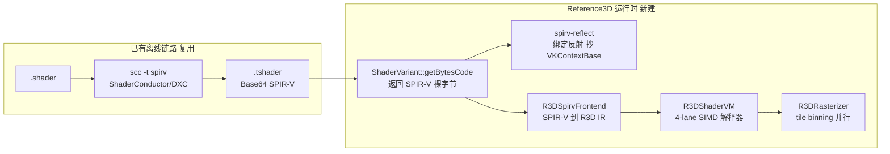
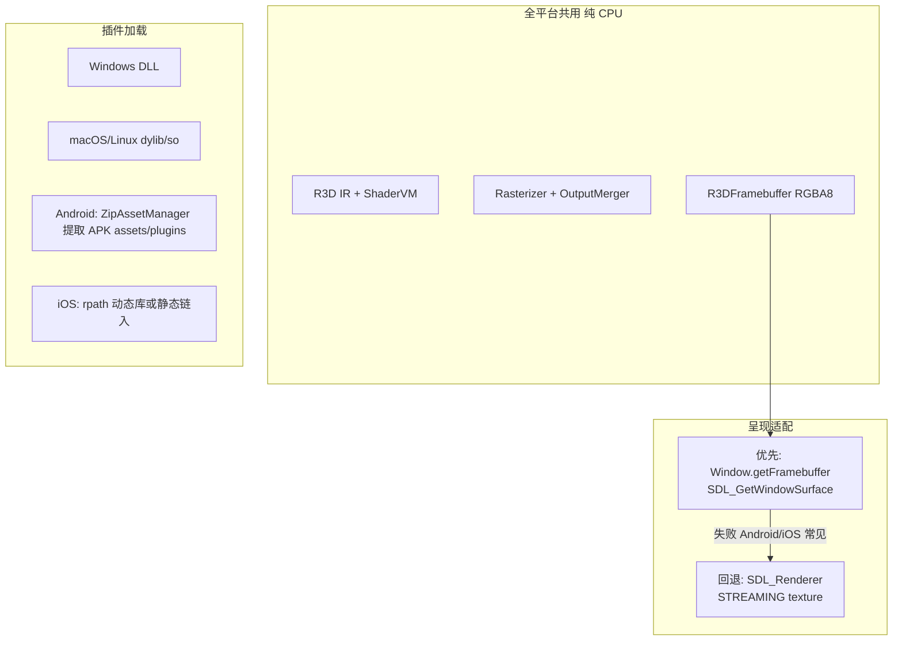
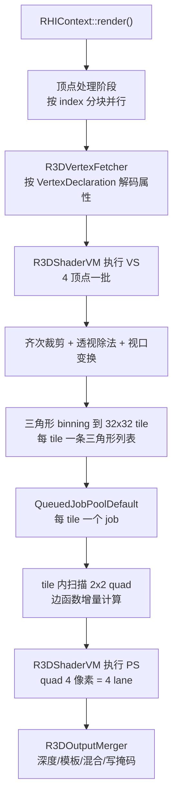

# Reference3D 软件渲染插件设计与实现方案

> 基于当前 `RHIContext` 抽象层重写 Reference3D，作为 Windows / macOS / Linux / iOS / Android 全平台软件渲染后端。
>
> - **定位**：可实际跑 Samples 的软渲染后端（playable），正确性与可交互帧率并重
> - **Shader 方案**：复用引擎已有 SPIR-V 离线编译链，运行时由 4-lane SIMD 解释器执行
> - **接口定义**：`source/Core/Include/RHI/T3DRHIContext.h`
> - **目标目录**：`source/Plugins/Renderer/Reference3D/`
> - **参考骨架**：`source/Plugins/Renderer/Null/`
> - **参考反射**：`source/Plugins/Renderer/Vulkan/Base/Source/T3DVKContextBase.cpp`

---

## 实现状态图例

| 标记 | 含义 |
|------|------|
| 📋 待实现 | 本阶段需要完整实现 |
| 🔇 按设计为空 | 首轮明确不做（HS/DS/GS/CS、MSAA 等） |
| ⚡ 需适配 | 可移植现有代码（如 Vulkan 反射）后做软渲染适配 |

---

## 1. 现状与两个核心判断

### 1.1 现有代码不可用

`source/Plugins/Renderer/Reference3D/` 的 26 个文件继承的是已从 Core 中删除的旧 `Renderer` / `HardwareBufferManager` 体系。CMake 开关 `TINY3D_BUILD_RENDERSYSTEM_R3D` 默认 `FALSE`，启用后也无法通过编译。

本方案按 **基于 `RHIContext` 重写** 处理。旧代码整体归档到 `Legacy/` 子目录，仅作光栅化算法参考。

### 1.2 Shader 问题已有现成解

- `scc` 已支持 `-t spirv`
- `dependencies/spirv-reflect/` 是源码集成，自带 `spirv.h`
- Vulkan 后端的 `compileShader` / `reflectShaderAllBindings` 已处理好 DXC 产出 SPIR-V 的全部怪癖（`type.` 前缀、combined image sampler、binding 重映射）

因此 Reference3D **直接复用 SPIR-V 作为 shader 输入格式**。只需在 `source/Core/Source/RHI/T3DRHIRenderer.cpp` 的 `getShadingLanguage()` 里把 `REFERENCE3D` 从默认 `kHLSL` 改到 `kSPIRV`，整条离线管线即可接入。



---

## 2. 插件骨架与目录结构

目录组织参考 OpenGLES3（`Base/` + 单 Runtime target），CMake 模板抄 Null Runtime，额外把 `dependencies/spirv-reflect/spirv_reflect.c` 编入目标（参考 Vulkan 插件的 `FindSpirvReflect.cmake`）。

```
Reference3D/
  Legacy/         旧 Renderer 体系源码归档（仅参考，不参与构建）
  Core/           R3DFramebuffer / R3DRasterizer / R3DSampler / R3DOutputMerger
                  R3DVertexFetcher / R3DTileScheduler / R3DFormat / R3DPresent
  Shader/         R3DSpirvFrontend / R3DIR / R3DShaderVM / R3DBuiltins / R3DReflect
  Runtime/        R3DPlugin / R3DPluginDLL / R3DRenderer / R3DContext
                  R3DRenderWindow / R3DRenderBuffer / R3DRenderState / R3DShader
  Editor/         R3DPluginEditor / R3DPluginEditorDLL（链接 T3DCoreEditor）
  Console/        R3DRendererConsole（仅桌面，供 scc 无驱动反射）
```

四件套按 Null 插件同构：

`dllStartPlugin` → `R3DPlugin::install()` → `T3D_AGENT.addRHIRenderer(R3DRenderer)` → `R3DRenderer::init()` 创建 `R3DContext`。

### 2.1 RHIContext 实现范围

必须实现 `T3DRHIContext.h` 中 **73 个纯虚函数**。

| 分组 | 首轮策略 |
|------|----------|
| Transform / RenderTarget / Viewport / Clear | 📋 完整实现 |
| Blend / DepthStencil / Rasterizer / Sampler | 📋 完整实现 |
| VertexDeclaration / VB / IB / CB / PixelBuffer | 📋 完整实现 |
| VS / PS 的 create / set / CB / Texture / Sampler | 📋 完整实现 |
| compileShader / reflect* | 📋 完整实现 |
| Draw / Blit / Copy / Write / Frame 生命周期 | 📋 完整实现 |
| Hull / Domain / Geometry / Compute（约 20 个） | 🔇 返回 `T3D_ERR_NOT_IMPLEMENTED` 并打日志 |

### 2.2 构建目标分层

对齐 Null 插件：

- **Runtime `R3DRenderer`**：全部平台都编（Windows / macOS / Linux / iOS / Android）
- **Editor `R3DRendererEditor`**：仅 `TINY3D_BUILD_EDITOR`（桌面）
- **Console `R3DRendererConsole`**：仅 `TINY3D_OS_DESKTOP`，给 `scc` 做无驱动 SPIR-V 反射

CMake 把 `source/Plugins/Renderer/CMakeLists.txt` 里的 `TINY3D_BUILD_RENDERSYSTEM_R3D` 改成与 Null 一样的全平台默认 `TRUE`，不再藏在某个 `elseif (TINY3D_OS_WINDOWS)` 分支里。

---

## 3. 全平台支持

引擎官方平台是 **Windows / macOS / Linux / iOS / Android**。Reference3D 的核心（光栅化 + SPIR-V 解释器 + spirv-reflect）是纯 C/C++，**不依赖任何 GPU API**，功能上可以全平台出图。下列缺口必须写进实现，否则移动端会编过但跑不起来。



### 3.1 呈现不能只走 `SDL_GetWindowSurface`

桌面 `T3DSDLDesktopWindow` 和移动 `T3DSDLMobileWindow` 都暴露了 `getFramebuffer()` / `updateWindow()`。但 Android/iOS 上 SDL2 窗口经常带 OpenGL ES / Metal 后端，`SDL_GetWindowSurface` 会失败。因此 `R3DPresent` 做成两级：

- **主路径**：`Window::getFramebuffer()` + 按 `SDL_GetWindowPixelFormat` 把内部 RGBA8 转成 surface 格式（Windows 常见 BGRA8888，macOS 可能是 ARGB，Android 可能是 RGB565/RGBA8888）再 `updateWindow()`
- **回退路径**：`SDL_CreateRenderer` + `SDL_CreateTexture(SDL_TEXTUREACCESS_STREAMING)` + `SDL_UpdateTexture` + `SDL_RenderCopy`
- **禁止**创建窗口时带 `SDL_WINDOW_OPENGL` / `VULKAN` / `METAL` 标志

内部始终画到 `R3DFramebuffer` 的 RGBA8，不能假设全平台都是 BGRA8888。

### 3.2 插件加载按平台走现有机制

- **桌面**：与 D3D11/GL4/Null 一样，`Agent::loadPlugin("R3DRenderer")` 从 plugins 目录 `LoadLibrary` / `dlopen`
- **Android**：走已有 ZipAssetManager，把 `libR3DRenderer.so` 放进 APK `assets/plugins/`，启动时提取到可写目录再 `dlopen`；`assets/config/Android/Tiny3D.cfg` 的 plugins 列表加入 `R3DRenderer`
- **iOS**：沿用旧 Reference3D CMake 的 `@rpath` / `INSTALL_NAME_DIR`；若工程是静态插件策略则编进主二进制，不强制动态库
- 各平台 cfg 的 `renderSettings.renderer` 在验证时改为 `"Reference3D"`（与 `RHIRenderer::REFERENCE3D` 常量名一致）

### 3.3 SIMD 必须三路，不能只写 SSE

`source/Math/Include/T3DSIMDConfig.h` 已有：

| 平台 | 宏 |
|------|-----|
| x86 / x64 | `T3D_SIMD_SSE` |
| ARM（Android / iOS / Apple Silicon macOS） | `T3D_SIMD_NEON` |
| 其余 | `T3D_SIMD_NONE` |

VM 热路径用同一套 SoA 接口，三份实现。Apple Silicon 走 NEON，不是 SSE。

### 3.4 Shader 资产与平台解耦

`scc` / ShaderConductor / DXC **只在桌面跑**。`.tshader` 里的 kSPIRV 变体是跨平台字节码，移动端运行时只解释、不交叉编译。这是全平台能成立的前提，不需要在 Android/iOS 上引入 LLVM/DXC。

### 3.5 性能预期按平台分层

软渲染在移动端比桌面慢一个数量级是物理事实，不能承诺五端同一 720p 帧率：

- **桌面**（Windows / macOS / Linux）：Samples 1280x720 可交互
- **移动**（Android / iOS）：默认可降内部渲染分辨率（例如 0.5x 再 blit 放大），工作线程 `min(4, hardware_concurrency)`，避免把 SoC 打满导致过热降频

### 3.6 字节序

SPIR-V 是小端。当前五端全是 little-endian，加载时校验 magic `0x07230203` 即可，不必做大端交换。

---

## 4. 软渲染管线设计

### 4.1 资源层：必须自持数据副本

`T3DMesh.cpp` 中静态网格用 `MemoryType::kVRAM` / `kCPUNone` 创建 VB，引擎侧 CPU 指针会被接管或释放。因此下列 RHI 对象在 `create*` 时必须从 `RenderBuffer::getBuffer().Data` **深拷贝一份**到自己内部，`writeBuffer` / `copyBuffer` 直接改写该副本：

- `R3DVertexBuffer`
- `R3DIndexBuffer`
- `R3DConstantBuffer`
- `R3DPixelBuffer1D/2D/3D/Cubemap`

`R3DPixelBuffer2D` 额外预计算 mip 链偏移表（引擎无此工具，需按 `Image::getBPP()` / `calcPitch()` 的 4 字节对齐规则自行计算），供采样器 O(1) 定位。

### 4.2 光栅化：tile binning + 多线程



Tile 划分保证**同一 tile 只被一个线程写**，无需任何锁即可并行深度测试与混合。并行框架直接复用 `source/Platform/Include/Thread/T3DQueuedJobPool.h` 的 `QueuedJobPoolDefault`（Logger 已在用），不引入新依赖。`RHIThread` 与本方案无关，保持 `T3D_ENABLE_RHI_THREAD=0`。

2x2 quad 是硬性设计约束：像素着色器的隐式 LOD 需要 `ddx/ddy`，只有 quad 内做有限差分才能算出来。

工作线程数：

- 桌面：`hardware_concurrency - 1`
- 移动：`min(4, hardware_concurrency)`

### 4.3 状态对象

`R3DBlendState` / `R3DDepthStencilState` / `R3DRasterizerState` / `R3DSamplerState` 仅缓存 desc 结构体，由 `R3DOutputMerger` 与采样器逐条解释。枚举清单见 `source/Core/Include/Render/T3DRenderConstant.h`：

| 枚举 | 数量 |
|------|------|
| BlendFactor | 10 |
| BlendOperation | 5 |
| CompareFunction | 8 |
| StencilOp | 8 |
| FilterOptions | 4 |
| TextureAddressMode | 6 |

### 4.4 NDC 约定

DXC 产出的是 Vulkan 语义 SPIR-V（深度 [0,1]、y 向下）。`R3DContext` 必须 override `getDepthRemapMatrix()`，与 Vulkan 后端保持完全一致，否则深度测试与阴影贴图全错。

---

## 5. SPIR-V 执行方案

朴素的逐指令 `switch` 解释器在 playable 目标下会慢两个数量级，因此采用 **加载期一次性编译到内部 IR + 运行期宽 SIMD 解释**。

### 5.1 加载期：`R3DSpirvFrontend`

在 `compileShader` 中执行一次。从 `ShaderVariant::getBytesCode()` 拿到 SPIR-V 字节流（离线 SPIR-V 存在 `mSourceCode` 而非 `mByteCode`，`getBytesCode()` 已透明处理），用 `dependencies/spirv-reflect/include/spirv/unified1/spirv.h` 的枚举自行遍历指令流，产出 `R3DProgram`：

- **SSA id → 稠密寄存器槽**：把 `%id` 映射成连续数组下标，运行期零哈希查找
- **类型/常量表展开**：`OpTypeVector` / `OpTypeMatrix` / `OpConstantComposite` 预先解析成标量宽度与分量数
- **`OpAccessChain` 折叠**：把 cbuffer / 结构体访问链在加载期折成常量字节偏移
- **控制流结构化**：依据 `OpSelectionMerge` / `OpLoopMerge` 切基本块，生成带 merge/continue 目标的分支指令
- **opcode 归一化**：SPIR-V 稀疏 opcode → 稠密内部枚举，dispatch 表跳转
- **IO 接口表**：`OpVariable` 的 `Input` / `Output` / `Uniform` / `UniformConstant` 存储类映射到 location/binding，供 VS→PS 插值和资源绑定

绑定反射（`reflectShaderAllBindings` / `reflectSamplerBindings`）**直接移植** `T3DVKContextBase.cpp` 中的实现，包括：

- 去掉 `type.` 前缀
- combined image sampler 处理
- `SpvReflectTypeDescription` → `ShaderConstantParam::DATA_TYPE` 映射

### 5.2 运行期：`R3DShaderVM`

- **寄存器文件布局 SoA**：每个虚拟寄存器是 `float[4 component][4 lane]`，一条指令同时算 4 个像素（或 4 个顶点）
- **执行掩码栈**：结构化控制流下用 exec mask 处理 lane 分歧，在 merge block 汇合；`OpKill`（discard）只清对应 lane 的 mask
- **内建函数**：GLSL.std.450 常用子集（`Normalize` `Dot` `Pow` `Sqrt` `InverseSqrt` `FClamp` `FMix` `Cross` `Reflect` `SmoothStep` `FAbs` `Length` 等）
- **图像指令**：`OpImageSampleImplicitLod` / `ExplicitLod` / `DrefImplicitLod`（阴影比较采样）转发给 `R3DSampler`；隐式 LOD 由 quad 内 UV 差分算出

实现顺序：Phase 3 先做标量正确性版本打通出图，Phase 5 再 SIMD 宽化，避免正确性与性能问题耦合排查。

### 5.3 Shader 资产链路配套改动

- `T3DRHIRenderer.cpp` `getShadingLanguage()`：`REFERENCE3D` → `kSPIRV`
- `source/Editor/TinyEditor/ProjectManager.cpp` 的 targetLang 硬编码改为查询 `getShadingLanguage()`
- 资产重编译：`assets/samples/meshes/Tiny3DStandard.tshader` 当前**只有 kHLSL 变体**，需用 `scc -t hlsl,glsl,essl,spirv` 重出；`Skybox-Cubemap` / `Default-Material` / `Test-Material` 已含 kSPIRV，可直接用于早期验证
- `scc` 反射上下文：`-t spirv` 时会去加载 `VKRendererConsole`，需提供 `R3DRendererConsole` 作为无 Vulkan 驱动环境下的替代（Reference3D 的 SPIR-V 反射不依赖任何驱动，也解决 CI 上编译 shader 的问题）

---

## 6. 分阶段实施

### Phase 0 — 骨架

- 归档旧代码到 `Legacy/`
- 按 Null 同构建立 Runtime（全平台）+ Editor/Console（仅桌面）
- CMake 全平台打开 `TINY3D_BUILD_RENDERSYSTEM_R3D`
- 73 个 `RHIContext` 纯虚桩（HS/DS/GS/CS 返回未实现）
- 验收：Windows 加载插件、窗口可创建、`swapBuffers` 出黑屏

### Phase 1 — 资源、基础光栅化、跨平台呈现

- `R3DFramebuffer`（color / depth / stencil）
- Buffer 深拷贝自持数据 + mip 偏移表
- `clearColor` / `clearDepth` / `setViewport` / `setScissorRect`
- `R3DVertexFetcher` 按 `VertexDeclaration` 解码顶点
- 单线程标量三角形光栅化（固定颜色输出）
- `R3DPresent` 主路径 + SDL_Renderer 回退；按窗口像素格式转换
- 窗口创建禁止 OPENGL / VULKAN / METAL 标志
- 验收：能画出实心三角形并正确呈现到窗口

### Phase 2 — SPIR-V 前端

- `R3DSpirvFrontend` 解析 SPIR-V 到 R3D IR
- 移植 `VKContextBase` 的 `reflectShaderAllBindings` / `reflectSamplerBindings`
- `R3DContext::compileShader` 接入

### Phase 3 — 标量解释器打通全链路

- `R3DShaderVM` 标量版本（先不做 SIMD）执行 VS 与 PS
- 执行掩码栈、GLSL.std.450 常用内建、`R3DSampler` 与 quad 差分 LOD
- override `getDepthRemapMatrix` 对齐 Vulkan NDC
- 验收：已含 kSPIRV 变体的 `Skybox-Cubemap` / `Default-Material` 正确出图

### Phase 4 — 完整管线状态

- 齐次裁剪、背面剔除、fill mode
- 深度/模板测试全部比较函数与操作
- 完整 blend factor / op / 写掩码、MRT
- render texture 与 blit / copyBuffer / writeBuffer
- 阴影比较采样
- 验收：跑通 `ForwardRenderPipeline` 的 shadow map 路径

### Phase 5 — 性能优化

- VM 宽化为 4-lane SoA（SSE / NEON / 标量三份）
- 三角形 tile binning（32x32）
- 基于 `QueuedJobPoolDefault` 的按 tile 多线程并行
- 顶点处理阶段分块并行
- 边函数增量与采样器热路径优化
- 验收：桌面 720p 可交互；移动端以降分辨率后可交互为准

### Phase 6 — 资产与全平台集成

- `getShadingLanguage()` → `kSPIRV`
- 各平台 `Tiny3D.cfg` 加入 `R3DRenderer`
- Android 走 ZipAssetManager 提取 `.so`
- iOS 处理 rpath / 静态链接
- 桌面提供 `R3DRendererConsole` 给 `scc`
- `scc` 重编译补齐 kSPIRV 变体
- 桌面 CI golden image 回归

---

## 7. 验证策略

- **早期验收**：`Skybox-Cubemap` / `Default-Material` 能正确出图（先 Windows，再 macOS/Linux，最后 Android/iOS）
- **正确性回归**：桌面 CI 上同一场景 D3D11 或 GL4 vs Reference3D，按 PSNR 阈值比对 golden image（移动端不做像素 CI，只做启动 + 出图冒烟）
- **性能目标**：桌面 1280x720 可交互；移动端以降分辨率后可交互为准

---

## 8. 范围与风险

### 8.1 首轮不做

- Geometry / Hull / Domain / Compute shader
- MSAA
- 间接绘制
- Cubemap 以外的纹理数组
- SPIR-V 的非结构化控制流（DXC 正常输出均为结构化，遇到则报错）

### 8.2 主要风险

- SPIR-V 解释器是本方案 60% 以上工作量与全部技术不确定性所在；Phase 2/3 先标量打通出图，再 SIMD 宽化
- Android/iOS 上 `SDL_GetWindowSurface` 可能不可用，必须有 SDL_Renderer 回退，否则「全平台」只剩桌面
- 移动端 playable 依赖降分辨率，不把桌面 720p 帧率指标直接套到手机
