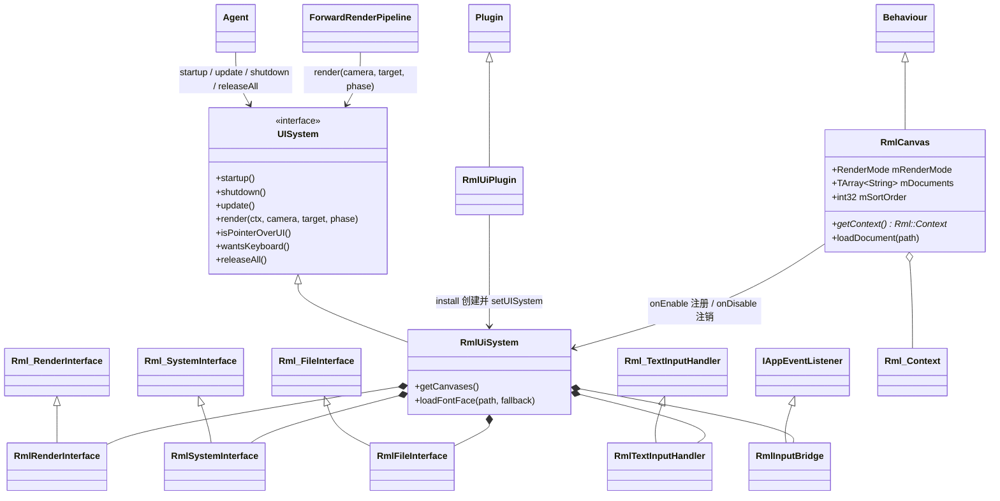
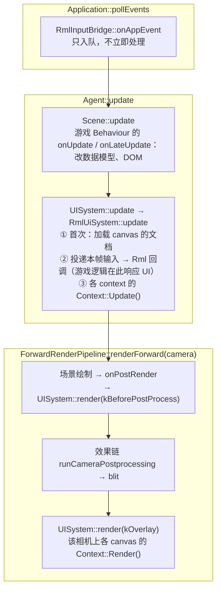

# RmlUi 运行时 UI 接入设计与分步计划

> 目标：以 [RmlUi](https://github.com/mikke89/RmlUi)（HTML/CSS 风格的 C++ UI 库）作为 Tiny3D 的**运行时 UI 系统**，覆盖 Windows（D3D11 / GL4 / Vulkan）与 Android（GLES3 / Vulkan），在编辑器 GameView 与独立运行时表现一致。
>
> 选型结论：**UI 内核（布局 / 样式 / 文本 / 控件 / 事件 / 数据绑定）全部交给 RmlUi；引擎只负责四件事 —— 渲染接口、文件接口、系统与输入接口、把 UI 挂到相机上的组件。**
>
> 与引擎的接入方式：`T3DRmlUi` 实现 Core 的运行时 UI 接口 `UISystem`，Core 在启动、每帧更新、相机绘制、关闭等时机直接调用该接口。接口本身的定义、调用点与实现约定见 [`UI-System-Interface-Design-todo.md`](UI-System-Interface-Design-todo.md)（下称「UI 接口文档」），本文只写 RmlUi 这一侧。
>
> 本文档为施工蓝图，代码片段均以「建议实现」形式给出并标注现有参考位置，不代表已落地。基线版本：**RmlUi 6.3（2026-08-22 发布）**。

---

## 0. 与自研方案文档的关系

[`Runtime-UI-System-Design-todo.md`](Runtime-UI-System-Design-todo.md) 是此前的自研方案（`RectTransform` / `UICanvas` / `stb_truetype` …）。本文档**取代其中所有 UI 本体部分**（§4–§9、§12 Phase 0b 之后）。

该文档里与 UI 无关、本身就是管线缺陷修复的两项仍然有效，可独立推进，但**不再是本方案的前置条件**（理由见 §3.3）：

| 项 | 原文位置 | 本方案下的地位 |
|----|---------|---------------|
| 队列派发重构（`kBuiltinQueueSkybox`、`Geometry+100` 偏移解析、阶段表归并） | §3.3 | 独立管线改进，与 UI 解耦 |
| 队列内排序（`RenderGroup` 拍平、透明队列 back-to-front） | §3.4 | 独立管线改进，与 UI 解耦 |

---

## 1. 背景与目标

### 1.1 为什么改选 RmlUi

自研方案里最贵、且引擎当前完全为零的三块，RmlUi 都已成熟实现：

| 能力 | 引擎现状 | RmlUi 6.3 |
|------|---------|-----------|
| 文本 | 无任何文本渲染；`FindFreetype.cmake` 存在但无使用者 | FreeType 光栅化 + 字形图集 + 字体回退 + `@font-face`；可选 HarfBuzz 整形 |
| 布局 | 无 | Block / Inline / Flexbox / Table / 绝对定位 / 滚动容器 |
| 控件与事件 | 无 | 表单控件（input / textarea / select / range / checkbox）、焦点、冒泡、拖拽、手柄 / 键盘导航、**原生触控与惯性滚动（6.2）**、**IME（6.3）** |
| 样式 | 无 | RCSS：选择器、伪类、过渡、动画、变换、渐变、滤镜、box-shadow、**CSS 变量（6.3）**、媒体查询 |
| 数据驱动 | 无 | MVVM 数据绑定（`data-model` / `data-for` / `data-if` …），无需脚本层 |
| 调试 | 无 | 内建 Debugger（元素树、样式、数据模型查看） |

许可证 MIT；要求 C++17（与引擎 `source/CMakeLists.txt:153-154` 一致）；唯一必需外部依赖是 FreeType，且可整体替换为自定义字体引擎（`RMLUI_FONT_ENGINE=none`）。

### 1.2 本期目标（Phase 0–4）

1. RmlUi + FreeType **源码编入**，Windows / Android 同一套 CMake 构建。
2. `RmlRenderInterface`：基于引擎 RHI，覆盖 D3D11 / GL4 / GLES3 / Vulkan；先做必需接口，再做 transform 与 clip mask。
3. `RmlFileInterface`：所有 `.rml` / `.rcss` / 字体 / 图片走引擎 `Archive`，桌面目录、Android APK、Bundle 三种来源透明。
4. `RmlSystemInterface` + 输入桥：时间、日志、剪贴板、光标、软键盘 / IME；`AppEvent` → `Rml::Context::ProcessXxx`。
5. `RmlUiSystem` 实现 `UISystem` 接口；`RmlCanvas` 组件挂在 Camera 所在 GameObject 上，持有一个 `Rml::Context`，默认**在相机后处理之后绘制**（屏幕空间 Overlay 语义）。
6. 编辑器：Add Component 可添加、GameView 正确显示与交互、Inspector 可编辑属性；Play 模式外静态预览。
7. `source/Samples/RmlUiApp/` 分阶段验收样例，含 Android 工程。

### 1.3 本期边界（暂不实现）

- **高级渲染特性**：layer 栈、滤镜（blur / drop-shadow / color-matrix / mask-image）、渐变 shader、`box-shadow`。接口有默认空实现，不实现时这些 RCSS 特性静默不生效，排 Phase 5。
- **世界空间 UI**（UI 贴到 3D 物体上）：基础设施（`RenderTexture` 可采样）已在，排 Phase 6。
- **Lua 绑定**：引擎脚本语言是 TypeScript + V8，不引入 Lua。官方 Lua 插件关闭，TS 绑定按 §9 自研，排在 V8 脚本系统落地之后（Phase S1–S2）。
- **SVG / Lottie 插件**：额外依赖 lunasvg / rlottie，本期关闭。
- **可视化 UI 编辑器**：`.rml` / `.rcss` 用外部文本编辑器编写，本期只做文件改动后的热重载（Phase 4）。
- **HarfBuzz 复杂文字整形**（阿拉伯 / 印度系）：中英日韩不需要。

---

## 2. RmlUi 侧：需要引擎实现的接口

基于 RmlUi 6.3 头文件（`Include/RmlUi/Core/*.h`）整理。

### 2.1 `Rml::RenderInterface`

| 分组 | 函数 | 本期 |
|------|------|------|
| **必需** | `CompileGeometry(Span<const Vertex>, Span<const int>)` → handle | Phase 1 |
| | `RenderGeometry(handle, Vector2f translation, TextureHandle)` | Phase 1 |
| | `ReleaseGeometry(handle)` | Phase 1 |
| | `LoadTexture(Vector2i &dims, const String &source)` | Phase 1 |
| | `GenerateTexture(Span<const byte> rgbaPremultiplied, Vector2i dims)` | Phase 1（字形图集走这里） |
| | `ReleaseTexture(handle)` | Phase 1 |
| | `EnableScissorRegion(bool)` / `SetScissorRegion(Rectanglei)` | Phase 1 |
| **可选** | `SetTransform(const Matrix4f *)` | Phase 2 |
| | `EnableClipMask(bool)` / `RenderToClipMask(op, geometry, translation)` | Phase 2（stencil） |
| | `PushLayer` / `CompositeLayers` / `PopLayer` / `SaveLayerAsTexture` / `SaveLayerAsMaskImage` | Phase 5 |
| | `CompileFilter` / `ReleaseFilter` / `CompileShader` / `RenderShader` / `ReleaseShader` | Phase 5 |

关键约定（来自头文件注释，直接决定实现方式）：

- **顶点格式**：`Vertex { Vector2f position; ColourbPremultiplied colour; Vector2f tex_coord; }`，20 字节，**颜色为预乘 alpha 的 RGBA8**。索引是 `int`（32 位）。
- **生命周期**：`CompileGeometry` 传入的顶点 / 索引数据在 `ReleaseGeometry` 之前保证有效且不变 —— 可以一次性上传成静态缓冲，不必每帧重传。
- **纹理**：`GenerateTexture` 输入是 RGBA8 **预乘 alpha**；`LoadTexture` 加载的图片也应由渲染器自行预乘（官方 GL3 后端即如此）。
- **Scissor**：`SetScissorRegion` 给的是**窗口坐标，左上原点**，不受 transform 影响。
- **Transform**：`nullptr` 表示单位矩阵；只作用于带 geometry handle 的绘制函数。

### 2.2 `Rml::SystemInterface`

| 函数 | 引擎映射 |
|------|---------|
| `GetElapsedTime()` | `T3D_TIME` 的非缩放累计时间（`T3DTime.h`），换算成秒 |
| `LogMessage(type, msg)` | `T3D_LOG_ERROR/WARNING/INFO/DEBUG(LOG_TAG_RMLUI, ...)` |
| `TranslateString` | 本期直通；本地化系统接入点 |
| `JoinPath` | 默认实现即可（相对路径以文档所在目录为基准） |
| `SetMouseCursor(name)` | **需补平台 API**（§6.4） |
| `SetClipboardText` / `GetClipboardText` | **需补平台 API**（§6.4） |
| `ActivateKeyboard(caretPos, lineHeight)` / `DeactivateKeyboard()` | **需补平台 API**：Android 弹出 / 收起软键盘（§6.4） |

### 2.3 `Rml::FileInterface`

`Open / Close / Read / Seek / Tell / Length / LoadFile`。见 §5。

### 2.4 `Rml::TextInputHandler` / `Rml::TextInputContext`（IME）

`TextInputHandler::OnActivate / OnDeactivate / OnDestroy` 收到输入框激活通知；`TextInputContext` 提供 `GetBoundingBox`、`SetCompositionRange`、`SetText`、`CommitComposition` 等方法，用于把 IME 组字串写回输入框。6.3 的 SDL 后端已有完整 IME 实现（PR #928），可作为对照。见 §6.3。

### 2.5 `Rml::Context` 输入与驱动

| 方法 | 用途 |
|------|------|
| `ProcessMouseMove / ProcessMouseButtonDown / Up / ProcessMouseWheel / ProcessMouseLeave` | 鼠标 |
| `ProcessTouchStart / Move / End / Cancel`（6.2 新增） | 触控 + 惯性滚动 |
| `ProcessKeyDown / Up(KeyIdentifier, modifiers)` | 键盘 |
| `ProcessTextInput(String)` | 已提交的文本 |
| `SetDimensions(Vector2i)` / `SetDensityIndependentPixelRatio(float)` | 尺寸与 DPI |
| `Update()` / `Render()` | 每帧驱动 |
| `IsMouseInteracting()` | 指针是否落在 UI 上（游戏侧据此屏蔽点击穿透） |

---

## 3. 现状分析：引擎侧的接入面

### 3.1 已就绪的基础设施

| 环节 | 现状 | 结论 |
|------|------|------|
| 2D 批渲染范例 | [`ImGuiImplTiny3D.cpp`](../../source/Editor/ImGuiImpl/ImGuiTiny3D/Source/ImGuiImplTiny3D.cpp) 完全基于 RHI：渲染状态 `:349-391`、纹理 `:395-421`、正交投影与常量缓冲 `:557-575`、顶点声明 `:580-608`、逐 cmd scissor / 绑纹理 / 子范围 `ctx->render` `:787-813` | 调用序列照抄 |
| RHI 能力 | `setScissorRect`（左上原点）、`render(indexCount, startIndex, baseVertex)`、stencil（`StencilOp` 全集，`T3DDepthStencilState.h:63-100`）、混合因子含 `kOne`（可做预乘） | 必需接口 + clip mask 所需能力齐全 |
| 纹理创建 | `T3D_RENDER_BUFFER_MGR.loadPixelBuffer2D(desc, ...)`；`E_PF_R8G8B8A8` 可用 | 直接可用 |
| 图片解码 | `ImageCodec::decode(uint8_t *data, size_t size, Image &)`（`T3DImageCodec.h:121`）；Windows / Android 配置都加载 `FreeImageCodec` | `LoadTexture` 直接用 |
| 文件读取 | `Archive::read(name, ArchiveReadCallback, userData)`（`T3DArchive.h:119`），回调里拿到 `DataStream` | 适配成 `FileInterface` |
| 平台事件 | `SDLApplication::pollEvents` 把 `SDL_Event` 原样 memcpy 成 `AppEvent` 广播给 `IAppEventListener`（`T3DSDLApplication.cpp:117-123`）；`APP_TEXTINPUT / APP_TEXTEDITING` 已定义（`T3DAppEvents.h:77-79, 253-288`） | 文本 / IME 事件能收到 |
| 键码 | `T3DAppKeyboard.h` 的 `KeyCode` / `ScanCode` 是 SDL 风格 | 可移植 RmlUi SDL 后端的键码转换表 |
| DPI | `DeviceInfo::getScreenDPI()`（`T3DDeviceInfo.h:107`），Android / Windows / OSX 均有实现 | 换算 dp-ratio |
| 相机钩子 | `CameraBehaviour::onPreRender / onPostRender`（`T3DCameraBehaviour.h:60-67`） | 插入点都在后处理之前（§3.2），改由 Core 的 `UISystem::render` 接入 |
| 反射 | `tiny3d_enable_reflection(TARGET ...)`（`source/CMake/Utils/Tiny3DReflectHelpers.cmake:161`），独立模块可接入 rpp | 新组件可反射、可序列化、可 Add Component |
| 插件生命周期 | `Plugin::install / startup / shutdown / uninstall`（`T3DPlugin.h:53-71`），由 `Tiny3D.cfg` 的 `plugins` 列表驱动 | 只用于向 Agent 注册 / 注销 `UISystem` 实现（§4.1） |
| Bundle 打包 | `BundleBuilder` 把 `kFile / kTxt / kBin` 原样拷贝并记录 path → UUID（`T3DBundleBuilderApp.cpp:634-644`）；`BundleFSArchive::read(name)` 按 manifest 路径查 UUID（`T3DBundleFSArchive.cpp:158-170`） | `.rml` 等纯文本 / 二进制资源按路径可读 |

### 3.2 关键约束一：UI 必须画在后处理之后

`renderForward` 的流程（[`T3DForwardRenderPipeline.cpp:493-603`](../../source/Core/Source/Render/T3DForwardRenderPipeline.cpp)）：

```cpp
        drawCameraQueue(ctx, camera, cameraWorldPos, drawSkybox, skyboxMaterial, rasterizerOverride);   // :555
        // ...
        ctx->endPass();                                                  // :564
        invokeCameraBehaviours(ctx, camera, false);                      // :566  onPostRender
        // ...
        if (srcColor != nullptr && finalColor != srcColor)
        {
            result = runCameraPostprocessing(ctx, camera, srcColor);     // :577  效果链
        }
        if (result != nullptr && finalColor != result)
        {
            ctx->blit(result, camera->getRenderTarget(), offset, box, offset);   // :591
        }
        ctx->reset();                                                    // :595
```

现有两个钩子都在效果链**之前**：`onPostRender`（`:566`）以及旧方案设想的 Overlay(4000) 队列槽位。UI 若在这两处绘制，会被 Bloom / 色调映射 / 颜色分级再处理一遍，与 Unity「Screen Space - Overlay」语义不符，文字也会被 tonemap 压暗、被 bloom 晕开。

> **Overlay 队列本身没有设计问题，后处理也没有。** `kBuiltinQueueOverlay` 是场景队列，语义对齐 Unity：用于镜头光晕这类「场景内最后绘制」的覆盖效果，本就应该经过后处理。Unity 的 UI 同样不在这个队列：`UI/Default` 标的是 `Queue = Transparent`，Screen Space - Overlay 的 Canvas 由 UI 系统在相机渲染之后单独绘制。旧方案把 4000 当成 UI 槽位，是被该常量原注释「UI 与覆盖层」误导（注释已修正）。
>
> 也不应把 4000 及以上的队列挪到效果链之后：最终目标上没有场景深度（深度留在 `srcRT`，blit 不拷贝）、颜色已从线性 HDR 变为 tonemap 后的 LDR、MSAA 已 resolve，场景材质在那里绘制会全部出错。所以「场景内覆盖效果走 Overlay 队列、屏幕空间 UI 走独立的后处理后绘制点」是两件事，引擎缺的是后者。

`Application::onRender`（`T3DApplication.h:114-123`）虽然在整条管线之后，但它是应用级回调：拿不到「哪台相机、它的最终 RT 是什么」，也不归场景组件所有，编辑器 GameView 需要的「随相机走」语义表达不了。

**结论**：管线在两个时机调用 Core 的 `UISystem::render(ctx, camera, target, phase)`（UI 接口文档 §3、§4）：

| 阶段 | 调用位置 | 对应 Unity |
|------|---------|-----------|
| `UIRenderPhase::kOverlay`（默认） | blit（`:591`）之后、`ctx->reset()`（`:595`）之前，目标为相机最终目标 | Screen Space - Overlay |
| `UIRenderPhase::kBeforePostProcess` | `onPostRender`（`:566`）之后，目标为相机源目标 | Screen Space - Camera，希望 UI 也吃 bloom 时使用 |

Core 只认识接口，不知道 RmlUi 的存在。

### 3.3 关键约束二：不走 `Renderable` / 渲染队列

旧方案 §2.2 列出了 UI 不能走 `addRenderable` 的三个卡点（多材质按指针排序、只能整 IB 画完、无 scissor）。RmlUi 的模型是**立即提交**：`Context::Render()` 期间按绘制顺序逐个回调 `RenderGeometry`、`SetScissorRegion`、`SetTransform`，顺序、裁剪和状态全部由库决定。所以渲染接口在钩子里直接对 RHI 发命令即可，完全绕开队列。

由此，旧方案的两项管线重构（队列阶段表、队列内排序）**不再是 UI 的前置条件**（§0）。

### 3.4 关键约束三：GL 渲染到纹理时的 scissor 翻转不一致

GL4 / GLES3 在渲染到 FBO 时会把投影矩阵上下翻转，让纹理内容与 D3D 约定一致：

```cpp
// T3DGLES3Context.cpp:262-270（GL4 同构，T3DGL4Context.cpp:517-525）
        if (mRenderingToFBO)
        {
            mProjMatrix = flipYMat * projMat;
            mProjectionFlipped = true;
        }
```

但 `setScissorRect` **无论是否渲染到 FBO**，都执行「左上原点 → GL 左下原点」的翻转（`T3DGLES3Context.cpp:858-910`，`:880` 为 `glY = fbHeight - (y + height)`；GL4 `T3DGL4Context.cpp:1118-1140` 同构）。

推演：投影已翻转时，逻辑坐标 y=0（顶部）落到 NDC y=-1，也就是 GL 帧缓冲的第 0 行（底部）。逻辑矩形 `(x, y, w, h)` 在 GL 帧缓冲坐标里就是 `(x, y, w, h)` 本身，不该再翻。现状会把裁剪区域上下颠倒。

ImGui 只画到窗口（`ImGuiImplTiny3D.cpp:249-253` 绑的是 `RenderTarget::create(mRenderWindow)`），所以从未暴露。RmlUi 会画进相机 RT —— 编辑器 GameView 一定是 RT（`EditorSceneImpl.cpp:384-388`），带后处理的运行时相机也是 —— **GL 后端必然踩中**。

**结论**：Phase 1 修复 GL4 / GLES3 的 `setScissorRect`：`mRenderingToFBO` 时不翻转。同时核对 `setViewport` 是否有相同问题（见 §12 待确认项）。D3D11 / Vulkan 都是左上原点，不受影响。

### 3.5 关键约束四：着色器必须走 ShaderLab 多后端变体

`ImGuiImplTiny3D` 用内联 shader 字符串，只有 **HLSL** 与 **GLSL 330** 两份（`:294-305`，其余渲染器一律落到 GLSL 330）。它能这样做，是因为 ImGui 只服务桌面编辑器 —— `source/External/CMakeLists.txt:19-21` 只在 `TINY3D_OS_DESKTOP` 下编 imgui。

RmlUi 要跑 Android GLES3 和 Vulkan，内联 GLSL 330 在这两个后端都不可用。

**结论**：RmlUi 用到的 shader 全部写成 ShaderLab，编译成多语言 `.tshader` 容器（HLSL / GLSL / ESSL / SPIR-V 变体并存，运行时按当前渲染器选取），按 UUID 加载。多语言容器机制已由 [`Shader-MultiBackend-Variant-Design-todo.md`](Shader-MultiBackend-Variant-Design-todo.md) 落地，scc 支持 `hlsl / glsl / essl / spirv / msl` 多目标（`T3DShaderCompiler.cpp:268-284`）。

> **注意**：`BuiltinGenerator` 当前调用 scc 时只传了 `-t hlsl`（`T3DBuiltinShaders.cpp:134-140`），内置 shader 很可能只有 HLSL 变体。两条路二选一（§12 第 10 项）：
> 1. 让 `BuiltinGenerator` 传全部目标语言，内置 shader 直接成为多语言容器；
> 2. RmlUi 的 shader 作为普通 ShaderLab 资产（`.tshaderlab`，`Meta::kShaderLab`）放在 `assets/` 下，由 `BundleBuilder` 的 ShaderLab 编译分支（`T3DBundleBuilderApp.cpp:357`）生成多语言 `.tshader`。
>
> 倾向第 1 条：天空盒等其它内置 shader 上 Android 同样需要它。

### 3.6 关键约束五：引擎关闭顺序

`Agent::~Agent`（`T3DAgent.cpp:102-248`）的拆除顺序：

| 行 | 动作 |
|----|------|
| `:123-126` | `mActiveRHIRenderer->destroy()` |
| `:156-175` | 卸载场景、销毁全部组件 / GameObject |
| `:219-220` | `mRenderStateMgr = nullptr; mRenderBufferMgr = nullptr;` |
| `:248` | `unloadPlugins()` → 各插件 `shutdown()` / `uninstall()` |

RmlUi 的字体图集纹理、文档缓存是**全局**的，`Rml::Shutdown()` 时才会回调 `ReleaseTexture`。若把 `Rml::Shutdown()` 放进插件 `shutdown()`，那时 RHI 和渲染资源管理器都已销毁。

**结论**：`~Agent` 最开始（`stopRenderThread()` 之前）直接调用 `UISystem::shutdown()`（UI 接口文档 §4），`RmlUiSystem::shutdown()` 在其中销毁所有 context 并执行 `Rml::Shutdown()`，此时 RHI 仍然有效。`RmlCanvas` 组件随场景在 `:156-175` 销毁，晚于 `shutdown()`，所以它的 `onDestroy` 要先检查系统是否已关闭：已关闭时 context 早已不存在，只做注销。

### 3.7 其它需要注意的现状

- **编辑器输入坐标未映射到 GameView**：`Input` 直接存窗口坐标（`T3DInput.cpp:487, 501`），编辑器里窗口是整个编辑器主窗口，GameView 只是其中一块 ImGui 区域。现有 `Input::getMousePosition` 在 Play 模式下给的就是编辑器窗口坐标（从代码看未做映射）。RmlUi 需要的是 GameView RT 内的像素坐标，必须补一层映射（§6.2）。
- **编辑器输入门控**：仅 Play 模式、焦点在 `Game` / `GameView` 窗口、且 ImGui 不在文本输入时，`Input::setEnabled(true)`（`EditorApp.cpp:879-897`）。RmlUi 输入桥复用 `T3D_INPUT.isEnabled()`（`T3DInput.h:100`）作为同一道门。
- **RHI 线程**：`T3D_ENABLE_RHI_THREAD` 默认 0（`T3DConfig.h:42-45`），但架构支持命令入队、在 RHI 线程执行。渲染接口只能通过 `RHIContext` / 资源管理器发命令，不得缓存原生句柄；释放资源靠丢弃智能指针，交给资源管理器的 `GC()`（`T3DAgent.cpp:735-736`）。
- **Vulkan 的 pass 约束**：绘制必须包在 `beginPass / endPass` 内。`UISystem::render` 进入时上一个 pass 已结束，RmlUi 绘制前要自己 `setRenderTarget + beginPass`（不清屏），结束后 `endPass`（UI 接口文档 §6）。
- **Android 插件形态**：Android 上渲染器、档案等插件都是 `SHARED`，`.so` 被拷进 `app/libs/<ABI>`（`HelloApp/CMakeLists.txt:122-127`）。RmlUi 相关库按同一方式部署。
- **`PixelBuffer2DDesc` 必须堆分配**：`PixelBufferT` 内部保存 desc 指针，栈上的 desc 会悬空（`ImGuiImplTiny3D.cpp:403-405` 注释）。

---

## 4. 总体架构

### 4.1 模块形态

```
source/External/freetype/          FreeType 2.13.x 源码，静态库，仅被 RmlUi 链接
source/External/RmlUi/             RmlUi 6.3 源码，SHARED（rmlui），导出 Rml:: 符号
source/Plugins/RmlUi/                      引擎适配层 T3DRmlUi，SHARED
├── Include/  T3DRmlXxx.h
├── Source/   T3DRmlXxx.cpp
└── Script/   TS / V8 绑定，仅开启脚本系统时编译（§9.3）
```

`T3DRmlUi` 同时承担两种身份：

| 身份 | 用途 |
|------|------|
| **被加载的插件** | 导出 `dllStartPlugin / dllStopPlugin`，在 `Tiny3D.cfg` 的 `plugins` 里登记。`install` 时创建 `RmlUiSystem` 并 `T3D_AGENT.setUISystem(...)` 注册，`uninstall` 时注销。引擎、编辑器、Player 只通过 Core 的 `UISystem` 接口与它交互，**无需链接** |
| **被链接的库** | 用 C++ 写 UI 逻辑的游戏代码 / GamePlugin 链接它，拿到 `RmlCanvas` 的 C++ API，并直接使用 `Rml::` API（数据模型、事件监听、DOM 操作） |

同一个 DLL 既被链接又被 `DylibManager` 加载，操作系统返回的是同一模块句柄，不会重复初始化。

不放进 Core 的理由：RmlUi + FreeType 是可选的第三方依赖（Android 包体约增加 2–3 MB），不用 UI 的应用不应被迫携带；Core 只依赖 `UISystem` 抽象接口，耦合面很小。

不做纯插件（只按配置加载、不被链接）的理由：C++ 用户必须直接调用 `Rml::` API 做数据绑定和事件处理，纯插件拿不到这些符号。TS 用户不直接接触 `Rml::` 符号，走 §9 的脚本绑定。

**Core 侧的接入设施**全部定义在 UI 接口文档中：`UISystem` 接口与 `UIRenderPhase`（§3）、`Agent::setUISystem / getUISystem`（§3）、Core 各调用点（§4）、实现约定（§6）。本文不再重复。

### 4.2 类结构



| 类 | 职责 |
|----|------|
| `RmlUiPlugin` | 插件入口。`install()`：创建 `RmlUiSystem` 并 `T3D_AGENT.setUISystem`；`uninstall()`：`setUISystem(nullptr)` 并释放 |
| `RmlUiSystem` | 实现 `UISystem`。`startup()`：安装四个 Rml 接口、`Rml::Initialise()`、注册输入桥、加载默认字体；`update()`：加载待加载文档、投递输入、`Context::Update()`；`render()`：按相机与阶段绘制 canvas；`shutdown()`：销毁全部 context、`Rml::Shutdown()`、释放 GPU 资源；`releaseAll()`：销毁全部 context 与文档缓存（§11 第 3 条）。同时维护 canvas 列表 |
| `RmlRenderInterface` | §7 |
| `RmlFileInterface` | §5 |
| `RmlSystemInterface` | §6.4 |
| `RmlTextInputHandler` | §6.3 |
| `RmlInputBridge` | §6.1–6.2：`AppEvent` → 事件队列 → 在 `RmlUiSystem::update()` 中投递给目标 canvas 的 `Rml::Context` |
| `RmlCanvas` | 组件。一个 canvas 对应一个 `Rml::Context`；保存文档列表、渲染模式、排序、DPI 等配置。驱动与绘制全部由 `RmlUiSystem` 完成，组件本身不参与帧更新 |

### 4.3 帧内流程



设计要点：

- **输入入队、在 `UISystem::update` 投递**：`pollEvents` 发生在 `update()` 之前（`T3DAgent.cpp:666-669`）。若在监听器里直接 `ProcessMouseButtonDown`，UI 回调就跑在场景 `onStart` 刷新和固定步长更新之前，回调里访问的组件状态可能还没就绪。改为入队，由 `UISystem::update` 在 `Scene::update` 之后统一投递。
- **回调与 `Update()` 都在更新阶段**：UI 回调里改的数据和本帧游戏逻辑改的数据，都在随后的 `Context::Update()` 中一次性刷新到布局。`render` 只调用 `Context::Render()`，渲染阶段不运行任何游戏代码或脚本（UI 接口文档 §6）。
- **画进相机目标**：编辑器 GameView（RT）与运行时窗口走同一条路径，无需特殊分支。编辑器 Scene View 的编辑器相机不挂 `RmlCanvas`，`render` 对它直接返回。

### 4.4 坐标系与尺寸

| 项 | 约定 |
|----|------|
| Context 尺寸 | 相机最终目标尺寸 × viewport 比例（`Viewport` 是归一化值），即物理像素 |
| dp-ratio | `RmlCanvas::mDpRatio > 0` 时用它；否则自动：Android `getScreenDPI() / 160`，桌面 `getScreenDPI() / 96` |
| RCSS 单位 | 作者写 `dp`，物理像素 = dp × dp-ratio；写 `px` 则为物理像素 |
| 原点 | 左上，y 向下（与 RmlUi、`setScissorRect`、`AppEvent` 一致） |
| 投影 | 由 `ctx->setViewProjectionTransform(Identity, ortho(0, W, H, 0))` 设置，取 `ctx->getProjViewMatrix()` —— **让后端自己处理 FBO 翻转**，UI 代码不写任何平台分支 |

窗口 resize（`APP_WINDOWEVENT_RESIZED`）或 RT 尺寸变化时，`RmlUiSystem::update` 在 `Context::Update()` 之前检测到相机目标尺寸差异，调用 `SetDimensions`。

---

## 5. 文件接口

### 5.1 实现

`Archive::read` 是回调式的，`DataStream` 只在回调内有效（`T3DArchive.h:43, 119`）。所以 `Open` 时把整个文件读进内存，句柄指向内存块，`Seek / Tell / Read` 都在内存上完成：

```cpp
// 建议实现：source/Plugins/RmlUi/Source/T3DRmlFileInterface.cpp
struct RmlFileHandle
{
    TArray<uint8_t> Data;
    size_t          Pos {0};
};

Rml::FileHandle RmlFileInterface::Open(const Rml::String &path)
{
    Archive *archive = T3D_ASSET_MGR.getArchive();   // CompositeArchive 搜索链
    if (archive == nullptr || !archive->exists(path))
    {
        return 0;
    }

    auto *fh = new RmlFileHandle();
    TResult ret = archive->read(path,
        [fh](DataStream &stream, const String &, void *)
        {
            fh->Data.resize(stream.size());
            stream.read(fh->Data.data(), fh->Data.size());
            return T3D_OK;
        }, nullptr);

    if (T3D_FAILED(ret))
    {
        delete fh;
        return 0;
    }
    return reinterpret_cast<Rml::FileHandle>(fh);
}
```

额外重写 `LoadFile(path, String &out)`，免掉默认实现的 Seek / Tell 往返。

### 5.2 路径约定

| 来源 | 条件 |
|------|------|
| 桌面开发 | `FileSystemArchive` / `MetaFSArchive` 挂在搜索链上，按相对 `assets/` 的路径读 |
| Android APK | `AndroidAssetArchive`（启动时最先加载，`T3DAgent.cpp:1341-1350`） |
| Bundle 发布 | `BundleFSArchive::read(name)` 查 manifest 的 path → UUID（`T3DBundleFSArchive.cpp:158-170`），**未命中直接失败、不回退** |

Bundle 能按路径读到 `.rml` / `.rcss` / `.ttf` / `.png`，前提有两个：

1. 这些文件在编辑器里生成了 `.meta`（类型 `kFile`，`T3DMeta.h:59`）—— 见 §12 待确认项。
2. `BundleBuilder` 按原始字节拷贝 `kFile` 并写入 manifest（`T3DBundleBuilderApp.cpp:634-644`，已确认）。

约定：**RML 文档内部资源一律写相对路径**（`<link href="../style/main.rcss"/>`、`src="images/btn.png"`），由 `JoinPath` 以文档目录为基准解析，因此整个 UI 目录可整体搬迁。

---

## 6. 输入、文本与系统接口

### 6.1 事件映射

`RmlInputBridge` 实现 `IAppEventListener`，在 `RmlUiSystem::startup()` 时 `T3D_APPLICATION.addEventListener(...)`。监听器只入队，`RmlUiSystem::update()` 中统一投递（UI 接口文档 §6）。

| AppEvent | Rml 调用 | 备注 |
|----------|---------|------|
| `APP_MOUSEMOTION` | `ProcessMouseMove(x, y, mods)` | 坐标先经 §6.2 映射 |
| `APP_MOUSEBUTTONDOWN / UP` | `ProcessMouseButtonDown / Up(idx, mods)` | SDL 按键 1/2/3 → Rml 0/1/2 |
| `APP_MOUSEWHEEL` | `ProcessMouseWheel(Vector2f(-x, -y), mods)` | 方向与 RmlUi SDL 后端一致 |
| `APP_FINGERDOWN / MOTION / UP` | `ProcessTouchStart / Move / End` | SDL 给归一化坐标，需乘目标尺寸 |
| `APP_KEYDOWN / UP` | `ProcessKeyDown / Up(KeyIdentifier, mods)` | 键码表移植自 RmlUi `RmlUi_Platform_SDL.cpp` 的 `ConvertKey`（MIT） |
| `APP_TEXTINPUT` | IME 组字中 → `CommitComposition`；否则 `ProcessTextInput` | 见 §6.3 |
| `APP_TEXTEDITING` | `SetCompositionRange` + `SetText` | 见 §6.3 |
| `APP_WINDOWEVENT_FOCUS_LOST` / 鼠标离开 | `ProcessMouseLeave()` | 清 hover 状态 |

投递目标：按 `RmlCanvas::mSortOrder` **降序**逐个尝试，`Process*` 返回「事件已被 UI 消费」时停止向下传递。

**门控**：`T3D_INPUT.isEnabled()` 为 false 时整批丢弃。编辑器的 Play / 焦点 / ImGui 文本输入门控（`EditorApp.cpp:879-897`）因此对 UI 同样生效。

**防止点击穿透**：`RmlUiSystem` 实现接口的 `isPointerOverUI()`（汇总各 context 的 `IsMouseInteracting()`）与 `wantsKeyboard()`（是否有输入框获得焦点）。游戏代码经 `T3D_AGENT.getUISystem()` 查询，不需要链接 `T3DRmlUi`（等价 ImGui 的 `WantCaptureMouse / WantCaptureKeyboard`；结果截至上一次 `update`，见 UI 接口文档 §3）。

### 6.2 编辑器 GameView 坐标映射

编辑器中，鼠标坐标是编辑器主窗口坐标，而 UI 画在 GameView 的 RT 里，RT 又以某个偏移和缩放显示在 ImGui 窗口中（`UIGameWindow.cpp`）。

新增（建议放 Core `Input`，同时修复 `Input::getMousePosition` 在编辑器里的同一问题）：

```cpp
// 建议实现：T3DInput.h
/// 指针坐标映射：窗口坐标中 viewRect 区域对应到 targetSize 大小的渲染目标
/// \remarks 编辑器 GameView 每帧设置；运行时不设置即为恒等映射
void setPointerMapping(const Rect &viewRect, const Size &targetSize);
Vector2 mapPointer(const Vector2 &windowPos) const;
```

`UIGameWindow` 每帧在绘制 RT 图像后，用图像的屏幕矩形与 `mGameRT` 尺寸调用它；`RmlInputBridge` 统一调用 `mapPointer`。

### 6.3 文本输入与 IME

`RmlTextInputHandler` 的状态机（对照 6.3 SDL 后端 IME 实现）：

| 时机 | 动作 |
|------|------|
| `OnActivate(ctx)` | 记下当前 `TextInputContext`；`ctx->GetBoundingBox(rect)` → `Window::setTextInputRect(rect)`（候选框跟随）→ `Window::startTextInput()` |
| `APP_TEXTEDITING(text, start, length)` | 组字中：`SetCompositionRange` 后 `SetText(text, ...)`，显示下划线组字串 |
| `APP_TEXTINPUT(text)` | 正在组字则 `CommitComposition(text)`；否则 `context->ProcessTextInput(text)` |
| `OnDeactivate` / `OnDestroy` | `Window::stopTextInput()`；清空当前 context |

注意 `AppTextEditingEvent / AppTextInputEvent` 的 `text` 只有 32 字节（`T3DAppEvents.h:253-288`，与 SDL2 一致）。长组字串会被 SDL 拆成多个事件，或改发 `SDL_TEXTEDITING_EXT`（需开启 `SDL_HINT_IME_SUPPORT_EXTENDED_TEXT`）。v1 先按 32 字节处理，中文输入法逐词提交时足够。

### 6.4 平台层需补的 API

当前平台层**没有**以下任何封装（全仓库无 `SDL_StartTextInput / SDL_SetClipboardText / SDL_CreateSystemCursor` 的非 imgui 调用）：

| API | 放置位置 | SDL2 实现 |
|-----|---------|-----------|
| `startTextInput() / stopTextInput() / setTextInputRect(rect)` | `IWindowInterface` + `Window` | `SDL_StartTextInput / SDL_StopTextInput / SDL_SetTextInputRect`；Android 上 `SDL_StartTextInput` 即弹出软键盘 |
| `getClipboardText() / setClipboardText()` | `Application` 或 `Window` | `SDL_GetClipboardText`（需 `SDL_free`）/ `SDL_SetClipboardText` |
| `setSystemCursor(SystemCursor)` | `Window` | `SDL_CreateSystemCursor` 缓存 + `SDL_SetCursor`；RmlUi 光标名 → 枚举映射（`pointer`→Hand、`text`→IBeam、`move`→SizeAll …） |

桌面与移动端适配器（`T3DSDLDesktopWindow.cpp`、`T3DSDLMobileWindow.cpp`）各实现一份；`Null` / 无窗口平台空实现。

**编辑器冲突**：ImGui 也监听 SDL 文本事件。Play 模式下 UI 输入框获得焦点时，ImGui 不应同时调用 `SDL_StopTextInput`。`EditorApp` 在 `UISystem::wantsKeyboard()` 为 true 时跳过 ImGui 的文本输入控制（经 Core 接口查询，编辑器不链接 `T3DRmlUi`）。

---

## 7. 渲染接口

### 7.1 GPU 资源

| 资源 | 数量 | 说明 |
|------|------|------|
| `RmlUI-Color` / `RmlUI-Texture` 内置 shader | 各 1 | §7.5 |
| 顶点声明 | 1 | `Position: FLOAT2`、`Color: UBYTE4_NORM`、`TexCoord: FLOAT2`，**顺序与 `Rml::Vertex` 一致**（ImGui 是 pos / uv / col，不能照抄） |
| 常量缓冲 | 1（动态） | `float4x4 Transform; float2 Translation;` 每次绘制写一次 |
| BlendState | 2 | 预乘 alpha：`Src = kOne, Dst = kOneMinusSrcAlpha`（颜色与 alpha 相同）；`Replace`：关闭混合（Phase 5 layer 合成用） |
| DepthStencilState | 4 | 无模板；模板测试 `Equal ref`；写模板 `Replace`；写模板 `Incr`（clip mask，§7.4） |
| RasterizerState | 2 | `CullMode = kNone`、`ScissorEnable = true / false` |
| SamplerState | 1 | Linear + Clamp |

### 7.2 Geometry

```cpp
// 建议实现
struct RmlGeometry
{
    VertexBufferPtr VB;
    IndexBufferPtr  IB;
    uint32_t        IndexCount {0};
};

Rml::CompiledGeometryHandle RmlRenderInterface::CompileGeometry(
    Rml::Span<const Rml::Vertex> vertices, Rml::Span<const int> indices)
{
    auto *geo = new RmlGeometry();
    geo->VB = T3D_RENDER_BUFFER_MGR.loadVertexBuffer(sizeof(Rml::Vertex), vertices.size(), /*buffer*/...,
        MemoryType::kVRAM, Usage::kStatic, kCPUNone);
    geo->IB = T3D_RENDER_BUFFER_MGR.loadIndexBuffer(IndexType::E_IT_32BITS, indices.size(), /*buffer*/...,
        MemoryType::kVRAM, Usage::kStatic, kCPUNone);
    geo->IndexCount = static_cast<uint32_t>(indices.size());
    return reinterpret_cast<Rml::CompiledGeometryHandle>(geo);
}
```

每个 geometry 一对静态缓冲，与 RmlUi 官方 GL3 / DX11 后端的做法一致：RmlUi 会缓存编译结果，元素不变就不会重新编译。`ReleaseGeometry` 只 `delete` 包装结构，缓冲由智能指针 + 资源管理器 `GC()` 延迟回收，RHI 线程开启时同样安全。

小 geometry 极多（每个元素背景、每段文本各一个）会产生大量小缓冲，是潜在的性能点 —— 见 §11 第 6 条与 Phase 4 的测量项。

### 7.3 绘制

```cpp
// 建议实现
void RmlRenderInterface::RenderGeometry(Rml::CompiledGeometryHandle handle,
    Rml::Vector2f translation, Rml::TextureHandle texture)
{
    auto *geo = reinterpret_cast<RmlGeometry *>(handle);
    PixelBuffer2D *tex = reinterpret_cast<PixelBuffer2D *>(texture);

    bindProgram(tex != nullptr ? mTextureProgram : mColorProgram);   // 程序变化时才重新绑定
    writeConstants(mTransform, translation);                         // Transform × (pos + translation)

    if (tex != nullptr)
    {
        PixelBuffers texs; texs.push_back(PixelBuffer2DPtr(tex));
        mCtx->setPSPixelBuffers(0, texs);
    }

    VertexBuffers vbs; vbs.push_back(geo->VB);
    VertexStrides strides; strides.push_back(sizeof(Rml::Vertex));
    VertexOffsets offsets; offsets.push_back(0);
    mCtx->setVertexBuffers(0, vbs, strides, offsets);
    mCtx->setIndexBuffer(geo->IB.get());
    mCtx->render(geo->IndexCount, 0, 0);
}
```

注意：GL 下必须先 `setVertexDeclaration`（VAO）再绑 VB / IB（`ImGuiImplTiny3D.cpp:577-579` 的注释）。

`UISystem::render` 中一台相机、一个阶段的外层流程：

```cpp
// 建议实现：RmlUiSystem::render
void RmlUiSystem::render(RHIContext *ctx, Camera *camera, RenderTarget *target, UIRenderPhase phase)
{
    collectCanvases(camera, phase, mDrawList);     // 挂在该相机 GameObject 上、渲染模式匹配的 canvas，按 SortOrder 升序
    if (mDrawList.empty())
    {
        return;                                    // 编辑器相机、无 UI 的相机走这里
    }

    ctx->setRenderTarget(target);
    ctx->setViewport(camera->getViewport());
    ctx->beginPass();                              // 不清屏
    mRenderInterface->beginFrame(ctx, W, H);       // 设投影、状态、scissor 归位
    for (RmlCanvas *canvas : mDrawList)
    {
        canvas->getContext()->Render();            // Update() 已在 update() 中完成
    }
    mRenderInterface->endFrame();                  // scissor 恢复全屏、关 stencil
    ctx->endPass();
}
```

### 7.4 Scissor、Transform 与 Clip Mask

- **Scissor**：`EnableScissorRegion(false)` 切到不带 scissor 的 RasterizerState；`SetScissorRegion` 直接 `ctx->setScissorRect`（左上原点；GL 的 FBO 翻转问题由 §3.4 的修复兜底）。
- **Transform**（Phase 2）：`SetTransform` 存下矩阵（`nullptr` → 单位阵），写入常量缓冲。RmlUi 的 `Matrix4f` 默认列主序（`RMLUI_MATRIX_ROW_MAJOR=OFF`），与引擎 `Matrix4` 的内存布局及 shader 中 `mul` 的顺序要对齐一次（§12 待确认项）。
- **Clip Mask**（Phase 2）：RmlUi 在两种情况下使用 —— 带 transform 的元素裁剪（scissor 只能是轴对齐矩形）和 `border-radius` + `overflow: hidden`。用 stencil 实现，对照官方 GL3 后端：

| 操作 | 实现 |
|------|------|
| `RenderToClipMask(Set)` | 清 stencil 为 0 → 关颜色写入 → `Replace` 写 1 → ref = 1 |
| `RenderToClipMask(SetInverse)` | 清 stencil 为 1 → 关颜色写入 → `Replace` 写 0 → ref = 1 |
| `RenderToClipMask(Intersect)` | 关颜色写入 → `Incr` → ref += 1 |
| `EnableClipMask(true)` | 后续绘制使用 `Equal ref` 测试 |

前提是最终目标带 stencil 缓冲。编辑器 GameView RT 带深度模板（`EditorSceneImpl.cpp:384-388`）；窗口目标视后端而定。没有 stencil 时降级为不裁剪，并输出一次 warning。

### 7.5 内置 shader

```
// assets/editor/builtin/shaders/RmlUI-Texture.tshader（示意）
// 不写 Queue 标签：UI 不进渲染队列（§3.3），Overlay 队列是场景队列（§3.2）
ZWrite Off  ZTest Always  Cull Off
Blend One OneMinusSrcAlpha          // 预乘 alpha
// VS: o.pos = mul(tiny3d_MatrixVP, mul(Transform, float4(v.pos + Translation, 0, 1)));
//     o.color = v.color; o.uv = v.uv;
// PS: return _MainTex.Sample(sampler_MainTex, uv) * color;
```

`RmlUI-Color` 同构，PS 直接返回顶点色。采样器命名必须是 `Texture2D _MainTex; SamplerState sampler_MainTex;` —— D3D11 反射要求 sampler 变量名以 `sampler` 开头。

运行时绑定：按 UUID 加载内置 Shader → 取 technique 第一个 pass 的无关键字变体 → `ctx->setVertexShader / setPixelShader`；常量通过变体反射得到的 CB 布局写入。`ForwardRenderPipeline::setupShaders / setupShaderConstants`（`T3DForwardRenderPipeline.cpp:1092-1205`）已有这段逻辑，但它是管线的私有成员 —— Phase 1 先抽一个 Core 内的公共工具函数（例如 `ShaderBinder`），管线与 RmlUi 共用，避免复制。

### 7.6 纹理

| 入口 | 实现 |
|------|------|
| `GenerateTexture(rgba, dims)` | 堆分配 `PixelBuffer2DDesc`，`E_PF_R8G8B8A8`，`shaderReadable = true` → `loadPixelBuffer2D`。数据已预乘 |
| `LoadTexture(dims, source)` | `RmlFileInterface` 读字节 → `ImageCodec::decode(data, size, image)` → 转 RGBA8 → **CPU 预乘 alpha** → 同上 |
| `ReleaseTexture` | 从句柄表移除智能指针 |

句柄即 `PixelBuffer2D *`，句柄表 `TUnorderedMap<PixelBuffer2D*, PixelBuffer2DPtr>` 持有引用（同 `ImGuiImplTiny3D::registerTexture`，`:425-430`）。

Phase 4 扩展：`source` 以 `.ttexture` 结尾时改走 `T3D_ASSET_MGR.loadTexture(path)`，直接复用引擎纹理资源（含压缩格式与 mipmap）。

### 7.7 状态隔离

UI 绘制夹在 `UISystem::render` 里，进入前上一个 pass 已结束；`kOverlay` 阶段退出后管线立刻 `ctx->reset()`（`T3DForwardRenderPipeline.cpp:595`），`kBeforePostProcess` 阶段之后紧接着是效果链，效果自己会完整设置状态。所以渲染接口只需：

1. `beginFrame` 时**完整**设置所有状态，不假设任何继承状态；
2. `endFrame` 时把 scissor 恢复为全屏、关闭 stencil 测试 —— `reset()` 是否覆盖 scissor 未经实测，保守起见自行恢复。

---

## 8. `RmlCanvas` 组件

```cpp
// 建议实现：source/Plugins/RmlUi/Include/T3DRmlCanvas.h
TCLASS()
class T3D_RMLUI_API RmlCanvas : public Behaviour
{
    TRTTI_ENABLE(Behaviour)
    TRTTI_FRIEND

public:
    /// 与 Core 的 UIRenderPhase 一一对应；单独定义是为了能被 RTTR 反射、在 Inspector 中编辑
    TENUM()
    enum class RenderMode : uint32_t
    {
        kOverlay = 0,          ///< 后处理之后绘制（默认）→ UIRenderPhase::kOverlay
        kBeforePostProcess,    ///< 场景之后、后处理之前（UI 参与 bloom 等效果）→ UIRenderPhase::kBeforePostProcess
    };

    static RmlCanvasPtr create();

    /// 本 canvas 的 RmlUi 上下文；onAwake 之后有效
    Rml::Context *getContext() const { return mContext; }

    /// 立即加载并显示一个文档；返回 nullptr 表示失败
    Rml::ElementDocument *loadDocument(const String &path);

    TPROPERTY(RTTRFuncName="RenderMode", RTTRFuncType="getter")
    RenderMode getRenderMode() const { return mRenderMode; }
    // ... setter

    /// 启动时自动加载的文档列表（相对 assets 路径）
    TPROPERTY(RTTRFuncName="Documents", RTTRFuncType="getter")
    const TArray<String> &getDocuments() const { return mDocuments; }
    // ... setter

    /// 多 canvas 时的绘制与吃事件顺序；越大越靠上
    TPROPERTY(...) int32_t getSortOrder() const;

    /// dp-ratio；<= 0 表示按设备 DPI 自动计算
    TPROPERTY(...) Real getDpRatio() const;

protected:
    RmlCanvas() = default;
    explicit RmlCanvas(const UUID &uuid);

    bool executeInEditMode() const override { return true; }   // 编辑模式静态预览

    void onAwake() override;      // 创建 Rml::Context（名字取 UUID 字符串）
    void onEnable() override;     // 加入 RmlUiSystem 的 canvas 列表，开始参与更新与绘制
    void onDisable() override;    // 移出列表
    void onDestroy() override;    // 系统未关闭时 Rml::RemoveContext；已关闭时 context 已随 Rml::Shutdown 销毁

    Rml::Context   *mContext    {nullptr};
    RenderMode      mRenderMode {RenderMode::kOverlay};
    TArray<String>  mDocuments  {};
    int32_t         mSortOrder  {0};
    Real            mDpRatio    {0.0f};
    bool            mDocumentsLoaded {false};
};
```

组件不重写 `onUpdate`，也不需要继承 `CameraBehaviour`：更新与绘制全部由 `RmlUiSystem` 在 `UISystem::update / render` 中统一驱动（§4.3），多个 canvas 之间的顺序由系统按 `SortOrder` 统筹。canvas 与相机的关系仍是「挂在相机所在的 GameObject 上」，`render(camera)` 时系统按 GameObject 匹配。

**文档加载时机与数据绑定**：RmlUi 要求 `CreateDataModel` 在 `LoadDocument` 之前完成。所以 `mDocuments` 的自动加载推迟到 canvas 加入列表后的**首次 `RmlUiSystem::update`**。它排在 `Scene::update` 之后，此时同场景所有 `onAwake / onStart` 都已执行完，用户 Behaviour 可以在 `onStart` 里：

```cpp
// 用户代码示例
void HudBehaviour::onStart()
{
    Rml::Context *ctx = getGameObject()->getComponent<RmlCanvas>()->getContext();
    if (auto ctor = ctx->CreateDataModel("hud"))
    {
        ctor.Bind("hp", &mHp);
        ctor.Bind("score", &mScore);
        mHudModel = ctor.GetModelHandle();
    }
}

void HudBehaviour::onUpdate()
{
    if (mHpChanged) { mHudModel.DirtyVariable("hp"); }
}
```

**多相机**：canvas 挂在哪台相机上，就画进那台相机的最终目标。若多台相机共享同一窗口，应挂在 `order` 最大（最后绘制）的相机上，否则 UI 可能被后续相机覆盖。

TS 脚本侧的等价写法见 §9.4。

---

## 9. TypeScript / V8 脚本绑定

> 引擎脚本语言定为 **TypeScript + V8**（[`引擎接入TypeScript和V8.md`](引擎接入TypeScript和V8.md)，下称「V8 文档」），不使用 Lua。本章说明 RmlUi 如何接入这条脚本路线。

### 9.1 可行性

- **RmlUi 内核与脚本语言无关**。官方的 Lua 支持只是一个可选插件（`RMLUI_LUA_BINDINGS`，本方案保持 `OFF`），它完全基于 RmlUi 公开的 C++ 扩展点实现，没有用到内部接口。同样的扩展点可以接 V8。
- **官方没有 JS / TS 绑定**，社区有过 Duktape / QuickJS 的私有接入，但没有可直接复用的成熟插件，需要自己实现。
- **TS 对 RmlUi 不可见**：TS 先由 `tsc` / esbuild 编译为 JS（V8 文档 M4.6），RmlUi 接触到的只有 V8 中的 JS 函数和对象。所谓「适配 TS」实际是「适配 V8」+「提供 `.d.ts`」。

可用的 RmlUi 扩展点：

| 扩展点 | 用途 | Lua 插件中的对应 |
|--------|------|-----------------|
| `Rml::Plugin`（`OnContextCreate / OnContextDestroy / OnDocumentLoad / OnDocumentUnload / OnElementCreate / OnElementDestroy`） | 跟踪对象生命周期，元素销毁时让 JS 包装失效 | 插件主类 |
| `Rml::EventListener` | 把 JS 函数挂到元素上（`addEventListener`） | Lua 事件监听器 |
| `Rml::EventListenerInstancer`（`Factory::RegisterEventListenerInstancer`） | RML 中的内联事件属性 `onclick="..."` 编译为 JS 函数 | 内联事件 |
| `Rml::ElementInstancer` 注册 `body` → `ElementDocument` 子类，重写 `LoadInlineScript / LoadExternalScript` | RML 中的 `<script>` 标签 | Lua 文档类 |
| `Rml::DataModelConstructor::BindCustomDataVariable` + 自定义 `Rml::VariableDefinition`；`BindEventCallback` | 数据模型绑定到 JS 对象；`data-event-*` 回调进 JS | Lua 数据模型 |

### 9.2 接入层级

| 层级 | 能力 | 结论 |
|------|------|------|
| **L1 外部驱动** | RML / RCSS 只写结构与样式；TS 组件通过 `RmlCanvas` 拿到文档，`getElementById`、`addEventListener`、改 class / 属性 / 样式；数据模型绑定 JS 对象，`data-event-click="buy(item)"` 回调到 TS | **本期实现**。覆盖 HUD / 菜单 / 设置界面的全部需求，且所有逻辑都在 TS 文件里，享受类型检查与热重载 |
| **L2 内联事件** | `<button onclick="self.startGame()">` | 可选。字符串里的 JS 逃出了 TS 类型检查，且与 `data-event-*` 能力重叠；仅当需要兼容既有 RML 写法时再做 |
| **L3 `<script>` 标签** | 文档自带脚本，网页式开发 | **不做**。需要每文档独立作用域、模块解析、与 `ScriptBehaviour` 两套脚本入口并存，收益最低 |

推荐模式与 Unity UI Toolkit 一致：**结构 / 样式在 RML / RCSS，逻辑在挂到 GameObject 上的 TS `Behaviour` 里**。

### 9.3 模块与依赖

```
source/Plugins/RmlUi/
├── Include/ ...
├── Source/  ...
└── Script/                         仅 TINY3D_BUILD_SCRIPT=ON 时编译（宏 T3D_RMLUI_SCRIPT）
    ├── T3DRmlScriptBindings.cpp    Element / Document / Event / Context / DataModel 的 V8 包装
    ├── T3DRmlScriptPlugin.cpp      Rml::Plugin：元素销毁 → 包装失效；context 销毁 → 释放 JS 句柄
    ├── T3DRmlScriptListener.cpp    Rml::EventListener 持有 v8::Global<Function>
    ├── T3DRmlScriptDataModel.cpp   VariableDefinition ↔ JS 对象
    └── typings/rmlui.d.ts          手写类型声明，随 SDK 与 engine.d.ts 一起分发
```

- **依赖方向**：`T3DRmlUi` → Core 的 `ScriptEngine`。`ScriptEngine` 不知道 RmlUi 的存在。
- **注册时机**：`RmlUiSystem` 在 `Rml::Initialise()` 之后检查 `ScriptEngine` 是否存在，存在则注册绑定与 `Rml::Plugin`；不存在（未开启脚本）时整个 `Script/` 子目录不参与编译，C++ 用法不受影响。
- **对 V8 文档的要求**：V8 文档的 M4.2 只规划了「RTTR → V8 自动绑定」。`Rml::Element` 等不是 RTTR 类型，自动绑定覆盖不到，需要 `ScriptEngine` **额外提供一个手写原生绑定的注册接口**（例如 `registerNativeModule(name, initFn)`，回调里拿到 isolate / 全局对象自行装 `FunctionTemplate`）。数学类型等非 RTTR 类型本来也需要这个接口，建议并入 M4.2。
- **`v8::` 的出现范围**：V8 文档约定 `v8::` 只出现在 `Script/` 目录内，本模块的 `source/Plugins/RmlUi/Script/` 遵循同一约定，`T3DRmlUi` 的其余代码不包含 V8 头文件。
- **`RmlCanvas` 自身**：`RenderMode / Documents / SortOrder / DpRatio` 是 `TPROPERTY`，由 RTTR 自动绑定暴露；`context`、`loadDocument` 等返回 `Rml::` 类型的成员由本模块手写，挂到自动生成的 `RmlCanvas` JS 类原型上。

### 9.4 TS API 形态（L1）

```ts
// 建议实现：source/Plugins/RmlUi/Script/typings/rmlui.d.ts（节选）
declare namespace Rml {
  class Element {
    readonly isValid: boolean;            // 底层元素已销毁时为 false，此时调用其它成员抛异常
    readonly id: string;
    readonly tagName: string;
    innerRML: string;
    getAttribute(name: string): string | null;
    setAttribute(name: string, value: string): void;
    setClass(name: string, on: boolean): void;
    setProperty(name: string, value: string): void;   // RCSS 属性
    getElementById(id: string): Element | null;
    querySelector(selector: string): Element | null;
    querySelectorAll(selector: string): Element[];
    addEventListener(type: string, fn: (ev: Event) => void, capture?: boolean): void;
    removeEventListener(type: string, fn: (ev: Event) => void, capture?: boolean): void;
  }
  class Document extends Element {
    show(): void; hide(): void; close(): void;
  }
  class Event {
    readonly type: string;
    readonly target: Element;
    readonly currentTarget: Element;
    readonly parameters: Record<string, string | number | boolean>;
    stopPropagation(): void;
  }
  type DataModel<T extends object> = T & { markDirty(key?: keyof T): void };
  class Context {
    loadDocument(path: string): Document | null;
    createDataModel<T extends object>(name: string, data: T): DataModel<T>;
  }
}
declare interface RmlCanvas { readonly context: Rml.Context; }
```

```ts
// 用户脚本 Hud.ts，挂在带 RmlCanvas 的相机 GameObject 上
export class Hud extends Behaviour {
  private model!: Rml.DataModel<{ hp: number; score: number; items: Item[];
                                  buy(ev: Rml.Event, item: Item): void }>;
  private onPause = (ev: Rml.Event) => { /* ... */ };

  onStart() {
    const ctx = this.gameObject.getComponent(RmlCanvas).context;
    // 必须在 RmlUiSystem 首次 update 加载文档之前（§8），onStart 满足
    this.model = ctx.createDataModel("hud", {
      hp: 100, score: 0, items: [],
      buy: (ev, item) => this.buy(item),         // data-event-click="buy(it)"
    });
  }
  onEnable()  { this.pauseButton()?.addEventListener("click", this.onPause); }
  onDisable() { this.pauseButton()?.removeEventListener("click", this.onPause); }

  takeDamage(n: number) { this.model.hp -= n; }  // 顶层赋值自动标脏
  addItem(it: Item)     { this.model.items.push(it); this.model.markDirty("items"); }
}
```

### 9.5 数据模型桥接

RmlUi 数据模型默认绑定 C++ 内存地址。绑定 JS 对象时：

1. `createDataModel(name, data)`：C++ 侧 `Context::CreateDataModel(name)`，对 `data` 的每个顶层键调用 `BindCustomDataVariable`，变量指针存「JS 对象句柄 + 键名」；函数类型的键改为 `BindEventCallback(name, ...)`。
2. 自定义 `VariableDefinition`：
   - `Get / Set`：从 V8 读写对应属性，按 §9.6 的值编组规则与 `Rml::Variant` 互转。
   - JS 数组 → `DataVariableType::Array`（`Size / Child` 读 `length` 与下标）；普通对象 → `Struct`（`Child` 按成员名取）。嵌套结构递归生成子变量。
3. **脏标记**：返回给 TS 的是一个 `Proxy`（由随 `rmlui.d.ts` 分发的一小段 JS 运行时创建），顶层属性的 `set` 陷阱自动调用原生 `DirtyVariable(key)`。数组 `push`、嵌套字段修改无法被顶层 `Proxy` 观察到，需手动 `markDirty(key)`；不传参数等价 `DirtyAllVariables()`。v1 不做深层 `Proxy`，避免每次读取都经过陷阱。
4. **事件回调按名查找**：`BindEventCallback` 注册的 C++ 回调每次触发时才从 JS 对象上按名取函数，而不是注册时缓存。这样热重载替换了 `model.buy` 之后，界面上的 `data-event-click` 立即调用新函数。

### 9.6 值编组

复用 V8 文档 M4.2 的 `RTTRVariant ↔ v8::Value` 转换表，另补 `Rml::Variant` 一张：

| `Rml::Variant` | JS |
|----------------|----|
| `BOOL` | `boolean` |
| `INT / INT64 / UINT / FLOAT / DOUBLE` | `number`（`INT64` 超过 2^53 时精度丢失，数据模型里避免用大整数） |
| `STRING` | `string` |
| `VECTOR2 / COLOURB` 等 | 不支持，数据模型只用标量；颜色在 RCSS 里用字符串 |

### 9.7 生命周期规则

RmlUi 的元素归 `Rml::Context` 所有，随时可能被删除（关闭文档、`innerRML` 重写、`data-for` 重建）。这与 V8 文档 M4.5「C++ 侧引用计数 + JS 侧 GC」的对象模型不同，规则更简单 —— **JS 对 RmlUi 对象只有观察权，没有所有权**：

| 方向 | 规则 |
|------|------|
| JS 包装 → `Rml::Element` | 包装对象的 internal field 存 `Rml::ObserverPtr<Element>`（`Element::GetObserverPtr()`），每次调用先判空，失效则抛可捕获的 JS 异常，绝不解引用悬挂指针 |
| 包装缓存 | `Element* → v8::Global<Object>`（弱句柄）缓存，同一元素复用同一包装，保证 `===` 语义；`Rml::Plugin::OnElementDestroy` 时移除缓存项 |
| C++ → JS 函数 | `addEventListener` 创建的 `EventListener` 持有 `v8::Global<Function>`（强引用），在 `OnDetach`（元素销毁或 `removeEventListener`）时 `Reset` 并 `delete this` |
| C++ → JS 数据对象 | 数据模型持有 `v8::Global<Object>`，在 `OnContextDestroy`（`RmlCanvas::onDestroy`）时释放 |
| 退出顺序 | 所有 `v8::Global` 必须在 V8 isolate 销毁前 `Reset`。`~Agent` 最前面调用 `UISystem::shutdown()`（§3.6），其中的 `Rml::Shutdown()` 会销毁全部 context 与元素、触发上面的释放；`ScriptEngine` 也在 Core 里，`~Agent` 中把 `ScriptEngine::shutdown()` 直接写在它之后即可 |
| 卸载业务插件 | `UISystem::releaseAll()`（UI 接口文档 §4）销毁全部 context，JS 句柄随之释放；V8 热重载不卸载 DLL，不经过这条路径 |

### 9.8 调用时机与异常

- **所有 JS 回调都在 `UISystem::update` 中、主线程上**：输入投递（事件监听器、`data-event-*`）与 `Context::Update()`（数据模型 `Get`、`load / resize` 等事件）都在这里完成。`UISystem::render` 只调用 `Context::Render()`，不触发任何 JS（UI 接口文档 §6 的约定），所以即使将来渲染管线录制移到独立线程，也不影响 V8 的单线程要求。
- **每个 C++ → JS 入口**（监听器、`VariableDefinition::Get/Set`、事件回调）都要建立 `HandleScope` + `Context::Scope` + `TryCatch`，异常转引擎日志，不穿透 RmlUi（V8 文档风险第 4 条）。
- **重入**：JS 回调里可能关闭文档、删除当前元素。RmlUi 的事件派发本身支持监听器内删除元素，绑定层只需保证回调返回后不再访问已失效的 `ObserverPtr`。

### 9.9 热重载

V8 文档 M4.7 的热重载流程会重建 `ScriptBehaviour` 的 JS 实例，不重跑 `onStart`，`onEnable` 是否补发写的是「视策略」。UI 需要把策略定为：**`Reset` 旧实例之前先对旧实例调用 `onDisable`，新实例回填字段后调用 `onEnable`**（需同步写进 V8 文档 M4.7）。在此前提下，对 UI 的影响与约定：

| 对象 | 重载后行为 | 约定 |
|------|-----------|------|
| `addEventListener` 注册的闭包 | 仍指向旧代码 | **在 `onEnable` 注册、`onDisable` 注销**（§9.4 示例），重载补发的这对回调会自动换成新闭包 |
| 数据模型 | 仍存在，数据保留 | 事件回调按名查找（§9.5 第 4 条），新函数立即生效；新增的数据字段需要重新加载文档 |
| `.rml / .rcss` 改动 | 与脚本无关 | 走 Phase 4 的文档热重载 |

### 9.10 L2 内联事件（可选）

如需支持 `onclick="..."`：

- 注册 `EventListenerInstancer`，把属性字符串包装成 `(function(event, element, document, self) { <code> })` 编译一次，缓存为该监听器的 `v8::Global<Function>`。参数与 Lua 插件的内联事件一致，额外的 `self` 用于连到 TS 逻辑。
- `self` 由 TS 显式设置：`canvas.scriptScope = this`，未设置时为 `undefined`。不提供隐式全局查找，避免模块化 TS 代码依赖全局变量。
- `RmlUi` 全局只能注册一个 `EventListenerInstancer`；未开启脚本时不注册，内联事件属性被忽略。

---

## 10. 构建与部署

### 10.1 FreeType

- 源码放 `source/External/freetype/`（RmlUi 官方支持 2.13.3），**静态库 + PIC**，仅被 `rmlui` 链接。
- 关闭可选依赖：`FT_DISABLE_ZLIB`、`FT_DISABLE_BZIP2`、`FT_DISABLE_PNG`、`FT_DISABLE_HARFBUZZ`、`FT_DISABLE_BROTLI` 全部 `ON`。
- RmlUi 的 CMake 通过 `find_package(Freetype)` 查找。引擎的 `CMAKE_MODULE_PATH` 已指向 `source/CMake/Packages/`（`source/CMakeLists.txt:209-214`），而那里恰好有一个无人使用的 `FindFreetype.cmake`。**改写它**：in-tree 的 `freetype` target 存在时，直接导出 `Freetype::Freetype` 并设置 `FREETYPE_FOUND` 等变量，从而让 RmlUi 的查找命中源码构建的 target（见 §12 待确认项）。

选源码编入而非预编译，是因为 Android 要多 ABI，预编译要维护「Windows x64 + Android arm64-v8a + armeabi-v7a + x86_64」四份二进制；FreeType 自带 CMake 且无强制依赖，源码编入代价最低。

### 10.2 RmlUi

```cmake
# 建议实现：source/External/RmlUi/CMakeLists.txt 的包装层（上游源码放子目录 RmlUi-6.3/）
set(BUILD_SHARED_LIBS            ON  CACHE BOOL "" FORCE)   # 仅作用于此子树，见下
set(RMLUI_SAMPLES                OFF CACHE BOOL "" FORCE)
set(RMLUI_FONT_ENGINE            "freetype" CACHE STRING "" FORCE)
set(RMLUI_LUA_BINDINGS           OFF CACHE BOOL "" FORCE)   # 脚本走 V8 自研绑定（§9）
set(RMLUI_SVG_PLUGIN             OFF CACHE BOOL "" FORCE)
set(RMLUI_LOTTIE_PLUGIN          OFF CACHE BOOL "" FORCE)
set(RMLUI_TRACY_PROFILING        OFF CACHE BOOL "" FORCE)
set(RMLUI_PRECOMPILED_HEADERS    ON  CACHE BOOL "" FORCE)
set(RMLUI_THIRDPARTY_CONTAINERS  ON  CACHE BOOL "" FORCE)
add_subdirectory(RmlUi-6.3)
set_property(TARGET rmlui PROPERTY FOLDER "External/RmlUi")
```

- `BUILD_SHARED_LIBS` 是全局变量，必须在包装 `CMakeLists.txt` 内以 `block()` / 函数作用域隔离，或在 `add_subdirectory` 之后恢复，避免影响 protobuf / rttr。
- `rmlui` 为 SHARED：用户代码与 `T3DRmlUi` 都要用 `Rml::` 符号，静态库塞进 `T3DRmlUi.dll` 会导致符号不导出或出现两份全局状态。
- Debugger 插件（`rmlui_debugger`）只在非 Shipping 配置链接。
- `source/External/CMakeLists.txt` 增加 `add_subdirectory(freetype)` 与 `add_subdirectory(RmlUi)`，受新选项 `TINY3D_BUILD_RMLUI`（桌面与 Android 默认 `ON`）控制。

### 10.3 `T3DRmlUi`

- `source/Plugins/CMakeLists.txt` 加 `add_subdirectory(RmlUi)`（受 `TINY3D_BUILD_RMLUI` 控制）。
- 链接 `T3DCore`（运行时）与 `rmlui`；编辑器构建链接 `T3DCoreEditor` 版本（同 Core 分 Runtime / Editor 两个 target 的做法）。
- `tiny3d_enable_reflection(T3DRmlUi ...)` 生成 `RmlCanvas` 的反射代码；rpp 约束：每个带 `TCLASS` 的非模板头必须有同名 `.cpp`。
- 导出宏 `T3D_RMLUI_API`，日志标签 `LOG_TAG_RMLUI`。

### 10.4 部署

| 平台 | 动作 |
|------|------|
| Windows | `rmlui.dll`、`T3DRmlUi.dll` 输出到 `bin/Windows/<Config>/`；`assets/config/Windows/Tiny3D.cfg` 的 `plugins` 加 `T3DRmlUi` |
| Android | `librmlui.so`、`libT3DRmlUi.so` 拷入 `app/libs/<ABI>`（同 `HelloApp/CMakeLists.txt:122-127` 的拷贝逻辑）；`assets/config/Android/Tiny3D.cfg` 加 `T3DRmlUi` |
| Editor / Player | 不链接，只在各自配置的 `plugins` 中加载 `T3DRmlUi`；加载后 Add Component 菜单通过 RTTR 自动出现 `RmlCanvas`，其余交互经 `UISystem` 接口 |

### 10.5 字体

- 默认字体：`assets/fonts/` 放一套 Latin 字体 + 一套**子集化**的思源黑体 / Noto Sans SC（常用 3500 字 + 标点，约 1–2 MB；全量 CJK 字体 10 MB 以上，不适合移动端包体）。
- `RmlUiSystem` 初始化时 `Rml::LoadFontFace(path, /*fallback_face*/ true)` 加载 CJK 字体作为回退字体；项目字体可在 RCSS 中用 `@font-face`（6.3 新增）声明。
- 字体路径同样走 `RmlFileInterface`，Bundle 发布路径一致。

---

## 11. 风险与已知坑

1. **GL 渲染到纹理时 scissor 上下颠倒**（§3.4）：Phase 1 必须修，否则 GL4 / GLES3 下 GameView 与带后处理的相机里所有裁剪（滚动区域、`overflow: hidden`）都错位。
2. **预乘 alpha 贯穿全链路**：顶点色、`GenerateTexture`、`LoadTexture`、混合因子必须一致使用预乘。任一环节用了直通 alpha，表现为半透明边缘发黑或发白。`LoadTexture` 的 CPU 预乘最容易漏。
3. **业务 DLL 卸载**：`Rml::Shutdown()` 必须在 RHI 销毁之前，已由 `UISystem::shutdown()` 保证（§3.6）。另一个问题是编辑器热重载 GamePlugin：用户数据模型可能绑定了 DLL 里的成员与函数，事件监听器可能是 DLL 里的类。`PlayModeController::unloadGamePlugin` 在 FreeLibrary 之前调用 `UISystem::releaseAll()`，`RmlUiSystem` 销毁所有 context 与文档缓存。但 **`Rml::Factory` 的全局注册（自定义元素 / 装饰器 / 事件监听器 instancer）无法由 `releaseAll()` 统一撤销**：约定业务 DLL 不直接向 `Rml::Factory` 注册；确需自定义元素或装饰器时，放进 `T3DRmlUi` 或一个不参与热重载的常驻插件。
4. **输入事件时机**：若图省事在 `pollEvents` 回调里直接投递给 RmlUi，UI 回调会早于场景 `onStart` 刷新。坚持「入队 + `UISystem::update` 投递」（§4.3）。
5. **Vulkan 的 pass 管理**：`UISystem::render` 里必须自己 `beginPass / endPass`，且 `beginPass` 不能清掉已有颜色 —— 需确认 Vulkan 后端在未调用 `clearColor` 时 render pass 的 loadOp 是 `LOAD`（UI 接口文档 §9 第 1 项）。
6. **小 geometry 数量**：复杂界面可能有上千个 geometry，每个一对静态缓冲，每次绘制写一次常量缓冲。桌面问题不大；移动端若成为瓶颈，优化方向是把 translation 合进顶点（放弃 geometry 复用）或做 geometry 大缓冲子分配。Phase 4 用 RmlUi 自带 Debugger + 帧统计实测。
7. **编辑器文本输入冲突**：ImGui 与 RmlUi 都会控制 `SDL_StartTextInput / StopTextInput`，需按 §6.4 让二者互斥。
8. **32 字节文本事件上限**（§6.3）：超长组字串需要 SDL 的扩展事件，v1 不处理。
9. **字体包体**：全量 CJK 字体对移动端包体影响大，必须子集化；动态字符（玩家昵称）超出子集时需要系统字体回退（Android 读 `/system/fonts`），排 Phase 6。
10. **MSAA**：UI 画在已 resolve 的最终目标上，不参与 MSAA。RmlUi 的文字与圆角自带 alpha 抗锯齿，一般无影响；倾斜的 transform 元素边缘会有锯齿。
11. **RmlUi 布局行为随版本变化**：6.3 有两项会改变布局的 breaking change（滚动容器尺寸、表单控件按 dp-ratio 缩放）。升级 RmlUi 版本时要回归 UI 截图。
12. **JS 悬挂访问**（§9.7）：TS 代码长期持有的 `Rml.Element` 在 `data-for` 重建或文档关闭后失效。绑定层必须全程走 `ObserverPtr` 判空；TS 侧习惯是「用时再查」或检查 `isValid`，不要把元素引用缓存到跨帧的字段里，除非元素是文档的固定结构。
13. **退出时 V8 句柄泄漏或崩溃**（§9.7）：`ScriptEngine::shutdown()` 若早于 `UISystem::shutdown()`，监听器与数据模型里的 `v8::Global` 会在 isolate 销毁后才 `Reset`，直接崩溃。两者都由 `~Agent` 直接调用，按顺序写即可，但要在代码里注释这条依赖。
14. **数据模型跨边界开销**（§9.5）：`Context::Update()` 对每个脏变量调用一次 `VariableDefinition::Get`，每次是一次 C++ → V8 调用。大列表整体 `markDirty` 时开销与元素数成正比；Phase S2 用 1000 行列表实测，必要时改为增量更新或在 C++ 侧缓存。

---

## 12. 待确认项（落地前逐条验证）

| # | 问题 | 验证方式 |
|---|------|---------|
| 1 | GL4 / GLES3 的 `setViewport` 在 FBO 下是否与投影翻转一致（与 scissor 同类问题） | 读 `GL4Context::setViewport`；GameView 中设置非全屏 viewport 实测 |
| 2 | Vulkan 后端在不调 `clearColor` 时 `beginPass` 的 loadOp | 见 UI 接口文档 §9 第 1 项（接口落地时即验证） |
| 3 | `ctx->reset()` 是否恢复 scissor 与 stencil 状态 | 见 UI 接口文档 §9 第 2 项 |
| 4 | 编辑器是否为 `.rml / .rcss / .ttf / .otf / .png` 自动生成 `kFile` 类型的 `.meta` | 读 `MetaFSMonitor` 的扩展名分支；新建文件实测 |
| 5 | RmlUi 6.3 CMake 查找 FreeType 的确切形式（`find_package(Freetype)` 的版本要求、是否使用 `Freetype::Freetype` target） | 读上游 `CMakeLists.txt`；改写后的 `FindFreetype.cmake` 能否命中 in-tree target |
| 6 | 引擎 `Matrix4` 的内存布局与 shader `mul` 顺序，相对 RmlUi 列主序 `Matrix4f` 是否需要转置 | 写一个 `transform: rotate(30deg)` 的元素，四后端对比 |
| 7 | `Input` 在编辑器 Play 模式下 `getMousePosition` 确实是主窗口坐标（§3.7 的推断） | 在 GameView 左上角点击，打印坐标 |
| 8 | Android `getScreenDPI()` 的返回值语义（物理 DPI 还是 density × 160） | 读 `T3DAndroidDeviceInfo.cpp`；在 Pixel 7 上打印 |
| 9 | `rmlui` 与引擎各 `.so` 在 Android 上是否统一使用 `c++_shared` STL | 检查 Android 工具链参数；STL 不一致会导致跨库 `std::string` 崩溃 |
| 10 | 内置 shader 是否已含 ESSL / SPIR-V 变体（`BuiltinGenerator` 只传 `-t hlsl`，§3.5） | 检查 `assets/editor/builtin/shaders/*.tshader` 的语言键；Android 上加载任一内置 shader 实测 |
| 11 | RmlUi 6.3 中 `BindCustomDataVariable`、`VariableDefinition` 虚函数签名、`Plugin` 回调列表、`ElementDocument::LoadInlineScript` 签名是否与 §9.1 一致 | 读上游 `Include/RmlUi/Core/DataModelHandle.h`、`DataVariable.h`、`Plugin.h`、`ElementDocument.h`；对照 Lua 插件源码 `Source/Lua/` |
| 12 | `ScriptEngine::shutdown` 与 `UISystem::shutdown` 在 `~Agent` 中的实际先后顺序（§9.7） | V8 M4.1 落地后读 `~Agent`；退出时在 `EventListener` 析构里打日志确认先于 isolate 销毁 |

---

## 13. 现有代码改动清单

| # | 文件 | 改动 | 阶段 |
|---|------|------|------|
| 1 | `source/External/CMakeLists.txt`、新增 `source/External/freetype/`、`source/External/RmlUi/` | 源码编入，受 `TINY3D_BUILD_RMLUI` 控制 | 0 |
| 2 | `source/CMake/Packages/FindFreetype.cmake` | 改写为优先命中 in-tree `freetype` target | 0 |
| 3 | `source/CMakeLists.txt`、`source/Plugins/CMakeLists.txt` | 新选项 `TINY3D_BUILD_RMLUI`；Plugins 里 `add_subdirectory(RmlUi)` | 0 |
| 4 | 新增 `source/Plugins/RmlUi/` | 适配层模块全部代码 | 0–4 |
| 5 | Core `UISystem` 接口及其全部调用点（Agent、渲染管线、`PlayModeController`、`EditorApp` 文本输入门控） | 按 UI 接口文档 §7 实施。编辑器的文本输入互斥（§6.4）与卸载业务插件前的清理都经接口完成，编辑器**不链接** `T3DRmlUi` | 前置 |
| 6 | `source/Plugins/Renderer/OpenGL4/.../T3DGL4Context.cpp`、`OpenGLES3/.../T3DGLES3Context.cpp` | `setScissorRect` 在 `mRenderingToFBO` 时不翻转 y（§3.4） | 1 |
| 7 | `source/Core/.../T3DForwardRenderPipeline.*` → 新增 `ShaderBinder`（暂名） | 把 `setupShaders / setupShaderConstants` 抽成公共工具，管线与 RmlUi 共用 | 1 |
| 8 | `source/Tools/BuiltinGenerator/...`、`assets/editor/builtin/shaders/` | 新增 `RmlUI-Color`、`RmlUI-Texture` 内置 shader（Phase 5 再加 gradient / blur 等），UUID 用 `BuiltinGuidUtil::readExistingMetaUUID` 保持稳定；scc 调用改为输出全部目标语言（§3.5） | 1 |
| 9 | `source/Platform/Include/Adapter/T3DWindowInterface.h`、`Window`、桌面 / 移动 SDL 适配器 | `startTextInput / stopTextInput / setTextInputRect`、剪贴板、系统光标（§6.4） | 3 |
| 10 | `source/Core/Include/Input/T3DInput.h/.cpp` | `setPointerMapping / mapPointer`，`getMousePosition` 同步走映射（§6.2） | 3 |
| 11 | `source/Editor/TinyEditor/UIGameWindow.cpp` | 每帧设置指针映射 | 3 |
| 12 | `assets/config/{Windows,Android}/Tiny3D.cfg` 及编辑器使用的配置 | `plugins` 加 `T3DRmlUi` | 1 |
| 13 | 新增 `source/Samples/RmlUiApp/`（含 `Android/`） | 分阶段验收 | 1–4 |
| 14 | `source/Core/.../Script/T3DScriptEngine.h`（V8 文档 M4.2） | 新增手写原生绑定注册接口（如 `registerNativeModule`），供非 RTTR 类型使用（§9.3） | S1 |
| 15 | `source/Core/Source/Kernel/T3DAgent.cpp` | `~Agent` 中 `ScriptEngine::shutdown()` 写在 `UISystem::shutdown()` 之后，并注释这条依赖（§9.7） | S1 |
| 16 | V8 文档 M4.7 热重载流程 | 明确「旧实例 `onDisable` → `Reset` → 新实例回填 → `onEnable`」（§9.9） | S1 |
| 17 | 新增 `source/Plugins/RmlUi/Script/`、`typings/rmlui.d.ts`；`source/Plugins/RmlUi/CMakeLists.txt` 按 `TINY3D_BUILD_SCRIPT` 条件编译 | TS 绑定（§9） | S1–S2 |

---

## 14. 分阶段实施计划

每阶段以 `source/Samples/RmlUiApp/` 中一个可运行场景作为验收；「四后端」指 D3D11 / GL4 / Vulkan（Windows）+ GLES3（Android）。

**前置**：UI 接口文档中的 `UISystem` 接口与 Core 调用点落地，并用其中的 `DebugUISystem` 测试实现完成验证（UI 接口文档 §8）。这一步不依赖 RmlUi，可以先做。

### Phase 0：依赖编入

FreeType + RmlUi 源码编入；`FindFreetype.cmake` 改写；`T3DRmlUi` 最小模块：插件 `install` 注册 `RmlUiSystem`，`startup()` 执行 `Rml::Initialise()`，`shutdown()` 执行 `Rml::Shutdown()`，其余接口方法空实现。

**验收**：Windows 与 Android 全量构建通过；`RmlUiApp` 启动日志出现 RmlUi 版本号；退出时 `Rml::Shutdown()` 先于 RHI 销毁，无泄漏、无崩溃。

### Phase 1：最小渲染链路（风险最高）

必需的 9 个渲染接口；`RmlFileInterface`；`RmlSystemInterface` 的时间与日志；`RmlCanvas`（仅 `kOverlay`）；`RmlUiSystem` 的 `update / render`；GL scissor 修复；`ShaderBinder` 抽取；两个内置 shader。

**验收**：

- 加载一个含背景色块、图片、中英文混排文本、`overflow: scroll` 滚动区域的 RML 文档，四后端显示一致。
- 相机挂 Bloom 等后处理时，UI 不被后处理影响。
- 编辑器 GameView（Edit 模式静态预览）与独立运行一致；GL4 下滚动区域裁剪位置正确（验证 §3.4 修复）。
- 窗口 resize 后布局正确重排。

> 这一阶段的价值在打通链路：预乘 alpha、FBO 翻转、shader 多后端全部在这里暴露（绘制时机与关闭顺序已在前置步骤验证）。先只做「一个静态文档」，不要提前堆输入。

### Phase 2：Transform 与 Clip Mask

`SetTransform`；stencil clip mask；`kBeforePostProcess` 渲染模式。

**验收**：`transform: rotate / scale` 的元素四后端显示一致（验证 §12 第 6 条）；`border-radius` + `overflow: hidden` 裁剪正确；旋转容器内的子元素被正确裁剪；无 stencil 的目标降级并输出 warning。

### Phase 3：输入、文本与 IME

`RmlInputBridge`（鼠标 / 滚轮 / 键盘 / 触控）；平台层文本输入 / 剪贴板 / 光标 API；`RmlTextInputHandler`；编辑器指针映射与门控；`isPointerOverUI / wantsKeyboard`。

**验收**：

- 按钮 hover / active 样式、点击回调正确；滚动区域可用鼠标滚轮与触控拖动，触控松手有惯性。
- `<input type="text">` 可输入英文、可用 Windows 微软拼音与 Android 输入法输入中文，候选框位置跟随光标；Ctrl+C / V 可用。
- Android 上点输入框弹出软键盘，失焦收起。
- 编辑器 Play 模式下 GameView 内点击位置准确（GameView 缩放、停靠位置变化均正确）；焦点不在 GameView 时 UI 不响应。
- 点击 UI 按钮时，游戏侧可通过 `isPointerOverUI()` 屏蔽穿透。

### Phase 4：数据绑定、工作流与性能

数据模型示例（HUD：血量、分数、列表）；`.rml / .rcss` 文件改动热重载（编辑器 Play 模式）；Debugger 开关（F8，非 Shipping）；dp-ratio 自动计算；`.ttexture` 纹理复用；Bundle 发布验证；性能测量。

**验收**：

- 修改 C++ 变量后调用 `DirtyVariable`，界面同步更新；`data-for` 列表增删正确。
- 编辑器 Play 中修改 `.rcss` 保存后，界面在 1 秒内刷新。
- 1280×720 与 Pixel 7 实机上，以 `dp` 编写的界面物理尺寸一致。
- Bundle 打包后 Android 实机加载正常（验证 §5.2 的路径链路）。
- 记录典型 HUD 与复杂菜单的 geometry 数、draw call 数、CPU 耗时（`Context::Update` / `Render` 分开计时），作为 §11 第 6 条的决策依据。

> **Phase 0–4 构成最小可用闭环** —— 到此可以做完整的游戏主菜单、HUD、设置界面。建议先交付到这里，用真实界面检验，再决定后续投入。

### Phase 5：高级渲染特性

Layer 栈（`PushLayer / PopLayer / CompositeLayers`，`RenderTexture` 池）；滤镜 `opacity / blur / drop-shadow / color-matrix / mask-image`；`CompileShader` 渐变（linear / radial / conic / repeating）；`box-shadow`。对照官方 GL3 / DX11 后端实现，新增对应 ShaderLab 内置 shader。

### Phase 6：扩展

世界空间 UI（canvas 渲染到 `RenderTexture`，由 3D 材质采样；输入需射线 → UV 映射）；系统字体回退；HarfBuzz；本地化（`TranslateString` 接入）；L2 内联事件（§9.10，按需）。

### 脚本绑定线：Phase S1–S2

独立于 Phase 0–6 的一条并行线，**前置条件**：本文 Phase 4 完成（C++ 侧数据模型与事件已验证），V8 文档 M4.1（`ScriptEngine`）、M4.2（含手写绑定注册接口）、M4.4（`ScriptBehaviour`）完成。在此之前 UI 逻辑用 C++ 写，两条线互不阻塞。

**Phase S1：DOM 与事件**

`Script/` 子目录与条件编译；`Rml::Plugin` 生命周期跟踪；`Element / Document / Event / Context` 包装与包装缓存；`addEventListener / removeEventListener`；`RmlCanvas.context`；`rmlui.d.ts`；退出顺序与热重载约定落实到 Core 与 V8 文档（§13 第 14–16 项）。

**验收**：

- 纯 TS 实现主菜单：按钮点击切换页面、hover 改 class、关闭文档；TS 工程引入 `rmlui.d.ts` 后有补全与编译检查。
- 在监听器里关闭当前文档、删除当前元素不崩溃；之后访问旧元素抛可捕获异常，`isValid` 为 `false`。
- 编辑器 Play → Stop 循环 20 次、退出引擎，无 V8 句柄泄漏、无崩溃（验证 §12 第 12 项）。
- 修改监听器代码后热重载，点击按钮执行新代码。

**Phase S2：数据模型**

`createDataModel` + 自定义 `VariableDefinition`（标量 / 数组 / 结构）；`Proxy` 自动标脏与 `markDirty`；`data-event-*` 按名回调。

**验收**：

- 用 TS 重写 Phase 4 的 HUD 示例（血量、分数、`data-for` 背包列表、`data-event-click` 购买），表现与 C++ 版一致。
- 热重载替换 `buy` 实现后，点击立即走新逻辑，数据不丢。
- 1000 行列表整体 `markDirty` 的 `Context::Update()` 耗时记录（§11 第 14 条）。

---

## 15. 选型决策汇总

| 决策 | 选择 | 关键理由 |
|------|------|----------|
| UI 内核 | RmlUi 6.3 | 文本 / 布局 / 控件 / IME / 数据绑定这些引擎为零的部分全部成熟；MIT；C++17；渲染接口是「三角形 + 纹理 + scissor」的薄接口，与已验证的 `ImGuiImplTiny3D` 同构 |
| 依赖获取 | 源码编入（RmlUi + FreeType） | Android 多 ABI 免维护预编译；FreeType 无强制依赖 |
| 与 Core 的接入 | 实现 Core 的 `UISystem` 接口，插件 `install` 时注册 | Core 可在启动、更新、绘制、关闭、卸载业务代码时直接调用 UI，而不依赖具体 UI 库；与渲染器插件同构；更换 UI 方案时引擎侧接入点不变（UI 接口文档） |
| 模块形态 | 独立 `T3DRmlUi`，既作为插件加载又可被链接 | 引擎与编辑器只经接口交互；C++ 游戏代码需要直接使用 `Rml::` API；RmlUi 作为可选依赖不进 Core |
| UI 归属 | `RmlCanvas : Behaviour`，挂在相机 GameObject 上，一个 canvas 一个 `Rml::Context` | 跟着相机走，GameView 与运行时同一路径；驱动与绘制由 `RmlUiSystem` 统筹，组件只保存配置；Hierarchy / Inspector / 序列化走现有反射 |
| 绘制插入点 | 管线在效果链与 blit 之后调用 `UISystem::render(kOverlay)`，`onPostRender` 之后调用 `kBeforePostProcess` | 现有钩子都在后处理之前（§3.2）；Overlay 语义要求不受后处理影响 |
| 渲染队列 | 不走 `Renderable` / 队列 | RmlUi 立即提交，自己决定顺序与裁剪（§3.3）；旧方案的队列重构因此不再是前置 |
| Shader | ShaderLab 内置 shader + scc 多后端 | 内联字符串只有 HLSL / GLSL 330，无法上 GLES3 / Vulkan（§3.5） |
| 投影翻转 | 交给 `setViewProjectionTransform` | 各后端已有 FBO 翻转逻辑，UI 代码零平台分支；GL scissor 不一致在后端修复（§3.4） |
| 输入投递时机 | 事件入队，`UISystem::update` 在 `Scene::update` 之后投递并 `Context::Update()` | 回调晚于 `onStart`；本帧游戏逻辑与 UI 回调的改动一次性刷新到布局；渲染阶段不运行游戏代码（§4.3） |
| 文本输入 | 平台层补 SDL 文本输入 / 剪贴板 / 光标封装 + `TextInputHandler` | 平台层当前完全没有这些封装；6.3 SDL 后端有可对照的 IME 实现 |
| 关闭 | `~Agent` 开头直接调用 `UISystem::shutdown()` | 插件卸载晚于 RHI 销毁（§3.6）；有了接口，Core 直接调用即可，无需回调机制 |
| 脚本 | TypeScript + V8 自研绑定，关闭官方 Lua 插件 | 与引擎脚本路线统一；RmlUi 扩展点公开，Lua 插件可作实现参考（§9.1） |
| 脚本接入深度 | 只做 L1（TS 外部驱动 + 数据模型），L2 内联事件按需，L3 `<script>` 不做 | 逻辑全部在 TS 文件里，享受类型检查与热重载；内联字符串逃出类型检查（§9.2） |
| JS 对 UI 对象的引用 | 只观察不拥有，`ObserverPtr` + `OnElementDestroy` 失效 | 元素生命周期由 RmlUi 决定，不能套用引擎对象的引用计数模型（§9.7） |
