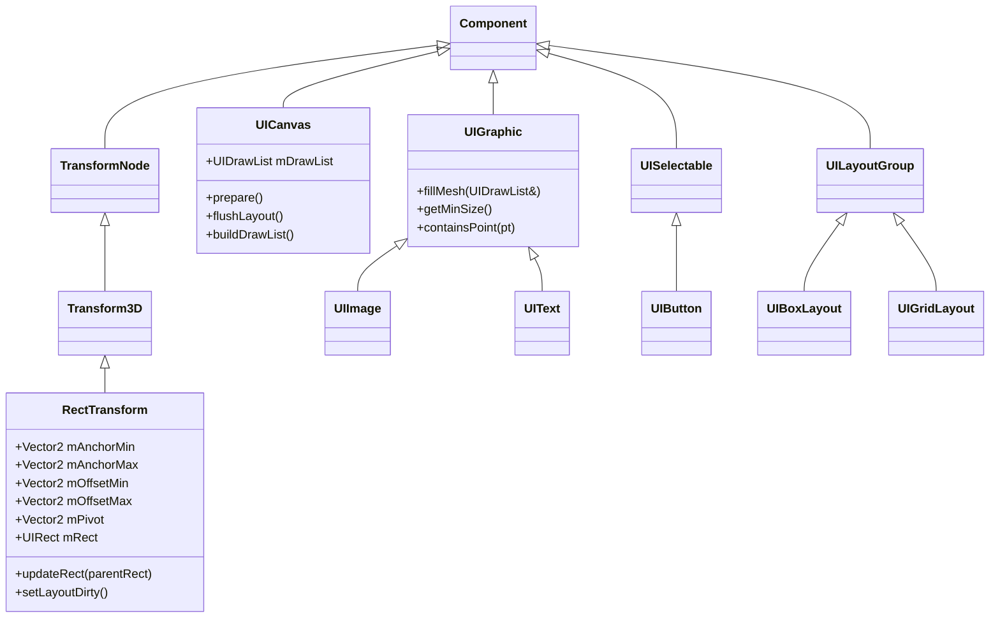
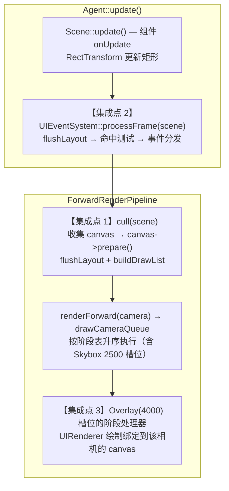

# 运行时 UI 系统设计与分步计划（自研，对齐 Unity UGUI / Godot Control）

> 目标：为 Tiny3D 补齐 **运行时 UI 系统** —— UI 元素作为组件挂在 GameObject 上，用「锚点 + 偏移」描述矩形，两阶段布局，保留式绘制（retained mode）合批成 2D drawcall，带命中测试与事件冒泡的输入路由。
>
> 选型结论：**数据模型抄 Unity UGUI（`RectTransform`），事件与容器语义抄 Godot Control，2D 渲染后端抄现成的 `ImGuiImplTiny3D`。**
>
> 本文档为施工蓝图，代码片段均以「建议实现」形式给出并标注现有参考位置，不代表已落地。
>
> 本期（Phase 0–4）只做 **屏幕空间 UI + 图片 + 文本 + 按钮 + 容器布局**，不含主题资源化、富文本、世界空间 UI（见 §1.2）。

---

## 1. 背景与目标

引擎目前完全没有运行时 UI：编辑器 UI 走 ImGui（`source/Editor/`），但那是编辑器专用、不进 Player、不可在场景里编辑。游戏侧要画一个按钮，今天没有任何可用设施 —— 没有文本渲染、没有 2D 图元组件、没有布局、没有 UI 事件路由。`kBuiltinQueueOverlay = 4000` 已定义但**至今没有任何消费者**。

### 1.1 本期目标

1. `RectTransform` 组件：锚点 / 偏移 / pivot 描述矩形，参与 Transform 树。
2. `UICanvas` 组件：UI 子树的根，负责布局刷新、绘制列表构建、分辨率自适应。
3. `UIImage` / `UIText` 两个可绘制元素，覆盖绝大多数 UI 需求。
4. 两阶段布局（measure 冒泡 + arrange 下发）与容器布局（水平 / 垂直 / 网格）。
5. 2D 渲染后端：动态 VB/IB + 合批 + scissor 裁剪，走 ShaderLab 内置材质（多后端变体齐全）。
6. 文本栈：`stb_truetype` 光栅化字体图集 + 换行 / 对齐排版，支持中英混排。
7. 事件系统：命中测试、hover / press / click / drag、焦点、冒泡与 `mouseFilter`。
8. 编辑器可编辑：Hierarchy 层级、Inspector 属性、场景序列化 —— 全部靠现有反射白捡。

### 1.2 本期边界（暂不实现）

- **主题资源化**：`UITheme` / `UIStyleBox` / `UIFont` 三种新资源类型（要动 §7.3 列的 14 处接入点），本期样式直接作为组件属性。
- **世界空间 Canvas**：UI 贴在 3D 物体上（Godot `SubViewport` / Unity `WorldSpace` 渲染模式）。基础设施已就绪（`RenderTexture` 支持 `shaderReadable`），但排在 Phase 6。
- **富文本 / 复杂文字整形**：HarfBuzz shaping（阿拉伯 / 印度系）、ICU BiDi、SDF 字体、图文混排、emoji。
- **UI 动画 / 过渡曲线**：本期按钮状态切换是瞬时换色换图，不做 tween。
- **场景视图里拖拽编辑 UI**：需要 Gizmo 基础设施（引擎当前缺失），排在 Phase 6。
- **UI 局部重排优化**：v1 布局脏了就整棵 Canvas 重排，不做增量。

---

## 2. 现状分析

### 2.1 缺口与已就绪基础设施对照

| 环节 | 现状 | 结论 |
|------|------|------|
| Transform 树 | `TransformNode`（树结构 + `visitActive`）+ `Transform3D`（TRS + 懒计算世界矩阵 + 递归脏标记），[`T3DTransform3D.cpp:119-176`](../../source/Core/Source/Component/T3DTransform3D.cpp) | **直接继承复用**，见 §3.1 |
| 组件 / 反射 / 序列化 | `TCLASS` + `TPROPERTY` 由 rpp 扫描生成注册代码；JSON / T3DB 序列化全靠 RTTR 自动完成 | 新组件零手工注册 |
| 编辑器 Hierarchy | [`UIHierarchyWindow.cpp:417-426`](../../source/Editor/TinyEditor/UIHierarchyWindow.cpp) 按 Transform 树 `visitAll` 列 GameObject | **白捡** |
| 编辑器 Inspector | [`UIInspectorWindow.cpp:453-461`](../../source/Editor/TinyEditor/UIInspectorWindow.cpp) 遍历 RTTR 派生类做 Add Component；`ImPropertyDrawer::drawObject` 按 `TPROPERTY` 自动绘制 | **白捡**（需带 `UUID` 构造函数） |
| 输入 | `Input` 单例已存在（[`T3DInput.h:77-125`](../../source/Core/Include/Input/T3DInput.h)），`getMousePosition` / `getMouseButtonDown` / `getTouch`，触摸已转窗口像素 | 事件源直接可用 |
| **IME 文本输入** | `Input::processEvent` **未处理** `APP_TEXTINPUT` / `APP_TEXTEDITING`（[`T3DInput.cpp:56-84`](../../source/Core/Source/Input/T3DInput.cpp)） | InputField 阶段需补，见 §10 第 13 项 |
| 代码建 VB/IB + 合批 + scissor | [`ImGuiImplTiny3D.cpp:446-620, 787-813`](../../source/Editor/ImGuiImpl/ImGuiTiny3D/Source/ImGuiImplTiny3D.cpp) 是**完整可抄的成熟范例** | 2D 后端照抄 |
| 渲染队列 | `kBuiltinQueueOverlay = 4000` 已定义（注释即「UI 与覆盖层」），但**无消费者** | **用它做 UI 的队列槽位**，但不走 `Renderable` 派发路径（§2.2）；派发改为阶段表归并（§3.3） |
| Queue 标签取值 | 设计上是**开放整数域**（支持 `Geometry+100` 式偏移）；但 `toTagValue` 当前只认五个内置名字字符串，偏移语法未实现，且无法识别的值**静默忽略**（[`T3DTechnique.cpp:224-249`](../../source/Core/Source/Material/T3DTechnique.cpp)） | 需补偏移解析器，见 §3.3.1 |
| 队列派发现状 | 天空盒用 `>= kBuiltinQueueTransparent` 阈值 + `skyboxDrawn` 哨兵 + 循环后兜底分支插入（`T3DForwardRenderPipeline.cpp:590-596, 682-686`） | **前置重构**为阶段表，见 §3.3 |
| 队列内排序 | **无任何排序**。`RenderGroup = TMap<Material*, Renderables>` 按堆地址迭代；透明队列也没有 back-to-front | **前置重构**为扁平数组 + 显式排序键 + 分段策略，见 §3.4 |
| 正交相机 | `Projection::kOrthographic` + `orthographic_LH/RH` 已实现 | 可用，但屏幕空间 UI 不需要 |
| RenderTexture | `create(..., bool shaderReadable)` 支持渲染到纹理再采样 | 世界空间 UI 的地基已有 |
| 文本渲染 | **完全没有**。`FindFreetype.cmake` 存在但**全仓库无 `find_package(Freetype)` 使用者**；`IMGUI_ENABLE_FREETYPE` 在 `imconfig.h:79` 被注释 | 自建，见 §7 |
| **单通道像素格式** | `PixelFormat` **只有** 16/24/32 位彩色 + 深度格式，**无 A8 / R8**（[`T3DConstant.h:38-60`](../../source/Core/Include/Kernel/T3DConstant.h)） | 字体图集只能用 32 位，见 §7.2 |
| 事件基础设施 | Framework 层有 `EventManager` / `EventHandler`（句柄制、编辑器在用）；Core 层**无** Signal / Delegate 模板 | UI 回调用 `TFunction`，见 §8.5 |

### 2.2 关键约束一：用 Overlay 队列号，但不走 `Renderable` 派发路径

`kBuiltinQueueOverlay = 4000` 的设计意图在代码里写得很明确 —— 注释就是「UI 与覆盖层，通常最后渲染」（[`T3DRenderConstant.h:71-72`](../../source/Core/Include/Render/T3DRenderConstant.h)）。这里要把两件事分开：

**队列号可用，且应该用。** `RenderQueue = TMap<uint32_t, RenderGroup>` 升序迭代，4000 保证最后绘制，正是 UI 要的语义。UI shader 应标 `Tags { "Queue" = "Overlay" }`。

**不可用的是 `Renderable` + `RenderGroup` 这条收集派发路径**，三个卡点：

[`T3DForwardRenderPipeline.h:107-111`](../../source/Core/Include/Render/T3DForwardRenderPipeline.h)：

```cpp
        using Renderables = TList<Renderable*>;
        using RenderGroup = TMap<Material*, Renderables>;
        using RenderQueue = TMap<uint32_t, RenderGroup>;
```

1. **多材质之间的顺序不确定**。`addRenderable` 做 `group.emplace(material, renderables)`（`T3DForwardRenderPipeline.cpp:138`），`drawCameraQueue` 遍历 `RenderGroup` 时按 **Material 指针地址**迭代（`:600-603`）。
   需要公正地说明：**单材质情况下顺序是对的** —— `Renderables` 是 `TList`，插入顺序来自 `frustumCulling` 的 `visitActive` DFS，即层级顺序。所以只用单张图集的 UI 走队列能正常工作。问题出在「图集材质 + 字体材质」这种最普通的组合：谁先画取决于两个 `Material` 对象的堆地址。不透明物体靠深度测试兜底，UI 关了深度测试，绘制顺序即正确性。
   **这一条有独立解法，见 §3.4** —— 它同时修掉透明队列的排序缺失，是一项与 UI 解耦的管线改进。但即便解决了它，下面两条仍然成立，所以 UI 依然不走队列。
2. **只能整个索引缓冲一次画完**。最内层是 `ctx->render(ib->getIndexCount(), 0, 0)`（`:668`），起始索引与 baseVertex 写死 0，没有子范围绘制。合批要求「上百个矩形进一个大 buffer 再分段画」，这条路径表达不了；退化成每批一个独立 `IndexBuffer` + 每批一个 `Material`（纹理按 UUID 绑在 Material 上）后，又绕回第 1 条的指针排序问题。
3. **这条路径完全没有 scissor**。裁剪遮罩、ScrollView 无处安放。

**结论**：`kBuiltinQueueOverlay` 作为 UI 的**队列槽位**要用，但 UI 内容不经 `addRenderable` 收集，而是由注册在该槽位的额外阶段处理器绘制，UI 自己管合批、顺序与 scissor。派发机制见 §3.3 —— 阶段表与实际队列做有序归并，不用 `>=` 阈值，也不用哨兵标志位。

> **顺带的独立发现（与 UI 无关）**：**透明队列 3000 同样没有按深度排序**，受制于同一个 `TMap<Material*, ...>` 结构。这是既有缺陷，不是 UI 引入的 —— 与卡点 1 同源，一并在 §3.4 解决。

### 2.3 关键约束二：`static_cast<Transform3D *>` 是全局隐含假设

全仓库有 **30 余处** `static_cast<Transform3D *>(go->getTransformNode())`，遍布 `ForwardRenderPipeline`、`Camera`、全部 `Bound` 子类、`AnimationPlayer`、`Scene`、编辑器 Hierarchy：

```cpp
// T3DForwardRenderPipeline.cpp:1067
Transform3D *xformNode = static_cast<Transform3D *>(renderable->getGameObject()->getTransformNode());

// T3DTransform3D.cpp:162 —— setDirty 递归子节点
Transform3D *node = static_cast<Transform3D*>(itr->get());
```

第二处尤其致命：`Transform3D::setDirty` 递归子节点时把每个子节点强转成 `Transform3D *`。**只要 UI 节点是场景里任何 `Transform3D` 的后代，这个强转就会发生。**

这决定了 `RectTransform` 的继承形态：

| 方案 | 代价 |
|------|------|
| `RectTransform : TransformNode`（与 `Transform3D` 平级，Godot 式） | 上述 30 余处强转全部变成 UB，需先把脏标记传播、父链上溯重构成 `TransformNode` 层的虚函数，并逐处审计 |
| **`RectTransform : Transform3D`（Unity 式）** | **零重构**。所有强转天然合法，世界矩阵 / 脏标记 / 树遍历 / 编辑器层级全部继承即得 |

**结论**：`RectTransform` 继承 `Transform3D`。这正是 Unity 的做法（`RectTransform : Transform`），布局算出的矩形位置写回继承来的 `position`，`rect` 尺寸单独存。副作用是 Inspector 会同时显示 3D 的 Rotation / Scale —— 这与 Unity 行为一致，且 UI 旋转缩放动画正需要它。

### 2.4 其它需要注意的现状

- **更新顺序表是精确类名匹配**：`GameObject::putUpdatingQueue` 拿类名去 `Settings.componentSettins.updateOrders` 里找槽位，找不到就进无序队列。`RectTransform` **不会**因为继承 `Transform3D` 而落进 `"Transform3D"` 槽位，必须显式登记（见 §10 第 5 项）。
- **`updateOrders` 只在代码里有默认值**：`ComponentSettings()` 构造函数写死 `Transform3D → Camera → Geometry → Behaviour`（[`T3DSettings.h:129-137`](../../source/Core/Include/Kernel/T3DSettings.h)），而 `assets/config/*/Tiny3D.cfg` 里**并没有** `componentSettings` 段（已确认）。所以只改默认构造即可，无需改配置文件。
- **`Transform3D::setDirty` 有早退**：`if (mIsDirty != isDirty)` —— 已经 dirty 时不再向下递归（这是有意的性能优化）。UI 布局**不要**复用 `mIsDirty` 表达「矩形失效」，否则会漏更新；UI 用独立标志位。
- **CMake 是按目录 GLOB**：`set_project_files(dir ext)` 内部是 `file(GLOB ... CONFIGURE_DEPENDS)`，同目录新增 `.cpp` 无需登记，但**新增目录必须加一行**（见 §10 第 1 项）。
- **rpp 约束**：带 `TCLASS` 的非模板 `.h` 必须有同名 `.cpp`，否则反射生成会报错。
- **`GameObject::createWithTransform()` 挂的是 `Transform3D`**，UI 对象创建需要单独的工厂 / 编辑器菜单项。
- **编辑器输入门控**：`Input::setEnabled` 仅在 `isPlaying()` 且聚焦窗口名为 `Game`/`GameView` 时为 true（[`EditorApp.cpp:879-897`](../../source/Editor/TinyEditor/EditorApp.cpp)）。所以编辑模式下 UI 天然不响应输入 —— 符合预期。

---

## 3. 总体架构设计

### 3.1 类结构



**非组件类**（纯数据 / 服务，不进 GameObject）：

| 类 | 职责 |
|----|------|
| `UIVertex` / `UIDrawCmd` / `UIDrawList` | 顶点与批次记录 |
| `UIRenderer` | RHI 后端：动态 VB/IB/CB + 状态 + 逐 cmd scissor / 纹理 / draw |
| `UIFont` / `UIGlyph` / `UIFontAtlas` | `stb_truetype` 光栅化与图集管理 |
| `UITextLayout` | 断行 / 对齐 / 度量 |
| `UIEventSystem` | 单例：命中测试、指针状态机、焦点、事件分发 |
| `UIPointerEvent` | 事件数据（位置 / 按键 / 滚轮 / 目标 / 是否已消费） |

矩形类型直接用 `using UIRect = TRect<Real>`，复用 Math 层已反射的 `TRect`（见 §4.1），不新建。

### 3.2 帧内流程与三个集成点



选这三个点的理由：

- **集成点 1（`cull`）**：布局与绘制列表构建必须在所有游戏逻辑 `onUpdate` 之后，否则脚本改了 UI 状态要等下一帧才生效。`cull` 是 `update()` 之后的第一站，且管线已有「在 `cull` 里收集 camera / Skybox」的先例。
- **集成点 2（`Agent::update` 末尾）**：事件分发要在 `Scene::update()` 之后（用户脚本可能刚创建 / 移动了 UI），且必须先 `flushLayout` 才能命中测试。放在 Agent 而非某个组件的 `onUpdate` 里，是因为多 Canvas 之间要按 `sortOrder` 倒序统一决定谁先吃事件 —— 这是跨 GameObject 的全局决策，不能靠 per-GameObject 的 DFS 顺序。
- **集成点 3（`kBuiltinQueueOverlay` 槽位的阶段处理器）**：UI 绘制注册成 4000 槽位的处理器，由 §3.3 的阶段表按序调用 —— 不需要阈值判断，也不需要「场景里没有 Overlay 成员时补画」的兜底，因为阶段表是声明驱动的，槽位一定会执行。天然画进 `camera->getSrcRenderTarget()`，所以编辑器 GameView（渲染到 RenderTexture）与运行时窗口**同一套代码**都正确。若改成「所有相机之后单独一个全局 pass 直接画窗口」，编辑器 GameView 就看不到 UI。

### 3.3 前置重构：声明式队列阶段表

当前 `drawCameraQueue` 用**阈值比较 + 哨兵标志位**来模拟一个不存在的队列槽位：

```cpp
// T3DForwardRenderPipeline.cpp:590-596（现状）
if (drawSkybox && !skyboxDrawn
    && itemQueue.first >= ShaderLab::kBuiltinQueueTransparent)
{
    renderSkybox(ctx, camera, skyboxMaterial);
    skyboxDrawn = true;
}
// ... 循环结束后还要补一次兜底（:682-686）
if (drawSkybox && !skyboxDrawn)
{
    renderSkybox(ctx, camera, skyboxMaterial);
}
```

三个问题：`>=` 让插入点取决于「场景里恰好存在哪些队列」而非声明；需要 `skyboxDrawn` 哨兵防重复；空场景要靠循环后的兜底分支补画。UI 若照抄这个模式，会再复制一份同样的别扭代码。

**根因**是迭代由「实际存在的 `mRenderQueue` map 条目」驱动，而天空盒 / UI 都**不是** `Renderable`，永远不会在 map 里有条目。

**关键前提：队列号是开放整数域。** 设计上允许 `Queue = "Geometry+100"` 这样的偏移取值（对齐 Unity），所以队列号**不是**五个内置值的封闭集合，任意整数都可能出现。这决定了派发不能简单地「遍历一张声明好的固定表」—— 必须同时照顾到「用户自定义的任意队列号」和「引擎声明的特殊槽位」。

#### 3.3.1 Queue 取值语法

新增枚举值（天空盒拿到自己的槽位，落在 AlphaTest 与 Transparent 之间，对齐 Unity 的隐式天空盒位置）：

```cpp
// 建议实现：T3DRenderConstant.h
const char *const kBuiltinQueueSkyboxStr = "Skybox";

enum BuiltinQueueValue : uint32_t
{
    kBuiltinQueueBkgnd = 0,
    kBuiltinQueueGeometry = 2000,
    kBuiltinQueueAlphaTest = 2450,
    /// 天空盒；不透明物体已写好深度，此时绘制可剔除被遮挡像素
    kBuiltinQueueSkybox = 2500,
    kBuiltinQueueTransparent = 3000,
    kBuiltinQueueOverlay = 4000,
};

/// Queue 取值合法区间，对齐 Unity
const uint32_t kBuiltinQueueMin = 0;
const uint32_t kBuiltinQueueMax = 5000;
```

`Technique::toTagValue` 需要从「五个字符串等值比较」升级为解析器：

| 写法 | 结果 |
|------|------|
| `"Geometry"` | 2000 |
| `"Geometry+100"` | 2100 |
| `"Transparent-1"` | 2999 |
| `"2100"` | 2100（纯整数直接取值） |
| 无法解析 | 保持默认 `kBuiltinQueueGeometry` 并输出 warning |

结果钳制到 `[kBuiltinQueueMin, kBuiltinQueueMax]`。

> **顺带修掉一个既有缺陷**：当前 `toTagValue` 对无法识别的值**静默不赋值**，`mRenderQueue` 保持先前值。也就是说 shader 里把 `"Transparent"` 写错成 `"Transparant"` 会静默落到默认的 Geometry 队列，排查起来很痛。新解析器应显式 warning。
>
> **待确认项**：ShaderLab 的 tag 值是带引号的字符串字面量（`Tags { "Queue" = "Geometry+100" }`），按理 `+` / `-` / 数字都在字符串内不影响词法。落地前需确认 `SLParserLex.l` 对 tag 值的词法规则确实如此，若不是则需同步改文法。

#### 3.3.2 派发：两个有序序列归并

有序的来源有两个，都按队列号升序：

| 来源 | 内容 | 键的性质 |
|------|------|----------|
| `mRenderQueue[camera]` | `TMap<uint32_t, RenderItems>`（§3.4.1 拍平后），实际存在渲染项的队列 | **任意整数**，由 shader 的 Queue 标签决定 |
| `mQueueStages` | 引擎声明的**额外阶段**（天空盒 2500、UI 4000） | 固定已知值 |

注意与「封闭集合」方案的区别：`mQueueStages` **只登记特殊阶段**，不再为每个内置队列号登记一个 `drawRenderablesStage`。普通渲染项的绘制是归并过程中对渲染项来源的默认动作，因此天然支持任意队列号。

```cpp
// 建议实现：T3DForwardRenderPipeline.h
struct QueueStageContext
{
    RHIContext        *Context        {nullptr};
    Camera            *Camera         {nullptr};
    Vector4            CameraWorldPos {};
    Material          *SkyboxMaterial {nullptr};
    RasterizerOverride Override       {};
};

/// 额外阶段处理器：注册在某个队列号上，归并时按序执行
using QueueStageHandler = TFunction<TResult(const QueueStageContext &, uint32_t queue)>;
TMap<uint32_t, QueueStageHandler> mQueueStages;
```

初始化时只声明特殊阶段：

```cpp
// 建议实现：ForwardRenderPipeline 初始化
mQueueStages[ShaderLab::kBuiltinQueueSkybox]  = drawSkyboxStage;
mQueueStages[ShaderLab::kBuiltinQueueOverlay] = drawUIStage;
```

`drawCameraQueue` 变成一次标准归并walk，没有阈值、没有哨兵：

```cpp
// 建议实现
static const RenderQueue kEmptyQueue;          // 相机无渲染项时的占位，免掉空指针分支
const auto itrCamera = mRenderQueue.find(camera);
const RenderQueue &queues =
    (itrCamera != mRenderQueue.end()) ? itrCamera->second : kEmptyQueue;

auto itQ = queues.begin();
auto itS = mQueueStages.begin();

while (itQ != queues.end() || itS != mQueueStages.end())
{
    const bool hasQ = (itQ != queues.end());
    const bool hasS = (itS != mQueueStages.end());

    if (hasQ && (!hasS || itQ->first < itS->first))
    {
        // 只有渲染项
        drawRenderItems(stageCtx, itQ->first, itQ->second);
        ++itQ;
    }
    else if (hasS && (!hasQ || itS->first < itQ->first))
    {
        // 只有额外阶段：该队列号没有渲染项，处理器照样执行
        itS->second(stageCtx, itS->first);
        ++itS;
    }
    else
    {
        // 队列号相同：先渲染项，后额外阶段
        drawRenderItems(stageCtx, itQ->first, itQ->second);
        itS->second(stageCtx, itS->first);
        ++itQ;
        ++itS;
    }
}
```

**同号时的次序规则**：先渲染项、后额外阶段。理由是 UI 应当盖在同队列号的几何体之上；天空盒同理（用户显式标 2500 的物体已写好深度，天空盒 `ZTest LEqual` 不会覆盖它）。这条规则要写进注释，否则以后没人说得清。

#### 3.3.3 收益与开放域带来的表达力

| 项 | 改进 |
|----|------|
| 插入点 | 由**声明**决定，而非「场景里恰好有哪些队列」 |
| 哨兵标志位 | `skyboxDrawn` 及循环后兜底分支**全部删除** |
| 空场景 / 无对应队列 | 额外阶段照常执行（归并会单独产出 stage 键），天空盒 / UI 自然画出 |
| 任意队列号 | 归并对渲染项侧的键不做任何假设，`Geometry+100` 直接可用 |
| 扩展性 | 将来加 Decal / 后处理 / 描边阶段只需注册一行 |
| 语义 | `kBuiltinQueueSkybox` / `kBuiltinQueueOverlay` 成为**真正被消费的槽位**，而不是被 `>=` 顺带蹭到的边界值 |

开放整数域配合归并，还自然获得一个很实用的能力：**用队列号精确控制内容与 UI 的相对层次**。

| 写法 | 效果 |
|------|------|
| `"Overlay-1"`（3999） | 3D 内容画在 UI **之下**（例如世界空间血条底衬） |
| `"Overlay"`（4000） | 与 UI 同槽，按上述规则画在 UI **之下** |
| `"Overlay+1"`（4001） | 3D 内容画在 UI **之上**（例如全屏闪白、过场遮罩） |

行为等价性：天空盒原先插在「第一个 `>= 3000` 的队列之前」，新模型固定在 2500 槽位。由于 2500 > `kBuiltinQueueAlphaTest`(2450) 且 < `kBuiltinQueueTransparent`(3000)，「不透明之后、透明之前」的语义不变，插入位置从依赖场景内容变为确定值。

> **前提**：上表的层次保证依赖「同队列内多材质顺序确定」，而这一点当前**不成立**（§2.2 卡点 1）。§3.4 是它成立的前提，两节需一并落地。

### 3.4 队列内排序：解决多材质顺序不确定

§2.2 卡点 1 的根因是 `RenderGroup = TMap<Material*, Renderables>` —— 用 Material 指针当 map 键，迭代顺序即堆地址顺序。这不只挡住 UI，也是**透明队列缺少 back-to-front 排序**的同一个根因（§2.2 末尾），所以一并解决。

核心思路：**把二级 map 拍平成带显式排序键的数组，排序策略按队列分段声明。**

#### 3.4.1 数据结构：扁平化 + 显式排序键

```cpp
// 建议实现：T3DForwardRenderPipeline.h（替换现有 RenderGroup / RenderQueue）
struct RenderItem
{
    Renderable *Object         {nullptr};
    Material   *Mat            {nullptr};
    uint32_t    HierarchyIndex {0};      ///< 层级访问序号，稳定 tie-break
    uint64_t    SortKey        {0};      ///< 按队列策略生成，见 §3.4.3
};

using RenderItems = TArray<RenderItem>;
using RenderQueue = TMap<uint32_t, RenderItems>;   ///< 队列号 → 扁平项数组
using CameraRenderQueue = TMap<Camera*, RenderQueue>;
```

`RenderGroup` 这一层**整个删掉**。合批不再靠 map 分组实现，而是靠排序键把同材质排到一起 + 遍历时检测材质变化（§3.4.5）—— 效果等价，但顺序变成可控的。

`HierarchyIndex` 来源零成本：`addRenderable` 里维护一个按相机递增的计数器即可。因为 `GameObject::frustumCulling` 走的是 `visitActive` 的 DFS，**插入顺序本身就是层级顺序**，这也正是今天 `TList` 提供的隐式保证 —— 显式记下来即可，行为不变。

#### 3.4.2 排序策略按队列分段声明

不同队列要的顺序本质不同：不透明要合批（深度靠 Z-Buffer 兜底），透明要严格远→近（牺牲合批），覆盖层要作者显式控制。所以**策略是队列的属性**，不是全局开关。

```cpp
// 管线内部枚举，不序列化也不出现在 Inspector，无需 TENUM() 反射
enum class QueueSortPolicy : uint32_t
{
    kMaterialFirst = 0,   ///< 材质优先，同材质内近→远；不透明物体
    kBackToFront,         ///< 远→近，层级序 tie-break；透明物体
    kAuthoredOrder,       ///< SortOrder 优先，层级序 tie-break；覆盖层
};

TMap<uint32_t, QueueSortPolicy> mSortPolicies;   ///< 声明式策略分段
```

初始化时声明分段起点：

```cpp
// 建议实现：ForwardRenderPipeline 初始化
mSortPolicies[ShaderLab::kBuiltinQueueBkgnd]       = QueueSortPolicy::kMaterialFirst;
mSortPolicies[ShaderLab::kBuiltinQueueGeometry]    = QueueSortPolicy::kMaterialFirst;
mSortPolicies[ShaderLab::kBuiltinQueueAlphaTest]   = QueueSortPolicy::kMaterialFirst;
// 2500 起按 Unity 语义视作「透明侧」，需要远→近排序
mSortPolicies[ShaderLab::kBuiltinQueueSkybox]      = QueueSortPolicy::kBackToFront;
mSortPolicies[ShaderLab::kBuiltinQueueTransparent] = QueueSortPolicy::kBackToFront;
mSortPolicies[ShaderLab::kBuiltinQueueOverlay]     = QueueSortPolicy::kAuthoredOrder;
```

真正形成分段边界的只有**策略发生变化**的那几项（2500 与 4000）；`Geometry` / `AlphaTest` / `Transparent` 三条与前一条同值，属于冗余声明。保留它们是为了让六个内置队列在表里各占一行、意图一目了然，也便于将来单独调整某一段 —— 不是笔误。

因为队列号是开放整数域（§3.3.1），任意队列号要能落到所属**分段**。查找取「`<=` 该队列号的最后一个声明」，一次 `upper_bound` 搞定，不需要 `if` 链也不需要阈值常量：

```cpp
// 建议实现
QueueSortPolicy ForwardRenderPipeline::resolveSortPolicy(uint32_t queue) const
{
    auto itr = mSortPolicies.upper_bound(queue);    // 第一个 > queue 的声明
    if (itr == mSortPolicies.begin())
    {
        return QueueSortPolicy::kMaterialFirst;    // 比最小声明还小，取默认
    }
    return (--itr)->second;                        // 退一格即所属分段
}
```

| Queue 写法 | 数值 | 所属分段 | 策略 |
|-----------|------|---------|------|
| `"Geometry"` | 2000 | Geometry | `kMaterialFirst` |
| `"Geometry+100"` | 2100 | Geometry | `kMaterialFirst` |
| `"AlphaTest+100"` | 2550 | Skybox(2500) | `kBackToFront` |
| `"Transparent-1"` | 2999 | Skybox(2500) | `kBackToFront` |
| `"Overlay-1"` | 3999 | Transparent | `kBackToFront` |
| `"Overlay+1"` | 4001 | Overlay | `kAuthoredOrder` |

> 这顺带**解掉了 §3.3.3 末尾标记的隐患**：不透明 / 透明的分界不再是散落在绘制循环里的 `>= 2500` 魔法比较，而是策略表里一行可见的声明。`kBuiltinQueueSkybox` 这个数值同时承担「天空盒槽位」和「透明侧起点」两个语义，但两者都是显式声明出来的，不是隐式约定。

#### 3.4.3 排序键构成

三种策略各自打包成 64 位无符号整数，排序退化成一次 `TArray` 升序排（可用 `std::sort`）：

**`kMaterialFirst`**（不透明，合批优先）

| 位段 | 内容 | 说明 |
|------|------|------|
| `[63..32]` | `MaterialSortId` | `UUIDHash(mat->getUUID())` 取 32 位，**稳定且与堆地址无关** |
| `[31..8]` | `DepthKey` | 视空间深度归一化 24 位，**近→远升序**（利于 early-Z） |
| `[7..0]` | 保留 | 恒 0 |

**`kBackToFront`**（透明，正确性优先）

| 位段 | 内容 | 说明 |
|------|------|------|
| `[63..32]` | `DepthKey` 取反 | **远→近**，即 `0xFFFFFFFF - depth` |
| `[31..0]` | `HierarchyIndex` | 同深度时按层级序，保证确定性 |

**`kAuthoredOrder`**（覆盖层，作者显式控制）

| 位段 | 内容 | 说明 |
|------|------|------|
| `[63..32]` | `SortOrder + 0x80000000` | 有符号 `int32_t` 偏置成无符号，保持大小关系 |
| `[31..0]` | `HierarchyIndex` | 未设 `SortOrder` 时退化为纯层级序 |

`SortOrder` 作为新属性加在 `Renderable` 基类上（它已是 `TCLASS()` + `TRTTI_ENABLE(Component)`，[`T3DRenderable.h:39-43`](../../source/Core/Include/Component/T3DRenderable.h)），所以 Inspector 绘制与序列化白捡，语义对齐 Unity 的 `Renderer.sortingOrder`：

```cpp
TPROPERTY(RTTRFuncName="SortOrder", RTTRFuncType="getter")
int32_t getSortOrder() const { return mSortOrder; }
TPROPERTY(RTTRFuncName="SortOrder", RTTRFuncType="setter")
void setSortOrder(int32_t order) { mSortOrder = order; }

int32_t mSortOrder {0};
```

> **关于 hash 碰撞**：两个不同材质的 `MaterialSortId` 相同时，它们的项会交错，导致遍历时反复重设材质状态 —— 这是**性能问题而非正确性问题**（不透明队列由 Z-Buffer 保证正确）。若实测中成为瓶颈，把 `kMaterialFirst` 从「打包整数键」换成「按 `UUID` 精确比较的 comparator」即可彻底消除碰撞，代价是排序常数变大。

#### 3.4.4 深度量化

深度取物体世界原点在视空间的 z：

```cpp
// 建议实现
Transform3D *xform = static_cast<Transform3D *>(
    renderable->getGameObject()->getTransformNode());
// Transform::getTranslation() 见 T3DTransform.h:81
const Vector3 worldPos = xform->getLocalToWorldTransform().getTranslation();

// 视空间 z；左右手系符号相反，取绝对值规避坐标系差异
const Real viewZ = fabs((camera->getViewMatrix() * Vector4(worldPos, 1.0f)).z);

const Real n = camera->getNearPlaneDistance();
const Real f = camera->getFarPlaneDistance();
const Real t = clamp01((viewZ - n) / (f - n));
const uint32_t depthKey = static_cast<uint32_t>(t * 0xFFFFFF);   // 24 位
```

用 near/far 归一化而非 IEEE-754 位模式技巧，是为了避开浮点位布局的可移植性问题；24 位精度对排序足够（1600 万级分辨）。

`T3D_COORDINATION_RH` 宏决定视空间 z 的符号（`T3DCamera.cpp:269-291` 的投影分支就是按它切的），取绝对值可以让两种坐标系共用一份代码。

#### 3.4.5 遍历时保留合批

排序完的数组按序走一遍，材质变化时才做原来「每个 group 一次」的重活：

```cpp
// 建议实现：drawRenderItems
Material *current = nullptr;
for (const RenderItem &item : items)
{
    if (item.Mat != current)
    {
        // 原 RenderGroup 级别的设置：shadowMap / 矩阵 / 光照 / 渲染状态 / shader
        setupMaterialState(stageCtx, item.Mat);
        current = item.Mat;
    }
    drawRenderItem(stageCtx, item);
}
```

- `kMaterialFirst`：同材质连续，**每材质恰好一次设置**，与今天的 group 分组开销完全等价
- `kBackToFront`：材质频繁切换，设置次数上升 —— 这是正确透明渲染不可避免的代价，Unity 同样如此

#### 3.4.6 收益与已知局限

| 项 | 结果 |
|----|------|
| §2.2 卡点 1 | **解除**。多材质顺序由排序键确定，与堆地址无关 |
| 透明队列排序 | **修复**。既有缺陷一并解决，不是 UI 的附带产物 |
| §3.3.3 的 `Overlay±1` 层次承诺 | **变得可靠**。在此之前同队列多材质顺序不确定，那张表的保证是空的 —— 本节是它成立的前提 |
| 不透明合批开销 | 不变（每材质一次设置） |
| UI 是否可以改走队列 | **仍然不行**。卡点 2（只能整 IB 画完）与卡点 3（无 scissor）未被本节触及，UI 继续走 §3.3.2 的独立阶段处理器 |

已知局限：

1. **按物体原点排序**，互相穿插的透明物体仍会出错。这是排序式透明渲染的固有局限，Unity 相同。改进方向是用包围体中心（需要给 `Bound` 增加中心点访问器，当前只有各 `testXxx`）或做逐像素排序（OIT，远超本期范围）。
2. **排序开销** `O(n log n)`，每相机每队列一次。项数通常在几百量级，可忽略；若不透明队列膨胀到数万，可换基数排序（键已是整数，天然适配）。
3. **`HierarchyIndex` 是本帧访问序号**，场景树增删会改变编号 —— 与今天 `TList` 插入顺序的行为一致，不引入新问题。
4. **`SortOrder` 只在 `kAuthoredOrder` 分段生效**。若希望它在透明队列也参与（Unity 的 `sortingOrder` 优先于深度），需要把它提到 `kBackToFront` 键的最高位段 —— 本期不做，留作后续。

### 3.5 坐标系约定

| 项 | 约定 | 理由 |
|----|------|------|
| Canvas 空间原点 | **左上角**，x 向右，y 向下 | 与 `AppMouseMotionEvent.x/y`（窗口像素、左上原点）、`RHIContext::setScissorRect`、ImGui 全部一致，消灭翻转 bug |
| 单位 | 逻辑像素（参考分辨率下的像素） | 由 `UICanvasScaler` 换算到物理像素 |
| 锚点 | `[0,1]` 归一化，`(0,0)` = 父矩形左上 | 同 Unity（Unity 是左下，此处改左上以统一 y 轴向下） |
| 正交投影 | `L=0, R=W, T=0, B=H` | 照抄 `ImGuiImplTiny3D` 的 mvp 构造，已验证四后端可用 |
| Z | 顶点 z 恒为 0，深度测试关闭 | 顺序完全由绘制次序决定 |

---

## 4. RectTransform：锚点布局

### 4.1 数据模型（对齐 Unity）

```cpp
// 建议实现：source/Core/Include/UI/T3DRectTransform.h
TCLASS()
class T3D_ENGINE_API RectTransform : public Transform3D
{
    TRTTI_ENABLE(Transform3D)
    TRTTI_FRIEND

public:
    static RectTransformPtr create();

    /// 锚点最小值（父矩形左上为 (0,0)），归一化 [0,1]
    TPROPERTY(RTTRFuncName="AnchorMin", RTTRFuncType="getter")
    const Vector2 &getAnchorMin() const { return mAnchorMin; }
    TPROPERTY(RTTRFuncName="AnchorMin", RTTRFuncType="setter")
    void setAnchorMin(const Vector2 &v);
    // ... AnchorMax / OffsetMin / OffsetMax / Pivot 同构

    /// 本地矩形，由 updateRect 计算得出
    const UIRect &getRect() const { return mRect; }

    /// 标记布局失效，向上冒泡到最近的 UICanvas
    void setLayoutDirty();

protected:
    /// 由父矩形计算本节点矩形，并把位置写回继承的 Transform3D::setPosition
    void updateRect(const UIRect &parentRect);

    Vector2 mAnchorMin {0.0f, 0.0f};   ///< 左上锚点
    Vector2 mAnchorMax {0.0f, 0.0f};   ///< 右下锚点；与 min 相等时为「点锚定」
    Vector2 mOffsetMin {0.0f, 0.0f};   ///< 左 / 上边相对 anchorMin 的像素偏移
    Vector2 mOffsetMax {0.0f, 0.0f};   ///< 右 / 下边相对 anchorMax 的像素偏移
    Vector2 mPivot     {0.5f, 0.5f};   ///< 旋转 / 缩放中心，矩形内归一化
    UIRect  mRect      {};             ///< 派生量，非序列化
    bool    mLayoutControlled {false}; ///< 被父容器接管时忽略自身 anchor
};
```

矩形类型**复用 Math 层已有的** `TRect<T>`（[`T3DRect.h:283-297`](../../source/Math/Include/T3DRect.h)），它已是 `TSTRUCT()` + `TPROPERTY()` 反射结构，Inspector 能自动绘制：

```cpp
using UIRect = TRect<Real>;   // left / top / right / bottom
```

> **坑**：`TRect` 的 `TRect(const TPoint&, const TSize&)` 构造函数用的是 `right = pos.x + size.width - 1` 的**整数像素闭区间**惯例（GDI 风格）。UI 是连续浮点矩形，**绝不能用这个构造函数**，只用四边显式构造。

### 4.2 矩形求解

`TRect` 的 left/top/right/bottom 语义与锚点公式天然同构，四条边直接算出来：

```
pw = parentRect.right - parentRect.left
ph = parentRect.bottom - parentRect.top
mRect.left   = mAnchorMin.x * pw + mOffsetMin.x
mRect.top    = mAnchorMin.y * ph + mOffsetMin.y
mRect.right  = mAnchorMax.x * pw + mOffsetMax.x
mRect.bottom = mAnchorMax.y * ph + mOffsetMax.y
```

三种典型配置（这套 4 参数能统一表达，是抄 Unity 的核心价值）：

| 意图 | anchorMin | anchorMax | offsetMin | offsetMax |
|------|-----------|-----------|-----------|-----------|
| 左上角固定 100×50 | (0,0) | (0,0) | (10,10) | (110,60) |
| 满铺父容器留 20 边距 | (0,0) | (1,1) | (20,20) | (-20,-20) |
| 底部横向拉伸、高 60 | (0,1) | (1,1) | (0,-60) | (0,0) |

位置写回继承的 `Transform3D`：

```cpp
// 建议实现：pivot 作为变换中心，位置 = 矩形左上 + pivot 偏移
Real w = mRect.right - mRect.left;
Real h = mRect.bottom - mRect.top;
Real px = mRect.left + mPivot.x * w;
Real py = mRect.top  + mPivot.y * h;
setPosition(Vector3(px, py, 0.0f));   // 继承自 Transform3D，脏标记与世界矩阵全部复用
```

顶点由 `mRect` 尺寸相对 pivot 展开成四角，再乘继承来的 `getLocalToWorldTransform()`。这样旋转 / 缩放 / 嵌套变换**一行都不用自己写**。

### 4.3 两阶段布局

- **Measure（自底向上）**：`UIGraphic::getMinSize()`（`UIText` 返回文本度量，`UIImage` 返回贴图原始尺寸）、`UILayoutGroup::calcMinSize()` 汇总子项 + 间距 + 内边距。
- **Arrange（自顶向下）**：`UICanvas::flushLayout()` 从根 rect 开始 DFS，每个节点 `updateRect(parentRect)`；若父是 `UILayoutGroup`，则由容器覆写子节点的 `mRect` 并置 `mLayoutControlled = true`（此时子节点自身 anchor 被忽略，同 Godot 容器语义）。
- **脏标记**：`RectTransform::setLayoutDirty()` 沿 parent 链上溯找到最近的 `UICanvas`，置其 `mLayoutDirty`。v1 一旦脏就整棵 Canvas 重排（Canvas 通常只有几十到几百节点，代价可忽略）。**不要复用 `Transform3D::mIsDirty`**（§2.4）。

---

## 5. 绘制列表与合批

### 5.1 数据结构

```cpp
// 建议实现：source/Core/Include/UI/T3DUIDrawList.h
struct UIVertex
{
    Vector3   Position {};              ///< Canvas 空间，z 恒为 0
    ColorRGBA Color    {};              ///< 顶点色，与贴图相乘
    Vector2   UV       {};
};

struct UIDrawCmd
{
    PixelBuffer2D *Texture    {nullptr}; ///< 纹理槽 0；nullptr 用 1x1 白图
    Material      *Mat        {nullptr}; ///< 通常是内置 UI-Default（避开与类型同名）
    UIRect         ClipRect   {};        ///< 窗口像素，喂给 setScissorRect
    uint32_t       IndexOffset {0};
    uint32_t       ElemCount   {0};
    uint32_t       VertexOffset {0};
};

struct UIDrawList
{
    TArray<UIVertex>  Vertices;
    TArray<uint32_t>  Indices;           ///< 统一 32 位，免掉 65536 分块逻辑
    TArray<UIDrawCmd> Commands;
};
```

### 5.2 构建与合批

`UICanvas::buildDrawList()` 按 **DFS 前序 + 兄弟顺序**遍历子树（即层级顺序 = 绘制顺序，后面的兄弟盖前面的，同 Godot / Unity），对每个启用的 `UIGraphic` 调 `fillMesh(drawList)`。

合批规则：若待写入的 `(Texture, Material, ClipRect)` 与 `Commands.back()` 全等，则并入上一条（累加 `ElemCount`），否则新起一条。裁剪由 `UIRectMask` 组件压栈，与父裁剪矩形求交。

一个典型面板（背景 + 图标 + 若干文本）在共用图集时会合成 **2 条 drawcall**（图集一条、字体图集一条）。

### 5.3 UIRenderer：2D 渲染后端

调用序列直接照抄 `ImGuiImplTiny3D`，仅把数据源换成 `UIDrawList`：

```cpp
// 建议实现：source/Core/Include/UI/T3DUIRenderer.h
class UIRenderer
{
public:
    TResult draw(RHIContext *ctx, const UIDrawList &list,
                 const Matrix4 &proj, const Viewport &vp);
private:
    VertexBufferPtr      mVertexBuffer   {nullptr};  ///< kDynamic + kCPUWrite，按需扩容
    IndexBufferPtr       mIndexBuffer    {nullptr};
    VertexDeclarationPtr mVertexDecl     {nullptr};
    MaterialPtr          mDefaultMaterial{nullptr};  ///< 内置 UI-Default.tmat
    BlendStatePtr        mBlendState     {nullptr};  ///< SrcAlpha / InvSrcAlpha
    DepthStencilStatePtr mDepthState     {nullptr};  ///< ZTest Off / ZWrite Off
    RasterizerStatePtr   mRasterState    {nullptr};  ///< ScissorEnable = true
    SamplerStatePtr      mSamplerState   {nullptr};  ///< Clamp + Linear
};
```

关键点（每条都有 ImGui 侧的成熟对照）：

1. **VB/IB 扩容**：`T3D_RENDER_BUFFER_MGR.loadVertexBuffer(sizeof(UIVertex), count, buf, MemoryType::kBoth, Usage::kDynamic, kCPUWrite)`，容量不足时按 1.5 倍重建（对照 `ImGuiImplTiny3D.cpp:446-485`）。
2. **投影矩阵走 Material**：因为不经过 `drawCameraQueue`，管线不会覆写常量，直接 `mDefaultMaterial->setMatrix("tiny3d_MatrixVP", proj)` 即可，**不需要**像 ImGui 那样自建 `ConstantBuffer`。
3. **绑定 pass**：取 `material->getCurrentTechnique()` 的 `ForwardBase` pass，`shader->updateConstantBuffers(startSlot)` + `setVSConstantBuffers` + `setVertexShader/setPixelShader`（精简版 `ForwardRenderPipeline::setupShaders`）。
4. **逐 cmd**：`ctx->setScissorRect(...)` → `ctx->setPSPixelBuffers(0, texBuffers)`（直接覆盖纹理槽，绕过 Material 的 UUID 式 `setTexture`，同 ImGui 做法）→ `ctx->render(ElemCount, IndexOffset, VertexOffset)`。
5. **收尾恢复 scissor**：Forward 路径本身从不设 scissor，UI pass 结束必须把 scissor 设回全屏，否则污染下一台相机。见 §11 第 4 条。

### 5.4 内置 shader

新增 ShaderLab 内置 `UI-Default`（走 `BuiltinShaders` / `BuiltinMaterials` 生成流程，UUID 靠 `BuiltinGuidUtil::readExistingMetaUUID` 保持稳定）：

```
Tags { "Queue" = "Overlay" }
ZWrite Off  ZTest Always  Cull Off
Blend SrcAlpha OneMinusSrcAlpha
// VS: o.pos = mul(tiny3d_MatrixVP, float4(v.pos, 1)); 直传 color / uv
// PS: return tex.Sample(sampler_MainTex, uv) * color;
```

采样器命名必须是 `Texture2D _MainTex; SamplerState sampler_MainTex;` —— D3D11 反射要求 sampler 变量名以 `sampler` 开头并 `substr(7)` 取 key。

走 ShaderLab 而非 ImGui 那样内联 HLSL 字符串，是为了拿到 scc 的多后端变体（GL4 / GLES3 / Vulkan），这是 UI 能上移动端的前提。

---

## 6. UICanvas

```cpp
// 建议实现：source/Core/Include/UI/T3DUICanvas.h
TCLASS()
class T3D_ENGINE_API UICanvas : public Component
{
    TRTTI_ENABLE(Component)
    TRTTI_FRIEND

public:
    /// 缩放模式
    TENUM()
    enum class ScaleMode : uint32_t
    {
        kConstantPixelSize = 0,   ///< 1 逻辑像素 = 1 物理像素
        kScaleWithScreenSize,     ///< 按参考分辨率等比缩放
    };

    bool supportsEnabled() const override { return true; }

    /// 由管线 cull 阶段调用：刷新布局并重建绘制列表
    void prepare();
    const UIDrawList &getDrawList() const { return mDrawList; }
    const Matrix4 &getProjection() const { return mProjection; }

    TPROPERTY(...) uint32_t getSortOrder() const;      ///< 多 Canvas 绘制 / 吃事件顺序
    TPROPERTY(...) const UUID &getCameraUUID() const;  ///< 绑定相机；INVALID 则用主相机
    TPROPERTY(...) const Vector2 &getReferenceResolution() const;  ///< 默认 1920x1080
    TPROPERTY(...) Real getMatchWidthOrHeight() const; ///< 0=按宽 1=按高

protected:
    UIDrawList mDrawList  {};
    Matrix4    mProjection{};
    Real       mScaleFactor {1.0f};
    bool       mLayoutDirty {true};
};
```

缩放因子（`kScaleWithScreenSize`）：按 `log2` 加权插值宽高比，与 Unity `CanvasScaler` 同式 ——

```
logW = log2(targetW / refW), logH = log2(targetH / refH)
mScaleFactor = pow(2, lerp(logW, logH, matchWidthOrHeight))
```

Canvas 根矩形 = `UIRect{ left=0, top=0, right=targetW / scaleFactor, bottom=targetH / scaleFactor }`，`targetW/H` 取绑定相机 `getSrcRenderTarget()` 的尺寸。窗口 resize 时（`APP_WINDOWEVENT_RESIZED`）重算并置 `mLayoutDirty`。

Canvas 注册进 `Scene`，仿照现有 Camera 注册表（`Scene::mCameras` 是 `TMultimap<uint32_t, Camera*>`，key 为 order）：新增 `Scene::mCanvases`（key 为 `sortOrder`）+ `registerCanvas` / `unregisterCanvas` / `getCanvases`。

---

## 7. 文本栈

### 7.1 选型

| 层 | v1 选型 | 理由 |
|----|---------|------|
| 光栅化 | **`stb_truetype.h`** | 单头文件，零构建成本（无需动 CMake 链接），imgui 内部就在用同一套实现（`imstb_truetype.h`），质量足够 |
| 图集 | 自建 skyline 装箱 | ~150 行 |
| 整形 | **无**（逐字 advance + 可选 kerning） | 中英日韩不需要 shaping |
| 断行 | 自写：latin 按空白 / 连字符，CJK 逐字可断 | ~100 行 |
| BiDi | **无** | 不做阿拉伯 / 希伯来 |

推迟 FreeType 的理由：它要走「预编译放 `dependencies/` + Find 模块 + 四处 CMake 链接」的完整接入流程（`FindFreetype.cmake` 虽在但**没有任何使用者**，等于从零开始），而它相对 `stb_truetype` 的增量收益（更好的 hinting、彩色 emoji）在 v1 用不上。Phase 6 若要提升字形质量再换，`UIFont` 接口保持不变即可平滑替换。

### 7.2 字体图集受限于像素格式

`PixelFormat` **没有单通道格式**（§2.1），所以 v1 图集用 32 位 `E_PF_B8G8R8A8`，把灰度值同时写入 RGBA 四通道 —— 与 ImGui 的 `GetTexDataAsRGBA32()` 完全同构，是已验证跑通四后端的路径。

代价是 4 倍显存（1024×1024 图集 = 4MB）。优化项（Phase 6）：新增 `E_PF_R8`，需同步改 D3D11 / GL4 / GLES3 / Vulkan 四个后端的格式映射表。

### 7.3 字体来源：v1 不新增资源类型

`UIText` 用 `String mFontPath` + `Archive->read(filename, buffer)` 直接读 ttf 字节，`UIFontManager` 按 `(路径, 像素大小)` 缓存 `UIFont` 实例。

**刻意不做** `UIFont` 资源类型：新增一种 `Resource` 要动 14 处（`EXT_XXX` 常量、`Resource::Type`、资源类、Manager、`T3DTypedef.h`、`T3DPrerequisites.h`、`Agent` 单例、`AssetManager` 门面、`Meta::Type`、`MetaXxx` 类、`MetaFSMonitor` 分支、`ImPropertyDrawer::inferAssetType` 白名单、反射、CMake）。这笔投资留到 Phase 6 和 `UITheme` 一起做。

---

## 8. 事件系统

### 8.1 事件源：v1 用 Input 轮询

`UIEventSystem::processFrame(Scene*)` 每帧读 `T3D_INPUT`：`getMousePosition` / `getMouseButtonDown/Up` / `getMouseScrollDelta` / `getTouchCount` + `getTouch`。

优点：零改动、编辑器的 `Input::setEnabled` 门控天然生效（仅 Play 模式 + Game 窗口聚焦时 UI 才响应）。
局限：一帧内的多次点击 / 多次滚轮会被轮询式边沿标志吞掉。v1 可接受；要精确就让 `UIEventSystem` 自己 `Application::addEventListener` 收原始事件队列（`Input` 就是这么注册的，有先例）。

### 8.2 坐标变换

窗口像素 → Canvas 空间：减去相机 viewport 在 RT 上的像素偏移，再除以 `mScaleFactor`。注意 `Viewport` 是**归一化比例**（`Left/Top/Width/Height` 默认 `0,0,1,1`），需乘 RT 尺寸。

### 8.3 命中测试

按 `sortOrder` **倒序**遍历 Canvas，Canvas 内按绘制顺序**倒序**遍历（后画的先测）。每个 `UIGraphic::containsPoint()`：点变换到本地空间（世界矩阵求逆）后做矩形测试；`UIImage` 可选按 alpha 阈值精确测试。

`mouseFilter` 三态，取 Godot 语义（比 Unity 单一 `raycastTarget` 布尔更有表达力）：

| 值 | 行为 |
|----|------|
| `kStop` | 命中即消费，不再往下测 |
| `kPass` | 命中会收到事件，但继续往下测（做透明遮罩层） |
| `kIgnore` | 完全穿透，不参与命中（做纯装饰元素） |

### 8.4 指针状态机

- **hover**：命中目标变化时对旧目标发 `onPointerExit`、新目标发 `onPointerEnter`
- **press**：按下时记录 `mPressedTarget` 并**捕获**指针，后续移动 / 抬起都发给它（这是拖拽和「按下后移出再移回仍算点击」的正确语义）
- **click**：抬起时若仍在 `mPressedTarget` 内则发 `onPointerClick`
- **drag**：按下后位移超阈值（建议 5 逻辑像素）发 `onDragBegin` / `onDrag` / `onDragEnd`
- **冒泡**：从命中目标沿 parent 链上溯，`bool onPointerXxx(const UIPointerEvent &)` 返回 `true` 即停止
- **焦点**：点击 focusable 控件时转移焦点，键盘事件先给焦点控件再冒泡；Tab 切换排 Phase 5

### 8.5 回调

Core 层没有 Signal / Delegate 模板，Framework 的 `EventManager` 是句柄制、面向编辑器的重设施。UI 用 `TFunction` 最轻：

```cpp
using OnClick = TFunction<void()>;
void setOnClick(const OnClick &cb) { mOnClick = cb; }
```

回调不可序列化 —— 业务侧在 `Behaviour::onStart()` 里 `getComponent<UIButton>()->setOnClick(...)` 绑定。编辑器里配置回调（Unity 式 `onClick` 持久化列表）需要脚本反射调用，排 Phase 6 之后。

---

## 9. 文件清单（新增）

```
source/Core/Include/UI/                    source/Core/Source/UI/
├── T3DUIPrerequisites.h                   （UI 内部前向声明与枚举）
├── T3DRectTransform.h        .inl         ├── T3DRectTransform.cpp
├── T3DUICanvas.h                          ├── T3DUICanvas.cpp
├── T3DUIGraphic.h                         ├── T3DUIGraphic.cpp
├── T3DUIImage.h                           ├── T3DUIImage.cpp
├── T3DUIText.h                            ├── T3DUIText.cpp
├── T3DUIRectMask.h                        ├── T3DUIRectMask.cpp
├── T3DUISelectable.h                      ├── T3DUISelectable.cpp
├── T3DUIButton.h                          ├── T3DUIButton.cpp
├── T3DUILayoutGroup.h                     ├── T3DUILayoutGroup.cpp
├── T3DUIBoxLayout.h                       ├── T3DUIBoxLayout.cpp
├── T3DUIGridLayout.h                      ├── T3DUIGridLayout.cpp
├── T3DUIDrawList.h                        ├── T3DUIDrawList.cpp
├── T3DUIRenderer.h                        ├── T3DUIRenderer.cpp
├── T3DUIFont.h                            ├── T3DUIFont.cpp
├── T3DUIFontAtlas.h                       ├── T3DUIFontAtlas.cpp
├── T3DUITextLayout.h                      ├── T3DUITextLayout.cpp
└── T3DUIEventSystem.h                     └── T3DUIEventSystem.cpp

source/External/stb/stb_truetype.h         （Phase 2，header-only）
assets/editor/builtin/shaders/UI-Default.tshader   （Phase 0，经 BuiltinGenerator）
source/Samples/UIApp/                      （分阶段验收用例）
```

每个带 `TCLASS` 的头文件**必须**有同名 `.cpp`（rpp 硬约束），即使实现为空。

矩形 / 尺寸 / 点类型**不新增** —— 复用 Math 层的 `TRect<Real>` / `TSize<Real>` / `TPoint<Real>`（`source/Math/Include/T3DRect.h`，已带反射）。

---

## 10. 现有代码改动清单

| # | 文件 | 改动 | 阶段 |
|---|------|------|------|
| 1 | `source/Core/Runtime/CMakeLists.txt`<br/>`source/Core/Editor/CMakeLists.txt` | 新增目录扫描行（**必须**，GLOB 只按已登记目录）：<br/>`set_project_files(Include\\UI ${TINY3D_CORE_SOURCE_DIR}/Include/UI/ .h)`（`.inl` 同理）<br/>`set_project_files(Source\\UI ${TINY3D_CORE_SOURCE_DIR}/Source/UI/ .cpp)` | 0 |
| 2 | `source/Core/Include/T3DPrerequisites.h` | 新增 UI 类前向声明 | 0 |
| 3 | `source/Core/Include/T3DTypedef.h` | `T3D_DECLARE_SMART_PTR(RectTransform)` 等 | 0 |
| 4 | `source/Core/Include/Tiny3D.h` | `#include <UI/T3DXxx.h>` 聚合 | 0 |
| 5 | `source/Core/Include/Kernel/T3DSettings.h` | `ComponentSettings()` 构造里插入 `updateOrders.emplace_back("RectTransform")`（放在 `"Camera"` 之前）。**精确类名匹配**，继承 `Transform3D` 不会自动落槽 | 0 |
| 6 | `source/Core/Include/Resource/T3DScene.h`<br/>`source/Core/Source/Resource/T3DScene.cpp` | Canvas 注册表 `mCanvases` + `registerCanvas` / `unregisterCanvas` / `getCanvases`，仿现有 `mCameras`（`T3DScene.cpp:207`） | 0 |
| 7 | `source/Core/Include/Render/T3DRenderConstant.h` | 新增 `kBuiltinQueueSkyboxStr = "Skybox"` + `kBuiltinQueueSkybox = 2500`；新增 `kBuiltinQueueMin` / `kBuiltinQueueMax` 取值区间（§3.3.1） | 0 |
| 8 | `source/Core/Source/Material/T3DTechnique.cpp` | `toTagValue` 从字符串等值比较升级为**偏移解析器**：支持 `Name` / `Name±N` / 纯整数，钳制到合法区间，解析失败输出 warning（现为静默忽略）（`:224-249`）（§3.3.1） | 0 |
| 9 | `source/Tools/ShaderCrossCompiler/.../SLParserLex.l` | **待确认**：tag 值的词法是否已按字符串字面量处理（`+` / `-` / 数字不受影响）。若不是则需同步改文法 | 0 |
| 10 | `source/Core/Include/Component/T3DRenderable.h`<br/>`source/Core/Source/Component/T3DRenderable.cpp` | 新增 `SortOrder`（`int32_t`，默认 0）+ `TPROPERTY` getter/setter，语义对齐 Unity `Renderer.sortingOrder`（§3.4.3） | 0 |
| 11 | `source/Core/Include/Render/T3DForwardRenderPipeline.h`<br/>`.../T3DForwardRenderPipeline.cpp` | **前置重构 A（派发）**：引入 `QueueStageContext` + `QueueStageHandler` + `mQueueStages`（只登记特殊阶段）；`drawCameraQueue` 改为「实际队列 × 阶段表」有序归并，**删除** `>=` 阈值判断、`skyboxDrawn` 哨兵与循环后兜底分支（`:590-596`、`:682-686`）；天空盒改注册到 2500 槽位（§3.3.2）。<br/>**前置重构 B（排序）**：`RenderGroup` 整层删除，`RenderQueue` 改为 `TMap<uint32_t, TArray<RenderItem>>`；`addRenderable` 记录 `HierarchyIndex` 并生成 `SortKey`；新增 `QueueSortPolicy` + `mSortPolicies` 分段表 + `resolveSortPolicy`；绘制改为「排序后遍历 + 材质变化检测」（§3.4）。<br/>**UI 接入**：`cull` 收集 canvas 并调 `prepare()`；`drawUIStage` 注册到 4000 槽位；持有 `UIRenderer` 实例 | 0 |
| 12 | `source/Core/Include/Kernel/T3DAgent.h`<br/>`source/Core/Source/Kernel/T3DAgent.cpp` | 创建 / 销毁 `UIEventSystem` 单例（仿 `mInput`，`T3DAgent.cpp:1236`）；`update()` 内 `scene->update()` 之后调 `processFrame(scene)`；导出 `T3D_UI_EVENT_SYS` 宏 | 3 |
| 13 | `source/Tools/BuiltinGenerator/.../T3DBuiltinShaders.*`<br/>`.../T3DBuiltinMaterials.*` | 生成 `UI-Default` shader + material，UUID 复用 `BuiltinGuidUtil::readExistingMetaUUID` | 0 |
| 14 | `source/Core/Include/Input/T3DInput.h`<br/>`source/Core/Source/Input/T3DInput.cpp` | 补 `APP_TEXTINPUT` / `APP_TEXTEDITING` 处理（当前 `processEvent` 无此分支），供 `UIInputField` | 5 |
| 15 | `source/Editor/TinyEditor/UIHierarchyWindow.cpp` 等 | 「创建 UI 对象」菜单（Canvas / Image / Text / Button）—— `GameObject::createWithTransform()` 挂的是 `Transform3D`，UI 对象需挂 `RectTransform` | 4 |
| 16 | `source/Editor/TinyEditor/GUIExtension/ImPropertyDrawer.cpp` | anchor 九宫格 preset 自定义绘制 + 资产 UUID 白名单（`inferAssetType`） | 6 |

**无需改动**：反射注册（rpp 自动生成）、Inspector 属性绘制（`TPROPERTY` 自动）、Add Component 菜单（RTTR 自动发现，只要有 `UUID` 构造函数）、场景序列化（RTTR 自动）、`assets/config/*/Tiny3D.cfg`（不含 `componentSettings` 段，已确认）。

---

## 11. 风险与已知坑

1. **`RectTransform` 继承的 3D `position` 由布局接管**。用户在 Inspector 里手改 Position 会被下一次 `flushLayout` 覆盖 —— Unity 完全同样的行为，但需要在 Inspector 里标注（Phase 6 做只读或隐藏）。
2. **不要把 UI 做成 `Renderable` 塞进队列**。三个卡点：多材质按 Material 堆地址排序（§3.4 已给出解法）、`ctx->render` 只能整个 IB 画完（无子范围）、该路径无 scissor（§2.2）。后两条**没有**解法，所以结论不变。但 `kBuiltinQueueOverlay` 本身要用 —— 它是 UI 的**队列槽位**，由 §3.3 阶段表的处理器消费。
3. **`Transform3D::setDirty` 的早退语义**：`if (mIsDirty != isDirty)` 在已 dirty 时不再向下递归。UI 必须用独立的布局脏标志，挤进 `mIsDirty` 会漏更新。
4. **scissor 状态泄漏**：Forward 路径从不设 scissor，UI pass 设了必须恢复，否则下一台相机 / 下一帧被裁。`ctx->reset()` 的覆盖范围需实测确认。
5. **字体图集 4 倍显存**：`PixelFormat` 无单通道格式（已确认），v1 只能 32 位。加 `E_PF_R8` 要动四个后端的映射表。
6. **一帧多次点击丢失**：`Input` 是轮询式边沿标志。若出现连点判定问题，改用 `IAppEventListener` 收原始事件队列。
7. **编辑模式下 UI 不响应输入**：`Input::setEnabled` 仅 Play + Game 窗口聚焦时为 true。符合预期，但意味着「所见即所得地拖拽编辑 UI」必须等 Phase 6 的 Gizmo 方案。
8. **`ForwardAdd` pass 未接入**：管线只跑 `ForwardBase`，UI shader 只能单 pass —— 对 UI 没影响，但别指望多 pass 叠加效果。
9. **`ctx->render` 的偏移约定**：ImGui 传 `pcmd->IdxOffset + globalIdxOffset` / `VtxOffset + globalVtxOffset`，UI 合批时索引与顶点偏移必须对齐同一约定，否则错画。
10. **多 Canvas 与多相机的组合**：Canvas 绑定相机为空时取「主相机」的定义需要明确（建议取 `order` 最大的非编辑器相机），否则编辑器 SceneView / GameView 双相机下行为会歧义。
11. **`TRect(pos, size)` 构造函数不可用**：它是 `right = x + width - 1` 的整数像素闭区间惯例，对浮点 UI 矩形会引入 1 像素误差并在嵌套后累积。UI 侧只用四边显式构造（§4.1）。
12. **删除 `RenderGroup` 是破坏性改动**（§3.4.1）。`RenderQueue` / `RenderGroup` 若被管线外的代码引用（编辑器统计、调试视图等），需一并改。落地前先全仓搜索这两个类型名。
13. **透明队列改成 back-to-front 后画面会变**（§3.4.6）。这是修复而非回归，但现有 Sample 的透明物体截图基线需要重新采集 —— 不能用「逐像素一致」当验收标准。

---

## 12. 分阶段实施计划

每阶段都以 `source/Samples/UIApp/` 里一个可运行场景作为验收。

### Phase 0a-1：队列派发重构（前置，与 UI 解耦）

§3.3 三件事：`kBuiltinQueueSkybox = 2500` + `"Skybox"` 名字 + 取值区间常量；`Technique::toTagValue` 升级为偏移解析器；`ForwardRenderPipeline` 引入 `mQueueStages` 并把 `drawCameraQueue` 改成有序归并，天空盒注册到 2500 槽位，删除 `>=` 阈值 / `skyboxDrawn` 哨兵 / 循环后兜底分支。

**验收**：

- 所有现有 Sample（尤其 `SkyboxApp`）画面与重构前逐像素一致
- 空场景仍能画出天空盒；只有 Overlay 队列物体的场景天空盒位置正确
- `Queue = "Geometry+100"` / `"Transparent-1"` / `"2100"` 解析出的队列号正确，且绘制次序符合数值大小
- 写错队列名（如 `"Transparant"`）时有 warning 而非静默落到 Geometry

> 这一步**不含任何 UI 代码**，可以独立提交、独立验证。先把管线派发理顺，再往 4000 槽位挂东西，UI 的接入就只是「注册一个处理器」。

### Phase 0a-2：队列内排序重构（前置，与 UI 解耦）

§3.4 三件事：`Renderable` 加 `SortOrder` 属性；`RenderGroup` 删除、`RenderQueue` 改扁平 `TArray<RenderItem>` 并在 `addRenderable` 里记 `HierarchyIndex` / 生成 `SortKey`；引入 `mSortPolicies` 分段表 + `resolveSortPolicy`，绘制改为「排序后遍历 + 材质变化检测」。

**验收**：

- 不透明 Sample 画面与重构前逐像素一致；**透明 Sample 需重新采集基线**（风险 13）
- 两个不同材质的 UI 风格 quad（都在 Overlay、都关深度测试）叠放，层次由 `SortOrder` 与层级序决定，**反复重启进程结果不变**
- 三个半透明面片沿视线前后摆放，从正反两侧观察混合结果都正确（重构前反向观察必错）
- 同时标 `"Overlay-1"` / `"Overlay"` / `"Overlay+1"` 的三个物体与 UI 的相对层次符合 §3.3.3 表格
- `"Geometry+100"` 落到 `kMaterialFirst`、`"AlphaTest+100"` 落到 `kBackToFront`，与 §3.4.2 表格一致
- 不透明队列的材质状态设置次数 == 材质种类数（验证合批未退化）

### Phase 0b：UI 骨架打通（地基，风险最高）

`RectTransform`（仅点锚定）+ `UICanvas`（仅 `kConstantPixelSize`）+ `UIDrawList` + `UIRenderer` + 内置 `UI-Default` shader/material + `UIImage` 的纯色矩形路径 + 三个集成点。

**验收**：屏幕左上出现一个 200×100 纯色矩形，不随相机移动 / 旋转而变化；窗口 resize 后位置正确；编辑器 GameView 与独立运行时表现一致；D3D11 与 GL4 两后端都对。

> 这一阶段的价值不在功能而在打通链路。建议先只做「一个矩形」，把三个集成点、scissor 恢复、多后端 shader 变体全部验证过，再往上堆功能。

### Phase 1：锚点布局与图片

四参数完整锚点求解（拉伸 / 边距 / 点锚定）+ 层级嵌套 + pivot 旋转缩放 + `UIImage` 的 simple / sliced（九宫格）/ tiled / filled 四种模式 + `UIRectMask` 裁剪。

**验收**：九宫格按钮底图在父矩形任意拉伸下边角不变形；嵌套三层后旋转父节点，子节点跟随正确；裁剪遮罩内的超出内容被正确切掉。

### Phase 2：文本

`stb_truetype` 接入 + `UIFontAtlas` 装箱 + `UIFont` 缓存 + `UITextLayout`（换行 / 对齐 / 行高 / `\n` / tab）+ `UIText` 组件。

**验收**：中英混排、自动换行、左中右 + 上中下九种对齐、字号动态切换、字符集超出图集容量时正确扩容。

### Phase 3：事件与按钮

`UIEventSystem` + 命中测试 + `mouseFilter` 三态 + 指针状态机（hover / press / click / drag）+ 冒泡 + 焦点 + `UISelectable` 状态机 + `UIButton`。

**验收**：hover / pressed / disabled 三态视觉切换正确；点击回调触发；重叠元素的遮挡关系正确（后画的先吃事件）；`kPass` / `kIgnore` 语义正确；按下后移出再移回仍算点击。

### Phase 4：容器布局与多分辨率

`UILayoutGroup` 基类 + `UIBoxLayout`（水平 / 垂直，含 spacing / padding / 对齐 / 子项伸缩权重）+ `UIGridLayout` + measure 阶段的 min/preferred size 冒泡 + `UICanvas` 的 `kScaleWithScreenSize` + 编辑器创建 UI 对象菜单。

**验收**：容器内子项自动排布，增删子项后自动重排；1280×720 与 1920×1080 下版面比例一致；`matchWidthOrHeight` 在 0 / 0.5 / 1 三档行为符合预期。

> **Phase 0–4 构成最小可用闭环** —— 到此可以做出一个完整的游戏主菜单 / HUD。建议先交付到这里，用真实业务界面检验模型是否够用，再决定后续投入。

### Phase 5：控件扩充

`UIToggle` / `UISlider` / `UIScrollView`（含惯性滚动）/ `UIInputField`（需先补 `Input` 的 IME 支持，§10 第 13 项）/ `UIDropdown` / Tab 键焦点导航 / 手柄方向键导航。

### Phase 6：资源化与体验

`UITheme` / `UIStyleBox` / `UIFont` 三种资源类型（走 §7.3 的 14 处接入）+ FreeType 替换 `stb_truetype`（可选）+ `E_PF_R8` 单通道格式 + 世界空间 Canvas（复用 `RenderTexture`）+ Inspector 的 anchor 九宫格 preset + 场景视图 UI 拖拽 Gizmo + UI 预制体模板 + 布局增量更新优化。

---

## 13. 为什么是这套选型

| 决策 | 选择 | 关键理由 |
|------|------|----------|
| UI 节点形态 | Component 挂 GameObject，`RectTransform : Transform3D` | Hierarchy / Inspector / 序列化 / Prefab **全部白捡**；继承而非平级是被 30 余处 `static_cast<Transform3D *>` 逼出来的（§2.3），恰好也是 Unity 的选择 |
| 矩形模型 | Unity 四参数锚点 + pivot | 一套参数统一表达固定 / 拉伸 / 边距三种意图；Godot 的 anchor + offset 本质同构 |
| 布局引擎 | 自写两阶段 | 锚点求解 Yoga 做不了（它是 flexbox 模型），容器布局各约 100 行，且 `TinyImGui` 里已有 `ImHorizontalLayout` / `ImVerticalLayout` / `ImGridLayout` 的语义积累。引入 Yoga 反而多一层节点树同步 |
| 渲染路径 | UI 注册为 Overlay(4000) 槽位的阶段处理器，自己批 / 自己排序 / 自己裁剪 | 队列号语义正确要用；但 `Renderable` 派发路径有三个卡点（材质按指针排序、只能整 IB 画完、无 scissor）（§2.2） |
| 队列派发 | 「实际队列 × 特殊阶段表」有序归并，取代 `>=` 阈值 + 哨兵标志位；天空盒独立 `kBuiltinQueueSkybox = 2500` 槽位 | 队列号是**开放整数域**（支持 `Geometry+100`），所以阶段表只登记特殊阶段、普通渲染项走归并的默认动作 —— 既不对用户队列号做任何假设，又能让特殊槽位在无渲染项时照样执行，顺带删掉 `skyboxDrawn` 哨兵与兜底分支（§3.3） |
| 队列内排序 | 二级 map 拍平成「扁平数组 + 64 位排序键」，策略按队列**分段声明** | 顺序不能取决于 `Material` 堆地址（§2.2 卡点 1）。合批从「靠 map 分组」改为「靠排序键聚集 + 遍历时检测材质变化」，开销等价但顺序可控。不透明 / 透明 / 覆盖层要的顺序本质不同，所以策略是队列的属性；分段 + `upper_bound` 查找让 `Geometry+100` 自动继承 Geometry 的策略，且把 2500 这个不透明 / 透明分界从隐式比较变成表里一行声明（§3.4） |
| 2D 后端 | 照抄 `ImGuiImplTiny3D` | 同一套 RHI 调用序列已在四后端验证过，是仓库里风险最低的一段参考代码 |
| shader | ShaderLab 内置材质 | 拿到 scc 多后端变体，是上移动端的前提（ImGui 走内联 HLSL，没有这个能力） |
| 文本 | `stb_truetype` 起步 | 单头文件零构建成本；FreeType 要从零建接入流程而 v1 用不上它的增量能力 |
| 事件源 | 复用 `Input` 单例 | 零改动，且编辑器的 Play / 焦点门控天然生效 |
| 事件语义 | Godot `mouseFilter` 三态 | 比 Unity 单一布尔更能表达透明遮罩与装饰元素 |
| 模块形态 | Core 内模块，非插件 | 插件要付 DLL 生命周期、跨模块 RTTR、独立反射配置、部署、编辑器集成的代价；UI 与 Scene/Component 深度耦合，不该隔离 |
| 主题 | v1 组件属性，v2 资源化 | 新资源类型要动 14 处接入点，先用组件属性验证模型再投资 |
