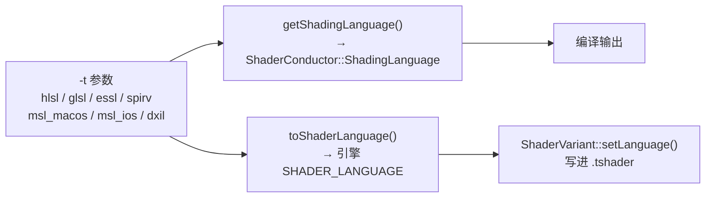
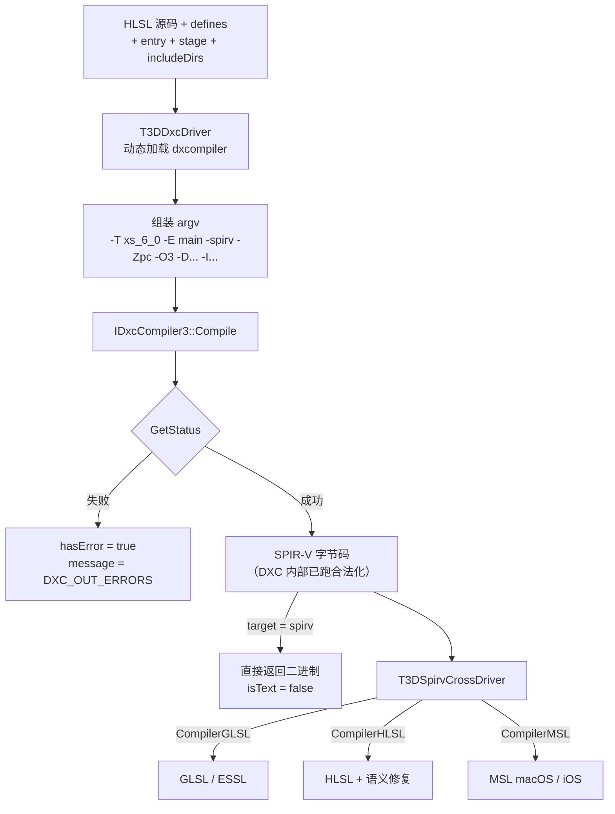
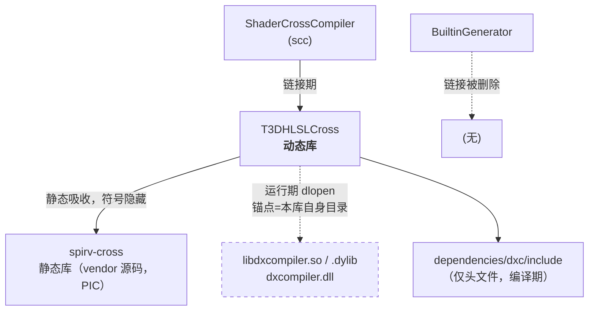

# 用 DXC + SPIRV-Cross 替换 ShaderConductor —— 设计与实现文档

> **目标**：去掉已归档的 `ShaderConductor` 预编译库依赖，改为直接编排 DXC 与 SPIRV-Cross。新增的 `T3DHLSLCross` 库以 **Windows / macOS（含 arm64）/ Linux 三平台同等支持**为硬性要求。
>
> **关键文件**
> - 唯一调用点：`source/Tools/ShaderCrossCompiler/Source/T3DShaderCompiler.cpp` → `ShaderCompiler::compileShaderSnippet()`
> - 死链接：`source/Tools/BuiltinGenerator/CMakeLists.txt`
> - 架构闸门：`source/CMakeLists.txt`、`source/Tools/CMakeLists.txt`
> - 依赖目录：`dependencies/shaderconductor/`
> - CMake 查找模块：`source/CMake/Packages/FindShaderConductor.cmake`
>
> **对照参考**：ShaderConductor 自身的 `Source/Core/ShaderConductor.cpp`（MIT 协议，实现细节可直接对照）

---

## 1. 概述

### 1.1 背景

`microsoft/ShaderConductor` 仓库已归档，README 明写架构限定 `x64`，Apple Silicon 构建 issue（#67）自 2022 年起无进展。上游不会再有 arm64 产物。

时间线约束：

| 时间 | 事件 | 对本项目的影响 |
|------|------|----------------|
| 2025 秋 | macOS 26 Tahoe，最后一个支持 Intel Mac 的系统 | 无 |
| 2026 秋 | macOS 27 Golden Gate，仅 Apple Silicon，最后一个带完整 Rosetta 2 的版本；安装时主动卸载 Rosetta | x86_64 的 `scc` 需手动装 Rosetta 才能跑 |
| 2027 秋 | macOS 28，移除通用 Rosetta 2 | **x86_64 的 `scc` 彻底不可用** |

也就是说改造窗口大约一到两年。注意受影响的是**开发机上运行的离线烘焙工具**，不是分发给用户的引擎/编辑器——运行时不链接 ShaderConductor。

### 1.2 技术定位

ShaderConductor 的本质是三段式流水线的薄封装：

```
HLSL --[DXC]--> SPIR-V --[SPIRV-Tools 合法化/优化]--> SPIR-V' --[SPIRV-Cross]--> GLSL/ESSL/MSL/HLSL
```

三个组件都是活跃维护、arm64 可用的开源项目。本方案就是把中间这层胶水收进 Tiny3D 自己维护。

### 1.3 目标与非目标

**目标**

- 移除 `ShaderConductor` 全部依赖（头文件、预编译库、CMake 查找模块）
- 新增 `T3DHLSLCross` **动态库**，承载 HLSL 跨平台编译能力（`.dll` / `.dylib` / `.so`）
- **`T3DHLSLCross` 在 Windows / macOS / Linux 三平台均可编译、可运行、产物一致**，Linux 是一等目标而非顺带支持（见 §9.1、§6.1.2.1）
- 保持 `scc` 现有命令行接口与输出格式**完全不变**
- 保持烘焙产物（`.tshader` 内容、SPIR-V 二进制布局）与现状**逐字节可比对**
- 解除 `TINY3D_BUILD_SHADERCONDUCTOR_TOOLS` 架构闸门

**非目标**

- 不负责 `scc` 及其上游依赖（`T3DCoreEditor` / `rttr_core` / SDL2）的 Linux 移植——本方案只保证 `T3DHLSLCross` 这一层
- 不解决 FreeImage / FBX SDK 的 x86_64 问题（见 §12.1）
- 不支持 DXIL 目标（见 §6.5）
- 不在本次改造中迁移到 Slang（见 §12.2）
- 不改动运行时引擎任何代码

---

## 2. 现状审计

### 2.1 依赖分布

ShaderConductor **只出现在主机侧离线工具**。运行时引擎不依赖它——Vulkan 后端用的是 `dependencies/spirv-reflect`。

| 位置 | 依赖形态 | 处理 |
|------|----------|------|
| `Tools/ShaderCrossCompiler` | 头文件 + 链接 + 调用 `Compiler::Compile` | 改写调用点 |
| `Tools/BuiltinGenerator` | 仅 CMake 链接，源码从不调用 | 纯删 |
| `Plugins/Renderer/Vulkan` | 仅注释里提到 `type.` 前缀来源 | 不动 |

**实际必须改的调用点只有一个。**

> 原先还有第二个调用点 `Tools/ScriptCompiler`（`ScriptCompiler::translate()`）。该工程早已被排除在构建之外（`add_subdirectory` 长期注释状态），功能与 `ShaderCrossCompiler` 大量重叠，且没有任何外部代码引用它的头文件。**已于本次改造前整体删除**，连同 `source/Tools/CMakeLists.txt`、`source/CMakeLists.txt`、`doc/api/Doxyfile` 里的三处残留引用。本文档不再涉及它。

### 2.2 实际使用的 API 面

整个项目只用到 `ShaderConductor.hpp` 里的四样东西：

```181:181:dependencies/shaderconductor/include/ShaderConductor.hpp
        static ResultDesc Compile(const SourceDesc& source, const Options& options, const TargetDesc& target);
```

加上 `Blob::Data()`、`Blob::Size()`、`DestroyBlob()`。

**未使用**：`Compiler::Disassemble()`、多 target 批量重载 `Compile(..., const TargetDesc*, uint32_t, ResultDesc*)`、`CreateBlob()`、`SourceDesc::loadIncludeCallback`（源码里明确注释掉了）、`Compiler::ShaderModel` 结构体。

替换面只有一个函数签名，这是本方案成本可控的根本原因。

### 2.3 参数语义（含一个陷阱）

调用点传的参数大部分是常量：

| `Options` 字段 | 实际取值 | 对应 DXC 参数 |
|----------------|----------|---------------|
| `packMatricesInRowMajor` | 恒为 `false` | `-Zpc` |
| `optimizationLevel` | `Args::optimizeLevel`，默认 `3` | `-O3` |
| `enableDebugInfo` | 命令行 `OPT_ENABLE_DEBUG_INFO` | `-Zi` |
| `enable16bitTypes` | 未设置，默认 `false` | 不传（若要启用是 `-enable-16bit-types`，约束见 §6.1.5） |
| `disableOptimizations` | 未设置，默认 `false` | 不传 |
| `shaderModel` | **未设置，恒为默认 `{6, 0}`** | `-T xs_6_0` |

**陷阱在最后一行。** `#pragma target` 解析出的 `"50"` / `"40"` 被塞进 `TargetDesc::version`，而不是 `Options::shaderModel`：

```786:789:source/Tools/ShaderCrossCompiler/Source/T3DShaderCompiler.cpp
            else
            {
                targetDesc.version = snippet.model.c_str();
            }
```

也就是说 **HLSL 前端一直是按 SM 6.0 编译的**，`#pragma target` 只影响 SPIRV-Cross 后端输出的方言（GLSL 版本号 / HLSL shader model）。新实现必须原样保持这个语义，否则现有 shader 可能直接编不过。这是整个改造最容易踩错的地方。

##### 为什么是 6.0

两个原因叠在一起，缺一不可：

**一是没人赋值，吃了结构体默认值。** `Compiler::Options::shaderModel` 声明时就是 `{6, 0}`，而项目从头到尾没有对它赋过值。ShaderConductor 内部拿它直接拼 profile 字符串，既不夹取也不回退：

```cpp
// ShaderConductor/Source/Core/ShaderConductor.cpp
shaderProfile.push_back(L'_');
shaderProfile.push_back(L'0' + shaderModel.major_ver);
shaderProfile.push_back(L'_');
shaderProfile.push_back(L'0' + shaderModel.minor_ver);
```

所以 `{6,0}` 原封不动变成 `vs_6_0` / `ps_6_0`。

**二是就算想改也改不了——DXC 的下限就是 SM 6.0。** DXC 的 `-T` 只接受 `xs_6_0` 到 `xs_6_x`，根本不存在 `vs_5_0` 这样的 profile（SM 5.1 及以下是 FXC 的地盘）。所以即便有人想让前端"尊重" `#pragma target 4.0`，DXC 也做不到。

结论：SM 6.0 不是某次有意的选择，而是**默认值恰好等于唯一可行值**。新实现照抄这个行为即可，`HLSLCrossOptions::shaderModelMajor/Minor` 保持默认 `6 / 0`，唯一需要变的场景是启用 16 位类型（要求 ≥ 6.2，见 §6.1.5）。

顺带说明两个类型不同的量为什么不会被混淆：`Options::shaderModel` 是 `{uint8 major : 6; uint8 minor : 2;}` 位域结构体，`#pragma target` 解析出来的 `ProgramParameters::shaderModel` 是 `String`（`"40"`）。两者类型不兼容，编译器不会帮你发现赋错位置——这正是这个陷阱能长期存在的原因。

##### `#pragma target` 的实际取值

仓库里所有声明了 `#pragma target` 的 shader **一律是 `4.0`**（解析后为 `"40"`），于是后端方言固定落在：

| 目标 | `"40"` 映射结果 |
|------|-----------------|
| GLSL | `convertToGLSLVersion("40")` → `"400"` |
| ESSL | `convertToESSLVersion("40")` → `"310"` |
| HLSL | `hlsl_options.shader_model = 40` |

但要注意 `ProgramParameters` 的构造函数把 `shaderModel` 初始化成 `"20"`。若某个 pass 漏写 `#pragma target`，方言会掉到 GLSL `"110"` / ESSL `"100"`——那是不支持 uniform block 的老版本，正是 §6.2.2 提到的需要 `flatten_buffer_block()` 的场景。**风险不在已声明的 shader，而在漏声明的 pass。** 新实现可以考虑在 `#pragma target` 缺失时打一条 warning。

### 2.4 目标语言映射链路

`scc -t` 参数经过三层映射：



`toShaderLanguage()` 的归并关系：

- `hlsl` / `dxil` → `kHLSL`
- `glsl` → `kGLSL`
- `essl` → `kESSL`
- `spirv` → `kSPIRV`
- `msl` / `msl_macos` / `msl_ios` → `kMSL`

注意 `dxil` 被归到 `kHLSL`，且引擎烘焙流程实际用的是 `hlsl` 文本目标。

版本号转换表在 `compileShaderSnippet()` 里以两个 lambda 形式存在（`convertToGLSLVersion` / `convertToESSLVersion`），把 `#pragma target` 的 HLSL SM 号映射成 GLSL/ESSL 版本号。**这是项目自己的映射逻辑，改造时原样保留。**

### 2.5 现存缺陷清单

审计过程中发现的问题，改造时顺带修掉：

| # | 位置 | 问题 | 修法 |
|---|------|------|------|
| D1 | `T3DShaderCompiler.cpp:798` | `errorWarningMsg != nullptr` 即判失败。但该字段**警告也会填**，等于任何 warning 都让编译失败 | 新接口用显式 `hasError` 区分 |
| D3 | `T3DShaderCompiler.cpp:696,804,826` | `T3D_NEW MacroDefine[]` 手工配对 `T3D_SAFE_DELETE_ARRAY`，三处分支，早退路径脆弱 | 换 `TArray` |
| D5 | `Args::include` | 字段存在但从未使用，`#include` 实际不可用 | 接到 DXC `-I` |
| D6 | `BuiltinGenerator/CMakeLists.txt` | 链接 ShaderConductor 但源码从不调用 | 删 |
| D7 | `T3DShaderCompiler.cpp:319-357` | 多 target 循环里 `snippets` 被重复编译，但 `compileShaderSnippet` 内不区分 target 缓存 | 本次不动，仅记录 |
| D8 | `ShaderCrossCompiler/CMakeLists.txt:27` | 路径写 `${TINY3D_DEP_DIR}/ShaderConductor`，磁盘上实际是 `dependencies/shaderconductor`（全小写）。Windows 与 macOS 默认 APFS 大小写不敏感所以一直没暴露，**Linux 上必然找不到** | 新依赖目录一律小写，CMake 里按磁盘真实大小写引用 |

> 编号 D2 / D4 原本记录的是 `ScriptCompiler` 的两个问题（成败判定反向、语义修复函数重复一份）。该工程已删除，问题随之消失，编号保留空位以免打乱后文引用。

---

## 3. 总体设计

### 3.1 数据流



### 3.2 模块划分

```
source/Tools/Common/HLSLCross/
    Include/
        T3DHLSLCrossPrerequisites.h # 导出宏 T3D_HLSLCROSS_API
        T3DHLSLCrossCompiler.h      # 对外唯一头文件，替代 ShaderConductor.hpp
    Source/
        T3DHLSLCrossCompiler.cpp    # 编排层：分派到 DXC / SPIRV-Cross
        T3DDxcDriver.h              # DXC 封装（隔离 dxcapi.h 与平台差异）
        T3DDxcDriver.cpp
        T3DSpirvCrossDriver.h       # SPIRV-Cross 封装（隔离 C++ 异常）
        T3DSpirvCrossDriver.cpp
        T3DHLSLSemanticFix.h        # HLSL 语义修复（原 fixSpirVCrossForHLSLSemantics）
        T3DHLSLSemanticFix.cpp
    CMakeLists.txt                  # 产出动态库 T3DHLSLCross
```

**关于是否值得独立成库。** `ScriptCompiler` 删除后只剩 `ShaderCrossCompiler` 一个消费者，直接把这些文件塞进 `ShaderCrossCompiler/Source/` 也能跑。仍建议独立成库，理由有三条：

1. 隔离第三方头文件。`dxcapi.h` 会拖进 `WinAdapter.h` 那套 COM 模拟宏（`interface`、`HRESULT`、`__EMULATE_UUID` 等），污染面很大，不该让 `scc` 的业务代码见到。
2. §10.1 的新旧后端对拍需要一个能独立驱动的编译入口。
3. 编辑器内嵌 shader 编译是可预见的需求，届时 `T3DEditor` 直接链这个库即可，不必再拆一次。

**做成动态库而不是静态库。** 跟项目里 `T3DUtils` / `T3DCore` 等模块一致（`add_library(... SHARED)` + `T3D_*_API` 导出宏）。这带来四条必须在设计阶段就落实的约束，见 §3.3。

若项目里已有别的公共 Tools 代码约定位置，按那个走；`Tools/Common/` 只是本文的建议路径。

设计约束：

- **`dxcapi.h` 与 `spirv_cross` 头文件不外泄**。只有 `T3DDxcDriver.cpp` / `T3DSpirvCrossDriver.cpp` 两个 `.cpp` 见得到它们，`T3DHLSLCrossCompiler.h` 只暴露 POD 结构体。这样调用方不受第三方头文件污染（ShaderConductor 当初也是这么做的）。
- **不抛异常出库**。SPIRV-Cross 会抛 `spirv_cross::CompilerError`，在驱动层 catch 掉转成 `hasError` + `message`。
- **不用裸指针传所有权**。用 `TArray<uint8_t>` / `String` 替掉 `Blob*`，消掉手工 `DestroyBlob`。

### 3.3 动态库带来的约束

做成动态库不只是把 `STATIC` 改成 `SHARED`，有几条必须在设计阶段就定下来。

**1. STL 跨 DLL 边界——沿用项目既有约定，但要明确代价。**

接口里用 `String` / `TArray`（即 `std::string` / `std::vector`），它们跨 DLL 边界传递在 Windows 上是有前提的：调用方与被调方必须**同一 MSVC 工具集、同一 CRT（`/MD`）、同一 Debug/Release 配置**。Debug 与 Release 混用会因 `_ITERATOR_DEBUG_LEVEL` 不同直接崩。

项目已经在全局接受这个代价——`T3DMacro.h:41` 的 `#pragma warning(disable:4251)` 就是为此，`T3DUtils`、`T3DCore` 等模块的导出接口里到处是 `String`。所以 `T3DHLSLCross` 沿用同样风格是**一致性最优解**，不必为它单独发明一套纯 C ABI。但要写清楚：这个库不是给外部第三方分发的稳定 ABI，只在本仓库内、同一次构建里使用。

> 换句话说，不要因为它是 DLL 就去追求 ABI 稳定——那是 ShaderConductor 作为独立分发库的需求，不是这里的需求。跟仓库同步构建、同步升级，反而比僵化的 C ABI 更好维护。

**2. 异常绝对不能穿过库边界。**

静态库时代 `spirv_cross::CompilerError` 逃逸出去顶多是调用方没接住；动态库下跨模块抛异常在 MSVC 上行为更脆弱。§3.2 里「不抛异常出库」从"好习惯"升级为**硬性要求**：`T3DHLSLCrossCompiler` 的每个导出函数体最外层都要有 `catch (...)` 兜底，转成 `hasError` + `message`。

**3. spirv-cross 必须以 PIC 方式编译，并且符号要藏住。**

`spirv-cross` 是静态库，被吸收进 `T3DHLSLCross` 动态库。这带来两个 Linux 上会立刻炸的问题：

- **PIC**：静态库要链进 `.so`，必须开 `POSITION_INDEPENDENT_CODE`，否则报 `relocation R_X86_64_32 against '.rodata' can not be used when making a shared object`。见 §8.1。
- **符号可见性**：项目的 `T3D_EXPORT_API` 在 macOS / Linux 分支上是**空的**（`T3DMacro.h:64-65`），等于默认导出全部符号。那样 spirv-cross 的符号会从 `libT3DHLSLCross.so` 泄漏到全局符号表。本库对此做例外处理——用 `visibility("default")` 显式标注导出项 + `CXX_VISIBILITY_PRESET hidden`，见 §8.3。这跟 §6.1.2 用 `RTLD_LOCAL` 隔离 dxcompiler 内 LLVM 符号是同一个考虑。

**4. 部署多了一个文件，而且找库的锚点变了。**

静态库时代只需要把 `dxcompiler` 放到可执行文件旁边；现在 `libT3DHLSLCross` 也要跟着走，且它是 `scc` 的**链接期依赖**，Linux 上使用方的可执行目标需要 `$ORIGIN` 形式的 RPATH 才找得到（macOS 用 `@rpath`，项目里 `Utils/CMakeLists.txt:125-131` 已有现成写法）。

同时，dxcompiler 的查找锚点应当从「可执行文件目录」改成「`T3DHLSLCross` 自身所在目录」——因为这两个文件是一起部署的，而宿主可执行文件未必在同一层。见 §6.1.2。

### 3.4 为什么不需要单独引入 SPIRV-Tools

DXC 的 SPIR-V 后端**默认已经内部调用 SPIRV-Tools 完成合法化与优化**。DXC 官方文档 `docs/SPIR-V.rst` 明确说明：

> After initial translation of the HLSL source code, SPIR-V CodeGen will further conduct legalization (if needed), optimization (if requested), and validation (if not turned off). All these three stages are outsourced to SPIRV-Tools.

LunarG 的合法化白皮书也确认：

> The dxc frontend by default will run spirv-opt propagation and dead code elimination passes sufficient to legalize all SPIR-V.

只有 `-Od` 会关掉合法化。所以第一版依赖只有 DXC 与 SPIRV-Cross 两个。若后续遇到 SPIRV-Cross 消化不了的模块，再单独引入 `SPIRV-Tools-opt` 做 `RegisterLegalizationPasses()`——注意 `dependencies/glslang/` 里已经带了 `SPIRV-Tools` 与 `SPIRV-Tools-opt` 的预编译库（Windows / Android），届时可复用。

---

## 4. 依赖准备

### 4.1 DXC

微软官方不发 macOS 二进制（代码签名成本，见 DXC issue #3686），需自备。

| 平台 | 来源 | 产物 |
|------|------|------|
| Windows x64 | [DXC GitHub Releases](https://github.com/microsoft/DirectXShaderCompiler/releases) | `dxcompiler.dll` + `dxcompiler.lib` |
| macOS arm64 + x86_64 | 自建 universal（推荐）/ LunarG Vulkan SDK for macOS / hexops mach-dxcompiler | `libdxcompiler.dylib` |
| Linux x64 | DXC GitHub Releases | `libdxcompiler.so` |
| Linux arm64 | 官方无预编译，需自建（步骤同 macOS，去掉 `CMAKE_OSX_*`） | `libdxcompiler.so` |

macOS 自建（DXC 官方 wiki 路子，Apple Silicon 上直接可用）：

```bash
git clone --recursive https://github.com/microsoft/DirectXShaderCompiler.git
cd DirectXShaderCompiler
mkdir build && cd build
cmake -C ../cmake/caches/PredefinedParams.cmake \
      -DCMAKE_BUILD_TYPE=Release \
      -DCMAKE_OSX_ARCHITECTURES="arm64;x86_64" \
      -DCMAKE_OSX_DEPLOYMENT_TARGET=11.0 \
      -G Ninja ..
ninja dxcompiler
lipo -archs lib/libdxcompiler.dylib     # 应输出 "x86_64 arm64"
```

这跟项目里 `dependencies/llvm/prebuilt/OSX/libclang.dylib` 的做法完全一致——那个已经是 universal，`Tools/CMakeLists.txt:26-41` 还有现成的 `lipo -archs` 校验逻辑可以照抄。

**不要 `dxil.dll`。** 它只用于 DXIL 签名，本方案不支持 DXIL 目标。

### 4.2 SPIRV-Cross

体量小、无外部依赖、纯 C++11、CMake 直编。**vendor 源码而不是放预编译库**——这样天然跟着主工程的 `CMAKE_OSX_ARCHITECTURES` 走，arm64 问题自动消失，也不必为每个平台维护一份二进制。

从 `KhronosGroup/SPIRV-Cross` 拉一个 release tag，只需要以下文件：

```
spirv.hpp                       spirv_common.hpp
spirv_cross_containers.hpp      spirv_cross_error_handling.hpp
spirv_cross_parsed_ir.cpp/.hpp  spirv_parser.cpp/.hpp
spirv_cfg.cpp/.hpp              spirv_cross.cpp/.hpp
spirv_cross_util.cpp/.hpp
spirv_glsl.cpp/.hpp             spirv_hlsl.cpp/.hpp     spirv_msl.cpp/.hpp
```

**不需要**：`spirv_cpp.*`、`spirv_reflect.*`、`spirv_cross_c.*`、`main.cpp`、`spirv_cross_c.h`。

编译选项必须保证 `SPIRV_CROSS_EXCEPTIONS_TO_ASSERTIONS` **不定义**（默认即是），否则错误会变成 `abort()` 而不是可捕获的异常。

### 4.3 目录布局

沿用项目现有约定（`include/` + `prebuilt/<平台>/<架构>/`）：

```
dependencies/dxc/
    VERSION.txt                     # 记录 tag 与构建命令
    include/
        dxc/                        # 从 DXC 源码树 include/dxc/ 整份拷贝
            dxcapi.h
            WinAdapter.h
            dxcerrors.h
            Support/
                WinAdapter.h
                ...
    prebuilt/
        Windows/x64/
            dxcompiler.dll
            dxcompiler.lib
        OSX/
            libdxcompiler.dylib     # universal: x86_64 + arm64
        Linux/x64/
            libdxcompiler.so
        Linux/arm64/
            libdxcompiler.so        # 需自建，官方无预编译

dependencies/spirv-cross/
    VERSION.txt
    CMakeLists.txt                  # 自写，见 §8.1
    *.cpp *.hpp
```

> 拷 `include/dxc/` 整份而不是挑文件，是因为 `dxcapi.h` 在非 Windows 下会 `#include "dxc/WinAdapter.h"`，而 `WinAdapter.h` 又有一串内部依赖。整份拷最省事，体积也就几百 KB。

### 4.4 版本锁定

`VERSION.txt` 里记 tag、commit、构建命令、构建日期。升级纪律：

- DXC 与 SPIRV-Cross **同步升级**。DXC 默认发 SPIR-V 1.0（Vulkan 1.0），SPIRV-Cross 向后兼容，一般无碍，但升 DXC 后要跑一遍 §10 的对拍。
- 第一版**先把 DXC 锁在接近 ShaderConductor 内嵌版本的 tag**（ShaderConductor 归档时内嵌的 DXC 约在 2020-2021 年），跑通对拍确认行为一致后，再单独提一次升级到最新版。不要一次做两件事。

---

## 5. 接口设计

### 5.0 `T3DHLSLCrossPrerequisites.h`（导出宏）

照搬项目既有模式（对照 `T3DUtilsPrerequisites.h:29-33`），但在 POSIX 上做一处**有意的加强**：

```cpp
#ifndef __T3D_HLSL_CROSS_PREREQUISITES_H__
#define __T3D_HLSL_CROSS_PREREQUISITES_H__

#include <T3DPlatformLib.h>

// 注意：这里不直接用 T3D_EXPORT_API / T3D_IMPORT_API。
// 那两个宏在 macOS / Linux 分支上是空的（T3DMacro.h:64-65），
// 等于默认导出全部符号，会让内联进来的 spirv-cross 符号泄漏到全局符号表。
// 本库配合 CXX_VISIBILITY_PRESET hidden（§8.3），显式标注导出项。
#if defined (T3D_OS_WINDOWS)
    #if defined (T3DHLSLCROSS_EXPORT)
        #define T3D_HLSLCROSS_API   __declspec(dllexport)
    #else
        #define T3D_HLSLCROSS_API   __declspec(dllimport)
    #endif
#else
    #if defined (T3DHLSLCROSS_EXPORT)
        #define T3D_HLSLCROSS_API   __attribute__((visibility("default")))
    #else
        #define T3D_HLSLCROSS_API
    #endif
#endif

#endif  // __T3D_HLSL_CROSS_PREREQUISITES_H__
```

与项目其他模块的差别有两处，都是刻意的：

| | 其他模块 | `T3DHLSLCross` | 原因 |
|---|---|---|---|
| POSIX 导出宏 | 空 | `visibility("default")` | 藏住 spirv-cross 符号 |
| `_EXPORT` 定义时机 | 仅 `if (MSVC)` 内 | 所有平台 | POSIX 上也要靠它区分导出/导入 |

### 5.1 `T3DHLSLCrossCompiler.h`

```cpp
#ifndef __T3D_HLSL_CROSS_COMPILER_H__
#define __T3D_HLSL_CROSS_COMPILER_H__

#include <Tiny3D.h>
#include "T3DHLSLCrossPrerequisites.h"

namespace Tiny3D
{
    /// 着色器阶段。取值顺序与 ShaderConductor::ShaderStage 一致，便于对照迁移。
    enum class HLSLStage : uint32_t
    {
        kVertex = 0,
        kPixel,
        kGeometry,
        kHull,
        kDomain,
        kCompute,
    };

    /// 输出目标语言。不含 DXIL，见文档 §6.5。
    enum class HLSLTarget : uint32_t
    {
        kSpirV = 0,
        kHlsl,
        kGlsl,
        kEssl,
        kMslMacOS,
        kMslIOS,
    };

    /// 宏定义。value 为空表示只定义不赋值。
    struct HLSLMacroDefine
    {
        String  name;
        String  value;
    };

    struct HLSLCrossSource
    {
        /// HLSL 源码（完整文本，非路径）
        String                      source;
        /// 源文件路径。用于 #include 的相对解析与编译错误定位
        String                      fileName;
        /// 入口函数名
        String                      entryPoint;
        HLSLStage                   stage           {HLSLStage::kVertex};
        TArray<HLSLMacroDefine>     defines;
        /// #include 搜索路径。对应 scc 的 Args::include
        TArray<String>              includeDirs;
    };

    struct HLSLCrossOptions
    {
        /// 矩阵按行主序打包。项目现状恒为 false
        bool        packMatricesInRowMajor  {false};
        /// 输出调试信息
        bool        enableDebugInfo         {false};
        /// 0 到 3。0 会同时关闭 DXC 的 SPIR-V 合法化，慎用
        uint32_t    optimizationLevel       {3};
        /// 启用真 16 位标量类型（float16_t / int16_t / uint16_t）。
        /// 打开后 half 与 min16* 的语义会变，且要求 shaderModel >= 6.2。
        /// 项目现状为 false，详见文档 §6.1.5 —— 打开前务必读完那一节
        bool        enable16bitTypes        {false};
        /// HLSL 前端 profile 的 shader model。
        /// 注意：这与 HLSLCrossTarget::version 是两个独立概念，详见文档 §2.3
        uint8_t     shaderModelMajor        {6};
        uint8_t     shaderModelMinor        {0};
    };

    struct HLSLCrossTarget
    {
        HLSLTarget  language {HLSLTarget::kSpirV};
        /// 后端方言版本号字符串：
        ///   GLSL "330"/"450"  ESSL "300"/"310"  HLSL "50"（= SM 5.0）
        ///   SpirV / MSL 忽略此字段
        String      version;
    };

    struct HLSLCrossResult
    {
        /// 编译是否失败。注意：message 非空不代表失败，可能只是警告
        bool                hasError {false};
        /// target 是文本还是二进制。仅 kSpirV 为 false
        bool                isText   {true};
        /// 编译产物
        TArray<uint8_t>     target;
        /// 错误与警告合并后的诊断文本
        String              message;

        /// 便捷方法：把文本产物取成 String
        String toString() const
        {
            return String(reinterpret_cast<const char*>(target.data()), target.size());
        }
    };

    class T3D_HLSLCROSS_API HLSLCrossCompiler
    {
    public:
        /**
         * \brief 把 HLSL 交叉编译到目标语言
         * \param [in] source  : 源码与编译上下文
         * \param [in] options : 前端选项
         * \param [in] target  : 目标语言与方言版本
         * \return 编译结果。检查 hasError 判成败，message 恒需检查并打印
         */
        static HLSLCrossResult compile(const HLSLCrossSource& source,
                                       const HLSLCrossOptions& options,
                                       const HLSLCrossTarget& target);

        /**
         * \brief 探测后端是否可用（dxcompiler 动态库能否加载）
         * \param [out] message : 不可用时的原因描述
         * \return true 表示可用
         */
        static bool isAvailable(String& message);
    };
}

#endif  /*__T3D_HLSL_CROSS_COMPILER_H__*/
```

### 5.2 设计要点说明

**为什么用 `String` / `TArray` 而不是 `const char*`？** ShaderConductor 用裸指针是因为它要作为独立分发的 DLL，追求 ABI 稳定。`T3DHLSLCross` 虽然也是动态库，但只在本仓库内、同一次构建里使用，不对外分发，因此可以接受 STL 跨边界——这也是项目其他模块（`T3DUtils` / `T3DCore`）一贯的做法。代价与前提见 §3.3 第 1 条。收益是消掉 D3（手工数组管理）和调用方那一堆生命周期陷阱。

**只有 `HLSLCrossCompiler` 类带 `T3D_HLSLCROSS_API`。** 上面那些 `HLSLCrossSource` / `HLSLCrossOptions` / `HLSLCrossResult` 都是纯数据结构，调用方按值构造、按值接收，没有跨模块调用的成员函数，不需要导出。给 POD 结构体加 `dllexport` 反而会引出 C4251 一串噪音。

**为什么保留 `shaderModelMajor/Minor` 而不是写死 6.0？** 虽然现状恒为 6.0，但显式暴露出来能让 §2.3 的陷阱在接口层面变得可见——读代码的人一眼能看出 `options.shaderModelMajor` 和 `target.version` 是两回事。

**`isAvailable()` 的用途**：`scc` 启动时探测一次，dxcompiler 缺失时立刻给出明确报错（含 `dlerror()` 原文与实际搜索过的路径），而不是等到第一次编译才崩。注意报错文案不要再写死 "next to scc"——锚点是 `T3DHLSLCross` 自身目录，未必等于 `scc` 所在目录。

---

## 6. 实现设计

### 6.1 `T3DDxcDriver`

#### 6.1.1 平台适配

```cpp
// T3DDxcDriver.cpp

// 非 Windows 下 dxcapi.h 会自动引入 dxc/WinAdapter.h 补齐 COM 模拟层
// （IUnknown / CComPtr / IID_PPV_ARGS / HRESULT）。
// 不要手工定义 __EMULATE_UUID —— WinAdapter.h:53-57 自己按编译器决定，
// 且两条分支产出的 IID 数值一致，手工干预只会引入不一致。
#include <dxc/dxcapi.h>

#if defined(_WIN32)
    #include <windows.h>
    #define T3D_PATH_MAX    MAX_PATH
#else   // macOS / Linux / 其他 POSIX
    #ifndef _GNU_SOURCE
        #define _GNU_SOURCE         // glibc 下 dladdr 需要，必须在 dlfcn.h 之前
    #endif
    #include <dlfcn.h>              // dlopen / dlsym / dladdr / dlerror
    #include <stdlib.h>             // realpath
    #include <limits.h>             // PATH_MAX
    #define T3D_PATH_MAX    PATH_MAX
#endif
```

> `_GNU_SOURCE` 必须在任何系统头文件之前定义，否则 glibc 不会声明 `dladdr`。更稳妥的做法是在 CMake 里用 `target_compile_definitions(... PRIVATE _GNU_SOURCE)`，避免受包含顺序影响——§8.3 采用后者。

这里用编译器内建宏（`_WIN32` / `__APPLE__` / 其余归 Linux）而不是项目的 `T3D_OS_*`。`T3D_OS_*` 其实是可用的（`source/CMakeLists.txt:134` 全局 `add_definitions`），选内建宏是为了让这两个 driver 文件自包含，将来整个库能被别的工程直接拿走。

同理，`Core` 里已有的 `T3DDylib`（`T3DDylib.cpp:40` 封装了 dlopen/LoadLibrary）**不复用**——`T3DHLSLCross` 只链 `spirv-cross`，不链 `T3DCore`，为了一个动态库加载去引入整个 Core 依赖不划算。

#### 6.1.2 动态加载

不在链接期依赖 dxcompiler，改为运行期加载。理由：跨平台代码统一；库缺失时能给友好报错；不必要求每个使用方的构建脚本去配 rpath。

**这里有个 Linux 与 macOS 不对等的坑，必须先讲清楚。** macOS 的 `dlopen("@executable_path/libfoo.dylib")` 由 dyld 解析，能找到可执行文件旁边的库；Linux 的 `dlopen("libfoo.so")` 只走「调用方的 DT_RPATH → `LD_LIBRARY_PATH` → 调用方的 DT_RUNPATH → `ld.so.cache` → `/lib`、`/usr/lib`」这条链，**不包含可执行文件所在目录**。也就是说把 `.so` 拷到 exe 旁边在 Linux 上默认是找不到的，除非使用方的可执行目标设置了 `$ORIGIN` 形式的 RPATH。

依赖使用方配 RPATH 会把移植负担转嫁出去。改成**三平台统一自己解析出绝对路径再 dlopen**——不需要任何构建系统配合，Linux 和 macOS 行为完全一致。

**锚点用「`T3DHLSLCross` 自身所在目录」，不是「宿主可执行文件目录」。** 这是它做成动态库之后的必然选择：`libdxcompiler` 是跟 `libT3DHLSLCross` 一起部署的，而宿主可执行文件未必在同一层（编辑器插件目录、测试程序、将来的 `T3DEditor` 都可能不同层）。取自身模块路径靠 `dladdr` / `GetModuleHandleEx`：

```cpp
namespace
{
    // 取本动态库（T3DHLSLCross 自身）所在目录，末尾不带分隔符。
    // 用本函数自己的地址反查所属模块，因此静态链接时会自然退化为
    // 可执行文件目录，两种构建形态都正确。
    String moduleDir()
    {
        char buf[T3D_PATH_MAX] = {};

    #if defined(_WIN32)
        HMODULE hm = nullptr;
        if (!::GetModuleHandleExA(
                GET_MODULE_HANDLE_EX_FLAG_FROM_ADDRESS
                    | GET_MODULE_HANDLE_EX_FLAG_UNCHANGED_REFCOUNT,
                (LPCSTR)&moduleDir, &hm))
        {
            return String();
        }
        const DWORD n = ::GetModuleFileNameA(hm, buf, sizeof(buf));
        if (n == 0 || n >= sizeof(buf)) return String();
    #else
        Dl_info info = {};
        if (::dladdr((void*)&moduleDir, &info) == 0 || info.dli_fname == nullptr)
        {
            return String();
        }
        // dli_fname 可能是相对路径，转成绝对路径
        if (::realpath(info.dli_fname, buf) == nullptr) return String();
    #endif

        String path(buf);
        const size_t pos = path.find_last_of("/\\");
        return (pos == String::npos) ? String() : path.substr(0, pos);
    }

    class DxcLibrary
    {
    public:
        static DxcLibrary& instance()
        {
            static DxcLibrary s;
            return s;
        }

        bool isValid() const { return mCreateInstance != nullptr; }
        const String& error() const { return mError; }
        DxcCreateInstanceProc createInstance() const { return mCreateInstance; }

    private:
    #if defined(_WIN32)
        static constexpr const char* kLibName = "dxcompiler.dll";
    #elif defined(__APPLE__)
        static constexpr const char* kLibName = "libdxcompiler.dylib";
    #else
        static constexpr const char* kLibName = "libdxcompiler.so";
    #endif

        static void* openLib(const String& path)
        {
        #if defined(_WIN32)
            return (void*)::LoadLibraryA(path.c_str());
        #else
            return ::dlopen(path.c_str(), RTLD_LAZY | RTLD_LOCAL);
        #endif
        }

        DxcLibrary()
        {
            TArray<String> candidates;

            // 1) 环境变量显式指定（打包 / CI / 发行版装在系统目录时的逃生口）
            if (const char* env = ::getenv("T3D_DXCOMPILER_PATH"))
            {
                candidates.push_back(String(env));
            }
            // 2) T3DHLSLCross 自身同级目录（默认部署方式，三平台一致）
            const String dir = moduleDir();
            if (!dir.empty())
            {
                candidates.push_back(dir + "/" + kLibName);
            }
            // 3) 裸名字，退到系统搜索路径（Linux 发行版包、macOS Homebrew）
            candidates.push_back(String(kLibName));

            for (const String& c : candidates)
            {
                mHandle = openLib(c);
                if (mHandle != nullptr) break;
            }

            if (mHandle != nullptr)
            {
            #if defined(_WIN32)
                mCreateInstance = (DxcCreateInstanceProc)::GetProcAddress(
                    (HMODULE)mHandle, "DxcCreateInstance");
            #else
                mCreateInstance = (DxcCreateInstanceProc)::dlsym(
                    mHandle, "DxcCreateInstance");
            #endif
            }

            if (mCreateInstance == nullptr)
            {
                mError = String("Failed to load ") + kLibName
                       + ". Put it next to the executable, or set "
                         "T3D_DXCOMPILER_PATH to its full path.";
            #if !defined(_WIN32)
                if (const char* e = ::dlerror()) { mError += String(" (") + e + ")"; }
            #endif
            }
        }

        ~DxcLibrary() = default;   // 进程退出时不主动 unload，避免静态析构顺序问题

        void*                   mHandle {nullptr};
        DxcCreateInstanceProc   mCreateInstance {nullptr};
        String                  mError;
    };
}
```

几个细节：

- **Windows 上用绝对路径 `LoadLibraryA` 顺带堵掉了 DLL 劫持**，比裸名字安全。
- **`dlerror()` 一定要带进报错信息**。Linux 上最常见的失败不是「文件不存在」，而是 `GLIBC_2.xx not found` 或缺 `libstdc++`，只有 `dlerror()` 能说清楚，否则会误导排查方向。
- `RTLD_LOCAL` 避免 dxcompiler 内部的 LLVM 符号污染全局符号表——这一点在 Linux 上尤其重要，因为项目里 `dependencies/llvm` 也有一份 LLVM，两者符号撞车会导致难以定位的崩溃。
- `dladdr` 拿到的 `dli_fname` 可能是相对路径（取决于加载时用的字符串），所以要过一道 `realpath`。
- **本节说的「不需要 RPATH」只针对 dxcompiler。** 它是运行期 `dlopen` 的，靠代码自己拼绝对路径。而 `libT3DHLSLCross` 本身是使用方的链接期依赖，动态链接器要在进程启动时解析，那一步必须有 RPATH，见 §8.4。

#### 6.1.2.1 Linux 移植检查清单

`T3DHLSLCross` 把 Linux 当一等目标，实现和联调时逐项确认：

| 项 | 说明 | 处理 |
|----|------|------|
| 动态库搜索路径 | Linux `dlopen` 不看 exe 目录 | 已由 `moduleDir()` 绝对路径解决 |
| `-ldl` | `dlopen` / `dlsym` / `dladdr` 需要 | CMake `${CMAKE_DL_LIBS}`，见 §8.3 |
| `_GNU_SOURCE` | glibc 下 `dladdr` 才有声明 | CMake `target_compile_definitions` |
| `-fPIC` | `spirv-cross` 静态库要链进 `.so` | `POSITION_INDEPENDENT_CODE ON`，见 §8.1 |
| 符号可见性 | 默认全导出会泄漏 spirv-cross 符号 | `CXX_VISIBILITY_PRESET hidden` + `T3D_HLSLCROSS_API` |
| 使用方 RPATH | `libT3DHLSLCross.so` 是链接期依赖 | 使用方 exe 设 `$ORIGIN`，见 §8.4 |
| 线程库 | DXC 内部会起线程 | CMake 链 `Threads::Threads` |
| `wchar_t` 4 字节 | `LPCWSTR` 是 UTF-32 | 转换函数按平台分支，见 §6.1.3 |
| glibc 版本 | 官方预编译 `.so` 在较新 Ubuntu 上构建，老发行版会 `GLIBC_2.xx not found` | 记录最低发行版；或自建 |
| libstdc++ ABI | 经典担心点，但**此处不成立**：跨库边界只有 C 导出 + 纯虚 vtable + `IDxcBlob`，没有 STL 穿过 | 无需 `_GLIBCXX_USE_CXX11_ABI` 对齐 |
| 文件系统大小写敏感 | shader 的 `#include` 与 `-I` 路径大小写写错，只在 Linux 暴露 | 对拍用例里放一个混合大小写的 include |
| 路径分隔符 | 拼 `-I` 参数时不能硬编码 `\` | 统一用 `/`，Windows 也接受 |
| arm64 | 官方无预编译 `.so` | 自建，见 §4.1 |

#### 6.1.3 参数映射

完整映射表，与 §2.3 对应：

| 来源 | DXC 参数 | 备注 |
|------|----------|------|
| `stage` + `shaderModelMajor/Minor` | `-T vs_6_0` / `ps_6_0` / `gs_6_0` / `hs_6_0` / `ds_6_0` / `cs_6_0` | 前缀由 stage 决定 |
| `entryPoint` | `-E <entry>` | |
| 非 DXIL 目标 | `-spirv` | 本方案恒传 |
| `defines[i]` | `-D name=value`，value 空时 `-D name` | |
| `includeDirs[i]` | `-I <dir>` | 修复 D5 |
| `packMatricesInRowMajor` | `true` → `-Zpr`，`false` → `-Zpc` | |
| `enableDebugInfo` | `-Zi` | |
| `optimizationLevel == 0` | `-Od` | **会同时关掉合法化** |
| `optimizationLevel > 0` | `-O1` / `-O2` / `-O3` | |
| `enable16bitTypes` | `-enable-16bit-types` | 需 `-T xs_6_2` 起、`-HV 2018` 起，详见 §6.1.5 |
| `fileName` | 作为 argv[0] 传入 | DXC 用它做错误定位 |

DXC 的 `argv` 类型是 `LPCWSTR`。非 Windows 下 `WinAdapter.h:334-338` 把 `WCHAR` / `LPCWSTR` 直接 typedef 成原生 `wchar_t`，而 `wchar_t` 的宽度由平台 ABI 决定——Windows 2 字节（UTF-16），macOS / Linux 4 字节（UTF-32）。所以转换函数必须按平台选编码，不能写死一种：

```cpp
namespace
{
    std::wstring toWide(const String& s)
    {
        // 编译器参数全是 ASCII，但路径可能不是，需按平台正确转码
        // Windows: MultiByteToWideChar(CP_UTF8, ...)  → UTF-16
        // POSIX  : 手写 UTF-8 → UTF-32（勿用 mbstowcs，它受 locale 影响）
        ...
    }

    // argv 里的每个 wstring 必须在 Compile() 调用期间保持存活，
    // 所以用一个持有 vector<wstring> + vector<LPCWSTR> 的小结构体管理
    struct DxcArgs
    {
        void push(const String& a) { storage.push_back(toWide(a)); }
        void rebuild()
        {
            argv.clear();
            for (const auto& w : storage) argv.push_back(w.c_str());
        }
        std::vector<std::wstring>   storage;
        std::vector<LPCWSTR>        argv;
    };
}
```

> `rebuild()` 必须在所有 `push()` 之后调用一次——`std::vector<std::wstring>` 扩容会让之前取的 `c_str()` 全部失效。这是个典型的悬垂指针坑。

#### 6.1.4 编译调用

```cpp
bool DxcDriver::compileToSpirV(const HLSLCrossSource& source,
                               const HLSLCrossOptions& options,
                               TArray<uint8_t>& outSpirv,
                               String& outMessage)
{
    DxcLibrary& lib = DxcLibrary::instance();
    if (!lib.isValid())
    {
        outMessage = lib.error();
        return false;
    }

    CComPtr<IDxcUtils>              utils;
    CComPtr<IDxcCompiler3>          compiler;
    CComPtr<IDxcIncludeHandler>     includeHandler;

    if (FAILED(lib.createInstance()(CLSID_DxcUtils, IID_PPV_ARGS(&utils)))
     || FAILED(lib.createInstance()(CLSID_DxcCompiler, IID_PPV_ARGS(&compiler)))
     || FAILED(utils->CreateDefaultIncludeHandler(&includeHandler)))
    {
        outMessage = "Failed to create DXC instances.";
        return false;
    }

    DxcArgs args;
    buildArgs(source, options, args);   // 按 6.1.3 的表组装
    args.rebuild();

    DxcBuffer buffer{};
    buffer.Ptr      = source.source.c_str();
    buffer.Size     = source.source.size();
    buffer.Encoding = DXC_CP_UTF8;

    CComPtr<IDxcResult> results;
    HRESULT hr = compiler->Compile(&buffer,
                                   args.argv.data(),
                                   (uint32_t)args.argv.size(),
                                   includeHandler,
                                   IID_PPV_ARGS(&results));
    if (FAILED(hr))
    {
        outMessage = "IDxcCompiler3::Compile failed to run.";
        return false;
    }

    // 诊断信息（错误 + 警告都在这里）
    CComPtr<IDxcBlobUtf8> errors;
    if (SUCCEEDED(results->GetOutput(DXC_OUT_ERRORS, IID_PPV_ARGS(&errors), nullptr))
        && errors != nullptr && errors->GetStringLength() > 0)
    {
        outMessage.assign(errors->GetStringPointer(), errors->GetStringLength());
    }

    // 成败判定与诊断信息解耦 —— 修复 D1
    HRESULT status = S_OK;
    results->GetStatus(&status);
    if (FAILED(status))
        return false;

    CComPtr<IDxcBlob> object;
    if (FAILED(results->GetOutput(DXC_OUT_OBJECT, IID_PPV_ARGS(&object), nullptr))
        || object == nullptr || object->GetBufferSize() == 0)
    {
        if (outMessage.empty())
            outMessage = "DXC produced no output object.";
        return false;
    }

    const uint8_t* p = (const uint8_t*)object->GetBufferPointer();
    outSpirv.assign(p, p + object->GetBufferSize());
    return true;
}
```

**关键点**：`GetStatus()` 才是成败判据，`DXC_OUT_ERRORS` 只是诊断文本。这就是 D1 的正解。

#### 6.1.5 启用 16 位类型（`enable16bitTypes`）

DXC 参数是 **`-enable-16bit-types`**（`dxc.exe` 命令行下 `/enable-16bit-types` 等价，走 API 时用 `-` 前缀）。项目现状不开这个开关，但接口保留了字段。

**打开它不是"多传一个参数"那么简单。** 它有编译期前置条件，会改变现有 shader 的语义，还会给每条下游输出链路带来不同的运行期要求。下面三小节逐层说明。

##### 前置条件

| 条件 | 说明 |
|------|------|
| profile ≥ SM 6.2 | 必须 `-T xs_6_2` 或更高。DXC wiki 明确："Starting with Shader Model 6.2, we are introducing true 16-bit scalar types with option `/enable-16bit-types`" |
| HLSL 语言版本 ≥ 2018 | "enable-16bit-types are only allowed in `-HV 2018` or higher"。当前 DXC 默认 `-HV` 就是 2018 或 2021，通常不必显式传；但若将来为了兼容性加了 `-HV 2016`，两者会直接冲突 |

也就是说 `HLSLCrossOptions` 里 `enable16bitTypes` 与 `shaderModelMajor/Minor` 是**耦合**的。驱动层应当显式校验而不是让 DXC 报一句难懂的错：

```cpp
// buildArgs() 中
if (options.enable16bitTypes)
{
    const uint32_t sm = options.shaderModelMajor * 10 + options.shaderModelMinor;
    if (sm < 62)
    {
        // 两种处理，二选一，不要静默放过：
        //   A) 直接报错，要求调用方显式把 shaderModel 提到 6.2
        //   B) 自动提升到 6.2 并打一条 warning
        // 建议 A —— shader model 是会影响代码生成的语义参数，不该被库偷偷改掉
        return fail("enable16bitTypes requires shader model 6.2 or higher, "
                    "got " + toStr(options.shaderModelMajor) + "."
                            + toStr(options.shaderModelMinor));
    }
    args.push("-enable-16bit-types");
}
```

##### 这个开关会改变现有 shader 的语义

这是最容易被忽略的一点。它**不只是"允许使用 float16_t"**，还会把已有的类型映射整体改掉：

| HLSL 写法 | 不开此开关 | 开了此开关（SM 6.2） |
|-----------|-----------|---------------------|
| `half` | `float32_t`（D3D10 起 `half` 一律当 float） | `float16_t` |
| `min16float` | `min16float`，SPIR-V 里是 32 位 + `RelaxedPrecision` | `float16_t`，真 16 位（带 warning） |
| `min16int` / `min16uint` | 32 位 + `RelaxedPrecision` | `int16_t` / `uint16_t`（带 warning） |
| `min10float` / `min12int` | 降级到 min16（warning） | `float16_t` / `int16_t`（warning） |
| `float16_t` 等显式类型 | **不可用** | 可用 |

换句话说，只要现有 shader 里出现过 `half` 或 `min16*`，打开这个开关就会**静默改变数值精度与 SPIR-V 类型**。这属于会影响渲染结果的行为变更，必须走 §10.1 的对拍流程。

##### 对下游目标语言的影响

打开后 DXC 产出的 SPIR-V 会带上 `Float16` / `Int16` capability 与 `OpTypeFloat 16` / `OpTypeInt 16`，这对每条输出链路的影响都不一样：

- **SPIR-V（Vulkan 后端）**——运行期需要设备特性支持，且分两块：算术运算要 `VK_KHR_shader_float16_int8` 的 `shaderFloat16`；缓冲区与 IO 存储要 `VK_KHR_16bit_storage`（已提升进 Vulkan 1.1），下分 `storageBuffer16BitAccess`、`uniformAndStorageBuffer16BitAccess`、`storagePushConstant16`、`storageInputOutput16` 四个子特性。**这四个的硬件覆盖并不齐**：NVIDIA Turing 缺 `storageInputOutput16`，AMD Vega / Navi 缺 `storagePushConstant16`。实践结论是避免在 stage 输入输出和 push constant 里用 16 位类型。引擎侧还需要在创建 device 时把对应 feature 打开，否则加载 shader 会直接失败。
- **HLSL（D3D11 后端）**——**这是最硬的阻塞点**。原生 `float16_t` 需要 SM 6.2 + D3D12，而项目的 HLSL 目标是给 D3D11 用的、`#pragma target` 给的是 `"50"`（SM 5.0）。SPIRV-Cross 的 HLSL 后端在 `shader_model = 50` 下拿到 16 位类型会怎么处理（降级成 `min16float` 还是直接报错）需要实测。**在 D3D11 后端还在服役期间，基本可以认为 HLSL 目标与这个开关不兼容。**
- **GLSL / ESSL**——SPIRV-Cross 需要在输出里带上 `GL_EXT_shader_explicit_arithmetic_types_float16` 与 `GL_EXT_shader_16bit_storage` 扩展声明，桌面 GL 的驱动支持面参差。移动端传统做法是 `mediump` 而非显式 fp16。
- **MSL**——最省心的一条。Metal 原生支持 `half`，不需要额外扩展。

##### 结论与建议

现阶段**保持 `false`**。真要启用，建议按目标语言分别决策而不是一刀切——例如只给 `msl_*` 和 `spirv` 打开，`hlsl` / `glsl` / `essl` 保持关闭。这意味着 `enable16bitTypes` 实际上要做成**每 target 的属性**，而不是全局 option；但那样一来同一个 snippet 对不同 target 的 SPIR-V 就不能复用了（与 §12.4 想做的"多 target 复用 SPIR-V"优化直接冲突）。这个取舍留待真有需求时再定。

### 6.2 `T3DSpirvCrossDriver`

#### 6.2.1 后端分派

```cpp
// T3DSpirvCrossDriver.cpp
#include <spirv_glsl.hpp>
#include <spirv_hlsl.hpp>
#include <spirv_msl.hpp>

bool SpirvCrossDriver::translate(const TArray<uint8_t>& spirv,
                                 const HLSLCrossTarget& target,
                                 String& outSource,
                                 String& outMessage)
{
    if (spirv.size() % 4 != 0)
    {
        outMessage = "SPIR-V blob size is not a multiple of 4.";
        return false;
    }

    std::vector<uint32_t> words(spirv.size() / 4);
    ::memcpy(words.data(), spirv.data(), spirv.size());

    try
    {
        std::unique_ptr<spirv_cross::CompilerGLSL> xc;

        switch (target.language)
        {
        case HLSLTarget::kGlsl:
        case HLSLTarget::kEssl:
            xc.reset(new spirv_cross::CompilerGLSL(std::move(words)));
            setupGLSL(*xc, target);
            break;

        case HLSLTarget::kHlsl:
            xc.reset(new spirv_cross::CompilerHLSL(std::move(words)));
            setupHLSL(static_cast<spirv_cross::CompilerHLSL&>(*xc), target);
            break;

        case HLSLTarget::kMslMacOS:
        case HLSLTarget::kMslIOS:
            xc.reset(new spirv_cross::CompilerMSL(std::move(words)));
            setupMSL(static_cast<spirv_cross::CompilerMSL&>(*xc), target);
            break;

        default:
            outMessage = "Unsupported SPIRV-Cross target.";
            return false;
        }

        outSource = xc->compile();
        return true;
    }
    catch (const std::exception& e)
    {
        // SPIRV-Cross 抛 spirv_cross::CompilerError（派生自 std::runtime_error）
        outMessage = String("SPIRV-Cross failed: ") + e.what();
        return false;
    }
}
```

#### 6.2.2 GLSL / ESSL 后端

```cpp
void SpirvCrossDriver::setupGLSL(spirv_cross::CompilerGLSL& xc,
                                 const HLSLCrossTarget& target)
{
    auto opts = xc.get_common_options();
    opts.version          = (uint32_t)std::atoi(target.version.c_str());
    opts.es               = (target.language == HLSLTarget::kEssl);
    opts.vulkan_semantics = false;     // 输出的是 OpenGL GLSL，不是 Vulkan GLSL
    xc.set_common_options(opts);

    // HLSL 的 texture 与 sampler 是分离的，GLSL 不支持，必须合并。
    // 顺序不能反：先建 dummy sampler，再做合并。
    const spirv_cross::VariableID dummy = xc.build_dummy_sampler_for_combined_images();
    if (dummy != 0)
    {
        xc.set_decoration(dummy, spv::DecorationDescriptorSet, 0);
        xc.set_decoration(dummy, spv::DecorationBinding, 0);
    }

    xc.build_combined_image_samplers();

    // 合并后的采样器默认叫 SPIRV_Cross_Combined<tex><smp>，
    // 引擎材质系统按名字找 uniform，必须重命名回原 texture 名。
    // ShaderConductor 就是这么做的，行为必须对齐。
    for (const auto& remap : xc.get_combined_image_samplers())
    {
        xc.set_name(remap.combined_id, xc.get_name(remap.image_id));
    }
}
```

**关于低版本方言**：ESSL 100 / GLSL 110-120 不支持 uniform block，SPIRV-Cross 需要显式 `flatten_buffer_block()` 才能出合法代码。项目的 `convertToESSLVersion` 表里 `model 20/21 → "100"`，`convertToGLSLVersion` 里 `20 → "110"`、`21 → "120"`。

已核查：仓库里所有声明了 `#pragma target` 的 shader 都是 `4.0`，不会落到这些低版本。**但 `ProgramParameters` 的默认值是 `"20"`**（见 §2.3 末尾），漏写 `#pragma target` 的 pass 会掉进这个区间。第一版可以不实现 flatten 逻辑，改为在方言版本低于 GLSL 140 / ESSL 300 时直接报错，把问题挡在编译期而不是产出一份不合法的 GLSL。

#### 6.2.3 HLSL 后端

```cpp
void SpirvCrossDriver::setupHLSL(spirv_cross::CompilerHLSL& xc,
                                 const HLSLCrossTarget& target)
{
    auto common = xc.get_common_options();
    xc.set_common_options(common);

    auto opts = xc.get_hlsl_options();
    opts.shader_model = (uint32_t)std::atoi(target.version.c_str());  // "50" → 50
    xc.set_hlsl_options(opts);
}
```

HLSL 后端**不做** combined image sampler 合并——HLSL 本来就是分离的。

#### 6.2.4 MSL 后端

```cpp
void SpirvCrossDriver::setupMSL(spirv_cross::CompilerMSL& xc,
                                const HLSLCrossTarget& target)
{
    auto opts = xc.get_msl_options();
    opts.platform = (target.language == HLSLTarget::kMslIOS)
                  ? spirv_cross::CompilerMSL::Options::iOS
                  : spirv_cross::CompilerMSL::Options::macOS;
    opts.msl_version = spirv_cross::CompilerMSL::Options::make_msl_version(2, 1);
    xc.set_msl_options(opts);
}
```

MSL 原生支持分离的 texture / sampler，也不需要合并。

MSL 版本号、argument buffer 策略、`enable_decoration_binding` 等细节等 Metal 后端定型后再调——见 `doc/todo/Metal-Renderer-Backend-todo.md`。第一版先跟 ShaderConductor 的默认行为对齐。

### 6.3 编排层

```cpp
HLSLCrossResult HLSLCrossCompiler::compile(const HLSLCrossSource& source,
                                           const HLSLCrossOptions& options,
                                           const HLSLCrossTarget& target)
{
    HLSLCrossResult result;

    TArray<uint8_t> spirv;
    String dxcMessage;

    if (!DxcDriver::compileToSpirV(source, options, spirv, dxcMessage))
    {
        result.hasError = true;
        result.message  = dxcMessage;
        return result;
    }

    // DXC 的警告要透传出去（但不判失败）
    result.message = dxcMessage;

    if (target.language == HLSLTarget::kSpirV)
    {
        result.isText = false;
        result.target = std::move(spirv);
        return result;
    }

    String translated;
    String xcMessage;
    if (!SpirvCrossDriver::translate(spirv, target, translated, xcMessage))
    {
        result.hasError = true;
        result.message  = result.message.empty() ? xcMessage
                                                 : result.message + "\n" + xcMessage;
        return result;
    }

    if (target.language == HLSLTarget::kHlsl)
    {
        fixSpirVCrossForHLSLSemantics(translated);
    }

    result.isText = true;
    result.target.assign(translated.begin(), translated.end());
    return result;
}
```

### 6.4 HLSL 语义修复

现有实现：

```836:854:source/Tools/ShaderCrossCompiler/Source/T3DShaderCompiler.cpp
        String::size_type p0 = 0;
        while (1)
        {
            String::size_type startPos = content.find(" : TEXCOORD", p0);
            if (startPos == String::npos)
                break;

            String::size_type endPos = content.find_first_of(';', startPos);
            if (endPos == String::npos)
                break;

            String::size_type p1 = content.rfind('_', startPos);
            if (p1 == String::npos)
                break;

            String semantic = content.substr(p1 + 1, startPos - p1 - 1);
            content.replace(startPos + 3, endPos - startPos - 3, semantic);
            p0 = endPos + 1;
        }
```

**原理**：DXC 把 HLSL 的 stage IO 变量命名为 `in.var.NORMAL`，SPIRV-Cross 转成 `in_var_NORMAL` 并统一挂 `TEXCOORD<n>` 语义。这段代码从变量名尾部把原语义抠回来，替换掉 `TEXCOORD<n>`。

**本次改造**：原样搬进 `T3DHLSLSemanticFix.cpp`，**不改算法**。

**后续改进（单独提交，不在本次范围）**：用 SPIRV-Cross 的反射接口正规化——遍历 `get_shader_resources().stage_inputs`，用 `get_name(id)` 拿到 `in_var_NORMAL`，解析出语义名，顶点阶段用 `CompilerHLSL::add_vertex_attribute_remap()` 显式指定。

> **纪律**：不要在同一次改造里既换编译器又换语义处理方式。否则对拍出现差异时无法二分定位是哪边引起的。

### 6.5 DXIL 目标

**不支持**。理由：

1. 引擎烘焙流程用的是 `hlsl` 文本目标，`toShaderLanguage()` 里 `dxil` 还被归到 `kHLSL`；
2. DXIL 需要 `dxil.dll` 做签名，只有 Windows 有，macOS 无解；
3. 真要支持，Windows 上加个分支跳过 SPIRV-Cross、直接拿 DXC 不带 `-spirv` 的输出即可，随时可补。

`getShadingLanguage()` 遇到 `dxil` 时报明确错误：

```
Target 'dxil' is not supported. Use 'hlsl' instead.
```

---

## 7. 调用点改写

### 7.1 `ShaderCompiler::compileShaderSnippet()`

改动范围 `T3DShaderCompiler.cpp:628-830`。整体结构不变，逐项替换。

**头文件**

```cpp
// T3DSCCPrerequisites.h
- #include <ShaderConductor.hpp>
+ #include <T3DHLSLCrossCompiler.h>
```

**静态常量**（`T3DShaderCompiler.cpp:232-239`）

```cpp
- const uint32_t ShaderCompiler::kVertexShader = (uint32_t)ShaderConductor::ShaderStage::VertexShader;
+ const uint32_t ShaderCompiler::kVertexShader = (uint32_t)HLSLStage::kVertex;
  ...
- const uint32_t ShaderCompiler::kStageCount = (uint32_t)ShaderConductor::ShaderStage::NumShaderStages;
+ const uint32_t ShaderCompiler::kStageCount = 6;
```

> `NumShaderStages` 没有对应物。直接写 6 并加注释说明与 `kStages[]` 数组长度对应，或在头文件里定义 `kHLSLStageCount` 常量。

**stage 映射 lambda**

```cpp
- auto getShaderStage = [](const String &stage, SHADER_STAGE &type) -> ShaderStage
+ auto getShaderStage = [](const String &stage, SHADER_STAGE &type) -> HLSLStage
  {
      if (stage == kVertex)
      {
          type = SHADER_STAGE::kVertex;
-         return ShaderStage::VertexShader;
+         return HLSLStage::kVertex;
      }
      ...
```

`SHADER_STAGE` 出参逻辑完全不动。

**language 映射 lambda**

```cpp
- auto getShadingLanguage = [](const String& str) -> ShadingLanguage
+ auto getShadingLanguage = [](const String& str, bool &ok) -> HLSLTarget
  {
+     ok = true;
      if (str == "glsl")
-         return ShadingLanguage::Glsl;
+         return HLSLTarget::kGlsl;
      else if (str == "hlsl")
-         return ShadingLanguage::Hlsl;
+         return HLSLTarget::kHlsl;
      else if (str == "essl")
-         return ShadingLanguage::Essl;
+         return HLSLTarget::kEssl;
      else if (str == "dxil")
-         return ShadingLanguage::Dxil;
+     {
+         ok = false;                    // §6.5
+         return HLSLTarget::kHlsl;
+     }
      else if (str == "spirv")
-         return ShadingLanguage::SpirV;
+         return HLSLTarget::kSpirV;
      else if (str == "msl_macos")
-         return ShadingLanguage::Msl_macOS;
+         return HLSLTarget::kMslMacOS;
      else if (str == "msl_ios")
-         return ShadingLanguage::Msl_iOS;
+         return HLSLTarget::kMslIOS;
      else
-         return ShadingLanguage::Hlsl;
+         return HLSLTarget::kHlsl;
  };
```

**版本号转换**：`convertToGLSLVersion` / `convertToESSLVersion` 两个 lambda **原样保留**，这是项目自己的映射表。

**defines 组装**（修复 D3）

```cpp
- size_t totalDefines = snippet.defines.size() + mArgs.defines.size();
- ShaderConductor::MacroDefine* defines = T3D_NEW ShaderConductor::MacroDefine[totalDefines];
+ TArray<HLSLMacroDefine> defines;
+ defines.reserve(snippet.defines.size() + mArgs.defines.size());
```

`generateDefinesAndPath` lambda 改为往 `TArray` 里 `emplace_back`，同时仍负责填 `keyword`。命令行 `-D` 的追加逻辑不变（依然在 `keyword.generate()` 之后，不影响文件名）。三处 `T3D_SAFE_DELETE_ARRAY(defines)` 全部删除。

**编译调用**

```cpp
- Compiler::SourceDesc sourceDesc{};
- Compiler::TargetDesc targetDesc{};
- ...
- Compiler::Options opt;
- opt.packMatricesInRowMajor = false;
- opt.optimizationLevel = mArgs.optimizeLevel;
- opt.enableDebugInfo = mArgs.hasOptions(Args::OPT_ENABLE_DEBUG_INFO);
- const auto result = Compiler::Compile(sourceDesc, opt, targetDesc);

+ HLSLCrossSource src;
+ src.source      = snippet.source;
+ src.fileName    = mInputPath;
+ src.entryPoint  = snippet.entry;
+ src.stage       = getShaderStage(snippet.stage, shaderType);
+ src.defines     = std::move(defines);
+ if (!mArgs.include.empty())                       // 修复 D5
+     src.includeDirs.push_back(mArgs.include);
+
+ HLSLCrossOptions opt;
+ opt.packMatricesInRowMajor = false;
+ opt.optimizationLevel      = mArgs.optimizeLevel;
+ opt.enableDebugInfo        = mArgs.hasOptions(Args::OPT_ENABLE_DEBUG_INFO);
+ // shaderModelMajor/Minor 保持默认 6.0 —— 与 ShaderConductor 行为一致，见 §2.3
+
+ HLSLCrossTarget tgt;
+ tgt.language = getShadingLanguage(mCurrentTarget, targetOk);
+ tgt.version  = <原 targetDesc.version 的三分支逻辑不变>;
+
+ const HLSLCrossResult result = HLSLCrossCompiler::compile(src, opt, tgt);
```

**结果处理**（修复 D1）

```cpp
- if (result.errorWarningMsg != nullptr)
- {
-     const char* msg = ...;
-     SCC_LOG_ERROR("Error or warning from shader compiler: %s", ...);
-     DestroyBlob(result.errorWarningMsg);
-     DestroyBlob(result.target);
-     T3D_SAFE_DELETE_ARRAY(defines);
-     ret = false;
-     break;
- }
-
- if (result.target != nullptr)
- {
-     String content((const char*)result.target->Data(), result.target->Size());
-     if (targetDesc.language == ShadingLanguage::Hlsl)
-         fixSpirVCrossForHLSLSemantics(content);
-     if (postProcessor != nullptr)
-         postProcessor(content, std::move(keyword), shaderType);
- }
-
- DestroyBlob(result.errorWarningMsg);
- DestroyBlob(result.target);
- T3D_SAFE_DELETE_ARRAY(defines);

+ if (!result.message.empty())
+ {
+     if (result.hasError)
+         SCC_LOG_ERROR("Shader compile error: %s", result.message.c_str());
+     else
+         SCC_LOG_WARNING("Shader compile warning: %s", result.message.c_str());
+ }
+
+ if (result.hasError)
+ {
+     ret = false;
+     break;
+ }
+
+ if (!result.target.empty() && postProcessor != nullptr)
+ {
+     // 语义修复已在 HLSLCrossCompiler 内部完成
+     postProcessor(result.toString(), std::move(keyword), shaderType);
+ }
```

**删除成员函数**：`ShaderCompiler::fixSpirVCrossForHLSLSemantics()` 及其声明（`T3DShaderCompiler.h:251`）。

### 7.2 `T3DSCCPrerequisites.h`

```cpp
- #include <ShaderConductor.hpp>
+ #include <T3DHLSLCrossCompiler.h>
```

---

## 8. CMake 改造

### 8.1 `dependencies/spirv-cross/CMakeLists.txt`（新增）

```cmake
#-------------------------------------------------------------------------------
# SPIRV-Cross 精简构建：只收 GLSL / HLSL / MSL 三个后端。
# 源码 vendor 在本目录，跟随主工程架构编译（含 macOS universal）。
#-------------------------------------------------------------------------------

set(SPIRV_CROSS_SOURCES
    spirv_cross.cpp
    spirv_parser.cpp
    spirv_cross_parsed_ir.cpp
    spirv_cfg.cpp
    spirv_cross_util.cpp
    spirv_glsl.cpp
    spirv_hlsl.cpp
    spirv_msl.cpp
    )

add_library(spirv-cross STATIC ${SPIRV_CROSS_SOURCES})

target_include_directories(spirv-cross PUBLIC "${CMAKE_CURRENT_SOURCE_DIR}")

# 关键：这个静态库要被链进动态库 T3DHLSLCross，必须编成位置无关代码。
# 缺了它，Linux 上会报
#   relocation R_X86_64_32 against '.rodata' can not be used
#   when making a shared object; recompile with -fPIC
set_target_properties(spirv-cross PROPERTIES POSITION_INDEPENDENT_CODE ON)

# 必须保留 C++ 异常 —— 关掉的话错误会变成 abort()，无法转成 hasError
target_compile_features(spirv-cross PUBLIC cxx_std_11)

if (MSVC)
    target_compile_options(spirv-cross PRIVATE /EHsc /wd4996 /wd4267 /wd4244)
else ()
    target_compile_options(spirv-cross PRIVATE -fexceptions -Wno-deprecated-declarations)
endif ()

set_property(TARGET spirv-cross PROPERTY FOLDER "Dependencies")
```

### 8.2 `source/CMake/Packages/FindDXC.cmake`（新增）

照 `FindGlslang.cmake` 的形状写。

```cmake
#-------------------------------------------------------------------------------
# FindDXC.cmake
# -------------
# 定位 DirectXShaderCompiler 的头文件与动态库（预编译）。
#
# 输出变量：
#   DXC_FOUND          - 是否找到
#   DXC_INCLUDE_DIR    - 头文件目录（含 dxc/dxcapi.h）
#   DXC_BINARY         - 运行期需要拷贝到可执行文件旁的动态库
#
# 说明：本项目在运行期用 dlopen / LoadLibrary 加载 dxcompiler，
#       因此不导出 link library，也不需要 import lib。
#-------------------------------------------------------------------------------

include(FindPkgMacros)
findpkg_begin(DXC)

if (NOT DXC_HOME)
    set(DXC_HOME "${TINY3D_DEP_DIR}/dxc")
endif ()

find_path(DXC_INCLUDE_DIR dxc/dxcapi.h
    HINTS "${DXC_HOME}/include"
    NO_DEFAULT_PATH
)

if (WIN32)
    set(_DXC_LIB_DIR "${DXC_HOME}/prebuilt/Windows/x64")
    set(_DXC_LIB_NAME "dxcompiler.dll")
elseif (APPLE)
    set(_DXC_LIB_DIR "${DXC_HOME}/prebuilt/OSX")
    set(_DXC_LIB_NAME "libdxcompiler.dylib")
elseif (UNIX)
    # Linux 按目标架构分目录，不能写死 x64
    if (CMAKE_SYSTEM_PROCESSOR MATCHES "^(aarch64|arm64)$")
        set(_DXC_LIB_ARCH "arm64")
    else ()
        set(_DXC_LIB_ARCH "x64")
    endif ()
    set(_DXC_LIB_DIR "${DXC_HOME}/prebuilt/Linux/${_DXC_LIB_ARCH}")
    set(_DXC_LIB_NAME "libdxcompiler.so")
endif ()

find_file(DXC_BINARY ${_DXC_LIB_NAME}
    HINTS "${_DXC_LIB_DIR}"
    NO_DEFAULT_PATH
)

# macOS：校验动态库切片与目标架构是否匹配，参照 Tools/CMakeLists.txt 对 libclang 的做法
if (APPLE AND DXC_BINARY AND CMAKE_OSX_ARCHITECTURES)
    execute_process(
        COMMAND lipo -archs "${DXC_BINARY}"
        OUTPUT_VARIABLE _dxc_archs
        OUTPUT_STRIP_TRAILING_WHITESPACE
    )
    foreach (_arch ${CMAKE_OSX_ARCHITECTURES})
        if (NOT _dxc_archs MATCHES "${_arch}")
            message(FATAL_ERROR
                "libdxcompiler.dylib is [${_dxc_archs}] but target requires ${_arch}. "
                "Rebuild it as a universal binary, see doc/todo/ShaderConductor-Replacement-todo.md")
        endif ()
    endforeach ()
    unset(_dxc_archs)
endif ()

if (DXC_INCLUDE_DIR AND DXC_BINARY)
    set(DXC_FOUND TRUE)
endif ()

if (NOT DXC_FOUND)
    if (DXC_FIND_REQUIRED)
        message(FATAL_ERROR "Required dependency DXC not found. Set DXC_HOME to the dxc root directory.")
    elseif (NOT DXC_FIND_QUIETLY)
        message(STATUS "Could not locate DXC")
    endif ()
else ()
    if (NOT DXC_FIND_QUIETLY)
        message(STATUS "Found DXC: ${DXC_INCLUDE_DIR} / ${DXC_BINARY}")
    endif ()
endif ()

mark_as_advanced(DXC_INCLUDE_DIR DXC_BINARY)
```

### 8.3 `source/Tools/Common/HLSLCross/CMakeLists.txt`（新增）

```cmake
#-------------------------------------------------------------------------------
# T3DHLSLCross：HLSL 跨平台编译动态库（DXC + SPIRV-Cross）
#-------------------------------------------------------------------------------

set_project_name(T3DHLSLCross)

find_package(DXC REQUIRED)

include_directories(
    "${TINY3D_PLATFORM_INC_DIR}"
    "${TINY3D_SYSTEM_INC_DIR}"
    "${TINY3D_LOG_INC_DIR}"
    "${TINY3D_UTILS_INC_DIR}"
    "${TINY3D_MATH_INC_DIR}"
    "${TINY3D_FRAMEWORK_INC_DIR}"
    "${TINY3D_CORE_INC_DIR}"
    "${CMAKE_CURRENT_SOURCE_DIR}/Include"
    "${DXC_INCLUDE_DIR}"
    )

set_project_files(Include ${CMAKE_CURRENT_SOURCE_DIR}/Include/ .h)
set_project_files(Source  ${CMAKE_CURRENT_SOURCE_DIR}/Source/  .h)
set_project_files(Source  ${CMAKE_CURRENT_SOURCE_DIR}/Source/  .cpp)

add_library(${LIB_NAME} SHARED ${SOURCE_FILES})

# 导出宏开关。与项目其他模块的差别：那些只在 if (MSVC) 里加，
# 本库在所有平台都要加 —— POSIX 上靠它切换 visibility("default")，见 §5.0。
target_compile_definitions(${LIB_NAME} PRIVATE ${LIB_NAME_TOUPPER}_EXPORT)
if (MSVC)
    target_compile_definitions(${LIB_NAME} PRIVATE _USRDLL)
endif ()

target_include_directories(${LIB_NAME} PUBLIC "${CMAKE_CURRENT_SOURCE_DIR}/Include")

target_link_libraries(${LIB_NAME}
    LINK_PRIVATE spirv-cross
    )

if (UNIX)
    # dlopen / dladdr 需要 libdl；DXC 内部会起线程，需要 pthread
    find_package(Threads REQUIRED)
    target_link_libraries(${LIB_NAME}
        LINK_PRIVATE ${CMAKE_DL_LIBS} Threads::Threads)

    # glibc 下 dladdr 需要 _GNU_SOURCE。放在编译选项里而不是源码里 #define，
    # 免得受头文件包含顺序影响（§6.1.1）
    target_compile_definitions(${LIB_NAME} PRIVATE _GNU_SOURCE)

    # 默认隐藏符号，只有 T3D_HLSLCROSS_API 标注的才导出。
    # 目的：内联进来的 spirv-cross 符号不外泄到全局符号表（§3.3 第 3 条）
    set_target_properties(${LIB_NAME} PROPERTIES
        CXX_VISIBILITY_PRESET     hidden
        VISIBILITY_INLINES_HIDDEN ON
        )
endif ()

if (APPLE)
    # 与 Utils/CMakeLists.txt:125-131 一致，让使用方靠 @rpath 找到本库
    set_target_properties(${LIB_NAME} PROPERTIES
        MACOSX_RPATH             1
        INSTALL_NAME_DIR         "@rpath"
        BUILD_WITH_INSTALL_RPATH 1
        )
endif ()

# 把 dxcompiler 动态库的路径导出，供使用方做 POST_BUILD 拷贝
set(T3D_DXC_BINARY "${DXC_BINARY}" CACHE INTERNAL "dxcompiler shared library path")

# 本库与 dxcompiler 必须同目录部署（§6.1.2 以自身模块路径为锚点找 dxcompiler）
add_custom_command(TARGET ${LIB_NAME}
    POST_BUILD
    COMMAND ${CMAKE_COMMAND} -E copy_if_different
        "${DXC_BINARY}" "$<TARGET_FILE_DIR:${LIB_NAME}>"
    )

set_property(TARGET ${LIB_NAME} PROPERTY FOLDER "Tools")
```

几处与静态库版本的关键差异：

| 项 | 原因 |
|----|------|
| `SHARED` + `${LIB_NAME_TOUPPER}_EXPORT` | 项目既有模式，见 `Utils/CMakeLists.txt:14-16` |
| 导出宏在**所有平台**定义 | POSIX 上要靠它切 `visibility("default")`，§5.0 |
| `LINK_PRIVATE spirv-cross` | spirv-cross 被吸收进本库，不传递给使用方 |
| `CXX_VISIBILITY_PRESET hidden` | 防 spirv-cross 符号泄漏 |
| `_GNU_SOURCE` | `dladdr` 声明 |
| `MACOSX_RPATH` / `INSTALL_NAME_DIR` | 使用方靠 `@rpath` 定位本库 |
| dxcompiler 拷贝移到**本库**的 POST_BUILD | 锚点是本库自身目录，不再是宿主 exe 目录 |

### 8.4 `source/Tools/ShaderCrossCompiler/CMakeLists.txt`（改动）

删除 ShaderConductor 相关的三块：

```cmake
- set(SHADERCONDUCTOR_HOME "${TINY3D_DEP_DIR}/ShaderConductor" CACHE PATH "ShaderConductor library path")
-
- if (TINY3D_OS_WINDOWS)
-     set(SHADERCONDUCTOR_LIB_SUFFIXES "prebuilt/win32/${MSVC_CXX_ARCHITECTURE_ID}")
- elseif (TINY3D_OS_MACOSX)
-     set(SHADERCONDUCTOR_LIB_SUFFIXES "prebuilt/OSX")
- elseif (TINY3D_OS_LINUX)
-     set(SHADERCONDUCTOR_LIB_SUFFIXES "prebuilt/Linux")
- endif (TINY3D_OS_WINDOWS)
-
- find_package(ShaderConductor)
```

`include_directories` 里 `"${SHADERCONDUCTOR_INCLUDE_DIR}"` 删掉（`T3DHLSLCross` 通过 `target_include_directories(... PUBLIC ...)` 自动传递）。

`target_link_libraries` 有三个平台分支，但**不是简单的三处替换**：

| 分支 | 现状 | 改法 |
|------|------|------|
| `TINY3D_OS_WINDOWS`（:94） | 有 `${SHADERCONDUCTOR_LIBRARY}` | 替换为 `T3DHLSLCross` |
| `TINY3D_OS_MACOSX`（:136） | 有 `${SHADERCONDUCTOR_LIBRARY}` | 替换为 `T3DHLSLCross` |
| `TINY3D_OS_LINUX`（:183-192） | **没有**链接 ShaderConductor | **新增** `T3DHLSLCross` |

Linux 分支从来没链接过 ShaderConductor，`dependencies/shaderconductor/prebuilt/` 也只有 `OSX` 和 `Win32` 两个目录。也就是说 `scc` 在 Linux 上一直处于「一编译就 undefined reference to `ShaderConductor::Compiler::Compile`」的状态——只做替换不做新增的话，Linux 依然编不过。详见 §9.1。

Windows 分支的 `DXCOMPILER_BINARY` 与 PRE_LINK 拷贝整段删掉。**`scc` 不再负责拷 dxcompiler**——那件事移到了 `T3DHLSLCross` 自己的 POST_BUILD（§8.3），因为 dxcompiler 现在是以「`T3DHLSLCross` 同级目录」为锚点查找的：

```cmake
- set(DXCOMPILER_BINARY "${CMAKE_CURRENT_SOURCE_DIR}/../../../dependencies/ShaderConductor/${SHADERCONDUCTOR_LIB_SUFFIXES}/dxcompiler.dll")
- add_custom_command(TARGET ${BIN_NAME}
-     PRE_LINK
-     COMMAND ${CMAKE_COMMAND} -E make_directory ${CMAKE_RUNTIME_OUTPUT_DIRECTORY_DEBUG}
-     COMMAND ${CMAKE_COMMAND} -E make_directory ${CMAKE_RUNTIME_OUTPUT_DIRECTORY_RELEASE}
-     COMMAND ${CMAKE_COMMAND} -E copy_if_different ${SHADERCONDUCTOR_BINARY} ${CMAKE_RUNTIME_OUTPUT_DIRECTORY_DEBUG}
-     COMMAND ${CMAKE_COMMAND} -E copy_if_different ${SHADERCONDUCTOR_BINARY} ${CMAKE_RUNTIME_OUTPUT_DIRECTORY_RELEASE}
-     COMMAND ${CMAKE_COMMAND} -E copy_if_different ${DXCOMPILER_BINARY} ${CMAKE_RUNTIME_OUTPUT_DIRECTORY_DEBUG}
-     COMMAND ${CMAKE_COMMAND} -E copy_if_different ${DXCOMPILER_BINARY} ${CMAKE_RUNTIME_OUTPUT_DIRECTORY_RELEASE}
-     )

+ # T3DHLSLCross 变成动态库后，scc 需要在运行时找到它。
+ # 拷到 exe 旁边，并让 exe 到自身目录去搜。
+ add_custom_command(TARGET ${BIN_NAME}
+     POST_BUILD
+     COMMAND ${CMAKE_COMMAND} -E copy_if_different
+         "$<TARGET_FILE:T3DHLSLCross>" "$<TARGET_FILE_DIR:${BIN_NAME}>"
+     COMMAND ${CMAKE_COMMAND} -E copy_if_different
+         "${T3D_DXC_BINARY}" "$<TARGET_FILE_DIR:${BIN_NAME}>"
+     )
+
+ if (UNIX AND NOT APPLE)
+     set_target_properties(${BIN_NAME} PROPERTIES
+         BUILD_RPATH   "$ORIGIN"
+         INSTALL_RPATH "$ORIGIN"
+         )
+ elseif (APPLE)
+     set_target_properties(${BIN_NAME} PROPERTIES
+         BUILD_RPATH   "@executable_path"
+         INSTALL_RPATH "@executable_path"
+         )
+ endif ()
```

拷贝目标从写死的 `CMAKE_RUNTIME_OUTPUT_DIRECTORY_{DEBUG,RELEASE}` 改成 `$<TARGET_FILE_DIR:>` 生成器表达式，多配置生成器（Xcode / VS）下更可靠。

> **这里有个前后不一致要说明。** §6.1.2 强调「不把 `$ORIGIN` 的配置负担推给使用方」，那句话现在只对 **dxcompiler** 成立——它是运行期 `dlopen` 的，靠绝对路径解析，确实不需要 RPATH。但 `T3DHLSLCross` 本身是 `scc` 的**链接期依赖**，动态链接器要在进程启动时就找到它，这一步绕不开 RPATH。这是改成动态库付出的代价之一（§3.3 第 4 条）。
>
> Windows 无此问题：同目录是 DLL 默认搜索路径之一。

### 8.5 `source/Tools/BuiltinGenerator/CMakeLists.txt`（改动）

纯删（修复 D6）：

```cmake
- find_package(ShaderConductor)
...
-         ${SHADERCONDUCTOR_LIBRARY}          # Windows 分支
...
-         ${SHADERCONDUCTOR_LIBRARY}          # macOS 分支
```

源码从不调用这个 API，删掉不影响任何功能。

### 8.6 `source/Tools/CMakeLists.txt`（改动）

```cmake
  if (NOT TINY3D_BUILD_RTTR_TOOL)
      add_subdirectory(MeshConverter)
-     if (TINY3D_BUILD_SHADERCONDUCTOR_TOOLS)
-         add_subdirectory(ShaderCrossCompiler)
-         add_subdirectory(BuiltinGenerator)
-     endif (TINY3D_BUILD_SHADERCONDUCTOR_TOOLS)
+     add_subdirectory(Common/HLSLCross)
+     add_subdirectory(ShaderCrossCompiler)
+     add_subdirectory(BuiltinGenerator)
      add_subdirectory(BundleBuilder)
  endif (NOT TINY3D_BUILD_RTTR_TOOL)
```

### 8.7 `source/CMakeLists.txt`（改动）

删除整个架构闸门（三处引用）：

```147:152:source/CMakeLists.txt
# ShaderConductor OSX 预编译库只有 x86_64。若仍按 arm64 配置，则跳过依赖它的主机工具。
set(TINY3D_BUILD_SHADERCONDUCTOR_TOOLS TRUE)
if (TINY3D_OS_MACOSX AND CMAKE_OSX_ARCHITECTURES MATCHES "arm64")
    set(TINY3D_BUILD_SHADERCONDUCTOR_TOOLS FALSE)
    message(STATUS "Skipping ShaderCrossCompiler/BuiltinGenerator (ShaderConductor prebuilt is x86_64-only)")
endif ()
```

以及第 394、398、438 行对 `TINY3D_BUILD_SHADERCONDUCTOR_TOOLS` 的引用。

同时把 `add_subdirectory(dependencies/spirv-cross)` 加到合适位置（在 `Tools` 之前）。

**注意**：第 13-19 行把 macOS 钉在 x86_64 的那段**本方案不动**，见 §12.1。改造完成后需要把注释里的 "ShaderConductor" 三个字去掉：

```cmake
- # macOS 预编译第三方库（FreeImage / ShaderConductor / FBX）目前只有 x86_64。
+ # macOS 预编译第三方库（FreeImage / FBX）目前只有 x86_64。
```

### 8.8 清理

改造完成、对拍通过后删除：

- `dependencies/shaderconductor/`（整个目录）
- `source/CMake/Packages/FindShaderConductor.cmake`

---

## 9. 依赖关系图



两种依赖形态要分清，它们对部署的要求不同：

| 依赖 | 形态 | 定位方式 | 是否需要 RPATH |
|------|------|----------|----------------|
| `T3DHLSLCross` ← `scc` | 链接期 | 动态链接器启动时解析 | **需要**（`$ORIGIN` / `@executable_path`） |
| `libdxcompiler` ← `T3DHLSLCross` | 运行期 `dlopen` | 代码自己拼绝对路径 | 不需要 |
| `spirv-cross` ← `T3DHLSLCross` | 静态吸收 | 无（已在库内） | 不适用 |

`spirv-cross` 被静态链进 `T3DHLSLCross` 且符号隐藏，对外完全不可见——这是做成动态库反而更干净的一点：使用方既看不到 spirv-cross 的头文件，也看不到它的符号。

### 9.1 跨平台可行性

`T3DHLSLCross` 的源码本身是平台无关的：不含任何 Windows API，唯一的平台分支是动态库加载（`LoadLibrary` / `dlopen`，§6.1.2）和路径分隔符。真正决定能不能跨平台的是两个依赖：

| 依赖 | 形态 | Windows | macOS arm64 | Linux x64 | Linux arm64 |
|------|------|---------|-------------|-----------|-------------|
| SPIRV-Cross | vendor 源码，跟主工程一起编 | 可 | 可 | 可 | 可 |
| DXC | 预编译动态库，运行期加载 | 官方 release | 自建 universal | 官方 release | 自建 |

SPIRV-Cross 没有任何悬念——纯 C++11，无外部依赖，vendor 进来跟着 `CMAKE_OSX_ARCHITECTURES` 走。DXC 的二进制需要自己准备（§4.1），但这是**打包问题不是移植问题**：DXC 本身在三平台都是官方 CI 覆盖的一等公民。

#### 非 Windows 上的 COM 模拟层

DXC 用 COM 风格接口，非 Windows 下由 `dxc/WinAdapter.h` 补齐 `IUnknown` / `CComPtr` / `IID_PPV_ARGS` / `HRESULT` 等。三个容易踩的点：

**1. `__EMULATE_UUID` 不需要调用方操心。** 头文件自己按编译器决定：

```cpp
// WinAdapter.h:53-57
// If it is GCC, there is no UUID support and we must emulate it.
// Clang support depends on the -fms-extensions compiler flag.
#if !defined(__clang__) || !defined(_MSC_EXTENSIONS)
#define __EMULATE_UUID 1
#endif
```

两条路径生成的 IID 数值由 `CROSS_PLATFORM_UUIDOF` 宏写死成同一组 GUID，所以即便预编译的 `libdxcompiler` 与调用方走了不同分支，接口查询依然对得上。不必为了匹配 ABI 去加 `-fms-extensions`。

**2. `wchar_t` 宽度三平台不一致，且不可回避。** `WinAdapter.h:334-338` 把 `WCHAR` / `LPCWSTR` 直接 typedef 成原生 `wchar_t`——Windows 下 2 字节 UTF-16，macOS / Linux 下 4 字节 UTF-32。`IDxcCompiler3::Compile` 的 `argv` 是 `LPCWSTR*`，绕不开。所以 §6.1.3 的 UTF-8 → wide 转换必须按平台走不同编码逻辑，不能假定 UTF-16。好在**源码本身不受影响**：`DxcBuffer` 用 UTF-8 传，只有命令行参数需要转宽。

**3. 跨库边界上没有 STL。** `DxcCreateInstance` 是 C 导出，接口是纯虚 vtable，字符串走 `IDxcBlob`。因此预编译的 dxcompiler 用哪个 libstdc++ / libc++ 编的都不影响——这也是选运行期加载而非静态链接的附带好处。

#### Linux 是 `T3DHLSLCross` 的一等目标

**明确要求：`T3DHLSLCross` 这个库本身必须在 Linux 上编得过、跑得对，Linux 与 Windows / macOS 同等对待。**

历史上 ShaderConductor 从未在 Linux 上跑通（`ShaderCrossCompiler/CMakeLists.txt:183-192` 的 Linux 分支不链接 `${SHADERCONDUCTOR_LIBRARY}`、`dependencies/shaderconductor/prebuilt/` 没有 Linux 目录、CMake 大小写不匹配即缺陷 D8），但那是**没做移植**的结果，不是技术障碍。本次不沿用这个状态。

为此，Linux 的移植点在设计里就被逐条落实，而不是留到实现阶段踩：

| 移植点 | 落实位置 |
|--------|----------|
| `dlopen` 不搜 exe 目录（与 macOS `@executable_path` 不对等） | §6.1.2 三平台统一解析本库自身目录，绝对路径加载 |
| `spirv-cross` 静态库链进 `.so` 需 `-fPIC` | §8.1 `POSITION_INDEPENDENT_CODE ON` |
| 动态库符号默认全导出，spirv-cross 符号会泄漏 | §5.0 导出宏 + §8.3 `CXX_VISIBILITY_PRESET hidden` |
| 使用方需 `$ORIGIN` RPATH 才能找到本库 | §8.4 |
| `dlerror()` 必须进报错，否则 glibc 缺失被误判成文件缺失 | §6.1.2 |
| `RTLD_LOCAL` 隔离 dxcompiler 内的 LLVM 符号，避开与 `dependencies/llvm` 撞车 | §6.1.2 |
| `wchar_t` 是 4 字节 UTF-32 | §6.1.3 转换函数按平台分支 |
| `-ldl` / `pthread` | §8.3 `${CMAKE_DL_LIBS}` + `Threads::Threads` |
| Linux arm64 无官方二进制 | §4.1 自建；`FindDXC.cmake` 按 `CMAKE_SYSTEM_PROCESSOR` 分目录 |
| 文件系统大小写敏感 | 新依赖目录一律小写（D8）；对拍用例覆盖混合大小写 `#include` |
| 完整清单 | §6.1.2.1 |

需要区分的是**库**和**它的使用方**：`T3DHLSLCross` 承诺 Linux 可用；但 `scc` 这个可执行程序在 Linux 上还依赖 `T3DCoreEditor` / `rttr_core` / SDL2 等一串东西，那些的 Linux 移植不在本方案范围内。换句话说，本方案交付一个 Linux 上确定可用的 `T3DHLSLCross`，`scc` 整体能否在 Linux 跑起来取决于其他工程各自的移植进度。

#### macOS

macOS 是本方案的**主要目标**，arm64 路径是设计出发点。但完成后完整 arm64 构建仍出不来——`source/CMakeLists.txt:13-19` 把架构钉在 x86_64 是 FreeImage / FBX / ShaderConductor 三家共同造成的，本方案只解决其中一家。详见 §12.1。

---

## 10. 验证方案

### 10.1 对拍（质量关口）

**这是整个方案的核心验收手段。** 在 Windows x64 上做，因为那里新旧两套实现都能跑。

做法：临时保留 ShaderConductor 依赖，给 `scc` 加一个隐藏开关（如 `--backend=sc|dxc`），对同一批输入分别产出到两个目录，然后 diff。

覆盖矩阵：

| 维度 | 取值 |
|------|------|
| 目标语言 | `hlsl` / `glsl` / `essl` / `spirv` / `msl_macos` / `msl_ios` |
| 输入 | `assets/editor/builtin/shaders/` 下全部 shader |
| keyword 变体 | 每个 shader 的全部 `multi_compile` / `shader_feature` 组合 |
| stage | `vertex` / `fragment`（以及实际存在的其他阶段） |
| 优化级别 | `-O0` 与 `-O3` |

预期：**文本目标逐字节相同**；SPIR-V 目标允许 `OpSource` / 调试信息段有差异，但需重点比对以下内容完全一致：

- `OpMemberDecorate ... Offset` —— cbuffer 成员偏移，Vulkan 后端的 SPIRV-Reflect 依赖它
- `OpDecorate ... DescriptorSet` / `Binding` —— 绑定点
- `OpName` —— 特别是 `type.Tiny3DPerDraw` 这类带 `type.` 前缀的 uniform block 名，引擎有专门的剥离逻辑

```281:296:source/Plugins/Renderer/Vulkan/Base/Source/T3DVKContextBase.cpp
                case SPV_REFLECT_DESCRIPTOR_TYPE_UNIFORM_BUFFER:
                    {
                        // Uniform buffer (equivalent to D3D11 cbuffer)
                        String cbufferName = (binding->type_description->type_name != nullptr)
                            ? binding->type_description->type_name : binding->name;

                        // Strip "type." prefix from cbuffer name if present.
                        // SPIR-V compiled by ShaderConductor (DXC -> SPIR-V) prepends
                        // "type." to the cbuffer type name (e.g. "type.Tiny3DPerDraw").
                        // The engine material system uses the original name without
                        // this prefix (e.g. "Tiny3DPerDraw").
                        const String kTypePrefix = "type.";
                        if (cbufferName.size() > kTypePrefix.size()
                            && cbufferName.substr(0, kTypePrefix.size()) == kTypePrefix)
                        {
                            cbufferName = cbufferName.substr(kTypePrefix.size());
```

有差异时先判断是 bug 还是 DXC/SPIRV-Cross 版本升级带来的合理变化。§4.4 说的"先锁旧版 tag"就是为了让第一轮对拍尽可能干净。

> 若对拍发现 SPIR-V 有非预期差异，第一嫌疑是 DXC 参数没对齐。直接读 ShaderConductor 的 `Source/Core/ShaderConductor.cpp`，把它组装 argv 的那段逐项比对——特别注意有没有 `-fvk-use-dx-layout`、`-fvk-b-shift` 之类的布局/绑定偏移参数。

### 10.2 端到端验证

1. `scc` 重新烘焙 `assets/editor/builtin/shaders/`，产出 `.tshader` 与旧版 diff
2. 跑 `sync_builtin_to_samples` target，确认 sample 资源链路正常
3. 启动 Editor（D3D11 后端），确认内置材质渲染正常
4. 启动 Sample（Vulkan 后端），确认 SPIRV-Reflect 解析出的 cbuffer 名与绑定点正确
5. macOS 上跑 GL4 后端，确认 GLSL 变体正常

### 10.3 macOS arm64 验证

```bash
cd source
cmake -B build-arm64 -DCMAKE_OSX_ARCHITECTURES=arm64 -G Ninja .
cmake --build build-arm64 --target ShaderCrossCompiler
lipo -archs build-arm64/.../scc          # 应输出 "arm64"
```

然后用这个 arm64 的 `scc` 烘焙同一批 shader，与 Windows 产物 diff。

> 注意：此时整体工程仍会因为 FreeImage / FBX 而配置失败，需要临时只配置 Tools 子树，或先给那两个依赖打临时桩。这是 §12.1 的遗留问题。

### 10.4 Linux 验证

Linux 是一等目标（§9.1），但 `scc` 整体还没移植，所以**验证对象是 `T3DHLSLCross` 库本身**，用一个不依赖 Core / SDL2 的独立测试程序驱动：

```bash
cd source
cmake -B build-linux -G Ninja .
cmake --build build-linux --target T3DHLSLCross
cmake --build build-linux --target hlslcross_smoke   # 步骤 2 的独立 demo，复用它
```

要确认的点，对应 §6.1.2.1 清单：

1. **`.so` 编得出来**：`spirv-cross` 若漏了 `POSITION_INDEPENDENT_CODE`，这一步就会报 `relocation R_X86_64_32 ... recompile with -fPIC`
2. **dxcompiler 能加载**：`libdxcompiler.so` 放在 `libT3DHLSLCross.so` 旁边（不是测试程序旁边），确认 `moduleDir()` 锚点生效
3. **报错信息有用**：故意把 `libdxcompiler.so` 挪走，确认提示里带 `dlerror()` 原文而不是一句空泛的 not found
4. **环境变量兜底**：`T3D_DXCOMPILER_PATH` 指向别处，确认优先级最高
5. **符号确实藏住了**：`nm -D --defined-only libT3DHLSLCross.so | grep -c spirv_cross` 应为 0；同时 `nm -D` 能看到 `Tiny3D::HLSLCrossCompiler` 的导出符号。这条直接验证 §3.3 第 3 条
6. **产物一致**：同一批 shader，Linux 产出的 SPIR-V 与 Windows 逐字节 diff。**这是最关键的一条**——SPIR-V 是确定性输出，不应有平台差异，有差异说明 `wchar_t` 转换或参数组装出了问题
7. **大小写敏感**：放一个 `#include "Common.hlsli"` 但磁盘上是 `common.hlsli` 的用例，确认在 Linux 上如期报错（Windows/macOS 上会静默通过，这正是要防的回归）
8. **符号隔离**：若测试程序同时链了 `dependencies/llvm`，确认 `RTLD_LOCAL` 下没有 LLVM 符号冲突

arm64 Linux 若有设备，重复第 4 条即可。

---

## 11. 实施步骤

| # | 阶段 | 交付 | 验收 |
|---|------|------|------|
| 1 | 依赖准备 | `dependencies/dxc/`（含 universal dylib）、`dependencies/spirv-cross/` + 其 CMakeLists、`FindDXC.cmake` | `cmake` 配置通过，`spirv-cross` 静态库编出来且带 PIC |
| 2 | DXC 驱动 | `T3DDxcDriver.h/.cpp` | 独立小 demo：HLSL 出 SPIR-V，与命令行 `dxc -spirv` 结果一致 |
| 3 | SPIRV-Cross 驱动 | `T3DSpirvCrossDriver.h/.cpp` | 四路后端各出一份代码，人工检查可读性与正确性 |
| 4 | 编排层 + 语义修复 | `T3DHLSLCrossPrerequisites.h`、`T3DHLSLCrossCompiler.h/.cpp`、`T3DHLSLSemanticFix.*`、`CMakeLists.txt` | `T3DHLSLCross` 动态库编出来；三平台各自能被一个 demo 链接并跑通 |
| 5 | **对拍** | `scc` 加临时 `--backend` 开关，新旧并存 | §10.1 全矩阵通过 |
| 6 | 调用点改写 | `T3DShaderCompiler.cpp` / `.h` 改造，删临时开关 | §10.2 端到端通过 |
| 7 | CMake 清理 | 删闸门、删 BuiltinGenerator 死链接、删 `dependencies/shaderconductor/` 与 `FindShaderConductor.cmake` | Windows 全量构建通过 |
| 8 | macOS arm64 验证 | 无代码交付 | §10.3 通过 |
| 9 | Linux 验证 | `dependencies/dxc/prebuilt/Linux/`、Linux 上可跑的 smoke 程序 | §10.4 通过，SPIR-V 与 Windows 逐字节一致 |

阶段 5 是**不可跳过的关口**。阶段 1-4 可以并行推进，5 之后必须串行。

阶段 9 虽然排在最后，但**移植点在阶段 2-4 就要写进代码**（§6.1.2.1 清单），阶段 9 只做验证不做返工。把 Linux 留到最后才开始考虑，等于把 §6.1.2 的加载路径设计推倒重来。

---

## 12. 遗留与后续

### 12.1 macOS arm64 全链路

**本方案完成后，完整的 macOS arm64 构建仍然出不来。** `source/CMakeLists.txt:13-19` 把 `CMAKE_OSX_ARCHITECTURES` 钉在 x86_64，是三个预编译库共同造成的：

| 依赖 | 现状 | 上游状况 | 处理 |
|------|------|----------|------|
| ShaderConductor | x86_64 预编译 | **已归档，不会再有 arm64** | 本方案 |
| FBX SDK | x86_64 预编译 | 官方已有 arm64 macOS 版 | 换包 |
| FreeImage | x86_64 预编译 | 可自建 | 自建 universal，或换 stb_image / libpng+libjpeg |

先做 ShaderConductor 是对的——它是唯一上游已死、必须自己接手维护的。另外两个只是换包和重编，可以并行推进，三个都完成后才能删掉那段架构钉死逻辑。

建议为这两项各开一份 todo 文档。

### 12.2 迁移到 Slang（长期评估）

Slang 现由 Khronos 托管，维护活跃，官方发布 `macos-aarch64` / `macos-x86_64` 二进制（v2026.12.x），带 `slangc` CLI、共享库和 `slang.h`。语法是 HLSL 超集，多数现有 HLSL 可直接编，输出覆盖 HLSL / SPIR-V / GLSL / MSL / WGSL，反射 API 远强于本方案（长远看能替掉运行时的 SPIRV-Reflect）。

不在本次范围的原因：Metal 后端官方仍标 experimental；项目自定义的 `#pragma multi_compile` 变体系统需要重新对接；改造面比本方案大一个量级。

**本方案是迁移 Slang 的良好前置**——`HLSLCrossCompiler` 这层抽象一旦立住，将来换成 Slang 后端也只是再写一个 driver。

### 12.3 本次顺带修掉的问题

回顾 §2.5 的缺陷清单：

- D1 `scc` 把 warning 当 error → §7.1 结果处理
- D3 手工数组管理 → §7.1 defines 组装
- D5 `Args::include` 从未使用，`#include` 不可用 → §7.1 调用组装
- D6 `BuiltinGenerator` 死链接 → §8.5
- D7 多 target 循环重复编译 → **未处理**，留待后续
- D8 依赖目录大小写不匹配（Linux 上必然找不到）→ §8.1 新依赖目录一律小写

另有 D2 / D4 两项属于已删除的 `ScriptCompiler`，随该工程一并消失。

### 12.4 后续可做的改进

- **语义修复正规化**：用 SPIRV-Cross 反射接口替掉字符串 hack（§6.4）
- **多 target 复用 SPIR-V**：现在每个 target 都从 HLSL 重编一遍，其实 SPIR-V 只需编一次，之后分派给不同 SPIRV-Cross 后端即可。这能让多语言烘焙快接近 N 倍（D7）
- **DXC 升级到最新 SM 6.x**：对拍通过后单独提交
- **接上 SPIRV-Tools 做额外优化**：`dependencies/glslang/` 里已有预编译库可复用
