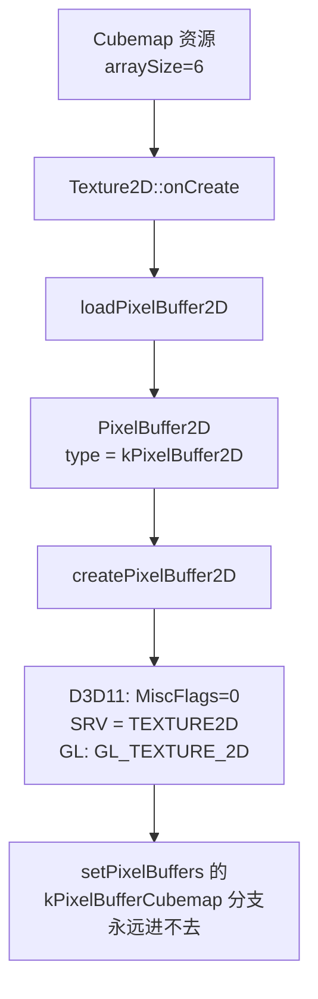
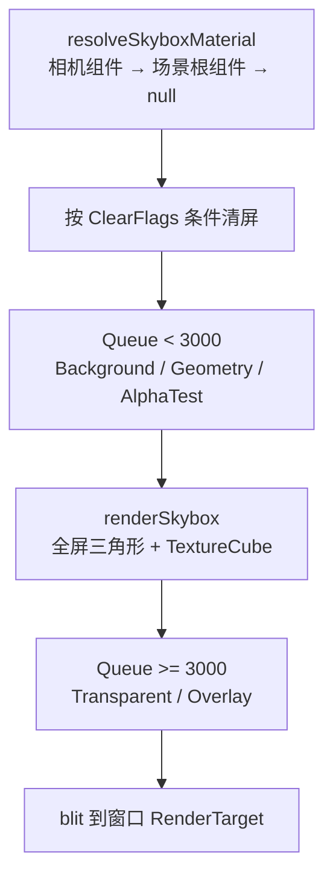
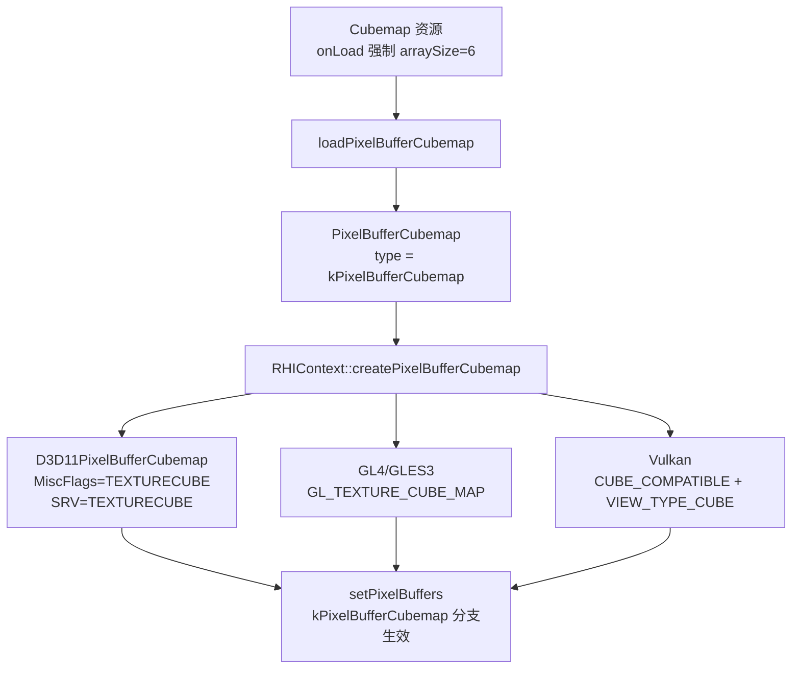

# Skybox 天空盒支持设计与分步计划（对齐 Unity / URP）

> 目标：为 Tiny3D 补齐 **天空盒（Skybox）** 能力 —— 相机可选择用天空盒填充背景，天空盒由 Cubemap 材质描述，在前向管线的「不透明之后、透明之前」绘制。核心思路对齐 Unity：**`Camera.clearFlags = Skybox` + `Skybox` 组件持有天空盒材质 + 内置 `Skybox/Cubemap` shader**，绘制阶段参考 URP 的 `DrawSkyboxPass`。
>
> 前置依赖：引擎当前 **Cubemap 的 GPU 链路是断的**，必须先补齐（见 §4），这是本方案工作量最大的一块。
>
> 本文档为施工蓝图，代码片段均以「建议实现」形式给出并标注现有参考位置，不代表已落地。
>
> 本期只做 **背景可视**，不含 IBL 环境光照（见 §1.2）。

---

## 1. 背景与目标

引擎目前完全没有天空盒：相机背景只能是 `ClearColor` 纯色，`ForwardRenderPipeline::renderForward` 里无条件清 color + depth + stencil；`Scene` 也没有 Unity `RenderSettings` 那样的全局环境配置块。

### 1.1 本期目标

1. `Camera` 增加 `ClearFlags`（Skybox / SolidColor / DepthOnly / Nothing），对齐 Unity 相机背景语义。
2. 新增 `Skybox` 组件持有天空盒材质，支持「相机级覆盖 + 场景级全局」两种作用域。
3. 前向管线新增天空盒绘制阶段，插在不透明队列之后、透明队列之前。
4. 打通 Cubemap 的完整 GPU 链路（引擎层 + D3D11 / GL4 / GLES3 / Vulkan 四后端）。
5. 提供内置 `Skybox-Cubemap` shader、默认渐变 cubemap 与材质，开箱即用。
6. 提供 6 面图 → Cubemap 资产的导入路径。

### 1.2 本期边界（暂不实现）

- **IBL 环境光照**：辐照度图（irradiance）、预过滤镜面反射 mipmap 链、BRDF LUT。天空盒本期只影响背景像素，不参与物体着色。
- 等距柱状全景图（equirectangular）→ cubemap 的 CPU 转换。
- 程序化大气散射天空（Unity `Skybox/Procedural`、UE `SkyAtmosphere`）。
- 6 面独立贴图的天空盒（Unity `Skybox/6 Sided`）—— 本期只做 cubemap 单资源形态。
- DDS / KTX 容器中原生 cubemap 6 面的解析。

---

## 2. 现状分析

### 2.1 缺口与已就绪基础设施对照

| 环节 | 现状 | 结论 |
|------|------|------|
| 相机背景语义 | 无 `ClearFlags`；[`T3DForwardRenderPipeline.cpp:465-469`](../../source/Core/Source/Render/T3DForwardRenderPipeline.cpp) 无条件 `clearColor` + `clearDepthStencil` | 需新增枚举 + 条件清屏 |
| 天空盒数据源 | 无任何天空盒概念；`Scene` 无 RenderSettings 结构 | 用 `Skybox` 组件承载，白嫖反射序列化 |
| 渲染队列 | [`T3DRenderConstant.h:54-66`](../../source/Core/Include/Render/T3DRenderConstant.h) 已有 `kBuiltinQueueBkgnd/Geometry/AlphaTest/Transparent/Overlay` | 可直接用队列号做插入点判定 |
| Cubemap 资源类 | `Cubemap` / `CubemapArray` 已存在（[`T3DTexture.h:329-350`](../../source/Core/Include/Resource/T3DTexture.h)），`TextureManager::createCubemap` 已有（[`T3DTextureManager.cpp:112-118`](../../source/Core/Source/Resource/T3DTextureManager.cpp)） | 资源层壳子齐全 |
| **Cubemap GPU 链路** | **断裂**，详见 §2.2 | **本方案最大工作量** |
| ShaderLab `Cube` 类型 | 词法已支持（[`SLParserLex.l:81-104`](../../source/Tools/ShaderCrossCompiler/Source/Parser/SLParserLex.l)，`%option caseless`），scc 已映射 `kTexDimCUBE → TT_CUBE`（[`T3DShaderCross.cpp:409-421`](../../source/Tools/ShaderCrossCompiler/Source/T3DShaderCross.cpp)） | 工具链无需改动 |
| HLSL `TextureCube` 反射 | D3D11 反射已映射 `D3D11_SRV_DIMENSION_TEXTURECUBE → TT_CUBE`（[`T3DD3D11Mapping.cpp:244-245`](../../source/Plugins/Renderer/Direct3D11/Base/Source/T3DD3D11Mapping.cpp)） | 可直接用 |
| 跨编译 | ShaderConductor（DXC + SPIRV-Cross）会把 `TextureCube` 转成 `samplerCube`；GL4 反射识别 `GL_SAMPLER_CUBE → TT_CUBE` | 全语言变体可用 |
| 代码建 VB + VertexDeclaration | [`ImGuiImplTiny3D.cpp:446-466, 579-605`](../../source/Editor/ImGuiImpl/ImGuiTiny3D/Source/ImGuiImplTiny3D.cpp) 是成熟范例 | 全屏三角形直接套用 |
| 渲染状态 | `ZWrite Off` / `ZTest LEqual` / `Cull Off` 语法均已支持，映射到 `DepthStencilDesc` / `RasterizerDesc` | 无需扩展 |
| 内置资源生成 | `BuiltinGenerator` 的 `BuiltinTextures` / `BuiltinMaterials` / `BuiltinShaders` 流程完备，UUID 靠 `BuiltinGuidUtil::readExistingMetaUUID` 复用 | 照抄新增即可 |

### 2.2 关键缺口：Cubemap GPU 链路是断的

这是必须先解决的前置问题。当前 `Cubemap` 只是一个 `arraySize = 6` 的 2D 纹理，**在 shader 里无法用 `Sample(sampler, float3 dir)` 采样**。

断点分布：

1. **资源层**：`Cubemap` 构造函数只设 `mDesc.arraySize = 6`（[`T3DTexture.cpp:517-521`](../../source/Core/Source/Resource/T3DTexture.cpp)），`onCreate()` 直接转调 `Texture2D::onCreate()`（`T3DTexture.cpp:532-546`），走的是 `loadPixelBuffer2D`（`T3DTexture.cpp:282`）。

2. **引擎层**：**没有 `PixelBufferCubemap` 类**。[`T3DPixelBuffer.h`](../../source/Core/Include/Render/T3DPixelBuffer.h) 只有 1D / 2D / 3D；`T3DPrerequisites.h:231` 与 `T3DTypedef.h:166` 有前向声明和智能指针别名，但无实现。`RenderBufferManager` 也没有 `loadPixelBufferCubemap`（[`T3DRenderResourceManager.h:114-120`](../../source/Core/Include/Render/T3DRenderResourceManager.h)）。

3. **RHI 层**：[`T3DRHIPixelBuffer.h:62-69`](../../source/Core/Include/RHI/T3DRHIPixelBuffer.h) 的 `RHIPixelBufferCubemap` 是空壳；`RHIContext` 只有 `createPixelBuffer1D/2D/3D`（[`T3DRHIContext.h:255-269`](../../source/Core/Include/RHI/T3DRHIContext.h)），**无 `createPixelBufferCubemap`**。

4. **后端层**：`D3D11Context::createPixelBuffer2D`（[`T3DD3D11Context.cpp:1913-1996`](../../source/Plugins/Renderer/Direct3D11/Window/Source/T3DD3D11Context.cpp)）里写死：

   ```cpp
   d3dDesc.MiscFlags = 0;                                        // 1938 行
   d3dSRVDesc.ViewDimension = D3D11_SRV_DIMENSION_TEXTURE2D;     // 1944 行
   ```

   GL4 / GLES3 建的是 `GL_TEXTURE_2D`，Vulkan 建的是普通 2D image + 2D view。

5. **绑定层是死代码**：四后端的 `setPixelBuffers` 里其实**都写了** `kPixelBufferCubemap` 分支（[`T3DD3D11Context.cpp:3510-3512`](../../source/Plugins/Renderer/Direct3D11/Window/Source/T3DD3D11Context.cpp)、[`T3DGL4Context.cpp:3030-3032`](../../source/Plugins/Renderer/OpenGL4/Window/Source/T3DGL4Context.cpp)、[`T3DGLES3Context.cpp:2598-2601`](../../source/Plugins/Renderer/OpenGLES3/Runtime/Source/T3DGLES3Context.cpp)），但因为 RHI 资源类型永远是 `kPixelBuffer2D`，**这些分支永远进不去**。Vulkan 的 `setPSPixelBuffers`（`T3DVKContext.cpp:2247-2265`）连分支都没有。



### 2.3 其它需要注意的现状

- **`arraySize` 不参与序列化**：`Cubemap` 没有 `ArraySize` 的 `TPROPERTY`，`.ttex` 里不会写。反序列化走默认构造时 `PixelBuffer2DDesc::arraySize` 是 1，必须在 `onLoad()` 里兜底改回 6。
- **`SysMemPitch` 算法对 cubemap 不成立**：现有 2D 路径用 `DataSize / height`（`T3DD3D11Context.cpp:1957`），cubemap 的 `DataSize` 是 6 面总和，必须改用 `width * bytesPerPixel`。
- **默认采样器是 Wrap**：`SamplerDesc` 的 `AddressU/V/W` 默认 `kWrap`（[`T3DSamplerState.h:40-79`](../../source/Core/Include/Render/T3DSamplerState.h)），cubemap 应改 `kClamp`，否则面边缘出问题。`Texture::mSamplerState` 初始为 `nullptr`，必须显式调 `setSamplerDesc`。
- **采样器命名约束**：D3D11 反射要求 sampler 变量名以 `sampler` 开头，反射时 `substr(7)` 取 key（[`T3DD3D11ContextBase.cpp:248-269`](../../source/Plugins/Renderer/Direct3D11/Base/Source/T3DD3D11ContextBase.cpp)）。写 shader 时必须是 `TextureCube _Tex; SamplerState sampler_Tex;`。
- **编辑器不会自动把 PNG 转 `.ttex`**：MetaFSMonitor 对 PNG 只生成 `MetaFile`。PNG → `.ttex` 的转换目前只发生在 `BuiltinGenerator` 和 FBX 导入路径。FreeImage 解 DDS 时也只当 2D 图，不解 cubemap 6 面。
- **CMake / 反射是目录扫描**：`source/Core/Runtime/CMakeLists.txt` 用 `set_project_files(Source\\Component ... .cpp)` 按目录收文件，`source/nmake/Core/Runtime/ReflectionSettings.json` 只配 IncludePath 不列文件。新增源文件后**重新生成工程**即可，无需手工登记。

---

## 3. 总体架构设计

### 3.1 技术选型

对标 Unity 内置管线 / URP 的 `DrawSkyboxPass`，采用业界通用组合：

| 维度 | 选型 | 理由 |
|------|------|------|
| 开关 | `Camera.ClearFlags` | 与 Unity 语义一致，用户心智零成本 |
| 数据源 | `Skybox` 组件持 `Material` | 复用反射序列化 / Inspector / Add Component，不改场景文件格式 |
| **几何** | **全屏三角形**（3 顶点，仅 POSITION） | 不需要 mesh 资源；无近远平面裁剪问题；无立方体接缝；天然支持正交相机 |
| 深度 | VS 输出 `z = w`，`ZWrite Off` + `ZTest LEqual` | 落在远平面，被已有不透明像素自然遮挡 |
| 时机 | 不透明之后、透明之前 | 与 URP 一致，靠已有深度剔除掉被遮挡的天空像素，避免全屏 overdraw |
| 方向重建 | `inverse(VP)` 反投影裁剪空间坐标 | 通用，正交/透视都成立 |

> **与 Unity 的差异**：Unity 用一个跟随相机的立方体网格绘制天空盒（因为要兼容 `Skybox/6 Sided`）。本方案用全屏三角形，实现更简单、性能更好，代价是不支持 6 面独立贴图形态 —— 本期不需要。

### 3.2 帧内绘制流程



### 3.3 天空盒材质解析顺序

等价于 Unity 的「`Skybox` 组件覆盖 `RenderSettings.skybox`」：

1. 相机所在 GameObject 上的 `Skybox` 组件
2. 否则场景根 GameObject 上的 `Skybox` 组件（充当全局天空盒）
3. 都没有 → `ClearFlags` 从 `kSkybox` **回退为 `kSolidColor`**

有了第 3 条兜底，`ClearFlags` 默认值取 `kSkybox`（与 Unity 一致）也不会让现有场景出现回归。

### 3.4 补齐后的 Cubemap 链路



---

## 4. Phase 0：补齐 Cubemap GPU 链路（前置）

### 4.1 引擎层新增 `PixelBufferCubemap`

[`T3DPixelBuffer.h`](../../source/Core/Include/Render/T3DPixelBuffer.h) / [`T3DPixelBuffer.cpp`](../../source/Core/Source/Render/T3DPixelBuffer.cpp) 仿照 `PixelBuffer2D` 新增：

```cpp
class T3D_ENGINE_API PixelBufferCubemap
    : public PixelBufferT<RHIPixelBufferCubemap, PixelBuffer2DDesc>
{
public:
    Type getType() const override { return Type::kPixelBufferCubemap; }
protected:
    bool onLoad() override;   // → T3D_AGENT.getActiveRHIContext()->createPixelBufferCubemap(this)
};
```

**复用 `PixelBuffer2DDesc`**（其 `arraySize` 字段已存在，固定填 6），不新增 Desc 类型，减少改动面。

[`T3DRenderResourceManager.h`](../../source/Core/Include/Render/T3DRenderResourceManager.h) / `.cpp` 新增：

```cpp
PixelBufferCubemapPtr loadPixelBufferCubemap(PixelBuffer2DDesc *desc,
    MemoryType memType, Usage usage, CPUAccessMode accMode,
    const UUID &uuid = UUID::INVALID);
```

实现照抄 `loadPixelBuffer2D`（同样走 `loadBuffer<>` 模板 + `mPBufferCache`）。

### 4.2 RHIContext 新增接口

[`T3DRHIContext.h`](../../source/Core/Include/RHI/T3DRHIContext.h) 在 `createPixelBuffer3D`（269 行）旁加**纯虚函数**：

```cpp
virtual RHIPixelBufferCubemapPtr createPixelBufferCubemap(PixelBufferCubemap *buffer) = 0;
```

与 `createPixelBuffer1D/2D/3D` 保持一致的纯虚风格，强制每个后端显式表态，避免「忘了实现却静默走基类默认行为」。**未实现 cubemap 的后端写空实现直接 `return nullptr;`**，与现有 `createPixelBuffer3D` 的处理方式完全一致（例如 `D3D11Context::createPixelBuffer3D` 就是 `return nullptr`）。

`RHIContext` 的继承结构是「5 个 Base 抽象类 + 8 个具体类」，Base 类不实现该接口（保持抽象），**8 个具体类都必须加 override**：

| 具体类 | 文件 | 本期实现 |
|---|---|---|
| `D3D11Context` | `Direct3D11/Window/{Include,Source}/T3DD3D11Context.*` | ✅ 完整实现 |
| `GL4Context` | `OpenGL4/Window/{Include,Source}/T3DGL4Context.*` | ✅ 完整实现 |
| `GLES3Context` | `OpenGLES3/Runtime/{Include,Source}/T3DGLES3Context.*` | ✅ 完整实现 |
| `VKContext` | `Vulkan/Window/{Include,Source}/T3DVKContext.*` | ✅ 完整实现 |
| `D3D11ConsoleContext` | `Direct3D11/Console/{Include,Source}/T3DD3D11ConsoleContext.*` | 空实现 `return nullptr;` |
| `GL4ConsoleContext` | `OpenGL4/Console/{Include,Source}/T3DGL4ConsoleContext.*` | 空实现 `return nullptr;` |
| `VKConsoleContext` | `Vulkan/Console/{Include,Source}/T3DVKConsoleContext.*` | 空实现 `return nullptr;` |
| `NullContext` | `Null/{Include,Source}/T3DNullContext.*` | 空实现 `return nullptr;` |

三个 Console Context 是 scc / BuiltinGenerator 等离线工具用的无窗口上下文（只做 shader 编译与反射，不真正建纹理），Null 是空渲染器，都不需要真实 cubemap，直接返回 `nullptr` 即可 —— 它们现有的 `createPixelBuffer3D` 也都是这么写的。

> `Plugins/Renderer/` 下的 Direct3D9 / Metal / Reference3D 目录没有继承 `RHIContext` 的具体类（未接入当前 RHI 接口），不受此改动影响。

### 4.3 四后端实现

统一约定 6 面顺序为 **+X, -X, +Y, -Y, +Z, -Z**（D3D 与 GL 的 cube face 枚举顺序天然一致），像素数据在 `desc.buffer` 中按此顺序连续排列，单面大小 `width * height * bpp`。

| 后端 | 文件 | 要点 |
|---|---|---|
| **D3D11** | [`T3DD3D11Context.cpp`](../../source/Plugins/Renderer/Direct3D11/Window/Source/T3DD3D11Context.cpp)<br>[`T3DD3D11RenderBuffer.h`](../../source/Plugins/Renderer/Direct3D11/Window/Include/T3DD3D11RenderBuffer.h) | 新增 `D3D11PixelBufferCubemap : public RHIPixelBufferCubemap`（持 `ID3D11Texture2D*` / `ID3D11ShaderResourceView*`）；`ArraySize = 6`、`MiscFlags = D3D11_RESOURCE_MISC_TEXTURECUBE`、SRV `ViewDimension = D3D11_SRV_DIMENSION_TEXTURECUBE` + `TextureCube.MipLevels`；初始数据用 6 个 `D3D11_SUBRESOURCE_DATA`，subresource 索引 = `face * mipLevels + mip` |
| **OpenGL4** | [`T3DGL4Context.cpp`](../../source/Plugins/Renderer/OpenGL4/Window/Source/T3DGL4Context.cpp)（参考 1655-1691 行的 2D 版本） | `glBindTexture(GL_TEXTURE_CUBE_MAP)` + 6 次 `glTexImage2D(GL_TEXTURE_CUBE_MAP_POSITIVE_X + i, ...)`；`GL_TEXTURE_WRAP_S/T/R = GL_CLAMP_TO_EDGE`；`glGenerateMipmap(GL_TEXTURE_CUBE_MAP)` |
| **OpenGLES3** | [`T3DGLES3Context.cpp`](../../source/Plugins/Renderer/OpenGLES3/Runtime/Source/T3DGLES3Context.cpp)（参考 1327-1379 行） | 同 GL4，并**逐面**复用现有的 BGRA → RGBA 通道 swap 逻辑 |
| **Vulkan** | [`T3DVKContext.cpp`](../../source/Plugins/Renderer/Vulkan/Window/Source/T3DVKContext.cpp)（参考 1876-1943 行） | `VkImageCreateInfo.flags |= VK_IMAGE_CREATE_CUBE_COMPATIBLE_BIT`、`arrayLayers = 6`；image view 用 `VK_IMAGE_VIEW_TYPE_CUBE`、`subresourceRange.layerCount = 6`；staging buffer 一次 `vkCmdCopyBufferToImage` 提交 6 个 `VkBufferImageCopy` region |

⚠️ cubemap 路径的 row pitch 必须用 `width * bytesPerPixel` 单独算，不能沿用 2D 路径的 `DataSize / height`。

### 4.4 打通绑定路径

- D3D11 / GL4 / GLES3 的 `setPixelBuffers`（以及 D3D11 `copyBuffer` 的 3309-3311 行）中 `case RHIResource::ResourceType::kPixelBufferCubemap:` 分支目前 cast 到 `*PixelBuffer2D`，改为 cast 到新的 cubemap 类。
- Vulkan 的 `setPSPixelBuffers`（`T3DVKContext.cpp:2247-2265`）新增该分支。

### 4.5 Texture 资源层接入

[`T3DTexture.h`](../../source/Core/Include/Resource/T3DTexture.h) / [`T3DTexture.cpp`](../../source/Core/Source/Resource/T3DTexture.cpp)：

- `Cubemap` 增加自己的 `PixelBufferCubemapPtr mCubeBuffer`，`override getPixelBuffer()` 返回它（基类 `Texture::getPixelBuffer()` 已是虚函数，返回 `PixelBuffer*`）。
- `Cubemap::onCreate()` / `onLoad()` 不再转调 `Texture2D::onCreate/onLoad`，改为调 `Texture::onCreate/onLoad` 后**强制 `mDesc.arraySize = 6`**，再调 `loadPixelBufferCubemap`。
- Cubemap 的默认 `SamplerDesc` 把 `AddressU/V/W` 设为 `kClamp`。

---

## 5. Phase 1：Camera.ClearFlags 与 Skybox 组件

### 5.1 `Camera::ClearFlags`

[`T3DCamera.h`](../../source/Core/Include/Component/T3DCamera.h) 参照已有 `Projection` 枚举（46-53 行）的写法新增：

```cpp
TENUM()
enum class ClearFlags : uint32_t
{
    kSkybox = 0,     // 画天空盒；无天空盒材质时回退为 kSolidColor
    kSolidColor,     // 用 ClearColor 填充（现有行为）
    kDepthOnly,      // 只清深度模板
    kNothing         // 什么都不清
};
```

配 `TPROPERTY` getter/setter（写法参照 86-102 行的 `ClearColor` / `ClearDepth`），成员 `ClearFlags mClearFlags {ClearFlags::kSkybox}`。编辑器 Inspector 会通过 RTTR 自动生成枚举下拉框。

> `T3DCamera.h:77-79` 有注释提醒：反射注册按属性名字母序排列，`HEADER` 分组标题只能在字母序上划边界，且标签必须写成一行。新增属性时注意。

### 5.2 `Skybox` 组件

新增 `source/Core/Include/Component/T3DSkybox.h` + `source/Core/Source/Component/T3DSkybox.cpp`，参照 [`T3DGeometry.h`](../../source/Core/Include/Component/T3DGeometry.h) 的写法：

```cpp
TCLASS()
class T3D_ENGINE_API Skybox : public Component
{
    TRTTI_ENABLE(Component)
    TRTTI_FRIEND
public:
    TPROPERTY(RTTRFuncName="Material", RTTRFuncType="getter")
    const UUID &getMaterialUUID() const { return mMaterialUUID; }

    TPROPERTY(RTTRFuncName="Material", RTTRFuncType="setter")
    void setMaterialUUID(const UUID &uuid);

    Material *getMaterial() const { return mMaterial; }

protected:
    UUID        mMaterialUUID {UUID::INVALID};
    MaterialPtr mMaterial {nullptr};
};
```

选组件而非给 `Scene` 加 `RenderSettings` 结构，是因为组件路径能直接复用现有的反射序列化、Inspector 绘制与 Add Component 流程，不必改场景文件格式。

---

## 6. Phase 2：管线绘制阶段

改 [`T3DForwardRenderPipeline.cpp`](../../source/Core/Source/Render/T3DForwardRenderPipeline.cpp) 的 `renderForward`（444-586 行）。

### 6.1 按 ClearFlags 条件清屏

替换现有 465-469 行的无条件清屏：

```cpp
Material *skyMat = resolveSkyboxMaterial(camera);
Camera::ClearFlags flags = camera->getClearFlags();
if (flags == Camera::ClearFlags::kSkybox && skyMat == nullptr)
    flags = Camera::ClearFlags::kSolidColor;      // 兜底，避免回归

if (flags == kSkybox || flags == kSolidColor)
    ctx->clearColor(camera->getClearColor());
if (flags != kNothing)
    ctx->clearDepthStencil(camera->getClearDepth(), camera->getClearStencil());
```

`clearColor` 与 `clearDepthStencil` 在 `RHIContext` 里本来就是两个独立接口（`T3DRHIContext.h:132` / `147`），可以分别跳过。

### 6.2 在不透明之后插入天空盒

现有队列循环（473-561 行）加一个游标：

```cpp
bool skyDrawn = false;
for (auto itemQueue : itr->second)
{
    if (!skyDrawn && itemQueue.first >= ShaderLab::kBuiltinQueueTransparent)
    {
        renderSkybox(ctx, camera, skyMat);
        skyDrawn = true;
    }
    ... // 现有绘制逻辑
}
if (!skyDrawn) renderSkybox(ctx, camera, skyMat);
```

⚠️ 还要覆盖「相机在 `mRenderQueue` 里没有条目」的情况（空场景仍应画天空盒），即 `mRenderQueue.find(camera) == end()` 时也要直接调 `renderSkybox`。

### 6.3 `renderSkybox` 实现

新增私有方法。参考 [`ImGuiImplTiny3D.cpp`](../../source/Editor/ImGuiImpl/ImGuiTiny3D/Source/ImGuiImplTiny3D.cpp) 中「不依赖 Mesh 资源、代码直接建 VB + VertexDeclaration」的现成范例：

1. **懒加载 VB**：3 个 `Vector3` 顶点，覆盖整个 NDC 的大三角形，走 `T3D_RENDER_BUFFER_MGR.loadVertexBuffer(...)`。
2. **VertexDeclaration 按 VS 缓存**：建 InputLayout 需要 VS 字节码，所以要按 `ShaderVariant*` 做缓存，用法同 `addVertexDeclaration(attrs, vertexShader)`。属性只有一个 `E_VAT_FLOAT3` / `E_VAS_POSITION`。
3. **设置 uniform**：
   - `tiny3d_MatrixInvVP` = `(P * V).inverse()` —— **新增**
   - `tiny3d_CameraWorldPos`、`tiny3d_ProjectionParams` —— 复用现有约定，后者的 `.x` 用于 OpenGL RTT 的 Y 翻转（见 `T3DForwardRenderPipeline.cpp:597-602` 的注释）
4. **复用现有辅助函数**：`setupRenderState(ctx, renderState)` 与 `setupShaders(ctx, material, pass)`；pass 从 `tech->getPassInstances()` 按 `ShaderLab::kBuiltinLightModeForwardBase` 取。
5. **提交**：`ctx->setPrimitiveType(kTriangleList)` → `setVertexDeclaration` → `setVertexBuffers` → `ctx->render(3, 0)`。

---

## 7. Phase 3：内置 Shader / 材质 / 默认 Cubemap

### 7.1 `Skybox-Cubemap.shader`

新增 `assets/editor/builtin/shaders/Skybox-Cubemap.shader`：

```
Shader "Tiny3DBuiltin/Skybox-Cubemap"
{
    Properties
    {
        _Tint ("Tint Color", Color) = (0.5,0.5,0.5,1)
        _Exposure ("Exposure", Range(0,8)) = 1.0
        _Rotation ("Rotation", Range(0,360)) = 0
        _Tex ("Cubemap", Cube) = "" {}
    }
    SubShader
    {
        Tags { "Queue"="Background" "RenderType"="Background" }
        Pass
        {
            Name "SKYBOX"
            Tags { "LightMode" = "ForwardBase" }
            Cull Off
            ZWrite Off
            ZTest LEqual
            CGPROGRAM
            ...
            ENDCG
        }
    }
}
```

HLSL 侧要遵守两条既有约定：

- **采样器命名**：`TextureCube _Tex : register(t0);` + `SamplerState sampler_Tex : register(s0);`
- **cbuffer 隔离**：`tiny3d_MatrixInvVP` 放进**独立的 cbuffer**（如 `Tiny3DSkybox`），不要塞进 [`Tiny3DShaderVariables.cginc`](../../assets/editor/builtin/shaders/Tiny3DShaderVariables.cginc) 的 `Tiny3DPerFrame`，避免动到现有 cbuffer 布局影响所有材质。

VS 关键逻辑：

```hlsl
float4 clip  = float4(v.position.xy, 1.0, 1.0);       // z = w，落在远平面
float4 world = mul(tiny3d_MatrixInvVP, clip);
o.dir        = world.xyz / world.w - tiny3d_CameraWorldPos.xyz;
o.position   = clip;
o.position.y *= tiny3d_ProjectionParams.x;            // OpenGL RTT Y 翻转
```

`z = w` 使 NDC z = 1。D3D 的 [0,1] 与 GL 的 [-1,1] 深度范围下远平面都是 +1，恰好与默认 `ClearDepth = 1.0` 配合 `ZTest LEqual` 通过 —— 无需为两套约定分别处理。

### 7.2 内置资源生成

[`source/Tools/BuiltinGenerator/`](../../source/Tools/BuiltinGenerator/)：

- **`BuiltinTextures`**：新增 `generateDefaultSkybox()`，程序化生成小尺寸（如 32×32×6）天顶 → 地平线渐变 cubemap。流程照抄 [`T3DBuiltinTextures.cpp:63-115`](../../source/Tools/BuiltinGenerator/Source/T3DBuiltinTextures.cpp) 的 `generateDefaultAlbedo`：`readExistingMetaUUID` → `T3D_TEXTURE_MGR.createCubemap(...)` → `setSamplerDesc`（Clamp）→ `saveTexture("skybox_default.ttex")` → 写 `MetaTexture`。
- **`BuiltinMaterials`**：新增 `Skybox-Cubemap.tmat`，`_Tex` 绑到上面的默认 cubemap。
- **`BuiltinShaders`**：自动扫描 `shaders/*.shader`，新 shader 无需登记。

这样即使用户没导入任何贴图，`ClearFlags = Skybox` 也能立刻看到东西。

### 7.3 资源分发：编辑器与 Sample 各持一份

天空盒的 shader / 材质 / 默认 cubemap **编辑器和 Sample 都要用**，但两者的资源目录与挂载机制完全不同，必须显式处理。

#### 现状：两条独立的资源链路

| | 编辑器 TinyEditor | Sample App |
|---|---|---|
| 资源根 | `assets/editor/builtin/`（构建时复制到 `<exe>/Editor/builtin`） | `assets/samples/meshes/` |
| 挂载方式 | `ProjectManager::setupBuiltinAssets` 复制到 `<Project>/Temp/builtin`，MetaFS 挂 priority 2 | `BundleBuilder` 打成 `assets/samples/bundle`，BundleFS 挂 priority 0 |
| `.tshader` 从哪来 | `openProject` 时 `compileAllShaders` 用 scc **现编译**到 `Temp/shaders`（priority 1） | **仓库里直接提交**编译产物 |
| 是否入库 | 只提交 `.shader` 源码；`TempShaders/` 被 [`.gitignore`](../../assets/editor/builtin/.gitignore) 忽略 | `.shader` 和 `.tshader` 都提交 |

#### 既有先例：双份文件 + 相同 UUID

`Tiny3DStandard` / `Default-Material` / `Test-Material` 三个 shader **同时存在于两处**，且 `.meta` 中的 ShaderLab UUID 与 ShaderUUID 完全一致：

```
assets/editor/builtin/shaders/Tiny3DStandard.shader   (+ .meta)
assets/samples/meshes/Tiny3DStandard.shader           (+ .meta，UUID 相同)
assets/samples/meshes/Tiny3DStandard.tshader          (+ .meta，编译产物，已入库)
```

材质与纹理同理（`Tiny3DStandard.tmat` 在两处都有）。**天空盒沿用同一套做法**：

| 文件 | `assets/editor/builtin/` | `assets/samples/meshes/` |
|---|---|---|
| `Skybox-Cubemap.shader` (+ meta) | `shaders/` | ✅ 同 UUID |
| `Skybox-Cubemap.tshader` (+ meta) | `TempShaders/`（不入库） | ✅ 入库 |
| `Skybox-Cubemap.tmat` (+ meta) | `materials/` | ✅ 同 UUID |
| `skybox_default.ttex` (+ meta) | `textures/` | ✅ 同 UUID |

`BuiltinGenerator` 负责生成 editor 侧那一份并**复用 `.meta` 里已有的 UUID**（`BuiltinGuidUtil::readExistingMetaUUID`），因此只要先建好 samples 侧的 `.meta`，两边 UUID 就能长期保持一致。

> **为什么不用 BundleBuilder 的多根特性避免复制？**
> `BundleBuilder` 确实支持重复传 `--assets`（`mAssetRoots`，[`main.cpp:25`](../../source/Tools/BundleBuilder/Source/main.cpp) 的示例就是 `--assets assets/samples --assets Temp/shaders`），理论上可以让 sample bundle 直接扫 `assets/editor/builtin`。
> 但 `assets/editor/builtin/TempShaders/` **被 gitignore 且不入库**，新克隆的仓库里没有 `.tshader`。此时 ShaderLab 的 `.meta` 仍会让 BundleBuilder 写出一条 ALIAS 记录，却找不到对应的散列文件，bundle 静默损坏。除非把 BuiltinGenerator 接进构建流程（目前它只是手工工具，无任何 POST_BUILD 调用它），否则这条路不可靠。

#### 维护建议

双份文件的风险是**静默漂移**（改了 editor 侧忘了同步 samples 侧）。建议加一个 CMake 自定义 target（如 `sync_builtin_to_samples`）做 `copy_if_different`，把 `Skybox-Cubemap.*` 与 `skybox_default.ttex` 从 editor 侧同步到 samples 侧，作为改 shader 后的显式一步。不阻塞主线，但能避免后续踩坑。

---

## 8. Phase 4：Cubemap 资产导入

最小可用方案：

1. `TextureManager` 新增 `createCubemapFromImages(const String &name, Image *faces[6], const UUID &uuid)`：校验 6 张图尺寸 / 格式一致，按 +X, -X, +Y, -Y, +Z, -Z 拼成连续 `Buffer`，转调已有的 `createCubemap`。
2. `BuiltinGenerator` 扫描 `textures/cubemaps/<name>/` 下的 `px|nx|py|ny|pz|nz.png`，批量产出 `<name>.ttex` + meta。
3. 编辑器菜单项 `Assets > Create > Cubemap from 6 Images` 作为可选后续，不阻塞主线。

等距柱状全景图 → cubemap 的 CPU 转换、DDS / KTX cubemap 解析，留作后续扩展点。

---

## 9. Phase 5：SkyboxApp 与验证

### 9.1 SkyboxApp 的资源加载方式

Sample 有两种既有范式，天空盒必须选**走 AssetManager** 的那种：

| 范式 | 代表 | 是否适用 |
|---|---|---|
| 代码内嵌 shader + 程序化 mesh，完全不读 `assets/` | `PointLightApp`、`GeometryApp` | ❌ 天空盒要加载 `.tmat` + cubemap `.ttex`，硬编码不现实 |
| 挂载 bundle，走 `T3D_ASSET_MGR` | `ResourceApp` | ✅ **采用这个** |

因此 **SkyboxApp 照 `ResourceApp` 起手，而不是 `PointLightApp`**。挂载代码（参考 [`ResourceApp.cpp:99-107`](../../source/Samples/ResourceApp/ResourceApp.cpp)）：

```cpp
const String bundlePath = Dir::getResourcePath("assets/samples/bundle");
ArchivePtr bundle = T3D_ARCHIVE_MGR.loadArchive(
    bundlePath, ARCHIVE_TYPE_BUNDLE, Archive::AccessMode::kRead);
T3D_ASSET_MGR.init(AssetManager::Mode::kRuntime);
T3D_ASSET_MGR.mount(bundle, 0);

MaterialPtr skyMat = T3D_ASSET_MGR.loadMaterial("Skybox-Cubemap.tmat");
skybox->setMaterialUUID(skyMat->getUUID());
```

`Dir::getResourcePath()` 在 Windows 下等价于 `getAppPath() + logicalPath`，在 Android 下返回 APK `assets/` 内的相对路径，**两端同一份代码**。材质对 cubemap 的引用在 bundle 内按 UUID 自动解析，无需手动加载纹理。

### 9.2 CMake：打 bundle + 复制到运行目录

照抄 [`ResourceApp/CMakeLists.txt:95-115`](../../source/Samples/ResourceApp/CMakeLists.txt) 的两条 POST_BUILD：

```cmake
add_custom_command(TARGET ${BIN_NAME} POST_BUILD
    COMMAND $<TARGET_FILE:BundleBuilder>
        --assets "${SAMPLES_MESHES_DIR}"
        --out    "${SAMPLES_BUNDLE_DIR}"
        --binary
    WORKING_DIRECTORY $<TARGET_FILE_DIR:BundleBuilder>)

add_custom_command(TARGET ${BIN_NAME} POST_BUILD
    COMMAND ${CMAKE_COMMAND} -E copy_directory
        "${SAMPLES_BUNDLE_DIR}"
        "$<TARGET_FILE_DIR:${BIN_NAME}>/Assets/samples/bundle")
```

以及同样的 `add_dependencies(${BIN_NAME} BundleBuilder FileSystemArchiveEditor MetaFSArchiveEditor NullRendererEditor)` —— BundleBuilder 运行时要按 exe 目录加载这几个编辑器插件。

因为天空盒资源已经放进 `assets/samples/meshes/`（§7.3），这里**不需要额外的 `--assets` 根**，与 ResourceApp 的命令行完全一致，两个 sample 共用同一个 bundle。

### 9.3 验证点

- 场景：一个相机 + `Skybox` 组件 + 一个 cube。
  - 天空盒随相机旋转正确
  - 被不透明物体正确遮挡（不是画在物体上面）
  - 切换四种 `ClearFlags` 行为正确
  - 无天空盒材质时正确回退为纯色
- 编辑器侧同步验证：新建工程 → `openProject` 后 builtin 里能看到 `Skybox-Cubemap.tmat`，Inspector 里能给相机的 `Skybox` 组件挂上。
- 主力后端 **D3D11 先跑通**，再逐个验证 GL4 / GLES3 / Vulkan。
- 用 RenderDoc 抓帧确认 SRV 维度是 TextureCube、6 个 subresource 内容正确。

---

## 10. 风险与注意事项

| 风险 | 说明 | 缓解 |
|------|------|------|
| **多后端 cubemap 一致性** | Y 轴朝向与 face 顺序在 D3D / GL / VK 之间极易不一致，上下面颠倒是最常见症状 | 准备一张 6 面带明显方向文字标记的测试贴图，逐面核对 |
| **反射与工程需重生成** | 新增 `TCLASS` / `TENUM` 后必须重跑 `reflect_core_runtime` / `reflect_core_editor` 并重新生成 VS 工程，否则 `Skybox` 组件无法序列化、Inspector 里也看不到 `ClearFlags` | 纳入施工检查清单 |
| **`.tshader` 需重新烘焙** | 新 shader 必须用 `scc ... -t hlsl,glsl,essl,spirv` 出全语言变体，否则切后端时 `Pass::compile()` 会报 "bundle may not be baked for the active renderer" | 生成脚本统一带全语言参数 |
| **`arraySize` 反序列化丢失** | `.ttex` 不写 `ArraySize`，反序列化后是 1 | `Cubemap::onLoad()` 强制改回 6 |
| **editor / samples 双份资源漂移** | 天空盒资源在两处各存一份（§7.3），改了一边忘了另一边会导致 Sample 与编辑器表现不一致，且 UUID 一旦不同就彻底断链 | 加 `sync_builtin_to_samples` 的 CMake target 做 `copy_if_different`；改 shader 后必须两边同步 |
| **透明物体无深度排序** | 现有管线的透明队列内没有 back-to-front 排序，天空盒插在透明之前不会加剧这个问题，但相关缺陷仍在 | 本期不处理，记录为已知问题 |

---

## 11. 涉及文件清单

### 新增

| 文件 | 说明 |
|------|------|
| `source/Core/Include/Component/T3DSkybox.h` / `Source/Component/T3DSkybox.cpp` | Skybox 组件 |
| `assets/editor/builtin/shaders/Skybox-Cubemap.shader` (+ meta) | 内置天空盒 shader 源码（编辑器侧） |
| `assets/editor/builtin/materials/Skybox-Cubemap.tmat` (+ meta) | 内置天空盒材质（编辑器侧） |
| `assets/editor/builtin/textures/skybox_default.ttex` (+ meta) | 默认渐变 cubemap（编辑器侧） |
| `assets/samples/meshes/Skybox-Cubemap.{shader,tshader,tmat}` (+ meta) | Sample 侧镜像，**UUID 与 editor 侧一致**，`.tshader` 需入库 |
| `assets/samples/meshes/skybox_default.ttex` (+ meta) | Sample 侧镜像 |
| `source/Samples/SkyboxApp/` | 验证示例（照 `ResourceApp` 起手，挂 bundle） |
| 各后端 `*PixelBufferCubemap` 类 | D3D11 / GL4 / GLES3 / Vulkan |

### 修改

| 文件 | 改动 |
|------|------|
| [`Render/T3DPixelBuffer.h/.cpp`](../../source/Core/Include/Render/T3DPixelBuffer.h) | 新增 `PixelBufferCubemap` |
| [`Render/T3DRenderResourceManager.h/.cpp`](../../source/Core/Include/Render/T3DRenderResourceManager.h) | 新增 `loadPixelBufferCubemap` |
| [`RHI/T3DRHIContext.h/.cpp`](../../source/Core/Include/RHI/T3DRHIContext.h) | 新增 `createPixelBufferCubemap` 虚函数 |
| [`Resource/T3DTexture.h/.cpp`](../../source/Core/Include/Resource/T3DTexture.h) | `Cubemap` 改走 cubemap 路径 |
| [`Resource/T3DTextureManager.h/.cpp`](../../source/Core/Include/Resource/T3DTextureManager.h) | 新增 `createCubemapFromImages` |
| [`Component/T3DCamera.h/.cpp`](../../source/Core/Include/Component/T3DCamera.h) | 新增 `ClearFlags` |
| [`Render/T3DForwardRenderPipeline.h/.cpp`](../../source/Core/Source/Render/T3DForwardRenderPipeline.cpp) | 条件清屏 + `renderSkybox` |
| [`T3DD3D11Context.cpp`](../../source/Plugins/Renderer/Direct3D11/Window/Source/T3DD3D11Context.cpp) 等四个主力后端 Context | cubemap 创建 + 绑定分支 |
| `D3D11ConsoleContext` / `GL4ConsoleContext` / `VKConsoleContext` / `NullContext` | 补 `createPixelBufferCubemap` 空实现（`return nullptr;`），满足纯虚约束 |
| [`Tools/BuiltinGenerator/`](../../source/Tools/BuiltinGenerator/) | 默认 cubemap + 天空盒材质 + 6 面图导入 |
