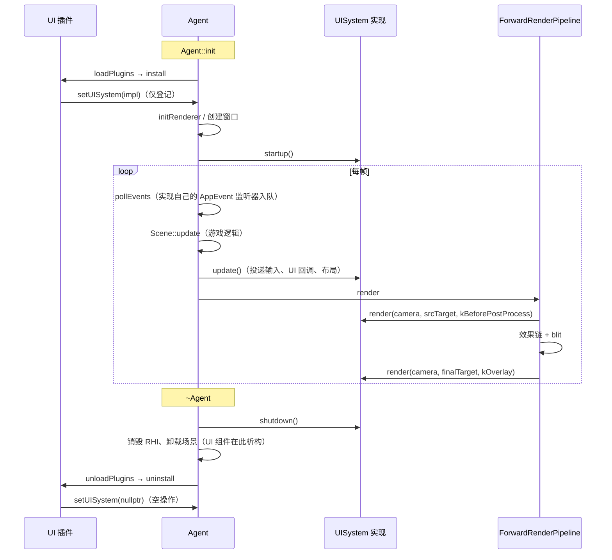

# 运行时 UI 系统接口设计（Core 侧）

> 目标：Core 定义一套抽象的运行时 UI 接口 `UISystem`，具体 UI 方案（当前选型 RmlUi）在独立模块里实现并注册给 `Agent`。Core 在生命周期的关键点直接调用接口，不依赖任何具体 UI 库；将来更换 UI 方案，只需重新实现这套接口，引擎侧的接入点不变。
>
> 本文档为施工蓝图，代码片段均以「建议实现」形式给出并标注现有参考位置，不代表已落地。
>
> 相关文档：
> - [`RmlUi-Integration-Design-todo.md`](RmlUi-Integration-Design-todo.md)：本接口的第一个实现。
> - [`Runtime-UI-System-Design-todo.md`](Runtime-UI-System-Design-todo.md)：此前的自研 UI 方案，UI 本体部分已被 RmlUi 方案取代。

---

## 1. 背景：Core 够不着 UI 的几个地方

运行时 UI 作为可选的独立模块（`T3DRmlUi` 链接 `T3DCore`），依赖方向决定了 Core 不能直接调用它。但有几件事必须由 Core 在特定时机触发：

| 需求 | 时机 | 不能交给 UI 模块自己做的原因 |
|------|------|------------------------------|
| 释放 UI 的 GPU 资源与全局缓存 | `~Agent` 中 RHI 销毁之前 | 插件的 `shutdown()` 在 `~Agent` 末尾的 `unloadPlugins()`（`T3DAgent.cpp:248`）才执行，那时 RHI（`:117-126`）和渲染资源管理器（`:219-220`）早已销毁。渲染后端自己也是插件，不能把所有插件的关闭整体提前 |
| 在后处理之后绘制屏幕空间 UI | 每台相机效果链与 blit 之后（`T3DForwardRenderPipeline.cpp:591-595` 之间） | 管线现有的钩子都在效果链之前（`onPostRender`，`:566`）；`Application::onRender` 拿不到相机与它的最终目标 |
| 刷新布局与数据绑定 | 所有游戏逻辑（含 `onLateUpdate`）之后 | 由 UI 组件的 `onUpdate` 做，顺序取决于组件更新队列，不确定 |
| 屏蔽 UI 点击穿透 | 游戏逻辑读输入时 | 游戏代码、编辑器若要查询，就得链接具体 UI 模块 |
| 编辑器卸载业务 DLL 前清理 UI | `PlayModeController::unloadGamePlugin` | 编辑器若要通知，就得认识具体 UI 模块 |

### 1.1 考虑过的方案

| 方案 | 问题 |
|------|------|
| Agent 提供「拆除前回调」列表（`addPreShutdownCallback`） | 只解决关闭顺序；多一套注册机制和顺序约定 |
| `Plugin` 增加 `preShutdown()` 虚函数 | 只解决关闭顺序；让所有插件的生命周期变复杂 |
| `CameraBehaviour` 增加 `onRenderOverlay` 虚函数 | 只解决绘制时机；多个 UI 组件之间的绘制顺序、输入分发仍无人统筹 |
| **Core 定义 `UISystem` 接口，UI 模块实现并注册** | 一次性覆盖上表全部需求；与渲染器的组织方式一致 |

### 1.2 先例：渲染器

引擎已有完全相同的结构：Core 定义 `RHIRenderer` 抽象，D3D11 / GL4 / Vulkan / Metal 插件实现后在 `install` 时调用 `T3D_AGENT.addRHIRenderer`（`T3DAgent.h:294`，示例 `T3DMetalPlugin.cpp:66`），`uninstall` 时 `removeRHIRenderer`；Agent 只持有接口，在 `~Agent` 中直接调用 `destroy()`。UI 照搬这套做法，插件接口本身不需要任何改动。

---

## 2. 设计边界

### 2.1 接口覆盖什么

**只覆盖「引擎需要调用 UI」的部分**：

- 生命周期：启动、关闭。
- 帧驱动：每帧更新、按相机绘制。
- 查询：指针是否在 UI 上、UI 是否占用键盘。
- 编辑器配合：卸载业务代码前释放所有 UI 实例。

### 2.2 接口不覆盖什么

**UI 本身的编写 API 留在实现模块里**，包括：UI 描述文件（RmlUi 的 RML / RCSS）、数据绑定、DOM / 控件操作、UI 组件（如 `RmlCanvas`）、脚本绑定。

理由：不同 UI 库的编写模型差异极大（HTML/CSS 式、UGUI 式的 `RectTransform` 树、即时模式），强行抽象只会得到一个最小公分母，或者是一层漏风的包装。

由此带来的结论需要说清楚：**更换 UI 方案时，引擎侧接入点不用动；但 UI 资源和 UI 逻辑代码（布局文件、数据绑定、对控件的调用）仍需要重写。** 这是任何 UI 抽象都免不了的，接口不应假装能做到。

### 2.3 其它约定

- **同一时刻只有一套 UI 实现**：单槽位，不像渲染器那样维护列表。
- **编辑器 ImGui 不在此列**：ImGui 是编辑器自身的界面，不进 Player，与本接口无关。
- **可选**：未加载任何 UI 实现时，`Agent::getUISystem()` 返回 `nullptr`，所有调用点判空后跳过，没有额外开销。

---

## 3. 接口定义

```cpp
// 建议实现：source/Core/Include/UI/T3DUISystem.h
namespace Tiny3D
{
    /**
     * \brief 运行时 UI 的绘制阶段
     */
    enum class UIRenderPhase : uint32_t
    {
        /// 场景绘制之后、相机效果链之前，UI 会参与后处理（对齐 Unity Screen Space - Camera）
        kBeforePostProcess = 0,
        /// 相机效果链与 blit 之后，UI 不受后处理影响（对齐 Unity Screen Space - Overlay）
        kOverlay,
    };

    /**
     * \brief 运行时 UI 系统接口
     * \remarks 由 UI 实现模块（如 T3DRmlUi）实现，并在插件 install 时通过
     *          Agent::setUISystem 注册。所有方法都在主线程调用。
     */
    class T3D_ENGINE_API UISystem : public Object
    {
    public:
        /// 实现名称，用于日志
        virtual const String &getName() const = 0;

        /**
         * \brief 启动
         * \remarks 调用时 RHI、渲染资源管理器、AssetManager 均已就绪。
         *          失败时 Agent 记录错误并注销该实现，引擎继续运行。
         */
        virtual TResult startup() = 0;

        /**
         * \brief 关闭，释放全部 GPU 资源与全局缓存
         * \remarks 在 ~Agent 最开始调用，此时 RHI 与资源管理器仍然有效、场景尚未卸载。
         *          调用之后不会再收到 update / render；之后才销毁的 UI 组件必须能容忍这一点。
         */
        virtual void shutdown() = 0;

        /**
         * \brief 每帧更新
         * \remarks 在 Agent::update 中 Scene::update 之后调用。实现在这里投递本帧输入、
         *          执行 UI 回调、刷新布局与数据绑定。编辑模式下同样调用（用于静态预览），
         *          是否处理输入由实现根据 T3D_INPUT.isEnabled() 决定。
         */
        virtual void update() = 0;

        /**
         * \brief 绘制某台相机上的 UI
         * \param [in] ctx : RHI 上下文；进入时上一个 pass 已结束
         * \param [in] camera : 当前相机；该相机没有 UI 时实现应立即返回
         * \param [in] target : 本阶段的绘制目标。kBeforePostProcess 为相机源目标，
         *                      kOverlay 为相机最终目标（窗口或 RT）
         * \param [in] phase : 绘制阶段
         * \remarks 需自行 setRenderTarget + beginPass / endPass，不要清屏；
         *          退出时无需 reset，管线随后会 reset。不得在这里执行任何 UI 回调或改动布局。
         */
        virtual void render(RHIContext *ctx, Camera *camera, RenderTarget *target, UIRenderPhase phase) = 0;

        /// 指针是否落在可交互的 UI 上（截至最近一次 update）
        virtual bool isPointerOverUI() const = 0;

        /// 是否有 UI 输入框占用键盘（截至最近一次 update）
        virtual bool wantsKeyboard() const = 0;

        /**
         * \brief 释放所有 UI 实例，以及可能引用业务代码的缓存
         * \remarks 编辑器卸载业务插件 DLL 之前调用。调用后 UI 系统仍可继续使用，
         *          新创建的 UI 组件照常工作。
         */
        virtual void releaseAll() = 0;
    };
}
```

```cpp
// 建议实现：T3DTypedef.h（同 T3DTypedef.h:188 的 RHIRenderer）
T3D_DECLARE_SMART_PTR(UISystem);
```

```cpp
// 建议实现：T3DAgent.h
/**
 * \brief 注册运行时 UI 实现；传 nullptr 表示注销
 * \return 已有其它实现注册时返回错误，不替换
 * \remarks 插件 install 时调用。渲染器尚未初始化时只登记，由 Agent::init
 *          在渲染器与窗口就绪后调用 startup；否则立即 startup。
 */
TResult setUISystem(UISystemPtr system);

/// 当前 UI 实现；未加载 UI 时为 nullptr
UISystem *getUISystem() const { return mUISystem.get(); }

UISystemPtr mUISystem {nullptr};
bool        mUISystemStarted {false};
```

**为什么 `isPointerOverUI` / `wantsKeyboard` 是「截至最近一次 update」**：`update` 排在 `Scene::update` 之后，所以游戏代码在 `onUpdate` 里读到的是上一帧末的结果。这与 ImGui 的 `WantCaptureMouse` 同性质，对屏蔽点击穿透足够；如需本帧精确结果，游戏逻辑应在 UI 回调里处理点击，而不是事后查询。

---

## 4. Core 调用点

| 调用 | 位置 | 说明 |
|------|------|------|
| `startup()` | `Agent::init`：`initRenderer()`（`T3DAgent.cpp:428`）与默认窗口创建（`:434-445`）之后、`applicationDidFinishLaunching`（`:450`）之前；`Settings` 版本的 `init`（`:462` 起）同理 | 插件在 `initRenderer` 之前加载（`:421`），注册时 RHI 还未就绪，所以推迟到这里。放在 `applicationDidFinishLaunching` 之前，应用在启动回调里就能创建 UI |
| `update()` | `Agent::update`：`scene->update()`（`:892`）之后 | 场景不存在时同样调用，UI 可以独立于场景存在（如启动加载界面） |
| `render(..., kBeforePostProcess)` | `ForwardRenderPipeline::renderForward`：`invokeCameraBehaviours(ctx, camera, false)`（`T3DForwardRenderPipeline.cpp:566`）之后 | `target` 传 `rt`（相机源目标，没有源目标时即最终目标） |
| `render(..., kOverlay)` | 同上：blit（`:591`）之后、`ctx->reset()`（`:595`）之前 | `target` 传 `camera->getRenderTarget()` |
| `shutdown()` | `~Agent`：`mFrameEndTasks.clear()`（`:110`）之后、`stopRenderThread()`（`:117`）之前；调用后 `mUISystem = nullptr` | 先于 RHI 销毁、场景卸载。后续插件 `uninstall` 里的 `setUISystem(nullptr)` 成为空操作 |
| `releaseAll()` | `PlayModeController::unloadGamePlugin`：`flushPendingDestroys()`（`PlayModeController.cpp:210`）之后、`T3D_AGENT.unloadPlugin` 之前 | 打开工程、热重载、关闭工程都经过这个函数，一处覆盖所有卸载路径 |
| `wantsKeyboard()` | `EditorApp` 的输入门控（`EditorApp.cpp:879-897`） | Play 模式下 UI 输入框获得焦点时，ImGui 不再控制系统文本输入，避免互相关闭输入法 |
| `isPointerOverUI()` | 游戏代码 / 脚本 | 可选在 Core `Input` 上加便捷转发 `Input::isPointerOverUI()`，内部判空后转调 |

编辑器中，编辑器场景相机与 GameView 相机都会经过 `renderForward`。实现按相机判断有没有 UI，编辑器相机上不挂 UI 组件，自然不绘制。

---

## 5. 生命周期时序



---

## 6. 实现方须遵守的约定

| 方面 | 约定 |
|------|------|
| 注册 | 插件 `install` 中 `setUISystem`，`uninstall` 中 `setUISystem(nullptr)`。注册失败（已有其它实现）时插件应放弃初始化并返回错误 |
| 输入 | 实现自行注册 `IAppEventListener`（`Application::addEventListener`），事件只入队，在 `update()` 中投递。投递前检查 `T3D_INPUT.isEnabled()`，坐标经 Core `Input` 的指针映射转换（编辑器 GameView 需要，见 RmlUi 文档 §6.2） |
| 回调时机 | 所有 UI 回调（事件、数据绑定）只在 `update()` 中执行。`render()` 只绘制，保证渲染阶段不会运行游戏代码或脚本 |
| 绘制 | 进入 `render()` 时上一个 pass 已结束；自行 `setRenderTarget + setViewport + beginPass`，不清屏，结束时 `endPass`。不得假设继承任何渲染状态 |
| 开销 | `render()` 对每台相机、每个阶段都会调用，相机没有 UI 时必须廉价返回 |
| GPU 资源 | 只通过 `RHIContext` 与渲染资源管理器创建和使用；释放靠丢弃智能指针，交给资源管理器 `GC()`（`T3DAgent.cpp:735-736`），RHI 线程开启时同样安全 |
| 关闭 | `shutdown()` 必须释放全部 GPU 资源。之后才析构的 UI 组件（场景在 `shutdown` 之后卸载）不得再访问 GPU 资源，只做登记的注销 |
| UI 组件 | 由实现模块定义并通过 RTTR 注册，Core 不认识它们。需要在编辑模式预览的组件应 `executeInEditMode`（`T3DGameObject.cpp:60-70`） |
| 业务代码引用 | `releaseAll()` 之后，实现内部不得再持有任何指向业务插件代码的函数指针、虚表或回调 |

---

## 7. 现有代码改动清单

| # | 文件 | 改动 |
|---|------|------|
| 1 | 新增 `source/Core/Include/UI/T3DUISystem.h`、`source/Core/Source/UI/T3DUISystem.cpp` | 接口与 `UIRenderPhase`；cpp 只放空的析构实现 |
| 2 | `source/Core/Include/T3DTypedef.h` | `T3D_DECLARE_SMART_PTR(UISystem)` |
| 3 | `source/Core/Include/Kernel/T3DAgent.h`、`T3DAgent.cpp` | `setUISystem / getUISystem`；`init` 两个版本中调用 `startup`；`update` 中调用 `update`；`~Agent` 开头调用 `shutdown` |
| 4 | `source/Core/Source/Render/T3DForwardRenderPipeline.cpp` | `renderForward` 两处调用 `render` |
| 5 | `source/Editor/TinyEditor/PlayModeController.cpp` | `unloadGamePlugin` 中调用 `releaseAll` |
| 6 | `source/Editor/TinyEditor/EditorApp.cpp` | 文本输入门控查询 `wantsKeyboard` |
| 7 | `source/Core/Include/Input/T3DInput.h/.cpp`（可选） | `isPointerOverUI()` 便捷转发 |

编辑器不需要链接任何具体 UI 模块：Add Component 依赖 RTTR（UI 插件经 `Tiny3D.cfg` 加载即注册），其余交互全部经过本接口。

---

## 8. 验证

接口可以**先于任何 UI 库落地**，用一个测试实现验证调用点：

- 在 `source/Samples/` 中写一个 `DebugUISystem`：`render(kOverlay)` 画一个半透明色块，`render(kBeforePostProcess)` 画另一个色块，`update` 统计帧数，`isPointerOverUI` 在鼠标位于色块内时返回 true。
- **验收**：
  - 相机挂灰度等后处理时，`kOverlay` 色块保持原色，`kBeforePostProcess` 色块被处理。
  - D3D11 / GL4 / Vulkan 下 `kOverlay` 色块下方的场景内容保留（验证不清屏，见 §9 第 1 项）。
  - 编辑器 GameView 显示色块，Scene View 不显示。
  - 退出引擎时 `shutdown` 先于 RHI 销毁被调用，无崩溃、无泄漏。
  - 编辑器热重载业务插件时 `releaseAll` 被调用。

---

## 9. 待确认项

| # | 问题 | 验证方式 |
|---|------|---------|
| 1 | Vulkan 后端在不调用 `clearColor` 时 `beginPass` 的 loadOp 是否为 `LOAD` | 读 `VKContext::beginPass`；§8 的半透明色块实测 |
| 2 | `ctx->reset()` 是否恢复 scissor 与 stencil 状态 | 读各后端 `reset()`；UI 设置 scissor 后下一台相机是否被裁 |
| 3 | 相机直接渲染到窗口（无源 RT）时，两个阶段的 `target` 相同，`kBeforePostProcess` 与 `kOverlay` 是否都能正确绘制 | §8 测试实现在无后处理的窗口相机上实测 |
| 4 | 无窗口的控制台应用（`ConsoleApplication`）加载 UI 插件时的行为 | 预期 `startup` 失败并被注销；实测确认不崩溃 |
