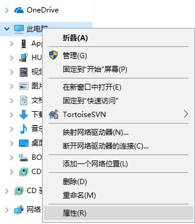
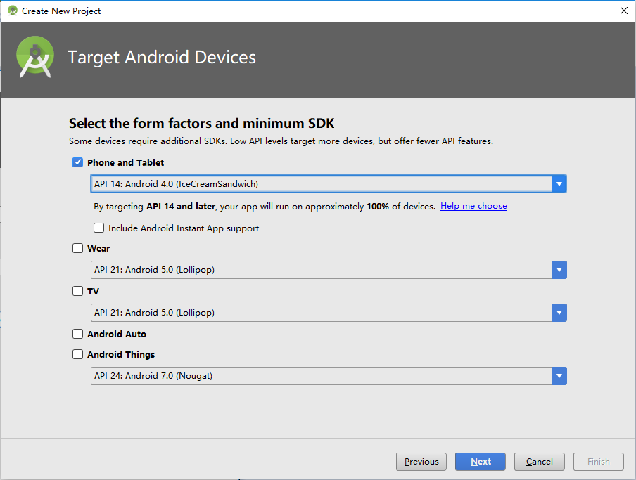
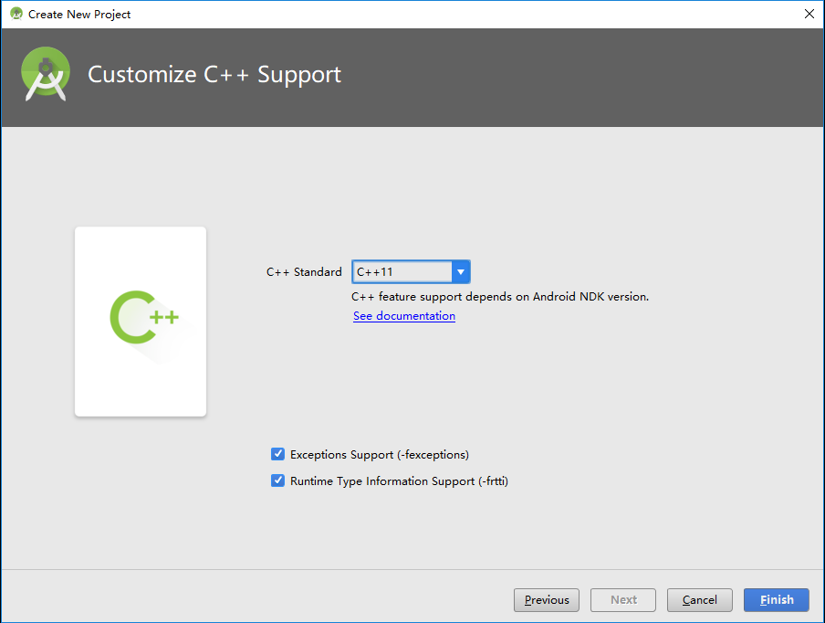
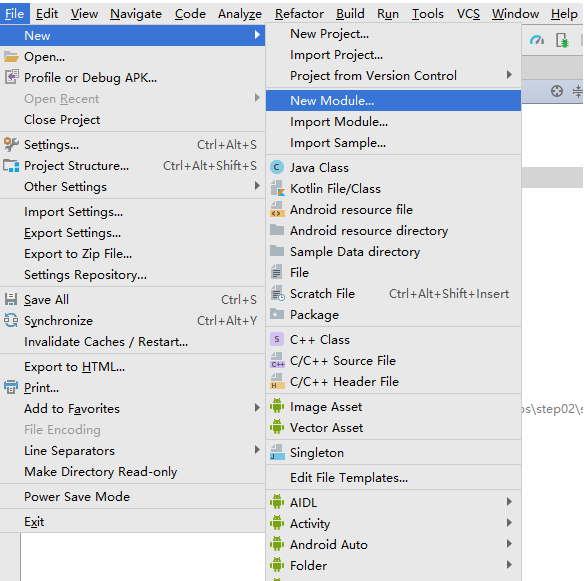
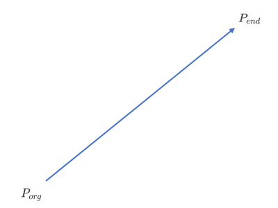
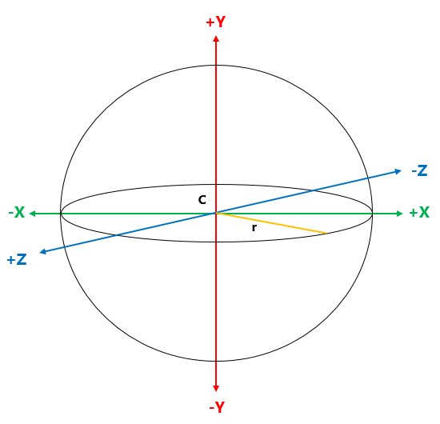

# 一起动手实现3D渲染引擎（Tiny3D ）
A Tiny 3D Engine

[TOC]


​　　我曾经做过许多游戏非游戏类项目或者Demo，但是从来没有认真的把这中间的过程记录下来。写这些系列文章主要目的就是自己亲自动手实现一个渲染引擎，并且把中间经历过的所有都记录下来，作为一种沉淀积累以作未来回顾，做到温故而知新。有兴趣的小伙伴，可以跟着一起来动手实现一个渲染引擎。好，闲话休叙，那下面开始我们这段旅程。

# 一、整体设计

本篇目标

- 了解整体目标
- 了解整体架构设计

## 1.1 整体目标

　　所有事情开始都需要设定一个目标，只有一步一个脚印的向着明确目标走下去，才能到达终点。所以在这里我们简单设定一个设计目标，简单点说就是我们最终要完成的3D渲染引擎具备什么功能。以下简单罗列功能点：

1. 跨平台。支持：Windows、Mac OS X、iOS、Android、Linux五个主流的桌面平台和移动平台
2. 跨渲染API。支持：Open GL (3.0、4.0)、OpenGL ES（2.0、3.0）、Vulkan、DirectX 9、DirectX 11
3. 日志系统。支持：输出到文件和平台相关Console以方便定位问题
4. 数学库。支持：2D向量、3D向量、4D向量、四元素、3x3矩阵、4x4矩阵、三角函数、平面、距离运算、AABB碰撞检测、OBB碰撞检测、Sphere碰撞检测等
5. 内存管理。支持：智能指针
6. 场景管理。支持：内置默认场景管理器、场景剔除、简单Scene Graph组织场景物体、各种渲染物体对象
7. 渲染器。支持：不同渲染API使用统一接口通过插件形式无缝替换不同渲染API
8. 渲染队列。支持：对不同材质的物体做渲染队列的分层来实现渲染和提高渲染性能
9. 资源管理。支持：动态库、纹理、材质、网格、地形、字体、档案等资源的统一管理
10. 插件系统。支持：动态加载以切换不同的插件库
11. 图片加载系统。支持：PNG、JPG、JPEG、TGA、DDS、ETC、PVR等各种常用图片格式的图片加载和保存
12. 模型数据加载系统。支持：自定义格式模型文件加载和保存
13. 材质脚本系统。支持：vertex shader、fragment shader、HLSL的编译、HLSL到GLSL之间转译、材质参数的设定
14. 地形系统。支持：简单的高度图地形
15. 粒子系统。支持：粒子发射器、粒子的批次渲染、粒子缓存复用
16. 光照系统。支持：默认光照（顶点光照、像素光照）
17. 动画系统。支持：骨骼动画、软件蒙皮和硬件蒙皮
18. 字体管理。支持：TTF字体、BMFont字体
19. 事件系统。支持：事件注册、事件分发
20. FBX转自定义格式的工具。支持：支持在Windows上把FBX格式文件转换成自定义格式文件，方便引擎加载

从上面简单罗列来看，已经有很多功能了，看起来不可能完成，但是这个就是我们目标，我们不去尝试，怎么就知道无法实现呢？接下来，让我们一起朝着这个目标出发，前进！！！


## 1.2 整体架构

　　从上面目标来看，我们有很多功能点需要做。正所谓万丈高楼平地起，地基是需要打好的，所以下面我们来看看我们的整体架构设计，架构设计合理才能让我们后面的旅程事半功倍。我们就专业点来看看架构设计图：


<center>图1-1 整体架构设计</center>

从图1-1来看，我们分成几大模块：

1. **Platform** —— 平台库，专门实现跨平台的功能，给上层提供平台无关的接口，统一平台的底层处理
2. **Plugins** —— 各种插件，引擎核心功能之外的各种可通过外部插件替换功能的插件
3. **3rd Party** —— 虽然我们引擎都是自己造车实现的，但是非引擎功能的部分，我们还是借助一些第三方库来实现其功能就好了
4. **Core** —— 渲染引擎核心模块，场景管理、资源管理、数学库、插件系统、渲染器、渲染队列、渲染对象、日志系统、事件系统等都在这里面实现了。当然，我们最后还是会简单分成多个库以实现可重用的模块分离。

简单的就说这么多了，下面按照这个标着目标的地图来逐步前进吧

# 二、开发环境

本篇目标

- Windows上搭建Windows开发环境
- Windows上搭建Android开发环境
- Mac OS X上搭建Mac OS X开发环境
- Mac OS X上搭建iOS开发环境

　　既然要开发，首先面对的是使用什么开发语言，这里的3D渲染引擎主要是使用C++来实现。为啥使用C++？因为性能好呀。那C更快，为啥不用C？因为C没有面向对象，抽象行为的实现比较麻烦，当然不是不能实现。那其他语言呢？实话实说，其他语言我也不精通啊，所以我们不纠结，果断选择C++吧。

　　选择好开发语言后，就要开始选择各种开发工具了。后面我们详细说说各种开发环境及其搭建。这里先说说另外一个问题。我们是跨平台开发，每种平台的代码工程都是多种多样、千差万别，那如何让我们工作更加简单呢？这里介绍一个简单的跨平台工程生成工具作为我们所有平台工程的基础工具。这个工具就是cmake。大家可以从cmake官网下载（官网地址：https://cmake.org/ ）。这里使用的版本是3.10.0。大家安装完cmake后，请记得安装cmake命令行工具，因为接下来我们所有工程的生成都是依赖命令行来进行的，具体安装请参考官方文档，这里就不多说了。

　　接下来先从大家平时用得最多的Windows平台开始搭建环境。


## 2.1 Windows开发环境

　　我这里是直接用Win10和Visual Studio 2015作为开发工具的。Visual Studio 2015下载地址：https://www.visualstudio.com/zh-hans/vs/older-downloads/ 。下载完记得要安装各种C++相关模块即可。安装后，需要设置一下环境变量，过程如下图：

首先在资源管理器中此电脑右键菜单选择属性，如下图2-1：



<center>图2-1 设置Visual Studio 2015环境变量</center>

选择属性后，弹出系统设置窗口，如下图2-2：


<center>图2-2 设置Visual Studio 2015环境变量</center>

点击高级系统设置，弹出系统属性窗口，如下图2-3：


<center>图2-3 设置Visual Studio 2015环境变量</center>

在系统属性窗口里面点击环境变量按钮，弹出环境变量设置窗口，然后我们要在系统环境变量中的Path变量添加一个新的路径，如下图2-4：


<center>图2-4 设置Visual Studio 2015环境变量</center>

点击新建，在最后一行加入一个路径：C:\Program Files (x86)\Microsoft Visual Studio 14.0\Common7\IDE。当然，这个是我的Visual Studio 2015 IDE的路径，大家要根据自己的安装路径来设置，主要是为了后续生成项目工程使用到devenv.exe做准备。

　　至此Windows上的开发环境就已经搭建完了。稍后我们下一篇我们再用程序来实际验证我们的环境是否能正常使用。接下来我们继续下一个平台开发环境搭建——Android开发环境。


## 2.2 Android开发环境

　　上一篇我们已经搭建了Win 10的开发环境，这一篇我们简单介绍Android开发环境的搭建。因为我们用C++作为主要开发语言，在Android上开发C++，必然要用到NDK。以前，在Android上使用NDK开发，主要也是用Makefile来编译，用Eclipse或者Visual GDB来来调试等。但是无论用那种方式，都会碰到各种繁琐的事情，要么构建麻烦，要么就是调试麻烦，很多人使用过的人都深有体会。而且这一条工具链对于我们之前说过的使用CMake也不是很友好和方便。而最近几年出现的Android Studio，特别是新版本的Android Studio，就很好解决了这个问题。Android Studio里面对native的开发主要就是使用CMake来生成工程并且用clang++来编译，这一套工具链恰好跟我们之前的开发环境目标很一致，所以我们在Android开发上果断选择Android Studio。

　　既然选择了Android Studio作为我们开发工具链，那我们可以到Android Studio官网下载并且安装（官网地址：https://developer.android.com/studio/index.html ）。这里使用的版本是Android Studio 3.0.1。另外我们是在Win10上使用Android Studio。下载完后，安装完之后还没完，这里还需要做一些工具下载和设置。接下来我们看看具体使用什么SDK和工具

　　首先，我们设置使用的SDK，如下图2-5：


<center>图2-5 Android Studio SDK设置</center>

接着安装各种其他工具：

- GPU Debugging tools：我们开发的是游戏，需要用GPU工具来调试
- CMake：之前提到我们使用这套工具链来生成native工程
- LLDB：我们使用这个来作为调试工具
- Android SDK Tools：SDK一些工具
- NDK：Native Develop Kit这个在Android上开发C++程序必不可少的库

全部各种SDK Tools安装，如下图2-6：


　　安装完这个工具后，我们还要安装模拟器，因为我们使用Open GL ES，这里会用到硬件加速，一般自带的模拟器都无法运行起来，所以这里给大家推荐另外一个模拟器，实际上是一个虚拟机——Genymotion（官网地址：http://www.genymotion.net/ ）。安装上这个，我们就基本上可以不用真机来开发了。当然，有些特殊情况仍然需要具体设备来验证，这个是特殊情况特殊处理了。

　　至此，我们Android开发环境就搭建完成了。验证环境是否正常，我们留到后面一个简单程序来实现。最后我们来看看在Mac OS X上搭建iOS和Mac OS X开发环境


## 2.3 iOS和Mac OS X开发环境

　　在Mac OS X搭建这个开发环境就相对容易多了，只要到App Store上安装最新版xcode就完事了。不过，想要发布还需要花费$99USD去苹果那里搞个开发者账号生成个发布证书才可以提交苹果审核发布的。这里就不想详细述说这些了。


## 2.4 Linux开发环境

　　Linux有很多版本，这里直接选择Ubuntu 17.10版本。在这里上面，直接通过apt-get install libsdl2-2.0命令来获得SDL2版本。通过apt-get install cmake和apt-get install cmake-qt-gui安装命令行的CMake和CMake GUI工具。然后选择一个IDE作为开发和调试环境，通过apt-get install codeblocks。最后安装目前最新的编译环境llvm和编译器clang和clang++，通过apt-get install llvm和apt-get install clang就可以安装了。在Linux系统上最好就是这个apt了，只要设置好软件源，就可以安装或者更新到需要的软件。

# 三、第一个Demo——HelloApp

本篇目标

- 项目文件组织结构
- 简单的平台库和核心库设计
- 简单的平台库和核心库的实现
- 验证开发环境能正常运作
- 一个在Windows、Mac OS X、iOS、Android平台上都能运行起来的简单Demo——HelloApp

　　上面各平台开发环境我们已经搭建好了，那我们接着需要做个程序来验证环境是否能正常运行。这里，我们通过一个简单的Demo来验证这个问题。在实现这个Demo过程中，我们也开始平台层的简单设计和实现，避免后面再返回来做设计了。

## 3.1 项目文件组织结构

　　现在就让我们从项目文件组织结构开始，一步步完善引擎，逐步向目标靠近。既然是写代码，肯定需要存放源码文件，怎样存放源代码文件、第三方库文件、资源文件，这个就需要我们考虑了。其实，这个问题还比较简单，不用过多考虑，为什么呢？因为我们使用的CMake生成工程就已经给我们大概规范好了源码存放文件的结构了。下面，我们通过简单的图来看看如何存放。

```
.
├─dependencies
│  └─SDL2
│      ├─include
│      │  └─SDL2
│      └─prebuilt
│          ├─Android
│          │  ├─armeabi
│          │  ├─armeabi-v7a
│          │  └─x86
│          ├─iOS
│          ├─OSX
│          └─win32
│              ├─x64
│              └─x86
└─source
    ├─CMake
    │  ├─Packages
    │  ├─Toolchains
    │  └─Utils
    ├─Core
    │  ├─Include
    │  │  └─Kernel
    │  └─Source
    │      └─Kernel
    ├─Platform
    │  ├─Android
    │  ├─Include
    │  │  └─Adapter
    │  │      ├─Android
    │  │      ├─Common
    │  │      ├─Desktop
    │  │      ├─iOS
    │  │      ├─Mobile
    │  │      ├─OSX
    │  │      └─Windows
    │  └─Source
    │      └─Adapter
    │          ├─Android
    │          ├─Common
    │          ├─Desktop
    │          ├─iOS
    │          ├─Mobile
    │          ├─OSX
    │          └─Windows
    ├─Projects
    └─Samples
        └─hello
            ├─Android
            ├─iOS
            └─OSX
```

### 3.1.1 一般的项目文件组织结构

　　Dependencies文件夹，存放第三方库的文件夹，子文件夹根据不同的库名称来区分，如SDL2。在SDL2里面进一步划分为：

- include文件夹，存放了第三方库提供的头文件，这里是SDL2库提供的头文件。
- prebuilt文件夹，里面按照不同平台来进一步划分文件夹：
  - Android文件夹，存放Android平台的已经编译好的库文件。由于Android平台有针对不同CPU架构的库，所以进一步划分成（不局限于以下列出来的，因为SDL2库只提供了这三种CPU架构，有的库提供更多CPU架构，所以有的库会有更多文件夹）：
    - armeabi文件夹，一般存放的是\*.so或者\*.a。
    - armeabi-v7a文件夹，一般存放的是\*.so或者\*.a。
    - x86文件夹，一般存放的是\*.so或者\*.a。
  - Win32文件夹，存放Windows平台的已经编译好的库文件。由于Win32平台有分别针对不同CPU架构的库，所以进一步划分成：
    - x86文件夹，存放x86结构的\*.dll或者\*.lib。
    - x64文件夹，存放x64结构的\*.dll或者\*.lib。
  - iOS文件夹，存放iOS平台的已经编译好的库文件。虽然iOS平台也有多种CPU架构的区别，但是苹果提供了一个库文件可以集成所有CPU架构在一起，所以这里一般不需要进一步划分子文件夹来区分不同的CPU架构了。这里面一般存放的是\*.a或者\*.framework。因为iOS不支持动态库，所以这里面一般没有\*.so或者*.dylib。
  - OSX文件夹，存放Mac OS X平台的已经编译好的库文件。Mac OS X平台也跟iOS类似，因为苹果提供了合并多种CPU架构在一个库里面的支持，所以这里面一般也是不需要进一步划分子文件夹来区分不同的CPU架构的。这里面一般存放的是\*.a、*.dylib或者\*.framework。

　　Source文件夹，这里就是存放所有源代码的地方。在这里面，会进一步按照引擎提供的库来划分文件夹：

- Core文件夹，里面就是存放T3DCore这个库的所有源码文件。在Core里面，又进一步划分：
  - Include文件夹，用来存放T3DCore库对外的头文件。因为一个库还有许多小的功能模块，所以里面进一步划分为：
    - Kernel文件夹，引擎核心功能头文件。
  - Source文件夹，用来存放T3DCore的源码文件和不对外公开的头文件。
    - Kernel文件件，引擎核心功能源码文件。
- Platform文件夹，里面就是存放T3DPlatform这个库的所有源码文件。在Platform里面，又进一步划分：
  - Include文件夹，用来存放T3DPlatform库对外的头文件。而Platform因为跟平台有关，下面进一步划分为：
    - Adapter文件夹，存放各种平台抽象出来接口类的头文件，以及每种平台或者公用实现的头文件，进一步划分为：
      - Android文件夹，存放Android平台相关实现的头文件。
      - Common文件夹，存放所有平台公用实现的头文件。
      - Desktop文件夹，存放跟桌面系统公用实现的头文件。
      - iOS文件夹，存放iOS平台相关实现的头文件。
      - Mobile文件夹，存放移动终端平台相关实现的头文件。
      - OSX文件夹，存放Mac OS X平台相关的头文件。
      - Windows文件夹，存放Windows平台相关的头文件。
  - Source文件夹，用来存放T3DCore库的源码文件以及内部使用的头文件。具体结构跟Include底下的文件夹组织结构类似，这里就不详细列出来了，请各位参考Include低下文件夹组织结构说明。
  - Android文件夹，这里是Android特有的文件，这里先忽略这个，后面会有详细说明。
- Samples文件夹，存放所有验证引擎的例子程序源码，是所有Sample工程入口。里面进一步按照不同的Sample Application来进一步划分，目前里面只有：
  - Hello文件夹，存放HelloApp相关的源码文件，里面按照不同平台需要的配置文件进一步划分：
    - iOS文件夹，存放HelloApp在iOS平台用到的各种配置文件。
    - OSX文件夹，存放HelloApp在Mac OS X平台用到的各种配置文件。
    - Android文件夹，这个稍后特别说明。
- CMake文件夹，存放CMake公用脚本文件，给每个工程使用，用于生成不同平台的工程文件。具体这里就不说了，有兴趣的可以直接到CMake官网看教程。
- Projects文件夹，这里不是工程文件，我们工程文件是通过CMake来生成出来的。这里面仅仅是一些不同平台的辅助脚本，后面会详细说一下，这里先忽略。

### 3.1.2 特别的Android工程

　　本篇开头说过，我们工程都是通过CMake生成的，但是在Android上却是例外。为什么呢？因为Android工程比较特殊，程序的入口是用Java写的，而Android工程原生对native支持并不好，所以只能先通过Android Studio生成工程，然后再用CMake来生成对应的native工程来做native的开发。好，既然这么特别，我们下面一步步来看看如何生成这个Android Studio的工程。

#### 3.1.2.1 库工程

 　　首先，我们用Android Studio创建编译aar库和so库的工程，并且在里面创建一个Module，这样做主要是两个目的：

- 方便后续所有Samples工程引用Module，可以共享Module工程，不用重复新建工程和复制代码
- 可以单独编译aar库和so库文件，独立发布

下面我们一步步来建立：

新建一个工程，选择“Start a new Android Studio project”项，如下图3-1：


<center>图3-1 新建Android工程</center>

出现“Create New Project”窗口。把里面各字段按照如下填入：

- Application Name里面填入Tiny3DLib，表示这个工程名称；
- Company domain里面填入公司域名，这里我们随便填就好了；
- Project location里面填入工程路径，我们按照上面项目组织结构来看，我们这个属于平台库里面的，直接放到source/Platform/Android这个文件夹下；
- Package name里面填入我们的包名com.tiny3d.library；
- 勾上“Include C++ support”，因为我们要用native开发；

如下图3-2：


<center>图3-2 Create Android Project</center>

填完上述的信息后，点击Next，进入选择Android设备和SDK最低版本等信息界面。因为这里只需要支持手机终端，所以只选择“Phone and Tablet”，如下图3-3选择：



<center>图3-3 Create Android Project</center>

选择完支持平台和SDK后，点击“Next”，进入选择添加Activity界面。在这里，我们因为是库，所以直接选择“Add Not Activity”。如下图3-4：


<center>图3-4 Create Android Project</center>

选择完Activity后，点击"Next"进入配置C++支持界面。在这里的C++ Standard里面选择"C++ 11"，因为引擎使用C++ 11语法来实现。在下面的Exceptions Support和RTTI都勾上，当然这两个也可以后续在build.gradle里面再添加，这个只是编译选项而已。如下图3-4：



<center>图3-5 Create New Project</center>

最后点击“Finish“完成创建新项目。这个项目是给编译库使用的，但是库所属的Module还没有创建，所以我们要创建一个Module，方便后面所有Samples项目引用，而不是导入。

　　接下来，在刚才新建的项目里面新创建一个Module。这里简单说一下，Android Studio里面的Project其实是相当于很多项目的集合，跟Visual Studio里面的Solution解决方案类似，只是它里面还附带创建一个app类型的工程而已。下面继续一步步新建Module：

在菜单里面新建一个Module，如下图3-6：



<center>图3-6 新建Module</center>

点击后会出现一个"Create New Module"窗口，在里面选择"Android Library"，如下图3-7：


<center>图3-7 Create New Module</center>

点击"Next"后，进入配置新Module信息界面，填写如下信息：

- Application/Library name里面填入Tiny3D，表示库名称；
- Module name里面填入Tiny3D，表示项目名称；
- Package name里面填入com.tiny3d.lib，表示包名；
- Minimum SDK选择最低支持的SDK版本；

如下图3-8：


<center>图3-8 Create New Module</center>

点击"Finish"后，完成新建Module工作。

自此，这里就完成了工程的创建了，但是还要稍作修改才能进一步应用。首先，我们这里是一个库，是被其他App项目引用的，所以这里要简单修改一下app/build.gradle。修改如下图3-9：


<center>图3-9 修改构建脚本</center>

如上图所示，需要修改一下几点：

- 把apply plugin'com.android.application'修改成apply plugin 'com.android.library'
- 注释掉applicationId 'com.tiny3d.library'，因为我们是库，不是应用程序
- 添加CMake参数，arguments "-DTINY3D_BUILD_SAMPLES=FALSE"，表示告知CMake脚本不构建Samples程序，这个我们留在后面创建的Samples App工程里面去构建，这样子能做到单独构建出独立的库来
- 添加支持的CPU架构，加入abiFilters "x86 armeabi armeabi-v7a"，因为这里我们使用的SDL2只有这三种CPU架构，SDL2的构建需要依赖这三个配置值
- 修改CMake使用的脚本路径，让其指向我们根目录下的CMakeLists.txt，可以直接构建所有的相关的库

通过以上的修改，就完成了基本的配置了。最后加入依赖的SDL2的Java源码以及引擎从SDL2派生出来的Activity类，方便应用层直接从引擎类派生，而对SDL2的存在是透明的。

　　搞完以上配置后，我们到菜单里面Clean一下，重新Make Project，就能生成最终的\*.so和\*.aar了。

#### 3.1.2.2 应用工程

　　创建完库工程后，接下来要创建应用工程，因为只有应用程序才是真正能够运行起来的程序。下面一步步来看如何创建应用工程以及如何引用库工程。

启动另外一个Android Studio进程，选择"Start a new Android Studio project"，如下图3-10：


<center>图3-10 新建应用程序工程</center>

在出现的"Create New Project"窗口，如下图3-11设置：


<center>图3-11 Create New App Project</center>

设置完后，点击"Next"，进入选择支持设备和最小SDK版本界面，按照如下图3-12设置：


<center>图3-12 Create New App Project</center>

点击"Next"，进入选择Activity界面，如下图3-13设置：


<center>图3-13 Create New App Project</center>

点击"Next"后，进入最后C++配置界面，如下图3-14设置：


<center>图3-14 Create New App Project</center>

最后点击"Finish"，完成新建App工程。

　　新建完工程后，我们要引入刚才上面新建的Module工程，这样子以后所有Samples都可以共用同一个Module工程（注意：这里不是Import而是一个简单的引用，不会改变任何工程路径）。打开settings.gradle配置文件，如下图3-15添加入红框部分脚本：


<center>图3-15 引入Module工程修改</center>

接着点击菜单Refresh Linked C++ Project，刷新后就会有一个Tiny3D的工程出现在主工程里面。然后打开build.gradle(Module:app)配置文件，如下图3-16修改：


<center>图3-16 修改App的构建脚本</center>

按照上图修改，最后再加入我们Samples的一个Activity类。这样子工程修改完毕。

　　大功告成！等等，不对，还漏了一样没修改。那就是程序配置的AndroidManifest.xml。打开在app下的AndroidManifest.xml，如下图3-17修改：


<center>图3-17 修改AndroidManifest.xml</center>

经过上面的修改，这样子才真的大功告成。然后就是菜单里面"Build APK"，就能最终得到第一个Android程序的安装包Hello.apk了。

　　接下来不管是用Genymotion模拟器还是用真机，都可以完美的运行了。

### 3.1.3 辅助脚本

　　本篇前面提到过Projects这个文件夹，那么这个文件夹里面存放了什么呢？我们来看看。

　　generate-android.txt，这个文件什么都没有，仅仅是说明，因为我们无法通过CMake去完整生成整个Android工程，而是通过Android Studio来生成工程的，这个上面说过了，这里就不多说了。

　　generate-vs2015.bat，这个在Windows上生成Visual Studio 2015的解决方案文件，在命令行运行则可以生成并且打开相应的工程。代码如下：

```bash
cd ..
rmdir /Q /S vs2015
mkdir vs2015 && cd vs2015
cmake -G "Visual Studio 14 2015" ../
devenv Tiny3D.sln
cd ../Projects
```

　　generate-xcode-ios.sh，这个是在Mac OS X下生成iOS真机的xcode工程脚本，在命令行运行则可以生成并且打开相应的工程。代码如下：

```bash
cd ../
rm -rf xcode-ios
mkdir -p xcode-ios && cd xcode-ios
cmake -GXcode -DCMAKE_TOOLCHAIN_FILE=../CMake/Toolchains/iOS.cmake -DIOS_PLATFORM=OS -DCMAKE_OSX_ARCHITECTURES=arm64 ../
open Tiny3D.xcodeproj
cd ..
```

　　generate-xcode-simulator.sh，这个是在Mac OS X平台下生成iOS模拟器的xcode工程脚本，在命令行运行则可以生成并且开打相应的工程，代码跟上面类似，这里不列出来了，详情请自行查看源码。

　　generate-xcode-osx.sh，这个是在Mac OS X平台下生成OSX的xcode工程脚本，在命令行运行则可以生成并且打开相应的工程，代码也跟generate-xcode-ios.sh类似，这里也不列出来了。

　　通过以上脚本，可以直接在命令行直接执行生成各种平台工程并且打开，不用每次都去运行CMake-GUI或者逐个敲入CMake命令来执行生成工程的事情，进一步提高我们的开发效率。好了，下面我们直接进入我们的代码设计阶段了。

## 3.2 平台库（T3DPlatform）和核心库（T3DCore）设计

　　首先，我们把引擎层简单分成两个库，一个是引擎核心库——T3DCore，另外一个是平台相关抽象库——T3DPlatform。划分成两个库后，我们先来看T3DPlatform库的类图的设计，如下图3-18：


<center>图3-18 T3DPlatform库类图设计</center>

看到图3-1，各位看官是否觉得这里面的设计有似曾相识的感觉？是的，这里面用到了GoF提出的24中设计模式中的三种：单例模式、抽象工厂模式、桥接模式。在后面我们详细介绍，现在我们再来看看T3DCore的类图设计，这样子有个稍微全面的认识，如下图3-19：


<center>图3-19 T3DCore库类图设计</center>

从上图看出来，T3DCore库在本篇里面仅仅有一个Engine类，其负责创建Window对象，并且调用Application一些事件接口，通知引擎发生的最重要事情。各位看完这两个库的类图设计后，接下来我们详细讲讲一些中间用到的设计模式及其使用的目的。

### 3.2.1 单例模式的应用

　　先来看看标准的单例模式的定义是：

> 单例模式（Singleton），保证一个类仅有一个实例，并提供一个访问它的全局访问点。

看完定义，我们来看看标准的单例类图是什么样的，如下图3-20：


<center>图3-20 单例模式标准定义类图示例</center>

从标准定义可以看到单例的对象是通过在Singleton内部创建Singleton对象出来，所以这里构造函数是私有访问权限，防止外部创建。然而，按照这个标准来实现单例，会有一个小小的问题，那就是如果存在多个单例，那么这个全局的instance创建顺序就不由我们控制了，这样子就会出现一些意想不到的问题。因此，为了避免这个问题的出现，我们稍微对其做一点点改造，那就是把Singleton构造函数改造成公有，由一个地方统一创建这个单例对象，这样子就能由我们控制这些全局对象的创建顺序。当然，单例模式其实就是一种全局，相对来说，我们还是减少这种单例模式的使用，避免到处都是全局对象，造成全局污染。下面我们从上面设计图看出来存在三个这样的单例对象，我们逐个来说明下如此设计的目的。

　　唯一的应用对象——Application类。每个程序或者进程有且仅有一个应用对象，所以在这里我们直接用单例模式来设计Application类，避免应用对象多实例导致任何错误的出现。我们局部放大来详细看看这个单例的具体设计，如下图3-21：


<center>图3-21 T3DPlatform库Application相关类图</center>

这个Application类提供了应用程序初始化、事件轮询、释放资源等基本接口操作，同时也提供一些基本程序事件回调。我们把Application类放到T3DPlatform库里面应用层（使用引擎方）可以通过继承Application类做到同样是单例的实现，并且该对象是用应用层（使用引擎方）负责创建实例化。此外，我们这个Application类除了是一个单例模式应用外，也用了桥接模式来屏蔽不同操作系统之间的差异，具体在后面的桥接模式的应用里面会讲到。

　　唯一的系统对象——System类。每个操作系统平台有且仅有一个这种对象，所以在这里我们也是直接使用单例模式来设计System类。我们局部放大来详细看看这个单例的具体设计，如下图3-22：


<center>图3-22 T3DPlatform库System类单例模式类图</center>

这里的System类，作为操作系统相关操作的入口，其实是指具体跟操作系统平台相关的一些初始化、创建操作系统相关工厂对象以及内部轮询操作的接口的实现。我们把System类放到T3DPlatform库里面。这个System单例对象会在Application对象创建的时候在Application对象内部创建出来，做到第一时间创建平台相关工厂对象，避免后续各种调用平台相关功能的时候因为没有System对象而无法使用。后续随着我们的引擎的逐步构建，System类里面的操作系统相关的接口会逐步增多，后面碰到的时候，我们再讲。

　　唯一的引擎对象——Engine类。这里的引擎类就是我们的引擎入口了。这个当然是有且仅有一个这种对象了，引擎嘛，肯定是唯一的。这个我们直接从上面图3-2可以比较直观的看到类图设计。目前这个类很简单，仅仅提供了发动引擎操作、运行引擎操作、渲染单帧操作三个接口给应用使用。但是后续随着我们的引擎的逐步构建，功能逐步增加，Engine类里面的接口会逐步增加，后面我们再增加接口的时候再来谈谈具体的接口设计和实现。

　　到目前为止，我们就讲完了三个使用了单例模式的类的设计，本篇后面部分会有这三个类的接口设计和讲解。接下来我们看看前文提到的另外两种模式。

### 3.2.2 抽象工厂模式的应用

　　抽象工厂模式，这个从上图3-1应该能看出点端倪，下面我们详细来分析下这个设计。首先，什么是抽象工厂模式？我们直接看看定义：

> 抽象工厂模式（Abstract Factory），提供一个创建一系列相关或相互依赖对象的接口，而无需指定它们具体的类。

接着我们来看看抽象工厂模式的标准类图，如下图3-23：


<center>图3-23 抽象工厂模式标准定义类图示例</center>

我们来看看本篇开始提到的T3DPlatform中的类设计图，如下图3-24：


<center>图3-24 T3DPlatform库中使用到的抽象工厂模式类图</center>

看过上图，我们就会发现其实我们对于各种操作系统相关的对象创建就是使用了抽象工厂模式。好，接下来我们逐个列出来我们实际抽象工厂模式应用中的类和抽象工厂模式定义中的对应关系。如下表3-1

| 抽象工厂模式定义中的类                       | 实际应用中的类                                  |
| --------------------------------- | ---------------------------------------- |
| Client                            | Application和Window                       |
| AbstractFactory                   | IFactory                                 |
| ConcreteFactory1和ConcreteFactory2 | Win32Factory、OSXFactory、iOSFactory、AndroidFactory |
| AbstractProductA                  | IApplication                             |
| AbstractProductB                  | IWindow                                  |
| ProductA1和ProductA2               | SDLApplication                           |
| ProductB1和ProductB2               | SDLDesktopWindow和SDLMobileWindow         |

<center>表3-1</center>

从表3-1我们可以找出所有实际应用的类在定义中的类影子。为什么要用抽象工厂模式呢？因为每个操作系统平台对于窗口、应用等实现都有差异，抽象类IApplication（AbstractProductA）和IWindow（AbstractProductB）抽取了公用接口，让各平台相关子类各自去实现具体的接口，这样子Application（Client）和Window（Client）都无需关注具体平台实现，仅仅是调用就能达到具体的功能目的。同时，这里Application类和Window类使用了另外一种模式来进一步隐藏操作系统相关的操作，这个就是接下来要讲的桥接模式。

### 3.2.3 桥接模式的应用

　　桥接模式，估计很多人对这个模式都比较陌生，没有前面提到那两种设计模式那么常用。那么我们先来看看桥接模式的定义是什么：

> 桥接模式（Bridge），将抽象部分与它的实现部分分离，使他们都可以独立地变化。
>

看完定义，我们再直观的看看标准定义的类图是怎样的，如下图3-25：


<center>图3-25 桥接模式标准定义类图</center>

看完定义和类图，应该有个较直观的认识了。那为什么要用桥接模式呢？按照开篇时候提到的目标导向，所以从这个设计主要是为了解决什么问题来看。其实主要是基于以下几个目的：

- T3DPlatform作为一个库，对外需要隐藏操作系统实现细节
- T3DPlatform作为一个库，对外需要隐藏依赖操作系统的头文件
- 虽然目前只支持5中操作系统，但是将来要扩展，对T3DPlaform库对外接口可以无修改的桥接到新支持的操作系统上

基于以上三个目的，我们对照着桥接模式的定义，刚好发现其能够把功能作为抽象部分剥离出来，而具体操作系统的实现是另外一部分，这样刚好可以让相互之间都能独立变化，而互不影响。不过这里还有一点点区别，那就是我们的Window类，并没有RefinedAbstraction子类，而Application类的RefinedAbstraction类交给最后上层写App层的来负责实现。为什么Window类没有RefinedAbstraction子类呢？因为这个窗口系统是个简单窗口系统，主要就是给渲染器一个渲染目标，这里基本上不存在什么变化，所以这里就简单化了。当然，如果后续要很复杂的需求，那我们再去修改这部分。毕竟设计模式是死的，用的人是活的，要灵活运用才行。这里就不再给出细节的类图了，大家可以直接看图3-1或者图3-7。

## 3.3 T3DPlatform的实现

### 3.3.1 公用头文件

T3DType.h——重定义了各种引擎需要用到的基本类型。

T3DMacro.h——定义了一些辅助宏，包括T3D_SAFE_DELETE、T3D_SAFE_DELETE_ARRAY、T3D_EXPORT_API和T3D_IMPORT_API等通用的宏。

T3DPlatformPrerequisites.h——平台库需要依赖的一些只有平台库需要的宏以及平台库包的所有类的前置声明。

下面我们看看代码片段：

T3DType.h

```c++
typedef signed char         char_t;
typedef unsigned char       uchar_t;
typedef signed short        short_t;
typedef unsigned short      ushort_t;
typedef signed int          int_t;
typedef unsigned int        uint_t;
typedef signed long         long_t;
typedef unsigned long       ulong_t;

typedef signed char         int8_t;
typedef unsigned char       uint8_t;
typedef signed short        int16_t;
typedef unsigned short      uint16_t;
typedef signed int          int32_t;
typedef unsigned int        uint32_t;

#ifndef T3D_OS_ANDROID	// Android平台已经定义了这两个类型了，所以Anroid平台忽略不重复定义了
typedef signed long long    int64_t;
typedef unsigned long long  uint64_t;
#endif

typedef std::string         String;
typedef std::wstring        WString;

typedef std::string         UTF8String;
typedef std::u16string      UTF16String;
typedef std::u32string      UTF32String;

typedef void*               THandle;
```

T3DMacro.h

```c++
#if defined T3D_OS_WINDOWS      
	// Win32

    #ifdef _DEBUG   // debug
        #define T3D_DEBUG
    #else           // release
        #undef T3D_DEBUG
    #endif
    
    #pragma warning(disable:4996)
    #pragma warning(disable:4251)
    
    #define snprintf    _snprintf
    #define vsnprintf   _vsnprintf
    
    #define T3D_EXPORT_API      __declspec(dllexport)
    #define T3D_IMPORT_API      __declspec(dllimport)

#elif defined T3D_OS_IOS || defined T3D_OS_OSX || defined T3D_OS_LINUX  
	// iOS or Mac OS x or Linux

    #ifdef DEBUG    // debug
        #define T3D_DEBUG
    #else           // release
        #undef T3D_DEBUG
    #endif
    
    #define T3D_EXPORT_API
    #define T3D_IMPORT_API

#elif defined T3D_OS_ANDROID    
	// Android

    #ifdef NDK_DEBUG    // debug
        #define T3D_DEBUG
    #else               // release
        #undef T3D_DEBUG
    #endif
    
    #define T3D_EXPORT_API
    #define T3D_IMPORT_API

#endif

// 重定义断言
#ifndef T3D_ASSERT
    #ifdef T3D_DEBUG
        #define T3D_ASSERT(x)   assert(x)
    #else
        #define T3D_ASSERT(x)
    #endif
#endif

// 声明接口类辅助宏
#define T3D_DECLARE_INTERFACE(T)    \
    public:     \
        virtual ~T()    {}

// 禁止复制拷贝对象辅助宏
#define T3D_DISABLE_COPY(T) \
    private:    \
        T(const T &);   \
        T &operator =(const T &);

// 安全释放指针
#define T3D_SAFE_DELETE(p)  \
    if (p != nullptr)   \
    {   \
        delete p;   \
        p = nullptr;    \
    }

// 安全释放数组
#define T3D_SAFE_DELETE_ARRAY(p)    \
    if (p != nullptr)   \
    {   \
        delete []p; \
        p = nullptr;    \
    }
```

T3DPlatformPrerequisites.h

```c++
#if defined T3DPLATFORM_EXPORT
    #define T3D_PLATFORM_API    T3D_EXPORT_API
#else
    #define T3D_PLATFORM_API    T3D_IMPORT_API
#endif

namespace Tiny3D
{
    class System;
    class Application;
    class Window;
}
```

　　涉及源码文件：

- Source/Platform/Include/T3DType.h
- Source/Platform/Include/T3DMacro.h
- Source/Platform/Include/T3DPlatformPrerequisites.h

### 3.3.2 Singleton类实现

　　Singleton类在这里作为所有单例的基类，而且这是个模板类，可以适应各种类型。这里让所有单例类从这里继承，Singleton类封装各种单例行为。下面我们简单看看Singleton类实现：

```c++
template <typename T>
class Singleton
{
public:
    typedef T  value_type;
    typedef T* pointer;
    typedef T& reference;

    Singleton()
    {
        T3D_ASSERT(m_pInstance == nullptr);
        m_pInstance = static_cast<pointer>(this);
    }

    virtual ~Singleton()
    {
        m_pInstance = nullptr;
    }

    static reference getInstance()
    {
        return *m_pInstance;
    }

    static pointer getInstancePtr()
    {
        return m_pInstance;
    }

protected:
    static pointer m_pInstance;
};
```

详细的实现各位看官请参阅源码：

- Source/Platform/Include/T3DSingleton.h

### 3.3.3 Application相关类实现

　　前面我们看整体设计的时候，已经大概了解过有Application类，IApplication类，以及具体平台相关的Application类。这里我们要面临一个选择的问题。虽然我们是从造轮子开始的，但是我们不用连轮子上的橡胶也自己生产，毕竟我们不是专业跨平台窗口程序制作人员，所以这些造轮子所用的橡胶就交给第三方生产了。窗口系统有很多，但是我们选择基于三点原则：

1. 跨平台，支持Windows、Mac OS X、Linux、iOS、Android等五种主流操作系统平台
2. 简单能提供渲染的窗口，目标不是开发编辑器
3. 同时支持Open GL和Direct X两种不同系列的API

一开始考虑使用GLFW这个第三方库来实现应用和窗口系统的，但是后面发现GLFW首先只支持Open GL，其次其只支持桌面系统，对于手机终端系统暂无支持，结合上面三点原则，无法同时满足第一点和第三点，所以最后还是放弃了。经过一轮选择，最终选择了SDL2这个库。首先，它能满足跨平台，第一点原则上列出来的平台它都支持。其次，它能完美支持Open GL和Direct X两种不同系列的API。最后，SDL2也提供了不同平台的一些输入事件的封装，甚至更多的一些平台功能。综合分析，最后我们选择SDL2作为我们底层应用入口和窗口系统的构建基础。

　　那接下来看看几个Application类提供一些什么功能。

Application类

```c++
class T3D_PLATFORM_API Application : public Singleton<Application>
{
public:
	/**
 	 * @brief 应用初始化，这个由具体平台来调用，用户不需要调用
 	 * @return 调用成功返回true，否则返回false
 	 */
	bool init();

	/**
	 * @brief 应用事件处理
	 */
	bool pollEvents();

	/**
	 * @brief 应用程序退出释放资源
	 * @return void
	 */
	void release();

	/**
	 * @brief 获取平台相关的应用程序对象
	 * @return 返回平台相关的应用程序对象，不同平台各自去解析返回的指针
	 */
	void *getNativeAppObject();

	/**
	 * @brief 子类实现关注程序启动事件，引擎启动后被调用
	 * @return 返回true，引擎会继续执行下去，返回false，引擎会退出
	 */
	virtual bool applicationDidFinishLaunching() = 0;

	/**
	 * @brief 子类实现关注程序退后台事件
	 */
	virtual void applicationDidEnterBackground() = 0;

	/**
	 * @brief 子类实现关注程序回到前台事件
	 */
	virtual void applicationWillEnterForeground() = 0;

	/**
	 * @brief 子类实现关注程序退出事件，在某些平台上没有该事件
	 */
	virtual void applicationWillTerminate() = 0;
};
```

init() —— 初始化引用程序。目前主要调用IApplication具体操作系统相关子类对象实现来处理程序初始化的事情。

pollEvents() —— 轮询应用程序事件。目前主要是调用IApplication具体操作系统相关子类对象实现来处理程序轮询事件的事情。

release() —— 应用程序释放对应资源。目前主要是调用IApplication具体操作系统相关子类对象实现来处理程序退出的清理事情。

getNatvieAppObject() —— 返回操作系统相关的用于标识程序的唯一句柄对象。目前主要是调用IApplication具体操作系统相关子类对象实现来返回平台相关句柄，这里有的平台可能是没有该标识。

最后，一个很重要的实现，那就是在构造函数的时候，会对上述提到的System单例类实例化，让所有程序在启动时候就能识别出具体的操作系统平台，方便后续调用平台相关的接口。

IApplication类

　　上面再平台库设计的时候谈到过我们的Application类只是桥接模式里面的抽象类，而IApplication类才是实现者的接口类，各操作系统平台或者第三方库负责继承出子类来实现各自接口跟平台相关的功能。具体的在这里不逐一列出来了，详情还请各位看官直接参阅源码IApplicationInterface.h。

SDLApplication类

　　参考上面类图设计，还有一个SDLApplication类，这个我们直接使用SDL2这个第三方库来实现应用程序初始化、事件轮询以及程序释放资源等这些功能。这个类是IApplication具体的实现类。为什么这里我们没有各种平台相关的IApplication子类，而只有一个SDLApplication类呢？因为SDL2已经替我们实现了各种操作系统平台相关的事情，所以我们这里只需要简单的封装一下就能达到最初设计的目的了。具体的在这里也不一一列出来了，详情还请各位看官直接参阅源码SDLApplication.h和SDLApplication.cpp。而关于SDL2库的使用，可以直接到其官网 www.libsdl.org 上查阅。如果各位有兴趣，可以自己派生子类实现各种平台的行为或者使用其他第三方库来实现IApplication各种接口行为。

涉及源码文件：

- Source/Platform/Include/T3DApplication.h
- Source/Platform/Source/T3DApplication.cpp
- Source/Platform/Include/Adapter/T3DApplicationInterface.h
- Source/Platform/Include/Adapter/Common/T3DSDLApplication.h
- Source/Platform/Source/Adapter/Common/T3DSDLApplication.cpp

### 3.3.4 Window相关类实现

　　上面Application相关类的时候讲过本引擎使用SDL2作为统一窗口系统，所以窗口系统也离不开SDL2。移动终端和桌面应用还是有一些区别，主要是窗口系统大小已经全屏的区别。所以这里还进一步划分成支持桌面平台的SDLDesktopWindow类和支持移动终端平台的SDLMobileWindow类。全部都遵循了IWindow接口类规范，实现了对应的接口。同样的，Window类也使用了桥接模式来隐藏平台相关的实现。因为外部使用到的就是Window类，所以下面主要看看Window类的接口。

Window类

```c++
class T3D_PLATFORM_API Window
{
    T3D_DISABLE_COPY(Window);

public:
    static const uint32_t WINDOW_FULLSCREEN;
    static const uint32_t WINDOW_FULLSCREEN_DESKTOP;
    static const uint32_t WINDOW_OPENGL;
    static const uint32_t WINDOW_SHOWN;
    static const uint32_t WINDOW_HIDDEN;
    static const uint32_t WINDOW_BORDERLESS;
    static const uint32_t WINDOW_RESIZABLE;
    static const uint32_t WINDOW_MINIMIZED;
    static const uint32_t WINDOW_MAXIMIZED;
    static const uint32_t WINDOW_INPUT_GRABBED;
    static const uint32_t WINDOW_INPUT_FOCUS;
    static const uint32_t WINDOW_MOUSE_CAPTURE;

    /** Constructor */
    Window();

    /** Destructor */
    virtual ~Window();

    /**
     * @brief 创建窗口.
     * @param [in] x : 窗口位置
     * @param [in] y : 窗口位置
     * @param [in] w : 窗口宽度
     * @param [in] h : 窗口高度
     * @param [in] flags : 创建窗口需要的一些标记位，可使用或操作合并标记
     * @return 创建成功返回true，否则返回false.
     */
    bool create(const char *title, int32_t x, int32_t y,
        int32_t w, int32_t h, uint32_t flags);

    /**
     * @brief 销毁窗口.
     * @remarks 析构函数同样会自动调用
     */
    void destroy();

protected:
    IWindow *mWindow;
};
```

其实Window类目前很简单，仅有两个接口：

create() —— 创建窗口；

destroy() —— 销毁窗口；

IWindow类

　　上面再平台库设计的时候谈到过我们的Window类只是桥接模式里面的抽象类，而IWindow类才是实现者的接口类，各操作系统平台或者第三方库负责继承出子类来实现各自接口跟平台相关的功能。接口详细的可以参考源代码，这里不详细列出来了，跟Window类接口是大同小异。下面看看IWindow类的两个子类。

SDLDesktopWindow类和SDLMobileWindow类

　　其实这两个类差别不大，主要就是创建窗口的时候是按照指定尺寸来创建还是忽略指定尺寸来创建。具体代码列出来比较下就一清二楚了

SDLDesktopWindow创建代码片段：

```c++
mSDLWindow = SDL_CreateWindow(title, x, y, w, h, flags);
```

SDLMobileWindow创建代码片段：

```c++
SDL_DisplayMode dm;
if (SDL_GetCurrentDisplayMode(0, &dm) == 0)
{
    w = dm.w;
    h = dm.h;
}

mSDLWindow = SDL_CreateWindow(title, x, y, w, h, flags);
```

从上面两段代码片段来看，主要就是是桌面系统直接按照用户输入的窗口尺寸创建，而移动终端系统按照屏幕尺寸来创建，直接忽略了全屏参数。

涉及源码文件：

- Source/Platform/Include/T3DWindow.h
- Source/Platform/Source/T3DWindow.cpp
- Source/Platform/Include/Adapter/T3DWindowInterface.h
- Source/Platform/Include/Adapter/Desktop/T3DSDLDesktopWindow.h
- Source/Platform/Source/Adapter/Desktop/T3DSDLDesktopWindow.cpp
- Source/Platform/Include/Adapter/Mobile/T3DSDLMobileWindow.h
- Source/Platform/Source/Adapter/Mobile/T3DSDLMobileWindow.cpp

### 3.3.5 各操作系统平台相关工厂类实现

　　上面提到平台工厂类是个抽象工厂模式中的工厂基类，IFactory类目前只有简单的三个接口。这里简单代码列一下：

```c++
class IFactory
{
    T3D_DECLARE_INTERFACE(IFactory);

public:
    /**
     * @brief 创建操作系统平台相关的应用程序对象
     * @return 返回平台相关的应用程序对象，需要用户调用delete释放对象
     */
    virtual IApplication *createPlatformApplication() = 0;

    /**
     * @brief 创建操作系统平台相关的窗口.
     * @return 返回平台相关的窗口操作对象，需要用户调用delete释放对象
     */
    virtual IWindow *createPlatformWindow() = 0;

    /**
     * @brief 获取当前平台类型.
     * @return 返回当前平台类型
     */
    virtual EPlatform getPlatform() = 0;
};

/**
 * @brief 创建操作系统相关的适配层工厂对象.
 * @note 不同操作系统平台需要实现该接口以返回操作系统适配层工厂对象
 * @return 返回适配层工厂对象，需要用户调用delete释放资源
 */
IFactory *createPlatformFactory();
```

其他接口看注释就知道了，就不一一细说了，这里稍微说一下createPlatformFactory()这个独立的全局函数。这个接口需要不同平台的实现的时候实现创建出来抽象工厂对象，这样就能实现不同平台的具体对象的实例创建。

- Win32Factory类 —— 实现Windows系统上平台相关对象的实例创建
- OSXFactory类 —— 实现Mac OS X系统上平台相关对象的实例创建
- iOSFactory类 —— 实现iOS系统上平台相关对象的实例创建
- AndroidFactory类 —— 实现Android系统上平台相关对象的实例创建

涉及源码文件：

- Source/Platform/Include/T3DFactoryInterface.h
- Source/Platform/Include/Adapter/Windows/Win32Factory.h
- Source/Platform/Source/Adapter/Windows/Win32Factory.cpp
- Source/Platform/Include/Adapter/OSX/OSXFactory.h
- Source/Platform/Source/Adapter/OSX/OSXFactory.cpp
- Source/Platform/Include/Adapter/iOS/iOSFactory.h
- Source/Platform/Source/Adapter/iOS/iOSFactory.cpp
- Source/Platform/Include/Adapter/Android/AndroidFactory.h
- Source/Platform/Source/Adapter/Android/AndroidFactory.cpp

### 3.3.6 System类平台库的总入口

　　到了T3DPlatform库的入口类了，要使用T3DPlatform库，需要先生成System类对象才能使用。System类之前提到其实一个单例类，但是为了避免全局对象初始化顺序的问题，所以这里的单例都不是传统的静态对象或者全局对象，而是还是通过new操作从堆上分配的。那System类从哪里生成出来呢？那就是程序的入口，Applicatoin类的构造函数就会把System类对象构造出来。下面来看看System类的定义代码片段：

```c++
class T3D_PLATFORM_API System : public Singleton<System>
{
    T3D_DISABLE_COPY(System);

public:
    /**
     * @brief Constructor for System.
     */
    System();

    /**
     * @brief Destructor for System.
     */
    ~System();

    /**
     * @brief 每个程序循环调用处理.
     * @return void
     */
    void process();

    /**
     * @brief 获取操作系统适配层工厂接口对象
     */
    IFactory &getPlatformFactory()
    {
        return (*mPlatformFactory);
    }

private:
    IFactory        *mPlatformFactory;
};
```

目前暂时比较简单，所以接口只有两个，一个是process()，一个是getPlatformFactory()。这里就不多说了，简单说一下process()接口，主要就是跟在Application类对应调用pollEvents()接口的地方一起调用，给System一个每帧处理的入口。下面看看如何创建System对象代码片段：

```c++
Application::Application()
    : mSystem(new System())
{
    mApp = T3D_PLATFORM_FACTORY.createPlatformApplication();
}
```

这个就是在Application类构造的时候把System对象第一个创建出来，只有这样才能之后使用各种平台相关的接口。

## 3.4 T3DCore的实现

 　　上面讲完了T3DPlatform的实现了，接下来讲讲T3DCore实现。目前T3DCore里面只有一个Engine类。所以比较简单。这里简单介绍下，公用头文件只有两个：一个是整体对外的Tiny3D.h，给外部应用层一个统一的头文件；另外一个是T3DPrerequisites.h，给T3DCore库提供一些类前置声明和一些区分DLL和导入DLL辅助宏。

　　接下来简单讲下Engine类。先简单看看代码片段：

```c++
class T3D_ENGINE_API Engine : public Singleton<Engine>
{
    T3D_DISABLE_COPY(Engine);

public:
    /**
     * @brief 构造函数
     */
    Engine();

    /**
     * @brief 析构函数
     */
    virtual ~Engine();

    /**
     * @brief 启动引擎
     * @remarks 引擎的一切应用都要在调用本接口之后才有效。
     */
    bool startup();

    /**
     * @brief 运行引擎
     */
    bool run();

    /**
     * @brief 渲染一帧
     */
    void renderOneFrame();
    
protected:
    Window              *mWindow;               /// 窗口
    bool                mIsRunning;             /// 引擎是否在运行中
};
```

Engine类首先是一个实用单例模式的单例类，所以从Singleton类派生出来。按照之前提到的，这里的单例不是全局对象或者静态对象，而是要用户自己new出来的一个堆对象。这里Engine对象是需要引擎使用者去实例化出来的，这个引擎需要在Application类实例化之后实例化。为什么呢？因为Application也是个单例类，也是需要引擎使用者去实例化，只是Application类构造时负责了System对象的构造，所以必须要Application类先实例化。

starup() —— 启动引擎接口，这个接口就好比汽车的点火操作，主要是引擎做一些初始化的操作；

run() —— 运行引擎接口，这个接口就好比汽车油门，主要就是让引擎运行起来。这个接口直到引擎运行结束了才会退出，所以这个接口会一直阻塞在里面直到引擎被各种原因触发的退出才返回。

renderOneFrame() —— 简单渲染一帧，目前暂时没功能，因为我们还没有渲染功能呢。这个是为后面不用引擎自带循环的情况下使用。主要使用场景就是使用系统GUI开发编辑器的时候。因为GUI系统都要自己的循环或者渲染入口，而不需要使用引擎自带的循环。

## 3.5 跑起来吧，HelloApp！

　　经过一轮设计和实现分析，下面就是见证第一个Demo运行的时刻了。代码写完后，直接用辅助脚在相关平台或者cross-platform情况下运行脚本生成对应的工程，然后Build & Run就能看到Demo运行效果了。因为移动终端就是个黑屏，所以看不出来什么效果，这里简单截三个桌面系统的窗口来看看效果。

Windows上运行效果如下图3-26：


<center>图3-26 Demo_Hello在Windows上运行效果图</center>

Mac OS X上运行效果如下图3-27：


<center>图3-27 Demo_Hello在Mac OS X上运行效果图</center>

Ubuntu 17.10上运行效果如下图3-28：


<center>图3-28 Demo_Hello在Ubuntu 17.10运行效果图</center>

这里在不同的平台有不同的背景色是因为Demo_Hello里面没有去设置背景颜色，全部都是用系统默认颜色，所以会有的是黑色，有的是白色。

# 四、辅助记录——日志系统

本篇目标

- 扩展平台库功能
- 输出日志到文件
- 输出日志到相应平台的Console
- 日志输出和日志文件清理策略

　　搭建完开发环境并且验证正常运行后，接下来就是设计和实现一套日志系统，为后续工作提供更多方法去辅助开发和调试。

## 4.1 日志系统设计

　　先看看我们日志系统有什么功能，这样子才有明确目标去开发。我们日志系统具备以下功能：

- 能够输出日志信息到对应平台的console窗口，方便运行调试时查看日志
- 能够输出日志信息到文件里，方便程序运行后查看日志
- 能够输出平台一些基本信息到日志
- 在程序启动时把过期的日志文件删掉，避免磁盘占用越来越多
- 日志文件按照时间来归类，方便删除过期日志文件
- 每条日志信息带有的信息是：日志时间、日志级别、输出日志的现成ID、输出日志的源码文件名、输出日志的源码行数、日志内容
- 防止IO操作频繁而卡住主线程，主线程把日志cache，异步线程做IO写操作
- 防止删除过期文件时候IO操作卡住主线程，在异步线程进行检查过期日志文件并删除
- 日志写回文件策略，避免日志没有及时写会文件
- 进程挂起和继续时，日志系统的处理，避免进程挂起后被直接杀掉无法及时写会文件导致日志丢失

　　好了，从上面这么多功能点可以看出来，日志系统看起来很简单，以为就是写日志到文件，实际上功能还是不少的。下面我们就一点点来设计和完善日志系统。先来看看整体类图，看看需要些什么类和结构，如下图4-1：


<center>图4-1 日志系统类图</center>

　　从上图看出来，我们类不多，在后面现部分会讲解一下每个类及其公有接口的用途。下面先来根据上面列出来的功能，把一些公用平台库缺乏的功能补上。

## 4.2 扩展平台库

　　从日志系统功能中可以看出来，我们需要输出日志信息到平台对应调试的控制台上，需要时间记录输出日志的当时时间，需要定时把日志缓存写回文件，还是把一些基本的设备信息输出到日志，方便进一步定位问题。而这些应该是一些公用的类和接口，以及这些也跟平台相关，所以这里就扩展我们的平台库以实现这些功能来支持日志系统的实现。

### 4.2.1 简单的Console

　　首先，先说下我们控制台有什么功能。其实功能很简单，就只有一个，就是把文本输出到对应平台的控制台上，方便调试。我们看看各自平台和对应IDE环境下，控制台输出具体是哪里。

- 在Windows上，使用Visual Studio，控制台就是输出到Visual Studio的Console窗口里。
- 在Mac OS X上，使用XCode，控制台就是输出到XCode的控制台窗口。
- 在Linux上，不管使用什么IDE或者不使用，控制台都是指命令行窗口。
- 在iOS上，使用XCode，控制台跟Mac OS X一样，输出到XCode的控制台窗口。
- 在Android上，不管使用什么IDE或者不使用，控制台都是指logcat。

　　接着，我们来看看这个控制台相关类设计，如下图4-2：


<center>图4-2 控制台相关类图设计</center>

　　从类图可以看到，Console又一次用到了抽象工厂模式来设计其结构。接下来我们直接看代码吧，因为这个也比较简单，通过代码看看有什么接口及其功能。

```c++
class T3D_PLATFORM_API Console : public Singleton<Console>
{
    T3D_DISABLE_COPY(Console);

public:
    static const uint32_t MAX_CONTENT_SIZE;

    Console();
    virtual ~Console();

    void print(const char *pText, ...);

protected:
    IConsole    *mConsole;
};
```

Console类，这个类主要就是提供一个输出接口：

　　**void print(const char *pText, ...)**

该接口主要就是打印文本到对应控制台上。从这里面可以看出来，Console类里面有个成员IConsole类的对象，这个就是对应各自平台实现的对象，会根据不同平台的工厂类生成平台相关的IConsole对象。接下来，我们看看这个IConsole类。

```c++
class IConsole
{
    T3D_DECLARE_INTERFACE(IConsole);

public:
    /**
     * @brief 输出文本到控制台.
     * @param [in] pText : 以'\0'结尾的字符串文本
     */
    virtual void print(const char *pText) = 0;
};
```

IConsole类，其实就是定义一个抽象接口：

　　**void print(const char *pText)**

该接口主要就是一种规范，让每个平台各自实现其平台相关功能。各自平台的Win32Console类、OSXConsole类、LinuxConsole类、iOSConsole类和AndroidConsole类相关的实现，各位请直接查看源码。

### 4.2.2 获取设备信息

```c++
class IDeviceInfo
{
    T3D_DECLARE_INTERFACE(IDeviceInfo);

public:
    /**
     * @brief 获取平台类型
     */
    virtual uint32_t getPlatform() const = 0;

    /**
     * @brief 获取软件版本号字符串
     */
    virtual const String &getSoftwareVersion() const = 0;

    /**
     * @brief 设置软件版本号字符串
     */
    virtual void setSoftwareVersion(const char *version) = 0;

    /**
     * @brief 获取操作系统版本号字符串
     */
    virtual const String &getOSVersion() const = 0;

    /**
     * @brief 获取设备机型版本信息字符串
     */
    virtual const String &getDeviceVersion() const = 0;

    /**
     * @brief 获取屏幕宽度.
     */
    virtual int32_t getScreenWidth() const = 0;

    /**
     * @brief 获取屏幕高度.
     */
    virtual int32_t getScreenHeight() const = 0;

    /**
     * @brief 获取屏幕像素密度.
     */
    virtual float getScreenDPI() const = 0;

    /**
     * @brief 获取CPU类型信息.
     */
    virtual const String &getCPUType() const = 0;

    /**
     * @brief 获取CPU架构
     */
    virtual const String &getCPUArchitecture() const = 0;

    /**
     * @brief 获取CPU核数.
     */
    virtual int32_t getCPUCores() const = 0;

    /**
     * @brief 获取系统内存总数.
     */
    virtual uint32_t getSystemRAM() const = 0;

    /**
     * @brief 获取设备ID.
     */
    virtual const String &getDeviceID() const = 0;
};
```


### 4.2.3 IO类

　　IO类？其实这里的IO类不仅仅是一个类，而是一组用于IO操作的类。这里的设计主要是基于三个目的：

- 可以无缝切换文件IO操作和内存缓冲区IO操作；
- 可以在未来扩展出基于网络IO操作的类；
- 跨平台的文件系统操作类；

　　介绍完设计目的，我们先看看基于流式数据的IO类结构和设计，如下图4-3：

<center>图4-3 流式数据类图</center>


### 4.2.4 时间和定时器

## 4.3 日志系统实现

## 4.4 移动设备的特殊处理

# 五、解耦和并行开发——事件系统

本篇目标

- 事件系统的作用和目的
- 事件系统的设计
- 事件系统的实现
- 事件发送和派发的优化
- 事件系统和函数调用、观察者模式的比较

　　引擎需要很多模块或者相同模块之间的通信，这里引入事件系统来处理相互之间的通信。

## 5.1 事件系统的作用和目的

　　首先，我们聊聊这里的事件系统是什么。

　　大家应该很熟悉Windows系统，Windows系统里面的窗口就是基于消息通信的，窗口与窗口之间的通信都是通过SendMessage(HWND, UINT, WPARAM, LPARAM)或者PostMessage(HWND, UINT, WPARAM, LPARAM)这两个接口来发送消息，然后通过实现WndProc(HWND, UINT, WPARAM, LPARAM)函数来作为一个消息中心响应消息处理。这里的事件系统也就是类似于Windows的窗口系统里面的消息机制。

　　为什么要用事件系统呢？一是我们开发过程中，需要一种通信方式来实现各个模块或者对象之间的通信；二是事件系统可以进一步降低各个模块之间的耦合，因为使用事件系统后，每个模块只需要定义模块本身嫩够处理的事件和事件参数，不需要关注是哪个模块触发的事件，这样子才能进一步解耦。

## 5.2 事件系统设计

## 5.3 事件系统实现

## 5.4 事件发送和派发的优化

# 六、3D数学——空间坐标系

本篇目标

- 笛卡尔坐标系
- 左手坐标系和右手坐标系的区别
- 世界坐标系
- 物体坐标系
- 相机坐标系
- 坐标系转换

　　经过以上那么多铺垫，终于要开始我们的3-D世界旅程了。3D世界就是在计算机屏幕上模拟我们再现实世界的物体和场景。我们在这个世界上总需要有一个自己的位置，这个就需要一种表示方式来标识我们的位置，那么用什么方式呢？众所周知，我们在现实世界上表示自己方位的用的就是坐标，所以我们在3D世界中也同样使用坐标来模拟现实世界的位置。

## 6.1 笛卡尔坐标系

　　坐标的思想是法国数学家，哲学家笛卡尔所创立的。传说有一天，笛卡尔生病卧床，但他头脑一直没有休息，在反复思考一个问题：几何图形是直观的，而代数方程则比较抽象，能不能用几何图形来表示方程呢？这里，关键是如何把组成几何的图形的点和满足方程的每一组“数”挂上钩。他就拼命琢磨，通过什么样的办法，才能把“点”和“数”联系起来。突然，他看见屋顶角上的一只蜘蛛，拉着丝垂了下来，一会儿，蜘蛛又顺着丝爬上去，在上边左右拉丝。蜘蛛的“表演”，使笛卡尔思路豁然开朗。他想，可以把蜘蛛看做一个点，它在屋子里可以上、下、左、右运动，能不能把蜘蛛的每个位置用一组数确定下来呢？他又想，屋子里相邻的两面墙与地面交出了三条直线，如果把地面上的墙角作为起点，把叫出来的三条线作为三根数轴，那么空间中任意一点的位置，不是都可以用这三根数轴上找到的有顺序的三个数来表示吗？反过来，任意给一组三个有顺序的数，例如3、2、1，也可以用空间中的一个点P来表示它们。同样，用一组数(a, b)可以表示平面上的一个点，平面上的一个点也可以用一组两个有顺序的数来表示。于是在蜘蛛的启示下，笛卡尔创建了直角坐标系，也叫笛卡尔直角坐标系。我们把直角坐标系和斜角坐标系都统称为笛卡尔坐标系。

### 6.1.1 2D笛卡尔坐标系

　　　相信很多小伙伴早都已经知道笛卡尔坐标系了，对于2D笛卡尔坐标系，在这里就不多说了，来一个直观的表述，统一一下我们的认识就好了。如下图6-1所示：


<center>图6-1 2D笛卡尔坐标系</center>

2D 笛卡尔坐标系由以下两点定义：

- 每个2D笛卡尔坐标系都有一个特殊的点，称作远点（Origin(0, 0)），它是坐标系的中心；
- 每个2D笛卡尔坐标系都有两条过远点的只想向两边无限延伸，称作轴（axis）。两个轴互相垂直（垂直不是必须的，但是我们通常使用坐标轴互相垂直的坐标系）；

水平方向的轴称作x轴，向右为x正方向，垂直方向的轴称作y轴，向上为y正方向，这是表示 2D 坐标系惯用法。当然我们可以根据实际需要来决定坐标轴的指向，另外我们还需要决定轴的正方向。例如，我们最常见的屏幕坐标系的x周以远点向右为正，y周向下为正，如下图6-2所示：


<center>图6-2 屏幕坐标系</center>

　　坐标系是一个精确定位点的框架，为了在笛卡尔坐标系中定位点，人们引入了笛卡尔坐标的概念。在2D平面中，两个数(x, y)就可以定位一个点（因为是二维空间，所以使用两个数。类似的，三位空间中使用三个数）。坐标的每个分量都表明了该点与原点之间的距离和方位。确切地说，每个分量都是到相应轴的有符号距离。如下图6-3所示：


<center>图6-3 2D笛卡尔坐标系中定位点</center>

　　如上图所示，x分量表示该点到y轴的有符号距离。同样y分量表示该点到x轴的有符号距离。“有符号距离”是指在某个方向上距离为正，而在相反的方向上为负。2D坐标的标准表示法是(x, y)。

### 6.1.2 3D笛卡尔坐标系

　　我们已经了解了2D笛卡尔坐标系，下面我们扩展到3D空间。3D空间就是比2D空间多一个轴，当然复杂度并不是简单的添加一个轴这么简单了。因为我们都是通过平面媒体（不管是纸、电脑屏幕、手机屏幕还是电视屏幕等都是平面），所以3D空间相对于2D空间就更加难以理解和描述了。3D中有许多2D中没有的概念。当然，也有许多2D概念可以直接引入到3D中，对于这种通用情况，我们会从2D开始推导并扩展到3D中。

　　3D空间，我们需要3个轴来表示三维坐标，前两个坐标轴就是上面讨论2D中的x轴和y轴，第三个轴称作z轴。一般情况下，三个轴互相垂直。也就是每个轴都垂直于其他两个轴。如下图6-4所示：


<center>图6-4 3D笛卡尔坐标系</center>

　　在前面我们讨论过，2D平面中我们指定x轴向右为正，y轴向上为正的坐标系为标准形式，但是在3D中并没有标准形式。不同的人，不同的领域使用不同的标准。后面在讨论左右手坐标系的时候会讨论到我们使用的标准。

　　3D中的x轴和y轴并不等同于2D中的x轴和y轴。我们对照着上图6-4再来深入分析下，3D中，任意一对轴都定义了一个平面并垂直于第三个轴（如：包含x、y轴的xy平面，垂直于z轴。同样的，xz平面垂直于y轴，yz平面垂直于x轴）。所以我们可以认为这三个平面是三个2D笛卡尔空间。例如，如果指定+x，+y和+z分别向右，向上和向前，则可以用xz平面来表示“地面”的2D笛卡尔平面。

　　接下来我们看看在3D笛卡尔坐标系中的定位点。在3D中定位一个点需要三个数：x，y和z，分别代表该点到yz，xz和xy平面的有符号距离。例如x值是到xy平面的有符号距离，此定义是直接从2D中扩展来的。如图6-5所示：


<center>图6-5 3D笛卡尔坐标系中定位点</center>

## 6.2 左手坐标系和右手坐标系

　　我们在前面讨论过，2D笛卡尔坐标系是有一个标准的，所有2D坐标系都是“等价”的。例如：两个2D坐标系A和B，旋转坐标系A，总能使其x，y轴的指向和B的相同（假设坐标轴都是互相垂直的）。接下来我们详细讨论这个在3D空间中是否成立。

　　图6-1展示了2D坐标系的标准形式。它和图6-2所示的屏幕坐标系y轴方向相反。现在，我们把图6-2顺时针旋转180°，使y轴向上，x轴向左，接着将图左右翻转过来，就得到了标准形式。总之，对于任意2D坐标系，我们总能将其变换为标准形式。

　　下面我们按照之前的套路，试着将这个观点扩展到3D空间中。看图6-4所示的坐标系，z轴指向外面。我们是否可以通过旋转使z轴指向里面，而其他轴不变呢？实际上是不行的。通过旋转我们只能使两个轴和目标相同，第三个轴总是和目标方向相反。3D坐标系之间不一定是等价的。实际上，存在两种完全不同的3D坐标系，左手坐标系和右手坐标系。如果同属于左手坐标系或右手坐标系，则可以通过旋转来重合，否则不可以。

　　那么“左手”和“右手”分辨代表什么意思呢？我们先来看看怎么判断坐标系的类型。我们先来组直观的图片认识。

　　左手坐标系，如下图6-6所示：


<center>图6-6 3D左手坐标系</center>

　　右手坐标系，如下图6-7所示：


<center>图6-7 3D右手坐标系</center>

 　　我们伸出左手，张开手掌，掌心向上，四指指向x轴正方向，然后做一个“L”字的握拳弯曲，弯曲方向是y轴正方向，最后大拇指指向的方向就是z轴正方向。就是如图6-6所示的动作，这个就是左手坐标系。左手坐标系就是：x轴正方向向右，y轴正方向向上，z轴正方向向里。

　　同样的，伸出右手，张开手掌，掌心向上，四指指向x轴正方向，然后同样做一个“L”字的握拳弯曲，弯曲方向是y轴正方向，最后大拇指指向的方向就是z轴正方向。就是如图6-7所示的动作，这个就是右手坐标系。右手坐标系就是：x轴正方向向右，y轴正方向向上，z轴正方向向外。

　　从上面的描述我们可以看到，无论我们怎么动手腕，都无法让两只手达标的坐标系重合。

　　左手坐标系和右手坐标系没有好坏之分，在不同的领域和应用场景下，会有不同的选择。例如传统的计算机图形学使用左手坐标系，而在线性代数中则使用右手坐标系。所以使用3D坐标系之前，我们首先需要知道它是左手坐标系还是右手坐标系。

　　我们接下来所有的论述都是使用3D右手坐标系，这个成为我们后面论述的基本约定。

## 6.3 世界坐标系

　　上面讨论了左手坐标系和右手坐标系，但是仅仅这么直接使用这3D坐标系是否就足够了呢？不足够。经过人们的实践证明，大家发现，不同的情况下使用不同的坐标系更加方便理解。所以，我们引用多坐标系。使用多坐标系的原因是某些信息只能在上下文环境中获得。

　　那什么是世界坐标系呢？让我们从一个例子开始。例如：我现在处于世界上的位置是：北纬22.54°，东经113.93°，处于腾讯大厦停车场的车上。这个经纬度就是一个世界上的位置，那么基于这种全局的描述位置的参照系就是世界坐标系。

　　任何一个3D坐标系都是可以无限延伸的，可以包含空间中所有的点，世界坐标系是一个特殊的坐标系，它建立了描述其他坐标系所需要的参考框架。从另一方面看，我们能够用世界坐标系描述其他坐标系的位置和方向，而不能用更大的、外部的坐标系来描述世界坐标系。世界坐标系也被称为全局坐标系。

## 6.4 物体坐标系

　　物体坐标系是和特定物体相关联的坐标系。每个物体都有它们独立的坐标系。当物体移动或者旋转时，与该物体相关联的坐标系将随之移动或者该改变方向。例如，我们每个人都带着自己的坐标系。我们平时告诉您“往前走一步”，这个时候是向您的物体坐标系的前方，然而实际上您是向东，向南，向西还是向北移动，我们并不知道。向前、向后、向左、向右这些都是物体坐标系中的概念，而向东、向南、向西、向北这些是世界坐标系中的绝对方向。例如，我现在是在一辆SUV的驾驶员座位上，这也是描述我在这个车的物体坐标系下的位置。

　　物体坐标系中也能像指定方向一样指定位置。例如，我问您坐飞机上的几号座位，即使您飞机在深圳上空飞行，您也不能告诉我“在深圳”。因为我问的是“你坐几号座位”。也就是说，我想让您描述在飞机的物体坐标系中您的位置。

　　一些情况下，物体坐标系也被称作模型坐标系。因为模型顶点的坐标都是在模型坐标系中描述的。

## 6.5 相机坐标系

　　相机坐标系是和观察者相关的坐标系。相机坐标系和屏幕坐标系相似，差别在于相机坐标系出于3D空间中而屏幕坐标系在2D平面里。相机坐标系能被看做是一种特殊的物体坐标系。这个物体坐标系就定义在相机的屏幕可视区域。相机坐标系中，相机在远点，x轴向左，z轴向前（朝向屏幕里），y轴向上（不是世界的上方而是相机本身的上方）。如下图6-8所示：


<center>图6-8 相机坐标系</center>

　　我们按照之前的约定，关于相机坐标系的轴向约定是使用右手坐标系。左手坐标系中，x轴是向右的。

　　后面我们在矩阵的讨论中会引入一种称作投影的过程，把3D空间的物体经过相机坐标系最后变换到2D屏幕上。

## 6.6 坐标系转换

　　回到刚才上面讨论的位置的例子，现在我在一辆SUV的驾驶员位置，而车朝着腾讯大厦正门口停放在停车库里。假设现在有人给我电话询问我在哪里，我总不可能告诉别人我在一辆SUV的第二排中间，所以我必须要告知别人我在世界上具体的位置。这个问题其实就是一个表现形式——知道某一点的坐标，怎样在另一个坐标系中描述该点。我们把这种计算称为坐标变换。需要把位置从物体坐标系转换到世界坐标系或者从世界坐标系变换到物体坐标系。

　　再举个例子，现在您在我附近迷路了，不知道如何才能找到我，所以打电话询问我如何找到我。这时候，我需要告知您的不是“向左转，往前100米再往右转，再直行100米就能看到我了”，而是“请您往东走100米再往南走100米就能看到我了”。这个就是坐标变换。

　　又例如，您现在开车从北京腾讯大厦到深圳腾讯大厦，您一直都是车上的驾驶员，所以您在车这个物体坐标系里面的位置一直没有变换，但是您的世界坐标变了，从北纬40.04°，东经116.27°移动到了北纬22.54°，东经113.93°。

　　好了，上面讨论了这么多坐标系相关的问题，后面所有数学都是基于坐标系上面做计算的。另外记住我们的坐标系约定：右手坐标系。

# 七、3D数学——向量

本篇目标

- 向量定义——数学定义和几何定义
- 向量与点的关系
- 向量的长度和模的数学运算法则和几何解释
- 标量与向量的乘法数学运算法则和几何解释
- 向量的规范化运算法则和几何解释
- 向量的加法和减法运算法则和几何解释
- 向量内积（点乘）运算法则和几何解释
- 向量外积（叉乘）运算法则和几何解释

## 7.1 向量的定义

　　向量是研究2D、3D数学的标准工具。向量有两种不同但相关的意义，一种是纯抽象的数学意义，另一种是几何意义。下面我们逐个来讨论。

### 7.1.1 向量的数学定义

　　向量就是一个数字列表，对于程序员来说就是一个数组。数学上，一个向量就是一个数组。数学上区分向量和标量。标量是对我们平时所用数字的技术称谓。使用该术语时，是想强调数量值。例如：速度和位移就是向量，而速率和长度是标量。

　　向量的维度就是向量包含的“数”的数目。向量可以有任意正数维，当然也包括一维。事实上，标量可以被认为是一维向量。我们接下来主要讨论的是2维、3维和4维向量。

### 7.1.2 向量的记法

　　书写向量时，用方括号将一列数括起来，如
$$
\begin{bmatrix} 
1 & 2 & 3 
\end{bmatrix}
$$

　　在叙述时书写向量时，每个数字中间都有逗号，在等式书写时，则通常省略逗号。不管是哪种情况，水平书写的向量叫行向量，人们也经常垂直地列出各分量，如
$$
\begin{bmatrix} 
1 \\ 2 \\ 3
\end{bmatrix}
$$

　　垂直书写的向量叫列向量。我们目前会同时使用两种记法。现在，暂时认为行向量和列向量是没有区别的，在后面，我们将讨论特定情况下它们的区别。

　　我们通常使用下标标记法来引用向量的某个分量。在数学中，整数下标表示引用该元素。如：$V_1$表示引用向量$\vec{v}$的第一个元素。因为我们只讨论2D、3D、4D向量，不涉及n维向量，所以很少使用下标记法。取而代之的是，用x，y代表2D向量的分量；用x，y，z代表3D向量的分量；用x，y，z，w代表4D向量的分量。公式7-1展示了所有记法：
$$
\begin{align} 
&\vec{a}=
\begin{bmatrix}
1 \\ 2
\end{bmatrix}
\qquad  a_1=a_x=1 \quad a_2=a_y=2
\\
\\
&\vec{b}=\begin{bmatrix}
3 \\ 4 \\ 5
\end{bmatrix}
\qquad b_1=b_x=3 \quad b_2=b_y=4 \quad b_3=b_z=5
\\
\\
&\vec{c}=\begin{bmatrix}
6 \\ 7 \\ 8 \\ 9
\end{bmatrix}
\qquad c_1=c_x=6 \quad c_2=c_y=7 \quad c_3=c_z=8 \quad c_4=c_w=9
\end{align}
$$
<center>公式4-1 向量下标记法</center>

### 7.1.2 向量的几何定义

　　上面我们讨论了向量的数学定义，接下来我们看看它的几何定义。从几何意义上说，向量是有大小和方向的有向线段。

- 向量的大小就是向量的长度（即向量的模）。向量有非负的长度。
- 向量的方向描述了空间中向量的指向。请注意，方向并不完全和方位等同，后面我们会讨论他们的区别。

### 7.1.3 向量的形式

　　如下图7-1展示了一个2D向量：


<center>图7-1 2D向量</center>

　　它看起来像一支箭，这是用图形描述向量的标准形式，因为向量定义的两个要素——大小和方向都被包含在其中。有时候需要引用向量的头和尾，如下图7-2所示，箭头是向量的末端（向量“结束”），箭尾是向量的“开始”。


<center>图7-2 向量的头和尾</center>

### 7.1.4 位置与位移

　　向量在哪里呢？实际上，向量是没有位置的，而只有大小和方向的。举几个例子就更加直观了，例如：

- 位移：“向前走三步”，这句话好像是关于位置的，但其实局子中使用的量表示的是相对位置，而不是绝对位置。这个相对位移由大小（三步）和方向（向前）构成，所以它能用向量表示。
- 速度：“我们以50公里/小时的速度向东行驶”。这句话描述了一个量，它有大小（50公里/小时）和方向（东），但没有具体位置。“”50公里/小时的速度向东“能用向量表示。

　　注意，位移、速度和距离、速率是完全不同的两种定义。位移和速度是向量，包含了方向，而距离和速率是标量，不指明任何方向。

　　因为向量能描述事物间的位移和相对差异，所以它能用来描述相对位置：“我的办公室位于腾讯大厦东北第二个路口的科兴大厦”。不能认为向量有绝对位置。为了强调这一点，当您想象一个向量，一个箭头时，记住：只有箭头的长度和方向是有意义的，不包括位置。

　　因为向量是没有位置的，所以能在图的任何地方表示，只要方向和长度的表示正确即可。我们常常会利用向量的这个优点，将向量平移到图中更有用的点。

### 7.1.5 向量的表达

　　向量中的数表达了向量在每个维度上的有向位移。例如，图7-3中的2D向量列出的是沿x坐标方向和y坐标方向的位移。


<center>图7-3 2D向量的表达方式</center>

　　3D向量是2D向量的简单扩展。3D向量包含了3个数，分别肚量向量在x，y，z轴方向上的位移。

　　另外一个思考向量所代表的位移的一个好办法是将向量分解成与轴平行的分量，把这些分量的位移组合起来，就得到了向量作为整体所代表的位移。

　　例如，3D向量[5, 2, -4]表示单一位移，但可以将此唯一想象为向右平移5个单位，向上平移2个单位，向前平移4个单位（记住我们的约定：右手坐标系。注意，每步之间没有转向，所以无论是向右、向上还是向前，都分别是平行x、y、z三个轴的）。如下图7-4所示。


<center>图7-4 将向量表示为位移序列]</center>

　　这些步骤的执行顺序无关紧要。比如，可以先向前移动4个单位，再向上移动2个单位，最后向右移动5个单位。仍然可以达到同样的位移。不同的顺序对应着向量轴对齐包围盒上的不同路径。后面将从数学意义上验证这个几何直观现象。

## 7.2 向量与点的关系

　　“点”有位置，但没有实际的大小。之前我们说过向量时有大小和方向，但没有位置。所以使用“点”和“向量”的目的完全不同。“点”描述位置，而“向量”描述位移。如下图7-5比较了两幅图。


<center>图7-5 指明点与指明向量</center>

　　左边的是在前面展示2D笛卡尔坐标系表示点的位置，右边是前面展示向量的。它看上去显示出点和向量间有某种很强的关系。这正是我们接下来要讨论的这个重要关系。

　　前面我们讨论了向量能描述相对位置的事实，因为它能描述位移。相对位置的想法是很直接的：某个物体的位置，能通过描述它与已知点之间的相对关系来指明。

　　由此引出一个问题，这些“已知”点在哪儿？什么是“绝对”位置？令人吃惊的是并不存在这样的东西。在描述一个点的位置时，总是要描述它和其他一些点的关系，任何对位置的描述只有在一定参考是内才有意义。理论上，能够建立一个包容一切的参考系，并选择一个点作为这个空间原点，然后定义“绝对”坐标系。但是即使能建立绝对坐标系，它在实践中也没什么意义。

　　向量能够用来描述位移，当然也包括相对位置。点用来描述为位置。上面我们讨论过任何描述位置的方法都是相对的，那么，我们必须承认点也是相对的。它们和确定其坐标的原点相关。

## 7.3 特殊的向量定义

### 7.3.1 零向量

### 7.3.2 负向量

## 7.4 向量的长度和模

## 7.5 标量与向量的乘法

## 7.6 向量规范化

## 7.7 向量加法和减法

## 7.8 向量内积

## 7.9 向量外积

# 八、3D数学——矩阵

本篇目标

- 矩阵的定义和表示
- 矩阵与向量的关系
- 矩阵的转置
- 标量与矩阵的乘法运算
- 矩阵乘法运算
- 向量与矩阵的乘法运算
- 矩阵的几何解释
- 矩阵的线性变换——旋转、缩放、镜像、正交投影
- 矩阵的行列式和逆
- 正交矩阵
- 齐次矩阵——平移矩阵、仿射变换、透视投影


# 九、3D数学——四元数

# 十、3D数学——几何图元

- 讨论几何图元表示方式
- 讨论直线和射线的表示
- 讨论球和圆的表示
- 讨论平面的表示
- 讨论三角形的表示
- 讨论包围球（Sphere）、轴对齐包围盒（AABB）和有向包围盒（OBB）的表示
- 讨论视锥体的表示

　　我们在这里讨论一些基本几何图元，为后续我们实现相交检测提供基础，甚至是不支持硬件渲染时可以用来做软渲染实现的基础。

## 10.1 表示方法

　　任何几何图元都有表示方法。而且任意图元都可以使用这些方法中的一种或多种来表示，在不同的情况下采用不同的方法。

### 10.1.1 隐式表示

　　通过定义一个布尔函数 f(x, y, z)，我们能够隐式表示一个图元。如果所指定的点在这个图元上，这个布尔函数就是真，对于其他的点，这个布尔函数为假。例如等式：
$$
x^2+y^2+z^2=1 \tag{10.1}
$$
　　公式10.1表示对中心在原点的单位球表面上的所有点为真。隐式表示法用于测试图元是否包含某些点时非常有用。

### 10.1.2 参数形式表示

　　图元也能以参数形式表示。我们从一个简单的2D例子开始，定义如下两个关于 t 的函数：
$$
\begin{aligned}
&x(t) = \cos 2 \pi t
\\
&y(t) = \sin 2 \pi t
\end{aligned} \tag{10.2}
$$
　　这里 t 被称作参数，并和所用的坐标系无关。当 t 从0变化到1时，点(x(t), y(t))的轨迹就是索要描述的形状。公式10.2表示的是一个中心在原点的单位圆，如下图10-1所示：


<center>图10-1 参数形式的圆</center>

　　尽管可以让 t 在我们想要的任意范围内变化，但是在大多数情况下，把参数的变换范围限制在0到1之间会比较方便一点。另外一种常见的变换范围是从0到 l，l 是图元的“长度”。

　　如果函数只使用一个参数，就成这些函数为单变量的。单变量函数的轨迹是一条曲线。有时候函数可能有多于一个的参数，双变量函数接受两个参数，经常设为s和t。双变量函数的是一个曲面。

### 10.1.3 直接形式表示

　　除了上述两种方式外，其他都叫直接形式吧。它们随图元的类型的不同而不同，而且经常能直接的体现图元最本质和最明显的信息。例如：用两个端点来表示一个线段，用球心和半径来表示一个球。这种形式是最编译大家直接使用的形式。

### 10.1.4 自由度

　　每个几何图元都有一个固有的属性，我们称为自由度。自由度是无歧义地描述该实体所需信息量的最小数目。有趣的是，同一个几何图元，不同表示方法所用到的自由度是不同的。然而，我们会发现“多余”的自由度数量经常是由于图元参数化中的冗余造成的。这些冗余可以通过一些适当的假设条件来消除，如假设向量为单位长度。

## 10.2 直线和射线

　　接下来我们讨论2D和3D中的射线。在几何中使用下列定义：

- 直线向两个方向无限延伸。
- 线段是直线的有限部分，有两个端点。
- 射线是直线的“一半”，有一个起点并向一个方向无限延伸。

　　在计算机科学和计算几何中，存在着这些定义的许多变种。我们在这里使用“直线”和“线段”的经典定义，但对“射线”的定义作出修改。

- 射线就是有向线段

　　接下来我们先来讨论直线。

### 10.2.1 直线

　　我们在这里讨论直线的描述方式。这些方法仅适用于2D，在3D中用同样的方法定义的是平面，我们后面会详细讨论平面。下面我们来看2D中直线的各种表示方式。

　　第一种表示方式为，可以使用如下公式10.3隐式表示直线：
$$
ax + by = d \tag{10.3}
$$
　　第二种表示方式为，设向量$\vec n = [a, b]$，用向量记法讲公式10.3写为公式10.4的形式：
$$
\vec p \cdot \vec n = d \tag{10.4}
$$
　　公式10.4是向量记法的2D直线的隐式定义。 

　　当等式两边同乘以常数 k 时， $\vec n$ 和 d 会发生变化但这并不会改变直线的定义。如果 $\vec n$ 为单位向量，大多数情况下计算会很方便。这给了 $\vec n$ 和 d 有意义的几何解释，我们在关于直线的最后会讨论它。

　　第三种表示方式为，变换等式，将直线表示为斜截式，如下公式10.5的形式：
$$
y = ax + b \tag{10.5}
$$
　　其中 a 是直线的“斜率”，等于上升高度和水平位移的比值：每向上移动 y 个单位，就会向右移动 x 个单位。b 是 y 截距（不同于第一种隐式法中的 b）。b 之所以成为 y 截距，是因为直线和 y 轴相交于此。将 x=0 代入公式10.5中，就可以看出直线和 y 轴交与 y=b。如下图10-2所示：


<center>图10-2 直线斜截式几何表示</center>

　　水平直线的斜率为０；竖直直线的斜率为无穷大，不能用斜截式表示，竖直直线的隐式表示为：
$$
x=k \tag{10.6}
$$
　　第四种表示方式为，给出垂直于直线的标准向量 $\vec n$ 和原点到直线的垂直距离 d。标准向量描述了直线的方向，距离则描述了直线的位置，如下图10-3所示：


<center>图10-3 用垂直向量和到原点的距离定义直线</center>

　　这个只是公式10.4的一种特殊情况。$\vec n$ 是垂直于直线的单位向量，d给出了原点到直线的有符号距离。这个距离是在垂直于直线的方向（平行于 $\vec n$）上度量的。有符号距离的意思是如果直线和标准向量 $\vec n$ 代表的点在原点的同一侧，则 d 为正。当 d 增大时，直线沿方向 $\vec n$ 移动。

　　第五种表示方式为，用直线上的点来描述直线的位置而不是用原点到直线的距离。当然，直线上的任意点都可以。直线的方向仍然用垂直于直线的标准向量 $\vec n$ 表示。如下图10-4所示：


<center>图10-4 用垂直向量 $\vec n$ 和直线上的一点来定义直线</center>

　　第六种表示方式，也是最后一种表示方式为，将直线作为两个点 q 和 r 的垂直平分线，如下图10-5所示：


<center>图10-5 用线段的垂直平分线定义直线</center>

　　实际上，这也是直线最早的一种定义，到两个给定点距离相等的点的集合。

### 10.2.2 射线

　　对我们来说，射线有起点和终点的。这样，一条射线定义了一个位置，一个优先长度和一个方向（除非射线长度为零）。任何射线都定义了包含这个射线的一条直线和线段。射线在计算几何和图形学中占用非常重要的位置，这是我们讨论的重点。

　　描述射线最直观的方法是给出两个端点，起点$P_{org}$和终点$P_{end}$，如下图10-6所示：



<center>图10-6 射线定义</center>

　　这个就是射线的两点表示法。

　　2D和3D射线都能用参数形式表示。2D射线的参数形式使用两个函数，如公式10.7所示：
$$
\begin{aligned}
&x(t) = x_0 + t \Delta x
\\
&y(t) = y_0 + t \Delta y
\end{aligned}
\tag{10.7}
$$
　　3D射线是对2D的一种直接扩展，只需再加上第三个函数 z(t) 即可。参数 t 的取值范围为0到1.

　　向量记法能使射线的参数形式更加紧凑。在任意维度中表示射线都可以用这种形式，如公式10.8所示：
$$
\vec p(t) = \vec p_0 + t \vec d \tag{10.8}
$$
　　射线的$\vec p(0) = \vec p_0$。这样，$\vec p_0$指定了射线的位置信息，同时增量向量$\vec d$指定了它的长度和方向。射线的重点$\vec p(1) = \vec p_0 + \vec d$。如下图10-7所示：


<center>图10-7 射线的参数形式</center>

　　在一些相交性检测中，我们可能使用公式10.8的一种变形，$\vec d$是单位向量，参数 t 从0变化到l，l是射线的长度。

## 10.3 圆和球

　　球是一种3D物体，定义为到给定点的距离为给定长度的所有点的集合。球面上某点到球心的距离称作球的半径。球的直接表示形式能描述出球心 c 和半径 r 。如下图10-8所示：



<center>图10-8 球的定义</center>

　　球的简单性使它在计算几何和图形学中几乎无处不在。“包围球”经常用于相交性检测中，因为检测与一个球是否相交是非常简单的。而且由于旋转一个球时并不会改变它的形状，所以使用包围球时不必考虑物体的方向。

　　由求的定义可以直接导出它的隐式表示形式：到球心的距离为给定距离的点的集合。球心为 c，半径为 r 的球的隐式表示形式为：
$$
||\vec p - \vec c|| = r \tag{10.9}
$$
　　这里的 $\vec p$ 是球面上的任意一点。如果要让球内部的点 p 也满足这个式子，就必须将等号换成“$\leq$”。 公式10.9也是2D圆的隐式表示。将公式10.9在3D中展开，两边同时平方得到的球隐式表示，如下公式12.10所示：
$$
(x-c_x)^2+(y-c_y)^2+(z-c_z)^2=r^2 \tag{10.10}
$$
　　我们能计算圆和球的直径（经过圆心的直线与圆有两个交点，这两个交点间的距离称作直径）和周长（绕圆一周的长度即为周长），如下公式10.11所示：
$$
\begin{aligned}
&D=2r
\\
&C = 2\pi r
\end{aligned}
\tag{10.11}
$$
公式10.12为圆的面积公式，如下所示：
$$
S=\pi r^2 \tag{10.12}
$$
公式10.13为球的表面积S和体积V的计算方式，如下所示：
$$
\begin{aligned}
&S=4 \pi r^2
\\
&V = \frac{4}{3} \pi r^2
\end{aligned}
\tag{10.13}
$$
　　学过微积分的您会发现一个非常有趣的现象，圆面积的微分是圆周长；球体积的微分是球表面积。

## 10.4 平面

　　前面介绍2D直线的时候提到过3D平面，2D直线扩展一下就变成3D平面了。在3D中，平面是到两个点的距离相等的点的集合。平面是完全是平的，没有厚度，且无限延伸。

　　既然提到2D直线扩展一下就变成3D平面，我们这里可以利用类似于定义直线的方式来定义平面。平面的隐式定义由所有满足平面方程的点 p=(x, y, z) 给出，平面方程的两种记法，如下公式10.14所示：
$$
\begin{align}
&ax+by+cz=d
\\
&\vec p \cdot \vec n = d
\end{align}
\tag{10.14}
$$
　　在第二种形式中，$\vec n=[a, b, c]$。一旦知道 $\vec n$，就能用任意已知的平面上的点来计算d。

　　向量 $\vec n$ 也称作平面的法向量，因为它垂直于平面。让我们来验证它。设 $\vec p$ 和 $\vec q$ 都在平面上，满足平面方程。将 $\vec p$，$\vec q$ 代入公式10.14，则有：
$$
\begin{aligned}
&\vec p \cdot \vec n = d \\
&\vec n \cdot \vec p = d \\
&\vec n \cdot \vec q = d \\
&\vec n \cdot \vec p = \vec n \cdot \vec q \\
&\vec n \cdot \vec p - \vec n \cdot \vec q = 0 \\
&\vec n \cdot (\vec p - \vec q) = 0
&\end{aligned}
$$
　　最后一行点乘的几何意义就是 $\vec n$ 垂直于从 $\vec q$ 到 $\vec p$ 的向量（参考前面的向量点乘的几何意义）。这对于平面上的任意 $\vec p$，$\vec q$ 点都是成立的。因此，$\vec n$ 垂直于平面上的任意向量。

　　我们还假设平面有“正面”和“反面”。一般来说，$\vecｎ$指向的方向是平面的正面（Front Side）。即，从 $\vec n$ 的头向尾看，我们看见的是正面。如下图10-9所示：


<center>图10-9 平面的正面和反面</center>

　　将 $\vec n$ 限制为单位长度并不会失去一般性，而且通常会给计算带来方便。

　　另外一种定义平面的方法是给出平面上不共线的三个点，也就是说，这三个点不在一条直线上。如果三个点在一条直线上，就存在无数多个平面包含这条直线，这样也就无法说明我们指的是哪个平面了。

　　让我们通过平面上的三个点 $\vec p_1$，$\vec p_2$ 和 $\vec p_3$ 来计算 $\vec n$ 和d。先计算 $\vec n$，$\vec n$指向什么方向呢？右手坐标系中的惯例是：当从平面的正面看时，$\vec p_1$，$\vec p_2$ 和 $\vec p_3$ 以逆时针方向列出。（左手坐标系中，经常假设这些点以顺时针方向列出，这样，不管使用哪种坐标系公式，结果都是相同的）。

　　下图10-10展示了使用平面上三个点计算平面的法线向量的情况。


<center>图10-10 三个点定义平面</center>

　　如上图10-10所示，我们按照逆时针方向构造两个向量，“e”代表“边用公式edge）”向量，因为这个公式经常用来计算三角形所代表的的平面。这两个向量的叉乘结果就是 $\vec n$，但可能不是单位向量。前面提到，我们总是要正则化 $\vec n$，以上所有过程下列公式10.15简洁地概括：
$$
\begin{aligned}
&\vec e_3 = \vec p_2 - \vec p_1
\\
&\vec e_2 = \vec p_3 - \vec p_2
\\
&\vec n = \frac{\vec e_3 \times \vec e_2}{||\vec e_3 \times \vec e_1||}
\end{aligned}
\tag{10.15}
$$
　　另外需要注意的是，如果这些点共线，则 $e_3$ 与 $e_1$ 平行。这样，叉乘的结果为0，不能正则化。这个数学上的特例与物理特例相吻合：共线点不能唯一地定义一个平面。

　　现在知道了 $\vec n$，剩下的就是求d。可以由某个点与 $\vec n$ 点相乘获得。

　　前面讨论了如何定义平面，现在我们讨论一下如何计算点到平面的距离。设想一个平面和一个不在平面上的点 $\vec q$ 。 平面上存在一个点 $\vec p$ ，它到 $\vec q$ 的距离最短。很明显，从 $\vec p$ 到 $\vec q$ 的向量垂直于平面，且形式为$a \vec n$ 。如下图10-11所示：


<center>图10-11 计算点到平面的距离</center>

　　假设 $\vec n$ 为单位向量，那么 $\vec p$ 到 $\vec q$ 的距离（也就是 $\vec q $ 到平面的距离）就是 a 了。如果 $\vec q$ 在平面的反面，这个距离为负。令人惊奇的是，不用知道 $\vec p$ 的位置就能计算出 a 。让我们来回顾 $\vec q$ 的原定义，并做一些向量计算以消掉 $\vec p$ ，如公式10.16所示：
$$
\begin{aligned}
&\vec p + a \vec n = \vec q
\\
&(\vec p + a \vec n) \cdot \vec n = \vec q \cdot \vec n
\\
&\vec p \cdot \vec n + (a \vec n) \cdot \vec n = \vec q \cdot \vec n
\\
&d + a  = \vec q \cdot \vec n
\\
&a = \vec q \cdot \vec n - d
\end{aligned}
\tag{10.16}
$$

## 10.5 三角形

　　三角形在建模和图形学中有着极其重要的位置。复杂3D物体的表面，如汽车、人体和各种动物等，都是用三角形模拟的。像这样一组相连的三角形称作三角形网格。在学习怎样操作多个三角形之前，先要学会如何操作单个三角形。

### 10.5.1 基本性质

　　三角形是通过列出它的三个顶点来定义的。这些点的顺序是非常重要的，在右手坐标系中，当从三角形“正面”看时，经常以逆时针方向列出这些点。设这三个顶点为 $\vec v_1$ ， $\vec v_2$ ， $\vec v_3$ 。

　　三角形位于一个平面中，这个平面的方程（法向量 $\vec n$ 和到原点的距离 d）在很多应用中非常重要。关于平面的一些讨论我们前面已经讨论过，这里不再赘述。

　　让我们标出图10-12中的三角形内角、逆时针边向量和边长，如下图10-12所示：


<center>图10-12 三角形定义</center>

　　设 $l_i$ 为 $\vec e_i$ 的长度。注意 $\vec e_i$ 、$l_i$ 和 $\vec v_i$ 的对应关系，$\vec v_i$ 为相应下标的顶点，它们的关系如下：
$$
\begin{aligned}
&\vec e_1 = \vec v_3 - \vec v_2 \qquad l_1 = ||\vec e_1||
\\
&\vec e_2 = \vec v_1 - \vec v_3 \qquad l_2 = ||\vec e_2||
\\
&\vec e_3 = \vec v_2 - \vec v_1 \qquad l_3 = ||\vec e_3||
\end{aligned}
$$
　　使用这些记法写出正弦公式和余弦公式10.17和10.18：
$$
\begin{aligned}
\frac{\sin{\theta_1}}{l_1} = \frac{\sin{\theta_2}}{l_2} = \frac{\sin{\theta_3}}{l_3}
\end{aligned}
\tag{10.17}
$$

$$
\begin{aligned}
&l_1^2 = l_2^2 + l_3^2 - 2l_2l_3\cos{\theta_1}
\\
&l_2^2 = l_1^2 + l_3^2 - 2l_1l_3\cos{\theta_2}
\\
&l_3^2 = l_1^2 + l_2^2 - 2l_1l_2\cos{\theta_3}
\end{aligned}
\tag{10.18}
$$

　　这两个定理比较简单，证明过程就略去了，大家有兴趣的可以自己去参阅相关资料。

　　三角形的周长通常是一个重要的值，它的计算方法很简单，将三个边长相加即可，如下公式10.19所示：
$$
p = l_1 + l_2 + l_3 \tag{10.19}
$$

### 10.5.2 面积

　　三角形的面积计算方式有多种，下面我们来逐个讨论一下。

　　第一种是数学上最常用的也是最经典的方法，那就是用底和高计算面积。观察下图10-13中的平行四边形及其保卫的三角形：


<center>图10-13 平行四边形中的三角形</center>

　　由经典几何可知，平行四边形面积等于底和高的乘积。因为三角形恰好占了这个面积的一半，所以由底和高给出的三角形面积公式为如下公式10.20所示：
$$
A = bh/2 \tag{10.20}
$$
　　第二种方式，如果不知道高，可以使用海伦公式来计算面积，它只需要提供三边的长度即可。设 x 为周长的一般（也称作半周长），如下公式10.21所示：
$$
\begin{aligned}
&s = \frac{l_1+l_2+l_3}{2} = \frac{p}{2}
\\
&A = \sqrt{s(s-l_1)(s-l_2)(s-l_3)}
\end{aligned}
\tag{10.21}
$$
　　海伦公式非常有用，因为它在3D中使用非常方便。

　　有时候，高和周长都没有直接提供，所知道的只有顶点的笛卡尔坐标。当然，总是可以从坐标中算出变长，但是某些情况下，我们想要避免这种代价相对较高的计算。让我们看看能否从顶点坐标直接计算面积。

　　先在2D中解决这个问题。基本思想是，对三角形三边中的每一边，计算上由该边，下由 x 轴所围成的梯形的有符号面积，如下图10-14所示：


<center>图10-14 向量“围”的面积</center>

　　“有符号面积”是指：如果边的端点是从左向右的，则面积为正；如果边的端点是从右向左的，则面积为负。不管三角形的方向如何变化，都存在至少一个正边和一个负边。一个竖直边的面积为0。各边下面的区域的面积分别为：
$$
\begin{aligned}
&A(e_1) = \frac{(y_3+y_2)(x_3-x_2)}{2}
\\
&A(e_2) = \frac{(y_1+y_3)(x_1-x_3)}{2}
\\
&A(e_3) = \frac{(y_2+y_1)(x_2-x_1)}{2}
\end{aligned}
$$
　　即使一部分（或整个）三角形扩展到了 x 轴下边，上面的公式依然成立。

　　这三个梯形的有符号面积相加，就得到了三角形本身的面积。事实上，能用同样的思想计算任意多边形的面积。

　　这里，假设顶点是按照逆时针列出来的，如果顶点以相反的顺序列出来，面积的符号将变负。将这三个梯形的面积相加，计算三角形的有符号面积：
$$
\begin{aligned}
A &= A(e_1) + A(e_2) + A(e_3)
\\
& = \frac{(y_3 + y_2)(x_3 - x_2) + (y_1 + y_3)(x_1 - x_3) + (y_2 + y_2)(x_2 - x_1)}{2}
\\
& = \frac{(y_3x_3 - y_3x_2 + y_2x_3 - y_2x_2) + (y_1x_1 - y_1x_3 + y_3x_1 - y_3x_3) + (y_2x_2 - y_2x_1 + y_1x_2 - y_1x_1)}{2}
\\
& = \frac{-y_3x_2 + y_2x_3 - y_1x_3 + y_3x_1 - y_2x_1 + y_1x_2}{2}
\\
& = \frac{y_1(x_2 - x_3) + y_2(x_3 - x_1) + y_3(x_1 - x_2)}{2}
\end{aligned}
$$
　　实际上，还能进一步简化。基本思想是：平移三角形不会改变三角形的面积。因此，我们可以在竖直方向上平移三角形，从每个 y 坐标中减去 $y_3$，如公式10.22所示：
$$
\begin{aligned}
A &= \frac{y_1(x_2 - x_3) + y_2(x_3 - x_1) + y_3(x_1 - x_2)}{2}
\\
& = \frac{(y_1 - y_3)(x_2 - x_3) + (y_2 - y_3)(x_3 - x_1) + (y_3 - y_3)(x_1 - x_2)}{2}
\\
& = \frac{(y_1 - y_3)(x_2 - x_3) + (y_2 - y_3)(x_3 - x_1)}{2}
\end{aligned}
\tag{10.22}
$$
　　公式10.22就是2D中通过顶点坐标计算三角形面积的公式。在3D中，可以通过叉乘来计算三角形的面积。前面讨论向量的时候讨论过，两向量 $\vec a$ $\vec b$ 叉乘的大小等于以 $\vec a$，$\vec b$ 为两边的平行四边形的面积。因为三角形面积等于包围它的平行四边形的一半，所以我们有了一种简便方法。给出三角形的两个边向量，$\vec e_1$ 和 $\vec e_2$，则三角形面积为：
$$
\begin{aligned}
A = \frac{||\vec e_1 \times \vec e_2||}{2}
\end{aligned}
\tag{10.23}
$$

### 10.5.3 重心坐标空间

　　虽然我们经常在3D中使用三角形，但三角形的表面是一个平面，它天生是一个2D物体。在3D中任意朝向的三角形表面上移动是一件令人烦恼的事。最好是有一个坐标空间与三角形表面相关联且独立于三角形所在的3D坐标空间。重心坐标空间正是这样的坐标空间。

　　三角形所在平面的任意点都能表示为顶点的加权平均值。这个权就称作重心坐标，从重心坐标$(b_1, b_2, b_3)$ 到标准3D坐标的转换为：
$$
(b_1, b_2, b_3) \iff b_1\vec v_1 + b_2\vec v_2 + b_3 \vec v_3 \tag{10.24}
$$
　　重心坐标的和总是1：
$$
b_1 + b_2 + b_3 = 1
$$
　　其中 $b_1$，$b_2$ 和 $b_3$ 的值是每个顶点对该顶点的“贡献”或“权”。如下图10-15展示了一些点和它们的重心坐标：


<center>图10-15 重心坐标示例</center>

　　这里应该注意以下几点：

- 第一，三角形三个顶点的重心坐标都是单位向量：

$$
  \begin{aligned}
  &(1, 0, 0) \iff \vec v_1
  \\
  &(0, 1, 0) \iff \vec v_2
  \\
  &(0, 0, 1) \iff \vec v_3
  \end{aligned}
$$

- 第二，在某顶点的相对边上的所有点的对应重心坐标分量为0。例如：对于所有与 $\vec v_1$ 相对边上的点，$b_1=0$。

- 第三，不只是三角形内的点，该平面上的所有点都能用重心坐标描述。三角形内的点的重心坐标在范围0到1之间变化。三角形外的点至少有一个坐标为负。重心坐标用和原三角形大小相同的块向四周延伸铺满整个平面。如下图10-16所示：


<center>图10-16 重心坐标铺满整个平面</center>

　　重心坐标空间的本质不同于笛卡尔坐标空间。这是因为重心坐标空间系是2D的，但却使用了三个坐标。又因为坐标的和等于1，所以重心坐标空间仅有两个自由度，有一个分量是冗余的。从另一方面说，重心坐标空间中仅用两个数就能完全描述一个点，用这两个数就可以计算出第三个。

　　要将一个点从重心坐标空间转换到普通3D坐标空间，只需要应用公式10.24来计算顶点加权平均值就可以了。而计算2D或3D中任意一点的重心坐标就稍微困难一些。让我们看看怎样在2D中做到这一点。如下图10-17所示，它标出了三个顶点 $\vec v_1$， $\vec v_2$，$\vec v_3$ 和点 $\vec p$。我们还标出了三个“子三角形” $T_1$ ，$T_2$ ， $T_3$，它们和同样下标的顶点相对。稍后会用到它们。


<center>图10-17 求任意点 $\vec p$的重心坐标</center>

　　现在，我们知道的是三个顶点和点 $\vec p$ 的笛卡尔坐标，而任务就是要计算重心坐标$b_1$，$b_2$和$b_3$。根据这些已知条件可以列出三个等式和三个未知数（ $\vec x$ ， $\vec y$ 为顶点）。
$$
\begin{aligned}
&p_x = b_1x_1 + b_2x_2 + b_3x_3
\\
&p_y = b_1y_1 + b_2y_2 + b_3y_3
\\
&b_1 + b_2 + b_3 = 1
\end{aligned}
$$
　　解方程组得公式10.25：
$$
\begin{aligned}
&b_1 = \frac{(p_y - y_3)(x_2 - x_3) + (y_2 - y_3)(x_3 - p_x)}{(y_1 - y_3)(x_2 - x_3) + (y_2 - y_3)(x_3 - x_1)}
\\
&b_2 = \frac{(p_y - y_1)(x_3 - x_1) + (y_3 - y_1)(x_1 - p_x)}{(y_1 - y_3)(x_2 - x_3) + (y_2 - y_3)(x_3 - x_1)}
\\
&b_3 = \frac{(p_y - y_2)(x_1 - x_2) + (y_1 - y_2)(x_2 - p_x)}{(y_1 - y_3)(x_2 - x_3) + (y_2 - y_3)(x_3 - x_1)}
\end{aligned}
\tag{10.25}
$$
　　仔细观察公式10.25，发现每个表达式中的分母相同，并且都等于三角形面积的两倍（根据公式10.22）。还有，对每个重心坐标 $b_1$，其分子等于“子三角形” $T_i$ 面积的两倍。也就是说：
$$
\begin{aligned}
&b_1 = \frac{A(T_1)}{A(T)}
\\
&b_2 = \frac{A(T_2)}{A(T)}
\\
&b_3 = \frac{A(T_3)}{A(T)}
\end{aligned}
\tag{10.26}
$$
　　即使 $\vec p$ 在三角形外，这个解释也是成立的，这是因为如果顶点以顺时针方向列出，计算面积的公式将得到一个负值。如果三角形的三个顶点共线，分母上的“子三角形”的面积为零，重心坐标也就没有意义了。

　　计算3D中任意点的重心坐标比在2D中复杂。不能再像以前那样解一个方程组就能得出结果了。因为有三个未知数和四个方程。另一个导致复杂性的地方是 $\vec p$ 可能不在三角形所在的平面中，这时重心坐标没有意义了。但现在我们假设 $\vec p$ 在三角形所在的平面上。

　　一种技巧是通过抛弃 x，y，z 中的一个分量，将3D问题转化到2D中，这和将三角形投影到三个基本平面中的某一个上面的原理相同。理论上，这时能解决问题的，因为投影面积和原面积成比例。

　　那么应该抛弃哪个坐标呢？不能总是抛弃某一个，因为如果三角形垂直于某个平面，投影点将共线。如果三角形接近垂直于投影平面，会遇到浮点数精度问题。一种解决方法是挑选投影平面，使得投影面积最大。这可以通过检查平面的法向量做到，我们要抛弃的就是绝对值最大的坐标。例如：法向量为 $[-1, 0, 0]$ 。我们将抛弃顶点和 $\vec p$的 x 分量，把三角形投影到 yz 平面。

　　另一种计算3D重心坐标的方法基于在前面讨论过的用向量叉乘计算3D三角形面积的方法。给出三角形的两个边向量 $e_1$ 和 $e_2$ ，三角形面积为 $\frac{||e_1 \times e_2||}{2}$ 。一旦有了整个三角形的面积和三个“子三角形”的面积，就能计算重心坐标了。

　　看看能否找到解决问题的思路。当顶点以“不正确”的顺序列出时，向量叉乘的大小可能会是负值，我们需要一种正确计算的方法。幸运的是，有一种非常简单的方法能做到这一点——点乘。

　　设 $\vec c$ 为三角形两个边向量的叉乘，$\vec c$ 的大小等于三角形面积的两倍。设有一个单位法向量 $\vec n$，$\vec n$ 和 $\vec c$ 是平行的，因为他们都垂直于三角形所在的平面。当然，它们的方向可能是相反的。回顾前面讨论过的，两向量的点乘等于它们大小的积再乘以它们夹角的 cos 值。因为 $\vec n$ 是单位向量，不管 $\vec n$ 和 $\vec c$ 方向相同还是相反，都有：
$$
\begin{aligned}
\vec c \cdot \vec n &= ||\vec c|| ||\vec n|| \cos \theta
\\
&= ||\vec c|| (1)(\pm1)
\\
&= \pm||\vec c||
\end{aligned}
$$
　　将这个面积除以2，就得到了3D中三角形的“有符号”面积。有了这个技巧，就能利用前面的结论：$b_i$ 就是“子三角形” $T_i$ 的面积占整个三角形面积的比。如下图10-18所示：


<center>图10-18 在3D中计算重心坐标</center>

　　正如您所看到的，每个顶点都有一个向量 $\vec d_i$，它从 $\vec v_i$ 指向 $\vec p$ ，列出这些向量满足的方程：
$$
\begin{aligned}
&\vec e_1 = \vec v_3 - \vec v_2
\\
&\vec e_2 = \vec v_1 - \vec v_3
\\
&\vec e_3 = \vec v_2 - \vec v_1
\\
&\vec d_1 = \vec p - \vec v_1
\\
&\vec d_2 = \vec p - \vec v_2
\\
&\vec d_3 = \vec p - \vec v_3
\end{aligned}
$$
　　还需要一个单位法向量，如下计算：
$$
\begin{aligned}
\vec n = \frac{\vec e_1 \times \vec e_2}{||\vec e_1 \times \vec e_2||}
\end{aligned}
$$
　　现在整个三角形的面积（记作 T）和三个子三角形的面积分别为：
$$
\begin{aligned}
&A(T) = \frac{(\vec e_1 \times \vec e_2) \cdot \vec n}{2}
\\
&A(T_1) = \frac{(\vec e_1 \times \vec d_3) \cdot \vec n}{2}
\\
&A(T_2) = \frac{(\vec e_2 \times \vec d_1) \cdot \vec n}{2}
\\
&A(T_3) = \frac{(\vec e_3 \times \vec d_2) \cdot \vec n}{2}
\end{aligned}
$$
　　每个重心坐标 $b_i$ 都由 $\frac{A(T_i)}{A(T)}$ 给出，如下公式10.27所示：
$$
\begin{aligned}
&b_1 = \frac{A(T_1)}{A(T)} = \frac{(\vec e_1 \times \vec d_3) \cdot \vec n}{(\vec e_1 \times \vec e_2) \cdot \vec n}
\\
&b_2 = \frac{A(T_2)}{A(T)} = \frac{(\vec e_2 \times \vec d_1) \cdot \vec n}{(\vec e_1 \times \vec e_2) \cdot \vec n}
\\
&b_3 = \frac{A(T_3)}{A(T)} = \frac{(\vec e_3 \times \vec d_2) \cdot \vec n}{(\vec e_1 \times \vec e_2) \cdot \vec n}
\end{aligned}
\tag{10.27}
$$

　　注意到所有的分子和分母中都有 $\vec n$ ，因此，实际上并不必正则化 $\vec n$ 。此时，分母为 $\vec n \cdot \vec n$ 。

　　这种计算重心坐标的方法比向2D投影的方法用到了更多的标量数学运算。但是它没有分支，并为向量处理器提供了更多的优化机会。因此，它在有向量处理器的超标量体系结构中会更快一些。

　　根据公式10.27可得，已知空间中共面的三点 $v_1, v_2, v_3$ ，求三角形三角形平面上任意一点坐标 $\vec{p} (x, y, z)$ ，可以由以下公式得：
$$
\begin{aligned}
&x = \frac{b_1x_1 + b_2x_2 + b_3x_3}{b_1 + b_2 + b_3} \\
&y = \frac{b_1y_1 + b_2y_2 + b_3y_3}{b_1 + b_2 + b_3} \\
&z = \frac{b_1z_1 + b_2z_2 + b_3z_3}{b_1 + b_2 + b_3}
\end{aligned}
\tag {10.28}
$$
　　把公式10.27代入10.28可得：
$$
\begin{aligned}
\vec{p} = \frac{A(T_1) \vec v_1 + A(T_2) \vec v_2 + A(T_3) \vec v_3}{A(T)}
\end{aligned}
\tag{10.29}
$$


　　以上说了这么多，看起来都很枯燥的理论，实际用途是什么呢？在光线追踪中，一个重要的步骤就是从屏幕上投射出一道光线，并求解其与3D物体的焦点并执行反射或者折射等过程，然后继续反射或者折射。这里关键问题是如何求出这道光线与3D物体（空间三角形）的焦点？因为只有求出焦点之后才方便求出其贴图坐标以及该点的法线，很好的一个方法就是用中心坐标系来表示该焦点坐标。

### 10.5.4 特殊点

　　下面我们讨论几个特殊几何意义的点：

- 重心
- 内心
- 外心

#### 10.5.4.2 重心

　　**重心**是三角形的最佳平衡点，它是三角形三条中线的交点（**中线**指从顶点到对边中点的连线）。如下图10-20所示展示一个三角形的重心：


<center>图10-20 三角形的重心</center>

　　由于重心分中线长之比为2:1，则有 $A(T_1) = A(T_2) = A(T_3) = \frac{1}{3} A(T)$，根据公式10.29可得：
$$
\begin{aligned}
&x = \frac{x_1+x_2+x_3}{3} \\
&y = \frac{y_1+y_2+y_3}{3} \\
&z = \frac{z_1+z_2+z_3}{3}
\end{aligned}
$$
　　重心 $\vec c_{grav}​$坐标的向量表达式为：
$$
\begin{aligned}
\vec c_{grav} = \frac{\vec v_1 + \vec v_2 + \vec v_3}{3}
\end{aligned}
\tag{10.30}
$$
　　重心坐标为：
$$
(\frac{1}{3}, \frac{1}{3}, \frac{1}{3})
$$
　　重心也被称为质心。

#### 10.5.4.3 内心

　　**内心**是指到三角形各边距离相等的点。之所以称作内心是因为它是三角形内切圆的圆心。内心是角平分线的交点，如下图10-21所示：


<center>图10-21 三角形的内心</center>

　　由于 $A(T_1) = \frac{1}{2}l_1r$ ，$A(T_2) = \frac{1}{2}l_2r$ ， $A(T_3) = \frac{1}{2}l_2r$ ， 则有 $A(T) = \frac{1}{2}(l_1+l_2+l_3)r$ ，设 $p = l_1 + l_2 + l_3$ 是三角形的周长，代入公式10.29，有：
$$
\begin{aligned}
&x = \frac{l_1x_1 + l_2x_2 + l_3x_3}{p} \\
&y = \frac{l_1y_1 + l_2y_2 + l_3y_3}{p} \\
&z = \frac{l_1z_1 + l_2z_2 + l_3z_3}{p} \\
\end{aligned}
$$
　　内心 $\vec c_{In}$ 坐标的向量表达式为：
$$
\vec c_{In} = \frac{l_1 \vec v_1 + l_2 \vec v_2 + l_3 \vec v_3}{p}
\tag{10.31}
$$
　　因此，内心的重心坐标为：
$$
(\frac{l_1}{p}, \frac{l_2}{p}, \frac{l_3}{p})
$$
　　内切圆的半径可由三角形面积除以周长求得：
$$
r_{in} = \frac{2A}{p} \tag{10.32}
$$
　　内切圆解决了寻找与三条直线相切的圆的问题。

#### 10.5.4.4 外心

　　**外心**是三角形中到各顶点距离相等的点，它是三角形外接圆的圆心。外心是各边垂直平分线的交点。如下图10-22展示了一个三角形的外心：


<center>图10-22 三角形的外心</center>

　　外心坐标的计算相对比重心和内心的计算都要复杂得多了。下面简单推导一下。

　　在推导之前，先介绍一个定理——圆周角定理

> 圆周角定理，顶点在圆上，并且两边都与圆相交的角叫做圆周角。 且同弧或等弧所对圆周角等于它所对圆心角的一半。

　　设外接圆半径为 R，$\vec v_1$ 所在的角为 $\angle A$ ，$\vec v_2$ 所在的角为 $\angle B$ ， $\vec v_3$ 所在的角为 $\angle C$ ，$l_1$ ， $l_2$ ， $l_3$ 分别为$v_1$， $v_2$ ， $v_3$ 对边的长度。

　　根据圆周角定理，有 $A(T_1) = \frac{1}{2}R\sin{2A}$， $A(T_2) = \frac{1}{2}R\sin{2B}$ ， $A(T_3) = \frac{1}{2}R\sin{2C}$ ，$A(T) = \frac{1}{2}R(\sin{2A}+\sin{2B}+\sin{2C})$ ，根据公式10.29可得：
$$
\begin{aligned}
b_1 = \frac{A(T_1)}{A(T)} = \frac{\sin{2A}}{\sin{2A}+\sin{2B}+\sin{2C}} 
\end{aligned}
\tag{10.33}
$$
　　同理可得：
$$
\begin{aligned}
&b_2 = \frac{A(T_2)}{A(T)} = \frac{\sin{2B}}{\sin{2A}+\sin{2B}+\sin{2C}} \\
&b_3 = \frac{A(T_3)}{A(T)} = \frac{\sin{2B}}{\sin{2A}+\sin{2B}+\sin{2C}}
\end{aligned}
\tag{10.34}
$$
　　根据倍角公式、正弦定理和余弦定理，进一步推导可得：
$$
\begin{aligned}
\frac{b_1}{b_2} 
&= \frac{2\sin{A}\cos{A}}{2\sin{B}\cos{B}} \\
&= \frac{l_1}{l_2} \cdot \frac{(l_2^2 + l_3^2 - l_1^2) \cdot l_1 l_3}{(l_1^2 + l_3^2 - l_2^2) \cdot l_2 l_3} \\
&= \frac{l_1^2 (l_2^2 + l_3^2 - l_1^2)}{l_2^2 (l_1^2 + l_3^2 - l_2^2)}
\end{aligned}
\tag{10.35}
$$
　　从等式10.35可得：
$$
\begin{aligned}
&b_1 = \frac{l_1^2 (l_2^2 + l_3^2 - l_1^2)}{l_1^2 (l_2^2 + l_3^2 - l_1^2) + l_2^2 (l_3^2 + l_1^2 - l_2^2) + l_3^2 (l_1^2 + l_2^2 - l_3^2)} \\
&b_2 = \frac{l_2^2 (l_3^2 + l_1^2 - l_2^2)}{l_1^2 (l_2^2 + l_3^2 - l_1^2) + l_2^2 (l_3^2 + l_1^2 - l_2^2) + l_3^2 (l_1^2 + l_2^2 - l_3^2)} \\
&b_3 = \frac{l_3^2 (l_1^2 + l_2^2 - l_3^2)}{l_1^2 (l_2^2 + l_3^2 - l_1^2) + l_2^2 (l_3^2 + l_1^2 - l_2^2) + l_3^2 (l_1^2 + l_2^2 - l_3^2)}
\end{aligned}
\tag{10.36}
$$
　　我们可以进一步优化公式10.35：
$$
\begin{aligned}
\frac{b_1}{b_2} 
&= \frac{l_1 \cdot l_1 \cdot (l_2^2 + l_3^2 - l_1^2) / 2}{l_2 \cdot l_2 \cdot (l_3^2 + l_1^2 - l_2^2) / 2} \\
&= \frac{l_1 \cdot l_1 \cdot l_2l_3 \cos{A}}{l_2 \cdot l_2 \cdot l_1l_3 \cos{B}} 
\end{aligned}
$$
　　由 $l_1=l_2 \cos{C} + l_3 \cos{B}$ 进一步化简得：
$$
\begin{aligned}
b_1 
&= l_1 \cdot l_1 \cdot l_2l_3 \cos{A} \\
&= l_1 \cdot (l_2 \cos{C} + l_3 \cos{B}) \cdot l_2l_3 \cos{A} \\
&= l_2l_3 \cos{A} \cdot (l_1l_2 \cos{C} + l_1l_3 \cos{B})
\end{aligned}
\tag{10.37}
$$
　　同理可得：
$$
\begin{aligned}
&b_2 = l_1l_3 \cos{B} \cdot (l_2l_3 \cos{A} + l_1l_2 \cos{C}) \\
&b_3 = l_1l_2 \cos{C} \cdot (l_2l_3 \cos{A} + l_1l_3 \cos{B})
\end{aligned}
\tag{10.38}
$$
　　设：
$$
\begin{aligned}
&d_1 = l_2l_3 \cos{A} \\ 
&d_2 = l_1l_3\cos{B} \\ 
&d_3 = l_1l_2 \cos{C} \\
&\vec e_1 = (\vec v_3 - \vec v_2) \\
&\vec e_2 = (\vec v_1 - \vec v_3) \\
&\vec e_3 = (\vec v_2 - \vec v_1)
\end{aligned}
$$

　　则得：
$$
\begin{aligned}
&b_1 = d_1 (d_3 + d_2) = d_3d_1 + d_1d_2 \\
&b_2 = d_2 (d_1 + d_3) = d_1d_2 + d_2d_3 \\
&b_3 = d_3 (d_1 + d_2) = d_2d_3 + d_3d_1
\end{aligned}
\tag{10.39}
$$
　　进一步化简，设：
$$
\begin{aligned}
&c_1 = d_2d_3 \\
&c_2 = d_3d_1 \\
&c_3 = d_1d_2 \\
&c = c_1 + c_2 + c_3
\end{aligned}
$$
　　可得：
$$
\begin{aligned}
&b_1 = c_2 + c_3 \\
&b_2 = c_3 + c_1 \\
&b_3 = c_1 + c_2 \\
&b_1 + b_2 + b_3 = c_2 + c_3 + c_3 + c_1 + c_1 + c_2 = 2 (c_1 + c_2 + c_3) = 2c
\end{aligned}
$$


<center>图10-23 三角形外心推导</center>

　　综上，我们可以通过定义以下临时变量：
$$
\begin{aligned}
&d_1 = -\vec e_2 \cdot \vec e_3
\\
&d_2 = -\vec e_3 \cdot \vec e_1
\\
&d_3 = -\vec e_1 \cdot \vec e_2
\\
&c_1 = d_2d_3
\\
&c_2 = d_3d_1
\\
&c_3 = d_1d_2
\\
&c = c_1 + c_2 + c_3
\end{aligned}
$$
　　结合这些临时变量，可以得到外心的重心坐标为：
$$
(\frac{c_2 + c_3}{2c}, \frac{c_3 + c_1}{2c}, \frac{c_1 + c_2}{2c})
$$
　　笛卡尔坐标系的外心坐标为：
$$
\vec c_{circ} = \frac{(c_2 + c_3)\vec v_1 + (c_3 + c_1) \vec v_2 + (c_1 + c_2) \vec v_3}{2c} \tag{10.40}
$$
　　外接圆半径为：
$$
r_{circ} = \frac{\sqrt{(d_1 + d_2)(d_２ + d_3)(d_3 + d_1)/c}}{2} \tag{10.41}
$$
　　外心和外接圆半径解决了寻找过三个点的圆的问题。

## 10.6 包围体

　　我们世界上的物体形态各异，千变万化。在3D世界中，我们要判断两个物体是否有相交区域，如果我们直接用物体中的每个顶点或者每个面去逐个做两两检测，那么无疑性能开销非常大，在实时渲染的游戏中是无法使用的。那么我们是否可以通过别的方法高效的完成这种检测呢？答案是有的，而且不仅仅是哟中方法。这就是我们接下来要讨论的包围体。在2D和3D世界中，我们都用包围体来近似代替物体的形状、方向和大小。包围体有许多种，最简单的是三种：包围球（Sphere Bound）、轴对齐包围盒（Axially Aligned Bounding Box）和有向包围球（Oriented Bounding Box）。当然有些高级引擎还有更多种选择，例如：胶囊体、圆柱体、圆锥体、k-DOP、凸包等等一些更加复杂的包围体，我们这里仅仅讨论三种简单的包围体，其他就交给专业物理引擎去处理，毕竟我们不是专业物理引擎。下图10-24是几种包围体的示意图：


<center>图10-24 多种包围体的示意</center>

### 10.6.1 包围球 （Sphere）

　　在2D中，一种常见的表示物体边界的几何图元是包围圆。相对应的，在3D世界中，这种表示物体边界的几何图元就是包围球。包围圆和包围球就是用一个圆或者球体代替物体轮廓来界定整个物体。为什么用包围球呢？因为球体缩放和旋转变换不会改变它的形状，相对来说计算量大大减低。在前面我们就已经讨论过了圆和球，这里就不详细讨论了。需要注意的是球心的选取的问题。球心选取合适，那么半径可以比较小，同时这个球能够较好的包裹着物体，在代替物体轮廓上可以相对精确一些。但是无论怎样，球体在许多情况下都表示得很粗略，会浪费许多空间。如下图10-25所展示的3D物体和它们的包围球：


<center>图10-25 3D物体和它们的包围球</center>

#### 10.6.1.1 包围球的表示

　　包围球是包围体中最简单的包围体。一般，我们都用以下结构来表示：

```c++
struct Sphere
{
    Vector3 center;
    Real    radius;
};
```

　　这样有了球心点和半径后，我们就能确定一个包围球了。

#### 10.6.1.2 包围球的构建

　　在3D世界中，模型一般都是用一系列的顶点来描述，所以，我们就利用这些模型顶点来构建一个能包裹整个模型的包围球。要求一个包围球，按照上面的表示法，我们就要求出球心和半径，这样子才能唯一确定一个包围球。那怎么求球心和半径呢？构建算法有许多，这里我们介绍四种常见算法。首先我们把所有顶点构成一个顶点集合 $S = \{\vec v_0,  \vec v_1, \vec v_2, \ldots, \vec v_{n-1}\}$，现在问题就变成求解这个点集的包围球心 $\vec c$ 和半径 r 了。

　　第一种是**均值法**。这个算法非常简单粗暴，原理就是直接把所有顶点集合中的顶点相加，然后除以顶点数，来近似作为球心 $\vec c$。然后把遍历顶点集合 S 中每个顶点，计算每个顶点与球心的距离，选取最长的距离作为包围球的半径 r 。这样子，我们就有了球心 $\vec c$ 和半径 r 。因为这个方法是直接取所有顶点的位置均值来作为球心，所以就称为均值法。
$$
\begin{aligned}
& \vec c = \frac{1}{n} \sum_{i=0}^{n-1} \vec{v_i}
\\
& r = \max(|\vec v_0 - \vec c|, |\vec v_1 - \vec c|, \ldots, |\vec v_{n-1} - \vec c|)
\end{aligned}
$$
<center>图10-26 包围球均值法效果</center>

　　但是这种方法很粗糙，表示出来的包围球有许多体积都是空白浪费掉的，所以我们引入后面的几种算法来改进。

　　第二种是**借助AABB的快速的恒时单通路算法**。在这里，我们借助AABB来构建。我们用这个已经构造好的AABB中心和对角线来形成球体。当然，这种方法有时候不一定能满足需求，这里可以进一步优化。具体就是，从AABB的中心出发，将它作为包围球的中心 $\vec c$，然后再次遍历顶点集合 S 中所有顶点，找出距离球心最远的顶点，把这个最远距离作为包围球的新半径 r。这里为了避免平方根计算损耗，我们直接比较他们的平方值。

<center>图10-27 包围球利用AABB构建法效果</center>

　　这种算法比起上面均值法虽然更加精确了，但是要借助AABB，所以要先计算出AABB来，这个也是一个额外的计算，所以我们接下来再看看更优的算法来进一步提高精度和性能。

　　第三种叫**Ritter算法**，是Ritter Jack在1990年提出来的一种近似计算包围球的改进算法。主要思路是：分别找到这个模型在x，y，z正负六个方向上的最远距离的六个点，然后分别计算出这三对点之间的长度，也就是x轴向上两个点之间的长度，y轴向上两个点之间的长度，z轴向上两个点之间的长度。我们选取长度最长的那一个作为包围球的半径 r，以这个长度的两个点的中点作为包围球的球心 $\vec c$ 。接着遍历顶点集合 S 中的每一个顶点 $\vec v_i$，检查顶点 $\vec v_i$ 到球心之间的距离 d。如果 $d \gt r$，说明点 $\vec v_i$ 在球外，我们需要修正它，将半径更新为 $r' = \frac{d + r}{2}$ ，接着把球心向该点移动 $l = \frac{d-r}{2}$ ，即新球心为 $\vec c' = \vec c + (\vec v_i - \vec c) \cdot l$；如果 $d \lt r$，说明点 $\vec v_i$ 在球内。一直重复这个过程，直到点集 S 中所有的顶点都包含在球内。


<center>图10-28 包围球的Ritter算法</center>

<center>图10-29 包围球Ritter算法效果</center>

　　然而，这种算法看起来包围球把物体也包裹得不错了，那有没有更好的包裹着物体并且这个包围球最小呢？答案是有的，下面介绍最后一种算法。

　　最后一种就是Welzl在1991年提出的**最小圆覆盖法**，我们在这里扩展成**最小包围球**。下面我们讨论下具体的算法思路。

　　首先，我们需要明白一个球体可以由四个点位于边界上的顶点来定义。如果我们给出的顶点数少于四个，则有无数解。如果多于四个点，其中只有一点是最小的点。这就意味着一个球体最多只能被四个点定义，所以我们只需要找到我们想要包围的物体的那些顶点。这将是我们的出发点，我们需要为0到4个点提供最小球体计算，其余的情况是不断递归的使用这0到4个点的算法来计算获得包围球。

　　现有两个顶点集合，一个是被用来计算包围球的顶点集合 S，另外一个是包围球边界上的顶点集合 S'。这两个集合没有交集（即 $S \bigcap S' = \emptyset$ ）。初始时，包围球顶点集合 S' 是空的（即 $S' = \emptyset$ ）。

1. 打乱点集 S 的顶点顺序，使其随机排列；
2. 首先处理几个特殊的情况。如果点集 S 是空的或者点集 S' 是可以构成在包围球边界上的最大数量顶点数，我们需要用点集 S' 来构造最小包围球，分4中情况：
   - 如果点集 S' 为空，则直接构造一个空的包围球 $MS_0$ ，然后返回继续步骤3；
   - 如果点集 S' 中只有一个顶点 $\vec v_0$ ，则直接把 $\vec v_0$ 作为包围球的初始球心位置 $\vec c$，然后半径初始化 r = 0，构造出包围球 $MS_1$ ，然后返回继续步骤3；
   - 如果点集 S' 中只有两个顶点 $\vec v_0$ 和 $\vec v_1$，则以两点中心点作为球心位置 $\vec c = \frac{\vec v_0 + \vec v_1}{2}$ ，两点距离的一半作为半径 $r = |\frac{\vec v_0 + \vec v_1}{2}|$ ，构造出包围球 $MS_2$ ，然后返回继续步骤3；
   - 如果点集 S' 中只有三个顶点 $\vec v_0$ 、 $\vec v_1$ 和 $\vec v_2$ ，则用这三个顶点构造一个包围球，通过公式10.40计算出包围球球心的位置 $\vec c$， 通过公式10.41计算出包围球半径 r，构造出包围球 $MS_3$ ，然后返回继续步骤3；
   - 如果点集 S' 中只有四个顶点 $\vec v_0$， $\vec v_1$ ， $\vec v_2$ 和 $\vec v_3$ ，按照后面讨论的四面体公式10.42和公式10.43造一个最小包围球 Sphere，按照前面所述的四点就能够构造一个包围球 $MS_4$ ，然后返回继续步骤3；
3. 用点集 S 前 n-1 个顶点构造出一个最小包围球 $MS_{n-1}$ ，这里怎么构造？就是直接递归执行步骤2和步骤3，直到构造出一个最小包围球为止。然后取出最后一个顶点 $v_{n-1}$ ，判断其是否在最小包围球 $MS_{n-1}$ 内：
   - 如果顶点 $\vec v_{n-1}$ 在包围球 $MS_{n-1}$ 内，则结束计算，当前最小包围球 $MS_{n-1}$ 则是最终所求的最小包围球 MS，返回 $MS_{n-1}$ 并退出递归；
   - 如果顶点 $\vec v_{n-1}$ 在包围球 $MS_{n-1}$ 外，则我们把顶点 $\vec v_{n-1}$ 放入点集 S' 里，继续递归执行步骤2和步骤3；

　　这就是Welzl算法的基本思想。这段枯燥的文字描述还是令人难以理解。下面我们来一段伪代码，使大家更加容易明白这其中的过程：
```c++
Sphere createSphere(Point S[], int s)
{
    switch (b)
    {
    case 0:
        // 一个顶点都不存在的时候，使用默认构造函数构造一个默认的球体
        return Sphere();
    case 1:
        // 一个顶点构造一个球体
        return Sphere(S[0]);
    case 2:
        // 两个顶点，通过顶点的位置之和的均值获得球心位置，通过两点距离一半获得球半径
        return Sphere(S[0], S[1]);
    case 3:
        // 三个不共线顶点，实际上就是求空间三角形外接圆
        return Sphere(S[0], S[1], S[2]);
    case 4:
        // 四个不共面顶点，实际上就是求空间四面体外接球
        return Sphere(S[0], S[1], S[2], S[3]);
    }
}

Sphere minSphere(Point P[], int n, Point S[], int s)
{
    if (n == 0 || s == 4)
    {
        // 特殊情况，直接构造包围球体返回
        return createSphere(S, s);
    }
    
    // 递归求前 n 个顶点构成的最小包围球
    Sphere MS = minSphere(P, n-1, S, s);
    
    if (MS.distance(P[n-1]) > 0)
    {
        // 当最后一个顶点位于前 n 个顶点构造的最小包围球之外时，放入点集 S，重新构建
        S[s] = P[n-1];
        
        // 把最后一个顶点放到最前面
        for (i = n - 2; i = 0; i--)
        {
            Point T = P[i];
            P[i] = P[i + 1];
            P[i+1] = T;
        }
        
        // 递归把点集 P 中从第i个开始的 n-1 个顶点求最小包围球
        MS = minSphere(P+1, n-1, S, s+1);
    }
    
    return MS;
}

Random(P, n);
Sphere MS = minSphere(P, n, S, 0);
```


　　以上伪代码看起来是能运行的，但是实际上存在几个问题需要解决，才能更高效的应用。

　　首先，我们知道最后一个顶点是一个重要的顶点，所以我们可以将其移动到列表的前面，这样子剩余的递归调用将值需要添加点集 P 的最后一个点，Welzl证明了这个方法也加速了算法。Welzl首先调用函数，然后移动这个点，在我们这个实现，反过来这样做更容易，因为我们的点集 P 和点集 S 使用的是数组结构。其次，将最后一点移动到前面通过交换每个元素来实现的，这对于巨大的点集可能是低效。递归调用的数量可以使堆栈很容易溢出，所以我们需要重构算法以减少递归调用。

　　那怎么优化呢？首先，我们使用指针数组 P 代替对象数组 P，在交换数据往前移动的时候，直接交换指针，这样就不需要复制点。其次，避免递归导致的栈溢出，我们通过从第一个点到最后一个点的循环来添加点到点集 S 里，从而代替只把最后一点添加到点集 S 里并且递归调用，减少了递归调用。

　　接下来还有几个小问题需要处理一下，首先，步骤2里面的第一、二、三种情况都好处理，这里就不说了。而第四种情况，涉及到3个不共线顶点构成的三角形外接圆，前面讲过了三角形外接圆的圆心坐标和半径，这里也就不再讨论了，详解前面的关于三角形外心的部分讨论。这里主要说说第五种情况，那就是4个不共面顶点构成的四面体外接球，这里简单给出球心坐标和半径的公式，具体的证明，各位自行求证。如下图10-30所示的四面体：


<center>图10-30 四面体外心</center>

　　设$\vec {DA}=\vec a$ ， $\vec{DB} = \vec b$ ， $\vec{DC} = \vec c$，外心为 $\vec P$ ，则四面体外心公式：
$$
\begin{aligned}
\vec{O} = \vec{D} + \frac{\vec{a} \cdot \vec{a} \cdot (\vec{b} \times \vec{c}) + \vec{b} \cdot \vec{b} \cdot (\vec{c} \times \vec{a}) + \vec{c} \cdot \vec{c} (\vec{a} \times \vec{b})}{2\vec{a} \cdot (\vec{b} \times \vec{c})}
\end{aligned}
\tag{10.42}
$$
　　外接圆半径R为：
$$
\begin{aligned}
R =  \frac{|\vec{a} \cdot \vec{a} \cdot (\vec{b} \times \vec{c}) + \vec{b} \cdot \vec{b} \cdot (\vec{c} \times \vec{a}) + \vec{c} \cdot \vec{c} \cdot (\vec{a} \times \vec{b})|}{2|\vec{a} \cdot (\vec{b} \times \vec{c})|}
\end{aligned}
\tag{10.44}
$$

#### 10.6.1.3 包围球的变换 

　　当物体在虚拟世界里移动的时候，它的包围球也会跟随一起移动。由于球用一个中心点和一个半径就能表示，而球表示位置的仅仅是一个中心点就可以了，所以我们移动包围球，直接就对球心做变换就好了。用一个4x4矩阵变换一个点，假设球心的齐次坐标点为 $\vec c$ ($c_x$ , $c_y$ , $c_z$ , 1)，则变换如下：
$$
\begin{aligned}
&\begin{bmatrix}
c_x^{'} \\
c_y^{'} \\
c_z^{'} \\
1
\end{bmatrix}
= 
\begin{bmatrix}
&m_{11} \quad &m_{12} \quad &m_{13} \quad &m_{14}\\
&m_{21} \quad &m_{22} \quad &m_{23} \quad &m_{24}\\
&m_{31} \quad& m_{32} \quad &m_{33} \quad &m_{34}\\
&0 \quad &0 \quad &0 \quad &1
\end{bmatrix}
\begin{bmatrix}
c_x\\
c_y\\
c_z\\
1
\end{bmatrix}
\\\\
& c_x^{'} = m_{11}c_x + m_{12}c_y + m_{13}c_z + m_{14} \\
& c_y^{'} = m_{21}c_x + m_{22}c_y + m_{23}c_z + m_{24} \\
& c_z^{'} = m_{31}c_x + m_{32}c_y + m_{33}c_z + m_{34}
\end{aligned}
$$

　　另外，我们还需要变换半径，因为物体会缩放，半径只受物体的缩放影响。那物体有三个方向的缩放值，应该取哪一个呢？不管物体是球体还是非球体物体 ，都取三个轴上最大的缩放值来缩放半径，以确保包围球能够按照原来的样子包裹住物体。假设球体半径为 r，三个轴的缩放值为 $s_x$，$s_y$，$s_z$，则变换如下：
$$
\begin{aligned}
& s = max\{s_x, s_y, s_z\} \\
& r^{'} = sr
\end{aligned}
$$

### 10.6.2 轴对齐包围盒（AABB）

　　另一种常见的用来表示物体边界的几何图元就是矩形包围盒。在3D中就是六面体包围盒。当然矩形或者六面体包围盒可以是与轴对齐的，也可以是任意方向的。轴对齐包围盒有一个限制，那就是它的边或者面必须平行于坐标轴。经常用缩写AABB(Axially Aligned Bounding Box）来表示轴对齐包围盒。后面还会介绍另外一种矩形（六面体）包围盒。轴对齐包围盒不仅容易创建，而且易于使用，接下来我们来详细讨论下AABB。

　　一个3D的AABB就是一个简单的平行六面体，每一面都平行于一个坐标平面。六面体包围盒不一定都是立方体，它的长、宽、高可以彼此不同。在下图10-31中展示了一些简单的3D物体它们的AABB。


<center>图10-31 3D物体和它们的AABB</center>

#### 10.6.2.1 AABB的表示

　　先介绍AABB的一些重要性质和引用这些值时所用到的记法。AABB内的点满足下列不等式：
$$
\begin{aligned}
&x_{min} \leq x \leq x_{max}
\\
&y_{min} \leq y \leq y_{max}
\\
&z_{min} \leq z \leq z_{max}
\end{aligned}
$$

　　特别重要的两个顶点为：
$$
\begin{aligned}
&\vec p_{min} = [x_{min} \quad y_{min} \quad z_{min}]
\\
&\vec p_{max} = [x_{max} \quad y_{max} \quad z_{max}]
\end{aligned}
$$

　　中心点 $\vec c$ 为：
$$
\vec c = \frac{(\vec p_{min} + \vec p_{max})}{2}
$$
　　“尺寸向量”　$\vec s$ 是从 $\vec p_{min}$ 指向 $\vec p_{max}$ 的向量，包含了AABB的长、宽、高：
$$
\vec s = \vec p_{max} - \vec p_{min}
$$
　　还可以求出AABB的“半径向量” $\vec r$ ，它是从中心指向 $\vec p_{max}$ 的向量：
$$
\begin{aligned}
\vec r &= \vec p_{max} - \vec c
\\ &= \frac{\vec s}{2}
\end{aligned}
$$
　　明确地定义一个AABB只需要 $\vec p_{min}$ ，$\vec p_{max}$ ，$\vec c$ ， $\vec s$ ， $\vec r$ 这5个向量中的两个（除 $\vec s$ 和 $\vec r$ 不能配对外，它们中的任意两个都可配对）。在一些情况下，某些配对形式比其他的会更有用。我们建议用 $\vec p_{min}$ 和 $\vec p_{max}$ 表示一个AABB，因为实际应用中，使用它们的频率远高于 $\vec c$ ，$\vec s$ ，$\vec r$ 。当然，由 $\vec p_{min}$ 和 $\vec p_{max}$ 计算其余三个中的任意一个都是很容易的。

　　具体表示结构如下：

```c++
struct AABB
{
    Vector3	mMin;
    Vector3	mMax;
};
```

#### 10.6.2.2 AABB的构建

　　高效计算一个点集的紧密包围的AABB是一个很复杂的问题，在这里我们不专门去讨论所有的算法，我们只介绍一个行之有效并且简单的方法。这个简单的方法就是：先将最小值和最大值设为“ 正负无穷大”或任何比实际中用到的数都大或者小得多的数。接着，遍历全部顶点，并扩展AABB直到它包含所有点为止。

#### 10.6.2.3 AABB的变换

　　当物体在虚拟世界中移动时，它对应的AABB也需要随之移动。此时，我们有两个选择：

- 用变换后的物体来重新计算AABB；
- 对AABB做和物体同样的变换；

　　所得到的结果不一定是轴对齐的（如果物体旋转）也不一定是盒状的（如果物体发生了扭曲）。不过，通过对AABB做和物体同样的变换要比通过经过变换的物体计算AABB快得多，因为AABB只有8个顶点。

　　通过变换后的AABB计算不能只是简单地变换8个顶点，也不能通过转换原点 $\vec p_{min}$ 和 $\vec p_{max}$ 来得到新的 $\vec p_{min}$ 和 $\vec p_{max}$ ——这样可能会导致 $x_{min} \gt x_{max}$。为了计算新的AABB，必须先变换8个顶点，再从这8个顶点中计算一个新的AABB。

　　根据变换的不同，这种方法可能使新AABB比原来大许多。例如，在45°的旋转会大大增加AABB的尺寸。如下图10-32所示：


<center>图10-32 AABB的变换</center>

　　比较图10-32中原AABB（左边）和新AABB（右边较大的框），它是通过旋转后的AABB计算的，新AABB几乎是原来的两倍。注意，如果从旋转后的物体而不是通过旋转后的AABB来计算新AABB，它的大小将和原来的AABB相同。

　　可以利用AABB的结构来加快新的AABB的计算速度，而不必先变换8个顶点，再从这8个顶点中计算新AABB。

　　变换顶点，就是用一个变换矩阵左乘顶点向量（记住，我们使用右手坐标系，矩阵左乘列向量），假设顶点为 $\begin{bmatrix}x \quad y \quad z \quad 1\end{bmatrix}^{T}$ ，则变换如下：
$$
\begin{aligned}
&\begin{bmatrix}
x^{'} \\
y^{'} \\
z^{'} \\
1
\end{bmatrix}
= 
\begin{bmatrix}
&m_{11} \quad &m_{12} \quad &m_{13} \quad &m_{14}\\
&m_{21} \quad &m_{22} \quad &m_{23} \quad &m_{24}\\
&m_{31} \quad& m_{32} \quad &m_{33} \quad &m_{34}\\
&0 \quad &0 \quad &0 \quad &1
\end{bmatrix}
\begin{bmatrix}
x\\
y\\
z\\
1
\end{bmatrix}
\\\\
& x^{'} = m_{11}x + m_{12}y + m_{13}z + m_{14} \\
& y^{'} = m_{21}x + m_{22}y + m_{23}z + m_{24} \\
& z^{'} = m_{31}x + m_{32}y + m_{33}z + m_{34}
\end{aligned}
$$
　　设原AABB为 $x_{min}$ ， $x_{max}$ ， $y_{min}$ ， ……，新的AABB计算将得到 $x^{'}_{min}$ ， $x^{'}_{max}$ ， $y^{'}_{min}$……。现在我们的任务就是想办法加快计算 $x^{'}_{min}$ 的速度。换句话说，我们希望找到 $m_{11}x+m_{12}y+m_{13}z+m_{14}$ 的最小值。其中 $\begin{bmatrix}x, y, z, 1\end{bmatrix}$ 是原8个顶点中的任意一个。我们所要做的就是找出这些点经过变换后谁的 x 坐标最小。看第一个乘积：$m_{11}x$ 。为了最小化乘积，必须决定是用 $x_{min}$ 还是 $x_{max}$ 来替换其中的 x。显然，如果 $m_{11} \gt 0$ ，用 $x_{min}$ 能得到最小化乘积；如果 $m_{11} \lt 0$ ，则用 $x_{max}$ 能得到最小化乘积。比较方便的是，不管 $x_{min}$ 和 $x_{max}$ 中哪个被用来计算 $x^{'}_{min}$ ，都可以用另外一个来计算 $x^{'}_{max}$。可以对矩阵的12个元素中的每一个都应用这个计算过程。 

### 10.6.3 有向包围盒（OBB）

　　有向包围盒（OBB）是类似于AABB一样的矩形（2D中）或者平行六面体（3D中），只是相对于AABB，OBB具有方向性，而且OBB边或面不一定跟轴平行。OBB会根据物体本身的几何形状和朝向来决包围体的形状和大小。这个是跟AABB最大的区别。下图10-33展示了3D物体的OBB。


<center>图10-33 3D物体和它的OBB</center>

#### 10.6.3.1 OBB的表示

　　由于OBB有方向性，所以OBB的表示比AABB的表示有多种选择。大概有以下几种：

- 八个顶点的点集；
- 六个面的面集；
- 三组平行面集合；
- 一个顶点和三个彼此正交的边向量；
- 一个中心点、一个旋转矩阵和三个半边长（旋转矩阵包含三个旋转轴，而在2D中旋转矩阵包含两个旋转轴和两个半边长）；

　　通常，最后一种表达方式最为常用，并且与其他表达方式相比，其OBB间相交测试更加便捷。该测试算法基于分离轴定理，后面在几何检测中会有讨论。下列代码给出了OBB的数据结构：

```c++
struct OBB
{
    Vector3	mCenter;	// OBB中心点
    Vector3	mAxis[3];	// 三个正交轴向量
    Real	mExtent[3];	// 三个半边长
};
```

#### 10.6.3.2 OBB的构建

　　高效地计算一个紧密的包围物体的OBB是具有一定复杂度的，对于对齐性较差的OBB和对齐性良好的OBB，二者存在着较大的差异，这也将使得计算过程变得更加复杂，我们这里不专门论述所有的算法，我们只介绍两种构建方法。其中我们引擎只使用第一种构建方法，第二种算法，也许在未来版本会加上实现。

　　第一种方法是通过**AABB辅助生成OBB**。这种方法最简单，直接就是按照前面我们讨论的方式生成AABB，由于OBB在初始大小、位置和方向上的变换矩阵都是单位矩阵，而且OBB和AABB一样都是长方体，所以直接用AABB的中心作为OBB中心，AABB三个轴方向上的最大长度为半边长，XYZ三个坐标轴为OBB的三个正交向量轴，就能构建出一个OBB。

　　第二种是**Gottschalk**提出的一种线性估计算法。这个方法相对复杂许多，但是该算法相对其他算法，算法复杂度适中，虽然不是最优拟合，但是在包围紧密度上也比较合适。我们的引擎目前实现的代码中并没有使用该算法。算法步骤：

　　首先，必须计算出物体点集的三维凸包，这可以使用类似于Quick Hull这样的算法来实现。假设可以得到 n 个三角形，记作 $\triangle{p^kq^kr^k}$ ，其中 $0 \le k \lt n$，$p^k$ 、$q^k$ 、$r^k$ 分别是三角形 k 的三个顶点。将三角形 k 的面积记作 $a^k$ ，那么凸包的整个面积就可以记作 $a^H$ 。则三角形 i 的质心（重心）为：
$$
m^i = \frac{(p^i+q^i+r^i)}{3}
$$
　　整个凸包的质心 $m^H$ 是所有三角形质点的加权平均值：
$$
\begin{aligned}
m^H = \frac{1}{a^H}\sum_{k=0}^{n-1}{a^km^k}
\end{aligned}
$$
　　利用上面这些定义，就可以计算出一个3x3的协方差矩阵，如公式10.45所示：
$$
\begin{aligned}
C_{i, j} &= E\begin{bmatrix}x_ix_j\end{bmatrix} - E\begin{bmatrix}x_i\end{bmatrix}E\begin{bmatrix}x_j\end{bmatrix} \\
&= \begin{bmatrix}
(\frac{1}{a^M})\sum_{k=0}^{n-1}{\frac{a^k}{12}(9m_i^km_j^k+p_i^kp_j^k+q_i^kq_j^k+r_i^kr_j^k)-m_i^Hm_j^H}
\end{bmatrix}
\end{aligned}
\tag{10.45}
$$
　　它表示点集在三维空间的分布关系，该矩阵的特征向量就是所求OBB三个轴的方向向量，计算出它的特征向量并将其归一化，这些向量就是OBB的方向向量：$v^0$ ，$v^1$ ，$v^2$ 。协方差矩阵是一个对称矩阵。

　　接下来就是找OBB的中心和半长，可以将凸包的点投影到方向向量上，然后找到每个方向上的最大值 $l_{min}^k$ 和最小值 $l_{max}^k$ ，其中 $0 \le k \le 2$ 。这几个值就决定了OBB的大小、位置和方向。

　　OBB中心的计算如公式10.46所示：
$$
\begin{aligned}
C = \frac{l_{min}^0 + l_{max}^0}{2} v^0 + \frac{l_{min}^1 + l_{max}^1}{2} v^1 + \frac{l_{min}^2 + l_{max}^2}{2} v^2
\end{aligned}
\tag{10.46}
$$
　　OBB半长的计算如公式10.47所示：
$$
\begin{aligned}
l_{half}^k = \frac{l_{min}^k + l_{max}^k}{2}
\end{aligned}
\tag{10.47}
$$
　　至此，我们就讨论完OBB的构建算法，第二种协方差矩阵算法比较复杂，因为我们引擎当前版本也没有支持该算法，这里就不详细证明了，有兴趣的朋友可以自行查阅相关的资料求证。

#### 10.6.3.3 OBB的变换

　　当物体在虚拟世界里移动的时候，它的包围球也会跟随一起移动。OBB既不像包围球那么简单的仅仅变换一个球心位置就能达到目的，也不像AABB那样需要重构AABB那么复杂的需要先变换8个顶点再逐个找出最大值最小值重建AABB。OBB在变换上是虽然是相对复杂但是也相对更加清晰。另外，OBB既不像包围球那样变换后方向和大小都不变，也不像AABB那样变换后方向不变大小可能会改变，OBB变换后的是紧跟着原物体大小、方向、位置一起变换的，所以OBB就算变换后，也跟原来一样紧贴着物体轮廓。如图10-34所示


<center>图10-34 变换后的OBB</center>

　　首先，OBB中有一个中心点来表示位置，所以我们首先就要变化这个中心点 $\vec c$ 。设有变换矩阵 M，则新的中心点是：
$$
\begin{aligned}
\vec c' = M \cdot \vec c
\end{aligned}
$$
　　接着，OBB中有三个正交基来表示方向，我们需要用变换矩阵 M 去变换这三个正交基，则新的三个正交基为：
$$
\begin{aligned}
&\vec x' = M \cdot \vec x \\
&\vec y' = M \cdot \vec y \\
&\vec z' = M \cdot \vec z
\end{aligned}
$$
　　最后，我们还有三个方向上的半长用来定义大小，由于缩放不受方向和位置影响，所以我们只需要把变换矩阵中关于缩放部分的值提取出来，直接跟半长计算，就达到目的。设三个正交基方向上的缩放值分别为 $s_x$ 、$s_y$ 和 $s_z$ ，则新的半长为：
$$
\begin{aligned}
& l_x' = s_x l_x \\
& l_y' = s_y l_y \\
& l_z' = s_z l_z
\end{aligned}
$$
　　通过以上这三个计算，就能把一个OBB跟随物体一起变换到新的位置、方向和大小了。

### 10.6.4 离散有向多面体（k-DOP，Discrete Oriented Polytope）

　　什么是离散有向多面体？它由 k/2 （k是偶数）个归一化法线（方向） $n_i$ 定义，每个 $n_i$ 有两个相关标量 $d_i^{min}$ 和 $d_i^{max}$ ，其中 $d_i^{min} < d_i^{max}$ 。每个三元组（ $n_i$ ， $d_i^{min}$ ，$d_i^{max}$ ）描述的是一个平板层 $S_i$ ，表示的是两个平面之间的空间，这两个平面分别是 $\pi_i^{min} : n_i \cdot x + d_i^{min} = 0$  和 $\pi_i^{max} : n_i \cdot + d_i^{max} = 0$ ，$S_i$ 是 k-DOP 的实际体积。 如下图10-35所示：


<center>图10-35 一个2D茶杯的k-DOP示例</center>

　　我们引擎实现中并没有使用到这种包围体，这里只是抛砖引玉，我们就不展开。最后提一下，3D的AABB是 k=6 的 k-DOP 包围体。

### 10.6.5 三种包围体的比较

　　之前我们在讨论包围球作为包围体的时候，就说过包围球在很多情况下对物体的轮廓拟合度不高，对物体的包裹也不紧凑，会造成大量空间的浪费，所以，在很多情况下，AABB比包围球更适合于做包围体。相比较包围球，AABB有以下的优点：

- 计算一个顶点集的AABB，在编程上更容易实现，并能在短时间内完成。计算包围球则复杂得多了。
- 对实际世界里的许多物体，AABB提供了一种“更紧凑”的包围体。当然，对于某些物体，包围球更好（例如足球、篮球、桌球等球形物体）。在极端的情况下，AABB的体积可能仅相当于包围球二分之一。大部分时候包围球的体积会比AABB体积大得多。图10-24所示就能看出来其紧凑型的区别。

　　包围球的根本问题是它的形状只有一个自由度——半径。而AABB却有三个自由度——长、宽、高。因此，它可以调节这些自由度以适应不同物体。通过上图10-32，我们可以注意到AABB对物体的方向是敏感的。比较图中两个老虎，它们大小相同，只是方向不同而已；而包围球在这两种相同大小不同方向下的物体，大小是相同的。因此包围球对物体方向是不敏感的。

　　当然，包围球也有其优点，那就是表达简单，只需要一个球心和一个半径就可以表示，内存占用少。另外，包围球跟随物体的变换计算也简单快速。另外一个优点，就是相交检测也足够简单快速，这个后面相交性检测里我们会详细讨论。这些都是AABB、OBB等其他任何包围体无法比拟的优势。

　　虽然AABB相对包围球来说，多了个自由度，对物体方向是敏感的，但是物体方向的改变并没有改变AABB方向，而仅仅是改变了AABB的大小，这个相对OBB来说，又造成了更多空间上的浪费，而且对于变换后的AABB来说，包围体的拟合度就降低了。

　　因此，OBB比AABB有更高的自由度，在物体方向改变上，也能随之而改变，做到包围体在物体变换情况下，拟合度不会因此而降低。但是OBB相对AABB需要更多内存空间存储数据，另外相交性检测的复杂性上也提高了许多，这个后面在相交性检测里我们会详细讨论。

　　包围球、AABB和OBB三者的构建上的比较，这个一般我们在实时性游戏中，我们可以通过预处理（例如 3ds max、Maya 等工具）在先计算好包围球初始数据，这里我们就不重点讨论了。

　　最后，我们用一个简单的表格列出三种包围体的特点，以供更直观的认识。

|          | <center>包围图(Sphere)</center>                             | <center>轴对齐包围盒(AABB)</center>                          | <center>有向包围盒(OBB)</center>                             |
| :------: | :---------------------------------------------------------- | :----------------------------------------------------------- | :----------------------------------------------------------- |
|   内存   | 单精度：16字节<br>双精度：32字节<br>内存占用最小            | 单精度：24字节<br>双精度：48字节<br>内存占用中等             | 单精度：60字节<br>双精度：120字节<br>内存占用最大            |
|   构建   | Welzl的最小包围球算法是线性复杂度，复杂度相对较低，性能一般 | 简单的遍历求顶点XYZ三方向上最大值和最小值值算法复杂度低，但是包裹不是最紧凑，性能相对较高 | 多种算法复杂度都相对较高，性能相对较低                       |
|   变换   | 变换简单，高效，仅需要对顶点做平移变换，对半径做缩放变换    | 变换相对复杂，需要根据变换后的8顶点重新寻找最大值和最小值构建AABB | 变换相对复杂，性能较慢，需要分别对中心点、三正交基和半长分别做变换 |
|  紧凑性  | 对非球体物体空间上存在大量浪费<br>对非球体物体拟合度很低    | 变换后可能存在部分空间浪费<br>拟合度相对较高，但变换后可能降低拟合度 | 变换前后的空间浪费较少<br>变换前后的拟合度较高               |
| 相交检测 | 算法简单、高效                                              | 算法简单、高效                                               | 算法复杂、性能较低                                           |


## 10.7 视锥体（Frustum）

　　在3D世界中，其实我们是虚拟了现实世界，这样子需要一个摄像机来看这个世界。视锥体就是摄像机可见的空间体积，它看上去像截掉顶部的金字塔，如下图10-36所示：


<center>图10-36 3D视锥体</center>

　　视锥体是由六个裁剪面围成的。构成视锥体的四个侧面称为上、左、下、右面，它们对应着输出窗口的四边。为了防止物体离摄像机过近，设置近裁剪面，从而去掉金字塔四棱锥的顶端。同理，也设置了视野的远端，因为太远的物体实际上太小而不可见，因此可有效而安全地去掉。后面我们会详细讨论视锥体的作用以及视锥体跟其他包围体的相交性检测，这里我们先讨论视锥体的表示。

　　视锥体的表示很简单，就是六个平面。下列代码给出了视锥体的数据结构：

```c++
struct Frustum
{
    Plane mPlane[6];
};
```

　　关于Frustum的构建以及变换我们后面在讨论渲染流水线的时候再详细讨论。这里仅仅讨论表示，方面后续的相交性检测讨论。

# 十一、3D数学——几何检测

# 十二、渲染管道

# 十三、内存管理

# 十四、插件系统

# 十五、资源管理

# 十六、渲染系统

# 十七、场景管理

# 十八、材质脚本

# 十九、动画系统

# 二十、字体管理

# 二十一、地型系统

# 二十二、粒子系统

# 附录

## 附录 A

#### 1、 奔驰定理

　　在讨论三个特殊点之前，我们先讨论一个重要的定理——奔驰定理。后面三个特殊点的坐标推导等都需要用到这个定理。什么是奔驰定理呢？如下：

> 已知 $\vec P$ 为三角形ABC内一点，则：
>
> $S_{A}\vec{PA} + S_{B}\vec{PB} + S_{C}\vec{PC} = \vec{0} \tag{10.28}$
>
> 其中 $S_{A}$、$S_{B}$、$S_{C}$ 分别是 $\triangle BPC$、$\triangle CPA$、$\triangle APB$ 的面积，$\vec 0$ 表示零向量。

　　如下图10-19所示：


<center>图10-19 奔驰定理</center>

　　从上图10-19看，这个图跟奔驰的logo很相似，所以我们把它称为奔驰定理。接下来我们简单证明下这个定理。这个定理有很多证明方式，我们这里简单的利用三角恒等式来证明。

　　记 $\angle{APB}=\alpha$，$\angle{APC}=\beta$，$|\vec{PA}|=x$、$|\vec{PB}|=y$、$|\vec{PC}|=z$，欲证公式10.28左边与 $\vec{PA}$ 作点积，如下：
$$
\begin{aligned}
&(S_{A} \vec{PA} + S_{B} \vec{PB} + S_{C} \vec{PC}) \cdot \vec{PA}
\\
=& S_{A} \vec{PA} \cdot \vec{PA} + S_{B} \vec{PB} \cdot \vec{PA} + S_{C} \vec{PC} \cdot \vec{PA}
\\
=& S_{A} \cdot x^2 + S_{B} \cdot xy \cos{\alpha} + S_{C} \cdot xz \cos{\beta}
\end{aligned}
$$
　　其中，$S_{A} = \frac{1}{2} yz \sin[\pi - (2 \pi - \alpha + \beta)]$ ， $S_{B} = \frac{1}{2} xz \sin(\pi - \beta)$ ， $S_{C} = \frac{1}{2} xy \sin(\pi - \alpha)$ ，而 $\sin(\pi-\theta)=\sin(\theta)$ ， $\sin(2\pi - \theta) = -\sin(\theta)$ ，代入上述等式得：
$$
\begin{aligned}
&(S_{A} \vec{PA} + S_{B} \vec{PB} + S_{C} \vec{PC}) \cdot \vec{PA}
\\
=& S_{A} \vec{PA} \cdot \vec{PA} + S_{B} \vec{PB} \cdot \vec{PA} + S_{C} \vec{PC} \cdot \vec{PA}
\\
=& S_{A} \cdot x^2 + S_{B} \cdot xy \cos{\alpha} + S_{C} \cdot xz \cos{\beta}
\\
=& \frac{1}{2} yz \sin(2 \pi - \alpha + \beta) \cdot x^2 + \frac{1}{2} xz \sin{\beta} \cdot xy \cos{\alpha} + \frac{1}{2} xy \sin(\pi - \alpha) \cdot xz \cos{\beta}
\\
=& \frac{1}{2} x^2yz[-\sin(\alpha + \beta) + \cos{\alpha} \sin{\beta} + \sin{\alpha} \cos{\beta}]
\end{aligned}
$$
　　根据三角函数和角差公式 $\sin(x+y) = \sin{x}\cos{y} + \cos{x}\sin{y}$ ，代入上述等式可得：
$$
\begin{aligned}
&(S_{A} \vec{PA} + S_{B} \vec{PB} + S_{C} \vec{PC}) \cdot \vec{PA}
\\
=& S_{A} \vec{PA} \cdot \vec{PA} + S_{B} \vec{PB} \cdot \vec{PA} + S_{C} \vec{PC} \cdot \vec{PA}
\\
=& S_{A} \cdot x^2 + S_{B} \cdot xy \cos{\alpha} + S_{C} \cdot xz \cos{\beta}
\\
=& \frac{1}{2} yz \sin(2 \pi - \alpha + \beta) \cdot x^2 + \frac{1}{2} xz \sin{\beta} \cdot xy \cos{\alpha} + \frac{1}{2} xy \sin(\pi - \alpha) \cdot xz \cos{\beta}
\\
=& \frac{1}{2} x^2yz[-\sin(\alpha + \beta) + \cos{\alpha} \sin{\beta} + \sin{\alpha} \cos{\beta}]
\\
=&  \frac{1}{2} x^2yz[-\sin{\alpha}\cos{\beta} - \cos{\alpha}\sin{\beta} + \cos{\alpha}\sin{\beta} + \sin{\alpha}\cos{\beta}]
\\
=& 0
\end{aligned}
$$
　　同理可证公式10.28分别与 $\vec{PB}$ 、$\vec{PC}$作点积得到的结果也均为0，而向量 $\vec{PA}$ 、$\vec{PB}$ 、$\vec{PC}$ 不共线，因此公式左边为零向量，奔驰定理得证。

　　奔驰定理在下面三个心的坐标推导上面都起了重要作用。接下来引申一下奔驰定理公式，方便后续三个特殊点的推导使用。

　　设 $\triangle{ABC}$ 三点坐标分别为：$A(x_1, y_1, z_1)$，$B(x_2, y_2, z_2)$，$C(x_3, y_3, z_3)$，$\angle{A}$ 对边 $|\vec{BC}|=a$ ， $\angle{B}$ 对边 $|\vec{AC}|=b$ ， $\angle{C}$ 对边 $|\vec{AB}|=c$ ， 点$\vec{P}$ 坐标为(x, y, z)，有：
$$
\begin{aligned}
&\vec{PA} = (x_1-x, y_1-y, z_1-z) \\
&\vec{PB} = (x_2-x, y_2-y, z_2-z) \\
&\vec{PC} = (x_3-x, y_3-y, z_3-z)
\end{aligned}
$$
　　代入奔驰公式（公式10.28），则：
$$
\begin{aligned}
&S_{A}(x_1-x) + S_{B}(x_2-x) + S_{C}(x_3-x) = 0 \\
&S_{A}(y_1-y) + S_{B}(y_2-y) + S_{C}(y_3-y) = 0 \\
&S_{A}(z_1-z) + S_{B}(z_2-z) + S_{C}(z_3-z) = 0 \\
\end{aligned}
$$
　　整理可得：
$$
\begin{aligned}
&x = \frac{S_{A}x_1 + S_{B}x_2 + S_{C}x_3}{S_{A} + S_{B} + S_{C}} \\
&y = \frac{S_{A}y_1 + S_{B}y_2 + S_{C}y_3}{S_{A} + S_{B} + S_{C}} \\
&z = \frac{S_{A}z_1 + S_{B}z_2 + S_{C}z_3}{S_{A} + S_{B} + S_{C}}
\end{aligned}
$$
　　其中 $S_{\triangle} = S_{A} + S_{B} + S_{C}$ ，则：
$$
\begin{aligned}
&x = \frac{S_{A}x_1 + S_{B}x_2 + S_{C}x_3}{S_{\triangle}} \\
&y = \frac{S_{A}y_1 + S_{B}y_2 + S_{C}y_3}{S_{\triangle}} \\
&z = \frac{S_{A}z_1 + S_{B}z_2 + S_{C}z_3}{S_{\triangle}}
\end{aligned}
\tag{10.29}
$$
　　到此，我们引申了一下奔驰定理，把三角形内一点跟三角形面积关联上，后面需要使用公式10.29来获得特殊点的坐标。