<center><font face="微软雅黑" size=36>一起动手实现3D渲染引擎（Tiny3D ）</font></center>

[TOC]


​　　我曾经做过许多游戏非游戏类项目或者Demo，但是从来没有认真的把这中间的过程记录下来。写这些系列文章主要目的就是自己亲自动手实现一个渲染引擎，并且把中间经历过的所有都记录下来，作为一种沉淀积累以作未来回顾，做到温故而知新。有兴趣的小伙伴，可以跟着一起来动手实现一个渲染引擎。好，闲话休叙，那下面开始我们这段旅程。

# <center>一、整体设计</center>

本篇概要

- 了解整体目标
- 了解整体架构设计


## <center>1.1 整体目标</center>

　　所有事情开始都需要设定一个目标，只有一步一个脚印的向着明确目标走下去，才能到达终点。所以在这里我们简单设定一个设计目标，简单点说就是我们最终要完成的3D渲染引擎具备什么功能。以下简单罗列功能点：

1. 跨平台。支持：Windows、Mac OS X、iOS、Android、Linux五个主流的桌面平台和移动平台
2. 跨渲染API。支持：Open GL (3.0、4.0)、OpenGL ES（2.0、3.0）、Vulkan、DirectX 9、DirectX 11
3. 日志系统。支持：输出到文件和平台相关Console以方便定位问题
4. 数学库。支持：2D向量、3D向量、4D向量、四元素、3x3矩阵、4x4矩阵、三角函数、平面、距离运算、AABB碰撞检测、OBB碰撞检测、Sphere碰撞检测等
5. 内存管理。支持：智能指针
6. 场景管理。支持：内置默认场景管理器、场景剔除、简单Scene Graph组织场景物体、各种渲染物体对象
7. 渲染器。支持：不同渲染API使用统一接口通过插件形式无缝替换不同渲染API
8. 渲染队列。支持：对不同材质的物体做渲染队列的分层来实现渲染和提高渲染性能
9. 资源管理。支持：动态库、纹理、材质、网格、地形、字体、档案等资源的统一管理
10. 插件系统。支持：动态加载以切换不同的插件库
11. 图片加载系统。支持：PNG、JPG、JPEG、TGA、DDS、ETC、PVR等各种常用图片格式的图片加载和保存
12. 模型数据加载系统。支持：自定义格式模型文件加载和保存
13. 材质脚本系统。支持：vertex shader、fragment shader、HLSL的编译、HLSL到GLSL之间转译、材质参数的设定
14. 地形系统。支持：简单的高度图地形
15. 粒子系统。支持：粒子发射器、粒子的批次渲染、粒子缓存复用
16. 光照系统。支持：默认光照（顶点光照、像素光照）
17. 动画系统。支持：骨骼动画、软件蒙皮和硬件蒙皮
18. 字体管理。支持：TTF字体、BMFont字体
19. 事件系统。支持：事件注册、事件分发
20. FBX转自定义格式的工具。支持：支持在Windows上把FBX格式文件转换成自定义格式文件，方便引擎加载

从上面简单罗列来看，已经有很多功能了，看起来不可能完成，但是这个就是我们目标，我们不去尝试，怎么就知道无法实现呢？接下来，让我们一起朝着这个目标出发，前进！！！


## <center>1.2 整体架构</center>

　　从上面目标来看，我们有很多功能点需要做。正所谓万丈高楼平地起，地基是需要打好的，所以下面我们来看看我们的整体架构设计，架构设计合理才能让我们后面的旅程事半功倍。我们就专业点来看看架构设计图：


<center>图1-1 整体架构设计</center>

从图1-1来看，我们分成几大模块：

1. **Platform** —— 平台库，专门实现跨平台的功能，给上层提供平台无关的接口，统一平台的底层处理
2. **Plugins** —— 各种插件，引擎核心功能之外的各种可通过外部插件替换功能的插件
3. **3rd Party** —— 虽然我们引擎都是自己造车实现的，但是非引擎功能的部分，我们还是借助一些第三方库来实现其功能就好了
4. **Core** —— 渲染引擎核心模块，场景管理、资源管理、数学库、插件系统、渲染器、渲染队列、渲染对象、日志系统、事件系统等都在这里面实现了。当然，我们最后还是会简单分成多个库以实现可重用的模块分离。

简单的就说这么多了，下面按照这个标着目标的地图来逐步前进吧。

<div style="page-break-after:always;"></div>


# <center>二、开发环境</center>

本篇概要

- Windows上搭建Windows开发环境
- Windows上搭建Android开发环境
- Mac OS X上搭建Mac OS X开发环境
- Mac OS X上搭建iOS开发环境
- Linux上搭建Linux开发环境

　　既然要开发，首先面对的是使用什么开发语言，这里的3D渲染引擎主要是使用C++来实现。为啥使用C++？因为性能好呀。那C更快，为啥不用C？因为C没有面向对象，抽象行为的实现比较麻烦，当然不是不能实现。那其他语言呢？实话实说，其他语言我也不精通啊，所以我们不纠结，果断选择C++吧。

　　选择好开发语言后，就要开始选择各种开发工具了。后面我们详细说说各种开发环境及其搭建。这里先说说另外一个问题。我们是跨平台开发，每种平台的代码工程都是多种多样、千差万别，那如何让我们工作更加简单呢？这里介绍一个简单的跨平台工程生成工具作为我们所有平台工程的基础工具。这个工具就是cmake。大家可以从cmake官网下载（官网地址：https://cmake.org/ ）。这里使用的版本是3.10.0。大家安装完cmake后，请记得安装cmake命令行工具，因为接下来我们所有工程的生成都是依赖命令行来进行的，具体安装请参考官方文档，这里就不多说了。

　　接下来先从大家平时用得最多的Windows平台开始搭建环境。


## <center>2.1 Windows开发环境</center>

　　我这里是直接用Win10和Visual Studio 2015作为开发工具的。Visual Studio 2015下载地址：https://www.visualstudio.com/zh-hans/vs/older-downloads/ 。下载完记得要安装各种C++相关模块即可。安装后，需要设置一下环境变量，过程如下图：

首先在资源管理器中此电脑右键菜单选择属性，如下图2-1：


<center>图2-1 设置Visual Studio 2015环境变量</center>

选择属性后，弹出系统设置窗口，如下图2-2：


<center>图2-2 设置Visual Studio 2015环境变量</center>

点击高级系统设置，弹出系统属性窗口，如下图2-3：


<center>图2-3 设置Visual Studio 2015环境变量</center>

在系统属性窗口里面点击环境变量按钮，弹出环境变量设置窗口，然后我们要在系统环境变量中的Path变量添加一个新的路径，如下图2-4：


<center>图2-4 设置Visual Studio 2015环境变量</center>

点击新建，在最后一行加入一个路径：C:\Program Files (x86)\Microsoft Visual Studio 14.0\Common7\IDE。当然，这个是我的Visual Studio 2015 IDE的路径，大家要根据自己的安装路径来设置，主要是为了后续生成项目工程使用到devenv.exe做准备。

　　至此Windows上的开发环境就已经搭建完了。稍后我们下一篇我们再用程序来实际验证我们的环境是否能正常使用。接下来我们继续下一个平台开发环境搭建——Android开发环境。


## <center>2.2 Android开发环境</center>

　　上一篇我们已经搭建了Win 10的开发环境，这一篇我们简单介绍Android开发环境的搭建。因为我们用C++作为主要开发语言，在Android上开发C++，必然要用到NDK。以前，在Android上使用NDK开发，主要也是用Makefile来编译，用Eclipse或者Visual GDB来来调试等。但是无论用那种方式，都会碰到各种繁琐的事情，要么构建麻烦，要么就是调试麻烦，很多人使用过的人都深有体会。而且这一条工具链对于我们之前说过的使用CMake也不是很友好和方便。而最近几年出现的Android Studio，特别是新版本的Android Studio，就很好解决了这个问题。Android Studio里面对native的开发主要就是使用CMake来生成工程并且用clang++来编译，这一套工具链恰好跟我们之前的开发环境目标很一致，所以我们在Android开发上果断选择Android Studio。

　　既然选择了Android Studio作为我们开发工具链，那我们可以到Android Studio官网下载并且安装（官网地址：https://developer.android.com/studio/index.html ）。这里使用的版本是Android Studio 3.0.1。另外我们是在Win10上使用Android Studio。下载完后，安装完之后还没完，这里还需要做一些工具下载和设置。接下来我们看看具体使用什么SDK和工具

　　首先，我们设置使用的SDK，如下图2-5：


<center>图2-5 Android Studio SDK设置</center>

接着安装各种其他工具：

- GPU Debugging tools：我们开发的是游戏，需要用GPU工具来调试
- CMake：之前提到我们使用这套工具链来生成native工程
- LLDB：我们使用这个来作为调试工具
- Android SDK Tools：SDK一些工具
- NDK：Native Develop Kit这个在Android上开发C++程序必不可少的库

全部各种SDK Tools安装，如下图2-6：


　　安装完这个工具后，我们还要安装模拟器，因为我们使用Open GL ES，这里会用到硬件加速，一般自带的模拟器都无法运行起来，所以这里给大家推荐另外一个模拟器，实际上是一个虚拟机——Genymotion（官网地址：http://www.genymotion.net/ ）。安装上这个，我们就基本上可以不用真机来开发了。当然，有些特殊情况仍然需要具体设备来验证，这个是特殊情况特殊处理了。

　　至此，我们Android开发环境就搭建完成了。验证环境是否正常，我们留到后面一个简单程序来实现。最后我们来看看在Mac OS X上搭建iOS和Mac OS X开发环境


## <center>2.3 iOS和Mac OS X开发环境</center>

　　在Mac OS X搭建这个开发环境就相对容易多了，只要到App Store上安装最新版xcode就完事了。不过，想要发布还需要花费$99USD去苹果那里搞个开发者账号生成个发布证书才可以提交苹果审核发布的。这里就不想详细述说这些了。


## <center>2.4 Linux开发环境</center>

　　Linux有很多版本，这里直接选择Ubuntu 17.10版本。在这里上面，直接通过apt-get install libsdl2-2.0命令来获得SDL2版本。通过apt-get install cmake和apt-get install cmake-qt-gui安装命令行的CMake和CMake GUI工具。然后选择一个IDE作为开发和调试环境，通过apt-get install codeblocks。最后安装目前最新的编译环境llvm和编译器clang和clang++，通过apt-get install llvm和apt-get install clang就可以安装了。在Linux系统上最好就是这个apt了，只要设置好软件源，就可以安装或者更新到需要的软件。

<div style="page-break-after:always;"></div>


# <center>三、第一个程序Demo_HelloApp</center>

本篇概要

- 项目文件组织结构
- 简单的平台库和核心库设计
- 简单的平台库和核心库的实现
- 验证开发环境能正常运作
- 一个在Windows、Mac OS X、iOS、Android平台上都能运行起来的简单Demo——HelloApp

　　上面各平台开发环境我们已经搭建好了，那我们接着需要做个程序来验证环境是否能正常运行。这里，我们通过一个简单的Demo来验证这个问题。在实现这个Demo过程中，我们也开始平台层的简单设计和实现，避免后面再返回来做设计了。


## <center>3.1 项目文件组织结构</center>

　　现在就让我们从项目文件组织结构开始，一步步完善引擎，逐步向目标靠近。既然是写代码，肯定需要存放源码文件，怎样存放源代码文件、第三方库文件、资源文件，这个就需要我们考虑了。其实，这个问题还比较简单，不用过多考虑，为什么呢？因为我们使用的CMake生成工程就已经给我们大概规范好了源码存放文件的结构了。下面，我们通过简单的图来看看如何存放。

```
.
├─dependencies
│  └─SDL2
│      ├─include
│      │  └─SDL2
│      └─prebuilt
│          ├─Android
│          │  ├─armeabi
│          │  ├─armeabi-v7a
│          │  └─x86
│          ├─iOS
│          ├─OSX
│          └─win32
│              ├─x64
│              └─x86
└─source
    ├─CMake
    │  ├─Packages
    │  ├─Toolchains
    │  └─Utils
    ├─Core
    │  ├─Include
    │  │  └─Kernel
    │  └─Source
    │      └─Kernel
    ├─Platform
    │  ├─Android
    │  ├─Include
    │  │  └─Adapter
    │  │      ├─Android
    │  │      ├─Common
    │  │      ├─Desktop
    │  │      ├─iOS
    │  │      ├─Mobile
    │  │      ├─OSX
    │  │      └─Windows
    │  └─Source
    │      └─Adapter
    │          ├─Android
    │          ├─Common
    │          ├─Desktop
    │          ├─iOS
    │          ├─Mobile
    │          ├─OSX
    │          └─Windows
    ├─Projects
    └─Samples
        └─hello
            ├─Android
            ├─iOS
            └─OSX
```

### 3.1.1 一般的项目文件组织结构

　　Dependencies文件夹，存放第三方库的文件夹，子文件夹根据不同的库名称来区分，如SDL2。在SDL2里面进一步划分为：

- include文件夹，存放了第三方库提供的头文件，这里是SDL2库提供的头文件。
- prebuilt文件夹，里面按照不同平台来进一步划分文件夹：
  - Android文件夹，存放Android平台的已经编译好的库文件。由于Android平台有针对不同CPU架构的库，所以进一步划分成（不局限于以下列出来的，因为SDL2库只提供了这三种CPU架构，有的库提供更多CPU架构，所以有的库会有更多文件夹）：
    - armeabi文件夹，一般存放的是\*.so或者\*.a。
    - armeabi-v7a文件夹，一般存放的是\*.so或者\*.a。
    - x86文件夹，一般存放的是\*.so或者\*.a。
  - Win32文件夹，存放Windows平台的已经编译好的库文件。由于Win32平台有分别针对不同CPU架构的库，所以进一步划分成：
    - x86文件夹，存放x86结构的\*.dll或者\*.lib。
    - x64文件夹，存放x64结构的\*.dll或者\*.lib。
  - iOS文件夹，存放iOS平台的已经编译好的库文件。虽然iOS平台也有多种CPU架构的区别，但是苹果提供了一个库文件可以集成所有CPU架构在一起，所以这里一般不需要进一步划分子文件夹来区分不同的CPU架构了。这里面一般存放的是\*.a或者\*.framework。因为iOS不支持动态库，所以这里面一般没有\*.so或者*.dylib。
  - OSX文件夹，存放Mac OS X平台的已经编译好的库文件。Mac OS X平台也跟iOS类似，因为苹果提供了合并多种CPU架构在一个库里面的支持，所以这里面一般也是不需要进一步划分子文件夹来区分不同的CPU架构的。这里面一般存放的是\*.a、*.dylib或者\*.framework。

　　Source文件夹，这里就是存放所有源代码的地方。在这里面，会进一步按照引擎提供的库来划分文件夹：

- Core文件夹，里面就是存放T3DCore这个库的所有源码文件。在Core里面，又进一步划分：
  - Include文件夹，用来存放T3DCore库对外的头文件。因为一个库还有许多小的功能模块，所以里面进一步划分为：
    - Kernel文件夹，引擎核心功能头文件。
  - Source文件夹，用来存放T3DCore的源码文件和不对外公开的头文件。
    - Kernel文件件，引擎核心功能源码文件。
- Platform文件夹，里面就是存放T3DPlatform这个库的所有源码文件。在Platform里面，又进一步划分：
  - Include文件夹，用来存放T3DPlatform库对外的头文件。而Platform因为跟平台有关，下面进一步划分为：
    - Adapter文件夹，存放各种平台抽象出来接口类的头文件，以及每种平台或者公用实现的头文件，进一步划分为：
      - Android文件夹，存放Android平台相关实现的头文件。
      - Common文件夹，存放所有平台公用实现的头文件。
      - Desktop文件夹，存放跟桌面系统公用实现的头文件。
      - iOS文件夹，存放iOS平台相关实现的头文件。
      - Mobile文件夹，存放移动终端平台相关实现的头文件。
      - OSX文件夹，存放Mac OS X平台相关的头文件。
      - Windows文件夹，存放Windows平台相关的头文件。
  - Source文件夹，用来存放T3DCore库的源码文件以及内部使用的头文件。具体结构跟Include底下的文件夹组织结构类似，这里就不详细列出来了，请各位参考Include低下文件夹组织结构说明。
  - Android文件夹，这里是Android特有的文件，这里先忽略这个，后面会有详细说明。
- Samples文件夹，存放所有验证引擎的例子程序源码，是所有Sample工程入口。里面进一步按照不同的Sample Application来进一步划分，目前里面只有：
  - Hello文件夹，存放HelloApp相关的源码文件，里面按照不同平台需要的配置文件进一步划分：
    - iOS文件夹，存放HelloApp在iOS平台用到的各种配置文件。
    - OSX文件夹，存放HelloApp在Mac OS X平台用到的各种配置文件。
    - Android文件夹，这个稍后特别说明。
- CMake文件夹，存放CMake公用脚本文件，给每个工程使用，用于生成不同平台的工程文件。具体这里就不说了，有兴趣的可以直接到CMake官网看教程。
- Projects文件夹，这里不是工程文件，我们工程文件是通过CMake来生成出来的。这里面仅仅是一些不同平台的辅助脚本，后面会详细说一下，这里先忽略。

### 3.1.2 特别的Android工程

　　本篇开头说过，我们工程都是通过CMake生成的，但是在Android上却是例外。为什么呢？因为Android工程比较特殊，程序的入口是用Java写的，而Android工程原生对native支持并不好，所以只能先通过Android Studio生成工程，然后再用CMake来生成对应的native工程来做native的开发。好，既然这么特别，我们下面一步步来看看如何生成这个Android Studio的工程。

#### 3.1.2.1 库工程

 　　首先，我们用Android Studio创建编译aar库和so库的工程，并且在里面创建一个Module，这样做主要是两个目的：

- 方便后续所有Samples工程引用Module，可以共享Module工程，不用重复新建工程和复制代码
- 可以单独编译aar库和so库文件，独立发布

下面我们一步步来建立：

新建一个工程，选择“Start a new Android Studio project”项，如下图3-1：


<center>图3-1 新建Android工程</center>

出现“Create New Project”窗口。把里面各字段按照如下填入：

- Application Name里面填入Tiny3DLib，表示这个工程名称；
- Company domain里面填入公司域名，这里我们随便填就好了；
- Project location里面填入工程路径，我们按照上面项目组织结构来看，我们这个属于平台库里面的，直接放到source/Platform/Android这个文件夹下；
- Package name里面填入我们的包名com.tiny3d.library；
- 勾上“Include C++ support”，因为我们要用native开发；

如下图3-2：


<center>图3-2 Create Android Project</center>

填完上述的信息后，点击Next，进入选择Android设备和SDK最低版本等信息界面。因为这里只需要支持手机终端，所以只选择“Phone and Tablet”，如下图3-3选择：


<center>图3-3 Create Android Project</center>

选择完支持平台和SDK后，点击“Next”，进入选择添加Activity界面。在这里，我们因为是库，所以直接选择“Add Not Activity”。如下图3-4：


<center>图3-4 Create Android Project</center>

选择完Activity后，点击"Next"进入配置C++支持界面。在这里的C++ Standard里面选择"C++ 11"，因为引擎使用C++ 11语法来实现。在下面的Exceptions Support和RTTI都勾上，当然这两个也可以后续在build.gradle里面再添加，这个只是编译选项而已。如下图3-4：


<center>图3-5 Create New Project</center>

最后点击“Finish“完成创建新项目。这个项目是给编译库使用的，但是库所属的Module还没有创建，所以我们要创建一个Module，方便后面所有Samples项目引用，而不是导入。

　　接下来，在刚才新建的项目里面新创建一个Module。这里简单说一下，Android Studio里面的Project其实是相当于很多项目的集合，跟Visual Studio里面的Solution解决方案类似，只是它里面还附带创建一个app类型的工程而已。下面继续一步步新建Module：

在菜单里面新建一个Module，如下图3-6：


<center>图3-6 新建Module</center>

点击后会出现一个"Create New Module"窗口，在里面选择"Android Library"，如下图3-7：


<center>图3-7 Create New Module</center>

点击"Next"后，进入配置新Module信息界面，填写如下信息：

- Application/Library name里面填入Tiny3D，表示库名称；
- Module name里面填入Tiny3D，表示项目名称；
- Package name里面填入com.tiny3d.lib，表示包名；
- Minimum SDK选择最低支持的SDK版本；

如下图3-8：


<center>图3-8 Create New Module</center>

点击"Finish"后，完成新建Module工作。

自此，这里就完成了工程的创建了，但是还要稍作修改才能进一步应用。首先，我们这里是一个库，是被其他App项目引用的，所以这里要简单修改一下app/build.gradle。修改如下图3-9：


<center>图3-9 修改构建脚本</center>

如上图所示，需要修改一下几点：

- 把apply plugin 'com.android.application'修改成apply plugin 'com.android.library'
- 注释掉applicationId 'com.tiny3d.library'，因为我们是库，不是应用程序
- 添加CMake参数，arguments "-DTINY3D_BUILD_SAMPLES=FALSE"，表示告知CMake脚本不构建Samples程序，这个我们留在后面创建的Samples App工程里面去构建，这样子能做到单独构建出独立的库来
- 添加支持的CPU架构，加入abiFilters "x86 armeabi armeabi-v7a"，因为这里我们使用的SDL2只有这三种CPU架构，SDL2的构建需要依赖这三个配置值
- 修改CMake使用的脚本路径，让其指向我们根目录下的CMakeLists.txt，可以直接构建所有的相关的库

通过以上的修改，就完成了基本的配置了。最后加入依赖的SDL2的Java源码以及引擎从SDL2派生出来的Activity类，方便应用层直接从引擎类派生，而对SDL2的存在是透明的。

　　搞完以上配置后，我们到菜单里面Clean一下，重新Make Project，就能生成最终的\*.so和\*.aar了。

#### 3.1.2.2 应用工程

　　创建完库工程后，接下来要创建应用工程，因为只有应用程序才是真正能够运行起来的程序。下面一步步来看如何创建应用工程以及如何引用库工程。

启动另外一个Android Studio进程，选择"Start a new Android Studio project"，如下图3-10：


<center>图3-10 新建应用程序工程</center>

在出现的"Create New Project"窗口，如下图3-11设置：


<center>图3-11 Create New App Project</center>

设置完后，点击"Next"，进入选择支持设备和最小SDK版本界面，按照如下图3-12设置：


<center>图3-12 Create New App Project</center>

点击"Next"，进入选择Activity界面，如下图3-13设置：


<center>图3-13 Create New App Project</center>

点击"Next"后，进入最后C++配置界面，如下图3-14设置：


<center>图3-14 Create New App Project</center>

最后点击"Finish"，完成新建App工程。

　　新建完工程后，我们要引入刚才上面新建的Module工程，这样子以后所有Samples都可以共用同一个Module工程（注意：这里不是Import而是一个简单的引用，不会改变任何工程路径）。打开settings.gradle配置文件，如下图3-15添加入红框部分脚本：


<center>图3-15 引入Module工程修改</center>

接着点击菜单Refresh Linked C++ Project，刷新后就会有一个Tiny3D的工程出现在主工程里面。然后打开build.gradle(Module:app)配置文件，如下图3-16修改：


<center>图3-16 修改App的构建脚本</center>

按照上图修改，最后再加入我们Samples的一个Activity类。这样子工程修改完毕。

　　大功告成！等等，不对，还漏了一样没修改。那就是程序配置的AndroidManifest.xml。打开在app下的AndroidManifest.xml，如下图3-17修改：


<center>图3-17 修改AndroidManifest.xml</center>

经过上面的修改，这样子才真的大功告成。然后就是菜单里面"Build APK"，就能最终得到第一个Android程序的安装包Hello.apk了。

　　接下来不管是用Genymotion模拟器还是用真机，都可以完美的运行了。

### 3.1.3 辅助脚本

　　本篇前面提到过Projects这个文件夹，那么这个文件夹里面存放了什么呢？我们来看看。

　　generate-android.txt，这个文件什么都没有，仅仅是说明，因为我们无法通过CMake去完整生成整个Android工程，而是通过Android Studio来生成工程的，这个上面说过了，这里就不多说了。

　　generate-vs2015.bat，这个在Windows上生成Visual Studio 2015的解决方案文件，在命令行运行则可以生成并且打开相应的工程。代码如下：

```bash
cd ..
rmdir /Q /S vs2015
mkdir vs2015 && cd vs2015
cmake -G "Visual Studio 14 2015" ../
devenv Tiny3D.sln
cd ../Projects
```

　　generate-xcode-ios.sh，这个是在Mac OS X下生成iOS真机的xcode工程脚本，在命令行运行则可以生成并且打开相应的工程。代码如下：

```bash
cd ../
rm -rf xcode-ios
mkdir -p xcode-ios && cd xcode-ios
cmake -GXcode -DCMAKE_TOOLCHAIN_FILE=../CMake/Toolchains/iOS.cmake -DIOS_PLATFORM=OS -DCMAKE_OSX_ARCHITECTURES=arm64 ../
open Tiny3D.xcodeproj
cd ..
```

　　generate-xcode-simulator.sh，这个是在Mac OS X平台下生成iOS模拟器的xcode工程脚本，在命令行运行则可以生成并且开打相应的工程，代码跟上面类似，这里不列出来了，详情请自行查看源码。

　　generate-xcode-osx.sh，这个是在Mac OS X平台下生成OSX的xcode工程脚本，在命令行运行则可以生成并且打开相应的工程，代码也跟generate-xcode-ios.sh类似，这里也不列出来了。

　　通过以上脚本，可以直接在命令行直接执行生成各种平台工程并且打开，不用每次都去运行CMake-GUI或者逐个敲入CMake命令来执行生成工程的事情，进一步提高我们的开发效率。好了，下面我们直接进入我们的代码设计阶段了。


## <center>3.2 平台库（T3DPlatform）和核心库（T3DCore）设计</center>

　　首先，我们把引擎层简单分成两个库，一个是引擎核心库——T3DCore，另外一个是平台相关抽象库——T3DPlatform。划分成两个库后，我们先来看T3DPlatform库的类图的设计，如下图3-18：


<center>图3-18 T3DPlatform库类图设计</center>

看到图3-1，各位看官是否觉得这里面的设计有似曾相识的感觉？是的，这里面用到了GoF提出的24中设计模式中的三种：单例模式、抽象工厂模式、桥接模式。在后面我们详细介绍，现在我们再来看看T3DCore的类图设计，这样子有个稍微全面的认识，如下图3-19：


<center>图3-19 T3DCore库类图设计</center>

从上图看出来，T3DCore库在本篇里面仅仅有一个Engine类，其负责创建Window对象，并且调用Application一些事件接口，通知引擎发生的最重要事情。各位看完这两个库的类图设计后，接下来我们详细讲讲一些中间用到的设计模式及其使用的目的。

### 3.2.1 单例模式的应用

　　先来看看标准的单例模式的定义是：

> 单例模式（Singleton），保证一个类仅有一个实例，并提供一个访问它的全局访问点。

看完定义，我们来看看标准的单例类图是什么样的，如下图3-20：


<center>图3-20 单例模式标准定义类图示例</center>

从标准定义可以看到单例的对象是通过在Singleton内部创建Singleton对象出来，所以这里构造函数是私有访问权限，防止外部创建。然而，按照这个标准来实现单例，会有一个小小的问题，那就是如果存在多个单例，那么这个全局的instance创建顺序就不由我们控制了，这样子就会出现一些意想不到的问题。因此，为了避免这个问题的出现，我们稍微对其做一点点改造，那就是把Singleton构造函数改造成公有，由一个地方统一创建这个单例对象，这样子就能由我们控制这些全局对象的创建顺序。当然，单例模式其实就是一种全局，相对来说，我们还是减少这种单例模式的使用，避免到处都是全局对象，造成全局污染。下面我们从上面设计图看出来存在三个这样的单例对象，我们逐个来说明下如此设计的目的。

　　唯一的应用对象——Application类。每个程序或者进程有且仅有一个应用对象，所以在这里我们直接用单例模式来设计Application类，避免应用对象多实例导致任何错误的出现。我们局部放大来详细看看这个单例的具体设计，如下图3-21：


<center>图3-21 T3DPlatform库Application相关类图</center>

这个Application类提供了应用程序初始化、事件轮询、释放资源等基本接口操作，同时也提供一些基本程序事件回调。我们把Application类放到T3DPlatform库里面应用层（使用引擎方）可以通过继承Application类做到同样是单例的实现，并且该对象是用应用层（使用引擎方）负责创建实例化。此外，我们这个Application类除了是一个单例模式应用外，也用了桥接模式来屏蔽不同操作系统之间的差异，具体在后面的桥接模式的应用里面会讲到。

　　唯一的系统对象——System类。每个操作系统平台有且仅有一个这种对象，所以在这里我们也是直接使用单例模式来设计System类。我们局部放大来详细看看这个单例的具体设计，如下图3-22：


<center>图3-22 T3DPlatform库System类单例模式类图</center>

这里的System类，作为操作系统相关操作的入口，其实是指具体跟操作系统平台相关的一些初始化、创建操作系统相关工厂对象以及内部轮询操作的接口的实现。我们把System类放到T3DPlatform库里面。这个System单例对象会在Application对象创建的时候在Application对象内部创建出来，做到第一时间创建平台相关工厂对象，避免后续各种调用平台相关功能的时候因为没有System对象而无法使用。后续随着我们的引擎的逐步构建，System类里面的操作系统相关的接口会逐步增多，后面碰到的时候，我们再讲。

　　唯一的引擎对象——Engine类。这里的引擎类就是我们的引擎入口了。这个当然是有且仅有一个这种对象了，引擎嘛，肯定是唯一的。这个我们直接从上面图3-2可以比较直观的看到类图设计。目前这个类很简单，仅仅提供了发动引擎操作、运行引擎操作、渲染单帧操作三个接口给应用使用。但是后续随着我们的引擎的逐步构建，功能逐步增加，Engine类里面的接口会逐步增加，后面我们再增加接口的时候再来谈谈具体的接口设计和实现。

　　到目前为止，我们就讲完了三个使用了单例模式的类的设计，本篇后面部分会有这三个类的接口设计和讲解。接下来我们看看前文提到的另外两种模式。

### 3.2.2 抽象工厂模式的应用

　　抽象工厂模式，这个从上图3-1应该能看出点端倪，下面我们详细来分析下这个设计。首先，什么是抽象工厂模式？我们直接看看定义：

> 抽象工厂模式（Abstract Factory），提供一个创建一系列相关或相互依赖对象的接口，而无需指定它们具体的类。

接着我们来看看抽象工厂模式的标准类图，如下图3-23：


<center>图3-23 抽象工厂模式标准定义类图示例</center>

我们来看看本篇开始提到的T3DPlatform中的类设计图，如下图3-24：

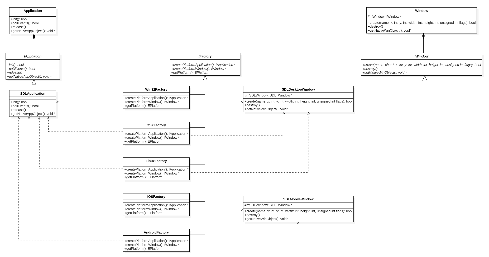

<center>图3-24 T3DPlatform库中使用到的抽象工厂模式类图</center>

看过上图，我们就会发现其实我们对于各种操作系统相关的对象创建就是使用了抽象工厂模式。好，接下来我们逐个列出来我们实际抽象工厂模式应用中的类和抽象工厂模式定义中的对应关系。如下表3-1

| 抽象工厂模式定义中的类             | 实际应用中的类                                       |
| ---------------------------------- | ---------------------------------------------------- |
| Client                             | Application和Window                                  |
| AbstractFactory                    | IFactory                                             |
| ConcreteFactory1和ConcreteFactory2 | Win32Factory、OSXFactory、iOSFactory、AndroidFactory |
| AbstractProductA                   | IApplication                                         |
| AbstractProductB                   | IWindow                                              |
| ProductA1和ProductA2               | SDLApplication                                       |
| ProductB1和ProductB2               | SDLDesktopWindow和SDLMobileWindow                    |

<center>表3-1</center>

从表3-1我们可以找出所有实际应用的类在定义中的类影子。为什么要用抽象工厂模式呢？因为每个操作系统平台对于窗口、应用等实现都有差异，抽象类IApplication（AbstractProductA）和IWindow（AbstractProductB）抽取了公用接口，让各平台相关子类各自去实现具体的接口，这样子Application（Client）和Window（Client）都无需关注具体平台实现，仅仅是调用就能达到具体的功能目的。同时，这里Application类和Window类使用了另外一种模式来进一步隐藏操作系统相关的操作，这个就是接下来要讲的桥接模式。

### 3.2.3 桥接模式的应用

　　桥接模式，估计很多人对这个模式都比较陌生，没有前面提到那两种设计模式那么常用。那么我们先来看看桥接模式的定义是什么：

> 桥接模式（Bridge），将抽象部分与它的实现部分分离，使他们都可以独立地变化。
>

看完定义，我们再直观的看看标准定义的类图是怎样的，如下图3-25：


<center>图3-25 桥接模式标准定义类图</center>

看完定义和类图，应该有个较直观的认识了。那为什么要用桥接模式呢？按照开篇时候提到的目标导向，所以从这个设计主要是为了解决什么问题来看。其实主要是基于以下几个目的：

- T3DPlatform作为一个库，对外需要隐藏操作系统实现细节
- T3DPlatform作为一个库，对外需要隐藏依赖操作系统的头文件
- 虽然目前只支持5中操作系统，但是将来要扩展，对T3DPlaform库对外接口可以无修改的桥接到新支持的操作系统上

基于以上三个目的，我们对照着桥接模式的定义，刚好发现其能够把功能作为抽象部分剥离出来，而具体操作系统的实现是另外一部分，这样刚好可以让相互之间都能独立变化，而互不影响。不过这里还有一点点区别，那就是我们的Window类，并没有RefinedAbstraction子类，而Application类的RefinedAbstraction类交给最后上层写App层的来负责实现。为什么Window类没有RefinedAbstraction子类呢？因为这个窗口系统是个简单窗口系统，主要就是给渲染器一个渲染目标，这里基本上不存在什么变化，所以这里就简单化了。当然，如果后续要很复杂的需求，那我们再去修改这部分。毕竟设计模式是死的，用的人是活的，要灵活运用才行。这里就不再给出细节的类图了，大家可以直接看图3-1或者图3-7。


## <center>3.3 T3DPlatform的实现</center>

### 3.3.1 公用头文件

T3DType.h——重定义了各种引擎需要用到的基本类型。

T3DMacro.h——定义了一些辅助宏，包括T3D_SAFE_DELETE、T3D_SAFE_DELETE_ARRAY、T3D_EXPORT_API和T3D_IMPORT_API等通用的宏。

T3DPlatformPrerequisites.h——平台库需要依赖的一些只有平台库需要的宏以及平台库包的所有类的前置声明。

下面我们看看代码片段：

T3DType.h

```c++
typedef signed char         char_t;
typedef unsigned char       uchar_t;
typedef signed short        short_t;
typedef unsigned short      ushort_t;
typedef signed int          int_t;
typedef unsigned int        uint_t;
typedef signed long         long_t;
typedef unsigned long       ulong_t;

typedef signed char         int8_t;
typedef unsigned char       uint8_t;
typedef signed short        int16_t;
typedef unsigned short      uint16_t;
typedef signed int          int32_t;
typedef unsigned int        uint32_t;

#ifndef T3D_OS_ANDROID	// Android平台已经定义了这两个类型了，所以Anroid平台忽略不重复定义了
typedef signed long long    int64_t;
typedef unsigned long long  uint64_t;
#endif

typedef std::string         String;
typedef std::wstring        WString;

typedef std::string         UTF8String;
typedef std::u16string      UTF16String;
typedef std::u32string      UTF32String;

typedef void*               THandle;
```

T3DMacro.h

```c++
#if defined T3D_OS_WINDOWS      
	// Win32

    #ifdef _DEBUG   // debug
        #define T3D_DEBUG
    #else           // release
        #undef T3D_DEBUG
    #endif
    
    #pragma warning(disable:4996)
    #pragma warning(disable:4251)
    
    #define snprintf    _snprintf
    #define vsnprintf   _vsnprintf
    
    #define T3D_EXPORT_API      __declspec(dllexport)
    #define T3D_IMPORT_API      __declspec(dllimport)

#elif defined T3D_OS_IOS || defined T3D_OS_OSX || defined T3D_OS_LINUX  
	// iOS or Mac OS x or Linux

    #ifdef DEBUG    // debug
        #define T3D_DEBUG
    #else           // release
        #undef T3D_DEBUG
    #endif
    
    #define T3D_EXPORT_API
    #define T3D_IMPORT_API

#elif defined T3D_OS_ANDROID    
	// Android

    #ifdef NDK_DEBUG    // debug
        #define T3D_DEBUG
    #else               // release
        #undef T3D_DEBUG
    #endif
    
    #define T3D_EXPORT_API
    #define T3D_IMPORT_API

#endif

// 重定义断言
#ifndef T3D_ASSERT
    #ifdef T3D_DEBUG
        #define T3D_ASSERT(x)   assert(x)
    #else
        #define T3D_ASSERT(x)
    #endif
#endif

// 声明接口类辅助宏
#define T3D_DECLARE_INTERFACE(T)    \
    public:     \
        virtual ~T()    {}

// 禁止复制拷贝对象辅助宏
#define T3D_DISABLE_COPY(T) \
    private:    \
        T(const T &);   \
        T &operator =(const T &);

// 安全释放指针
#define T3D_SAFE_DELETE(p)  \
    if (p != nullptr)   \
    {   \
        delete p;   \
        p = nullptr;    \
    }

// 安全释放数组
#define T3D_SAFE_DELETE_ARRAY(p)    \
    if (p != nullptr)   \
    {   \
        delete []p; \
        p = nullptr;    \
    }
```

T3DPlatformPrerequisites.h

```c++
#if defined T3DPLATFORM_EXPORT
    #define T3D_PLATFORM_API    T3D_EXPORT_API
#else
    #define T3D_PLATFORM_API    T3D_IMPORT_API
#endif

namespace Tiny3D
{
    class System;
    class Application;
    class Window;
}
```

　　涉及源码文件：

- Source/Platform/Include/T3DType.h
- Source/Platform/Include/T3DMacro.h
- Source/Platform/Include/T3DPlatformPrerequisites.h

### 3.3.2 Singleton类实现

　　Singleton类在这里作为所有单例的基类，而且这是个模板类，可以适应各种类型。这里让所有单例类从这里继承，Singleton类封装各种单例行为。下面我们简单看看Singleton类实现：

```c++
template <typename T>
class Singleton
{
public:
    typedef T  value_type;
    typedef T* pointer;
    typedef T& reference;

    Singleton()
    {
        T3D_ASSERT(m_pInstance == nullptr);
        m_pInstance = static_cast<pointer>(this);
    }

    virtual ~Singleton()
    {
        m_pInstance = nullptr;
    }

    static reference getInstance()
    {
        return *m_pInstance;
    }

    static pointer getInstancePtr()
    {
        return m_pInstance;
    }

protected:
    static pointer m_pInstance;
};
```

详细的实现各位看官请参阅源码：

- Source/Platform/Include/T3DSingleton.h

### 3.3.3 Application相关类实现

　　前面我们看整体设计的时候，已经大概了解过有Application类，IApplication类，以及具体平台相关的Application类。这里我们要面临一个选择的问题。虽然我们是从造轮子开始的，但是我们不用连轮子上的橡胶也自己生产，毕竟我们不是专业跨平台窗口程序制作人员，所以这些造轮子所用的橡胶就交给第三方生产了。窗口系统有很多，但是我们选择基于三点原则：

1. 跨平台，支持Windows、Mac OS X、Linux、iOS、Android等五种主流操作系统平台
2. 简单能提供渲染的窗口，目标不是开发编辑器
3. 同时支持Open GL和Direct X两种不同系列的API

一开始考虑使用GLFW这个第三方库来实现应用和窗口系统的，但是后面发现GLFW首先只支持Open GL，其次其只支持桌面系统，对于手机终端系统暂无支持，结合上面三点原则，无法同时满足第一点和第三点，所以最后还是放弃了。经过一轮选择，最终选择了SDL2这个库。首先，它能满足跨平台，第一点原则上列出来的平台它都支持。其次，它能完美支持Open GL和Direct X两种不同系列的API。最后，SDL2也提供了不同平台的一些输入事件的封装，甚至更多的一些平台功能。综合分析，最后我们选择SDL2作为我们底层应用入口和窗口系统的构建基础。

　　那接下来看看几个Application类提供一些什么功能。

Application类

```c++
class T3D_PLATFORM_API Application : public Singleton<Application>
{
public:
	/**
 	 * @brief 应用初始化，这个由具体平台来调用，用户不需要调用
 	 * @return 调用成功返回true，否则返回false
 	 */
	bool init();

	/**
	 * @brief 应用事件处理
	 */
	bool pollEvents();

	/**
	 * @brief 应用程序退出释放资源
	 * @return void
	 */
	void release();

	/**
	 * @brief 获取平台相关的应用程序对象
	 * @return 返回平台相关的应用程序对象，不同平台各自去解析返回的指针
	 */
	void *getNativeAppObject();

	/**
	 * @brief 子类实现关注程序启动事件，引擎启动后被调用
	 * @return 返回true，引擎会继续执行下去，返回false，引擎会退出
	 */
	virtual bool applicationDidFinishLaunching() = 0;

	/**
	 * @brief 子类实现关注程序退后台事件
	 */
	virtual void applicationDidEnterBackground() = 0;

	/**
	 * @brief 子类实现关注程序回到前台事件
	 */
	virtual void applicationWillEnterForeground() = 0;

	/**
	 * @brief 子类实现关注程序退出事件，在某些平台上没有该事件
	 */
	virtual void applicationWillTerminate() = 0;
};
```

init() —— 初始化引用程序。目前主要调用IApplication具体操作系统相关子类对象实现来处理程序初始化的事情。

pollEvents() —— 轮询应用程序事件。目前主要是调用IApplication具体操作系统相关子类对象实现来处理程序轮询事件的事情。

release() —— 应用程序释放对应资源。目前主要是调用IApplication具体操作系统相关子类对象实现来处理程序退出的清理事情。

getNatvieAppObject() —— 返回操作系统相关的用于标识程序的唯一句柄对象。目前主要是调用IApplication具体操作系统相关子类对象实现来返回平台相关句柄，这里有的平台可能是没有该标识。

最后，一个很重要的实现，那就是在构造函数的时候，会对上述提到的System单例类实例化，让所有程序在启动时候就能识别出具体的操作系统平台，方便后续调用平台相关的接口。

IApplication类

　　上面再平台库设计的时候谈到过我们的Application类只是桥接模式里面的抽象类，而IApplication类才是实现者的接口类，各操作系统平台或者第三方库负责继承出子类来实现各自接口跟平台相关的功能。具体的在这里不逐一列出来了，详情还请各位看官直接参阅源码IApplicationInterface.h。

SDLApplication类

　　参考上面类图设计，还有一个SDLApplication类，这个我们直接使用SDL2这个第三方库来实现应用程序初始化、事件轮询以及程序释放资源等这些功能。这个类是IApplication具体的实现类。为什么这里我们没有各种平台相关的IApplication子类，而只有一个SDLApplication类呢？因为SDL2已经替我们实现了各种操作系统平台相关的事情，所以我们这里只需要简单的封装一下就能达到最初设计的目的了。具体的在这里也不一一列出来了，详情还请各位看官直接参阅源码SDLApplication.h和SDLApplication.cpp。而关于SDL2库的使用，可以直接到其官网 www.libsdl.org 上查阅。如果各位有兴趣，可以自己派生子类实现各种平台的行为或者使用其他第三方库来实现IApplication各种接口行为。

涉及源码文件：

- Source/Platform/Include/T3DApplication.h
- Source/Platform/Source/T3DApplication.cpp
- Source/Platform/Include/Adapter/T3DApplicationInterface.h
- Source/Platform/Include/Adapter/Common/T3DSDLApplication.h
- Source/Platform/Source/Adapter/Common/T3DSDLApplication.cpp

### 3.3.4 Window相关类实现

　　上面Application相关类的时候讲过本引擎使用SDL2作为统一窗口系统，所以窗口系统也离不开SDL2。移动终端和桌面应用还是有一些区别，主要是窗口系统大小已经全屏的区别。所以这里还进一步划分成支持桌面平台的SDLDesktopWindow类和支持移动终端平台的SDLMobileWindow类。全部都遵循了IWindow接口类规范，实现了对应的接口。同样的，Window类也使用了桥接模式来隐藏平台相关的实现。因为外部使用到的就是Window类，所以下面主要看看Window类的接口。

Window类

```c++
class T3D_PLATFORM_API Window
{
    T3D_DISABLE_COPY(Window);

public:
    static const uint32_t WINDOW_FULLSCREEN;
    static const uint32_t WINDOW_FULLSCREEN_DESKTOP;
    static const uint32_t WINDOW_OPENGL;
    static const uint32_t WINDOW_SHOWN;
    static const uint32_t WINDOW_HIDDEN;
    static const uint32_t WINDOW_BORDERLESS;
    static const uint32_t WINDOW_RESIZABLE;
    static const uint32_t WINDOW_MINIMIZED;
    static const uint32_t WINDOW_MAXIMIZED;
    static const uint32_t WINDOW_INPUT_GRABBED;
    static const uint32_t WINDOW_INPUT_FOCUS;
    static const uint32_t WINDOW_MOUSE_CAPTURE;

    /** Constructor */
    Window();

    /** Destructor */
    virtual ~Window();

    /**
     * @brief 创建窗口.
     * @param [in] x : 窗口位置
     * @param [in] y : 窗口位置
     * @param [in] w : 窗口宽度
     * @param [in] h : 窗口高度
     * @param [in] flags : 创建窗口需要的一些标记位，可使用或操作合并标记
     * @return 创建成功返回true，否则返回false.
     */
    bool create(const char *title, int32_t x, int32_t y,
        int32_t w, int32_t h, uint32_t flags);

    /**
     * @brief 销毁窗口.
     * @remarks 析构函数同样会自动调用
     */
    void destroy();

protected:
    IWindow *mWindow;
};
```

其实Window类目前很简单，仅有两个接口：

create() —— 创建窗口；

destroy() —— 销毁窗口；

IWindow类

　　上面再平台库设计的时候谈到过我们的Window类只是桥接模式里面的抽象类，而IWindow类才是实现者的接口类，各操作系统平台或者第三方库负责继承出子类来实现各自接口跟平台相关的功能。接口详细的可以参考源代码，这里不详细列出来了，跟Window类接口是大同小异。下面看看IWindow类的两个子类。

SDLDesktopWindow类和SDLMobileWindow类

　　其实这两个类差别不大，主要就是创建窗口的时候是按照指定尺寸来创建还是忽略指定尺寸来创建。具体代码列出来比较下就一清二楚了

SDLDesktopWindow创建代码片段：

```c++
mSDLWindow = SDL_CreateWindow(title, x, y, w, h, flags);
```

SDLMobileWindow创建代码片段：

```c++
SDL_DisplayMode dm;
if (SDL_GetCurrentDisplayMode(0, &dm) == 0)
{
    w = dm.w;
    h = dm.h;
}

mSDLWindow = SDL_CreateWindow(title, x, y, w, h, flags);
```

从上面两段代码片段来看，主要就是是桌面系统直接按照用户输入的窗口尺寸创建，而移动终端系统按照屏幕尺寸来创建，直接忽略了全屏参数。

涉及源码文件：

- Source/Platform/Include/T3DWindow.h
- Source/Platform/Source/T3DWindow.cpp
- Source/Platform/Include/Adapter/T3DWindowInterface.h
- Source/Platform/Include/Adapter/Desktop/T3DSDLDesktopWindow.h
- Source/Platform/Source/Adapter/Desktop/T3DSDLDesktopWindow.cpp
- Source/Platform/Include/Adapter/Mobile/T3DSDLMobileWindow.h
- Source/Platform/Source/Adapter/Mobile/T3DSDLMobileWindow.cpp

### 3.3.5 各操作系统平台相关工厂类实现

　　上面提到平台工厂类是个抽象工厂模式中的工厂基类，IFactory类目前只有简单的三个接口。这里简单代码列一下：

```c++
class IFactory
{
    T3D_DECLARE_INTERFACE(IFactory);

public:
    /**
     * @brief 创建操作系统平台相关的应用程序对象
     * @return 返回平台相关的应用程序对象，需要用户调用delete释放对象
     */
    virtual IApplication *createPlatformApplication() = 0;

    /**
     * @brief 创建操作系统平台相关的窗口.
     * @return 返回平台相关的窗口操作对象，需要用户调用delete释放对象
     */
    virtual IWindow *createPlatformWindow() = 0;

    /**
     * @brief 获取当前平台类型.
     * @return 返回当前平台类型
     */
    virtual EPlatform getPlatform() = 0;
};

/**
 * @brief 创建操作系统相关的适配层工厂对象.
 * @note 不同操作系统平台需要实现该接口以返回操作系统适配层工厂对象
 * @return 返回适配层工厂对象，需要用户调用delete释放资源
 */
IFactory *createPlatformFactory();
```

其他接口看注释就知道了，就不一一细说了，这里稍微说一下createPlatformFactory()这个独立的全局函数。这个接口需要不同平台的实现的时候实现创建出来抽象工厂对象，这样就能实现不同平台的具体对象的实例创建。

- Win32Factory类 —— 实现Windows系统上平台相关对象的实例创建
- OSXFactory类 —— 实现Mac OS X系统上平台相关对象的实例创建
- iOSFactory类 —— 实现iOS系统上平台相关对象的实例创建
- AndroidFactory类 —— 实现Android系统上平台相关对象的实例创建

涉及源码文件：

- Source/Platform/Include/T3DFactoryInterface.h
- Source/Platform/Include/Adapter/Windows/Win32Factory.h
- Source/Platform/Source/Adapter/Windows/Win32Factory.cpp
- Source/Platform/Include/Adapter/OSX/OSXFactory.h
- Source/Platform/Source/Adapter/OSX/OSXFactory.cpp
- Source/Platform/Include/Adapter/iOS/iOSFactory.h
- Source/Platform/Source/Adapter/iOS/iOSFactory.cpp
- Source/Platform/Include/Adapter/Android/AndroidFactory.h
- Source/Platform/Source/Adapter/Android/AndroidFactory.cpp

### 3.3.6 System类平台库的总入口

　　到了T3DPlatform库的入口类了，要使用T3DPlatform库，需要先生成System类对象才能使用。System类之前提到其实一个单例类，但是为了避免全局对象初始化顺序的问题，所以这里的单例都不是传统的静态对象或者全局对象，而是还是通过new操作从堆上分配的。那System类从哪里生成出来呢？那就是程序的入口，Applicatoin类的构造函数就会把System类对象构造出来。下面来看看System类的定义代码片段：

```c++
class T3D_PLATFORM_API System : public Singleton<System>
{
    T3D_DISABLE_COPY(System);

public:
    /**
     * @brief Constructor for System.
     */
    System();

    /**
     * @brief Destructor for System.
     */
    ~System();

    /**
     * @brief 每个程序循环调用处理.
     * @return void
     */
    void process();

    /**
     * @brief 获取操作系统适配层工厂接口对象
     */
    IFactory &getPlatformFactory()
    {
        return (*mPlatformFactory);
    }

private:
    IFactory        *mPlatformFactory;
};
```

目前暂时比较简单，所以接口只有两个，一个是process()，一个是getPlatformFactory()。这里就不多说了，简单说一下process()接口，主要就是跟在Application类对应调用pollEvents()接口的地方一起调用，给System一个每帧处理的入口。下面看看如何创建System对象代码片段：

```c++
Application::Application()
    : mSystem(new System())
{
    mApp = T3D_PLATFORM_FACTORY.createPlatformApplication();
}
```

这个就是在Application类构造的时候把System对象第一个创建出来，只有这样才能之后使用各种平台相关的接口。


## <center>3.4 T3DCore的实现</center>

 　　上面讲完了T3DPlatform的实现了，接下来讲讲T3DCore实现。目前T3DCore里面只有一个Engine类。所以比较简单。这里简单介绍下，公用头文件只有两个：一个是整体对外的Tiny3D.h，给外部应用层一个统一的头文件；另外一个是T3DPrerequisites.h，给T3DCore库提供一些类前置声明和一些区分DLL和导入DLL辅助宏。

　　接下来简单讲下Engine类。先简单看看代码片段：

```c++
class T3D_ENGINE_API Engine : public Singleton<Engine>
{
    T3D_DISABLE_COPY(Engine);

public:
    /**
     * @brief 构造函数
     */
    Engine();

    /**
     * @brief 析构函数
     */
    virtual ~Engine();

    /**
     * @brief 启动引擎
     * @remarks 引擎的一切应用都要在调用本接口之后才有效。
     */
    bool startup();

    /**
     * @brief 运行引擎
     */
    bool run();

    /**
     * @brief 渲染一帧
     */
    void renderOneFrame();
    
protected:
    Window              *mWindow;               /// 窗口
    bool                mIsRunning;             /// 引擎是否在运行中
};
```

Engine类首先是一个实用单例模式的单例类，所以从Singleton类派生出来。按照之前提到的，这里的单例不是全局对象或者静态对象，而是要用户自己new出来的一个堆对象。这里Engine对象是需要引擎使用者去实例化出来的，这个引擎需要在Application类实例化之后实例化。为什么呢？因为Application也是个单例类，也是需要引擎使用者去实例化，只是Application类构造时负责了System对象的构造，所以必须要Application类先实例化。

starup() —— 启动引擎接口，这个接口就好比汽车的点火操作，主要是引擎做一些初始化的操作；

run() —— 运行引擎接口，这个接口就好比汽车油门，主要就是让引擎运行起来。这个接口直到引擎运行结束了才会退出，所以这个接口会一直阻塞在里面直到引擎被各种原因触发的退出才返回。

renderOneFrame() —— 简单渲染一帧，目前暂时没功能，因为我们还没有渲染功能呢。这个是为后面不用引擎自带循环的情况下使用。主要使用场景就是使用系统GUI开发编辑器的时候。因为GUI系统都要自己的循环或者渲染入口，而不需要使用引擎自带的循环。


## <center>3.5 Running , Demo_HelloApp !</center>

　　经过一轮设计和实现分析，下面就是见证第一个Demo运行的时刻了。代码写完后，直接用辅助脚在相关平台或者cross-platform情况下运行脚本生成对应的工程，然后Build & Run就能看到Demo运行效果了。因为移动终端就是个黑屏，所以看不出来什么效果，这里简单截三个桌面系统的窗口来看看效果。

Windows上运行效果如下图3-26：


<center>图3-26 Demo_Hello在Windows上运行效果图</center>

Mac OS X上运行效果如下图3-27：


<center>图3-27 Demo_Hello在Mac OS X上运行效果图</center>

Ubuntu 17.10上运行效果如下图3-28：


<center>图3-28 Demo_Hello在Ubuntu 17.10运行效果图</center>

这里在不同的平台有不同的背景色是因为Demo_Hello里面没有去设置背景颜色，全部都是用系统默认颜色，所以会有的是黑色，有的是白色。

<div style="page-break-after:always;"></div>


# <center>四、3D数学——空间坐标系</center>

本篇概要

- 笛卡尔坐标系
- 左手坐标系和右手坐标系的区别
- 世界坐标系
- 物体坐标系
- 相机坐标系
- 坐标系转换

　　前面基石已经搭建好，下面开始我们的3D世界旅程了。现在我们要暂时抛开程序代码和框架设计的事情，因为3D世界需要许多数学知识来作为支撑，所以我们先讨论3D数学方面的知识。

　　3D世界就是在计算机屏幕上模拟我们再现实世界的物体和场景。我们在这个世界上总需要有一个自己的位置，这个就需要一种表示方式来标识我们的位置，那么用什么方式呢？众所周知，我们在现实世界上表示自己方位的用的就是坐标，所以我们在3D世界中也同样使用坐标来模拟现实世界的位置。


## <center>4.1 笛卡尔坐标系</center>

　　坐标的思想是法国数学家，哲学家笛卡尔所创立的。传说有一天，笛卡尔生病卧床，但他头脑一直没有休息，在反复思考一个问题：几何图形是直观的，而代数方程则比较抽象，能不能用几何图形来表示方程呢？这里，关键是如何把组成几何的图形的点和满足方程的每一组“数”挂上钩。他就拼命琢磨，通过什么样的办法，才能把“点”和“数”联系起来。突然，他看见屋顶角上的一只蜘蛛，拉着丝垂了下来，一会儿，蜘蛛又顺着丝爬上去，在上边左右拉丝。蜘蛛的“表演”，使笛卡尔思路豁然开朗。他想，可以把蜘蛛看做一个点，它在屋子里可以上、下、左、右运动，能不能把蜘蛛的每个位置用一组数确定下来呢？他又想，屋子里相邻的两面墙与地面交出了三条直线，如果把地面上的墙角作为起点，把叫出来的三条线作为三根数轴，那么空间中任意一点的位置，不是都可以用这三根数轴上找到的有顺序的三个数来表示吗？反过来，任意给一组三个有顺序的数，例如3、2、1，也可以用空间中的一个点P来表示它们。同样，用一组数(a, b)可以表示平面上的一个点，平面上的一个点也可以用一组两个有顺序的数来表示。于是在蜘蛛的启示下，笛卡尔创建了直角坐标系，也叫笛卡尔直角坐标系。我们把直角坐标系和斜角坐标系都统称为笛卡尔坐标系。

### 4.1.1 2D笛卡尔坐标系

　　　相信很多小伙伴早都已经知道笛卡尔坐标系了，对于2D笛卡尔坐标系，在这里就不多说了，来一个直观的表述，统一一下我们的认识就好了。如下图4-1所示：


<center>图4-1 2D笛卡尔坐标系</center>

2D 笛卡尔坐标系由以下两点定义：

- 每个2D笛卡尔坐标系都有一个特殊的点，称作远点（Origin(0, 0)），它是坐标系的中心；
- 每个2D笛卡尔坐标系都有两条过远点的只想向两边无限延伸，称作轴（axis）。两个轴互相垂直（垂直不是必须的，但是我们通常使用坐标轴互相垂直的坐标系）；

水平方向的轴称作x轴，向右为x正方向，垂直方向的轴称作y轴，向上为y正方向，这是表示 2D 坐标系惯用法。当然我们可以根据实际需要来决定坐标轴的指向，另外我们还需要决定轴的正方向。例如，我们最常见的屏幕坐标系的x周以远点向右为正，y周向下为正，如下图4-2所示：


<center>图4-2 屏幕坐标系</center>

　　坐标系是一个精确定位点的框架，为了在笛卡尔坐标系中定位点，人们引入了笛卡尔坐标的概念。在2D平面中，两个数(x, y)就可以定位一个点（因为是二维空间，所以使用两个数。类似的，三位空间中使用三个数）。坐标的每个分量都表明了该点与原点之间的距离和方位。确切地说，每个分量都是到相应轴的有符号距离。如下图4-3所示：


<center>图4-3 2D笛卡尔坐标系中定位点</center>

　　如上图所示，x分量表示该点到y轴的有符号距离。同样y分量表示该点到x轴的有符号距离。“有符号距离”是指在某个方向上距离为正，而在相反的方向上为负。2D坐标的标准表示法是(x, y)。

### 4.1.2 3D笛卡尔坐标系

　　我们已经了解了2D笛卡尔坐标系，下面我们扩展到3D空间。3D空间就是比2D空间多一个轴，当然复杂度并不是简单的添加一个轴这么简单了。因为我们都是通过平面媒体（不管是纸、电脑屏幕、手机屏幕还是电视屏幕等都是平面），所以3D空间相对于2D空间就更加难以理解和描述了。3D中有许多2D中没有的概念。当然，也有许多2D概念可以直接引入到3D中，对于这种通用情况，我们会从2D开始推导并扩展到3D中。

　　3D空间，我们需要3个轴来表示三维坐标，前两个坐标轴就是上面讨论2D中的x轴和y轴，第三个轴称作z轴。一般情况下，三个轴互相垂直。也就是每个轴都垂直于其他两个轴。如下图4-4所示：


<center>图4-4 3D笛卡尔坐标系</center>

　　在前面我们讨论过，2D平面中我们指定x轴向右为正，y轴向上为正的坐标系为标准形式，但是在3D中并没有标准形式。不同的人，不同的领域使用不同的标准。后面在讨论左右手坐标系的时候会讨论到我们使用的标准。

　　3D中的x轴和y轴并不等同于2D中的x轴和y轴。我们对照着上图4-4再来深入分析下，3D中，任意一对轴都定义了一个平面并垂直于第三个轴（如：包含x、y轴的xy平面，垂直于z轴。同样的，xz平面垂直于y轴，yz平面垂直于x轴）。所以我们可以认为这三个平面是三个2D笛卡尔空间。例如，如果指定+x，+y和+z分别向右，向上和向前，则可以用xz平面来表示“地面”的2D笛卡尔平面。

　　接下来我们看看在3D笛卡尔坐标系中的定位点。在3D中定位一个点需要三个数：x，y和z，分别代表该点到yz，xz和xy平面的有符号距离。例如x值是到xy平面的有符号距离，此定义是直接从2D中扩展来的。如图4-5所示：


<center>图4-5 3D笛卡尔坐标系中定位点</center>


## <center>4.2 左手坐标系和右手坐标系</center>

　　我们在前面讨论过，2D笛卡尔坐标系是有一个标准的，所有2D坐标系都是“等价”的。例如：两个2D坐标系A和B，旋转坐标系A，总能使其x，y轴的指向和B的相同（假设坐标轴都是互相垂直的）。接下来我们详细讨论这个在3D空间中是否成立。

　　图4-1展示了2D坐标系的标准形式。它和图4-2所示的屏幕坐标系y轴方向相反。现在，我们把图4-2顺时针旋转180°，使y轴向上，x轴向左，接着将图左右翻转过来，就得到了标准形式。总之，对于任意2D坐标系，我们总能将其变换为标准形式。

　　下面我们按照之前的套路，试着将这个观点扩展到3D空间中。看图4-4所示的坐标系，z轴指向外面。我们是否可以通过旋转使z轴指向里面，而其他轴不变呢？实际上是不行的。通过旋转我们只能使两个轴和目标相同，第三个轴总是和目标方向相反。3D坐标系之间不一定是等价的。实际上，存在两种完全不同的3D坐标系，左手坐标系和右手坐标系。如果同属于左手坐标系或右手坐标系，则可以通过旋转来重合，否则不可以。

　　那么“左手”和“右手”分辨代表什么意思呢？我们先来看看怎么判断坐标系的类型。我们先来组直观的图片认识。

　　左手坐标系，如下图4-6所示：

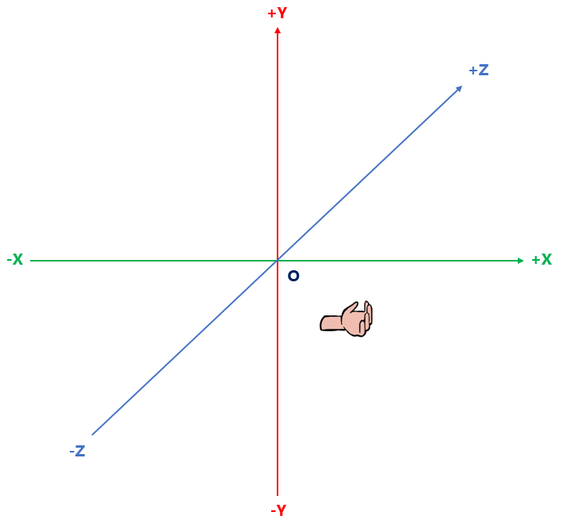

<center>图4-6 3D左手坐标系</center>

　　右手坐标系，如下图4-7所示：

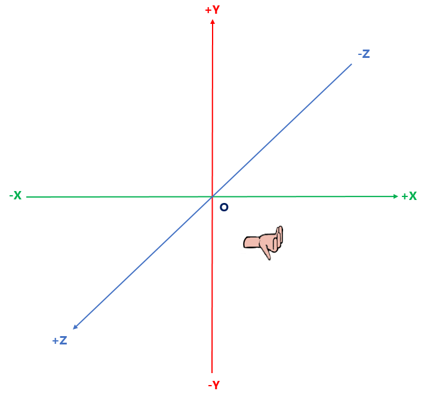

<center>图4-7 3D右手坐标系</center>

 　　我们伸出左手，张开手掌，掌心向上，四指指向x轴正方向，然后做一个“L”字的握拳弯曲，弯曲方向是y轴正方向，最后大拇指指向的方向就是z轴正方向。就是如图4-6所示的动作，这个就是左手坐标系。左手坐标系就是：x轴正方向向右，y轴正方向向上，z轴正方向向里。

　　同样的，伸出右手，张开手掌，掌心向上，四指指向x轴正方向，然后同样做一个“L”字的握拳弯曲，弯曲方向是y轴正方向，最后大拇指指向的方向就是z轴正方向。就是如图4-7所示的动作，这个就是右手坐标系。右手坐标系就是：x轴正方向向右，y轴正方向向上，z轴正方向向外。

　　从上面的描述我们可以看到，无论我们怎么动手腕，都无法让两只手达标的坐标系重合。

　　左手坐标系和右手坐标系没有好坏之分，在不同的领域和应用场景下，会有不同的选择。例如传统的计算机图形学使用左手坐标系，而在线性代数中则使用右手坐标系。所以使用3D坐标系之前，我们首先需要知道它是左手坐标系还是右手坐标系。

　　我们接下来所有的论述都是使用3D右手坐标系，这个成为我们后面论述的基本约定。


## <center>4.3 世界坐标系</center>

　　上面讨论了左手坐标系和右手坐标系，但是仅仅这么直接使用这3D坐标系是否就足够了呢？不足够。经过人们的实践证明，大家发现，不同的情况下使用不同的坐标系更加方便理解。所以，我们引用多坐标系。使用多坐标系的原因是某些信息只能在上下文环境中获得。

　　那什么是世界坐标系呢？让我们从一个例子开始。例如：我现在处于世界上的位置是：北纬22.54°，东经113.93°，处于腾讯大厦停车场的车上。这个经纬度就是一个世界上的位置，那么基于这种全局的描述位置的参照系就是世界坐标系。

　　任何一个3D坐标系都是可以无限延伸的，可以包含空间中所有的点，世界坐标系是一个特殊的坐标系，它建立了描述其他坐标系所需要的参考框架。从另一方面看，我们能够用世界坐标系描述其他坐标系的位置和方向，而不能用更大的、外部的坐标系来描述世界坐标系。世界坐标系也被称为全局坐标系。


## <center>4.4 物体坐标系</center>

　　物体坐标系是和特定物体相关联的坐标系。每个物体都有它们独立的坐标系。当物体移动或者旋转时，与该物体相关联的坐标系将随之移动或者该改变方向。例如，我们每个人都带着自己的坐标系。我们平时告诉您“往前走一步”，这个时候是向您的物体坐标系的前方，然而实际上您是向东，向南，向西还是向北移动，我们并不知道。向前、向后、向左、向右这些都是物体坐标系中的概念，而向东、向南、向西、向北这些是世界坐标系中的绝对方向。例如，我现在是在一辆SUV的驾驶员座位上，这也是描述我在这个车的物体坐标系下的位置。

　　物体坐标系中也能像指定方向一样指定位置。例如，我问您坐飞机上的几号座位，即使您飞机在深圳上空飞行，您也不能告诉我“在深圳”。因为我问的是“你坐几号座位”。也就是说，我想让您描述在飞机的物体坐标系中您的位置。

　　一些情况下，物体坐标系也被称作模型坐标系。因为模型顶点的坐标都是在模型坐标系中描述的。


## <center>4.5 相机坐标系</center>

　　相机坐标系是和观察者相关的坐标系。相机坐标系和屏幕坐标系相似，差别在于相机坐标系处于3D空间中而屏幕坐标系在2D平面里。相机坐标系能被看做是一种特殊的物体坐标系。这个物体坐标系就定义在相机的屏幕可视区域。相机坐标系中，相机在远点，x轴向左，z轴向前（朝向屏幕里），y轴向上（不是世界的上方而是相机本身的上方）。如下图4-8所示：


<center>图4-8 相机坐标系</center>

　　我们按照之前的约定，关于相机坐标系的轴向约定是使用右手坐标系。左手坐标系中，x轴是向右的。

　　后面我们在矩阵的讨论中会引入一种称作投影的过程，把3D空间的物体经过相机坐标系最后变换到2D屏幕上。


## <center>4.6 坐标系转换</center>

　　回到刚才上面讨论的位置的例子，现在我在一辆SUV的驾驶员位置，而车朝着腾讯大厦正门口停放在停车库里。假设现在有人给我电话询问我在哪里，我总不可能告诉别人我在一辆SUV的第二排中间，所以我必须要告知别人我在世界上具体的位置。这个问题其实就是一个表现形式——知道某一点的坐标，怎样在另一个坐标系中描述该点。我们把这种计算称为坐标变换。需要把位置从物体坐标系转换到世界坐标系或者从世界坐标系变换到物体坐标系。

　　再举个例子，现在您在我附近迷路了，不知道如何才能找到我，所以打电话询问我如何找到我。这时候，我需要告知您的不是“向左转，往前100米再往右转，再直行100米就能看到我了”，而是“请您往东走100米再往南走100米就能看到我了”。这个就是坐标变换。

　　又例如，您现在开车从北京腾讯大厦到深圳腾讯大厦，您一直都是车上的驾驶员，所以您在车这个物体坐标系里面的位置一直没有变换，但是您的世界坐标变了，从北纬40.04°，东经116.27°移动到了北纬22.54°，东经113.93°。

　　好了，上面讨论了这么多坐标系相关的问题，后面所有数学都是基于坐标系上面做计算的。另外记住我们的坐标系约定：右手坐标系。

<div style="page-break-after:always;"></div>


# <center>五、3D数学——向量</center>

本篇概要

- 向量定义——数学定义和几何定义
- 向量与点的关系
- 向量的长度和模的数学运算法则和几何解释
- 标量与向量的乘法数学运算法则和几何解释
- 向量的规范化运算法则和几何解释
- 向量的加法和减法运算法则和几何解释
- 向量内积（点乘）运算法则和几何解释
- 向量外积（叉乘）运算法则和几何解释


## <center>5.1 向量的定义</center>

　　向量是研究2D、3D数学的标准工具。向量有两种不同但相关的意义，一种是纯抽象的数学意义，另一种是几何意义。下面我们逐个来讨论。

### 5.1.1 向量的数学定义

　　向量就是一个数字列表，对于程序员来说就是一个数组。数学上，一个向量就是一个数组。数学上区分向量和标量。标量是对我们平时所用数字的技术称谓。使用该术语时，是想强调数量值。例如：速度和位移就是向量，而速率和长度是标量。

　　向量的维度就是向量包含的“数”的数目。向量可以有任意正数维，当然也包括一维。事实上，标量可以被认为是一维向量。我们接下来主要讨论的是2维、3维和4维向量。

### 5.1.2 向量的记法

　　书写向量时，用方括号将一列数括起来，如
$$
\begin{bmatrix} 
1 & 2 & 3 
\end{bmatrix}
$$

　　在叙述时书写向量时，每个数字中间都有逗号，在等式书写时，则通常省略逗号。不管是哪种情况，水平书写的向量叫行向量。人们也经常垂直地列出各分量，如
$$
\begin{bmatrix} 
1 \\ 2 \\ 3
\end{bmatrix}
$$

　　垂直书写的向量叫列向量。我们目前会同时使用两种记法。现在，暂时认为行向量和列向量是没有区别的，在后面，我们将讨论特定情况下它们的区别。

　　我们通常使用下标标记法来引用向量的某个分量。在数学中，整数下标表示引用该元素。如：$v_1$表示引用向量$\vec{v}$的第一个元素。因为我们只讨论2D、3D、4D向量，不涉及n维向量，所以很少使用下标记法。取而代之的是，用x，y代表2D向量的分量；用x，y，z代表3D向量的分量；用x，y，z，w代表4D向量的分量。公式5.1展示了所有记法：
$$
\begin{aligned}
&\vec{a}=\begin{bmatrix}1 \\ 2\end{bmatrix}
\qquad a_1=a_x=1 \quad a_2=a_y=2
\\ \\
&\vec{b}=\begin{bmatrix}3 \\ 4 \\ 5\end{bmatrix}
\qquad b_1=b_x=3 \quad b_2=b_y=4 \quad b_3=b_z=5
\\ \\
&\vec{c}=\begin{bmatrix}6 \\ 7 \\ 8 \\ 9\end{bmatrix}
\qquad c_1=c_x=6 \quad c_2=c_y=7 \quad c_3=c_z=8 \quad c_4=c_w=9
\end{aligned}
\tag{5.1}
$$

### 5.1.2 向量的几何定义

　　上面我们讨论了向量的数学定义，接下来我们看看它的几何定义。从几何意义上说，向量是有大小和方向的有向线段。

- 向量的大小就是向量的长度（即向量的模）。向量有非负的长度。
- 向量的方向描述了空间中向量的指向。请注意，方向并不完全和方位等同，后面我们会讨论他们的区别。

### 5.1.3 向量的形式

　　如下图5-1展示了一个2D向量：


<center>图5-1 2D向量</center>

　　它看起来像一支箭，这是用图形描述向量的标准形式，因为向量定义的两个要素——大小和方向都被包含在其中。有时候需要引用向量的头和尾，如下图5-2所示，箭头是向量的末端（向量“结束”），箭尾是向量的“开始”。


<center>图5-2 向量的头和尾</center>

### 5.1.4 位置与位移

　　向量在哪里呢？实际上，向量是没有位置的，而只有大小和方向的。举几个例子就更加直观了，例如：

- 位移：“向前走三步”，这句话好像是关于位置的，但其实句子中使用的量表示的是相对位置，而不是绝对位置。这个相对位移由大小（三步）和方向（向前）构成，所以它能用向量表示。
- 速度：“我们以50公里/小时的速度向东行驶”。这句话描述了一个量，它有大小（50公里/小时）和方向（东），但没有具体位置。“”50公里/小时的速度向东“能用向量表示。

　　注意，位移、速度和距离、速率是完全不同的两种定义。位移和速度是向量，包含了方向，而距离和速率是标量，不指明任何方向。

　　因为向量能描述事物间的位移和相对差异，所以它能用来描述相对位置：“我的办公室位于腾讯大厦东北的科兴大厦”。不能认为向量有绝对位置。为了强调这一点，当您想象一个向量，一个箭头时，记住：只有箭头的长度和方向是有意义的，不包括位置。

　　因为向量是没有位置的，所以能在图的任何地方表示，只要方向和长度的表示正确即可。我们常常会利用向量的这个优点，将向量平移到图中更有用的点。

### 5.1.5 向量的表达

　　向量中的数表达了向量在每个维度上的有向位移。例如，图5-3中的2D向量列出的是沿x坐标方向和y坐标方向的位移。


<center>图5-3 2D向量的表达方式</center>

　　3D向量是2D向量的简单扩展。3D向量包含了3个数，分别肚量向量在x，y，z轴方向上的位移。

　　另外一个思考向量所代表的位移的一个好办法是将向量分解成与轴平行的分量，把这些分量的位移组合起来，就得到了向量作为整体所代表的位移。

　　例如，3D向量 $\begin{bmatrix}5, 2, -4\end{bmatrix}$ 表示单一位移，但可以将此唯一想象为向右平移5个单位，向上平移2个单位，向前平移4个单位（记住我们的约定：右手坐标系。注意，每步之间没有转向，所以无论是向右、向上还是向前，都分别是平行x、y、z三个轴的）。如下图5-4所示。


<center>图5-4 将向量表示为位移序列</center>

　　这些步骤的执行顺序无关紧要。比如，可以先向前移动4个单位，再向上移动2个单位，最后向右移动5个单位。仍然可以达到同样的位移。不同的顺序对应着向量轴对齐包围盒上的不同路径。后面将从数学意义上验证这个几何直观现象。


## <center>5.2 向量与点的关系</center>

　　“点”有位置，但没有实际的大小。之前我们说过向量时有大小和方向，但没有位置。所以使用“点”和“向量”的目的完全不同。“点”描述位置，而“向量”描述位移。如下图5-5比较了两幅图。


<center>图5-5 指明点与指明向量</center>

　　左边的是在前面展示2D笛卡尔坐标系表示点的位置，右边是前面展示向量的。它看上去显示出点和向量间有某种很强的关系。这正是我们接下来要讨论的这个重要关系。

　　前面我们讨论了向量能描述相对位置的事实，因为它能描述位移。相对位置的想法是很直接的：某个物体的位置，能通过描述它与已知点之间的相对关系来指明。

　　由此引出一个问题，这些“已知”点在哪儿？什么是“绝对”位置？令人吃惊的是并不存在这样的东西。在描述一个点的位置时，总是要描述它和其他一些点的关系，任何对位置的描述只有在一定参考系内才有意义。理论上，能够建立一个包容一切的参考系，并选择一个点作为这个空间原点，然后定义“绝对”坐标系。但是即使能建立绝对坐标系，它在实践中也没什么意义。

　　向量能够用来描述位移，当然也包括相对位置。点用来描述为位置。上面我们讨论过任何描述位置的方法都是相对的，那么，我们必须承认点也是相对的。它们和确定其坐标的原点相关。


## <center>5.3 特殊的向量定义</center>

### 5.3.1 零向量

　　对于任意集合，都存在一个加法恒等元 x ，对于集合中任意元素 y，满足 y + x = y。（这里使用的字体并不局限于标量集合，而是对于任意集合。）

　　n 维向量集合的加法恒等元就是 n 维向量的“零向量”。它的每一维都是零。我们用粗体的零表示任意维零向量，如：
$$
\begin{aligned}
\bf 0 = 
\begin{bmatrix}
0 \\ 0 \\ \cdot \\ \cdot \\ \cdot \\ 0
\end{bmatrix}
\end{aligned}
$$
　　例如，3D零向量表示为 $\begin{bmatrix} 0, 0, 0\end{bmatrix}$ 。

　　零向量非常特殊，因为它是唯一大小为零的向量。对于其他任意长度 m 的向量，存在无数多个大小为 m 的向量，它们够构成了一个圆。而零向量是唯一一个没有方向的向量。

　　尽管我们图形上一个零向量是通过一个点来表示，但是认为零向量就是一个“点”并不准确的，因为它并没有定义一个位置。相反，我们应该认为零向量表示的是“没有位移“，就像标量中的零表示”没有数量“一样。

### 5.3.2 负向量

　　对于任意集合，都存在一个加性逆元 x ，对于集合中任意元素 y ，满足 y + x = 0。（虽然这里变量的字体表示标量，但是我们讨论的是一般集合。）从另外一方面来说，集合中的元素能求负。

　　负运算符也能应用到向量上。每个向量 $\vec v$ 都有一个加性逆元 $-\vec v$ ，它的维数和 $\vec v$ 的一样，满足 $\vec v + (- \vec v) = \bf 0$ 。后面会讨论到向量的加法。

#### 5.3.2.1 运算法则

　　要得到任意维向量的负向量，只需要简单地将向量每个分量都取反即可，数学表达式为：
$$
-
\begin{bmatrix}
a_1 \\ a_2 \\ \cdot \\ \cdot \\ \cdot \\ a_n
\end{bmatrix}
= 
\begin{bmatrix}
-a_1 \\ -a_2 \\ \cdot \\ \cdot \\ \cdot \\ -a_n
\end{bmatrix}
\tag{5.2}
$$
　　将此运算法则运用到2D、3D和4D特例中，则有：
$$
\begin{aligned}
& - \begin{bmatrix}x & y\end{bmatrix} = \begin{bmatrix} -x & -y \end{bmatrix} \\
& - \begin{bmatrix}x & y &ｚ\end{bmatrix} = \begin{bmatrix} -x & -y & -z \end{bmatrix} \\
& - \begin{bmatrix}x & y & z & w \end{bmatrix} = \begin{bmatrix} -x & -y & -z & -w \end{bmatrix}
\end{aligned}
\tag{5.3}
$$

#### 5.3.2.2 几何意义

　　向量变负，将得到一个和原向量大小相等，方向相反的向量。如下图5-6所示：


<center>5-6 向量及其负向量</center>

　　注意，向量在途中的位置是无关紧要的，只有大小和方向才是最重要的。


## <center>5.4 向量的长度和模</center>

　　前面讨论过，向量是有大小和方向的。但是无论是大小还是方向都没有在向量中很明确地表示出来。如2D向量 $\begin{bmatrix}3, 4\end{bmatrix}$ 的大小既不是3，也不是4，而是5.因为向量的大小没有明确表示，所以需要计算。向量的大小也常被称作长度或者模。

### 5.4.1 运算法则

　　在线性代数中，向量的大小用向量两边加双竖线表示，这和标量的“绝对值”在标量两边加单竖线类似。这种记法和 n 维向量大小的计算公式如下：
$$
\begin{aligned}
& \begin{Vmatrix} \vec v \end{Vmatrix} = \sqrt{v_1^2 + v_2^2 + \cdots + v_{n-1}^2 + v_n} \\
& \begin{Vmatrix} \vec v \end{Vmatrix} = \sum_{i=1}^n v_i^2
\end{aligned}
\tag{5.4}
$$
　　向量的大小就是向量各分量平方和的平方根，这听起来有点复杂，其实2D、3D向量的计算公式很简单，如下：
$$
\begin{aligned}
& \begin{Vmatrix} \vec v \end{Vmatrix} = \sqrt{v_x^2 + v_y^2} \\
& \begin{Vmatrix} \vec v \end{Vmatrix} = \sqrt{v_x^2 + v_y^2 + v_z^2} \\
\end{aligned}
\tag{5.5}
$$
　　从上述公式可以看出来，向量的大小是一个非负标量。

### 5.4.2 几何意义

　　上面讨论了向量长度和模的运算法则，我们这里从几何角度来看看其含义是什么。对 2D 中的任意向量 $\vec v$ ，能构造一个以 $\vec v$ 为斜边的直角三角形，如下图5-7所示：


<center>图5-7 向量长度和模的几何意义</center>

　　直角边的长度分别为分量 $v_x$，$v_y$ 的绝对值。向量分量可以为负，因为它们是有符号位移，但是长度总是为正的。

　　由勾股定理可知，对于任意直角三角形，斜边长度的平方等于两直角边长度的平方和。根据图5-7所示，应用勾股定理可得：
$$
\begin{Vmatrix} \vec v \end{Vmatrix} = |v_x|^2 + |v_y|^2
$$
　　因为 $|a|^2 = a^2$ ，所以可以去掉绝对值号，得：
$$
\begin{Vmatrix} \vec v \end{Vmatrix} = v_x^2 + v_y^2
$$
　　两边取平方根，可化简得：
$$
\begin{aligned}
& \sqrt{\begin{Vmatrix} \vec v \end{Vmatrix}} = \sqrt{v_x^2 + v_y^2} \\
& \begin{Vmatrix} \vec v \end{Vmatrix} = \sqrt{v_x^2 + v_y^2}
\end{aligned}
$$
　　经过一番推导，大家发现，这个就是公式5.5。向量几何意义，从2D空间扩展3D空间也是成立的。


## <center>5.5 标量与向量的乘法</center>

　　标量和向量是无法相加的，但是它们能相乘。标量和向量相乘的结果将是一个向量，且与原向量平行，但长度不同或者方向相反。

### 5.5.1 运算法则

　　标量与向量的乘法非常直接，将向量的每个分量都与标量相乘即可。标量与向量乘的顺序并不重要，我们经常把标量卸载坐标，数学表达为：
$$
k \begin{bmatrix} a_1 \\ a_2 \\ \cdot \\ \cdot \\ \cdot \\ a_{n-1} \\ a_n \end{bmatrix}
=
\begin{bmatrix} a_1 \\ a_2 \\ \cdot \\ \cdot \\ \cdot \\ a_{n-1} \\ a_n \end{bmatrix} k
=
\begin{bmatrix} ka_1 \\ ka_2 \\ \cdot \\ \cdot \\ \cdot \\ ka_{n-1} \\ ka_n \end{bmatrix}
\tag{5.6}
$$
　　应用到3D向量，可得：
$$
k\begin{bmatrix} x \\ y \\ z \end{bmatrix} 
= 
\begin{bmatrix} x \\ y \\ z \end{bmatrix}k
= 
\begin{bmatrix} kx \\ ky \\ kz \end{bmatrix}
\tag{5.7}
$$
　　向量也能除以非零标量，等同于乘以标量的倒数：
$$
\frac{\vec v}{k} = \left(\frac{1}{k}\right) v \begin{bmatrix} v_x/k \\ v_y/k \\ v_z/k \end{bmatrix}
\tag{5.8}
$$
　　标量与向量乘法需要注意以下几点：

- 标量与向量相乘时，不需要写乘号。将两个两挨着写即表示相乘（通常将标量写在左边）；
- 标量与向量的乘法和除法优先级高于加法和减法，这个跟普通标量与标量的运算优先级一直；
- 标量不能除以向量，并且向量不能除以另一个向量；
- 负向量能被认为是乘法的特殊情况，乘以标量-1；

### 5.5.2 几何意义

　　几何意义上，向量乘以标量 k 其实就是以因子 |k| 缩放向量的长度。例如：为了使向量的长度加倍，应使向量乘以2。如果 $k \lt 0$ ，则向量的方向被反转。下图5-8展示了向量被多个不同因子 k 乘的效果：


<center>图5-8 一个2D向量被多个不同因子乘的几何意义</center>


## <center>5.6 向量规范化</center>

　　对于许多向量，我们只关心其方向而不关心其大小。例如：“我房子是什么朝向的？”，在这样的情况下，使用单位向量将非常方便。单位向量就是大小为1的向量，单位向量经常也被称作规范化向量（标准化向量）或者更简单地称为“法线”。

### 5.6.1 运算法则

　　对任意非零向量 $\vec v$ ，都能计算出一个和 $\vec v$ 方向相同的单位向量 $\vec n$ 。这个计算过程被称作向量的“规范化”或者“标准化”，要规范化向量，将向量除以它的大小（模）即可。
$$
\begin{aligned}
\vec n = \frac{\vec v}{\begin{Vmatrix} \vec v\end{Vmatrix}} \qquad \text {(其中$\vec v \ne \bf{0}$)}
\end{aligned}
\tag{5.9}
$$
　　零向量不能被标准化。数学上也是不允许的，因为这将导致除零。几何上也是没有意义的，因为零向量没有方向。

### 5.6.2 几何意义

　　2D环境中，如果以原点为尾画一个单位向量，那么向量的头将接触到圆心在原点的单位圆（单位圆半径为1）。3D环境中，单位向量将触到单位球。如下图图5-9所示，细箭头表示了若干2D向量，粗箭头表示这些向量的规范化向量。


<center>图5-9 2D向量的规范化向量</center>


## <center>5.7 向量加法和减法</center>

　　如果两个向量的维数相同，那么它们能相加或相减。结果向量的维数与原向量相同。向量加减法的记法和标量加减法的记法相同。

### 5.7.1 运算法则

　　向量加法的运算法则很简单：两个向量相加，将对应分量相加即可。
$$
\begin{aligned}
\begin{bmatrix}a_1 \\ a_2 \\ \cdot \\ \cdot \\ \cdot \\ a_{n-1} \\ a_n\end{bmatrix}
+
\begin{bmatrix}b_1 \\ b_2 \\ \cdot \\ \cdot \\ \cdot \\ b_{n-1} \\ b_n\end{bmatrix}
=
\begin{bmatrix}a_1+b_1 \\ a_2+b_2 \\ \cdot \\ \cdot \\ \cdot \\ a_{n-1}+b_{n-1} \\ a_n+b_n\end{bmatrix}
\end{aligned}
\tag{5.10}
$$
　　减法可以是加负向量， $\vec a - \vec b = \vec a + (- \vec b)$ 。
$$
\begin{aligned}
\begin{bmatrix}a_1 \\ a_2 \\ \cdot \\ \cdot \\ \cdot \\ a_{n-1} \\ a_n\end{bmatrix}
-
\begin{bmatrix}b_1 \\ b_2 \\ \cdot \\ \cdot \\ \cdot \\ b_{n-1} \\ b_n\end{bmatrix}
=
\begin{bmatrix}a_1-b_1 \\ a_2-b_2 \\ \cdot \\ \cdot \\ \cdot \\ a_{n-1}-b_{n-1} \\ a_n-b_n\end{bmatrix}
\end{aligned}
\tag{5.11}
$$
　　向量加减法有以下几点需要注意的：

- 向量不能与标量或者维数不同的向量相加减；
- 和标量加法一样，向量加法满足交换律，但向量减法不满足交换律。永远有 $\vec a + \vec b = \vec b + \vec a$ ，但 $\vec a - \vec b = -(\vec b - \vec a)$ ，仅当 $\vec a = \vec b$ 时，$\vec a - \vec b = \vec b - \vec a$ ；

### 5.7.2 几何意义

　　向量 $\vec a$ 和 $\vec b$ 相加的几何意义为：平移向量，使向量 $\vec a$ 的头连接向量 $\vec b$ 的尾，接着从 $\vec a$ 的尾向 $\vec b$ 的头画一个向量。这就是向量加法的“三角形法则”。向量的减法与之类似，如图5-10所示：


<center>图5-10 2D向量加减法三角形法则</center>

　　从上图5-10就可以看出来向量加法满足交换律，也证明了减法不满足交换律。注意，向量 $\vec a + \vec b$ 和向量 $\vec b + \vec a$ 相等，但向量 $\vec a - \vec b$ 和 $\vec b - \vec a$ 的方向想法，因为 $\vec a - \vec b = -(\vec b - \vec a)$ 。

　　有了三角形法则，就能解释之前关于向量表达中所提出的几何意义：向量能被解释为与轴平行的位移序列。图5-11是对图5-4的重绘，它解释了向量 $\begin{bmatrix}5, 2, -4\end{bmatrix}$ 为什么能解释为位移序列：向右移动5个单位，向上移2个单位，向前移4个单位。

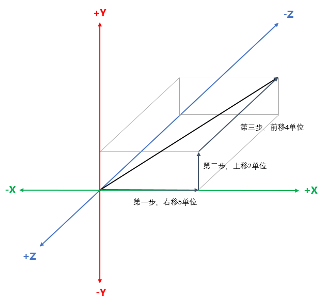

<center>图5-11 向量解释为位移序列</center>

　　用向量加法对图5-11做数学解释，即为：
$$
\begin{bmatrix}5 \\ 2 \\ -4\end{bmatrix}
=
\begin{bmatrix}5 \\ 0 \\ 0\end{bmatrix}
+
\begin{bmatrix}0 \\ 2 \\ 0\end{bmatrix}
+
\begin{bmatrix}0 \\ 0 \\ -4\end{bmatrix}
$$
　　这个看起来很简单，但它是一个非常有用的概念。后面会用到类似的技术在坐标系间转换向量。

　　计算一个点到另外一个点的位移是一种普遍的需求，可以使用三角形法则和向量减法来解决这个问题。下图5-12展示了如何用 $\vec b - \vec a$  来计算 $\vec a$ 到 $\vec v$ 的位移向量。


<center>图5-12 用2D向量减法计算从 $\vec a$ 到 $\vec b$ 的向量</center>

　　如上图所示，为了计算 $\vec a$ 到 $\vec b$ 的向量，将点 $\vec a$ 和点 $\vec b$ 解释为从原点开始的向量，接着使用三角形法则。事实上，在有些地方，向量确实被定义为两个点的减法，这是向量的另外一种几何意义。

　　这里需要注意，减法 $\vec b - \vec a$ 代表了从 $\vec a$ 到 $\vec b$ 的向量。简单的求“两点之间”的向量是没有意义的，因为没有指明方向。求一个点到另一个点的向量才有实际意义。

### 5.7.3 两点间的距离计算

　　首先，距离的定义就是两点间线段的长度。因为向量是有向线段，所以从几何意义上说，两点间的距离等于从一个点到另外一个点的向量的长度。现在我们来求3D中的两点间的距离。先计算从 $\vec a$ 到 $\vec b$ 的向量 $\vec d$ ，在前面我们已经讨论过如何进行这样的计算了，在3D空间中：
$$
\vec d = \vec b - \vec a = \begin{bmatrix}b_x - a_x \\ b_y - a_y \\ b_z - a_z\end{bmatrix}
$$
　　$\vec a$ 到 $\vec b$ 的距离等于向量 $\vec d$ 的长度。按照前面公式5.5，把上述的 $\vec d$ 代入，可得：
$$
\begin{Vmatrix}\vec d\end{Vmatrix} = \begin{Vmatrix}\vec b - \vec a\end{Vmatrix} = \sqrt{(b_x - a_x)^2 + (b_y - a_y)^2 +（b_z - a_z)^2}
\tag{5.12}
$$
　　这就是3D距离公式。有了这个公式，那2D的公式更加简单了，2D距离公式可得：
$$
\begin{Vmatrix}\vec d\end{Vmatrix} = \begin{Vmatrix}\vec b - \vec a\end{Vmatrix} = \sqrt{(b_x - a_x)^2 + (b_y - a_y)^2}
\tag{5.13}
$$
　　最后还要注意一点就是，距 离是没有方向的，所以不管是从 $\vec a$ 到 $\vec b$ 还是从 $\vec b$ 到 $\vec a$，虽然公式上回有点差异，实际上计算结果是相同的。


## <center>5.8 向量点乘</center>

　　从前面的讨论我们可以知道，标量和向量是可以相乘的。实际上，两个向量也可以相乘，当然，这里的相乘跟标量的相乘意义是不一样的实数。而且向量与向量相乘有两种，我们首先讨论点乘（也叫做内积、数量积）。

### 5.8.1 运算法则

　　在数学中，数量积（也称作点乘、内积）是接受在实数 R 上的两个向量并返回一个实数值标量的二元运算。它是欧几里得空间的标准内积。简单点来讲，向量点乘就是对应分量乘积的和，其结果是一个标量。如下公式5.14表述向量点乘：
$$
\begin{bmatrix}a_1 \\ a_2  \\ \cdot \\ \cdot \\ \cdot \\ a_{n-1} \\ a_n\end{bmatrix} 
\cdot 
\begin{bmatrix}b_1 \\ b_2 \\ \cdot \\ \cdot \\ \cdot \\ b_{n-1} \\ b_n\end{bmatrix}
=
a_1 b_1 + a_2 b_2 + \cdots + a_{n-1} b_{n-1} + a_n b_n
\tag{5.14}
$$
　　使用连加符号简写为：
$$
\vec a \cdot \vec b = \sum_{i=1}^na_ib_i
\tag{5.15}
$$
　　在2D和3D中，则为：
$$
\begin{aligned}
& \vec a \cdot \vec b = a_x b_x + a_y b_y \\
& \vec a \cdot \vec b = a_x b_x + a_y b_y + a_z b_z
\end{aligned}
\tag{5.16}
$$
　　向量点乘跟标量与向量的乘法一样，向量点乘的优先级高于加法和减法。从公式7.15中可以看出，向量点乘是满足交换律的： $\vec a \cdot \vec b = \vec b \cdot \vec a$ 。有关点乘的更多法则将在后面给出。

### 5.8.2 几何意义

　　点乘几何意义有两种，一种是用来判断两向量朝向是同向还是反向的，另外一种是求一个向量在另外一个向量上的投影。下面我们逐个来讨论下。

#### 5.8.2.1 向量夹角

　　我们先来讨论下点乘的基本几何意义，就是如何判断两个两向量的朝向问题。如下图5-13所示：


<center>图5-13 点乘的几何展示</center>

　　点乘等于向量大小与向量夹角的余弦值的积，公式如下：
$$
\vec a \cdot \vec b = \begin{Vmatrix}\vec a\end{Vmatrix} \begin{Vmatrix}\vec b\end{Vmatrix} \cos{\theta}
\tag{5.17}
$$
　　通过公式5.17，可以推导求夹角 $\theta$ 的公式如下：
$$
\theta = \arccos{\left(\frac{\vec a \cdot \vec b}{\begin{Vmatrix}\vec a\end{Vmatrix} \begin{Vmatrix}\vec b\end{Vmatrix}}\right)}
\tag{5.18}
$$
　　如果 $\vec a$ 、$\vec b$ 是单位向量，就可以避免公式5.18中的除法运算。这样子，公式7.18中的分母是1，只剩下：
$$
\theta = \arccos{\left(\vec a \cdot \vec b\right)}
$$
　　一般，如果我们只判断两向量的朝向是否相同还是相反，我们只需要取点乘结果的符号就可以判断了，而不需要知道夹角的确切值，这个是比较常用的应用场景。如下表所示：

| $\vec a \cdot \vec b$ | $\theta$                  | $\vec a$ 和 $\vec b$ |
| :-------------------: | :-----------------------: | :------------------: |
| $\gt 0$               | $0° \le \theta \lt 90°$   | 方向基本相同         |
| 0                     | $\theta = 90°$            | 正交、垂直           |
| $\lt 0$               | $90° \lt \theta \le 180°$ | 方向基本相反         |

　　向量大小并不影响点乘结果的符号，所以一般要判断朝向，我们都直接忽略了 $\vec a$ 和 $\vec b$ 的大小，只看结果符号。注意，如果 $\vec a$ 、$\vec b$ 中任意一个为零，那么 $\vec a \cdot \vec b$的结果也等于零。因此，点乘对零向量的解释是，零向量和任意其他向量都垂直。

　　另外，点乘一般也应用于判断三角形面朝向是同向还是反向，更进一步的应用就是背面剔除。

#### 5.8.2.2 向量投影

　　点乘的另外一种几何意义就是求向量投影。设给定两个向量 $\vec v$ 和 $\vec n$ ，能将 $\vec v$ 分解成两个分量：$\vec  v_{\parallel}$ 和 $\vec v_{\perp}$ 。它们分别平行于和垂直于 $\vec n$ ，并满足 $\vec v = \vec v_{\perp} + \vec v_{\parallel}$ 。一般称平行分量 $v_{\parallel}$ 为 $\vec v$ 在 $\vec n$ 上的投影。

　　我们使用点乘计算投影。如下图5-14展示了其几何解释：


<center>5-14 向量的投影</center>

　　下面我们先求 $\vec v_{\parallel}$ 。由于 $\vec v_{\parallel}$ 平行于 $\vec n$ ，它可以表示为：
$$
\vec v{\parallel} = \vec n \frac{\begin{Vmatrix}\vec v_{\parallel}\end{Vmatrix}}{\begin{Vmatrix}\vec n\end{Vmatrix}}
$$
　　因此，只要能够求出 $\vec v_{\parallel}$ 的模，就能够计算出该投影向量的值了。恰巧，三角分解能帮我们求出该值：
$$
\begin{aligned}
& \cos{\theta} = \frac{\begin{Vmatrix}\vec v_{\parallel}\end{Vmatrix}}{\begin{Vmatrix}\vec v\end{Vmatrix}} \\
& \cos{\theta} \begin{Vmatrix}\vec v\end{Vmatrix} = \begin{Vmatrix}\vec v_{\parallel}\end{Vmatrix}
\end{aligned}
$$
　　将 $\begin{Vmatrix}\vec v_{\parallel}\end{Vmatrix}$ 代入原等式并应用公式5.18，得到：
$$
\begin{aligned}
\vec v_{\parallel} 
&= \vec n \frac{\begin{Vmatrix}\vec v\end{Vmatrix} \cos{\theta}}{\begin{Vmatrix}\vec n\end{Vmatrix}} \\
&= \vec n \frac{\begin{Vmatrix}\vec v\end{Vmatrix} \begin{Vmatrix}\vec n\end{Vmatrix} \cos{\theta}}{\begin{Vmatrix}\vec n\end{Vmatrix}^2} \\
&= \vec n \frac{\vec v \cdot \vec n}{\begin{Vmatrix}\vec n\end{Vmatrix}^2}
\end{aligned}
\tag{5.19}
$$
 　　如果 $\vec n$ 是单位向量，除法就可以省略了。知道了 $\vec v_{\parallel}$ ，求 $\vec v_{\perp}$ 就容易了饿，如下：
$$
\begin{aligned}
\vec v_{\perp} + \vec v_{\parallel} &= \begin{Vmatrix}\vec v\end{Vmatrix} \\
\vec v_{\perp} &= \begin{Vmatrix}\vec v\end{Vmatrix} - \vec v_{\parallel} \\ 
&= \begin{Vmatrix}\vec v\end{Vmatrix} - \vec n \frac{\vec v \cdot \vec n}{\begin{Vmatrix}\vec n\end{Vmatrix}^2}
\end{aligned}
$$
　　我们后面讨论到的内容将会多次使用该公式将向量分解为平行和垂直于其他向量的两个分量。


## <center>5.9 向量叉乘</center>

　　前面讨论了一种向量乘法是点乘，下面我们讨论另外一种向量乘法称作叉乘（也叫作外积、向量基）。叉乘是一种在向量空间中向量的二元运算。与点乘不同，它的运算结果是一个向量而不是一个标量。

### 5.9.1 运算法则

　　两个向量 $\vec a$ 和 $\vec b$ 的叉乘写作 $\vec a \times \vec b$ 。这里要把叉乘号写出来，不能像标量乘法那样省略它。有时候也写作 $\vec a \bigwedge \vec b$ ，以避免跟字母混淆。叉乘公式为：
$$
\begin{bmatrix}x_1 \\ y_1 \\ z_1\end{bmatrix} \times \begin{bmatrix}x_2 \\ y_2 \\ z_2\end{bmatrix} 
= 
\begin{bmatrix}y_1 z_2 - z_1 y_2 \\ z_1 x_2 - x_1 z_2 \\ x_1 y_2 - y_1 x_2\end{bmatrix}
\tag{5.20}
$$
　　叉乘的运算优先级和点乘一样，乘法在加减法之前计算。当点乘和叉乘在一起时，叉乘优先计算，如：$\vec a \cdot \vec b \times \vec c = \vec a \cdot (\vec b \times \vec c)$ 。因为点乘返回一个标量，同时标量和向量间不能叉乘，所以 $(\vec a \cdot \vec b) \times \vec c$ 没有定义。运算 $\vec a \cdot (\vec b \times \vec c)$ 称作三重积。后面会给出这类运算的一些特殊性质。

　　向量叉乘跟点乘不一样，叉乘是不满足交换律的。但是，它满足反交换律：$\vec a \times \vec b = -(\vec b \times \vec a)$ 。叉乘也不满足结合律。一般而言， $(\vec a \times \vec b) \times c \ne \vec a \times (\vec b \times \vec c)$ 。有关叉乘的更多运算法则会在后面给出。

### 5.9.2 几何意义

　　叉乘得到的向量垂直于原来的两个向量。如下图5-15所示：


<center>图5-15 向量叉乘</center>

　　上图中，向量 $\vec a$ 和 $\vec b$ 在一个平面中。向量 $\vec a \times \vec b$ 指向该平面的正上方，垂直于 $\vec a$ 和 $\vec b$ 。$\vec a \times \vec b$ 的长度等于向量的大小与向量夹角 $\sin$ 值的积，如下：
$$
\begin{Vmatrix}\vec a \times \vec b\end{Vmatrix} = \begin{Vmatrix}\vec a\end{Vmatrix} \begin{Vmatrix}\vec b\end{Vmatrix} \sin{\theta}
\tag{5.21}
$$
　　从上公式5.21可以看出，$\vec a \times \vec b$ 也等于以 $\vec a$ 和 $\vec b$ 为两边的平行四边形的面积。下面我们来验证这个结论。如下图5-16：


<center>图5-16 叉乘和平行四边形面积</center>

　　由经典几何知识可知平行四边形的面积是 $A = base \times height$ ，即底和高的乘积。设 a、b 分辨为 $\vec a$ 、 $\vec b$ 的长度，而高 $h = b\sin{\theta}$ ，所以有：
$$
\begin{aligned}
A &= bh \\
&= b(a\sin{\theta}) \\
&= \begin{Vmatrix}\vec a\end{Vmatrix} \begin{Vmatrix}\vec b\end{Vmatrix} \sin{\theta} \\
&= \begin{Vmatrix}\vec a \times \vec b\end{Vmatrix}
\end{aligned}
$$
　　如果 $\vec a$ 、 $\vec b$ 平行或任意一个为 $\bf 0$ ，则 $\vec a \times \vec b = \bf 0$ 。叉乘对零向量的解释为：它平行于任意其他向量。注意这和点乘的解释是不同，点乘的解释是和任意其他向量垂直。其实，定义零向量平行或者垂直于任意向量都是不对的，因为零向量是没有方向的。这里只是通过这个定义叉乘为 $\bf 0$ 的情况。

　　已经证明了 $\vec a \times \vec b$ 垂直于 $\vec a$ 、$\vec b$ 。但是垂直于 $\vec a$ 、$\vec b$ 。但是垂直于 $\vec a$ 、$\vec b$ 有两个方向。$\vec a \times \vec b$ 指向哪个方向呢？通过将 $\vec a$ 的头与 $\vec b$ 的尾相接，并检查从 $\vec a$ 到 $\vec b$ 是顺时针还是逆时针，能够确定 $\vec a \times \vec b$ 的方向。在右手坐标系中，如果 $\vec a$ 和 $\vec b$ 呈逆时针，那么 $\vec a \times \vec b$ 指向您。如果 $\vec a$ 和 $\vec b$ 呈顺时针，$\vec a \times \vec b$ 远离您。在左手坐标系中，恰好相反。如果 $\vec a$ 和 $\vec b$ 呈逆时针，那么 $\vec a \times \vec b$ 远离您。如果 $\vec a$ 和 $\vec b$ 呈顺时针，$\vec a \times \vec b$ 指向您。下图5-17分别展示了顺时针和逆时针方向：


<center>图5-17 顺时针和逆时针方向</center>

　　注意，探测顺时针还是逆时针，必须让 $\vec a$ 的头与 $\vec b$ 的尾相接。和图5-15比较，那里是尾相接。图5-15中的尾-尾相接是用来求向量间的夹角。然而，在决定顺时针还是逆时针时，必须是头-尾相接，如图5-17所示。

　　叉乘最重要的应用就是创建垂直于平面、三角形的向量，也即是其法线。


## <center>5.10 向量运算法则</center>

　　下面列出了一些有用的向量运算法则。

| <center>公式</center>                                                                                                         | <center>解释</center>                          |
| ----------------------------------------------------------------------------------------------------------------------------- | ---------------------------------------------- |
| $\vec a + \vec b = \vec b + \vec a$                                                                                           | 向量加法的交换律                               |
| $\vec a - \vec b = \vec a + (- \vec b)$                                                                                       | 向量减法的定义                                 |
| $(\vec a + \vec b) + \vec c = \vec a + (\vec b + \vec c)$                                                                     | 向量加法结合律                                 |
| $s(t\vec a) = (st) \vec a$                                                                                                    | 标量乘法的结合律                               |
| $k(\vec a + \vec b) = k\vec a + \vec b$                                                                                       | 标量乘法对向量加法的分配律                     |
| $\begin{Vmatrix}k\vec a\end{Vmatrix} =                                                                                        | k                                              | \begin{Vmatrix}\vec a\end{Vmatrix}$ | 向量乘以标量相当于以标量的绝对值为因子缩放向量 |
| $\begin{Vmatrix}\vec a\end{Vmatrix} \ge 0$                                                                                    | 向量的大小非负                                 |
| $\begin{Vmatrix}\vec a\end{Vmatrix}^2 + \begin{Vmatrix}\vec b\end{Vmatrix}^2 = \begin{Vmatrix}\vec a + \vec b\end{Vmatrix}^2$ | 勾股定理在向量加法中的应用                     |
| $\begin{Vmatrix}\vec a\end{Vmatrix} + \begin{Vmatrix}\vec b\end{Vmatrix} \ge \begin{Vmatrix}\vec a + \vec b\end{Vmatrix}$     | 向量加法的三角形法则                           |
| $\vec a \cdot \vec b = \vec b \cdot \vec a$                                                                                   | 点乘的交换律                                   |
| $\begin{Vmatrix}\vec a\end{Vmatrix} = \sqrt{\vec a \cdot \vec a}$                                                             | 用点乘定义向量大小                             |
| $k(\vec a \cdot \vec b) = (k\vec a) \cdot \vec b = \vec a \cdot (k \vec b)$                                                   | 标量乘法对点乘的结合律                         |
| $\vec a \cdot (\vec b + \vec c) = \vec a \cdot \vec b + \vec a \cdot \vec c$                                                  | 点乘对向量加减法的分配律                       |
| $\vec a \times \vec a = \bf0$                                                                                                 | 任意向量与自身的叉乘等于零向量                 |
| $\vec a \times \vec b = -(\vec b \times \vec a)$                                                                              | 叉乘逆交换律                                   |
| $\vec a \times \vec b = (-\vec a) \times (-\vec b)$                                                                           | 两个向量叉乘的结果等于两个向量反方向叉乘的结果 |
| $k(\vec a \times \vec b) = (k\vec a) \times \vec b = \vec a \times (k\vec b)$                                                 | 标量乘法对叉乘的结合律                         |
| $\vec a \times (\vec b + \vec c) = \vec a \times \vec b + \vec a \times \vec c$                                               | 叉乘对向量加法的分配律                         |
| $\vec a \cdot (\vec a \times \vec b) = \bf 0$                                                                                 | 向量与另一向量的叉乘再点乘该向量本身等于零     |

<div style="page-break-after:always;"></div>


# <center>六、3D数学——矩阵</center>

本篇概要

- 矩阵的定义和表示
- 矩阵与向量的关系
- 矩阵的转置
- 标量与矩阵的乘法运算
- 矩阵乘法运算
- 向量与矩阵的乘法运算
- 矩阵的几何意义
- 矩阵的线性变换——旋转、缩放、镜像、正交投影
- 矩阵的行列式和逆
- 正交矩阵
- 齐次矩阵——平移矩阵、仿射变换、透视投影
- 从 $4 \times 4$ 仿射矩阵提取平移、旋转和缩放矩阵

　　矩阵是3D数学的重要基础。它主要用来描述两个坐标系统间的关系，通过定义一种运算而将一个坐标系中的向量变换到另一个坐标系中。


## <center>6.1 矩阵的数学定义</center>

　　在线性代数中，矩阵就是以行和列的形式组织的矩形数字块。之前我们讨论过曾将向量定义为一维数组，矩阵也能像那样定义为二维数组。向量是标量的数组，而矩阵则是向量的数组。

　　数学上，一个 $m \times n$ 的矩阵是一个由 m 行和 n 列元素排列成的矩形整列。矩阵里的元素可以是数字、符号或数学式。我们一般用黑体大写字母来表示矩阵。如：**M** ，**A** ，**R** 。需要引用矩阵的分量时，采用下标法，常使用对应的字母小写来表示，如下面 $3 \times 3$ 矩阵所示：
$$
\bf M = 
\begin{bmatrix}
m_{11} & ｍ_{12} & m_{13} \\
m_{21} & m_{22} & m_{23} \\
m_{31} & m_{32} & m_{33}
\end{bmatrix}
$$
　　$m_{ij}$ 表示 **M** 的第 i 行第 j 列元素。矩阵的下标从1开始，所以第一行和第一列都用数字1。注意，这里数学上的矩阵不要和C/C++语言中以0作为数组下标起点有所不同，当然，实际在开发语言C/C++中表示矩阵的时候，下标是从0开始。

### 6.1.1 方阵

　　行数和列数相同的矩阵称作为方阵，我们在3D数学中主要用到的就是 $2 \times 2$ 、$3 \times 3$ 、$4 \times 4$ 方阵。所以我们接下来主要也是讨论这几种方阵。方阵的对角线元素就是方阵中行号和列号相同的元素。例如：$3 \times 3$ 矩阵 **M** 的对角线元素为 $m_{11}$ ，$m_{22}$ ，$m_{33}$ 。其它元素均为非对角线元素。

　　如果所有非对角线元素都为0，那么这种矩阵就叫做**对角矩阵**。如：
$$
\begin{bmatrix}
1 & 0 & 0 & 0 \\
0 & 2 & 0 & 0 \\
0 & 0 & 3 & 0 \\
0 & 0 & 0 & 4
\end{bmatrix}
$$
　　**单位矩阵**是一种特殊的对角矩阵。n 维单位矩阵记作 $\bf I_n$ ，是 $n \times n$ 矩阵，对角线元素为 1，其他元素为0。例如：$3 \times 3$ 单位矩阵为：
$$
\bf I_3 = 
\begin{bmatrix}
1 & 0 & 0 \\
0 & 1 & 0 \\
0 & 0 & 1
\end{bmatrix}
\tag{6.1}
$$
　　一般情况下上下文都会说明单位矩阵的维数，这时可省略下标直接记单位矩阵为 **I**。

　　单位矩阵是矩阵的**乘法单位元**。其基本性质是用任意一个矩阵乘以单位矩阵，都将得到原矩阵。所以，在某种意义上，单位矩阵对矩阵的作用就跟 1 对于标量的作用。

### 6.1.2 矩阵与向量的关系

　　向量可以作为矩阵来使用。矩阵的行数和列数可以是任意正整数，当然也包括 1。向量其实就是一行或者一列的矩阵。一个 n 维向量能被当作 $1 \times n$ 矩阵或 $n \times 1$ 矩阵。$1 \times n$ 矩阵称作行向量，$n \times 1$ 矩阵称作列向量。行向量横着写，列向量竖着写，例如：
$$
\begin{aligned}
\begin{bmatrix}1 & 2 & 3\end{bmatrix} \qquad \begin{bmatrix}4 \\ 5 \\ 6\end{bmatrix}
\end{aligned}
$$
　　这两种记法都是混合使用的。其实，在几何意义上它们是一样的，绝大多数情况下它们的区别也不重要。不过跟向量和矩阵乘法的时候，需要注意向量到底是行向量和列向量。

### 6.1.3 矩阵的转置

　　一个 $m \times n$ 矩阵 **M**。**M** 的转置记作 $\bf M^T$ ，是一个 $n \times m$ 矩阵，它的列由 **M** 的行组成。可以从另一方面理解， $\bf M_{ij}^T = \bf M_{ji}$ ，即沿着矩阵的对角线翻折。下面矩阵转置的例子：
$$
\begin{bmatrix}
a & b & c \\
d & e & f \\
g & h & i
\end{bmatrix}^T
=
\begin{bmatrix}
a & d & g \\
b & e & h \\
c & f & i
\end{bmatrix}
\tag{6.2}
$$
　　对于向量来说，转置将使行向量变成列向量，使列向量成为行向量，如下公式：
$$
\begin{bmatrix}x & y & z\end{bmatrix}^T
=
\begin{bmatrix}x \\ y \\ z\end{bmatrix}
\qquad
\begin{bmatrix}x \\ y \\ z\end{bmatrix}^T
=
\begin{bmatrix}x & y & z\end{bmatrix}
\tag{6.3}
$$
　　下述有两条很简单但又很重要的关于矩阵转置的引理：

- 对于任意矩阵 **M** ，$(\bf M^T)T = \bf M$ 。从另一个方面来说，将一个矩阵转置后，再转置一次，便会得到原矩阵。这条法则对向量也使用。
- 对于任意对角矩阵 **D** ，都有 $\bf D^T = \bf D$ ，包括单位矩阵 **I** 也如此。

### 6.1.4 标量与矩阵的乘法

　　矩阵 **M** 能和标量 k 相乘，结果是一个和 **M** 维数相同的矩阵。矩阵和标量相乘，标量经常写在左边，不需要写乘号。这种乘法法则很直观，即用 k 乘以 **M** 中的每个元素。如下公式所示：
$$
\begin{aligned}
k \bf M 
= 
k \begin{bmatrix}
m_{11} & m_{12} & m_{13} \\
m_{21} & m_{22} & m_{23} \\
m_{31} & m_{32} & m_{33}
\end{bmatrix}
=
\begin{bmatrix}
km_{11} & km_{12} & km_{13} \\
km_{21} & km_{22} & km_{23} \\
km_{31} & km_{32} & km_{33}
\end{bmatrix}
\end{aligned}
\tag{6.4}
$$

### 6.1.5 矩阵的乘法

　　在一些特定情况下，矩阵之间是可以相乘的。它只有在第一个矩阵的列数和第二个矩阵的行数相同时才有意义。一个 $m \times p$ 矩阵 **A** 能够乘以一个 $p \times $n 矩阵 **B** ，结果是一个 $m \times n$ 矩阵，记作 **AB**。

　　如果矩阵 **A** 的列数和 **B** 的行数不匹配，则乘法 **AB** 无意义。

　　矩阵乘法计算如下：记 $m \times p$ 矩阵 **A** 与 $p \times n$ 矩阵 **B** 的积 $m \times n$ 矩阵 **AB** 为 **C** 。**C** 的任意元素 $c_{ij}$ 等于 **A** 的第 i 行向量与 **B** 的第 j 列向量的点乘结果。如下公式为：
$$
c_{ij} = \sum_{k=1}^n a_{ik}b_{kj}
\tag{6.5}
$$
　　结果中的任意元素 $c_{ij}$ ，取 **A** 的第 i 行和 **B** 的第 j 列，将行和列中的对应元素相乘，然后将结果相加（等于 **A** 的 i 行和 **B** 的 j 列的点积）。$c_{ij}$ 就等于这个和。

　　在我们实际应用中，我们一般使用 $2 \times 2$ 矩阵、$3 \times 3$ 矩阵和 $4 \times 4$ 矩阵这三种方阵相乘的情况。

　　下述公式是 $2 \times 2$ 方阵乘法：
$$
\begin{aligned}
\bf A \bf B 
& = 
\begin{bmatrix}
a_{11} & a_{12} \\
a_{21} & a_{22}
\end{bmatrix}
\begin{bmatrix}
b_{11} & b_{12} \\
b_{21} & b_{22}
\end{bmatrix}
\\ 
& =
\begin{bmatrix}
a_{11}b_{11} + a_{12}b_{21} & a_{11}b_{12} + a_{12}b_{22} \\
a_{21}b_{11} + a_{22}b_{21} & a_{21}b_{12} + a_{22}b_{22}
\end{bmatrix}
\end{aligned}
\tag{6.6}
$$
　　下述公式是 $3 \times 3$ 方阵乘法：
$$
\begin{aligned}
\bf A \bf B &= 
\begin{bmatrix}
a_{11} & a_{12} & a_{13} \\
a_{21} & a_{22} & a_{23} \\
a_{31} & a_{32} & a_{33}
\end{bmatrix}
\begin{bmatrix}
b_{11} & b_{12} & a_{13} \\
b_{21} & b_{22} & b_{23} \\
b_{31} & b_{32} & b_{33}
\end{bmatrix}
\\
&=
\begin{bmatrix}
a_{11}b_{11} + a_{12}b_{21 }+ a_{13}b_{31} 
& a_{11}b_{12} + a_{12}b_{22} + a_{13}b_{32} 
& a_{11}b_{13} + a_{12}b_{23} + a_{13}b_{33} \\
a_{21}b_{11} + a_{22}b_{21} + a_{13}b_{31}
& a{21}b_{12} + a_{22}b_{22} + a_{23}b_{32}
& a_{21}b_{13} + a_{22}b_{23} + a_{23}b_{33} \\
a_{31}b_{11} + a_{32}b_{21} + a_{33}b_{31}
& a{31}b_{12} + a_{32}b_{22} + a_{33}b_{32}
& a_{31}b_{13} + a_{32}b_{23} + a_{33}b_{33} \\
\end{bmatrix}
\end{aligned}
\tag{6.7}
$$
　　下述公式是 $4 \times 4$ 方阵乘法：
$$
\begin{aligned}
\bf A \bf B
&=
\begin{bmatrix}
a_{11} & a_{12} & a_{13} & a_{14} \\
a_{21} & a_{22} & a_{23} & a_{24} \\
a_{31} & a_{32} & a_{33} & a_{34} \\
a_{41} & a_{42} & a_{43} & a_{44}
\end{bmatrix}
\begin{bmatrix}
b_{11} & b_{12} & b_{13} & b_{14} \\
b_{21} & b_{22} & b_{23} & b_{24} \\
b_{31} & b_{32} & b_{33} & b_{34} \\
b_{41} & b_{42} & b_{43} & b_{44}
\end{bmatrix}
\\
&=
\begin{bmatrix}
a_{11}b_{11} + a_{12}b_{21} + a_{13}b_{31} + a_{14}b_{41}
& a_{11}b_{12} + a_{12}b_{22} + a_{13}b_{32} + a_{14}b_{42}
& a_{11}b_{13} + a_{12}b_{23} + a_{13}b_{33} + a_{14}b_{43}
& a_{11}b_{14} + a_{12}b_{24} + a_{13}b_{34} + a_{14}b_{44} \\
a_{21}b_{11} + a_{22}b_{21} + a_{23}b_{31} + a_{24}b_{41}
& a_{21}b_{12} + a_{22}b_{22} + a_{23}b_{32} + a_{24}b_{42}
& a_{21}b_{13} + a_{22}b_{23} + a_{23}b_{33} + a_{24}b_{43}
& a_{21}b_{14} + a_{22}b_{24} + a_{23}b_{34} + a_{24}b_{44} \\
a_{31}b_{11} + a_{32}b_{21} + a_{33}b_{31} + a_{34}b_{41}
& a_{31}b_{12} + a_{32}b_{22} + a_{33}b_{32} + a_{34}b_{42}
& a_{31}b_{13} + a_{32}b_{23} + a_{33}b_{33} + a_{34}b_{43}
& a_{31}b_{14} + a_{32}b_{24} + a_{33}b_{34} + a_{34}b_{44} \\
a_{41}b_{11} + a_{42}b_{21} + a_{43}b_{31} + a_{44}b_{41}
& a_{41}b_{12} + a_{42}b_{22} + a_{43}b_{32} + a_{44}b_{42}
& a_{41}b_{13} + a_{42}b_{23} + a_{43}b_{33} + a_{44}b_{43}
& a_{41}b_{14} + a_{42}b_{24} + a_{43}b_{34} + a_{44}b_{44} \\
\end{bmatrix}
\end{aligned}
\tag{6.8}
$$

　　关于矩阵乘法的注意事项：

- 任意矩阵 **M** 乘以方阵 **S** ，不管从哪边乘，都将得到与原矩阵大小相同的矩阵。当然，前提是假定乘法有意义。如果 **S** 是单位矩阵，结果将是原矩阵 **M** ，即：**MI** = **IM** = **M** （这就是 **I** 被称为单位矩阵的缘故）。
- 矩阵乘法不满足交换律，即： $\bf A \bf B \ne \bf B \bf A$ 。
- 矩阵乘法满足结合律，即：$(\bf A \bf B) \bf C = \bf A (\bf B \bf C)$ 。（假设 **A** ，**B** ，**C** 的维数使其乘法有意义，要注意如果 (**AB**)**C** 有意义，那么 **A**(**BC**) 一定也有意义。）矩阵乘法结合律可以扩展到多个矩阵的情况下。
- 矩阵乘法也满足于标量或向量的结合律，即：$(k\bf A) \bf B = k(\bf A \bf B) = \bf A(k \bf B) \quad (\vec v \bf A) \bf B = \vec v(\bf A \bf B)$ 
- 矩阵积的转置相当于先转置矩阵然后以相反的顺序成： $(\bf A \bf B)^T = \bf B^T \bf A^T$ 。同样这个结论可以扩展到多个矩阵的情形。 

### 6.1.6 向量与矩阵的乘法

　　前面我们讨论过向量其实就是一行或者一列的矩阵，所以能够用矩阵相乘的规则在向量与矩阵乘法上。在这里，就会出现前面讨论过的行向量和列向量的区别。

　　下述公式展示了3维行向量左乘 $3 \times 3$ 矩阵：
$$
\begin{bmatrix}
x & y & z
\end{bmatrix}
\begin{bmatrix}
m_{11} & m_{12} & m_{13} \\
m_{21} & m_{22} & m_{23} \\
m_{31} & m_{32} & m_{33}
\end{bmatrix}
=
\begin{bmatrix}
xm_{11} + ym_{21} + zm_{31} & xm_{12} + ym_{22} + zm_{32} & xm_{13} + ym_{23} + zm_{33}
\end{bmatrix}
\tag{6.9}
$$
　　下述公式展示了3维列向量右乘 $3 \times 3$ 矩阵：
$$
\begin{bmatrix}
m_{11} & m_{12} & m_{13} \\
m_{21} & m_{22} & m_{23} \\
m_{31} & m_{32} & m_{33}
\end{bmatrix}
\begin{bmatrix}
x \\ y \\ z
\end{bmatrix}
=
\begin{bmatrix}
xm_{11} + ym_{12} + zm_{13} \\
xm_{21} + ym_{22} + zm_{23} \\
xm_{31} + ym_{32} + zm_{33}
\end{bmatrix}
\tag{6.10}
$$
　　从公式6.9可见，行向量左乘矩阵时，结果是行向量；从公式8.10可见，列向量右乘矩阵时，结果是列向量。然而，如果是列向量左乘矩阵或者行向量右乘矩阵，这是无意义的。所以不能用列向量左乘矩阵，也不能用行向量右乘矩阵。

　　关于向量和矩阵相乘的注意事项：

- 结果向量中的每个元素都是原向量与矩阵中单独行或列的点积。
- 矩阵中的各元素决定了输入向量中特定元素在输出向量占的比重。如：$m_{11}$ 决定了输入 x 对输出 x 值的贡献。
- 向量矩阵乘法满足对向量加法的分配律，对于向量 $\vec v$ ， $\vec w$ 和矩阵 **M** ，有：$(\vec v + \vec w) \bf{M} = \vec v \bf{M} + \vec w \bf{M}$ 。

　　从公式6.9和公式6.10可知，行向量左乘矩阵和列向量右乘矩阵所得结果是完全不一样的。这个是大家需要重点注意的。我们后面的所有讨论都是基于列向量右乘矩阵。


## <center>6.2 矩阵的几何意义</center>

　　矩阵独立的几何意义表现为对向量的作用结果。矩阵对一个向量是如何作用的呢？我们下面来讨论。

　　一般来说，方阵能描述任意线性变换。线性变换保留了直线和平行线，而原点没有移动。线性变换保留直线的同时，其他的几何性质如长度、角度、面积或体积都可能被变换改变。线性变换可能“拉伸”坐标系，但不会“弯曲”或“卷折”坐标系。

### 6.2.1 矩阵对一个向量是如何作用的

　　前面我们讨论过向量在几何上能被解释成一系列与轴平行的位移。然后又讨论了依据三角形法则怎样将这个位移序列解释成向量的加法：
$$
\begin{bmatrix}5 \\ 2 \\ -4\end{bmatrix}
=
\begin{bmatrix}5 \\ 0 \\ 0\end{bmatrix}
+
\begin{bmatrix}0 \\ 2 \\ 0\end{bmatrix}
+
\begin{bmatrix}0 \\ 0 \\ -4\end{bmatrix}
$$
　　一般来说，任意向量 $\vec v$ 都能写为“扩展”形式：
$$
\vec v =
\begin{bmatrix}
x \\ y \\ z
\end{bmatrix}
=
\begin{bmatrix}
x \\ 0 \\ 0
\end{bmatrix}
+
\begin{bmatrix}
0 \\ y \\ 0
\end{bmatrix}
+
\begin{bmatrix}
0 \\ 0 \\ z
\end{bmatrix}
$$
　　还有另外一种形式为：
$$
\vec v = 
\begin{bmatrix}
x \\ y \\ z
\end{bmatrix}
=
x\begin{bmatrix}
1 \\ 0 \\ 0
\end{bmatrix}
+
y\begin{bmatrix}
0 \\ 1 \\ 0
\end{bmatrix}
+
z\begin{bmatrix}
0 \\ 0 \\ 1
\end{bmatrix}
$$
　　从上式我们很容易看出来，右边的单位向量就是 x ，y ，z 轴。向量的每个坐标都表明了平行于相应坐标的有向位移。

　　下面我们把上面的向量和重新写一遍。我们分别将 $\vec i$ ，$\vec j$ 和 $\vec k$ 定义为指向 +x ，+y 和 +z 方向的单位向量，如下公式：
$$
\vec v = x\vec i + y\vec j + z\vec k
\tag{6.11}
$$
　　这样，向量 $\vec v$ 就被表示成向量 $\vec i$ ，$\vec j$ ，$\vec k$ 的线性变换。向量 $\vec i$ ，$\vec j$ ，$\vec k$ 称作向量基。这里基向量是笛卡尔坐标轴，然而事实上，一个任意坐标系都能用任意 3 个基向量定义，当然这三个向量要线性无关（也就是不在同一平面上）。以向量 $\vec i$ ，$\vec j$ ，$\vec k$ 为列构建一个 $3 \times 3$ 矩阵 **M** ，可得到如下公式所示：
$$
\bf M 
= \begin{bmatrix}\vec i & \vec j & \vec k\end{bmatrix} 
= 
\begin{bmatrix}
i_x & j_x & k_x \\
i_y & j_y & k_y \\
i_z & j_z & k_z
\end{bmatrix}
\tag{6.12}
$$
　　用一个向量右乘这个矩阵，可得：
$$
\begin{aligned}
\begin{bmatrix}
i_x & j_x & k_x \\
i_y & j_y & k_y \\
i_z & j_z & k_z
\end{bmatrix}
\begin{bmatrix}
x \\ y \\ z
\end{bmatrix}
&=
\begin{bmatrix}
xi_x + yj_x + zk_x \\
xi_y + yj_y + zk_y \\
xi_z + yj_z + zk_z
\end{bmatrix}
\\
&=
x\vec i + y\vec j + z\vec k
\end{aligned}
$$
　　这和前面计算转换后的 $\vec v$ 的等式相同。我们发现关键点是：

> 如果把矩阵的列解释为坐标系的基向量，那么矩阵乘以该向量就相当于执行了一次坐标转换。若有 $\bf M \vec a = \vec b$ ，我们就可以说， **M** 将 $\vec a$ 转换到 $\vec b$ 。

　　从这里可以看出，“转换”实际上和“乘法”是等价的。

　　实际上，矩阵只是用一种紧凑的方式来表达坐标转换所需的数学运算。进一步，用线性代数操作矩阵，是一种进行简单转换或导出更复杂转换的简便方法。

### 6.2.2 矩阵的形式

　　上面我们讨论到矩阵实际上就是表达坐标转换，所以当我们观察矩阵的时候，实际上我们是在观察转换，观察新的坐标系。但这个转换看起来像什么？特定的3D转换和 $3 \times 3$ 矩阵的 9 个数字之间有什么关系？怎样构建一个矩阵来做这个转换？

　　为了回答这一系列问题，我们先看一下任意矩阵 **M** 乘以基向量 $\begin{bmatrix}1, 0, 0\end{bmatrix}^T$ ，$\begin{bmatrix}0, 1, 0\end{bmatrix}^T$ ，$\begin{bmatrix}0, 0, 1\end{bmatrix}^T$ 时的情况：
$$
\begin{bmatrix}
m_{11} & m_{12} & m_{13} \\
m_{21} & m_{22} & m_{23} \\
m_{31} & m_{32} & m_{33}
\end{bmatrix}
\begin{bmatrix}
1 \\ 0 \\ 0
\end{bmatrix}
=
\begin{bmatrix}
m_{11} \\ m_{21} \\ m_{31}
\end{bmatrix}
\\
\begin{bmatrix}
m_{11} & m_{12} & m_{13} \\
m_{21} & m_{22} & m_{23} \\
m_{31} & m_{32} & m_{33}
\end{bmatrix}
\begin{bmatrix}
0 \\ 1 \\ 0
\end{bmatrix}
=
\begin{bmatrix}
m_{12} \\ m_{22} \\ m_{32}
\end{bmatrix}
\\
\begin{bmatrix}
m_{11} & m_{12} & m_{13} \\
m_{21} & m_{22} & m_{23} \\
m_{31} & m_{32} & m_{33}
\end{bmatrix}
\begin{bmatrix}
0 \\ 0 \\ 1
\end{bmatrix}
=
\begin{bmatrix}
m_{13} \\ m_{23} \\ m_{33}
\end{bmatrix}
$$
　　从上述变换中，您会发现用 **M** 乘以基向量 $\begin{bmatrix}1, 0, 0\end{bmatrix}^T$ 时，结果是 **M** 的第 1 列。其他两列也有同样的结果。这是一个关键的发现：

> 如果向量右乘矩阵，则矩阵的每一列都能解释为转换后的基向量。如果向量左乘矩阵，则矩阵的每一行都能解释为转换后的基向量。

　　这和前面讨论的发现基本思想是一样的，只不过是从不同的角度看。这个强有力的概念有两条重要的性质：

- 有了一种简单的方法来形象化解释矩阵所代表的变换。
- 有了反向建立矩阵的可能——给出一个期望的变换（如旋转、缩放），能够构造一个矩阵代表此变换。我们所要做的一切就是计算基向量变换，然后将变换后的基向量填入矩阵。

　　接下来我们看一些2D实例。

　　看下列 $2 \times 2$ 矩阵：
$$
\bf M = \begin{bmatrix}2 & -1 \\ 1 & 2\end{bmatrix}
$$
　　这个矩阵代表的变换是什么？首先，从矩阵中抽出基向量 $\vec i$ 和 $\vec j$ ：
$$
\begin{aligned}
\vec i &= \begin{bmatrix}2 & 1\end{bmatrix} \\
\vec j &= \begin{bmatrix}-1 & 2\end{bmatrix}
\end{aligned}
$$
　　下图6-1所示，以“原”基向量（x 轴，y 轴）做参考，在笛卡尔平面中展示了这些向量。


<center>图6-1 2D转换矩阵的列向量</center>

　　如图 6-1 所示， x 基向量变换到上面的 $\vec i$ 向量，y 基向量变换到 $\vec j$ 向量。所以 2D 中想象矩阵的方法就是想象由列向量构成的“L”形状。这个例子中，能够清楚的看到，**M** 代表的部分变换是逆时针旋转 26°。

　　当然，所有向量都被线性变换所影响，不只是基向量。从“L”形状能够得到变量最直观的印象，把基向量构成的整个 2D 平行四边形画完整有助于进一步看到变换对其他向量的影响，如下图6-2所示：


<center>图6-2 矩阵列向量构成的 2D 平行四边形</center>

　　矩阵 **M** 不仅旋转坐标系，还会拉伸它。

　　这种技术也可以应用到 3D 转换中。2D 中有两个基向量，构成“L”型，3D 中有三个基向量，它们形成一个“三脚架”。现在，让我们展示一个转换前的物品，图 6-3 展示了一个茶壶和一个立方体。基向量在单位向量处（即三个坐标轴的基向量 $\begin{bmatrix}1 & 0 & 0\end{bmatrix}$ ，$\begin{bmatrix}0 & 1 & 0\end{bmatrix}$ ，$\begin{bmatrix}0 & 0 & 1\end{bmatrix}$ ）。


<center>图6-3 转换前的茶壶、立方体</center>

　　现在，我们考虑以下的 3D 变换矩阵：
$$
\begin{bmatrix}
0.707 & -1.25 & 0 \\
0.707 & 1.25 & 0 \\
0 & 0 & 1
\end{bmatrix}
$$
　　从矩阵的列中抽出基向量，能想象出该矩阵锁代表的变换。变换后的立方体、茶壶如下图 6-4 所示：


<center>图6-4 转换后的茶壶、立方体</center>

　　这个变换包含 z 轴逆时针转 45° 和一个不规则的缩放，使得茶壶比以前高。基向量分别变成了： $\begin{bmatrix}0.707 & 0.707 & 0\end{bmatrix}$ ，$\begin{bmatrix}-1.25 & 1.25 & 0\end{bmatrix}$ ，$\begin{bmatrix}0 & 0 & 1\end{bmatrix}$ 。大家注意到了，这里变换并没有影响到 z 轴，因为矩阵的第三列是 $\begin{bmatrix}0, 0, 1\end{bmatrix}$ 。

　　我们总结下上述讨论过的概念：

- 当方阵左乘向量时，方阵的列能被解释为坐标系的基向量，当方阵右乘向量时，方阵的行能被解释为坐标系的基向量。
- 为了将向量从原坐标系变换到新坐标系，需要一个矩阵乘以它。
- 从原坐标系到这些基向量定义的新坐标系的变换是一种线性变换。线性变换保持直线和平行线，但角度、长度、面积或体积可能会被改变。
- 任何矩阵乘以零向量仍然得到零向量。因此，方阵所代表的线性变换的原点和原坐标系的原点一致。变换不包含原点。
- 可以通过想象变换后的坐标系的基向量来想象矩阵。这些基向量在 2D 中构成“L”型，在 3D 中构成“三脚架”型。


## <center>6.3 线性变换</center>

　　在数学上，如果满足下面公式，那么映射 $F(\vec a)$ 就是线性的：
$$
F(\vec a+\vec b) = F(\vec a) + F(\vec b)
$$
或者
$$
F(k\vec a) = kF(\vec a)
$$
　　如果映射 F 保持了基本运算：加法和数量乘，那么就可以称该映射为线性的。在这种情况下，讲两个向量相加然后再进行变换得到的结果和先分别进行变换再将变换后的向量相加得到的结果相同。同样，将一个向量数量乘再进行变换和先进行变换再数量乘的结果也是一样的。

　　这个线性变换的定义有两条重要的引理：

- 映射 $F(\vec a) = \bf M \vec a$ ，当 **M** 为任意方阵时，说映射是一个线性变换。这是因为：

$$
  \begin{aligned}
  F(\vec a+\vec b) &= \bf M (\vec a + \vec b) \\
  &= \bf M \vec a + \bf M \vec b\\
  &= F(\vec a) + F(\vec b)
  \end{aligned}
$$

　　和：

$$
\begin{aligned}
  F(k \vec a) &= \bf M (k \vec a) \\
  &= k (\bf M \vec a) \\
  &= k F(\vec a)
  \end{aligned}
$$

- 零向量的任意线性变换的结果仍然是零向量。（如果 $F(\bf 0) = \vec a, \vec a \ne 0$ 。那么 F 不可能是线性变换。因为 $F(k \bf 0) = \vec a，但 F(k \bf 0) \ne k F(\bf 0)$ ）因此，线性变换不会导致平移（原点位置上不会变化）。

　　在一些地方，线性变换的定义是平行线变换后仍然是平行线。大多数情况下它是对的，但有一个小小的例外：投影。除了这点理论上的例外，这种定义是正确的。线性变换可能造成“拉伸”，但直线不会“弯折”，所以平行线仍然保持平行。

### 6.3.1 变换物体和变换坐标系

　　前面我们讨论了矩阵的几何含义就是变换，那么到底变换的是什么，这个需要我们搞清楚。前面我们曾简要讨论过了变换物体和变换坐标系之间的关系，现在我们进一步来讨论它。

　　考虑 2D 中的例子“将一物体顺时针旋转20°”。变换物体，意味着旋转物体上的所有的点。这些点将被移动到一个新的位置，我们使用同一坐标系来描述变换前和变换后点的位置。如下图 6-5 所示：


<center>图6-5 顺时针将物体旋转20°</center>

　　我们来跟变换坐标系来进行比较。旋转坐标系时，物体上的点实际没有移动，我们只是在另外一个坐标系中描述它的位置而已。如下图 6-6 所示：


<center>图6-6 顺时针旋转坐标系20°</center>

　　我们先来看看它们各自的优点，稍后我们再证明这两种变换在某种意义上式等价的。

　　变换物体的用处非常明显。例如，为了渲染一辆车，必须将点从车的物体坐标系变换到世界坐标系，接着到相机坐标系。

　　那为什么还要变换坐标系呢？如上图 8-6，看起来，把坐标系旋转到这么奇怪的位置似乎并没有什么价值。然而，仔细观察下图 8-7 就可以发现，其实旋转坐标系能起到很好的作用。


<center>图6-7 旋转坐标系的例子</center>

　　图 6-7 展示了一把手枪，正在想汽车发射子弹。如图 6-7 左边的图所示，我们一开始就知道世界坐标系中枪的位置和子弹的弹道。现在，想象一下世界坐标系被旋转到和车的物体坐标系重合的位置，而与此同时保持车、枪、子弹弹道不动。这样，我们得到了枪和子弹弹道在车的物体坐标系中的坐标，接着就可以做碰撞检测以检查子弹是否会击中汽车了。

　　当然，也可以将车旋转到世界坐标系，在世界坐标系中做碰撞检测，但这要花费更多的时间，因为车的模型可能有大量的顶点和三角形，计算量太大。当然，具体怎么变换，这些细节我们后面在讨论。现在只需要记住可以变换物体，也可以变换坐标系，在某些情况下一种方法比另一种更合适。

　　这两种变换在概念上是有区别的，而且这种区别也是有必要的，有些情况下需要进行物体变换，另外一些情况下则需要进行坐标系变换。然而，这两种变换实际上是等价，将物体变换一个量等价于将坐标系变换一个相反的量。

　　例如下图 6-8 所示：


<center>图6-8 旋转坐标系相当于以相反的量旋转物体</center>

　　图 6-8 中左边的那图显示出坐标系沿顺时针方向旋转了 20°。现在，旋转整个图（坐标系和车），使坐标系指向回到“标准”位置。因为旋转的是整个图，所以仅仅相当于换了一个角度来看这张图，没有改变车和坐标系的相对位置。

　　实际上，这和从原图开始将车逆时针旋转 20° 的效果是一样的。所以顺时针旋转坐标系 20° 相当于逆时针旋转车 20°。一般来说，变换物体相当于以相反的量变换描述这个物体的坐标系。

　　接下来我们讨论的各种变换，都假设是在变换物体，而坐标系是静止不动的。

### 6.3.2 旋转

#### 6.3.2.1 2D 中的旋转

　　在 2D 中，物体只能绕某一个点旋转。现在我们暂时不考虑平移，这里我们进一步限制物体，使其只绕原点旋转。2D 中绕原点的旋转只有一个参数，那就是角度 $\theta$ ，它描述了旋转量。逆时针旋转经常被认为是正方向，顺时针方向是负方向。图 6-9 展示了基向量 $\vec i$ ，$\vec j$ 绕原点旋转，得到新的基向量 $\vec i'$ ，$\vec j'$ 。


<center>图6-9 绕 2D 中的原点旋转</center>

　　现在我们知道了旋转后基向量的值，就可以用以下公式的形式构造矩阵。
$$
R(\theta) = \begin{bmatrix} \vec i' & \vec j'\end{bmatrix} 
= \begin{bmatrix}\cos{\theta} & -\sin{\theta} \\ \sin{\theta} & \cos{\theta}\end{bmatrix}
\tag{6.13}
$$

#### 6.3.2.2 3D 中绕坐标轴的旋转

　　在 3D 场景中，绕轴旋转而不是点，这时，轴指的是旋转所绕的直线，不一定是笛卡尔坐标轴 x ，y 或 z 。这里我们也是暂时不考虑平移，所以我们只讨论旋转轴穿过原点的情况。

　　绕轴旋转 $\theta°$ 时，必须知道哪个方向被认为是“正”，哪个方向被认为“负”，在右手坐标系中定义此方向的规则为右手法则。首先，要明确旋转轴指向哪个方向。当然旋转轴在理论上是无线延伸的，但我们还是要认为它有正端点和负断点。与笛卡尔坐标轴定义坐标系相同，右手法则是这样的：伸出右手，大拇指向上，其余四指弯曲。大拇指指向旋转轴的正方向，此时，四指弯曲的方向就是旋转的正方向。如下图6-10所示：


<center>图6-10 右手坐标系中以右手法则定义正方向</center>

　　如果用的是左手坐标系，也有类似的法则，不过是用左手代替右手。如下图6-11所示：


<center>图6-11 左手坐标系中以左手法则定义正方向</center>

　　下表总结了两种坐标系的正方向和负方向定义：

<table>
   <tr aligned="center">
​      <th width="20%"></th>
      <th width="40%" style="text-align:center" colspan="2">右手坐标系</th>
      <th width="40%" style="text-align:center" colspan="2">左手坐标系</th>
   </tr>
   <tr>
      <td style="text-align:center;font-weight:bold">方向</td>
      <td style="text-align:center;font-weight:bold">正方向</td>
      <td style="text-align:center;font-weight:bold">负方向</td>
      <td style="text-align:center;font-weight:bold">正方向</td>
      <td style="text-align:center;font-weight:bold">负方向</td>
   </tr>
   <tr>
      <td style="text-align:left;font-weight:bold">从轴的负端点向正端点看</td>
      <td style="text-align:center">顺时针</td>
      <td style="text-align:center">逆时针</td>
      <td style="text-align:center">逆时针</td>
      <td style="text-align:center">顺时针</td>
   </tr>
   <tr>
      <td style="text-align:left;font-weight:bold">从轴的正端点向负端点看</td>
      <td style="text-align:center">逆时针</td>
      <td style="text-align:center">顺时针</td>
      <td style="text-align:center">顺时针</td>
      <td style="text-align:center">逆时针</td>
   </tr>
</table>

　　最为常见的旋转是绕坐标轴的简单旋转。让我们先从绕 x 轴旋转开始。如下图 6-12 所示：


<center>图6-12 绕 3D 中的 x 轴旋转</center>

　　求出旋转后的基向量，可以得到矩阵，如下公式所示：
$$
\bf R_{x}(\theta) 
= 
\begin{bmatrix}
\vec i & \vec j & \vec k
\end{bmatrix}
=
\begin{bmatrix}
1 & 0 & 0 \\
0 & \cos{\theta} & -\sin{\theta} \\
0 & \sin{\theta} & \cos{\theta}
\end{bmatrix}
\tag{6.14}
$$
　　绕 y 轴旋转与之类似，如下图 6-13 所示：


<center>图6-13 绕 3D 中的 y 轴旋转</center>

　　可得绕 y 轴旋转的矩阵，如下公式所示：
$$
R_y(\theta)
=
\begin{bmatrix}
\vec i & \vec j & \vec k
\end{bmatrix}
=
\begin{bmatrix}
\cos{\theta} & 0 & \sin{\theta} \\
0 & 1 & 0 \\
-\sin{\theta} & 0 & \cos{\theta}
\end{bmatrix}
\tag{8.15}
$$

　　最后是绕 z 轴的旋转，如下图 6-14 所示：


<center>图6-14 绕 3D 的 z 轴旋转</center>

　　得到的矩阵如下公式所示：
$$
R_z{\theta}
=
\begin{bmatrix}
\vec i & \vec j & \vec k
\end{bmatrix}
=
\begin{bmatrix}
\cos{\theta} & -\sin{\theta} & 0 \\
\sin{\theta} & \cos{\theta} & 0 \\
0 & 0 & 1
\end{bmatrix}
\tag{6.16}
$$

#### 6.3.2.3 3D 中绕任意轴的旋转

　　当然也能绕 3D 中的任意轴旋转。因为这里不考虑平移，可以假设旋转轴通过原点。这种旋转比绕坐标轴的旋转更复杂。用单位向量 $\vec n$ 描述旋转轴，和前面一样用 $\theta$ 描述旋转量。

　　现在我们来推导绕轴 $\vec n$ 旋转角度 $\theta$ 的矩阵。也就是说，我们想得到满足下面条件的矩阵 $\bf R(\vec n, \theta)$ ：
$$
\bf R(\vec n, \theta) \vec v = \vec v'
$$
　　$\vec v'$ 是向量 $\vec v$ 绕轴 $\vec n$ 旋转后的向量。现在来看看能否用 $\vec v$，$\vec n$ 和 $\theta$ 表示 $\vec v'$ 。我们的想法是在垂直于 $\vec n$ 的平面中解决这个问题，那么这就转换为一个简单的 2D 问题。为了做到这一点，将 $\vec v$ 分解为两个分量： $\vec v_{\parallel}$ 和 $\vec v_{\perp}$ ，分别平行于 $\vec n$ 和垂直于 $\vec n$ ，并有 $\vec v = \vec v_{\parallel} + \vec v_{\perp}$ 。这个之前向量点积几何意义中讨论过。因为 $\vec v_{\parallel}$ 平行于 $\vec n$ ，所以绕 $\vec n$ 旋转不会影响它。因此只要计算出 $\vec v_{\perp}$ 绕 $\vec n$ 旋转后的 $\vec v_{\parallel}'$ ，就能得到 $\vec v' = \vec v_{\parallel} + \vec v_{\perp}'$ 。为了计算 $\vec v_{\perp}'$ ，我们构造向量 $\vec v_{\parallel}$ ，$\vec v_{\perp}$ 和临时向量 $\vec w$ ，如下图6-15所示：


<center>图6-15 绕任意轴旋转向量</center>

　　上图中有以下向量：

- $\vec v_{\parallel}$ 是 $\vec v$ 平行于 $\vec n$ 的分量。另外一种说法就是 $\vec v_{\parallel}$ 是 $\vec v$ 在 $\vec n$ 上的投影，用 $(\vec v \cdot \vec n) \vec n$ 计算。
- $\vec v_{\perp}$ 是 $\vec v$ 垂直于 $\vec n$ 的分量。因为 $\vec v = \vec v_{\parallel} + \vec v_{\perp}$ ，所以 $\vec v_{\perp} = \vec v - \vec v_{\parallel}$ 。$\vec v_{\perp}$ 是 $\vec v$ 投影到垂直于 $\vec n$ 的平面上的结果。
- $\vec w$ 是同时垂直于 $\vec v_{\parallel}$ 和 $\vec v_{\perp}$ 的向量。它的长度和 $\vec v_{\perp}$ 的相同。 $\vec w$ 和 $\vec v_{\perp}$ 同在垂直于 $\vec n$ 的平面中。$\vec w$ 是 $\vec v_{\perp}$ 绕 $\vec n$ 旋转 90° 的结果，由 $\vec n \times \vec v_{\perp}$ 可以得到。

　　现在， $\vec v'$ 垂直于 $\vec n$ 的分量可以表示为：
$$
\vec v_{\perp}' = \vec v_{\perp} \cos{\theta} + \vec w \sin{\theta}
$$

　　代换 $\vec v_{\perp}'$ 和 $\vec w$ ：
$$
\begin{aligned}
\vec v_{\parallel} &= (\vec v \cdot \vec n) \vec n \\
\vec v_{\perp} &= \vec v - \vec v_{\parallel} \\
&= \vec v - (\vec v \cdot \vec n) \vec n \\
\vec w &= \vec n \times \vec v_{\perp} \\
&= \vec n \times (\vec v - \vec v_{\perp}) \\
&= \vec n \times \vec v - \vec n \times \vec v_{\parallel} \\
&= \vec n \times \vec v - \bf 0 \\
&= \vec n \times \vec v \\
\vec v_{\perp}' &= \vec v_{\perp} \cos{\theta} + \vec w \sin{\theta} \\
&= (\vec v - (\vec v \cdot \vec n) \vec n) \cos{\theta} + (\vec n \times \vec v) \sin{\theta}
\end{aligned}
$$
　　代入 $\vec v'$ 的表达式，有：
$$
\begin{aligned}
\vec v' &= \vec v_{\perp} + \vec v_{\parallel} \\
&= (\vec v - (\vec v \cdot \vec n) \vec n) \cos{\theta} + (\vec n \times \vec v) \sin{\theta} + (\vec v \cdot \vec n) \vec n \\
\end{aligned}
$$
　　现在，已经得到 $\vec v'$ 与 $\vec v$ ，$\vec n$ ，$\theta$ 的关系公式了，可以用它来计算变换后的基向量并构造矩阵。第一个基向量为：
$$
\begin{aligned}
\vec i &= \begin{bmatrix}1 & 0 & 0\end{bmatrix} \\
\vec i' &= (\vec i - (\vec i \cdot \vec n) \vec n) \cos{\theta} + (\vec n \times \vec i) \sin{\theta} + (\vec i \cdot \vec n) \vec n \\
&= \left(
\begin{bmatrix}1 \\ 0 \\ 0\end{bmatrix} - 
\left(\begin{bmatrix}1 \\ 0 \\ 0\end{bmatrix} \cdot \begin{bmatrix}\vec n_x \\ \vec n_y \\ \vec n_z\end{bmatrix} \right)
\begin{bmatrix}\vec n_x \\ \vec n_y \\ \vec n_z\end{bmatrix}
\right)
\cos{\theta} + 
\left(
\begin{bmatrix}n_x \\ n_y \\ n_z\end{bmatrix} \times \begin{bmatrix}1 \\ 0 \\ 0\end{bmatrix}
\right)
\sin{\theta} +
\left(
\begin{bmatrix}1 \\ 0 \\ 0\end{bmatrix} \cdot \begin{bmatrix}n_x \\ n_y \\ n_z\end{bmatrix}
\right) \begin{bmatrix}n_x \\ n_y \\ n_z\end{bmatrix} \\
&= \left(
\begin{bmatrix}1 \\ 0 \\ 0\end{bmatrix} - n_x \begin{bmatrix}n_x \\ n_y \\ n_z\end{bmatrix}
\right) \cos{\theta} + \begin{bmatrix}0 \\ n_z \\ -n_y\end{bmatrix} \sin{\theta} + n_x \begin{bmatrix}n_x \\ n_y \\ n_z\end{bmatrix} \\
&= 
\begin{bmatrix}1 - n_x^2 \\ -n_x n_y \\ -n_x n_z\end{bmatrix} \cos{\theta} + 
\begin{bmatrix}0 \\ n_z \\ -n_y\end{bmatrix} \sin{\theta} + \begin{bmatrix}n_x^2 \\ n_x n_y \\ n_x n_z\end{bmatrix} \\
&=
\begin{bmatrix}\cos{\theta} - n_x^2 \cos{\theta} \\ -n_x n_y \cos{\theta} \\ -n_x n_z \cos{\theta}\end{bmatrix}
+
\begin{bmatrix}0 \\ n_z \sin{\theta} \\ -n_y \sin{\theta}\end{bmatrix}
+
\begin{bmatrix}n_x^2 \\ n_x n_y \\ n_x n_z\end{bmatrix} \\
&=
\begin{bmatrix}
\cos{\theta}-n_x^2 \cos{\theta} + n_x^2 \\ 
-n_x n_y \cos{\theta} + n_z \sin{\theta} + n_x n_y \\ 
-n_x n_z \cos{\theta} - n_y \sin{\theta} + n_x n_z\end{bmatrix} \\
&=
\begin{bmatrix}
n_x^2 (1 - \cos{\theta}) + \cos{\theta} \\
n_x n_y (1 - \cos{\theta}) + n_z \sin{\theta} \\
n_x n_z (1 - \cos{\theta}) - n_y \sin{\theta}
\end{bmatrix}
\end{aligned}
$$
　　另外两个基向量的推导与之类似，有：
$$
\begin{aligned}
\vec j &= \begin{bmatrix}0 & 1 & 0\end{bmatrix} \\
\vec j' &= \begin{bmatrix}
n_x n_y (1 - \cos{\theta}) - n_z \sin{\theta} \\ 
n_y^2 (1 - \cos{\theta}) + \cos{\theta} \\ 
n_y n_z (1 - \cos{\theta}) + n_x \sin{\theta}
\end{bmatrix} \\ \\
\vec k &= \begin{bmatrix}0 & 0 & 1\end{bmatrix} \\
\vec k' &= \begin{bmatrix}
n_x n_z (1 - \cos{\theta}) + n_y \sin{\theta} \\
n_y n_z (1 - \cos{\theta}) - n_x \sin{\theta} \\
n_z^2 (1 - \cos{\theta}) + \cos{\theta}
\end{bmatrix}
\end{aligned}
$$
　　用这些基向量构造矩阵，可得下述公式所示的 $\bf R(\vec n, \theta)$ 为：
$$
\begin{aligned}
\bf R(\vec n, \theta) &= \begin{bmatrix}\vec i' &\vec j' & \vec k'\end{bmatrix} \\
&=
\begin{bmatrix}
n_x^2 (1 - \cos{\theta}) + \cos{\theta} & n_x n_y (1 - \cos{\theta}) - n_z \sin{\theta} & n_x n_z (1 - \cos{\theta}) + n_y \sin{\theta} \\
n_x n_y (1 - \cos{\theta}) + n_z \sin{\theta} & n_y^2 (1 - \cos{\theta}) + \cos{\theta} & n_y n_z (1 - \cos{\theta}) - n_x \sin{\theta} \\
n_x n_z (1 - \cos{\theta}) - n_y \sin{\theta} & n_y n_z (1 - \cos{\theta}) + n_x \sin{\theta} & n_z^2 (1 - \cos{\theta}) + \cos{\theta}
\end{bmatrix}
\end{aligned}
\tag{6.17}
$$

### 6.3.3 缩放

　　我们可以通过让比例因子 k 按比例变大或缩小来缩放物体。如果是按照各方向应用同比例的缩放，并且沿原点缩放物体，那么就是均匀缩放。均匀缩放可以保持物体的角度和比例不变。如果长度增加或减小因子 k ，则面积增加或减小因子 $k^2$ ，在 3D 中，体积的因子是 $k^3$ 。

　　如果需要“挤压”或“拉伸”物体，在不同的方向应用不同的因子即可，这称作非均匀缩放。非均匀缩放时，物体角度将发生变化。各方向缩放因子的不同，长度、面积、体积的变化因子也各不相同。

　　如果$|k| \lt 1$ ，物体将变短：如果 $|k| \gt 1$ ，物体变长。如果 k = 0 ，就是正交投影，后面我们将讨论正交投影。如果 $k \lt 0$ 就是镜像，后面我们也会讨论镜像。接下来我们将讨论 $k \gt 0$ 的情况。

　　非均匀缩放的效果类似于切变。实际上，非均匀缩放和切变是很难区分的。

#### 6.3.3.1 沿坐标轴的缩放

　　最简单的缩放就是沿着坐标轴应用单独的缩放因子。缩放是沿着垂直的轴（2D中）或平面（3D中）进行的。如果每个轴的缩放因子相同，就是均匀缩放，否则是非均匀缩放。

　　2D 中有两个缩放因子， $k_x$ 和 $k_y$ 。图 6-16 展示了物体应用不同缩放因子后的情况：


<center>图6-16 以不同的因子 $k_x$ 和 $k_y$ 缩放 2D 物体</center>

　　凭直觉就可知道，基向量 $\vec i$ ，$\vec j$ 由相应的缩放因为单独影响：
$$
\begin{aligned}
\vec i' = k_x \vec i = k_x \begin{bmatrix}1 & 0\end{bmatrix} = \begin{bmatrix}k_x & 0\end{bmatrix} \\
\vec j' = k_y \vec j = k_y \begin{bmatrix}0 & 1\end{bmatrix} = \begin{bmatrix}0 & k_y\end{bmatrix}
\end{aligned}
$$
　　用基向量构造矩阵，结果如下公式所示：
$$
\bf S(k_x, k_y) = \begin{bmatrix}\vec i' & \vec j'\end{bmatrix} = \begin{bmatrix}k_x & 0 \\ 0 & k_y\end{bmatrix}
\tag{6.18}
$$
　　对于 3d，需要增加第三个缩放因子 $k_z$ ，3D 缩放矩阵如下公式所示：
$$
\bf S(k_x, k_y, k_z) = \begin{bmatrix}k_x & 0 & 0 \\ 0 & k_y & 0 \\ 0 & 0 & k_z\end{bmatrix}
\tag{6.19}
$$

#### 6.3.3.2 沿任意方向缩放

　　我们可以不依赖于坐标系而沿任意方向进行缩放。设 $\vec n$ 为平行于缩放方向的单位向量， k 为缩放因子，缩放沿穿过原点并平行于 $\vec n$ 的直线（2D中）或平面（3D中）进行。

　　现在需要推导一个表达式，给定向量 $\vec v$ ，可以通过 $\vec v$ ，$\vec n$ 和 $\vec k$ 来计算 $\vec v'$ 。为了做到这一点，将 $\vec v$ 分解为两个分量， $\vec v_{\parallel}$ 和 $\vec v_{\perp}$ ，分别平行于 $\vec n$ 和垂直于 $\vec n$ ，并满足 $\vec v = \vec v_{\parallel} + \vec v_{\perp}$ 。$\vec v_{\perp}$ 是 $\vec v$ 在 $\vec n$ 上的投影，之前讨论过，由 $(\vec v \cdot \vec n) \vec n$ 可以得到 $\vec v_{\parallel}$ 。因为 $\vec v_{\perp}$ 垂直于 $\vec n$ ，它不会被缩放操作影响。因此，$\vec v' = \vec v_{\parallel}' + \vec v_{\perp}$ ，剩下的问题就是则那样得到 $\vec v_{\parallel}'$ 。由于 $\vec v_{\parallel}$ 平行于缩放方向，$\vec v_{\parallel}'$ 可以由 $k\vec v_{\parallel}$ 得出，如下图 6-17 所示：


<center>图6-17 沿任意轴缩放</center>

　　把已知的向量代入，可得：
$$
\begin{aligned}
\vec v &= \vec v_{\parallel} + \vec v_{\perp} \\
\vec v_{\parallel} &= (\vec v \cdot \vec n) \vec n \\
\vec v_{\perp}' &= \vec v_{\perp} \\
&= \vec v - \vec v_{\parallel} \\
&= \vec v - (\vec v \cdot \vec n) \vec n \\
\vec v_{\parallel}' &= k \vec v_{\parallel} \\
&= k (\vec v \cdot \vec n) \vec n \\
\vec v' &= \vec v_{\perp}' + \vec v_{\parallel}' \\
&= \vec v - (\vec v \cdot \vec n) \vec n +ｋ(\vec v \cdot \vec n) \vec n \\
&= \vec v + (k-1)(\vec v \cdot \vec n) \vec n
\end{aligned}
$$
　　我们已经知道了怎么对任意向量进行缩放，当然也就可以计算缩放后的基向量。这里只详细列出 2D 中的一个基向量的求法，其余的基向量以此类推，我们只给出其结果。
$$
\begin{aligned}
\vec i &= \begin{bmatrix}1 & 0\end{bmatrix}\\
\vec i' &= \vec i + (k-1)(\vec i \cdot \vec n) \vec n \\
&= \begin{bmatrix}1 \\ 0\end{bmatrix} + (k - 1) 
\left(\begin{bmatrix}1 \\ 0\end{bmatrix} \begin{bmatrix}n_x \\ n_y\end{bmatrix}\right) \begin{bmatrix}n_x \\ n_y\end{bmatrix} \\
&= \begin{bmatrix}1 \\ 0\end{bmatrix} + (k - 1)n_x \begin{bmatrix}n_x \\ n_y\end{bmatrix} \\
&= \begin{bmatrix}1 \\ 0\end{bmatrix} + \begin{bmatrix}(k-1)n_x^2 \\ (k-1)n_x n_y\end{bmatrix} \\
&= \begin{bmatrix}1 + (k-1)n_x^2 \\ (k-1)n_x n_y\end{bmatrix} \\
\\
\vec j &= \begin{bmatrix}0 & 1\end{bmatrix} \\
\vec j' &= \begin{bmatrix}(k-1)n_x n_y \\ 1+(k-1)n_x^2\end{bmatrix}
\end{aligned}
$$
　　老办法，通过基向量构造矩阵，得到以单位向量 $\vec n$ 为缩放方向，k 为因子的缩放矩阵，如下公式所示：
$$
\bf S(\vec n, k) = \begin{bmatrix}\vec i' & \vec j'\end{bmatrix} 
= \begin{bmatrix}1+(k-1)n_x^2 & (k-1)n_x n_y \\ (k-1)n_x n_y & 1+(k-1) n_y^2\end{bmatrix}
\tag{6.20}
$$
　　3D 中，基向量为：
$$
\begin{aligned}
\vec i &= \begin{bmatrix}1 & 0 & 0\end{bmatrix} \\
\vec i' &= \vec i + (k-1)(\vec i \cdot \vec n) \vec n \\
&= \begin{bmatrix}1 \\ 0 \\ 0\end{bmatrix} + (k-1)
\left(\begin{bmatrix}1 \\ 0 \\ 0\end{bmatrix} \cdot \begin{bmatrix}n_x \\ n_y \\ n_z\end{bmatrix}\right) 
\begin{bmatrix}n_x \\ n_y \\ n_z\end{bmatrix} \\
&= \begin{bmatrix}1 \\ 0 \\ 0\end{bmatrix} + (k-1)n_x \begin{bmatrix}n_x \\ n_y \\ n_z\end{bmatrix} \\
&= \begin{bmatrix}1 \\ 0 \\ 0\end{bmatrix} + \begin{bmatrix}(k-1) n_x^2 \\ (k-1)n_x n_y \\ (k-1)n_x n_z\end{bmatrix} \\
&= \begin{bmatrix}1+(k-1)n_x^2 \\ (k-1)n_x n_y \\ (k-1)n_x n_z\end{bmatrix} \\
\\
\vec j &= \begin{bmatrix}0 & 1 & 0\end{bmatrix} \\
\vec j' &= \begin{bmatrix}(k-1)n_x n_y \\ 1+(k-1)n_y^2 \\ (k-1)n_y n_z\end{bmatrix} \\
\\
\vec k &= \begin{bmatrix}0 & 0 & 1\end{bmatrix} \\
\vec k' &= \begin{bmatrix}(k-1)n_x n_z \\ (k-1)n_z n_y \\ 1+(k-1)n_z^2\end{bmatrix}
\end{aligned}
$$
　　以单位向量 $\vec n$ 为缩放方向，k 为因子的 3D 缩放矩阵如下公式所示：
$$
\bf S(\vec n, k) = \begin{bmatrix}\vec i & \vec j & \vec k\end{bmatrix} 
= \begin{bmatrix}1+(k-1)n_x^2 & (k-1)n_x n_y & (k-1)n_x n_z \\ 
(k-1)n_x n_y & 1+(k-1)n_y^2 & (k-1)n_z  n_y \\ 
(k-1)n_x n_z & (k-1)n_y n_z & 1+(k-1)n_z^2\end{bmatrix}
\tag{6.21}
$$

### 6.3.4 正交投影

　　一般来说，投影意味着降维。之前提到过，有一种投影方法是在某个方向上用零作为缩放因子。这种情况下，所有点都被拉平至垂直的轴（2D）或平面（3D）上。这种类型的投影称作政教投影，或者平行投影，因为从原来的点到投影点的直线相互平行。后面我们会讨论林外一种投影：透视投影。

#### 6.3.4.1 向坐标轴或平面上投影

　　最简单的投影方式是向坐标轴（2D）或平面（3D）投影。如下图 6-18 所示：


<center>图6-18 将一个 3D 物体投影到坐标平面上</center>

　　向坐标轴或平面投影在实际变换中不常发生，大多数情况是向低维的变量赋值，且要抛弃维数时。例如：将 3D 点赋值给 2D 点，抛弃 z 分量，只复制 x 和 y 。

　　通过使垂直方向上的缩放银子为零，就能向坐标轴或平面投影。下面列出这些变换的矩阵：

　　向 x 轴投影的 2D 矩阵：
$$
\bf P_x = \bf S(\begin{bmatrix}0 & 1\end{bmatrix}, 0) = \begin{bmatrix}1 & 0 \\ 0 & 0\end{bmatrix}
\tag{6.22}
$$
　　向 y 轴投影的 2D 矩阵：
$$
\bf P_y = \bf S(\begin{bmatrix}1 & 0\end{bmatrix}, 0) = \begin{bmatrix}0 & 0 \\ 0 & 1\end{bmatrix}
\tag{6.23}
$$
　　向 xy 平面投影的 3D 矩阵：
$$
\bf P_{xy} = \bf S(\begin{bmatrix}0 & 0 &1\end{bmatrix}, 0) = \begin{bmatrix}1 & 0 & 0\\0 & 1 & 0\\0 & 0 & 0\end{bmatrix}
\tag{6.24}
$$
　　向 xz 平面投影的 3D 矩阵：
$$
\bf P_{xz} = \bf S(\begin{bmatrix}0 & 1 &0\end{bmatrix}, 0) = \begin{bmatrix}1 & 0 & 0\\0 & 0 &0\\0 & 0 & 1\end{bmatrix}
\tag{6.25}
$$
　　向 yz 平面投影的 3D 矩阵：
$$
\bf P_{yz} = \bf S(\begin{bmatrix}1 & 0 & 0\end{bmatrix}, 0) = \begin{bmatrix}0 & 0 & 0\\0 & 1 & 0\\0 & 0 & 1\end{bmatrix}
\tag{6.26}
$$

#### 6.3.4.2 向任意直线或平面投影

　　我们能够向坐标轴或者平面上投影，那肯定也能向任意直线或者平面投影。我们这里也暂时不考虑平移，这些直线或平面必须通过原点。投影由垂直于直线或平面的单位向量 $\vec n$ 定义。

　　通过使该方向的缩放因子为零能够导出向任意方向投影的矩阵。利用之前讨论的沿任意方向缩放的结果， 2D 中，向任意直线投影的矩阵，如下公式所示：
$$
\begin{aligned}
\bf P(\vec n) &= \bf S(\vec n, 0) \\
&= \begin{bmatrix}1+(0-1)n_x^2 & (0-1)n_x n_y \\ (0-1)n_x n_y & 1+(0-1)n_y^2\end{bmatrix} \\
&= \begin{bmatrix}1-n_x^2 & -n_x n_y \\ -n_x n_y & 1-n_y^2\end{bmatrix}
\end{aligned}
\tag{6.27}
$$
　　这里 $\vec n$ 垂直于投影直线，而不是平行。3D 中，向垂直于 $\vec n$ 的平面投影的矩阵，如下公式所示：
$$
\begin{aligned}
\bf P(\vec n) &= \bf S(\vec n, 0) \\
&= 
\begin{bmatrix}
1+(0-1)n_x^2 & (0-1)n_x n_y & (0-1)n_x n_z \\
(0-1)n_x n_y & 1+(0-1)n_y^2 & (0-1)n_y n_z \\
(0-1)n_x n_z & (0-1)n_z n_y & 1+(0-1)n_z^2
\end{bmatrix} \\
&= 
\begin{bmatrix}
1-n_x^2 & -n_x n_y & -n_x n_z \\
-n_x n_y & 1-n_y^2 & -n_y n_z \\
-n_x n_z & -n_z n_y & 1-n_z^2
\end{bmatrix}
\end{aligned}
\tag{6.28}
$$

### 6.3.5 镜像

　　镜像（也叫作反射）是一种变换，其作用是将物体沿直线（2D 中）或平面（3D 中）“翻折”。如下图 6-19 展示了镜像的效果：


<center>图6-19 沿 2D 中的轴镜像物体</center>

　　使缩放因子为 -1 能够很容易地实现镜像变换。设 $\vec n$ 为 2D 单位向量，下述公式所示的矩阵将沿通过原点且垂直于 $\vec n$ 的反射轴来进行镜像变换。
$$
\begin{aligned}
\bf P(\vec n) &= \bf S(\vec n, -1) \\
&= 
\begin{bmatrix}
1+(-1-1)n_x^2 & (-1-1)n_x n_y \\
(-1-1)n_x n_y & 1+(-1-1)n_y^2
\end{bmatrix} \\
&=
\begin{bmatrix}
1-2n_x^2 & -2 n_x n_y \\
-2 n_x n_y & 1-2 n_y^2
\end{bmatrix}
\end{aligned}
\tag{6.29}
$$
　　在 3D 中，用反射平面代替直线。下述公式中的矩阵将沿通过原点且垂直于 $\vec n$ 的平面来进行镜像变换：
$$
\begin{aligned}
\bf P(\vec n) &= \bf S(\vec n, -1) \\
&= 
\begin{bmatrix}
1+(-1-1) n_x^2 & (-1-1) n_x n_y & (-1-1)n_x n_z \\
(-1-1) n_x n_y & 1+(-1-1) n_y^2 & (-1-1) n_y n_z \\
(-1-1)n_x n_z & (-1-1) n_z n_y & 1+(-1-1) n_z^2
\end{bmatrix} \\
&= 
\begin{bmatrix}
1-2n_x^2 & -2 n_x n_y & -2 n_x n_z \\
-2 n_x n_y & 1-2n_y^2 & -2 n_y n_z \\
-2 n_x n_z & -2 n_z n_y & 1-2n_z^2
\end{bmatrix}
\end{aligned}
\tag{6.30}
$$
　　注意一个物体只能做一次镜像，如果再次镜像，物体将返回“正面”，这和原位置旋转物体的效果一样。

### 6.3.6 切变

　　切变是一种坐标系“扭曲”变换，非均匀地拉伸它。切变的时候角度会发生变化，但令人惊奇的是面积和体积却保持不变。基本思想是将某一坐标的成绩加到另一个上。例如：在 2D 中，将 y 乘以某个因子然后加到 x 上，得到 $x' = x + sy$ 。如下图 6-20 所示：


<center>图6-20 2D 切变</center>

　　实现这个切变变换的矩阵为：
$$
\bf H_x(S) = \begin{bmatrix}1 & s \\ 0 & 1\end{bmatrix}
\tag{6.31}
$$
　　记法 $\bf H_x$ 的意义是 x 坐标根据坐标 y 被切变，参数 s 控制着切变的方向和量。另外一种 2D 切变矩阵 $\bf H_y$ 如下所示：
$$
\bf H_y(s) = \begin{bmatrix}1 & 0 \\ s & 1\end{bmatrix}
\tag{6.32}
$$
　　在 3D 中的切变方法是取出一个坐标，乘以不同因子再加到其他两个坐标上。记法 $\bf H_{xy}$ 的意义是 x，y 坐标被坐标 z 改变。这些矩阵如下公式所示：
$$
\begin{aligned}
\bf H_{xy}(s, t) = \begin{bmatrix}1 & 0 & s \\ 0 & 1 & t \\ 0 & 0 & 1\end{bmatrix} \\
\bf H_{xz}(s, t) = \begin{bmatrix}1 & s & 0 \\ 0 & 1 & 0 \\ 0 & t & 1\end{bmatrix} \\
\bf H_{yz}(s, t) = \begin{bmatrix}1 & 0 & 0 \\ s & 1 & 0 \\ t & 0 & 1\end{bmatrix}
\end{aligned}
\tag{6.33}
$$
　　切变是一种很少用到的变换，它也被称作扭曲变换。包含切变与缩放（均匀或非均匀）的变换通常很容易与包含旋转与非均匀缩放（只能是非均匀）的变换发生混淆。


## <center>6.4 矩阵的行列式</center>

　　在任意方阵中都存在一个标量，称作该方阵的行列式。在线性代数中，行列式有很多有用的性质，它的几何意义也是很有趣的。

### 6.4.1 运算法则

　　方阵 **M** 的行列式记作 |**M**| 或“det **M**”。非方阵的行列式是未定义的。$n \times n$ 阶矩阵的行列式定义非常复杂，让我们先从 $2 \times 2$ 、$3 \times 3$ 矩阵开始。

　　下面公式给出了 $2 \times 2$ 阶矩阵行列式的定义：
$$
\begin{vmatrix}\bf M\end{vmatrix} = \begin{vmatrix}m_{11} & m_{12} \\ m_{21} & m_{22}\end{vmatrix} = m_{11}m_{22} - m_{12}m_{21}
\tag{6.34}
$$
　　行列式书写时，两边是用竖线将数字块围起来，省略方括号。

　　一般我们用下面示意图来帮助我们记忆公式6.34。将主对角线和反对角线上的元素各自相乘，然互用主对角线元素的积减去反对角线元素的积。


　　$3 \times 3$ 阶矩阵的行列式定义如下公式所示：
$$
\begin{aligned}
\begin{vmatrix}
m_{11} & m_{12} & m_{13} \\
m_{21} & m_{22} & m_{23} \\
m_{31} & m_{32} & m_{33}
\end{vmatrix}
&=
m_{11}m_{22}m_{33} + m_{12}m_{23}m_{31} + m_{13}m_{21}m_{32} \\
&\quad - m_{13}m_{22}m_{31} - m_{12}m_{21}m_{33} - m_{11}m_{23}m_{32} \\ \\
&= m_{11}(m_{22}m_{33} - m_{23}m_{32}) + m_{12}(m_{23}m_{31} - m_{21}m_{33}) + m_{13}(m_{21}m_{32} - m_{22}m_{31})
\end{aligned}
\tag{6.35}
$$
　　可以用类似的示意图来帮助记忆。把矩阵 **M** 连写两遍，将主对角线上的元素和反对角线上的元素各自相乘，然后用各主对角线上元素积的和减去各反对角线上元素积的和。


　　如果将 $3 \times 3$ 阶矩阵的行解释为 3 个向量。那么矩阵的行列式等于这些向量的所谓“三元组织”。
$$
\begin{aligned}
\begin{vmatrix}
a_x & a_y & a_z \\ b_x & b_y & b_z \\ c_x & c_y & c_z
\end{vmatrix}
&= a_x b_y c_z + a_y b_z c_x + a_z b_x c_y - a_z b_y c_x - a_y b_x c_z - a_x b_z c_y \\
&= (a_y b_z - a_z b_y) c_x + (a_z b_x - a_x b_z) c_y + (a_x b_y - a_y b_x) c_z \\
&= (\vec a \times \vec b) \cdot c
\end{aligned}
$$
　　假设矩阵 **M** 有 m 行，n 列。记法 $\bf M^{(ij)}$ 表示从 **M** 中除去第 i 行和第 j 列后剩下的矩阵。显然，该矩阵有 m-1 行， n-1 列。矩阵 $\bf M^{\{ij\}}$ 称作 **M** 的余子式。

　　对方阵 **M**，给定行、列元素的代数余子式等于相应余子式的有符号行列式，如下公式所示：
$$
c_{ij} = (-1)^{i+j} \begin{vmatrix}\bf M^{\{ij\}}\end{vmatrix}
\tag{6.36}
$$
　　用记法 $c_{ij}​$ 表示 **M** 的第 i 行，第 j 列元素的代数余子式。注意余子式是一个矩阵，而代数余子式是一个标量。代数余子式计算式中的想 $(-1)^{(i+j)}​$ 有以棋盘形式使矩阵的代数余子式每隔一个为负的效果：
$$
\begin{bmatrix}+ & - & + \\ - & + & - \\ + & - & +\end{bmatrix}
$$
　　接下来，我们用余子式和代数余子式来计算任意 n 维方阵的行列式，后面我们将用来计算矩阵的逆。

　　n 维方阵的行列式存在着多个相等的定义。我们可以欧诺个代数余子式来定义矩阵的行列式（这种定义是递归的，因为代数余子式本身的定义就用到了矩阵的行列式）。

　　首先，从矩阵中任意选择一行或一列，对该行或列中的每个元素，都乘以对应的代数余子式。这些乘积的和就是矩阵的行列式。行列式的计算过程如下公式所示：
$$
\begin{vmatrix}\bf M\end{vmatrix}
= \sum_{j=1}^n m_{ij}c_{ij} = \sum_{j=1}^n m_{ij} (-1)^{i+j} \begin{vmatrix}\bf M^{\{ij\}}\end{vmatrix}
\tag{6.37}
$$
　　下面举个例子，重写 $3 \times 3$ 矩阵的行列式：
$$
\begin{aligned}
\begin{vmatrix}
m_{11} & m_{12} & m_{13} & m_{14} \\ m_{21} & m_{22} & m_{23} & m_{24} \\
m_{31} & m_{32} & m_{33} & m_{34} \\ m_{41} & m_{42} & m_{43} & m_{44}
\end{vmatrix}
&=
m_{11} \begin{vmatrix}m_{22} & m_{23} & m_{24} \\ m_{32} & m_{33} & m_{34} \\ m_{42} & m_{43} & m_{44}\end{vmatrix}
- m_{12} \begin{vmatrix}m_{21} & m_{23} & m_{24} \\ m_{31} & m_{33} & m_{34} \\ m_{41} & m_{43} & m_{44}\end{vmatrix}
\\
& \quad + m_{13} \begin{vmatrix}m_{21} & m_{22} & m_{24} \\ m_{31} & m_{32} & m_{34} \\ m_{41} & m_{42} & m_{44}\end{vmatrix} - m_{14}
\begin{vmatrix}m_{21} & m_{22} & m_{23} \\ m_{31} & m_{32} & m_{33} \\ m_{41} & m_{42} & m_{43}\end{vmatrix}
\end{aligned}
$$
　　综上，可导出 $4 \times 4$ 矩阵的行列式：
$$
\begin{aligned}
& m_{11}(m_{22}(m_{33}m_{44} - m_{34}m_{43}) + m_{23}(m_{34}m_{42} - m_{32}m{44}) + m_{24}(m_{32}m_{43} - m_{33}m_{42})) \\
& - m_{12}(m_{21}(m_{33}m_{44} - m_{34}m_{43}) + m_{23}(m_{34}m_{41} - m_{31}m_{44}) + m_{24}(m_{31}m_{43} - m_{33}m_{41})) \\
& + m_{13}(m_{21}(m_{32}m_{44} - m_{34}m_{42}) + m_{22}(m_{34}m_{41} - m_{31}m_{44}) + m_{24}(m_{31}m_{42} - m_{32}m_{41})) \\
& - m_{14}(m_{21}(m_{32}m_{43} - m_{33}m_{42}) + m_{22}(m_{33}m_{41} - m_{31}m_{43}) + m_{23}(m_{31}m_{42} - m_{32}m_{41}))
\end{aligned}
$$
　　展开可得如下 $4 \times 4$ 矩阵行列式的公式：
$$
\begin{aligned}
& m_{11}(m_{22}(m_{33}m_{33} - m_{34}m_{43}) - m_{23}(m_{34}m_{42} + m_{32}m_{44}) + m_{24}(m_{32}m_{43} - m_{33}m_{42})) \\
& - m_{21}(m_{12}(m_{33}m_{44} - m_{34}m_{43}) - m_{23}(m_{34}m_{41} + m_{31}m_{44}) + m_{24}(m_{31}m_{43} - m_{33}m_{41})) \\
& + m_{31}(m_{2}(m_{32}m_{44} - m_{34}m_{42}) - m_{22}(m_{34}m_{41} + m_{31}m_{44}) + m_{42}(m_{13}m_{24} - m_{14}m_{23})) \\
& - m_{41}(m_{12}(m_{23}m_{34} - m_{24}m_{33}) - m_{22}(m_{13}m_{34} + m_{14}m_{33}) + m_{32}(m_{13}m_{24} - m_{14}m_{23}))
\end{aligned}
\tag{6.38}
$$
　　高阶行列式计算的复杂性是呈指数递增的。幸运的是，有一种称作“主元选择”（pivoting）的计算方法，它不影响行列式的值，但是它能使特定行或列中除了一个元素（pivot）外其他 元素全为零。这样仅一个代数余子式需要计算。这我们就不过多讨论了。

　　行列式的一些重要性质：

- 矩阵积的行列式等于家族很行列式的积：$|\bf A \bf B| = |\bf A||\bf B|$ 。
- 这可以扩展到多个矩阵的情况：$|\bf M_1 \bf M_2 \cdots \bf M_{n-1} \bf M_n| = |\bf M_1||\bf M_2| \cdots |\bf M_{n-1}||\bf M_n$ 。
- 矩阵转置的行列式等于原矩阵的行列式：$|\bf M^T| = |\bf M|$ 。
- 如果矩阵的任意行或列全为零，那么它的行列式等于零。
- 换矩阵的任意两行或两列，行列式变负。
- 任意行或列的非零积加到另一行或列上不会改变行列式的值。

### 8.4.2 几何意义

　　矩阵的行列式有着很有趣的几何意义。在 2D 中，行列式等于以基向量为两边的平行四边形的有符号面积。如下图 6-21 所示：


<center>图6-21 2D 中行列式等于以基向量为两边的平行四边形的有符号面积</center>

　　之前我们讨论过如何用平行四边形形象化显示坐标空间的变换。有符号面积是指如果平行四边形相对于原来的方位“翻转”，那么面积变负。

　　在 3D 中，行列式等于以变换后的基向量为三边的平行六面体的有符号体积。3D 中，如果变换使得平行六面体“由里向外”翻转，则行列式变负。

　　行列式和矩阵变换导致的尺寸改变相关。其中行列式的绝对值和面试（2D）、体积（3D）的改变相关。行列式的符号说明了变换矩阵是否包含镜像或投影。

　　矩阵的行列式还能对矩阵所代表的变换进行分类。如果矩阵行列式为零，那么该矩阵包含投影。如果矩阵行列式为负，那么该矩阵包含镜像。


## <center>6.5 矩阵的逆</center>

　　另一种重要的矩阵运算是矩阵求逆，这个运算只能用于方阵。

### 6.5.1 运算法则

　　方阵 **M** 的逆，记作 $\bf M^{-1}$ ，也是一个矩阵，当 $\bf M$ 与 $\bf M^{-1}$ 相乘时，结果是单位矩阵。用公式表示为如下形式：
$$
\bf M (\bf M^{-1}) = \bf M^{-1} \bf M = \bf I
\tag{6.39}
$$
　　然而并非所有矩阵都有逆。一个明显的例子就是若矩阵的某一行或列上的元素都为零，用任何矩阵乘以该矩阵，结果都是一个零矩阵。如果一个矩阵有逆矩阵，那么称它为可逆的或非奇异的。如果一个矩阵没有逆矩阵，则称它为不可逆的或奇异矩阵。奇异矩阵的行列式为零，非奇异矩阵的行列式不为零，所以检测行列式的值是判断矩阵是否可逆的有效办法。此外，对于任意可逆矩阵 $\bf M$ ，当且仅当 $\vec v = \bf 0$ 时，$\bf M \vec v = \bf 0$ 。

　　$\bf M$ 的“标准伴随矩阵”记作“adj **M**”，定义为 $\bf M$ 的代数余子式矩阵的转置矩阵。这里有点抽象，我们来个例子说明一下，考虑 $3 \times 3$ 阶矩阵 $\bf M$ ：
$$
\bf M = \begin{bmatrix}4 & 0 & 3 \\ 3 & 4 & 2 \\ 1 & 4 & -1\end{bmatrix}
$$
　　计算 $\bf M$ 的代数余子式矩阵：
$$
\begin{aligned}
&c_{11} = +\begin{vmatrix}4 & 2 \\ 4 & -1\end{vmatrix} = -12 \qquad
&c_{12} = -\begin{vmatrix}3 & 2 \\ 1 & -1\end{vmatrix} = 6 \qquad
&c_{13} = +\begin{vmatrix}3 & 4 \\ 1 & 4\end{vmatrix} = 8 \\
&c_{21} = -\begin{vmatrix}0 & 3 \\ 4 & -1\end{vmatrix} = 13 \qquad
&c_{22} = +\begin{vmatrix}4 & 3 \\ 1 & -1\end{vmatrix} = -7 \qquad
&c_{23} = -\begin{vmatrix}4 & 0 \\ 1 & 4\end{vmatrix} = -16 \\
&c_{31} = +\begin{vmatrix}0 & 3 \\ 4 & 2\end{vmatrix} = -7 \qquad
&c_{32} = -\begin{vmatrix}4 & 3 \\ 3 & 2\end{vmatrix} = 1 \qquad
&c_{33} = +\begin{vmatrix}4 & 0 \\ 3 & 4\end{vmatrix} = 13
\end{aligned}
$$
　　$\bf M$ 的标准伴随矩阵是代数余子式矩阵的转置：
$$
\begin{aligned}
adj \bf M = 
\begin{bmatrix}c_{11} & c_{12} & c_{13} \\ c_{21} & c_{22} & c_{23} \\ c_{31} & c_{32} & c_{33}\end{bmatrix}^T
=
\begin{bmatrix}-12 & 6 & 8 \\ 13 & -7 & -16 \\ -7 & 1 & 13\end{bmatrix}^T
=
\begin{bmatrix}-12 & 13 & -7 \\ 6 & -7 & 1 \\ 8 & -16 & 13\end{bmatrix}
\end{aligned}
$$
　　一旦有了标准伴随矩阵，通过除以 $\bf M$ 的行列式，就能计算矩阵的逆。其公式如下：
$$
\bf M^{-1} = \frac{adj \bf M}{\begin{vmatrix}\bf M\end{vmatrix}}
\tag{6.40}
$$
　　例如，为了求得上面矩阵的逆，有：
$$
\begin{aligned}
\bf M^{-1} 
&= \frac{adj \bf M}{\begin{vmatrix}\bf M\end{vmatrix}} \\
&= \frac{\begin{bmatrix}-12 & 13 & -7 \\ 6 & -7 & 1 \\ 8 & -16 & 13\end{bmatrix}}{-24}
\end{aligned}
$$
　　实际上还有其他方法可以用来计算矩阵的逆，比如高斯消元法。在线性代数中，对于一些大矩阵或者某些特殊矩阵来说，这方法更适合在计算机上实现，然而，对于低阶矩阵，比如几何应用中常见的那些低阶矩阵，标准伴随矩阵可能更快一些。因为可以为标准伴随矩阵提供五分之实现，这种实现方法在超标量体系结构和专用向量处理器上会更快一些。

　　矩阵的逆的重要性质：

- 如果 $\bf M$ 是非奇异矩阵，则该矩阵的你的逆等于原矩阵：$(\bf M^{-1})^{-1} = M$ 。
- 单位矩阵的逆是它本身：$\bf I^{-1} = \bf I $ 。
- 矩阵转置的逆等于它的逆的转置：$(\bf M^T)^{-1} = (\bf M^{-1})^T$ 。
- 真乘积的逆等于矩阵的逆的相反顺序的成绩：$(\bf A \bf B)^{-1} = \bf B^{-1} \bf A^{-1}$ 。这可扩展到多个矩阵的情况：$(\bf M_1 \bf M_2 \cdots \bf M_{n-1} \bf M_n)^-1 = \bf M_n^{-1} \bf M_{n-1}^{-1} \cdots \bf M_2^{-1} \bf M_1^{-1}$ 。

### 6.5.2 几何意义

　　矩阵的逆在几何上非常有用，因为它使得我们可以计算变换的“反向”或“相反”变换——能“撤销”原变换的变换。所以，如果向量 $\vec v$ 用矩阵 $\bf M$ 来进行变换，接着用 $\bf M$ 来进行变换，接着用 $\bf M$ 的逆 $\bf M^{-1}$ 进行变换，将会得到原向量。这可以通过代数方法可以验证：
$$
\begin{aligned}
\bf M^{-1} (\bf M \vec v) &= (\bf M^{-1} \bf M) \vec v \\ &= \bf I \vec v \\ &= \vec v
\end{aligned}
$$


## <center>6.6 正交矩阵</center>

### 6.6.1 运算法则

　　若方阵 $\bf M$ 是正交的，则当且仅当 $\bf M$ 与它转置 $\bf M^T$ 的乘积等于单位矩阵，如下公式所示：
$$
\bf M 正交 \Leftrightarrow \bf M \bf M^T = \bf I
\tag{6.41}
$$
　　回忆之前讨论的，矩阵乘以它的逆等于单位矩阵：$\bf M \bf M^{-1} = \bf I$ 。所以，如果一个矩阵是正交的，那么它的转置等于它的逆。即：
$$
\bf M 正交 \Leftrightarrow \bf M^T = \bf M^{-1}
$$
　　这是一条非常有用的性质，因为在实际应用中经常需要计算矩阵的逆，而 3D 图形计算中正交矩阵出现得很频繁。例如：前面讨论到的旋转和镜像矩阵是正交的。如果知道矩阵是正交的，就可以完全避免计算逆矩阵了，这也大大减少计算量。

### 6.6.2 几何意义

　　正交矩阵对我们是非常 有用的，因为很容易计算它的逆矩阵。但是怎么知道一个矩阵是否正交，以利用它的性质呢？

　　很多情况下，我们可以提前知道矩阵是如何简历的，甚至了解矩阵是仅包含旋转、镜像，还是二者皆有。这种情况非常普遍的。但是，如果无法提前清楚矩阵的某些情况呢？换句话说，对于任意矩阵 $\bf M$ ，怎样检测它是否正交？为了做到这一点，让我们从正交矩阵的定义开始，以 $3 \times 3$ 阶矩阵为例。设 $\bf M$ 是 $3 \times 3$ 矩阵，根据定义，当且仅当 $\bf M \bf M^T = \bf I$ 时 $\bf M$ 是正交的。它的含义如下：
$$
\begin{aligned}
& \bf M \bf M^T = \bf I \\
\\
&\begin{bmatrix}m_{11} & m_{12} & m_{13} \\ m_{21} & m_{22} & m_{23} \\ m_{31} & m_{32} & m_{33}\end{bmatrix}
\begin{bmatrix}m_{11} & m_{21} & m_{31} \\ m_{12} & m_{22} & m_{32} \\ m_{13} & m_{23} & m_{33}\end{bmatrix}
=
\begin{bmatrix}1 & 0 & 0 \\ 0 & 1 & 0 \\ 0 & 0 & 1\end{bmatrix}
\end{aligned}
$$
　　这里给出9个等式，如果 $\bf M$ 是正交的，它们必须全部成立：
$$
m_{11}m_{11} + m_{12}m_{12} + m_{13}m_{13} = 1 \\
m_{11}m_{21} + m_{12}m_{22} + m_{13}m_{23} = 0 \\
m_{11}m_{31} + m_{12}m_{32} + m_{13}m_{33} = 0 \\
m_{21}m_{11} + m_{22}m_{12} + m_{23}m_{13} = 0 \\
m_{21}m_{21} + m_{22}m_{22} + m_{23}m_{23} = 1 \\
m_{21}m_{31} + m_{22}m_{32} + m_{23}m_{33} = 0 \\
m_{31}m_{11} + m_{32}m_{12} + m_{33}m_{13} = 0 \\
m_{31}m_{21} + m_{32}m_{22} + m_{33}m_{23} = 0 \\
m_{31}m_{31} + m_{32}m_{32} + m_{33}m_{33} = 1
$$
　　设 $\vec c_1$ ，$\vec c_2$ ，$\vec c_3$ 为 $\bf M$ 的列：
$$
\begin{aligned}
& \vec c_1 = \begin{bmatrix}m_{11} & m_{21} & m_{31}\end{bmatrix} \\
& \vec c_2 = \begin{bmatrix}m_{12} & m_{22} & m_{32}\end{bmatrix} \\
& \vec c_3 = \begin{bmatrix}m_{13} & m_{23} & m_{33}\end{bmatrix} \\
\\
& \bf M = \begin{bmatrix}\vec c_1 & \vec c_2 & \vec c_3\end{bmatrix}
\end{aligned}
$$
　　将这 9 个等式写得更加紧凑，有：
$$
\begin{aligned}
\vec c_1 \cdot \vec c_1 = 1 \qquad \vec c_1 \cdot \vec c_2 = 0 \qquad \vec c_1 \cdot \vec c_3 = 0 \\
\vec c_2 \cdot \vec c_1 = 0 \qquad \vec c_2 \cdot \vec c_2 = 1 \qquad \vec c_2 \cdot \vec c_3 = 0 \\
\vec c_3 \cdot \vec c_1 = 0 \qquad \vec c_3 \cdot \vec c_2 = 0 \qquad \vec c_3 \cdot \vec c_3 = 1
\end{aligned}
$$
　　第一，当且仅当一个向量是单位向量时，它与它自身的点击结果是 1。因此，仅当 $\vec c_1$ ， $\vec c_2$ ，$\vec c_3$ 是单位向量时，第 1、4、9 式才能成立。

　　第二，根据前面讨论的，当且仅当两个向量互相垂直时，它们的点击为零。因此，仅当 $\vec c_1$ ，$\vec c_2$ ，$\vec c_3$ 互相垂直时其他等式才成立。

 　　因此，若一个矩阵是正交的，它必须满足下列条件：

- 矩阵每一列都是单位向量。
- 矩阵的所有列互相垂直。

　　对矩阵的行也能得到类似的条件。这使得以下结论非常清楚：如果 $\bf M$ 是正交的，则 $\bf M^T$ 也是正交的。

　　计算逆矩阵时，仅在预先知道矩阵是正交的情况下才能利用正交性的优点。如果预先不知道，那么检查正交性经常是浪费时间的。即使在最好的情况下，先检查正交性以确定矩阵是否正交再进行转置，和一开始就进行求逆运算也将耗费同样多的时间。而如果矩阵不是正交的，那么这种检查完全是浪费时间。

　　在线性代数中，如果一组向量互相垂直，这组向量就被认为是正交基。它只要求所有向量互相垂直，并不要求所有向量都是单位向量。如果它们都是单位向量，则称它们为标准正交基。我们后面讨论的正交矩阵的行或列向量都是指标准正交基向量。所以，一组正交基向量构造的矩阵不一定是正交矩阵，除非基向量是标准正交。

### 6.6.3 矩阵正交化

　　有时可能会遇到略微反了正交性的矩阵。这些情况下，需要做矩阵正交化，得到一个正交矩阵，这个矩阵要尽可能地和原矩阵相同。

　　构造一组正交基向量（矩阵的列）的标准算法是施密特正交化。它的基本思想是，对每一列，从中减去它平行于已处理过的列的部分，最后得到垂直向量。

　　以 $3 \times 3$ 矩阵为例，用 $\vec c_1$ ，$\vec c_2$ ，$\vec c_3$ 代表 $3 \times 3$ 阶矩阵 $\bf M$ 的行。正交向量组 $\vec c_1'$ ，$\vec c_2'$ ，$\vec c_3'$ 的计算如下 3D 基向量的施密特正交化公式所示：
$$
\begin{aligned}
& \vec c_1' \Leftarrow \vec c_1 \\
& \vec c_2' \Leftarrow \vec c_2 - \frac{\vec c_2 \cdot \vec c_1'}{\vec c_1' \cdot \vec c_1'} \vec c_1' \\
& \vec c_3' \Leftarrow \vec c_3 - \frac{\vec c_3 \cdot \vec c_1'}{\vec c_1' \cdot \vec c_1'}\vec c_1' - \frac{\vec c_3'\cdot \vec c_2'}{\vec c_2' \cdot \vec c_2'}\vec c_2'
\end{aligned}
\tag{6.42}.
$$

　　现在 $\vec c_1'$ ，$\vec c_2'$ ，$\vec c_3'$ 互相垂直了，它们是一组正交基。当然，它们不一定是单位向量。构造正交矩阵需要使用标准正交基，所以必须标准化这些向量。注意，如果一开始就进行标准化，而不是在第二步中做，就能避免所有除法了。

　　施密特正交化是有偏差的，这取决于基向量列出的顺序。一个明显的例子是， $\vec c_1$ 总不用改变。该算法的一个改进是不在一次正交化过程中将整个矩阵完全正交化。而是选择一个小的因子 k ，每次只减去投影的 k 倍，而不是一次将投影全部减去。改进还体现在，在最初的轴上也减去投影。这种方法避免了因为运算顺序不同带来的误差。算法总结如下：
$$
\begin{aligned}
\vec c_1' \Leftarrow \vec c_1 - k \frac{\vec c_1 \cdot \vec c_2}{\vec c_2 \cdot \vec c_2} \vec c_2 - k \frac{\vec c_1 \cdot \vec c_3}{\vec c_3 \cdot \vec c_3} \vec c_3 \\
\vec c_2' \Leftarrow \vec c_2 - k \frac{\vec c_2 \cdot \vec c_1}{\vec c_1 \cdot \vec c_1} \vec c_1 - k \frac{\vec c_2 \cdot \vec c_3}{\vec c_3 \cdot \vec c_3} \vec c_3 \\
\vec c_3' \Leftarrow \vec c_3 - k \frac{\vec c_3 \cdot \vec c_1}{\vec c_1 \cdot \vec c_1} \vec c_1 - k \frac{\vec c_3 \cdot \vec c_2}{\vec c_2 \cdot \vec c_2} \vec c_2
\end{aligned}
$$
　　该算法的每次迭代都会使这些基向量比原来的基向量集更为正交化，但可能不是完全正交的，多次重复这个过程，最终将得到一组正交基。要得到完美的结果，就得选择一个适当的因子 k 并迭代足够多次。接着，进行标准化，最后就会得到一组标准正交基。


## <center>6.7 齐次矩阵</center>

　　我们之前一直在讨论的都是 2D、3D 向量。接下来，我们讨论的是 4D 向量以及齐次坐标。4D 向量或矩阵没有什么特别的，这里的 4D 向量和 $4 \times 4$ 矩阵不过是对 3D 运算的一种方便的记法而已。

### 6.7.1 齐次空间

　　4D 向量有 4 个分量，前 3 个是标准的 x ，y ，z 分量，第四个是 w ，也称作齐次坐标。接下来我们先从 2D 齐次坐标开始讨论，然后最后扩展到 4D 坐标。

　　2D 齐次坐标，它的形式为 $(x, y, w)$ 。想象在 3D 中 $w = 1$ 处的标准 2D 平面，实际的 2D 点 $(x, y)$ 用齐次坐标表示为 $(x, y, 1)$ ，对于那些不在 $w = 1$ 平面上的点，则将它们投影到 $w = 1$ 平面上。所以齐次坐标 $(x, y, w)$ 映射的实际 2D 点为 $(x/w, y/w)$ 。如下图 6-22 所示：

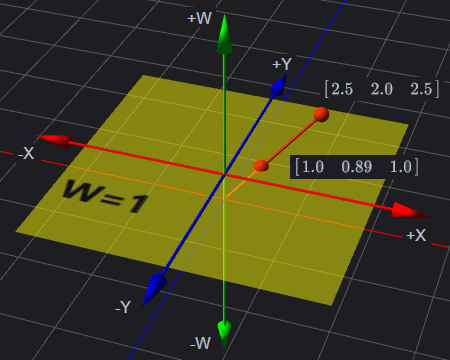

<center>图6-22 齐次坐标投影到 2D 中 w=1 的平面上</center>

　　因此，给定一个 2D 点 $(x, y)$ ，齐次空间中有无数多个点与之对应。所有点的形式都为 $(kx, ky, kz)$ ，$k \ne =$ 。这些点构成一条穿过齐次原点的直线。

　　当 $w = 0$ 时，除法未定义，因此不存在实际的 2D 点。然而，可以将 2D 齐次点 $(x, y, 0)$ 解释为“位于无穷远的点”，它描述了一个方向而不是一个位置。在后面我们会讨论关于该点的更多方面。

　　4D 坐标的基本思想相同。实际的 3D 点能被认为是在 4D 中 $w = 1$ “平面”上。4D 点的形式为 $(x, y, y, z, w)$ 。将 4D 点投影到这个“平面”上得到相应的实际 3D 点 $(x/w, y/w, z/w)$ 。$w = 0$ 时 4D 点表示“无限远点”，它描述了一个方向而不是一个位置。

　　齐次坐标和通过除以 $w$ 来投影是很有趣的，那为什么要使用 4D 坐标呢？有两个基本原因使得我们要使用 4D 向量和 $4 \times 4$ 矩阵。第一个原因实际上就是因为它是一种方便的记法，下面我们来讨论下。

### 6.7.2 平移矩阵

　　之前讨论过， $3 \times 3$ 变换矩阵表示的是线性变换，但是不包含平移。因为矩阵乘法的性质，零向量总是变换成零向量，因此，任何能用矩阵乘法表达的变换都不包含平移。因为矩阵乘法和它的逆是一种非常方便的工具，不仅可以用来将复杂的变换组合成简单的单一变换，还可以操纵嵌入式坐标系间的关系。如果能找到一种方法将 $3 \times 3$ 变换矩阵进行扩展，使它能处理平移，这是很好的事情。 $4 \times 4$ 矩阵恰好提供了一种数学上的“技巧”，使我们能够做到这一点。

　　暂时假设 $w$ 总是等于 1 。那么，标准 3D 向量 $\begin{bmatrix}x & y & z\end{bmatrix}$ 对应的 4D 向量为 $\begin{bmatrix}x & y & z & 1\end{bmatrix}$ 。任意 $3 \times 3$ 变换矩阵 4D 中表示为：
$$
\begin{aligned}
\begin{bmatrix}
m_{11} & m_{12} & m_{13} \\ m_{21} & m_{22} & m_{23} \\ m_{31} & m_{32} & m_{33}
\end{bmatrix}
\Rightarrow
\begin{bmatrix}
m_{11} & m_{12} & m_{13} & 0 \\ m_{21} & m_{22} & m_{23} & 0 \\ m_{31} & m_{32} & m_{33} & 0 \\ 0 & 0 & 0& 1
\end{bmatrix}
\end{aligned} 
$$
　　任意一个形如 $\begin{bmatrix}x & y & z & 1\end{bmatrix}$ 的向量乘以形式的矩阵，其结果和标准的 $3 \times 3$ 情况相同，只是结果是用 $w = 1$ 的 4D 向量表示的：
$$
\begin{aligned}
\begin{bmatrix}m_{11} & m_{12} & m_{13} \\ m_{21} & m_{22} & m_{23} \\ m_{31} & m_{32} & m_{33}\end{bmatrix} 
\begin{bmatrix}x \\ y \\ z\end{bmatrix}
=
\begin{bmatrix}xm_{11} + ym_{12} + zm_{13} \\ xm_{21} + ym_{22} + zm_{23} \\ xm_{31} + ym_{32} + zm_{33}\end{bmatrix} \\ \\
\begin{bmatrix}m_{11} & m_{12} & m_{13} & 0 \\ m_{21} & m_{22} & m_{23} & 0 \\ m_{31} & m_{32} & m_{33} & 0 \\ 0 &０& 0 & 1\end{bmatrix} 
\begin{bmatrix}x \\ y \\ z \\ 1\end{bmatrix}
=
\begin{bmatrix}xm_{11} + ym_{12} + zm_{13} \\ xm_{21} + ym_{22} + zm_{23} \\ xm_{31} + ym_{32} + zm_{33} \\ 1\end{bmatrix} 
\end{aligned}
$$
　　在 4D 中，仍然可以用矩阵乘法来表达平移，如下公式所示，而在 3D 是不可能的：
$$
\begin{bmatrix}1 & 0 & 0 & \Delta x \\ 0 & 1 & 0 & \Delta y \\ 0 & 0 & 1 & \Delta z \\ 0 & 0 & 0 & 1\end{bmatrix}
\begin{bmatrix}x \\ y \\ z \\ 1\end{bmatrix}
=
\begin{bmatrix}x + \Delta x \\ y + \Delta y \\ z + \Delta z \\ 1\end{bmatrix}
\tag{6.43}
$$
　　即使在 4D 中，矩阵乘法仍然是线性变换。矩阵乘法不能表达 4D 中的“平移”，4D 零向量也将总是被变换成零向量。这个技巧之所以能在 3D 中平移点是因为我们实际上是在切变 4D 空间。与实际 3D 空间相对应的 4D 中的”平面“并没有穿过 4D 中的原点。因此我们能通过切变 4D 空间来实现 3D 中的平移。

　　设想没有平移的变换后接一个有平移的变换会发生什么情况呢？设 R 为旋转矩阵（实际上，R 还能包含其他的 3D 线性变换，但现在假设 R 只包含旋转）， T 为形如公式 6.43 的变换矩阵：
$$
\begin{aligned}
&\bf R = \begin{bmatrix}r_{11} & r_{12} & r_{13} & 0 \\ r_{21} & r_{22} & r_{23} & 0 \\ r_{31} & r_{32} & r_{33} & 0 \\ 0 & 0 & 0 & 1\end{bmatrix} \\
&\bf T = \begin{bmatrix}1 & 0 & 0 & \Delta x \\ 0 & 1 & 0 & \Delta y \\ 0 & 0 & 1 & \Delta z \\ 0 & 0 & 0 & 1\end{bmatrix}
\end{aligned}
$$
　　将向量 $\vec v$ 先旋转再平移，新的向量 $\vec v'$ 计算如下：
$$
\vec v' = \bf T \bf R \vec v
$$
　　注意，变换的顺序是非常重要的。因为我们使用的是列向量，变换的顺序必须和矩阵乘法的顺序相吻合（从右到左），先旋转再平移。

　　和 $3 \times 3$ 矩阵一样，能将两个矩阵连接成单个矩阵，记作矩阵 $\bf M$ ，如下：
$$
\begin{aligned}
\bf M &= \bf T \bf R \\
\vec v' &= \bf T \bf R \vec v \\
&= (\bf T \bf R) \vec v \\
&= \bf M \vec v
\end{aligned}
$$
　　观察 $\bf M$ 的内容：
$$
\bf M = \bf T \bf R = 
\begin{bmatrix}
r_{11} & r_{12} & r_{13} & 0 \\ r_{21} & r_{22} & r_{23} & 0 \\ r_{31} & r_{32} & r_{33} & 0 \\ 0 & 0 & 0 & 1
\end{bmatrix}
\begin{bmatrix}
1 & 0 & 0 & \Delta x \\ 0 & 1 & 0 & \Delta y \\ 0 & 0 & 1 & \Delta z \\ 0 & 0 & 0 & 1
\end{bmatrix}
=
\begin{bmatrix}
r_{11} & r_{12} & r_{13} & \Delta x \\ r_{21} & r_{22} & r_{23} & \Delta y \\ r_{31} & r_{32} & r_{33} & \Delta z \\ 0 & 0 & 0 & 1
\end{bmatrix}
$$
　　$\bf M$ 的上边 $3 \times 3$ 部分是旋转部分，最右一列是平移部分。最下一行为 $\begin{bmatrix}0 & 0 & 0 & 1\end{bmatrix}$ 。逆向利用这些信息，能将任意 $4 \times 4$ 矩阵分解为线性变换部分和平移部分。将平移向量 $\begin{bmatrix}\Delta x & \Delta y & \Delta z\end{bmatrix}$ 记作 t ，则 $\bf M$ 可简写为：
$$
\bf M = \begin{bmatrix}\bf R & t \\ 0 & 1\end{bmatrix}
$$
　　接下来看 $w = 0$ 所表示的“无穷远点”。用一个由标准的 $3 \times 3$ 变换矩阵扩展成的 $4 \times 4$ 矩阵（不包含平移）乘以它，得到：
$$
\begin{bmatrix}
r_{11} & r_{12} & r_{13} & 0 \\ r_{21} & r_{22} & r_{23} & 0 \\ r_{31} & r_{32} & r_{33} & 0 \\ 0 & 0 & 0 & 1 
\end{bmatrix}
\begin{bmatrix}x \\ y \\ z \\ 0\end{bmatrix}
=
\begin{bmatrix}
xr_{11} + yr_{12} + zr_{13} \\
xr_{21} + yr_{22} + zr_{23} \\
xr_{31} + yr_{32} + zr_{33} \\
0
\end{bmatrix}
$$
　　换句话说，当一个包含旋转、缩放等的变换矩阵乘以一个形如 $\begin{bmatrix}x & y & z & 0\end{bmatrix}$ 的无穷远点，将会发生预期的变换。结果仍是一个无穷远点，形式为 $\begin{bmatrix}x & y & z & 0\end{bmatrix}$ 。

　　一个无穷远点经过包含平移的变换可得到：
$$
\begin{bmatrix}
r_{11} & r_{12} & r_{13} & \Delta x \\ r_{21} & r_{22} & r_{23} & \Delta y \\ r_{31} & r_{32} & r_{33} & \Delta z \\ 0 & 0 & 0 & 1
\end{bmatrix}
\begin{bmatrix}
x \\ y \\ z \\ 0
\end{bmatrix}
=
\begin{bmatrix}
xr_{11} + yr_{12} + zr_{13} \\
xr_{21} + yr_{22} + zr_{23} \\
xr_{31} + yr_{32} + zr_{33} \\
0
\end{bmatrix}
$$
　　我们可以看到，这个结果跟上面的结果是一样的（和没有平移的情况相比）。也就是说，4D 向量中的 w 分量能够控制“开关” $4 \times 4$ 矩阵平移部分。这个规律是非常有用的，因为有些向量代表“位置”，应当平移，而有些向量代表“方向”，如表面的法向量，不应该平移。从几何意义上说，能将第一类数据当作“点”，而第二类数据当作“向量”。

　　使用 $4 \times 4$ 矩阵的一个原因就是 $4 \times 4$ 变换矩阵能包含平移。当我们仅为这个目的使用 $4 \times 4$ 矩阵时，矩阵的最下一行总是 $\begin{bmatrix}0 & 0 & 0 & 1\end{bmatrix}$ 。既然是这样，为什么不去掉最下一行而改用 $3 \times 4$ 矩阵不符合我们的需求，如下：

- 不能用一个 $3 \times 4$ 矩阵乘以另一个 $3 \times 4$ 矩阵。
- $3 \times 4$ 矩阵没有逆矩阵，因为它不是一个方阵。
- 一个$3 \times 4$ 矩阵乘以一个 4D 向量时，结果是一个 3D 向量。

　　为了严格遵守线性代数的法则，我们加上第 4 行。

### 6.7.3 仿射变换

　　前面我们讨论了用 $3 \times 3$ 矩阵表达了很多基本变换。因为 $3 \times 3$ 矩阵仅能表达 3D 中的线性变换，所以当时并没有考虑平移。经过上面讨论的 $4 \times 4$ 矩阵之后，现在我们可以构造包含平移在内的一般仿射变换矩阵了。例如：

- 绕不通过原点的轴旋转。

- 沿不穿过原点的平面缩放。

- 沿不穿过原点的平面镜像。

- 向不穿过原点的平面正交投影。


　　它们的基本思想是将变换的“中心点”平移到原点，用前面讨论的技术进行线性变换，然后再将“中心点”平移回原来的位置。开始使用平移矩阵 $\bf T$ 将点 $\vec P$ 移到原点，接着用线性变换矩阵 $\bf R$ 进行线性变换，最终的仿射变换矩阵 $\bf M$ 等于矩阵的积，即：$\bf T^{-1} \bf R \bf T$ 。$\bf T^{-1}$ 是平移矩阵的逆矩阵，执行和 $\bf T$ 相反的变换。

　　观察这种矩阵的一般形式，它非常有趣。我们先用分块形式写出前面用到的 $\bf T^{-1}$ ，$\bf R$ ，$\bf T$ ：
$$
\begin{aligned}
\bf T &= \begin{bmatrix}1 & 0 & 0 & -p_x \\ 0 & 1 & 0 & -p_y \\ 0 & 0 & 1 & -p_z \\ 0 & 0 & 0 & 1\end{bmatrix} \\
&= \begin{bmatrix}\bf I & -\vec P \\ 0 & 1\end{bmatrix}
\end{aligned}
$$

$$
\begin{aligned}
\bf R_{4x4} &= 
\begin{bmatrix}r_{11} & r_{12} & r_{13} & 0 \\ r_{21} & r_{22} & r_{23} & 0 \\ r_{31} & r_{32} & r_{33} & 0 \\ 0 & 0 & 0 & 1\end{bmatrix} \\
&= \begin{bmatrix}\bf R_{3x3} & \bf 0 \\ 0 & 1\end{bmatrix}
\end{aligned}
$$

$$
\begin{aligned}
\bf T^{-1} &=
\begin{bmatrix}1 & 0 & 0 & p_x\\ 0 & 1 & 0 & p_y \\ 0 & 0 & 1 & p_z \\ 0 & 0 & 0 & 1\end{bmatrix} \\
&= \begin{bmatrix}\bf I & \vec P \\ 0 & 1\end{bmatrix}
\end{aligned}
$$

　　接着进行矩阵乘法有：
$$
\bf T^{-1} \bf R \bf T
= 
\begin{bmatrix}\bf I & -\vec P \\ 0 & 1\end{bmatrix}
\begin{bmatrix}\bf R_{3x3} & \bf 0 \\ 0 & 1\end{bmatrix}
\begin{bmatrix}\bf I & \vec P \\ 0 & 1\end{bmatrix}
=
\begin{bmatrix}\bf R_{3x3} & -\vec P \bf R_{3x3} + \vec P \\ 0 & 1\end{bmatrix}
$$
　　从上可以看出，仿射变换中增加的平移部分仅仅改变了 $4 \times 4$ 矩阵的最右一列，并没有影响到上面所包含的线性变换的 $3 \times 3$ 部分。

### 6.7.4 透视投影

　　上面对齐次坐标的使用只是一种数学上的技巧，目的是使我们能在变换中包含平移。之前我们讨论的总是 $w = 1$ 或者 $w = 0$ （当点在无穷远处时）的情况。现在我们来讨论使用其他 $w$ 值的有意义的 4D 坐标。

　　前面我们讨论过将 4D 齐次向量变换到 3D 中时，要先把 4D 向量除以 $w$ 。这给出了一种之前没有加以利用的数学方法，因为之前的 $w$ 要么等于 1 ，要么等于 0 。这个除法使我们可以非常简洁地包含一些重要的几何运算。更加明确的就是，我们能进行透视投影。

　　前面我们讨论过平行投影，讨论过怎样将 3D 空间投影到 2D 平面上，该平面称作投影平面。那时候我们使用的是正交投影。正交投影也称作平行投影，因为投影线都是平行的（投影线是指从原空间中的点到投影点的连线）。正交投影中的平行线如下图 6-23 所示：


<center>图6-23 正交投影</center>

　　3D 中的透视投影仍然是投影到 2D 平面上。但是，投影线不再平行。实际上，它们相交于一点，该点称作投影中心。如下图 6-24 所示：


<center>图6-24 透视投影和投影线相交于投影中心</center>

　　因为投影中心在投影平面前面，投影线到达平面之前已经相交，所以投影平面上的图像是翻转的。当物体远离投影中心时，正交投影扔保持不变，但透视投影变小了。如下图 6-25 所示：


<center>图6-25 近大远小</center>

　　右边的茶壶离投影平面更远，所以它的投影比离投影平面较近的那个茶壶小。

　　透视投影在图形学中非常重要，因为它是人类视觉系统的模型。实际上，人类视觉系统远比这个复杂，因为我们有两只眼睛，而且对于每只眼睛，投影表面（视网膜）不是一个平面。所以，让我们来看一个简单的例子——小孔成像。小孔成像系统就是一个盒子，一侧上有小孔，光线穿过小孔照射到另一侧的背面，那里就是投影平面。如图 6-26 所示：


<center>图6-26 小孔成像</center>

　　图 6-26 中，盒子的左右两面都是透明的。另外注意，盒子内部的投影是倒着的，这是因为光线（投影线）已经在小孔处（投影中心）相交了。

　　让我们探索下小孔成像背后的几何原理。设想一个 3D 坐标系，它的原点在投影中心， z 轴垂直于投影平面，x 和 y 轴平行于投影平面。如下图 6-27 所示：


<center>图6-27 和 xy 平面平行的投影平面</center>

　　让我们看看能否计算出任意点 $\vec p$ 通过小孔投影到投影平面上的坐标 $\vec p'$ 。首先，需要知道小孔到投影平面的距离，设为 d 。因此，投影平面为 $z = -d$ 。现在，从另一个角度来看问题，求出新的 y 。如下图 6-28 所示：


<center>图6-28 从侧面看投影平面</center>

　　由相似三角形得到：
$$
\frac{-p_y'}{d} = \frac{p_y}{z} \Rightarrow p_y' = \frac{-dp_y}{z}
$$
　　注意小孔成像颠倒了图像，$p_y$ 和  $p_y'$ 的符号相反。$p_x'$ 的值可通过类似的方法求得：
$$
p_x' = \frac{-dp_x}{z}
$$
　　所有投影点的 z 值都是相同的：-d 。因此，点 $\vec p$ 通过原点向平面 $z = -d$ 投影的结果如下公式所示：
$$
\vec p = \begin{bmatrix}x \\ y \\ z\end{bmatrix}
\Rightarrow
\vec p' = \begin{bmatrix}x' \\ y' \\ z'\end{bmatrix}
=
\begin{bmatrix}-dx/z \\ -dy/z \\ -d\end{bmatrix}
\tag{6.44}
$$
　　在实际应用中，负号会带来不必要的复杂性。所以将投影平面移到投影的前面（也就是说，平面 $z = d$）。如下图 6-29 所示：


<center>图6-29 投影平面在投影中心前</center>

　　当然，这对于实际的小孔成像是不可能的。因为设置小孔的目的就是使光线只能通过小孔，但在计算机数学世界中，可以不理会这些规定。将投影平面移到投影中心前面，烦人的负号小时了，如下公式所示：
$$
\vec p' = \begin{bmatrix}x' \\ y' \\ z'\end{bmatrix} = \begin{bmatrix}dx/z \\ dy/z \\ d\end{bmatrix}
\tag{6.45}
$$
　　从 4D 到 3D 的变换就意味着除法运算，因此我们可以利用 $4 \times 4$ 阶矩阵来编写代码，以实现透视投影。基本思想是剔除一个关于 $\vec p'$ 的公式，其中的 x，y，z 有公分母，然后构造一个 $4 \times 4$ 矩阵，使 $w$ 与这个公分母相等。这里我们假设初始点处有 $w = 1$ 。

　　先对 3D 形式表达的 $\vec p'$ 公式变形，可以得到：
$$
\begin{aligned}
\vec p' &= \begin{bmatrix}dx/z \\ dy/z \\ d\end{bmatrix} \\
&= \begin{bmatrix}dx/z \\ dy/z \\ dz/z\end{bmatrix} \\
&= \frac{\begin{bmatrix}x & y & z\end{bmatrix}^T}{z/d}
\end{aligned}
$$
　　从前面讨论过的可知，将 4D 齐次向量变换到 3D 中时，要用 4D 向量除以 $w$ ，反推可知 $\vec p'$ 的 4D 形式为：
$$
\begin{bmatrix}x & y & z & z/d\end{bmatrix}^T
$$
　　因此我们需要一个 $4 \times 4$ 矩阵，它可接收一个奇异的齐次向量。该向量形式为 $\begin{bmatrix}x & y & z & 1\end{bmatrix}$ ，然后将其变换为上述形式。这样的矩阵如下公式所示：
$$
\begin{bmatrix}1 & 0 & 0 & 0 \\ 0 & 1 &０& 0 \\ 0 & 0 & 1 & 0 \\ 0 & 0 & 1/d & 0\end{bmatrix}
\begin{bmatrix}x \\ y \\ z \\ 1\end{bmatrix}
=
\begin{bmatrix}x \\ y \\ z \\ z/d\end{bmatrix}
\tag{6.46}
$$
　　这样，就得到了一个 $4 \times 4$ 投影矩阵。有几个需要注意的地方：

- 乘以这个矩阵并没有进行实际的透视投影变换，它只是计算出合适的坟墓。投影实际发生在从 4D 向 3D 变换时。
- 存在多种变换。例如：将投影平面放在 $z = 0$ 处而投影中心在 $\begin{bmatrix}0 & 0 & -d\end{bmatrix}$ 。这将导致一个不同的公式。
- 看起来比较复杂，似乎需要简单地除以 $z$ ，不必劳烦矩阵。那么为什么要使用齐次矩阵呢？第一， $4 \times 4$ 矩阵提供了一种方法将投影表达为变换，这样就能和其他变换相连接；第二，使得投影到不平行于坐标轴的平面变得可行。实际上，我们不需要齐次坐标做任何运算，但 $4 \times 4$ 矩阵提供了一种简洁的方法表达和操纵投影变换。
- 实际的图形几何管道中的投影矩阵不是像这里导出的那样。还有许多重要的细节需要考虑。如：用以上矩阵对向量进行变换后， $z$ 值实际上被舍弃了，而很多图形系统的 $z$ 缓冲用到了该值。

　　虽然这里已经有投影矩阵了，然而实际上还不足以在计算机中应用，要在计算机系统中应用，后面我们会进一步讨论，并完善这个投影矩阵。在数学上的讨论，这个投影矩阵已经足够表达了其几何意义。


## <center>6.8 从仿射变换提取平移、缩放、旋转矩阵</center>

　　很多时候，我们会碰到仅仅给出来一个包含了平移、缩放和旋转的 $4 \times 4$ 阶仿射变换矩阵，而前面我们讨论过怎样通过平移、缩放和旋转矩阵连接成一个 $4 \times 4$ 阶仿射变换矩阵，现在我们来讨论这个逆过程。

　　设 $4 \times 4$ 阶旋转矩阵：
$$
\bf R = 
\begin{bmatrix}
r_{11} & r_{12} & r_{13} & 0\\r_{21} & r_{22} & r_{23} & 0\\r_{31} & r_{32} & r_{33} & 0\\0 & 0 & 0 & 1
\end{bmatrix}
$$
　　设 $4 \times 4$ 阶缩放矩阵：
$$
\bf S = \begin{bmatrix}s_x & 0 & 0 & 0\\0 & s_y & 0 & 0\\0 & 0 & s_z & 0\\0 & 0 & 0 &1\end{bmatrix}
$$
　　设 $4 \times 4​$ 阶平移矩阵：
$$
\bf T = \begin{bmatrix}0 & 0 & 0 & \Delta x\\0 & 0 & 0 &\Delta y\\0 & 0 & 0 & \Delta z\\0 & 0 & 0 & 1\end{bmatrix}
$$
　　则按照矩阵右乘向量把这三个矩阵连接可以获得一个 $4 \times 4$ 仿射矩阵：
$$
\begin{aligned}
\bf M &= \bf T \bf R \bf S \\
&=  
\begin{bmatrix}0 & 0 & 0 & \Delta x\\0 & 0 & 0 &\Delta y\\0 & 0 & 0 & \Delta z\\0 & 0 & 0 & 1\end{bmatrix}
\left(
\begin{bmatrix}
r_{11} & r_{12} & r_{13} & 0\\r_{21} & r_{22} & r_{23} & 0\\r_{31} & r_{32} & r_{33} & 0\\0 & 0 & 0 & 1
\end{bmatrix}
\begin{bmatrix}s_x & 0 & 0 & 0\\0 & s_y & 0 & 0\\0 & 0 & s_z & 0\\0 & 0 & 0 &1\end{bmatrix}
\right)
\\ &=
\begin{bmatrix}0 & 0 & 0 & \Delta x\\0 & 0 & 0 &\Delta y\\0 & 0 & 0 & \Delta z\\0 & 0 & 0 & 1\end{bmatrix}
\begin{bmatrix}
r_{11}s_x & r_{12}s_y & r_{13}s_z & 0 \\
r_{21}s_x & r_{22}s_y & r_{23}s_z & 0 \\
r_{31}s_x & r_{32}s_y & r_{33}s_z & 0 \\
0 & 0 & 0 & 1
\end{bmatrix}
\\ &=
\begin{bmatrix}
r_{11}s_x & r_{12}s_y & r_{13}s_z & \Delta x \\
r_{21}s_x & r_{22}s_y & r_{23}s_z & \Delta y \\
r_{31}s_x & r_{32}s_y & r_{33}s_z & \Delta z \\
0 & 0 & 0 & 1
\end{bmatrix}
\\ &=
\begin{bmatrix}
m_{11} & m_{12} & m_{13} & m_{14} \\
m_{21} & m_{22} & m_{23} & m_{24} \\
m_{31} & m_{32} & m_{33} & m_{34} \\
0 & 0 & 0 & 1
\end{bmatrix}
\end{aligned}
\tag{6.47}
$$
　　由上公式可知，我们最容易提取的就是平移矩阵 $\bf T​$ 。三个轴上的平移值 $\Delta x​$ ，$\Delta y​$ ，$\Delta z​$ 其实就是这个 $4 \times 4​$ 仿射矩阵最后一列，即：
$$
\begin{aligned}
\begin{bmatrix}\Delta x & \Delta y & \Delta z\end{bmatrix} 
= 
\begin{bmatrix}m_{14} & m_{24} & m_{34}\end{bmatrix}
\end{aligned}
\tag{6.48}
$$
　　接下来是比较复杂的旋转和缩放矩阵的提取。首先，从我们前面讨论正交矩阵的时候讨论过，旋转矩阵是一个正交矩阵，那我们可知旋转矩阵每一列都是标准正交基。从公式6.47可见：
$$
\begin{aligned}
\vec c_1 = \begin{bmatrix}m_{11} & m_{21} & m_{31}\end{bmatrix} 
=
\begin{bmatrix}r_{11}s_x & r_{21}s_x & r_{31}s_x\end{bmatrix} 
=
s_x\begin{bmatrix}r_{11} & r_{21} & r_{31}\end{bmatrix}
= s_x \vec i
\\
\vec c_2 = \begin{bmatrix}m_{12} & m_{22} & m_{32}\end{bmatrix} 
= 
\begin{bmatrix}r_{12}s_y & r_{22}s_y & r_{32}s_y\end{bmatrix} 
=
s_y\begin{bmatrix}r_{12} & r_{22} & r_{32}\end{bmatrix}
= s_y \vec j
\\
\vec c_3 = \begin{bmatrix}m_{13} & m_{23} & m_{33}\end{bmatrix}
=
\begin{bmatrix}r_{13}s_z & r_{23}s_z & r_{33}s_z\end{bmatrix}
=
s_z\begin{bmatrix}r_{13} & r_{23} & r_{33}\end{bmatrix}
= s_z \vec k
\end{aligned}
$$
　　由于 $\vec i​$ ，$\vec j​$ 和 $\vec k​$ 是标准正交基，也即互相垂直的单位向量，所以 $s_{11}​$ ，$s_{22}​$ 和 $s_{33}​$ 分别是 $\vec c_1​$ ，$\vec c_2​$ 和 $\vec c_3​$ 的长度。由此可得：
$$
\begin{aligned}
\vec i = \begin{bmatrix}r_{11} & r_{21} & r_{31}\end{bmatrix} = \frac{\vec c_1}{\begin{vmatrix}\vec c_1\end{vmatrix}} 
= \begin{bmatrix}
\frac{m_{11}}{\begin{vmatrix}\vec c_1\end{vmatrix}} &
\frac{m_{21}}{\begin{vmatrix}\vec c_1\end{vmatrix}} &
\frac{m_{31}}{\begin{vmatrix}\vec c_1\end{vmatrix}}
\end{bmatrix} \\
\\
\vec j = \begin{bmatrix}r_{12} & r_{22} & r_{32}\end{bmatrix} = \frac{\vec c_2}{\begin{vmatrix}\vec c_2\end{vmatrix}} 
= \begin{bmatrix}
\frac{m_{12}}{\begin{vmatrix}\vec c_2\end{vmatrix}} &
\frac{m_{22}}{\begin{vmatrix}\vec c_2\end{vmatrix}} &
\frac{m_{32}}{\begin{vmatrix}\vec c_2\end{vmatrix}}
\end{bmatrix} \\
\\
\vec k = \begin{bmatrix}r_{13} & r_{23} & r_{33}\end{bmatrix} = \frac{\vec c_3}{\begin{vmatrix}\vec c_3\end{vmatrix}} 
= \begin{bmatrix}
\frac{m_{13}}{\begin{vmatrix}\vec c_3\end{vmatrix}} &
\frac{m_{23}}{\begin{vmatrix}\vec c_3\end{vmatrix}} &
\frac{m_{33}}{\begin{vmatrix}\vec c_3\end{vmatrix}}
\end{bmatrix}
\end{aligned}
\tag{6.49}
$$

$$
\begin{aligned}
s_x = \begin{vmatrix}\vec c_1\end{vmatrix} \\ \\
s_y = \begin{vmatrix}\vec c_2\end{vmatrix} \\ \\
s_z = \begin{vmatrix}\vec c_3\end{vmatrix}
\end{aligned}
\tag{6.50}
$$

　　由公式6.48 、6.49 和6.50可得平移、旋转、缩放矩阵：
$$
\begin{aligned}
\bf T &= \begin{bmatrix}0 & 0 & 0 & m_{14}\\0 & 0 & 0 & m_{24}\\0 & 0 & 0 & m_{34}\\0 & 0 & 0 & 1\end{bmatrix} \\ \\
\bf R &= \begin{bmatrix}
m_{11}/\begin{vmatrix}\vec c_1\end{vmatrix} & 
m_{12}/\begin{vmatrix}\vec c_2\end{vmatrix} & 
m_{13}/\begin{vmatrix}\vec c_3\end{vmatrix} \\
m_{21}/\begin{vmatrix}\vec c_1\end{vmatrix} & 
m_{22}/\begin{vmatrix}\vec c_2\end{vmatrix} & 
m_{23}/\begin{vmatrix}\vec c_3\end{vmatrix} \\
m_{31}/\begin{vmatrix}\vec c_1\end{vmatrix} & 
m_{32}/\begin{vmatrix}\vec c_2\end{vmatrix} & 
m_{33}/\begin{vmatrix}\vec c_3\end{vmatrix} \\
\end{bmatrix} \\ \\
\bf S &= 
\begin{bmatrix}
\begin{vmatrix}\vec c_1\end{vmatrix} & 0 & 0 \\
0 & \begin{vmatrix}\vec c_2\end{vmatrix} & 0 \\
0 & 0 & \begin{vmatrix}\vec c_3\end{vmatrix} \\
\end{bmatrix}
\end{aligned}
\tag{6.51}
$$
　　其中 $\vec c_1 = \begin{bmatrix}r_{11} & r_{21} & r_{31}\end{bmatrix}$ ，$\vec c_2 = \begin{bmatrix}r_{12} & r_{22} & r_{32}\end{bmatrix}$ ，$\vec c_3 = \begin{bmatrix}r_{13} & r_{23} & r_{33}\end{bmatrix}$ 。

　　至此，我们把矩阵基础及其运算等相关知识讨论完了。

<div style="page-break-after:always;"></div>


# <center>七、3D数学——欧拉角和四元数</center>

本篇概要

- 方向、方位、角位移的区别
- 矩阵表示方位的方法
- 欧拉角表示方位的方法
- 四元素表示方位的方法
- 矩阵、欧拉角和四元数三种比较
- 矩阵、欧拉角和四元数三种表示方法的转换

　　从之前我们讨论过的矩阵变换中，我们可以看到平移变换和缩放变换都是相对简单的，而旋转变换就复杂许多了，所以接下来我们要讨论的就是 3D 中跟旋转有关的问题——方位和角位移。在 3D 中有多种方法可以描述方位和角位移，我们这里将要讨论其中三种最常用的方法——矩阵、欧拉角和四元数。


## <center>7.1 方位和角位移</center>

　　我们之前在讨论向量的时候知道向量可以表示方向，那这里的方位又是什么呢？跟方向有什么区别呢？首先，物体的方位主要描述的是物体的朝向。前面讨论过的向量仅仅是有方向，而没有方位，区别在于，当一个向量指向特定方向时，可以让向量自转，但是向量却不会有任何变化，因为向量的属性只有大小，而没有厚度和宽度。如下图 7-1 所示：


<center>图7-1 向量自转不会改变向量的属性</center>

　　然而，当一个物体朝向特定的方向时，让它和上面的向量一样自转，我们会发现物体的方位改变了，如下图 7-2 所示：


<center>图7-2 物体自转会改变物体的方位</center>

　　通过之前的讨论，我们知道不能用绝对坐标来描述物体的位置，要描述物体的位置，必须把物体放置于特定的参考系中。而描述位置实际上就是描述相对给定参考点（通常是坐标系原点）的位移。

　　同样道理，描述物体方位时，也不能使用绝对量。与位置只是相对已知点的位移一样，方位时通过于相对已知方位的旋转来描述的。旋转的量称作角位移。换句话说，在数学上描述方位就等价于描述角位移。

　　如果大家觉得不好理解，我们可以这样子类比，我们把角位移想象成在方向上的变换（例如，从旧方位到新方位的角位移），这实际上式一个“源／目的”的关系。而方位将用于描述“父／子”关系而不是“源／目的”。方位和角位移的区别就像点和向量的区别。两个术语都只是数学上等价而在概念上是有区别的。方位实际上描述一个单一的状态，而角位移描述的两个状态之间的差别。具体来说，我们用矩阵和四元数来表示角位移，而用欧拉角来表示方位。


## <center>7.2 矩阵形式</center>

　　3D 中，描述坐标系中方位的一种方法就是列出这个坐标系的基向量，这些基向量是用其他的坐标系来描述的。用这些基向量构成一个 $3 \times 3$ 矩阵，然后就能用矩阵形式来描述方位。换句话说，能用一个旋转矩阵来描述这两个坐标系之间的相对方位，这个旋转矩阵用于把一个坐标系中的向量转换到另外一个坐标系中，如下图 7-3 所示：


<center>图7-3 用矩阵定义方位</center>

### 7.2.1 用哪个矩阵

　　我们知道怎样用矩阵将点从一个坐标系变换到另一个坐标系。究竟是用哪个变换矩阵来描述角位移呢？是用把向量从世界坐标系转换到物体坐标系的变换矩阵，还是相反方向转换的矩阵呢？

　　其实对于我们目前讨论来说，这个区别并不重要。只要知道方位是用矩阵来描述的，而矩阵表示的是转换后的基向量就足够了。我们通过描述一个坐标系到另一个坐标系的旋转来确定一个方位。矩阵变换的具体方向是一个实现细节，因为旋转矩阵是正交矩阵，如果需要的话，只需简单的转置，就可求得逆变换。

### 7.2.2 矩阵形式的优点

　　矩阵是一种非常直接的描述方位的形式。这种直接性带来了以下一些优点：

- **可以立即进行向量的旋转**。矩阵形式最重要的性质就是利用矩阵能在物体和世界坐标系间旋转向量，这是其他描述方法所做不到的。为了旋转向量，必须将方位转换成矩阵形式。
- **矩阵的形式被图形 API 所使用**。受到了前一节所述原因的影响，图形 API 使用矩阵来描述方位。当我们和图形 API 交流时，最终必须将用矩阵来描述所需的转换。程序中怎样保存方位是有我们来决定，但如果选择了其他形式，则必须在渲染管道的某处将其转换成矩阵。
- **多个角位移连接**。矩阵形式的第二个优点就是可以“打破”嵌套坐标系间的关系。例如：如果知道 A 关于 B 的方位，又知道 B 关于 C 的方位，使用矩阵可以求得 A 关于 C 的方位。
- **矩阵的逆**。用矩阵形式表达角位移时，逆矩阵就是“反”角位移。因为旋转矩阵是正交矩阵，所以这个计算只是简单的矩阵转置运算。

### 7.2.3 矩阵形式的缺点

　　矩阵的直接性带来了一些优点，前面我们已经讨论过了。但是，矩阵用 9 个数来保存方位，而实际上方位值需要 3 个数就能够确定了。这些多余的数会导致一些问题。

- **矩阵占用了更多的内存**。如果需要保存大量方位，如动画序列中的关键帧，9 个数会导致数目客观的额外空间损失。举个例子：假设现在做的是一个人的模型动画，该模型被分解为 15 个块。动画的完成实际是严格地控制子块和父块之间的相对方位。假设每一帧为每一块保存一个方位，动画频率是 15 Hz，这意味着每秒需要保存 225 个方位。使用矩阵和 32 位浮点数，每一帧有 8100 字节，而使用欧拉角，同样的数据只需要 2700 字节。对于 30s 的动画数据，矩阵就比欧拉角多占用 162K 字节。
- **难于使用**。矩阵对人类来说并不直观。有太多的数字，并且它们都在 -1 和 1 之间。人类考虑方位的直观方法是角度，而矩阵使用的是向量。通过实践，我们能从一个给定的矩阵中得到它所表示的方位。但这仍比欧拉角困难得多，其他方面也不尽如人意。用手算来构造描述任意方位的矩阵几乎是不可能的。总之，矩阵不是人类思考方位的直观方法。
- **可能是病态的**。矩阵使用 9 个数，其实只有 3 个数是必需的。也就是说，矩阵带有六阶冗余。描述方位的矩阵必须满足 6 个限制条件。列必须是单位向量，而且它们必须互相垂直。

　　让我们详细讨论最后一条。如果随机取 9 个数并且组成一个 $3 \times 3$ 阶矩阵，这个矩阵条件不大可能都全部满足那 6 个限制条件。因此，这 9 个数不能组成一个有效的旋转矩阵。从另一方面讲，至少对于表达旋转这个目的而言，这个矩阵的结构很不合理，这样的矩阵会出问题，因为它可能导致数值异常或其他非预期行为。

　　那么这种情况是怎么出现的你？有多种原因：

- 矩阵还可能包含缩放、切变或镜像的操作，这些操作会对物体的方位产生什么影响呢？确实，对此没有一个清晰的定义。任何非正交矩阵都不是一个定义良好的旋转矩阵。虽然镜像矩阵也是正交的，但它不是有效的旋转矩阵。
- 可能从外部数据源获得“坏”数据。例如：使用物理数据获取设备（如动作捕捉器）时，捕获过程中可能产生错误。
- 可能因为浮点数的舍入错误产生“坏”数据。例如：对一个方位作大量的加运算，这在允许人们手动控制物体方位的游戏中是很常见的。由于浮点精度的限制，大量的矩阵乘法最终可能导致病态矩阵。这种现象称作“矩阵蠕变”。矩阵正交化能解决这种问题，这个我们前面已经讨论过了。

### 7.2.4 小结

　　以下是对用矩阵描述角位移的小结：

- 矩阵是一种表达方位的“强力”方法，我们可以在当前坐标系中明确列出另一个坐标系的基向量。
- 用矩阵形式表达方位非常有用，这主要是因为它允许在不同坐标系间旋转向量。
- 当前图形 API 使用矩阵描述方位。
- 能使用矩阵乘法把嵌套矩阵连接起来，从而得到单一的矩阵。
- 矩阵的逆提供了一种得到“相反”角位移的机制。
- 矩阵比我们稍后要讨论的其他方法多占用了 2、3倍内存。当有大量方位需要存储时，这样的资源浪费将是个很大的问题。
- 并非所有矩阵都能描述方位。一些矩阵还包含镜像或切变等情况。从外部数据源得到坏数据或矩阵蠕变都可能导致病态矩阵。
- 矩阵中的数对人类来说并不直观。


## <center>7.3 欧拉角</center>

　　另一种描述方位的常用方法是欧拉角。这项技术是以著名数学家欧拉的名字命名，他证明了角位移序列等价于单个角位移。

### 7.3.1 什么是欧拉角

　　欧拉角的基本思想是将角位移分解为绕三个互相垂直轴的三个旋转组成的序列。这听起来很复杂，其实它是非常直观的。之所以有“角位移”的说法正是因为欧拉角能用来描述任意旋转。当然，我们这里是用来描述物体相对于父坐标空间的方位。

　　欧拉角将方位分解为绕三个互相垂直轴的旋转，那么是哪三个轴？按什么顺序？其实，任意三个轴和任意顺序都可以，但最有意义的是使用笛卡尔坐标系并按一定顺序所组成的旋转序列。最常用的约定，也是我们这里使用的，是所谓的“heading-pitch-bank”约定。在这个系统中，一个方位被定义为一个 heading 角（前进角），一个 pitch 角（俯仰角），和一个 bank 角（倾斜角）。它的基本思想是让物体开始于标准方位——就是物体坐标轴和世界坐标轴对齐。在标准方位上，让物体作 heading、pitch、bank 旋转，最后物体到达我们想要描述的方位。

　　在精确定义 heading、pitch、bank 前，我们再强调下我们再这里使用的坐标空间约定。我们使用右手坐标系， +x 向右，+y 向上，+z 向后。如果忘记可以回顾下我们前面讨论的有手坐标系以及依据右手法则定义的旋转正方向。

　　如下图 7-4 所示：


<center>图7-4 heading 是第一个旋转，绕 y 轴</center>

　　此时物体坐标系和世界坐标系重合，heading 为绕 y 轴的旋转量，向左旋转为正。如果从上面看，旋转正方向就是逆时针方向。

　　经过 heading 旋转后，pitch 为绕 x 轴的旋转量，注意是物体坐标系的 x 轴，不是原世界坐标系的 x 轴。依然遵守右手法则，向下旋转为正。如果从原点向 +x 看，旋转正方向就是顺时针方向。如下图 7-5 所示：


<center>图7-5 pitch 是第二个旋转，绕物体坐标系的 x 轴</center>

　　最后，经过了 heading 和 pitch ，bank 为绕 z 轴的旋转量。再次提醒，是物体坐标系的 z 轴，不是原世界坐标系的 z 轴。依据右手法则，从原点向 +z 看，旋转正方向就是顺时针方向。如下图 7-6 所示：


<center>图7-6 bank 是第三个旋转，绕物体坐标系的 z 轴</center>

　　记住，当我们说旋转的顺序是 heading-pitch-bank 时，是指从世界坐标系到物体坐标系。如果从物体坐标系到世界坐标系，旋转的顺序就是相反的。

　　heading-pitch-bank 也叫作 roll-pitch-yaw ，roll （翻滚角）类似于 bank ，yaw （偏航角）类似于 heading（事实上，yaw 并不严格等于 heading，稍后我们会讨论其区别）。注意，在 roll-pitch-yaw 系统中，角度的命名顺序是与从物体坐标系到世界坐标系的旋转顺序一致的。

### 7.3.2 欧拉角的相关约定

　　我们曾经讨论过，heading-pitch-bank 系统不是唯一的欧拉角系统。绕任意三个互相垂直轴的任意旋转序列都能定义一个方位。所以，多种选择导致了欧拉角约定的多样性：

- heading-pitch-bank 系统有多个名称。当然，不同的名称并不代表不同的约定，这其实并不重要。常用的一组属于是 roll-pitch-yaw ，其中的 roll 等价于 bank ，yaw 基本上等价于 heading 。注意，它的顺序和 heading-pitch-bank 的顺序相反。这只是语义上的，它定义了向量从物体坐标系变换到世界坐标系的旋转顺序。事实上，yaw 和 heading 还是有技术上的差别，yaw 是绕物体坐标系 y 轴旋转，heading 是绕世界坐标系 y 轴的旋转。因为这里的旋转是在物体坐标系 y 轴和世界坐标系 y 轴重合时进行的，所以这个区别并不重要。
- 任意三个轴都能作为旋转轴，不一定必须是笛卡尔轴，但使用笛卡尔轴最有意义。
- 决定每个旋转的正方向时不一定必须遵守左手或右手法则。例如：完全可以定义 pitch 的正方向时向上的，并且这种定义方法非常常见。
- 也是重要的，旋转可以以不同的顺序进行。顺序并不重要。任何系统都能用来定义一个方位，但 heading-pitch-bank 顺序最为使用。heading 度量绕竖直轴的旋转，它之所以有意义主要是因为我们所在的环境经常有某种形式的“地面”。一般来讲绕世界坐标系的 x 或 z 轴的旋转没有什么意义。heading-pitch-bank 顺序下的另外两个角的意义是：pitch 度量水平方向的倾角，bank 度量的是绕 z 轴的旋转量。

### 7.3.3 欧拉角的优点

　　欧拉角仅用三个数就能表达方位，并这三个数都是角度。这两个特点使欧拉角具有其他形式所没有的优点：

- **欧拉角对我们来说很容易使用**。它比矩阵和四元数简单得多，这可能是因为欧拉角中的数都是角度，符合人们思考方位的方式。如果我们选择了与所要处理的情况最符合的约定，那么就能直接描述出最重要的角度，例如：用 heading-pitch-bank 系统就能直接地描述出偏差角度。便于使用时其最大的优点。当需要显示方位或用键盘输入方位时，欧拉角是唯一的选择。
- **最简洁的表达方式**。欧拉角用三个数来表达方位。在 3D 中，表达方位不能少于三个数。如果要考虑内存的因素，欧拉角是最合适的描述方位的方法。
- **任意三个数都是合法的**。取任意三个数，它们都能构成合法的欧拉角，而且可以把它看成一个队方位的描述。从另一方面说，没有“不合法”的欧拉角。当然，数值可能不对，但至少它们是合法的。可矩阵和四元数就不一定是这样了。

### 7.3.4 欧拉角的缺点

　　用欧拉角表达方位时的缺点主要有：

- 给定方位的表达方式不唯一。
- 两个角度之间求插值非常困难。

　　让我们仔细讨论这些问题。第一个问题是对于一个给定方位，存在多个欧拉角可以描述它。这称作别名问题，有时候会引起麻烦。因为这个原因，连一些基本问题都很难回答。例如：两组欧拉角代表的角位移相同吗？

　　第一种，在将一个角度加上 360° 的倍数时，我们就会遇得到形式最简单的别名问题。显然，加上 360° 并不会改变方位，尽管它的数值改变了。

　　第二种，更加麻烦的别名问题是由三个角度不互相独立而导致的。例如：pitch 135度等价于 heading 180°，pitch 45°，然后bank 180°。为了保证任意方位都只有独一无二的表示，必须限制角度的范围。一种常用的技术是将 heading 和 bank 限制在 +180° 到 -180° 之间，pitch 限制在 +90° 到 -90° 之间。这就建立了欧拉角的一个限制范围。对于任意方位，仅存在一个限制欧拉角能代表这个方位。

　　欧拉角中还有个更加麻烦的别名问题，我们后面会单独讨论。如果是为了描述方位，特别是在使用了限制欧拉角的情况下，别名是不会造成太大的问题的。现在来看两个方位 A 和 B 间求插值的问题，也就是说，给定参数 t ，$0 \le t \le 1$ ，计算临时方位 C ，当 t 从 0 变化到 1 时，C 也平滑地从 A 变化到 B 。这是一项极有用的技术，例如：应用于角色动画或摄像机自动控制等方面。

　　这个问题的简单解法是分别对三个角度作标准线性插值。公式如下：
$$
\begin{aligned}
\Delta \theta = \theta_t - \theta_0 \\
\theta_t = \theta_0 + t \Delta \theta
\end{aligned}
$$
　　但这里面有许多问题。

　　第一，如果没有使用限制欧拉角，将得到很大的角度差。例如：方位 A 的 heading 为 720°，方位 B 的 heading 为 45° ，$720 = 360 \times 2$ ，也就是 0° 。所以 heading 值只相差 45° ，但简单的插值会在错误的方向上绕将近两周。如下图 7-7 所示：


<center>图7-7 简单插值会导致过多的旋转</center>

　　当然，解决问题的方法是使用限制欧拉角。所以，我们假设总是在两个限制欧拉角间作插值，或者在插值函数外将它们转换成限制欧拉角（将角度限制在 -180° 到 +180° 之间确实很简单，但是要把 pitch 值限制在 -90° 到 +90° 之间就需要一些技巧）。

　　然而，即使是限制欧拉角也不能完全解决问题。插值的第二个问题是由旋转角度的周期性引起的。设 A 的 heading 为 -170°，B 的 heading 为 +170°。这些值都在 heading 的限制范围内，都在 -180° 到 +180° 之间。这两个值只相差 20°，但插值操作又一次发生了错误，旋转是沿“长弧”绕了 340° 而不是更短的 20°。如下图 7-8 所示：


<center>图7-8 简单插值会导致沿“长弧”旋转</center>

　　结局这类问题的方法是将插值的“差”角度折到 -180° 到 +180° 之间，以找到最短弧。
$$
\begin{aligned}
& wrap(x) = x - 360° [(x+180°)/360°] \\
& \Delta \theta = wrap(\theta_1 - \theta_0) \\
& \theta_t = \theta_0 + t \Delta \theta
\end{aligned}
$$
　　然而，即使使用了两个角度限制，欧拉角插值仍然可能碰到万向锁的问题，它在大多数情况下会导致抖动、路径错误等现象，物体会突然飘起来像是“挂”在某个地方。根本问题是插值过程中角速度不是恒定的。可能您从没有遇到过万向锁问题，不了解万向锁问题，没关系，下面我们来详细讨论下该问题。

### 7.3.5 万向锁的问题

　　欧拉角最著名的别名问题就是万向锁。其情况主要是这样的：先 heading 45° 再 pitch 90°，这与先 pitch 90° 再 bank 45° 是等价的。事实上，一旦选择 $\pm90°$ 为 pitch 角，就被限制在只能绕竖直轴旋转。这种现象，角度为 $\pm90°$ 的第二次旋转使得第一次和第三次旋转的旋转轴相同，这个就是万向锁的现象。

　　为了对这个现象有一个更加直观的认识，我们举个更实在的例子。现在请拿起您的手机和一支笔，我们亲自做以下的几个旋转。

　　首先确定手机的物体坐标系朝向，为了方便记忆，我们假设 z 轴与手机屏幕垂直（手机平放于桌面）指向上方，手机较短的一边为 x 轴（方向由左指向右），较长的一边为 y 轴（方向由手机尾部指向头部），物体坐标系的原点是手机左下角的顶点。旋转顺序为 zyx。

　　绕 z 轴旋转任意角度（这时候 x 和 y 轴也跟着一起旋转），再绕 y 轴旋转 90°，再绕 x 轴旋转任意角度。经过反复多次尝试，您会发现 一个共同点：z 轴永远是水平的，通俗地说，手机永远也无法立起来！本来我们以为手机会指向任何方向，但实际上手机好像是被锁在桌面上，只能指向水平的某个方向，这个现象就称为万向锁。

　　而如果绕 y 轴旋转不等于 90°，只要选择适当的绕 x 和 z 轴的角度，就可以让手机指向三维空间中的任何一个方向，手机是自由的，也就不会遇到万向锁现象。

　　为了消除限制欧拉角的这种别名现象，规定万向锁情况下由 heading 完成绕竖直轴的全部旋转。换句话说，在限制欧拉角中，如果 pitch 为 $\pm90°$ ，则 bank 为零。

　　欧拉角插值的前两个问题虽然烦人，但并不是不可克服的。限制欧拉角和将角度差限制在一定范围内提供了简单的解决方法。而对于万向锁，非常不幸，它非常令人讨厌，是一个底层的问题。您可能会考虑重新规划旋转，发明一种不会遭遇这些问题的系统，但不幸的是，这不可能。这是一个用三个数表达 3D 方位的方法与生俱来的问题。我们可以改变问题，但不能消灭它们。任何使用三个数来表达 3D 方位的系统，若能保证空间的唯一性，就会遇到这些问题。后面我们会讨论怎样用四元数解决这些问题。

### 7.3.6 小结

　　以下是关于欧拉角的小结：

- 欧拉角使用三个角度来保存方位。这三个角度是绕三个互相垂直轴的有顺序旋转的旋转量。
- 最常用的欧拉角系统是 heading-pitch-bank。
- 在数情况下，欧拉角比其他方法更适于使用。
- 当内存空间很宝贵时，欧拉角会使用最少的空间来存储 3D 方位。
- 没有“不合法”的欧拉角。任意三个数组成的欧拉角都是有意义的。
- 欧拉角存在别名问题，这是由角度天生的周期性和旋转之间的不独立性导致的。
- 使用限制欧拉角能简化很多基本问题。让一个欧拉角处于限制集里的意思是指 heading 和 bank 在 -180° 到 +180° 之间，pitch 在 -90° 到 +90° 之间。如果 pitch 为 $\pm90°$ ，则 bank 为零。
- 当 pitch 等于 $\pm90°$ 时，就会产生万向锁问题。在这种情况下，自由度会减少一个，因为 heading 和 bank 的旋转轴都是竖直轴。
- 在两个欧拉角表示的方位间插值存在着一些问题。简单的别名问题虽然讨厌，但是可以解决。而万向锁是一个底层问题，至今没有简单的解决方案。


## <center>7.4 四元数</center>

　　为什么用三个数来表达 3D 方位一定会导致如万向锁这样的问题？这是有数学原因的，它涉及到一些非常高级的数学概念，如“簇”。四元数通过使用四个数来表达方位（因此命名为四元数），从而避免了这些问题。

　　前面我们讨论过使用矩阵和欧拉角来表示方位的方法，这里我们要讨论另外一种表示方位的方法——四元数。

### 7.4.1 复数

　　在我们能够完全理解四元数之前，我们必须先知道四元数是怎么来的。四元数的根源其实是**复数**。

　　除了知名的数集（自然数、整数、实数、分数）之外，复数系统引入了一个新的数集——虚数。虚数的发明是为了解决一些特定的无解的方程，例如：
$$
x^2 + 1 = 0
$$
　　要解决这个等式，必须让 $x^2 = -1$ ，这当然是不行的，因为任意实数的平方都是非负数。

　　一般而言，数学家是不能忍受一个等式是无解的。于是，一个新的术语被发明了，它就是虚数，一个可以解决上面这个等式的数。

　　虚数有这样的形式：
$$
\bf i^2 = -1
$$
　　不要为这个术语较真，因为逻辑上这个数是不存在的。只要知道 i 是一个平方等于 -1 的东西就可以了。

　　虚数的集合可以用 $\mathbb{I} $ 来表示。

　　复数的集合 $\mathbb{C}$ 是一个实数和一个虚数的和，形式如下：
$$
z = a + b \bf{i} \qquad a, b \in R, \bf{i}^2 = -1
\tag{7.1}
$$
　　可以认为所有实数都是 b=0 的复数，所有虚数都是 a=0 的复数。

#### 7.4.1.1 复数的运算 

　　复数也有各种运算，我们看下列公式组：

　　**复数加法**
$$
(a_1 + b_1 \bf{i}) + (a_2 + b_2 \bf{i}) = (a_1 + a_2) + (b_1 + b_2) \bf{i}
\tag{7.2}
$$
　　**复数减法**
$$
(a_1 + b_1 \bf{i}) - (a_2 + b_2 \bf{i}) = (a_1 - a_2) + (b_1 - b_2) \bf{i}
\tag{7.3}
$$
　　**复数的积**
$$
\begin{aligned}
z_1 z_2 &= (a_1 + b_1 \bf{i})(a_2 + b_2 \bf{i}) \\
&= a_1a_2 + a_1b_2 \bf{i} + b_1a_2 \bf{i} + b_1b_2 \bf{i}^2 \\
&= (a_1a_2 - b_1b_2) + (a_1b_2 + b_1a_2) \bf{i}
\end{aligned}
\tag{7.4}
$$
　　**复数的系数缩放**
$$
\begin{aligned}
\lambda (a_1 + b_1 \bf{i}) = \lambda a_1 + \lambda b_1 \bf{i}
\end{aligned}
\tag{7.5}
$$
　　**复数的平方**
$$
\begin{aligned}
z^2 = (a + b\bf{i})(a + b\bf{i}) = (a^2 - b^2) + 2ab \bf{i}
\end{aligned}
$$
　　**共轭复数**

　　复数的共轭就是指把复数的虚部变成负的。共轭复数的符号记法是 $\overline{z}$ 或 $z^*$ 
$$
\begin{aligned}
z &= (a + b \bf{i}) \\
z^* &= (a - b \bf{i})
\end{aligned}
\tag{7.6}
$$
　　复数和它的共轭复数的乘积是：
$$
zz^* = (a + b \bf{i})(a - b \bf{i}) = a^2 - ab\bf{i} + ab\bf{i} + b^2 = a^2 + b^2
\tag{7.7}
$$
　　**复数的模**

　　我们使用共轭复数来计算复数的绝对值：
$$
\begin{aligned}
z &= (a + b \bf{i}) \\
|z| &= \sqrt{zz^*} = \sqrt{(a + b \bf{i})(a - b \bf{i})} = \sqrt{a^2 + b^2}
\end{aligned}
\tag{7.8}
$$
　　**两复数的商**
$$
\begin{aligned}
z_1 &= (a_1 + b_1 \bf{i}) \\ 
z_2 &= (a_2 + b_2 \bf{i}) \\
\frac{z_1}{z_2} &= \frac{a_1 + b_1 \bf{i}}{a_2 + b_2 \bf{i}} \\
&= \frac{(a_1 + b_1 \bf{i})(a_2 - b_2 \bf{i})}{(a_2 + b_2 \bf{i})(a_2 - b_2 \bf{i})} \\
&= \frac{a_1a_2 + b_1b_2}{a_2^2 + b_2^2} + \frac{b_1a_2 - a_1b_2}{a_2^2 + b_2^2} \bf{i}
\end{aligned}
\tag{7.9}
$$

#### 7.4.1.2 i 的幂

　　如果 $\bf{i}$ 的平方等于 -1，那么 $\bf{i}$ 的 n 次幂也应该存在：
$$
\begin{aligned}
& \bf{i}^0 = 1 \\
& \bf{i}^1 = \bf{i} \\
& \bf{i}^2 = -1 \\
& \bf{i}^3 = \bf{i}\bf{i}^2 = -\bf{i} \\
& \bf{i}^4 = \bf{i}^2 \bf{i}^2 = 1 \\
& \bf{i}^5 = \bf{i}\bf{i}^4 = \bf{i} \\
& \bf{i}^6 = \bf{i}\bf{i}^5 = \bf{i}^2 = -1
\end{aligned}
$$
　　如果按照这个顺序写下去，会出现这样一个模式：$1, \bf{i}, -1, -\bf{i}, 1, \bf{i}, -1, ...$

　　一个类似的模式也出现在递增的负数幂：
$$
\begin{aligned}
& \bf{i}^0 = 1 \\
& \bf{i}^{-1} = -\bf{i} \\
& \bf{i}^{-2} = -1 \\
& \bf{i}^{-3} = \bf{i} \\
& \bf{i}^{-4} = 1 \\
& \bf{i}^{-5} = -\bf{i} \\
& \bf{i}^{-6} = -1
\end{aligned}
$$
　　你可能已经在数学里头见过类似的模式，但是是以 (x, y, -x, -y, x, ...) 的形式，这是在 2D 笛卡尔平面对一个点逆时针旋转 90° 时生成的；(x, -y, -x, y, x, ...) 则是在 2D 笛卡尔平面对一个点顺时针旋转 90° 时生成的。如下图 7-10 所示：

<center>图7-9 复数和 2D 笛卡尔坐标类比</center>

#### 7.4.1.3 复数平面

　　我们也能够把复数映射到一个 2D 网格平面——复数平面，只需要把实数映射到横轴、虚数映射到纵轴。如下图 7-11 所示：


<center>图7-10 复数平面</center>

　　如前面的序列所示，我们可以认为，对一个复数乘以 i，这个复数就在复数平面上旋转了 90°。让我们看看这是不是真的。我们随机的在复数平面上取一个点：
$$
p = 2 + \bf{i}
$$
　　p 乘以 i 后得到 q：
$$
\begin{aligned}
q &= p \bf{i} \\ &= (2 + \bf{i}) \bf{i} \\ &= 2\bf{i} + \bf{i}^2 \\ &= -1 + 2 \bf{i}
\end{aligned}
$$
　　q 乘以 i 后得到 r：
$$
\begin{aligned}
r &= q \bf{i} \\ &= (-1 + 2\bf{i}) \bf{i} \\ &= -\bf{i} + 2\bf{i}^2 \\ &= -2 - \bf{i}
\end{aligned}
$$
　　r 乘以 i 后得到 s：
$$
\begin{aligned}
s &= r \bf{i} \\ &= (-2 - \bf{i}) \bf{i} \\ &= -2 \bf{i} - \bf{i}^2 \\ &= 1 - 2 \bf{i}
\end{aligned}
$$


　　s 乘以 i 后得到 t：
$$
\begin{aligned}
t &= s \bf{i} \\ &= (1 - 2\bf{i}) \bf{i} \\ &= \bf{i} - 2\bf{i}^2 \\ &= 2 + \bf{i}
\end{aligned}
$$
　　t 刚好是开始的 p。如果我们把这些复数放到复数平面上，就得到如下图 7-12 所示：


<center>图7-11 复数在复数平面上的表示</center>

　　我们也可以按照顺时针方向旋转，只需要把上面的乘数 i 改成 -i。

　　我们也可以在复数平面上进行任意角度绕原点的逆时针旋转，只需要定义下面这个复数：
$$
q = \cos{\theta} + \bf{i} \sin{\theta}
$$
　　任意的复数乘以 q ：
$$
\begin{aligned}
p &= a + b \bf{i} \\
q &= \cos{\theta} + \bf{i} \sin{\theta} \\
p' &= a' + b' \bf{i} \\ 
&= pq \\
&= (a + b \bf{i})(\cos{\theta} + \bf{i} \sin{\theta}) \\
&= (a \cos{\theta} - b \sin{\theta}) + (a \sin{\theta} + b \cos{\theta}) \bf{i}
\end{aligned}
$$
　　也可以写成矩阵的形式：
$$
\begin{aligned}
\begin{bmatrix}a' & b' \\ b' & a'\end{bmatrix}
=
\begin{bmatrix}\cos{\theta} & -\sin{\theta} \\ \sin{\theta} & \cos{\theta}\end{bmatrix}
\begin{bmatrix}a & -b \\ b & a\end{bmatrix}
\end{aligned}
$$
　　引入复数 q 和用 $2 \times 2$ 旋转矩阵达到的效果是一样的，但是复数提供了另一种有趣的记法。

### 7.4.2 四元数

　　四元数的概念是由爱尔兰数学家 Sir William Rowan Hamilton 发明的（1843年，都柏林）。Hamilton多年来一直致力于寻找一种方法将复数从 2D 扩展到 3D。他认为，这种新的复数应该有一个实部和两个虚部。然而，Hamilton 一直没有办法创造出一种有两个虚部的有意义的复数。但是故事并没有结束，1843年，Hamilton当时正和他的妻子前往爱尔兰皇家研究院，当他从 Brougham 桥通过皇家运河时，他领悟到了一个激动人心的东西，他意识到应该有三个虚部而不是两个，于是他立刻把它刻在桥的一个石头上，这样，四元数就诞生了。他在桥上刻下的公式：


<center>图7-11 Hamilton刻在Brougham桥的四元数公式</center>

　　四元数增加2个虚数到我们的复数系统，从而把这些概念拓展到 3D 空间。四元数的一般形式：
$$
q = w + x \bf{i} + y \bf{j} + z \bf{k} \qquad w, x, y, z \in \mathbb{R}
$$
　　我们接下来会看到很多标准复数的性质都能应用到四元数上。更重要的是，和复数能用来旋转 2D 中的向量类似，四元数也能用来旋转 3D 中的向量。

　　四元数三个虚部 $\bf{i}, \bf{j}, \bf{k}$ 的关系，也是 Hamilton 在桥上刻下的表达式，如下：
$$
\begin{aligned}
& \bf{i}^2 = \bf{j}^2 = \bf{k}^2 = \bf{i} \bf{j} \bf{k} = -1 \\
& \bf{i} \bf{j} = \bf{k} \qquad \bf{j} \bf{i} = -\bf{k} \\
& \bf{j} \bf{k} = \bf{i} \qquad \bf{k} \bf{j} = -\bf{i} \\
& \bf{k} \bf{i} = \bf{j} \qquad \bf{i} \bf{k} = -\bf{j}
\end{aligned}
$$
　　您可能已经注意到了，$\bf{i}, \bf{j}, \bf{k}$ 之间的关系非常像笛卡尔坐标系下单位向量的叉乘规则：
$$
\begin{aligned}
& x \times y = z \qquad y \times x = -z \\
& y \times z = x \qquad z \times y = -x \\
& z \times x = y \qquad x \times z = -y
\end{aligned}
$$
　　Hamilton 自己也发现 $\bf{i}, \bf{j}, \bf{k}$ 虚数可以被用来表达 3 个笛卡尔坐标系单位向量 $\vec{i}, \vec{j}, \vec{k}$ ，并且仍然保持有虚数的性质，也即 $\mathbf{i}^2 = \mathbf{j}^2 = \mathbf{k}^2 = -1$ 。下图 7-12 展示了其关系：

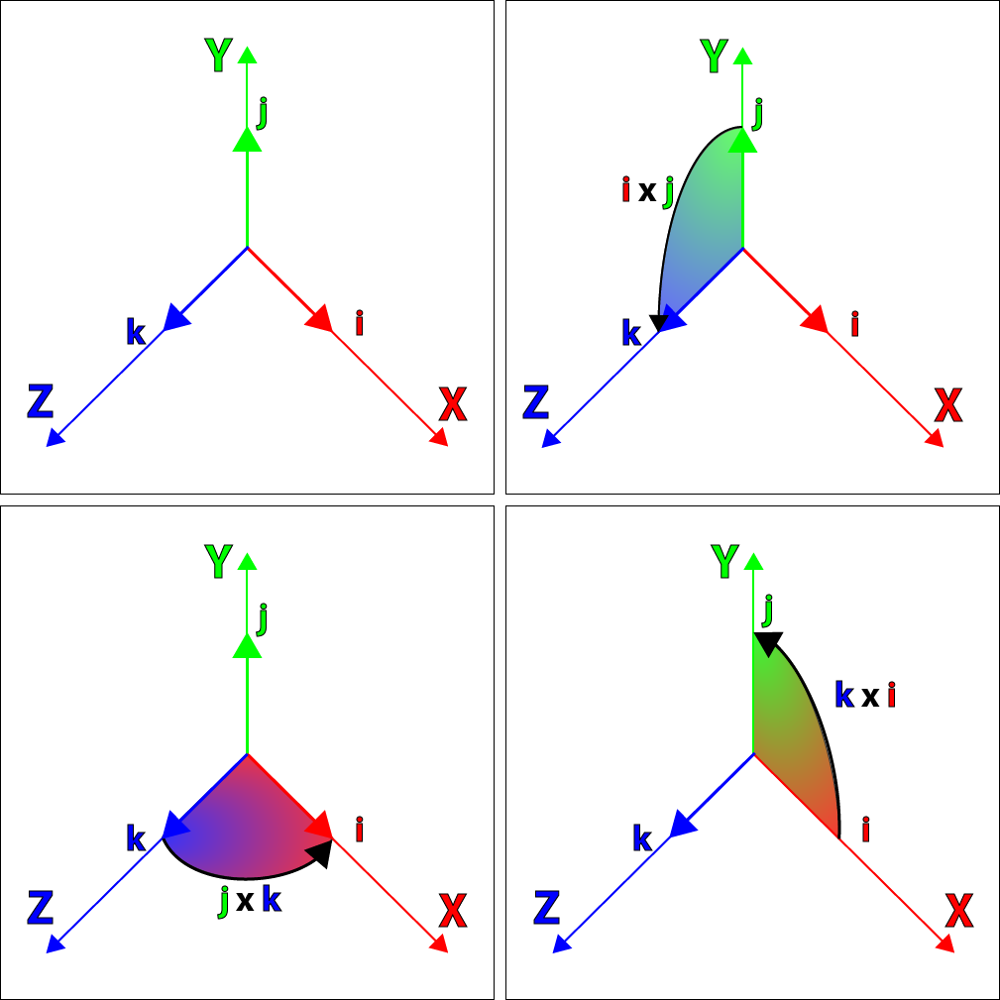

<center>图7-12 用 i、j、k 作为笛卡尔坐标系的单位向量</center>

### 7.4.3 四元数表示

　　我们可以用有序对的形式来表示四元数：
$$
\begin{bmatrix}w, \mathbf{v}\end{bmatrix} \qquad w\in{\mathbb{R}}, \mathbf{v}\in{\mathbb{R}^3}
$$
　　其中的 $\mathbf{v}$ ，也可以用它各自独立的三个分量表示：
$$
q = \begin{bmatrix}w, x\mathbf{i}+y\mathbf{j}+z\mathbf{k}\end{bmatrix} \qquad s, x, y, z \in \mathbb{R}
$$
　　使用这种表示法，我们可以更容易地展示四元数和复数之间的相似性。

### 7.4.4 四元数与轴角对

　　欧拉证明了一个旋转序列等价于单个旋转。因此，3D 中的任意角位移都能表示为绕单一轴的单一旋转（这里的轴是一般意义上的旋转轴，而不是笛卡尔坐标轴。显然，旋转轴的方向是任意的）。当一个方位用这种形式来描述时，称作轴——角描述法（实际上，能将轴——角形式作为描述方位的第四种表达方式。但是，轴——角对很少用到，经常被欧拉角或四元数替代）。
　　在前面，我们导出了使向量绕任意轴旋转的矩阵。像以前那样，设 $\vec{n}$ 为旋转轴。对于旋转轴来说长度并不重要，将 $\vec{n}$ 定义为单位长度会比较方便。根据左手或右手法则，$\vec{n}$ 的方向定义了哪边将被认为是旋转“正”方向。设 $\theta$ 为绕轴旋转的量。因此，轴——角对 $(\vec{n}, \theta)$ 定义了一个角位移：绕 $\vec{n}$ 指定的轴旋转 $\theta$ 角。
　　四元数能被用来解释为角位移的轴——角对方式。然而，$\vec{n}$ 和 $\theta$ 不是直接存储在四元数的四个数中——那样太简单了！它们的确在四元数里，但不是那么直接。下述公式7.10列出了四元数中的数和 $\vec{n}$，$\theta$ 的关系，两种四元数记法都被使用了。
$$
\begin{aligned}
q &= \begin{bmatrix}\cos({\theta}/2) & \sin({\theta}/2\vec{n}\end{bmatrix} \\
&= \begin{bmatrix}\cos({\theta}/2) & (\sin({\theta}/2)n_x & \sin({\theta}/2)n_y & \sin({\theta}/2)n_z)\end{bmatrix}
\end{aligned}
\tag{7.10}
$$
　　记住，q 的 w 分量和 $\theta$ 有关系，但它们不是同一回事。同样，$\vec{v}$ 和 $\vec{n}$ 也有关系但不完全相同。那么这个公式是怎么推导出来的呢？我们后面会有详细讨论，在这里我们先放一放。

### 7.4.5 负四元数

　　四元数能求负。做法很直接：将每个分量都变负，见公式7.11：
$$
\begin{aligned}
-q &= - \begin{bmatrix}w & (x & y & z)\end{bmatrix} \\
&= \begin{bmatrix}-w & (-x &-y & -z)\end{bmatrix} \\
&= -\begin{bmatrix}w & \vec{v}\end{bmatrix} \\
&= \begin{bmatrix}-w & -\vec{v}\end{bmatrix}
\end{aligned}
\tag{7.11}
$$
　　q 和 -q 代表的实际角位移时相同的。如果我们将 $\theta$ 加上 360° 的倍数，不会改变 q 代表的角位移，但它使 q 的四个分量都变负了。因此，3D 中任意角位移都有两种不同的四元数表示方法它们互相为负。

### 7.4.6 单位四元数

　　几何上，存在两个“单位”四元数，它们达标没有角位移：$\begin{bmatrix}1 & \mathbf{0}\end{bmatrix}$ 和 $\begin{bmatrix}-1 & \mathbf{0}\end{bmatrix}$ （注意粗体**0**，它们代表零向量）。/2当 $\theta$ 是 360° 的偶数倍时，有第一种形式，$\cos({\theta})=1$；$\theta$ 是 360° 的奇数倍时，有第二种形式，$\cos({\theta}/2) = -1$。在两种情况下，都有 $\sin({\theta}/2) = 0$，所以 $\vec{n}$ 的值无关紧要。它的意义在于：
　　当旋转角 $\theta$ 是 360° 的整数倍时，方位并没有改变，并且旋转轴也是无关紧要的。
　　数学上，实际只有一个单位四元数：$\begin{bmatrix}1 & \mathbf{0}\end{bmatrix}$。用任意四元数 q 乘以单位四元数 $\begin{bmatrix}1 & \mathbf{0}\end{bmatrix}$ ，结果仍是 q。任意四元数 q 乘以另一个“几何单位”四元数 $\begin{bmatrix}-1 & 0\end{bmatrix}$ 时得到 -q 。几何上，因为 q 和 -q 代表的角位移相同，可认为结果是相同的。但在数学上，q 和 -q 不相等，所以 $\begin{bmatrix}-1 & \mathbf{0}\end{bmatrix}$ 并不是“真正”的单位四元数。

### 7.4.7 四元数的模

　　和复数一样，四元数也有模。记法和公式都与向量的类似，如下公式7.12所示：
$$
\begin{aligned}
\begin{Vmatrix}\mathbf{q}\end{Vmatrix}
&=
\begin{Vmatrix}w & (x & y & z)\end{Vmatrix} = \sqrt{w^2 + x^2 + y^2 + z^2} \\
&=
\begin{Vmatrix}\begin{bmatrix}w & \vec{v}\end{bmatrix}\end{Vmatrix} = \sqrt{w^2 + \begin{Vmatrix}\vec{v}\end{Vmatrix}^2}
\end{aligned}
\tag{7.12}
$$
　　让我们看看它的几何意义。代入 $\theta$ 和 $\vec{n}$ ，可得到：
$$
\begin{aligned}
\begin{Vmatrix}\mathbf{q}\end{Vmatrix}
&= \begin{Vmatrix}w & \vec{v}\end{Vmatrix} \\
&= \sqrt{w + \begin{Vmatrix}\vec{v}\end{Vmatrix}^2} \\
&= \sqrt{\cos^2({\theta}/2)+(\sin({\theta}/2)\begin{Vmatrix}\vec{n}\end{Vmatrix})^2} \\
&= \sqrt{\cos^2({\theta}/2)+\sin({\theta}/2)\begin{Vmatrix}\vec{n}\end{Vmatrix}}
\end{aligned}
$$
　　$\vec{n}$ 为单位向量，所以：
$$
\begin{aligned}
\begin{Vmatrix}\mathbf{q}\end{Vmatrix} 
&= \sqrt{\cos^2({\theta}/2) + \sin^2({\theta}/2) \begin{Vmatrix}\vec{n}\end{Vmatrix}^2} \\
&= \sqrt{\cos^2({\theta}/2) + \sin^2({\theta}/2)(1)} \\
&= \sqrt{\cos^2({\theta}/2) + \sin^2({\theta}/2)}
\end{aligned}
$$
　　应用三角公式 $\sin^2{x}+\cos^2{x} = 1$ ，得到：
$$
\begin{Vmatrix}q\end{Vmatrix} = \sqrt{\cos^2({\theta}/2) + \sin^2({\theta}/2)} = \sqrt{1} = 1
$$
　　如果为了用四元数来表示方位，我们仅适用符合这个规则的单位四元数。对于非标准的四元数，我们这里不再讨论了，请自行查阅相关资料。

### 7.4.8 共轭四元数和逆

　　四元数的共轭记作 $q^*$ ，可通过让四元数的向量部分变负来获得，如下公式7.13所示：
$$
\begin{aligned}
q^* &= \begin{bmatrix}w & \vec{v}\end{bmatrix} = \begin{bmatrix}w & -\vec{v}\end{bmatrix} \\
&= \begin{bmatrix}w & (x & y & z)\end{bmatrix}^* = \begin{bmatrix}w & (-x & -y & -z)\end{bmatrix}
\end{aligned}
\tag{7.13}
$$
　　四元数的逆记作 $q^{-1}$ ，定义为四元数的共轭除以它的模，如下公式7.14所示：
$$
q^{-1} = \frac{q^*}{\begin{Vmatrix}q\end{Vmatrix}}\tag{7.14}
$$
　　四元数的逆和实数的倒数有着有趣的关系。对于实数 a ，它的逆 $a^-1$ 为 $1/a$ ，从另一方面说，$a(a^{-1})=a^{-1}a = 1$ 。四元数的逆也有同样的性质。一个四元数 q 乘以它的逆 $q^{-1}$ ，即可得到单位四元数 $\begin{bmatrix}1 & \mathbf{\vec{0}}\end{bmatrix}$ 。
　　公式7.14是四元数逆的正式定义，但我们只使用单位四元数，所以四元数的逆和共轭是相等的。
　　共轭非常有趣，因为 q 和 $q^*$ 代表相反的角位移。很容易验证这种说法，使 $\vec{v}$ 变负，也就是使旋转轴反向，它颠倒了我们所认为的旋转正方向。因此，q 绕轴旋转 $\theta$ 角，而 $q^*$ 沿相反的方向旋转相同的角度。
　　针对我们的目的而言，四元数的共轭可以有另一种定义：w变负，$\vec{v}$ 不变。这使旋转角变负，而不是通过翻转旋转轴来颠倒正方向。这和公式7.14给出的定义等价，并提供了一种稍微快一点的实现和更为直观的几何解释。但对于复数，术语“共轭”有其特殊含义，因此我们保持原定义不变。

### 7.4.9 四元数乘法（叉乘）

　　四元数能根据之前的复数解释来相乘，如下：
$$
\begin{aligned}
&(w_1 + x_1 i + y_1 j + z_i k)(w_2 + x_2 i + y_2 j + z_2 k) \\
=& w_1 w_2 + w_1 x_2 i + w_1 y_2 j + w_1 z_2 k \\
&+ x_1 w_2 i + x_1 x_2 i^2 + x_1 y_2 ij + x_1 z_2 ik \\
&+ y_1 w_2 j + y_1 x_2 ji + y_1 y_2 j^2 + y_1 z_2 jk \\
&+ z_1 w_2 k + z_1 x_2 ki + z_1 y_2 kj + z_1 z_2 k^2 \\
=& w_1 w_2 + w_1 x_2 i + w_1 y_2 j + w_1 z_2 k \\
&+ x_1 w_2 i + x_1 x_2 (-1) + x_1 y_2 ij + x_1 z_2 ik \\
&+ y_1 w_2 j + y_1 x_2 ji + y_1 y_2 (-1) + y_1 z_2 jk \\
&+ z_1 w_2 k + z_1 x_2 ki + z_1 x_2 ki + z_1 y_2 kj + z_1 z_2 (-1) \\
=& w_1 w_1 - x_1 x_2 - y_1 y_2 - z_1 z_2 \\
&+ (w_1 x_2 + x_1 w_2 + y_1 z_2 - z_1 y_2) i \\
&+ (w_1 y_2 + y_1 w_2 + z_1 x_2 - x_1 z_2) j \\
&+ (w_1 z_2 + z_1 w_2 + x_1 y_2 - y_1 x_2) k
\end{aligned}
$$

　　这导出了四元数乘法的标准定义，下面以两种四元数记法给出：
$$
\begin{aligned}
&
\begin{bmatrix}
w_1 & (x_1 & y_1 & z_1)
\end{bmatrix}
\begin{bmatrix}
w_2 & (x_2 & y_2 & z_2)
\end{bmatrix} \\ 
=&
\begin{bmatrix}
w_1 w_2 - x_1 x_2 - y_1 y_2 - z_1 z_2 \\
\begin{pmatrix}
w_1 x_2 + x_1 w_2 + z_1 y_2 - y_1 z_2 \\ 
w_1 y_2 + y_1 w_2 + x_1 z_2 - z_1 x_2 \\
w_1 z_2 + z_1 w_2 + y_1 x_2 - x_1 y_2
\end{pmatrix}
\end{bmatrix} 
\\ \\
&
\begin{bmatrix}w_1 & \vec{v_1}\end{bmatrix}
\begin{bmatrix}w_2 & \vec{v_2}\end{bmatrix} \\
=&
\begin{bmatrix}
w_1 w_2 - \vec{v_1} \cdot \vec{v_2} & w_1 \vec{v_2} + w_2 \vec{v_1} + \vec{v_2} \times \vec{v_1}
\end{bmatrix}
\end{aligned}
\tag{7.15}
$$

　　以上就是四元数乘法的标准定义。不用为四元数叉乘使用乘号，“行”或“列”四元数也没有什么区别。

　　四元数叉乘满足结合律，但不满足交换律，如下公式所示：
$$
\begin{aligned}
(\mathbf{a} \mathbf{b}) \mathbf{c} &= \mathbf{a} (\mathbf{b} \mathbf{c}) \\
\mathbf{a} \mathbf{b} &\neq \mathbf{b} \mathbf{a}
\end{aligned}
\tag{7.16}
$$

　　现在看看两个四元数叉乘的模：
$$
\begin{aligned}
\begin{Vmatrix}
\mathbf{q_1} \mathbf{q_2}
\end{Vmatrix}
&=
\begin{Vmatrix}
w_1 & (x_1 & y_1 & z_1)
\end{Vmatrix}
\begin{Vmatrix}
w_2 & (x_2 & y_2 & z_2)
\end{Vmatrix}
\\
&=
\begin{Vmatrix}
\begin{bmatrix}
w_1 w_2 -x_1 x_2 - y_1 y_2 - z_1 z_2 \\
\begin{pmatrix}
w_1 x_2 + x_1 w_2 + z_1 y_2 - y_1 z_2 \\
w_1 y_2 + y_1 w_2 + x_1 z_2 - z_1 x_2 \\
w_1 z_2 + z_1 w_2 + y_1 x_2 - x_1 y_2
\end{pmatrix}
\end{bmatrix}
\end{Vmatrix}
\\
&=
\sqrt{\begin{aligned}(w_1 w_2 - x_1 x_2 - y_1 y_2 - z_1 z_2)^2 \\ + (w_1 x_2 + x_1 w_2 + z_1 y_2 - y_1 z_2)^2 \\ + (w_1 y_2 + y_1 w_2 + x_1 z_2 - z_1 x_2)^2 \\ + (w_1 z_2 + z_1 w_2 + y_1 x_2 - x_1 y_2)^2\end{aligned}}
\end{aligned}
$$

　　展开合并同类项得到以下公式：
$$
\begin{aligned}
\mathbf{q_1} \mathbf{q_2} 
&= 
\sqrt{
    \begin{aligned}
    w_1^2 w_2^2 + x_1^2 x_2^2 + y_1^2 y_2^2 + z_1^2 z_2^2 \\
    + w_1^2 x_2^2 + x_1^2 w_2^2 + z_1^2 y_2^2 + y_1^2 z_2^2 \\
    + w_1^2 y_2^2 + y_1^2 w_2^2 + x_1^2 z_2^2 + z_1^2 x_2^2 \\
    + w_1^2 z_2^2 + z_1^2 w_w^2 + y_1^2 x_2^2 + x_1^2 y_2^2
    \end{aligned}
}
\\
&=
\sqrt{
    \begin{aligned}
    w_1^2 (w_2^2 + x_2^2 + y_2^2 + z_2^2) \\
    + x_1^2 (w_2^2 + x_2^2 + y_2^2 + z_2^2) \\
    + y_1^2 (w_2^2 + x_2^2 + y_2^2 + z_2^2) \\
    + z_1^2 (w_2^2 + x_2^2 + y_2^2 + z_2^2)
    \end{aligned}
}
\\
&=
\sqrt{(w_1^2 + x_1^2 + y_1^2 + z_1^2) (w_2^2 + x_2^2 + y_2^2 + z_2^2)}
\end{aligned}
$$

　　最后，应用四元数模的定义得到以下公式：
$$
\begin{aligned}
\begin{Vmatrix}
\mathbf{q_1} \mathbf{q_2}
\end{Vmatrix}
&=
\sqrt{(w_1^2 + x_1^2 + y_1^2 + z_1^2) (w_2^2 + x_2^2 + y_2^2 + z_2^2)}
\\
&=
\sqrt{\begin{Vmatrix}\mathbf{q}_1\end{Vmatrix}^2 \begin{Vmatrix}\mathbf{q}_2\end{Vmatrix}^2}
\\
&=
\begin{Vmatrix}\mathbf{q_1}\end{Vmatrix} \begin{Vmatrix}\mathbf{q_2}\end{Vmatrix}
\end{aligned}
\tag{7.17}
$$

　　因此，四元数乘积的模等于模的乘积。这个结论非常重要，因为它保证了两个单位四元数相乘的结果还是单位四元数。

　　四元数乘积的逆等于各个四元数的逆以相反的顺序相乘，如下公式所示：
$$
\begin{aligned}
&(\mathbf{a} \mathbf{b})^{-1} = \mathbf{b}^{-1} \mathbf{a}^{-1} \\
&(\mathbf{q}_1 \mathbf{q}_2 \cdots \mathbf{q}_{n-1} \mathbf{q}_n) = \mathbf{q}_n^{-1} \mathbf{q}_{n-1}^{-1} \cdots \mathbf{q}_2^{-1} \mathbf{q}_1^{-1}
\end{aligned}
\tag{7.18}
$$

　　现在到了四元数非常有用的性质。让我们扩展一个标准 3D 点(x, y, z)到四元数空间，通过定义四元数 $\mathbf{p} = \begin{bmatrix}0 & (x & y & z)\end{bmatrix}$ 即可。设 **q** 为我们讨论的旋转四元数形式 $\begin{bmatrix}\cos{\theta / 2} & \vec{n} \sin{\theta / 2}\end{bmatrix}$ ，$\vec{n}$ 为旋转轴，单位向量；$\theta$ 为旋转角。我们会惊奇的发现，执行下面的乘法可以使 3D 点 **p** 绕 $\vec{n}$ 旋转：
$$
\mathbf{p}' = \mathbf{q} \mathbf{p} \mathbf{q}^{-1}
$$

　　我们可以证明这个等式，通过展开乘法，代入 $\vec{n}$ 和 $\theta$，然后和公式6.17比较。事实上，很多介绍四元数的都是从这里开始推导四元数向矩阵形式转换的公式。我们后面会完全从旋转的几何角度来推导四元数向矩阵的转换。已经证明，四元数乘法和 3D 向量旋转的对应关系，更多的是理论上的意义，不是实践上的。实际上，它几乎和把四元数转换到矩阵形式然后再用矩阵乘以向量所用的时间一样。
　　
　　抛开这个数学上的细节，四元数乘法的优势在哪里呢？我们看看多次旋转的情况。将点 $\vec{p}$ 用一个四元数 $\mathbf{a}$ 旋转然后再用另一个四元数 $\mathbf{b}$ 旋转：
$$
\begin{aligned}
\mathbf{p}' 
&= \mathbf{b} (\mathbf{a} \mathbf{p} \mathbf{a}^{-1}) \mathbf{b}^{-1} \\
&= (\mathbf{b} \mathbf{a}) \mathbf{p} (\mathbf{a}^{-1} \mathbf{p}^{-1}) \\
&= (\mathbf{b} \mathbf{a}) \mathbf{p} (\mathbf{b} \mathbf{a})^{-1}
\end{aligned}
$$

　　注意，先进行 $\mathbf{a}$ 旋转再进行 $\mathbf{b}$ 旋转等价于执行乘积 $\mathbf{b} \mathbf{a}$ 代表的单一旋转。因此，四元数乘法能用来连接多次旋转，这和矩阵乘法效果一样。根据四元数乘法的标准定义，这个旋转是以从右向左的顺序发生的。这个刚好跟我们用列向量矩阵时候的矩阵运算形式是相同的。

### 7.4.10 实四元数

　　一个实四元数是一个虚部向量为零向量的四元数：
$$
q = \begin{bmatrix}s & \vec{0}\end{bmatrix}
\tag{7.19}
$$

　　两个是四元数的乘积是另一个是四元数：
$$
\mathbf{q}_a = \begin{bmatrix}s_a & \vec{0}\end{bmatrix} \\
\mathbf{q}_b = \begin{bmatrix}s_b & \vec{0}\end{bmatrix} \\
\mathbf{q}_a \mathbf{q}_b 
= \begin{bmatrix}s_q & \vec{0}\end{bmatrix} \begin{bmatrix}s_b & \vec{0} \end{bmatrix}
= \begin{bmatrix}s_a s_b & \vec{0}\end{bmatrix}
\tag{7.20}
$$

　　这和2个虚部为0的复数的乘积几乎一样：
$$
z_1 = a_1 + 0\mathbf{i} \\
z_2 = a_2 + 0\mathbf{i} \\
z_1 z_2 = (a_1 + 0 \mathbf{i})(a_2 + 0 \mathbf{i}) = a_1 a_2
$$

### 7.4.11 纯四元数

　　和实四元数相似，Hamilton也定义了纯四元数。纯四元数是 s=0 的四元数：
$$
q = \begin{bmatrix}0 & \vec{v}\end{bmatrix}
\tag{7.21}
$$

　　也可以写成下面的形式：
$$
q = x\mathbf{i} + y\mathbf{j} + z\mathbf{k}
\tag{7.22}
$$

　　然后是2个纯四元数的乘积：
$$
\begin{aligned}
\mathbf{q}_a &= \begin{bmatrix}0 & \vec{a}\end{bmatrix} \\
\mathbf{q}_b &= \begin{bmatrix}0 & \vec{b}\end{bmatrix} \\
\mathbf{q}_a \mathbf{q}_b
&= 
\begin{bmatrix}0 & \vec{a}\end{bmatrix}
\begin{bmatrix}0 & \vec{b}\end{bmatrix} \\
&=
\begin{bmatrix}-\vec{a} \cdot \vec{b} & \vec{a} \times \vec{b}\end{bmatrix}
\end{aligned}
\tag{7.23}
$$

### 7.4.12 四元数点乘

　　四元数也有点乘运算。它的记法，定义和向量点乘非常类似，如下公式所示：
$$
\begin{aligned}
\mathbf{q}_1 \mathbf{q}_2 
&= 
\begin{bmatrix}w_1 & \vec{v}_1\end{bmatrix}
\begin{bmatrix}w_2 & \vec{v}_2\end{bmatrix} \\
&=
w_1 w_2 + \vec{v}_1 \cdot \vec{v}_2 \\
&=
\begin{bmatrix}w_1 & (x_1 & y_1 & z_1)\end{bmatrix}
\begin{bmatrix}w_2 & (x_2 & y_2 & z_2)\end{bmatrix} \\
&= w_1 w_2 + x_1 x_2 + y_1 y_2 + z_1 z_2
\end{aligned}
\tag{7.24}
$$

　　注意，和向量点乘一样，其结果是标量。对于单位四元数 $\mathbf{a}$ 和 $\mathbf{b}$，有 $-1 \le \mathbf{a} \mathbf{b} \le 1$。通常我们只关心 $\mathbf{a} \mathbf{b}$ 的绝对值，因为 $\mathbf{a} \mathbf{b} = -(\mathbf{a} \cdot - \mathbf{b})$，所以 $\mathbf{b}$ 和 $-\mathbf{b}$ 代表相同的角位移。
　　
　　四元数点乘的几何解释类似于向量点乘的几何解释。四元数点乘 $\mathbf{a} \cdot \mathbf{b}$ 的绝对值越大，$\mathbf{a}$ 和 $\mathbf{b}$ 代表的角位移越“相似”。

### 7.4.13 四元数“差”

　　利用四元数的乘法和逆，就能够计算两个四元数的“差”。“差”被定义为一个方位到另一个方位的角位移。换言之，给定方位 $\mathbf{a}$ 和 $\mathbf{b}$，能够计算从 $\mathbf{a}$ 旋转到 $\mathbf{b}$ 的角位移 $\mathbf{d}$。用四元数等式更加紧凑地表示为：$\mathbf{d} \mathbf{a} = \mathbf{b}$。
　　
　　现在来求 $\mathbf{d}$。如果等式中的变量为标量，那么久可以简单的除以 $\mathbf{a}$。但是，不能除以四元数，只能乘它们。也许乘以它的逆能达到想要的效果！两边同时右乘 $\mathbf{a}^{-1}$ （注意了，四元数乘法跟矩阵一样不满足交换律）：
$$
\mathbf{d} \mathbf{a} \mathbf{a}^{-1} = \mathbf{b} \mathbf{a}^{-1}
$$

　　应用四元数乘法的结合律，化简可得：
$$
\begin{aligned}
(\mathbf{d} \mathbf{a}) \mathbf{a}^{-1} 
&= 
\mathbf{b} \mathbf{a}^{-1} \\
\mathbf{d} \begin{bmatrix}1 & \vec{0}\end{bmatrix} 
&= 
\mathbf{b} \mathbf{a}^{-1} \\
\mathbf{d} &= \mathbf{b} \mathbf{a}^{-1}
\end{aligned}
$$

　　现在，我们就有了求得代表一个方位到另一个方位角位移的四元数的方法。后面我们将用到这种方法。数学上，两个四元数之间的角度“差”更类似于“除”，而不是真正的“差”（减法）。

### 7.4.14 四元数的对数、指数和标量乘运算

　　现在我们来讨论四元数的三种运算，尽管很少直接使用它们，但它们是某些重要四元数运算的基础。这些运算时四元数对数、指数、标量乘。
　　
　　首先，让我们重写四元数的定义，引入一个新的变量 $alpha$，等于半角 $\theta / 2$:
$$
\begin{aligned}
\alpha &= \theta / 2 \\ 
\begin{Vmatrix}\vec{n}\end{Vmatrix} &= 1 \\
\mathbf{q} 
&= \begin{bmatrix}\cos{\alpha} & \vec{n} \sin{\alpha} \end{bmatrix} \\
&= \begin{bmatrix}\cos{\alpha} & x\sin{\alpha} & y\sin{\alpha} & z\sin{\alpha}\end{bmatrix}
\end{aligned}
$$

　　$\mathbf{ｑ}$ 的对数定义为如下公式所示：
$$
\begin{aligned}
\log{\mathbf{q}} 
&= \log{(\begin{bmatrix}\cos{\alpha} & \vec{n}\sin{\alpha}\end{bmatrix})} \\
& \equiv \begin{bmatrix}0 & \alpha \vec{n} \end{bmatrix}
\end{aligned}
\tag{7.25}
$$

　　$\equiv$ 表示“恒等于”。注意 $\log{\mathbf{q}}$ 的结果，它一般不是单位四元数。
　　
　　指数则以严格相反的方式定义。首先，设四元数 $\mathbf{p}$ 的形式为 $\begin{bmatrix}0 & \alpha \vec{n}\end{bmatrix}$，$\vec{n}$ 为单位向量：
$$
\begin{aligned}
\mathbf{p} &= \begin{bmatrix}0 & \alpha \vec{n}\end{bmatrix} \\
&= \begin{bmatrix}0 & (\alpha x & \alpha y & \alpha z)\end{bmatrix} \\
\begin{Vmatrix}\vec{n}\end{Vmatrix} = 1
\end{aligned}
$$

　　指数定义公式如下：
$$
\begin{aligned}
exp(\mathbf{p})
&= exp(\begin{bmatrix}0 & \alpha \vec{n}\end{bmatrix})
&\equiv \begin{bmatrix}\cos{\alpha} & \vec{n} \sin{\alpha}\end{bmatrix}
\end{aligned}
\tag{7.26}
$$

　　根据定义，$exp(\mathbf{p})$ 总是返回单位四元数。
　　
　　四元数的对数和指数类似于它们的标量形式。对于标量a，有下列关系成立：
$$
e^{\ln{a}} = a
$$

　　同样，四元数指数运算为四元数对数运算的逆运算：
$$
exp(\log{\mathbf{q}}) = \mathbf{q}
$$

　　最后，四元数能与一个标量相乘。其计算方法非常直接：每个分量都乘以这个标量。给定标量 k 和四元数 $\mathbf{q}$，有如下公式：
$$
\begin{aligned}
k\mathbb{q} 
&= k \begin{bmatrix}w & \vec{v}\end{bmatrix} \\
&= \begin{bmatrix}kw & k \vec{v}\end{bmatrix} \\
&= k \begin{bmatrix}w & (x & y & z)\end{bmatrix} \\
&= \begin{bmatrix}kw & (kx & ky & kz)\end{bmatrix}
\end{aligned}
\tag{7.27}
$$

　　一般不会得到单位四元数，这也是为什么在表达角位移的场合中标量乘不是那么有用的原因。

### 7.4.15 四元数的幂

　　四元数能作为底数，记作 $\mathbf{q}^t$ （不要和指数运算混淆，指数运算只接受一个四元数作为参数，而四元数求幂有两个参数——四元数和指数）。四元数求幂的意义类似于实数求幂。回忆一下，$a^0 = 1$，$a^1 = a$，a为非零标量。当 t 从 0 变到 1 时，a' 从 1 到 a。四元数求幂有类似的结论：当 t 从 0 变到 1，$\mathbf{q}'$ 从 $\begin{bmatrix}1 & 0\end{bmatrix}$ 到 $\mathbf{q}$。
　　
　　这对四元数求幂非常有用，因为它可以从角位移中抽取“一部分”。例如，四元数 $\mathbf{q}$ 代表一个角位移，现在想要得到代表 1/3 这个角位移的四元数，可以这样计算：$\mathbf{q}^{1/3}$。

　　指数超出 [0, 1] 范围外的几何行为和预期的一样（但有一个重要的注意事项）。例如，$\mathbf{q}^2$ 代表的角位移是 $\mathbf{q}$ 的两倍。假设 $\mathbf{q}$ 代表绕 x 轴顺时针旋转 30°，那么 $\mathbf{q}^2$ 代表绕 x 轴顺时针旋转 60°，$\mathbf{q}^{1/3}$ 代表绕 x 轴逆时针旋转 10°。

　　上面提到的注意事项是，四元数表达角位移时使用最短圆弧，不能“绕圈”。继续上面的例子，$\mathbf{q}^4$ 不是预期的绕 x 轴顺时针旋转 240°，而是逆时针 80°。显然，向一个方向旋转 240° 等价于向相反的方向旋转 80°，都能得到正确的“最终结果”。但是，在此基础上的进一步运算，产生的就可能不是预期的结果了。例如：$(\mathbf{q}^4)^{1/2}$，尽管我们感觉应该是这样。一般来说，凡是涉及到指数运算的代数公式，如 $(a^s)^t = a^{st}$，对四元数都不适用。

　　现在，我们已经理解四元数求幂可以为我们做什么了。让我们看看它的数学定义。四元数求幂定义在之前讨论的“有用”运算上，定义如下公式：
$$
\begin{aligned}
\mathbf{q}^t = exp(t \log{\mathbf{q}})
\end{aligned}
\tag{7.28}
$$

　　对于标量求幂，也有类似结论：
$$
a^t = e^{(t \ln{a})}
$$

　　不难理解为什么当 t 从 0 变到 1 时，$\mathbf{q}^t$ 从单位四元数变到 $\mathbf{q}$。注意到对数运算只是提取了轴 $\vec{n}$ 和角度 $\theta$；接着，和指数 t 进行标量乘时，结果是 $\theta$ 乘以 t；最后，指数运算“撤销”了对数运算，从 $t \theta$ 和 $\vec{n}$ 重新计算 w 和 $\vec{v}$。上面给出的定义就是标准数学定义，在理论上非常完美，但是直接转换到代码却是很复杂的。这里就不展开讨论了，有兴趣的小伙伴可以直接查阅源代码。

### 7.4.16 四元数和旋转

　　前面我们讨论过，在 3D 中的任意角位移都能表示为绕单一轴的单一旋转，这个就是轴——角对。当时我们留了个尾巴没有讨论，那就是怎么推导出轴——角对的四元数表达式。现在我们在这里进一步展开讨论下如何得出的。

　　前面我们定义了一个特殊的复数：旋转数，它是用来旋转 2D 复平面的点的：
$$
\mathbf{q} = \cos{\theta} + \mathbf{i} \sin{\theta}
$$

　　根据四元数和复数的相似性，应该有可能涉及一个可以旋转 3D 空间的点的四元数：
$$
\mathbf{q} = \begin{bmatrix}\cos{\theta} & \sin{\theta} \vec{v}\end{bmatrix}
$$

　　让我们测试一下这个理论是否可靠，方法就是计算四元数 $\mathbf{q}$ 和向量 $\vec{p}$ 的积。第一步，我们把 $\vec{p}$ 写成纯四元数的形式：
$$
\mathbf{p} = \begin{bmatrix}0 & \vec{p}\end{bmatrix}
$$

　　以及单位四元数 $\mathbf{q}$ ：
$$
\mathbf{q} = \begin{bmatrix}s & \lambda \vec{v}\end{bmatrix}
$$

　　从而：
$$
\begin{aligned}
\mathbf{p}' 
&= \mathbf{q} \mathbf{p} \\
&= \begin{bmatrix}s & \lambda \vec{v}\end{bmatrix} 
\begin{bmatrix}0 & \vec{p}\end{bmatrix} \\
&= 
\begin{bmatrix}-\lambda \vec{v} \cdot \vec{p} & s\vec{p} + \lambda \vec{v} \times \vec{p}\end{bmatrix}
\end{aligned}
$$

　　我们可以看到结果是一个同时有系数、有虚向量的四元数。

　　让我们先考虑特殊的情形：$\vec{p}$ 与 $\vec{v}$ 正交。这种情况下，点乘部分等于 0：$-\lambda \vec{v} \cdot \vec{p} = 0$。所以上面四元数就变成了纯四元数：
$$
\mathbf{p}' = \begin{bmatrix}0 & s\vec{p} + \lambda \vec{v} \times \vec{p}\end{bmatrix}
$$

　　这时候，要使 $\vec{p}$ 绕 $\vec{v}$ 旋转，我们只需要代入 $s = \cos{\theta}$ 和 $\lambda = \sin{\theta}$：
$$
\mathbf{p}' = \begin{bmatrix}0 & \cos{\theta} \vec{p} + \sin{\theta} \vec{v} \times \vec{p}\end{bmatrix}
$$

　　现在，让我们找一个例子来测试上面的公式。比如绕 z 轴（就是 k 轴）旋转 45°，那么我们的四元数 $\mathbf{q}$ 就变成：
$$
\begin{aligned}
\mathbf{q} 
&= \begin{bmatrix}\cos{\theta} & \sin{\theta} \vec{k}\end{bmatrix} \\
&= \begin{bmatrix}\frac{\sqrt{2}}{2} & \frac{\sqrt{2}}{2} \vec{k}\end{bmatrix}
\end{aligned}
$$

　　然后，选一个特殊的 $\mathbf{p}$，并且 $\mathbf{p}$ 要和 k 轴正交，比如把 $\mathbf{p}$ 放到 i 轴上，也就是：
$$
\mathbf{p} = \begin{bmatrix}0 & 2 \vec{i}\end{bmatrix}
$$

　　现在计算下 $\mathbf{q} \mathbf{p}$：
$$
\begin{aligned}
\mathbf{p}' &= \mathbf{q} \mathbf{p} \\
&= 
\begin{bmatrix}\frac{\sqrt{2}}{2} & \frac{\sqrt{2}}{2} \vec{k}\end{bmatrix}
\begin{bmatrix}0 & 2 \vec{i}\end{bmatrix} \\
&= \begin{bmatrix}0 & 2\frac{\sqrt{2}}{2} \vec{i} + 2\frac{\sqrt{2}}{2} \vec{k} \times \vec{i}\end{bmatrix} \\
&= \begin{bmatrix}0 & \sqrt{2} \vec{i} + \sqrt{2} \vec{j}\end{bmatrix}
\end{aligned}
$$

　　结果是一个绕了 k 轴转了 45° 的纯四元数。我们可以确认这个四元数的向量部分的长度是：
$$
\mathbf{p}' = \sqrt{\sqrt{2}^2 + \sqrt{2}^2} = 2
$$

　　这正是我们所期望的！

　　我们可以用图像展示旋转过程，如下图 7-13 所示：


<center>图7-13 四元数旋转过程 1</center>

　　现在，让我们考虑更一般化的四元数，即和 $\mathbf{p}$ 不正交的四元数。现在让我们把 $\mathbf{p}$ 的向量部分偏移 45°：
$$
\begin{aligned}
\vec{v} &= \frac{\sqrt{2}}{2} \vec{i} + \frac{\sqrt{2}}{2} \vec{k} \\
\vec{p} &= 2 \vec{i} \\
\mathbf{q} &= \begin{bmatrix}\cos{\theta} & \sin{\theta} \vec{v}\end{bmatrix} \\
\mathbf{p} &= \begin{bmatrix}0 & \vec{p}\end{bmatrix}
\end{aligned}
$$

　　然后计算 $\mathbf{q} \mathbf{p}$：
$$
\begin{aligned}
\mathbf{p}' &= \mathbf{q} \mathbf{p} \\
&= \begin{bmatrix}\cos{\theta} & \sin{\theta} \vec{v}\end{bmatrix}
\begin{bmatrix}0 & \vec{p}\end{bmatrix} \\
&= \begin{bmatrix}-\sin{\theta} \vec{v} \cdot \vec{p} & \cos{\theta} \vec{p} + \sin{\theta} \vec{v} \times \vec{p}\end{bmatrix}
\end{aligned}
$$

　　代入我们设定的 $\vec{v}$，$\vec{p}$，以及 $\theta = 45°$，得到：
$$
\begin{aligned}
\mathbf{p}' 
&= 
\begin{bmatrix}
- \frac{\sqrt{2}}{2}
(\frac{\sqrt{2}}{2}\vec{i} + \frac{\sqrt{2}}{2}\vec{k})
\cdot (2\vec{i})
&
\frac{\sqrt{2}}{2} 2\vec{i} 
+ \frac{\sqrt{2}}{2}
(\frac{\sqrt{2}}{2}\vec{i} + \frac{\sqrt{2}}{2}\vec{k})
\times 2\vec{i} 
\end{bmatrix} \\
&=
\begin{bmatrix}-1 & \sqrt{2}\vec{i} + \vec{j}\end{bmatrix}
\end{aligned}
$$

　　注意，算出来的结果已经不是纯四元数了，并且，它并没有旋转 45°、模也不在是2（反而变小了，变成 $\sqrt{3}$）

　　我们可以用图像展示旋转过程，如下图 7-14 所示：


<center>图7-14 四元数旋转过程 2</center>

> 严格来说，这样子在 3D 空间中表示 p'是不正确的。因为它其实是一个 4D 向量！为了简单起见，我只将这个四元数的向量部分显示出来。

　　然而，还是有点希望。Hamilton发现（但没有正式宣布），如果对 $\mathbf{q} \mathbf{p}$ 右乘 $\mathbf{q}$ 的逆，得出来的结果是一个纯四元数，并且四元数向量部分的模可以保持不变。让我们试试应用在我们的例子里。

　　首先计算：
$$
\begin{aligned}
\mathbf{q} &= 
\begin{bmatrix}cos{\theta} & \sin{\theta}(\frac{\sqrt{2}}{2}\vec{i} + \frac{\sqrt{2}}{2}\vec{k})\end{bmatrix} \\
\mathbf{q}^{-1} &= 
\begin{bmatrix}cos{\theta} & -\sin{\theta}(\frac{\sqrt{2}}{2}\vec{i} + \frac{\sqrt{2}}{2}\vec{k})\end{bmatrix}
\end{aligned}
$$

　　这里 $\mathbf{q}^{-1} = \mathbf{q}^*$ 是因为 $\mathbf{q}4 是单位四元数。

　　再代入 $\theta = 45°$，得到：
$$
\begin{aligned}
\mathbf{q}^{-1} &= 
\begin{bmatrix}
\frac{\sqrt{2}}{2} & -\frac{\sqrt{2}}{2}
(\frac{\sqrt{2}}{2}\vec{i} + \frac{\sqrt{2}}{2}\vec{k})
\end{bmatrix} \\
&= \frac{1}{2}
\begin{bmatrix}
\sqrt{2} & -\vec{i} - \vec{k}
\end{bmatrix}
\end{aligned}
$$

　　现在，把前面计算出来的 $\mathbf{q} \mathbf{p}$ 再次拿出来：
$$
\begin{aligned}
\mathbf{q} \mathbf{p} &= 
\begin{bmatrix}-1 & \sqrt{2}\vec{i} + \vec{j}\end{bmatrix} \\
\mathbf{q} \mathbf{p} \mathbf{q}^{-1} &=
\begin{bmatrix}-1 & \sqrt{2}\vec{i} + \vec{j}\end{bmatrix}
\frac{1}{2}
\begin{bmatrix}\sqrt{2} & -\vec{i} -\vec{k}\end{bmatrix} \\
&=
\frac{1}{2}
\begin{bmatrix}
-\sqrt{2} - (\sqrt{2}\vec{i} + \vec{j} \cdot
(-\vec{i} - \vec{k}) 
&
\vec{i} + \vec{k} + \sqrt{2} (\sqrt{2} \vec{i} + \vec{j}) 
- \vec{i} + \sqrt{2} \vec{j} + \vec{k}
\end{bmatrix} \\
&=
\frac{1}{2}
\begin{bmatrix}
-\sqrt{2} + \sqrt{2} 
& 
\vec{i} + \vec{k} + 2\vec{i} + \sqrt{2} \vec{j}
- \vec{i} + \sqrt{2} \vec{j} + \vec{k}
\end{bmatrix} \\
&=
\begin{bmatrix}0 & \vec{i} + \sqrt{2} \vec{j} + \vec{k}\end{bmatrix}
\end{aligned}
$$

　　这下是纯四元数了，并且它的模是：
$$
\begin{Vmatrix}\mathbf{q} \mathbf{p} \mathbf{q}^{-1}\end{Vmatrix}
=
\sqrt{1^2 + \sqrt{2}^2 + 1^2}
= \sqrt{4} = 2
$$

　　这和原始的$\mathbf{p}$ 的模是一致的。

　　下面图像展示了旋转结果，如下图 7-15 所示：
　　


<center>图7-14 四元数旋转过程 3</center>

　　我们可以看到，这个结果是一个纯四元数，并且原四元数的向量的模也保持住了。但是还有一个问题，向量被旋转了90°而不是45°，这刚好是我们需要的度数的两倍！为了正确地让一个向量绕某个轴向量旋转某个角度，我们必须以目标角度的一半来计算。因此，我们构造了下面的四元数：
$$
\mathbf{q} = \begin{bmatrix}\cos{\frac{1}{2}\theta} & \sin{\frac{1}{2}\theta} \vec{v}\end{bmatrix}
$$

　　这就是旋转四元数的一般形式，也就是前面我们提到的轴——角对。
　　
### 7.4.17 四元数插值（slerp）

　　在计算机图形学中使用四元数，其中一个重要原因是四元数非常适合用来表示空间中的旋转。另外一个四元数存在的理由是由于一种称作 slerp 的运算，它是球面线性插值的缩写（Spherical Linear Interpolation）。slerp 运算非常有用，因为它可以在两个四元数间平滑插值。slerp 运算避免了欧拉角插值的所有问题（前面我们已经讨论过）。

　　slerp 是一种三元运算，这意味着它有三个操作数。前两个操作数是两个四元数，将在它们中间插值。设这两个“开始”和“结束”四元数分别为 $\mathbf{q}_0$ 和 $\mathbf{q}_1$。插值参数设为变量 t，t 在 0 到 1 之间变化。slerp函数：$slerp(\mathbf{q}_0, \mathbf{q}_1, t)$

　　将返回 $\mathbf{q}_0$ 和 $\mathbf{q}_1$ 之间的插值方位。

　　能否利用现有的数学工具推导出 slerp 公式呢？如果在两个标量 $a_0$ 和 $a_1​$ 间插值，我们会使用下面的标准线性插值公式：
$$
\begin{aligned}
& \Delta{a} = a_1 - a_0 \\
& lerp(a_0, a_1, t) = a_0 + t \Delta{a}
\end{aligned}
$$

　　标准线性插值公式从 $a_0$ 开始，并加上 $a_0$ 和 $a_1$ 差的 $t^{th}$ 倍。有三个基本步骤：


### 7.4.18 四元数样条（squad）

### 7.4.19 四元数的优点和缺点


## <center>7.5 矩阵、欧拉角和四元数的比较</center>


## <center>7.6 矩阵、欧拉角和四元数三者之间的转换</center>

### 7.6.1 从欧拉角转换到矩阵

### 7.6.2 从矩阵转换到欧拉角

### 7.6.3 从四元数转换到矩阵

### 7.6.4 从矩阵转换到四元数

### 7.6.5 从欧拉角到四元数 

### 7.6.6 从四元数转换到欧拉角

<div style="page-break-after:always;"></div>


# <center>八、3D数学——几何图元</center>

本篇概要

- 讨论几何图元表示方式
- 讨论直线和射线的表示
- 讨论球和圆的表示
- 讨论平面的表示
- 讨论三角形的表示
- 讨论包围球（Sphere）、轴对齐包围盒（AABB）和有向包围盒（OBB）的表示
- 讨论视锥体的表示

　　我们在这里讨论一些基本几何图元，为后续我们实现相交检测提供基础，甚至是不支持硬件渲染时可以用来做软渲染实现的基础。


## <center>8.1 表示方法</center>

　　任何几何图元都有表示方法。而且任意图元都可以使用这些方法中的一种或多种来表示，在不同的情况下采用不同的方法。

### 8.1.1 隐式表示

　　通过定义一个布尔函数 f(x, y, z)，我们能够隐式表示一个图元。如果所指定的点在这个图元上，这个布尔函数就是真，对于其他的点，这个布尔函数为假。例如等式：
$$
x^2+y^2+z^2=1 \tag{8.1}
$$
　　公式8.1表示对中心在原点的单位球表面上的所有点为真。隐式表示法用于测试图元是否包含某些点时非常有用。

### 8.1.2 参数形式表示

　　图元也能以参数形式表示。我们从一个简单的2D例子开始，定义如下两个关于 t 的函数：
$$
\begin{aligned}
&x(t) = \cos 2 \pi t
\\
&y(t) = \sin 2 \pi t
\end{aligned} \tag{8.2}
$$
　　这里 t 被称作参数，并和所用的坐标系无关。当 t 从0变化到1时，点(x(t), y(t))的轨迹就是索要描述的形状。公式10.2表示的是一个中心在原点的单位圆，如下图8-1所示：


<center>图8-1 参数形式的圆</center>

　　尽管可以让 t 在我们想要的任意范围内变化，但是在大多数情况下，把参数的变换范围限制在0到1之间会比较方便一点。另外一种常见的变换范围是从0到 l，l 是图元的“长度”。

　　如果函数只使用一个参数，就成这些函数为单变量的。单变量函数的轨迹是一条曲线。有时候函数可能有多于一个的参数，双变量函数接受两个参数，经常设为s和t。双变量函数的是一个曲面。

### 8.1.3 直接形式表示

　　除了上述两种方式外，其他都叫直接形式吧。它们随图元的类型的不同而不同，而且经常能直接的体现图元最本质和最明显的信息。例如：用两个端点来表示一个线段，用球心和半径来表示一个球。这种形式是最编译大家直接使用的形式。

### 8.1.4 自由度

　　每个几何图元都有一个固有的属性，我们称为自由度。自由度是无歧义地描述该实体所需信息量的最小数目。有趣的是，同一个几何图元，不同表示方法所用到的自由度是不同的。然而，我们会发现“多余”的自由度数量经常是由于图元参数化中的冗余造成的。这些冗余可以通过一些适当的假设条件来消除，如假设向量为单位长度。


## <center>8.2 直线和射线</center>

　　接下来我们讨论2D和3D中的射线。在几何中使用下列定义：

- 直线向两个方向无限延伸。
- 线段是直线的有限部分，有两个端点。
- 射线是直线的“一半”，有一个起点并向一个方向无限延伸。

　　在计算机科学和计算几何中，存在着这些定义的许多变种。我们在这里使用“直线”和“线段”的经典定义，但对“射线”的定义作出修改。

- 射线就是有向线段

　　接下来我们先来讨论直线。

### 8.2.1 直线

　　我们在这里讨论直线的描述方式。这些方法仅适用于2D，在3D中用同样的方法定义的是平面，我们后面会详细讨论平面。下面我们来看2D中直线的各种表示方式。

　　第一种表示方式为，可以使用如下公式8.3隐式表示直线：
$$
ax + by = d \tag{8.3}
$$
　　第二种表示方式为，设向量$\vec n = [a, b]$，用向量记法讲公式10.3写为公式8.4的形式：
$$
\vec p \cdot \vec n = d \tag{8.4}
$$
　　公式8.4是向量记法的2D直线的隐式定义。 

　　当等式两边同乘以常数 k 时， $\vec n$ 和 d 会发生变化但这并不会改变直线的定义。如果 $\vec n$ 为单位向量，大多数情况下计算会很方便。这给了 $\vec n$ 和 d 有意义的几何解释，我们在关于直线的最后会讨论它。

　　第三种表示方式为，变换等式，将直线表示为斜截式，如下公式8.5的形式：
$$
y = ax + b \tag{8.5}
$$
　　其中 a 是直线的“斜率”，等于上升高度和水平位移的比值：每向上移动 y 个单位，就会向右移动 x 个单位。b 是 y 截距（不同于第一种隐式法中的 b）。b 之所以成为 y 截距，是因为直线和 y 轴相交于此。将 x=0 代入公式8.5中，就可以看出直线和 y 轴交与 y=b。如下图8-2所示：


<center>图8-2 直线斜截式几何表示</center>

　　水平直线的斜率为０；竖直直线的斜率为无穷大，不能用斜截式表示，竖直直线的隐式表示为：
$$
x=k \tag{8.6}
$$
　　第四种表示方式为，给出垂直于直线的标准向量 $\vec n$ 和原点到直线的垂直距离 d。标准向量描述了直线的方向，距离则描述了直线的位置，如下图8-3所示：

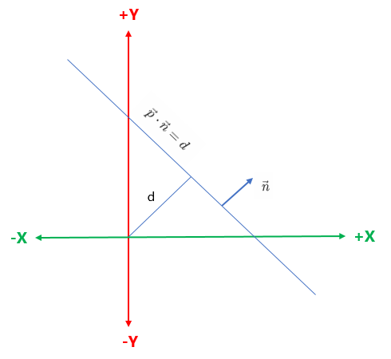

<center>图8-3 用垂直向量和到原点的距离定义直线</center>

　　这个只是公式8.4的一种特殊情况。$\vec n$ 是垂直于直线的单位向量，d给出了原点到直线的有符号距离。这个距离是在垂直于直线的方向（平行于 $\vec n$）上度量的。有符号距离的意思是如果直线和标准向量 $\vec n$ 代表的点在原点的同一侧，则 d 为正。当 d 增大时，直线沿方向 $\vec n$ 移动。

　　第五种表示方式为，用直线上的点来描述直线的位置而不是用原点到直线的距离。当然，直线上的任意点都可以。直线的方向仍然用垂直于直线的标准向量 $\vec n$ 表示。如下图8-4所示：


<center>图8-4 用垂直向量 $\vec n$ 和直线上的一点来定义直线</center>

　　第六种表示方式，也是最后一种表示方式为，将直线作为两个点 q 和 r 的垂直平分线，如下图8-5所示：


<center>图8-5 用线段的垂直平分线定义直线</center>

　　实际上，这也是直线最早的一种定义，到两个给定点距离相等的点的集合。

### 8.2.2 射线

　　对我们来说，射线有起点和终点的。这样，一条射线定义了一个位置，一个优先长度和一个方向（除非射线长度为零）。任何射线都定义了包含这个射线的一条直线和线段。射线在计算几何和图形学中占用非常重要的位置，这是我们讨论的重点。

　　描述射线最直观的方法是给出两个端点，起点$P_{org}$和终点$P_{end}$，如下图8-6所示：


<center>图8-6 射线定义</center>

　　这个就是射线的两点表示法。

　　2D和3D射线都能用参数形式表示。2D射线的参数形式使用两个函数，如公式8.7所示：
$$
\begin{aligned}
&x(t) = x_0 + t \Delta x
\\
&y(t) = y_0 + t \Delta y
\end{aligned}
\tag{8.7}
$$
　　3D射线是对2D的一种直接扩展，只需再加上第三个函数 z(t) 即可。参数 t 的取值范围为0到1.

　　向量记法能使射线的参数形式更加紧凑。在任意维度中表示射线都可以用这种形式，如公式8.8所示：
$$
\vec p(t) = \vec p_0 + t \vec d \tag{8.8}
$$
　　射线的$\vec p(0) = \vec p_0$。这样，$\vec p_0$指定了射线的位置信息，同时增量向量$\vec d$指定了它的长度和方向。射线的重点$\vec p(1) = \vec p_0 + \vec d$。如下图8-7所示：

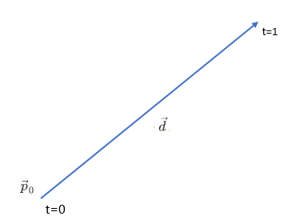

<center>图8-7 射线的参数形式</center>

　　在一些相交性检测中，我们可能使用公式8.8的一种变形，$\vec d$是单位向量，参数 t 从0变化到l，l是射线的长度。


## <center>8.3 圆和球</center>

　　球是一种3D物体，定义为到给定点的距离为给定长度的所有点的集合。球面上某点到球心的距离称作球的半径。球的直接表示形式能描述出球心 c 和半径 r 。如下图8-8所示：


<center>图8-8 球的定义</center>

　　球的简单性使它在计算几何和图形学中几乎无处不在。“包围球”经常用于相交性检测中，因为检测与一个球是否相交是非常简单的。而且由于旋转一个球时并不会改变它的形状，所以使用包围球时不必考虑物体的方向。

　　由求的定义可以直接导出它的隐式表示形式：到球心的距离为给定距离的点的集合。球心为 c，半径为 r 的球的隐式表示形式为：
$$
||\vec p - \vec c|| = r \tag{8.9}
$$
　　这里的 $\vec p$ 是球面上的任意一点。如果要让球内部的点 p 也满足这个式子，就必须将等号换成“$\leq$”。 公式10.9也是2D圆的隐式表示。将公式10.9在3D中展开，两边同时平方得到的球隐式表示，如下公式8.10所示：
$$
(x-c_x)^2+(y-c_y)^2+(z-c_z)^2=r^2 \tag{8.10}
$$
　　我们能计算圆和球的直径（经过圆心的直线与圆有两个交点，这两个交点间的距离称作直径）和周长（绕圆一周的长度即为周长），如下公式8.11所示：
$$
\begin{aligned}
&D=2r
\\
&C = 2\pi r
\end{aligned}
\tag{8.11}
$$
公式8.12为圆的面积公式，如下所示：
$$
S=\pi r^2 \tag{8.12}
$$
公式8.13为球的表面积S和体积V的计算方式，如下所示：
$$
\begin{aligned}
&S=4 \pi r^2
\\
&V = \frac{4}{3} \pi r^2
\end{aligned}
\tag{8.13}
$$
　　学过微积分的您会发现一个非常有趣的现象，圆面积的微分是圆周长；球体积的微分是球表面积。


## <center>8.4 平面</center>

　　前面介绍2D直线的时候提到过3D平面，2D直线扩展一下就变成3D平面了。在3D中，平面是到两个点的距离相等的点的集合。平面是完全是平的，没有厚度，且无限延伸。

　　既然提到2D直线扩展一下就变成3D平面，我们这里可以利用类似于定义直线的方式来定义平面。平面的隐式定义由所有满足平面方程的点 p=(x, y, z) 给出，平面方程的两种记法，如下公式8.14所示：
$$
\begin{aligned}
&ax+by+cz=d
\\
&\vec p \cdot \vec n = d
\end{aligned}
\tag{8.14}
$$
　　在第二种形式中，$\vec n=[a, b, c]$。一旦知道 $\vec n$，就能用任意已知的平面上的点来计算d。

　　向量 $\vec n$ 也称作平面的法向量，因为它垂直于平面。让我们来验证它。设 $\vec p$ 和 $\vec q$ 都在平面上，满足平面方程。将 $\vec p$，$\vec q$ 代入公式8.14，则有：
$$
\begin{aligned}
&\vec p \cdot \vec n = d \\
&\vec n \cdot \vec p = d \\
&\vec n \cdot \vec q = d \\
&\vec n \cdot \vec p = \vec n \cdot \vec q \\
&\vec n \cdot \vec p - \vec n \cdot \vec q = 0 \\
&\vec n \cdot (\vec p - \vec q) = 0
&\end{aligned}
$$
　　最后一行点乘的几何意义就是 $\vec n$ 垂直于从 $\vec q$ 到 $\vec p$ 的向量（参考前面的向量点乘的几何意义）。这对于平面上的任意 $\vec p$，$\vec q$ 点都是成立的。因此，$\vec n$ 垂直于平面上的任意向量。

　　我们还假设平面有“正面”和“反面”。一般来说，$\vecｎ$指向的方向是平面的正面（Front Side）。即，从 $\vec n$ 的头向尾看，我们看见的是正面。如下图8-9所示：


<center>图8-9 平面的正面和反面</center>

　　将 $\vec n$ 限制为单位长度并不会失去一般性，而且通常会给计算带来方便。

　　另外一种定义平面的方法是给出平面上不共线的三个点，也就是说，这三个点不在一条直线上。如果三个点在一条直线上，就存在无数多个平面包含这条直线，这样也就无法说明我们指的是哪个平面了。

　　让我们通过平面上的三个点 $\vec p_1$，$\vec p_2$ 和 $\vec p_3$ 来计算 $\vec n$ 和d。先计算 $\vec n$，$\vec n$指向什么方向呢？右手坐标系中的惯例是：当从平面的正面看时，$\vec p_1$，$\vec p_2$ 和 $\vec p_3$ 以逆时针方向列出。（左手坐标系中，经常假设这些点以顺时针方向列出，这样，不管使用哪种坐标系公式，结果都是相同的）。

　　下图8-10展示了使用平面上三个点计算平面的法线向量的情况。


<center>图8-10 三个点定义平面</center>

　　如上图8-10所示，我们按照逆时针方向构造两个向量，“e”代表“边用公式edge）”向量，因为这个公式经常用来计算三角形所代表的的平面。这两个向量的叉乘结果就是 $\vec n$，但可能不是单位向量。前面提到，我们总是要正则化 $\vec n$，以上所有过程下列公式8.15简洁地概括：
$$
\begin{aligned}
&\vec e_3 = \vec p_2 - \vec p_1
\\
&\vec e_2 = \vec p_3 - \vec p_2
\\
&\vec n = \frac{\vec e_3 \times \vec e_2}{||\vec e_3 \times \vec e_1||}
\end{aligned}
\tag{8.15}
$$
　　另外需要注意的是，如果这些点共线，则 $e_3$ 与 $e_1$ 平行。这样，叉乘的结果为0，不能正则化。这个数学上的特例与物理特例相吻合：共线点不能唯一地定义一个平面。

　　现在知道了 $\vec n$，剩下的就是求d。可以由某个点与 $\vec n$ 点相乘获得。

　　前面讨论了如何定义平面，现在我们讨论一下如何计算点到平面的距离。设想一个平面和一个不在平面上的点 $\vec q$ 。 平面上存在一个点 $\vec p$ ，它到 $\vec q$ 的距离最短。很明显，从 $\vec p$ 到 $\vec q$ 的向量垂直于平面，且形式为$a \vec n$ 。如下图8-11所示：


<center>图8-11 计算点到平面的距离</center>

　　假设 $\vec n$ 为单位向量，那么 $\vec p$ 到 $\vec q$ 的距离（也就是 $\vec q $ 到平面的距离）就是 a 了。如果 $\vec q$ 在平面的反面，这个距离为负。令人惊奇的是，不用知道 $\vec p$ 的位置就能计算出 a 。让我们来回顾 $\vec q$ 的原定义，并做一些向量计算以消掉 $\vec p$ ，如公式8.16所示：
$$
\begin{aligned}
&\vec p + a \vec n = \vec q
\\
&(\vec p + a \vec n) \cdot \vec n = \vec q \cdot \vec n
\\
&\vec p \cdot \vec n + (a \vec n) \cdot \vec n = \vec q \cdot \vec n
\\
&d + a  = \vec q \cdot \vec n
\\
&a = \vec q \cdot \vec n - d
\end{aligned}
\tag{8.16}
$$


## <center>8.5 三角形</center>

　　三角形在建模和图形学中有着极其重要的位置。复杂3D物体的表面，如汽车、人体和各种动物等，都是用三角形模拟的。像这样一组相连的三角形称作三角形网格。在学习怎样操作多个三角形之前，先要学会如何操作单个三角形。

### 8.5.1 基本性质

　　三角形是通过列出它的三个顶点来定义的。这些点的顺序是非常重要的，在右手坐标系中，当从三角形“正面”看时，经常以逆时针方向列出这些点。设这三个顶点为 $\vec v_1$ ， $\vec v_2$ ， $\vec v_3$ 。

　　三角形位于一个平面中，这个平面的方程（法向量 $\vec n$ 和到原点的距离 d）在很多应用中非常重要。关于平面的一些讨论我们前面已经讨论过，这里不再赘述。

　　让我们标出图10-12中的三角形内角、逆时针边向量和边长，如下图8-12所示：


<center>图8-12 三角形定义</center>

　　设 $l_i$ 为 $\vec e_i$ 的长度。注意 $\vec e_i$ 、$l_i$ 和 $\vec v_i$ 的对应关系，$\vec v_i$ 为相应下标的顶点，它们的关系如下：
$$
\begin{aligned}
&\vec e_1 = \vec v_3 - \vec v_2 \qquad l_1 = ||\vec e_1||
\\
&\vec e_2 = \vec v_1 - \vec v_3 \qquad l_2 = ||\vec e_2||
\\
&\vec e_3 = \vec v_2 - \vec v_1 \qquad l_3 = ||\vec e_3||
\end{aligned}
$$
　　使用这些记法写出正弦公式和余弦公式8.17和8.18：
$$
\begin{aligned}
\frac{\sin{\theta_1}}{l_1} = \frac{\sin{\theta_2}}{l_2} = \frac{\sin{\theta_3}}{l_3}
\end{aligned}
\tag{8.17}
$$

$$
\begin{aligned}
&l_1^2 = l_2^2 + l_3^2 - 2l_2l_3\cos{\theta_1}
\\
&l_2^2 = l_1^2 + l_3^2 - 2l_1l_3\cos{\theta_2}
\\
&l_3^2 = l_1^2 + l_2^2 - 2l_1l_2\cos{\theta_3}
\end{aligned}
\tag{8.18}
$$

　　这两个定理比较简单，证明过程就略去了，大家有兴趣的可以自己去参阅相关资料。

　　三角形的周长通常是一个重要的值，它的计算方法很简单，将三个边长相加即可，如下公式8.19所示：
$$
p = l_1 + l_2 + l_3 \tag{8.19}
$$

### 8.5.2 面积

　　三角形的面积计算方式有多种，下面我们来逐个讨论一下。

　　第一种是数学上最常用的也是最经典的方法，那就是用底和高计算面积。观察下图8-13中的平行四边形及其保卫的三角形：


<center>图8-13 平行四边形中的三角形</center>

　　由经典几何可知，平行四边形面积等于底和高的乘积。因为三角形恰好占了这个面积的一半，所以由底和高给出的三角形面积公式为如下公式8.20所示：
$$
A = bh/2 \tag{8.20}
$$
　　第二种方式，如果不知道高，可以使用海伦公式来计算面积，它只需要提供三边的长度即可。设 x 为周长的一般（也称作半周长），如下公式8.21所示：
$$
\begin{aligned}
&s = \frac{l_1+l_2+l_3}{2} = \frac{p}{2}
\\
&A = \sqrt{s(s-l_1)(s-l_2)(s-l_3)}
\end{aligned}
\tag{8.21}
$$
　　海伦公式非常有用，因为它在3D中使用非常方便。

　　有时候，高和周长都没有直接提供，所知道的只有顶点的笛卡尔坐标。当然，总是可以从坐标中算出变长，但是某些情况下，我们想要避免这种代价相对较高的计算。让我们看看能否从顶点坐标直接计算面积。

　　先在2D中解决这个问题。基本思想是，对三角形三边中的每一边，计算上由该边，下由 x 轴所围成的梯形的有符号面积，如下图8-14所示：


<center>图8-14 向量“围”的面积</center>

　　“有符号面积”是指：如果边的端点是从左向右的，则面积为正；如果边的端点是从右向左的，则面积为负。不管三角形的方向如何变化，都存在至少一个正边和一个负边。一个竖直边的面积为0。各边下面的区域的面积分别为：
$$
\begin{aligned}
&A(e_1) = \frac{(y_3+y_2)(x_3-x_2)}{2}
\\
&A(e_2) = \frac{(y_1+y_3)(x_1-x_3)}{2}
\\
&A(e_3) = \frac{(y_2+y_1)(x_2-x_1)}{2}
\end{aligned}
$$
　　即使一部分（或整个）三角形扩展到了 x 轴下边，上面的公式依然成立。

　　这三个梯形的有符号面积相加，就得到了三角形本身的面积。事实上，能用同样的思想计算任意多边形的面积。

　　这里，假设顶点是按照逆时针列出来的，如果顶点以相反的顺序列出来，面积的符号将变负。将这三个梯形的面积相加，计算三角形的有符号面积：
$$
\begin{aligned}
A &= A(e_1) + A(e_2) + A(e_3)
\\
& = \frac{(y_3 + y_2)(x_3 - x_2) + (y_1 + y_3)(x_1 - x_3) + (y_2 + y_2)(x_2 - x_1)}{2}
\\
& = \frac{(y_3x_3 - y_3x_2 + y_2x_3 - y_2x_2) + (y_1x_1 - y_1x_3 + y_3x_1 - y_3x_3) + (y_2x_2 - y_2x_1 + y_1x_2 - y_1x_1)}{2}
\\
& = \frac{-y_3x_2 + y_2x_3 - y_1x_3 + y_3x_1 - y_2x_1 + y_1x_2}{2}
\\
& = \frac{y_1(x_2 - x_3) + y_2(x_3 - x_1) + y_3(x_1 - x_2)}{2}
\end{aligned}
$$
　　实际上，还能进一步简化。基本思想是：平移三角形不会改变三角形的面积。因此，我们可以在竖直方向上平移三角形，从每个 y 坐标中减去 $y_3$，如公式8.22所示：
$$
\begin{aligned}
A &= \frac{y_1(x_2 - x_3) + y_2(x_3 - x_1) + y_3(x_1 - x_2)}{2}
\\
& = \frac{(y_1 - y_3)(x_2 - x_3) + (y_2 - y_3)(x_3 - x_1) + (y_3 - y_3)(x_1 - x_2)}{2}
\\
& = \frac{(y_1 - y_3)(x_2 - x_3) + (y_2 - y_3)(x_3 - x_1)}{2}
\end{aligned}
\tag{8.22}
$$
　　公式8.22就是2D中通过顶点坐标计算三角形面积的公式。在3D中，可以通过叉乘来计算三角形的面积。前面讨论向量的时候讨论过，两向量 $\vec a$ $\vec b$ 叉乘的大小等于以 $\vec a$，$\vec b$ 为两边的平行四边形的面积。因为三角形面积等于包围它的平行四边形的一半，所以我们有了一种简便方法。给出三角形的两个边向量，$\vec e_1$ 和 $\vec e_2$，则三角形面积为：
$$
\begin{aligned}
A = \frac{||\vec e_1 \times \vec e_2||}{2}
\end{aligned}
\tag{8.23}
$$

### 8.5.3 重心坐标空间

　　虽然我们经常在3D中使用三角形，但三角形的表面是一个平面，它天生是一个2D物体。在3D中任意朝向的三角形表面上移动是一件令人烦恼的事。最好是有一个坐标空间与三角形表面相关联且独立于三角形所在的3D坐标空间。重心坐标空间正是这样的坐标空间。

　　三角形所在平面的任意点都能表示为顶点的加权平均值。这个权就称作重心坐标，从重心坐标$(b_1, b_2, b_3)$ 到标准3D坐标的转换为：
$$
(b_1, b_2, b_3) \iff b_1\vec v_1 + b_2\vec v_2 + b_3 \vec v_3 \tag{10.24}
$$
　　重心坐标的和总是1：
$$
b_1 + b_2 + b_3 = 1
$$
　　其中 $b_1$，$b_2$ 和 $b_3$ 的值是每个顶点对该顶点的“贡献”或“权”。如下图8-15展示了一些点和它们的重心坐标：

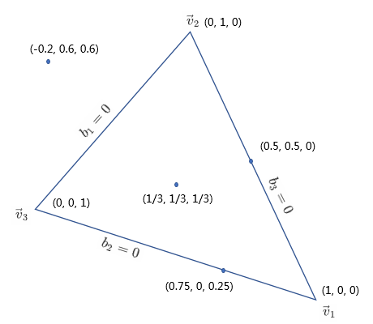

<center>图8-15 重心坐标示例</center>

　　这里应该注意以下几点：

- 第一，三角形三个顶点的重心坐标都是单位向量：

$$
  \begin{aligned}
  &(1, 0, 0) \iff \vec v_1
  \\
  &(0, 1, 0) \iff \vec v_2
  \\
  &(0, 0, 1) \iff \vec v_3
  \end{aligned}
$$

- 第二，在某顶点的相对边上的所有点的对应重心坐标分量为0。例如：对于所有与 $\vec v_1$ 相对边上的点，$b_1=0$。

- 第三，不只是三角形内的点，该平面上的所有点都能用重心坐标描述。三角形内的点的重心坐标在范围0到1之间变化。三角形外的点至少有一个坐标为负。重心坐标用和原三角形大小相同的块向四周延伸铺满整个平面。如下图8-16所示：


<center>图8-16 重心坐标铺满整个平面</center>

　　重心坐标空间的本质不同于笛卡尔坐标空间。这是因为重心坐标空间系是2D的，但却使用了三个坐标。又因为坐标的和等于1，所以重心坐标空间仅有两个自由度，有一个分量是冗余的。从另一方面说，重心坐标空间中仅用两个数就能完全描述一个点，用这两个数就可以计算出第三个。

　　要将一个点从重心坐标空间转换到普通3D坐标空间，只需要应用公式8.24来计算顶点加权平均值就可以了。而计算2D或3D中任意一点的重心坐标就稍微困难一些。让我们看看怎样在2D中做到这一点。如下图8-17所示，它标出了三个顶点 $\vec v_1$， $\vec v_2$，$\vec v_3$ 和点 $\vec p$。我们还标出了三个“子三角形” $T_1$ ，$T_2$ ， $T_3$，它们和同样下标的顶点相对。稍后会用到它们。


<center>图8-17 求任意点 $\vec p$的重心坐标</center>

　　现在，我们知道的是三个顶点和点 $\vec p$ 的笛卡尔坐标，而任务就是要计算重心坐标$b_1$，$b_2$和$b_3$。根据这些已知条件可以列出三个等式和三个未知数（ $\vec x$ ， $\vec y$ 为顶点）。
$$
\begin{aligned}
&p_x = b_1x_1 + b_2x_2 + b_3x_3
\\
&p_y = b_1y_1 + b_2y_2 + b_3y_3
\\
&b_1 + b_2 + b_3 = 1
\end{aligned}
$$
　　解方程组得公式10.25：
$$
\begin{aligned}
&b_1 = \frac{(p_y - y_3)(x_2 - x_3) + (y_2 - y_3)(x_3 - p_x)}{(y_1 - y_3)(x_2 - x_3) + (y_2 - y_3)(x_3 - x_1)}
\\
&b_2 = \frac{(p_y - y_1)(x_3 - x_1) + (y_3 - y_1)(x_1 - p_x)}{(y_1 - y_3)(x_2 - x_3) + (y_2 - y_3)(x_3 - x_1)}
\\
&b_3 = \frac{(p_y - y_2)(x_1 - x_2) + (y_1 - y_2)(x_2 - p_x)}{(y_1 - y_3)(x_2 - x_3) + (y_2 - y_3)(x_3 - x_1)}
\end{aligned}
\tag{8.25}
$$
　　仔细观察公式8.25，发现每个表达式中的分母相同，并且都等于三角形面积的两倍（根据公式10.22）。还有，对每个重心坐标 $b_1$，其分子等于“子三角形” $T_i$ 面积的两倍。也就是说：
$$
\begin{aligned}
&b_1 = \frac{A(T_1)}{A(T)}
\\
&b_2 = \frac{A(T_2)}{A(T)}
\\
&b_3 = \frac{A(T_3)}{A(T)}
\end{aligned}
\tag{8.26}
$$
　　即使 $\vec p$ 在三角形外，这个解释也是成立的，这是因为如果顶点以顺时针方向列出，计算面积的公式将得到一个负值。如果三角形的三个顶点共线，分母上的“子三角形”的面积为零，重心坐标也就没有意义了。

　　计算3D中任意点的重心坐标比在2D中复杂。不能再像以前那样解一个方程组就能得出结果了。因为有三个未知数和四个方程。另一个导致复杂性的地方是 $\vec p$ 可能不在三角形所在的平面中，这时重心坐标没有意义了。但现在我们假设 $\vec p$ 在三角形所在的平面上。

　　一种技巧是通过抛弃 x，y，z 中的一个分量，将3D问题转化到2D中，这和将三角形投影到三个基本平面中的某一个上面的原理相同。理论上，这时能解决问题的，因为投影面积和原面积成比例。

　　那么应该抛弃哪个坐标呢？不能总是抛弃某一个，因为如果三角形垂直于某个平面，投影点将共线。如果三角形接近垂直于投影平面，会遇到浮点数精度问题。一种解决方法是挑选投影平面，使得投影面积最大。这可以通过检查平面的法向量做到，我们要抛弃的就是绝对值最大的坐标。例如：法向量为 $[-1, 0, 0]$ 。我们将抛弃顶点和 $\vec p$的 x 分量，把三角形投影到 yz 平面。

　　另一种计算3D重心坐标的方法基于在前面讨论过的用向量叉乘计算3D三角形面积的方法。给出三角形的两个边向量 $e_1$ 和 $e_2$ ，三角形面积为 $\frac{||e_1 \times e_2||}{2}$ 。一旦有了整个三角形的面积和三个“子三角形”的面积，就能计算重心坐标了。

　　看看能否找到解决问题的思路。当顶点以“不正确”的顺序列出时，向量叉乘的大小可能会是负值，我们需要一种正确计算的方法。幸运的是，有一种非常简单的方法能做到这一点——点乘。

　　设 $\vec c$ 为三角形两个边向量的叉乘，$\vec c$ 的大小等于三角形面积的两倍。设有一个单位法向量 $\vec n$，$\vec n$ 和 $\vec c$ 是平行的，因为他们都垂直于三角形所在的平面。当然，它们的方向可能是相反的。回顾前面讨论过的，两向量的点乘等于它们大小的积再乘以它们夹角的 cos 值。因为 $\vec n$ 是单位向量，不管 $\vec n$ 和 $\vec c$ 方向相同还是相反，都有：
$$
\begin{aligned}
\vec c \cdot \vec n &= ||\vec c|| ||\vec n|| \cos \theta
\\
&= ||\vec c|| (1)(\pm1)
\\
&= \pm||\vec c||
\end{aligned}
$$
　　将这个面积除以2，就得到了3D中三角形的“有符号”面积。有了这个技巧，就能利用前面的结论：$b_i$ 就是“子三角形” $T_i$ 的面积占整个三角形面积的比。如下图8-18所示：


<center>图8-18 在3D中计算重心坐标</center>

　　正如您所看到的，每个顶点都有一个向量 $\vec d_i$，它从 $\vec v_i$ 指向 $\vec p$ ，列出这些向量满足的方程：
$$
\begin{aligned}
&\vec e_1 = \vec v_3 - \vec v_2
\\
&\vec e_2 = \vec v_1 - \vec v_3
\\
&\vec e_3 = \vec v_2 - \vec v_1
\\
&\vec d_1 = \vec p - \vec v_1
\\
&\vec d_2 = \vec p - \vec v_2
\\
&\vec d_3 = \vec p - \vec v_3
\end{aligned}
$$
　　还需要一个单位法向量，如下计算：
$$
\begin{aligned}
\vec n = \frac{\vec e_1 \times \vec e_2}{||\vec e_1 \times \vec e_2||}
\end{aligned}
$$
　　现在整个三角形的面积（记作 T）和三个子三角形的面积分别为：
$$
\begin{aligned}
&A(T) = \frac{(\vec e_1 \times \vec e_2) \cdot \vec n}{2}
\\
&A(T_1) = \frac{(\vec e_1 \times \vec d_3) \cdot \vec n}{2}
\\
&A(T_2) = \frac{(\vec e_2 \times \vec d_1) \cdot \vec n}{2}
\\
&A(T_3) = \frac{(\vec e_3 \times \vec d_2) \cdot \vec n}{2}
\end{aligned}
$$
　　每个重心坐标 $b_i$ 都由 $\frac{A(T_i)}{A(T)}$ 给出，如下公式8.27所示：
$$
\begin{aligned}
&b_1 = \frac{A(T_1)}{A(T)} = \frac{(\vec e_1 \times \vec d_3) \cdot \vec n}{(\vec e_1 \times \vec e_2) \cdot \vec n}
\\
&b_2 = \frac{A(T_2)}{A(T)} = \frac{(\vec e_2 \times \vec d_1) \cdot \vec n}{(\vec e_1 \times \vec e_2) \cdot \vec n}
\\
&b_3 = \frac{A(T_3)}{A(T)} = \frac{(\vec e_3 \times \vec d_2) \cdot \vec n}{(\vec e_1 \times \vec e_2) \cdot \vec n}
\end{aligned}
\tag{8.27}
$$

　　注意到所有的分子和分母中都有 $\vec n$ ，因此，实际上并不必正则化 $\vec n$ 。此时，分母为 $\vec n \cdot \vec n$ 。

　　这种计算重心坐标的方法比向2D投影的方法用到了更多的标量数学运算。但是它没有分支，并为向量处理器提供了更多的优化机会。因此，它在有向量处理器的超标量体系结构中会更快一些。

　　根据公式8.27可得，已知空间中共面的三点 $v_1, v_2, v_3$ ，求三角形三角形平面上任意一点坐标 $\vec{p} (x, y, z)$ ，可以由以下公式得：
$$
\begin{aligned}
&x = \frac{b_1x_1 + b_2x_2 + b_3x_3}{b_1 + b_2 + b_3} \\
&y = \frac{b_1y_1 + b_2y_2 + b_3y_3}{b_1 + b_2 + b_3} \\
&z = \frac{b_1z_1 + b_2z_2 + b_3z_3}{b_1 + b_2 + b_3}
\end{aligned}
\tag {8.28}
$$
　　把公式8.27代入8.28可得：
$$
\begin{aligned}
\vec{p} = \frac{A(T_1) \vec v_1 + A(T_2) \vec v_2 + A(T_3) \vec v_3}{A(T)}
\end{aligned}
\tag{8.29}
$$

　　以上说了这么多，看起来都很枯燥的理论，实际用途是什么呢？在光线追踪中，一个重要的步骤就是从屏幕上投射出一道光线，并求解其与3D物体的焦点并执行反射或者折射等过程，然后继续反射或者折射。这里关键问题是如何求出这道光线与3D物体（空间三角形）的焦点？因为只有求出焦点之后才方便求出其贴图坐标以及该点的法线，很好的一个方法就是用中心坐标系来表示该焦点坐标。

### 8.5.4 特殊点

　　下面我们讨论几个特殊几何意义的点：

- 重心
- 内心
- 外心

#### 8.5.4.2 重心

　　**重心**是三角形的最佳平衡点，它是三角形三条中线的交点（**中线**指从顶点到对边中点的连线）。如下图8-20所示展示一个三角形的重心：


<center>图8-20 三角形的重心</center>

　　由于重心分中线长之比为2:1，则有 $A(T_1) = A(T_2) = A(T_3) = \frac{1}{3} A(T)$，根据公式8.29可得：
$$
\begin{aligned}
&x = \frac{x_1+x_2+x_3}{3} \\
&y = \frac{y_1+y_2+y_3}{3} \\
&z = \frac{z_1+z_2+z_3}{3}
\end{aligned}
$$
　　重心 $\vec c_{grav}​$坐标的向量表达式为：
$$
\begin{aligned}
\vec c_{grav} = \frac{\vec v_1 + \vec v_2 + \vec v_3}{3}
\end{aligned}
\tag{8.30}
$$
　　重心坐标为：
$$
(\frac{1}{3}, \frac{1}{3}, \frac{1}{3})
$$
　　重心也被称为质心。

#### 8.5.4.3 内心

　　**内心**是指到三角形各边距离相等的点。之所以称作内心是因为它是三角形内切圆的圆心。内心是角平分线的交点，如下图8-21所示：


<center>图8-21 三角形的内心</center>

　　由于 $A(T_1) = \frac{1}{2}l_1r$ ，$A(T_2) = \frac{1}{2}l_2r$ ， $A(T_3) = \frac{1}{2}l_2r$ ， 则有 $A(T) = \frac{1}{2}(l_1+l_2+l_3)r$ ，设 $p = l_1 + l_2 + l_3$ 是三角形的周长，代入公式8.29，有：
$$
\begin{aligned}
&x = \frac{l_1x_1 + l_2x_2 + l_3x_3}{p} \\
&y = \frac{l_1y_1 + l_2y_2 + l_3y_3}{p} \\
&z = \frac{l_1z_1 + l_2z_2 + l_3z_3}{p} \\
\end{aligned}
$$
　　内心 $\vec c_{In}$ 坐标的向量表达式为：
$$
\vec c_{In} = \frac{l_1 \vec v_1 + l_2 \vec v_2 + l_3 \vec v_3}{p}
\tag{8.31}
$$
　　因此，内心的重心坐标为：
$$
(\frac{l_1}{p}, \frac{l_2}{p}, \frac{l_3}{p})
$$
　　内切圆的半径可由三角形面积除以周长求得：
$$
r_{in} = \frac{2A}{p} \tag{10.32}
$$
　　内切圆解决了寻找与三条直线相切的圆的问题。

#### 8.5.4.4 外心

　　**外心**是三角形中到各顶点距离相等的点，它是三角形外接圆的圆心。外心是各边垂直平分线的交点。如下图8-22展示了一个三角形的外心：


<center>图8-22 三角形的外心</center>

　　外心坐标的计算相对比重心和内心的计算都要复杂得多了。下面简单推导一下。

　　在推导之前，先介绍一个定理——圆周角定理

> 圆周角定理，顶点在圆上，并且两边都与圆相交的角叫做圆周角。 且同弧或等弧所对圆周角等于它所对圆心角的一半。

　　设外接圆半径为 R，$\vec v_1$ 所在的角为 $\angle A$ ，$\vec v_2$ 所在的角为 $\angle B$ ， $\vec v_3$ 所在的角为 $\angle C$ ，$l_1$ ， $l_2$ ， $l_3$ 分别为$v_1$， $v_2$ ， $v_3$ 对边的长度。

　　根据圆周角定理，有 $A(T_1) = \frac{1}{2}R\sin{2A}$， $A(T_2) = \frac{1}{2}R\sin{2B}$ ， $A(T_3) = \frac{1}{2}R\sin{2C}$ ，$A(T) = \frac{1}{2}R(\sin{2A}+\sin{2B}+\sin{2C})$ ，根据公式8.29可得：
$$
\begin{aligned}
b_1 = \frac{A(T_1)}{A(T)} = \frac{\sin{2A}}{\sin{2A}+\sin{2B}+\sin{2C}} 
\end{aligned}
\tag{8.33}
$$
　　同理可得：
$$
\begin{aligned}
&b_2 = \frac{A(T_2)}{A(T)} = \frac{\sin{2B}}{\sin{2A}+\sin{2B}+\sin{2C}} \\
&b_3 = \frac{A(T_3)}{A(T)} = \frac{\sin{2B}}{\sin{2A}+\sin{2B}+\sin{2C}}
\end{aligned}
\tag{8.34}
$$
　　根据倍角公式、正弦定理和余弦定理，进一步推导可得：
$$
\begin{aligned}
\frac{b_1}{b_2} 
&= \frac{2\sin{A}\cos{A}}{2\sin{B}\cos{B}} \\
&= \frac{l_1}{l_2} \cdot \frac{(l_2^2 + l_3^2 - l_1^2) \cdot l_1 l_3}{(l_1^2 + l_3^2 - l_2^2) \cdot l_2 l_3} \\
&= \frac{l_1^2 (l_2^2 + l_3^2 - l_1^2)}{l_2^2 (l_1^2 + l_3^2 - l_2^2)}
\end{aligned}
\tag{8.35}
$$
　　从等式8.35可得：
$$
\begin{aligned}
&b_1 = \frac{l_1^2 (l_2^2 + l_3^2 - l_1^2)}{l_1^2 (l_2^2 + l_3^2 - l_1^2) + l_2^2 (l_3^2 + l_1^2 - l_2^2) + l_3^2 (l_1^2 + l_2^2 - l_3^2)} \\
&b_2 = \frac{l_2^2 (l_3^2 + l_1^2 - l_2^2)}{l_1^2 (l_2^2 + l_3^2 - l_1^2) + l_2^2 (l_3^2 + l_1^2 - l_2^2) + l_3^2 (l_1^2 + l_2^2 - l_3^2)} \\
&b_3 = \frac{l_3^2 (l_1^2 + l_2^2 - l_3^2)}{l_1^2 (l_2^2 + l_3^2 - l_1^2) + l_2^2 (l_3^2 + l_1^2 - l_2^2) + l_3^2 (l_1^2 + l_2^2 - l_3^2)}
\end{aligned}
\tag{8.36}
$$
　　我们可以进一步优化公式10.35：
$$
\begin{aligned}
\frac{b_1}{b_2} 
&= \frac{l_1 \cdot l_1 \cdot (l_2^2 + l_3^2 - l_1^2) / 2}{l_2 \cdot l_2 \cdot (l_3^2 + l_1^2 - l_2^2) / 2} \\
&= \frac{l_1 \cdot l_1 \cdot l_2l_3 \cos{A}}{l_2 \cdot l_2 \cdot l_1l_3 \cos{B}} 
\end{aligned}
$$
　　由 $l_1=l_2 \cos{C} + l_3 \cos{B}$ 进一步化简得：
$$
\begin{aligned}
b_1 
&= l_1 \cdot l_1 \cdot l_2l_3 \cos{A} \\
&= l_1 \cdot (l_2 \cos{C} + l_3 \cos{B}) \cdot l_2l_3 \cos{A} \\
&= l_2l_3 \cos{A} \cdot (l_1l_2 \cos{C} + l_1l_3 \cos{B})
\end{aligned}
\tag{8.37}
$$
　　同理可得：
$$
\begin{aligned}
&b_2 = l_1l_3 \cos{B} \cdot (l_2l_3 \cos{A} + l_1l_2 \cos{C}) \\
&b_3 = l_1l_2 \cos{C} \cdot (l_2l_3 \cos{A} + l_1l_3 \cos{B})
\end{aligned}
\tag{8.38}
$$
　　设：
$$
\begin{aligned}
&d_1 = l_2l_3 \cos{A} \\ 
&d_2 = l_1l_3\cos{B} \\ 
&d_3 = l_1l_2 \cos{C} \\
&\vec e_1 = (\vec v_3 - \vec v_2) \\
&\vec e_2 = (\vec v_1 - \vec v_3) \\
&\vec e_3 = (\vec v_2 - \vec v_1)
\end{aligned}
$$
　　则得：
$$
\begin{aligned}
&b_1 = d_1 (d_3 + d_2) = d_3d_1 + d_1d_2 \\
&b_2 = d_2 (d_1 + d_3) = d_1d_2 + d_2d_3 \\
&b_3 = d_3 (d_1 + d_2) = d_2d_3 + d_3d_1
\end{aligned}
\tag{8.39}
$$
　　进一步化简，设：
$$
\begin{aligned}
&c_1 = d_2d_3 \\
&c_2 = d_3d_1 \\
&c_3 = d_1d_2 \\
&c = c_1 + c_2 + c_3
\end{aligned}
$$
　　可得：
$$
\begin{aligned}
&b_1 = c_2 + c_3 \\
&b_2 = c_3 + c_1 \\
&b_3 = c_1 + c_2 \\
&b_1 + b_2 + b_3 = c_2 + c_3 + c_3 + c_1 + c_1 + c_2 = 2 (c_1 + c_2 + c_3) = 2c
\end{aligned}
$$


<center>图8-23 三角形外心推导</center>

　　综上，我们可以通过定义以下临时变量：
$$
\begin{aligned}
&d_1 = -\vec e_2 \cdot \vec e_3
\\
&d_2 = -\vec e_3 \cdot \vec e_1
\\
&d_3 = -\vec e_1 \cdot \vec e_2
\\
&c_1 = d_2d_3
\\
&c_2 = d_3d_1
\\
&c_3 = d_1d_2
\\
&c = c_1 + c_2 + c_3
\end{aligned}
$$
　　结合这些临时变量，可以得到外心的重心坐标为：
$$
(\frac{c_2 + c_3}{2c}, \frac{c_3 + c_1}{2c}, \frac{c_1 + c_2}{2c})
$$
　　笛卡尔坐标系的外心坐标为：
$$
\vec c_{circ} = \frac{(c_2 + c_3)\vec v_1 + (c_3 + c_1) \vec v_2 + (c_1 + c_2) \vec v_3}{2c} \tag{8.40}
$$
　　外接圆半径为：
$$
r_{circ} = \frac{\sqrt{(d_1 + d_2)(d_２ + d_3)(d_3 + d_1)/c}}{2} \tag{8.41}
$$
　　外心和外接圆半径解决了寻找过三个点的圆的问题。


## <center>8.6 包围体</center>

　　我们世界上的物体形态各异，千变万化。在3D世界中，我们要判断两个物体是否有相交区域，如果我们直接用物体中的每个顶点或者每个面去逐个做两两检测，那么无疑性能开销非常大，在实时渲染的游戏中是无法使用的。那么我们是否可以通过别的方法高效的完成这种检测呢？答案是有的，而且不仅仅是哟中方法。这就是我们接下来要讨论的包围体。在2D和3D世界中，我们都用包围体来近似代替物体的形状、方向和大小。包围体有许多种，最简单的是三种：包围球（Sphere Bound）、轴对齐包围盒（Axially Aligned Bounding Box）和有向包围球（Oriented Bounding Box）。当然有些高级引擎还有更多种选择，例如：胶囊体、圆柱体、圆锥体、k-DOP、凸包等等一些更加复杂的包围体，我们这里仅仅讨论三种简单的包围体，其他就交给专业物理引擎去处理，毕竟我们不是专业物理引擎。下图8-24是几种包围体的示意图：


<center>图8-24 多种包围体的示意</center>

### 8.6.1 包围球 （Sphere）

　　在2D中，一种常见的表示物体边界的几何图元是包围圆。相对应的，在3D世界中，这种表示物体边界的几何图元就是包围球。包围圆和包围球就是用一个圆或者球体代替物体轮廓来界定整个物体。为什么用包围球呢？因为球体缩放和旋转变换不会改变它的形状，相对来说计算量大大减低。在前面我们就已经讨论过了圆和球，这里就不详细讨论了。需要注意的是球心的选取的问题。球心选取合适，那么半径可以比较小，同时这个球能够较好的包裹着物体，在代替物体轮廓上可以相对精确一些。但是无论怎样，球体在许多情况下都表示得很粗略，会浪费许多空间。如下图8-25所展示的3D物体和它们的包围球：


<center>图8-25 3D物体和它们的包围球</center>

#### 8.6.1.1 包围球的表示

　　包围球是包围体中最简单的包围体。一般，我们都用以下结构来表示：

```c++
struct Sphere
{
    Vector3 center;
    Real    radius;
};
```

　　这样有了球心点和半径后，我们就能确定一个包围球了。

#### 8.6.1.2 包围球的构建

　　在3D世界中，模型一般都是用一系列的顶点来描述，所以，我们就利用这些模型顶点来构建一个能包裹整个模型的包围球。要求一个包围球，按照上面的表示法，我们就要求出球心和半径，这样子才能唯一确定一个包围球。那怎么求球心和半径呢？构建算法有许多，这里我们介绍四种常见算法。首先我们把所有顶点构成一个顶点集合 $S = \{\vec v_0,  \vec v_1, \vec v_2, \ldots, \vec v_{n-1}\}$，现在问题就变成求解这个点集的包围球心 $\vec c$ 和半径 r 了。

　　第一种是**均值法**。这个算法非常简单粗暴，原理就是直接把所有顶点集合中的顶点相加，然后除以顶点数，来近似作为球心 $\vec c$。然后把遍历顶点集合 S 中每个顶点，计算每个顶点与球心的距离，选取最长的距离作为包围球的半径 r 。这样子，我们就有了球心 $\vec c$ 和半径 r 。因为这个方法是直接取所有顶点的位置均值来作为球心，所以就称为均值法。
$$
\begin{aligned}
& \vec c = \frac{1}{n} \sum_{i=0}^{n-1} \vec{v_i}
\\
& r = \max(|\vec v_0 - \vec c|, |\vec v_1 - \vec c|, \ldots, |\vec v_{n-1} - \vec c|)
\end{aligned}
$$
<center>图8-26 包围球均值法效果</center>

　　但是这种方法很粗糙，表示出来的包围球有许多体积都是空白浪费掉的，所以我们引入后面的几种算法来改进。

　　第二种是**借助AABB的快速的恒时单通路算法**。在这里，我们借助AABB来构建。我们用这个已经构造好的AABB中心和对角线来形成球体。当然，这种方法有时候不一定能满足需求，这里可以进一步优化。具体就是，从AABB的中心出发，将它作为包围球的中心 $\vec c$，然后再次遍历顶点集合 S 中所有顶点，找出距离球心最远的顶点，把这个最远距离作为包围球的新半径 r。这里为了避免平方根计算损耗，我们直接比较他们的平方值。

<center>图8-27 包围球利用AABB构建法效果</center>

　　这种算法比起上面均值法虽然更加精确了，但是要借助AABB，所以要先计算出AABB来，这个也是一个额外的计算，所以我们接下来再看看更优的算法来进一步提高精度和性能。

　　第三种叫**Ritter算法**，是Ritter Jack在1990年提出来的一种近似计算包围球的改进算法。主要思路是：分别找到这个模型在x，y，z正负六个方向上的最远距离的六个点，然后分别计算出这三对点之间的长度，也就是x轴向上两个点之间的长度，y轴向上两个点之间的长度，z轴向上两个点之间的长度。我们选取长度最长的那一个作为包围球的半径 r，以这个长度的两个点的中点作为包围球的球心 $\vec c$ 。接着遍历顶点集合 S 中的每一个顶点 $\vec v_i$，检查顶点 $\vec v_i$ 到球心之间的距离 d。如果 $d \gt r$，说明点 $\vec v_i$ 在球外，我们需要修正它，将半径更新为 $r' = \frac{d + r}{2}$ ，接着把球心向该点移动 $l = \frac{d-r}{2}$ ，即新球心为 $\vec c' = \vec c + (\vec v_i - \vec c) \cdot l$；如果 $d \lt r$，说明点 $\vec v_i$ 在球内。一直重复这个过程，直到点集 S 中所有的顶点都包含在球内。


<center>图8-28 包围球的Ritter算法</center>

<center>图8-29 包围球Ritter算法效果</center>

　　然而，这种算法看起来包围球把物体也包裹得不错了，那有没有更好的包裹着物体并且这个包围球最小呢？答案是有的，下面介绍最后一种算法。

　　最后一种就是Welzl在1991年提出的**最小圆覆盖法**，我们在这里扩展成**最小包围球**。下面我们讨论下具体的算法思路。

　　首先，我们需要明白一个球体可以由四个点位于边界上的顶点来定义。如果我们给出的顶点数少于四个，则有无数解。如果多于四个点，其中只有一点是最小的点。这就意味着一个球体最多只能被四个点定义，所以我们只需要找到我们想要包围的物体的那些顶点。这将是我们的出发点，我们需要为0到4个点提供最小球体计算，其余的情况是不断递归的使用这0到4个点的算法来计算获得包围球。

　　现有两个顶点集合，一个是被用来计算包围球的顶点集合 S，另外一个是包围球边界上的顶点集合 S'。这两个集合没有交集（即 $S \bigcap S' = \emptyset$ ）。初始时，包围球顶点集合 S' 是空的（即 $S' = \emptyset$ ）。

1. 打乱点集 S 的顶点顺序，使其随机排列；
2. 首先处理几个特殊的情况。如果点集 S 是空的或者点集 S' 是可以构成在包围球边界上的最大数量顶点数，我们需要用点集 S' 来构造最小包围球，分4中情况：
   - 如果点集 S' 为空，则直接构造一个空的包围球 $MS_0$ ，然后返回继续步骤3；
   - 如果点集 S' 中只有一个顶点 $\vec v_0$ ，则直接把 $\vec v_0$ 作为包围球的初始球心位置 $\vec c$，然后半径初始化 r = 0，构造出包围球 $MS_1$ ，然后返回继续步骤3；
   - 如果点集 S' 中只有两个顶点 $\vec v_0$ 和 $\vec v_1$，则以两点中心点作为球心位置 $\vec c = \frac{\vec v_0 + \vec v_1}{2}$ ，两点距离的一半作为半径 $r = |\frac{\vec v_0 + \vec v_1}{2}|$ ，构造出包围球 $MS_2$ ，然后返回继续步骤3；
   - 如果点集 S' 中只有三个顶点 $\vec v_0$ 、 $\vec v_1$ 和 $\vec v_2$ ，则用这三个顶点构造一个包围球，通过公式10.40计算出包围球球心的位置 $\vec c$， 通过公式10.41计算出包围球半径 r，构造出包围球 $MS_3$ ，然后返回继续步骤3；
   - 如果点集 S' 中只有四个顶点 $\vec v_0$， $\vec v_1$ ， $\vec v_2$ 和 $\vec v_3$ ，按照后面讨论的四面体公式10.42和公式10.43造一个最小包围球 Sphere，按照前面所述的四点就能够构造一个包围球 $MS_4$ ，然后返回继续步骤3；
3. 用点集 S 前 n-1 个顶点构造出一个最小包围球 $MS_{n-1}$ ，这里怎么构造？就是直接递归执行步骤2和步骤3，直到构造出一个最小包围球为止。然后取出最后一个顶点 $v_{n-1}$ ，判断其是否在最小包围球 $MS_{n-1}$ 内：
   - 如果顶点 $\vec v_{n-1}$ 在包围球 $MS_{n-1}$ 内，则结束计算，当前最小包围球 $MS_{n-1}$ 则是最终所求的最小包围球 MS，返回 $MS_{n-1}$ 并退出递归；
   - 如果顶点 $\vec v_{n-1}$ 在包围球 $MS_{n-1}$ 外，则我们把顶点 $\vec v_{n-1}$ 放入点集 S' 里，继续递归执行步骤2和步骤3；

　　这就是Welzl算法的基本思想。这段枯燥的文字描述还是令人难以理解。下面我们来一段伪代码，使大家更加容易明白这其中的过程：
```c++
Sphere createSphere(Point S[], int s)
{
    switch (b)
    {
    case 0:
        // 一个顶点都不存在的时候，使用默认构造函数构造一个默认的球体
        return Sphere();
    case 1:
        // 一个顶点构造一个球体
        return Sphere(S[0]);
    case 2:
        // 两个顶点，通过顶点的位置之和的均值获得球心位置，通过两点距离一半获得球半径
        return Sphere(S[0], S[1]);
    case 3:
        // 三个不共线顶点，实际上就是求空间三角形外接圆
        return Sphere(S[0], S[1], S[2]);
    case 4:
        // 四个不共面顶点，实际上就是求空间四面体外接球
        return Sphere(S[0], S[1], S[2], S[3]);
    }
}

Sphere minSphere(Point P[], int n, Point S[], int s)
{
    if (n == 0 || s == 4)
    {
        // 特殊情况，直接构造包围球体返回
        return createSphere(S, s);
    }
    
    // 递归求前 n 个顶点构成的最小包围球
    Sphere MS = minSphere(P, n-1, S, s);
    
    if (MS.distance(P[n-1]) > 0)
    {
        // 当最后一个顶点位于前 n 个顶点构造的最小包围球之外时，放入点集 S，重新构建
        S[s] = P[n-1];
        
        // 把最后一个顶点放到最前面
        for (i = n - 2; i = 0; i--)
        {
            Point T = P[i];
            P[i] = P[i + 1];
            P[i+1] = T;
        }
        
        // 递归把点集 P 中从第i个开始的 n-1 个顶点求最小包围球
        MS = minSphere(P+1, n-1, S, s+1);
    }
    
    return MS;
}

Random(P, n);
Sphere MS = minSphere(P, n, S, 0);
```


　　以上伪代码看起来是能运行的，但是实际上存在几个问题需要解决，才能更高效的应用。

　　首先，我们知道最后一个顶点是一个重要的顶点，所以我们可以将其移动到列表的前面，这样子剩余的递归调用将值需要添加点集 P 的最后一个点，Welzl证明了这个方法也加速了算法。Welzl首先调用函数，然后移动这个点，在我们这个实现，反过来这样做更容易，因为我们的点集 P 和点集 S 使用的是数组结构。其次，将最后一点移动到前面通过交换每个元素来实现的，这对于巨大的点集可能是低效。递归调用的数量可以使堆栈很容易溢出，所以我们需要重构算法以减少递归调用。

　　那怎么优化呢？首先，我们使用指针数组 P 代替对象数组 P，在交换数据往前移动的时候，直接交换指针，这样就不需要复制点。其次，避免递归导致的栈溢出，我们通过从第一个点到最后一个点的循环来添加点到点集 S 里，从而代替只把最后一点添加到点集 S 里并且递归调用，减少了递归调用。

　　接下来还有几个小问题需要处理一下，首先，步骤2里面的第一、二、三种情况都好处理，这里就不说了。而第四种情况，涉及到3个不共线顶点构成的三角形外接圆，前面讲过了三角形外接圆的圆心坐标和半径，这里也就不再讨论了，详解前面的关于三角形外心的部分讨论。这里主要说说第五种情况，那就是4个不共面顶点构成的四面体外接球，这里简单给出球心坐标和半径的公式，具体的证明，各位自行求证。如下图8-30所示的四面体：


<center>图8-30 四面体外心</center>

　　设$\vec {DA}=\vec a$ ， $\vec{DB} = \vec b$ ， $\vec{DC} = \vec c$，外心为 $\vec P$ ，则四面体外心公式：
$$
\begin{aligned}
\vec{O} = \vec{D} + \frac{\vec{a} \cdot \vec{a} \cdot (\vec{b} \times \vec{c}) + \vec{b} \cdot \vec{b} \cdot (\vec{c} \times \vec{a}) + \vec{c} \cdot \vec{c} (\vec{a} \times \vec{b})}{2\vec{a} \cdot (\vec{b} \times \vec{c})}
\end{aligned}
\tag{8.42}
$$
　　外接圆半径R为：
$$
\begin{aligned}
R =  \frac{|\vec{a} \cdot \vec{a} \cdot (\vec{b} \times \vec{c}) + \vec{b} \cdot \vec{b} \cdot (\vec{c} \times \vec{a}) + \vec{c} \cdot \vec{c} \cdot (\vec{a} \times \vec{b})|}{2|\vec{a} \cdot (\vec{b} \times \vec{c})|}
\end{aligned}
\tag{8.43}
$$

#### 8.6.1.3 包围球的变换 

　　当物体在虚拟世界里移动的时候，它的包围球也会跟随一起移动。由于球用一个中心点和一个半径就能表示，而球表示位置的仅仅是一个中心点就可以了，所以我们移动包围球，直接就对球心做变换就好了。用一个4x4矩阵变换一个点，假设球心的齐次坐标点为 $\vec c$ ($c_x$ , $c_y$ , $c_z$ , 1)，则变换如下：
$$
\begin{aligned}
&\begin{bmatrix}
c_x^{'} \\
c_y^{'} \\
c_z^{'} \\
1
\end{bmatrix}
= 
\begin{bmatrix}
&m_{11} \quad &m_{12} \quad &m_{13} \quad &m_{14}\\
&m_{21} \quad &m_{22} \quad &m_{23} \quad &m_{24}\\
&m_{31} \quad& m_{32} \quad &m_{33} \quad &m_{34}\\
&0 \quad &0 \quad &0 \quad &1
\end{bmatrix}
\begin{bmatrix}
c_x\\
c_y\\
c_z\\
1
\end{bmatrix}
\\\\
& c_x^{'} = m_{11}c_x + m_{12}c_y + m_{13}c_z + m_{14} \\
& c_y^{'} = m_{21}c_x + m_{22}c_y + m_{23}c_z + m_{24} \\
& c_z^{'} = m_{31}c_x + m_{32}c_y + m_{33}c_z + m_{34}
\end{aligned}
$$

　　另外，我们还需要变换半径，因为物体会缩放，半径只受物体的缩放影响。那物体有三个方向的缩放值，应该取哪一个呢？不管物体是球体还是非球体物体 ，都取三个轴上最大的缩放值来缩放半径，以确保包围球能够按照原来的样子包裹住物体。假设球体半径为 r，三个轴的缩放值为 $s_x$，$s_y$，$s_z$，则变换如下：
$$
\begin{aligned}
& s = max\{s_x, s_y, s_z\} \\
& r^{'} = sr
\end{aligned}
$$

### 8.6.2 轴对齐包围盒（AABB）

　　另一种常见的用来表示物体边界的几何图元就是矩形包围盒。在3D中就是六面体包围盒。当然矩形或者六面体包围盒可以是与轴对齐的，也可以是任意方向的。轴对齐包围盒有一个限制，那就是它的边或者面必须平行于坐标轴。经常用缩写AABB(Axially Aligned Bounding Box）来表示轴对齐包围盒。后面还会介绍另外一种矩形（六面体）包围盒。轴对齐包围盒不仅容易创建，而且易于使用，接下来我们来详细讨论下AABB。

　　一个3D的AABB就是一个简单的平行六面体，每一面都平行于一个坐标平面。六面体包围盒不一定都是立方体，它的长、宽、高可以彼此不同。在下图10-31中展示了一些简单的3D物体它们的AABB。

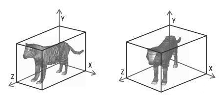

<center>图8-31 3D物体和它们的AABB</center>

#### 8.6.2.1 AABB的表示

　　先介绍AABB的一些重要性质和引用这些值时所用到的记法。AABB内的点满足下列不等式：
$$
\begin{aligned}
&x_{min} \leq x \leq x_{max}
\\
&y_{min} \leq y \leq y_{max}
\\
&z_{min} \leq z \leq z_{max}
\end{aligned}
$$

　　特别重要的两个顶点为：
$$
\begin{aligned}
&\vec p_{min} = [x_{min} \quad y_{min} \quad z_{min}]
\\
&\vec p_{max} = [x_{max} \quad y_{max} \quad z_{max}]
\end{aligned}
$$

　　中心点 $\vec c$ 为：
$$
\vec c = \frac{(\vec p_{min} + \vec p_{max})}{2}
$$
　　“尺寸向量”　$\vec s$ 是从 $\vec p_{min}$ 指向 $\vec p_{max}$ 的向量，包含了AABB的长、宽、高：
$$
\vec s = \vec p_{max} - \vec p_{min}
$$
　　还可以求出AABB的“半径向量” $\vec r$ ，它是从中心指向 $\vec p_{max}$ 的向量：
$$
\begin{aligned}
\vec r &= \vec p_{max} - \vec c
\\ &= \frac{\vec s}{2}
\end{aligned}
$$
　　明确地定义一个AABB只需要 $\vec p_{min}$ ，$\vec p_{max}$ ，$\vec c$ ， $\vec s$ ， $\vec r$ 这5个向量中的两个（除 $\vec s$ 和 $\vec r$ 不能配对外，它们中的任意两个都可配对）。在一些情况下，某些配对形式比其他的会更有用。我们建议用 $\vec p_{min}$ 和 $\vec p_{max}$ 表示一个AABB，因为实际应用中，使用它们的频率远高于 $\vec c$ ，$\vec s$ ，$\vec r$ 。当然，由 $\vec p_{min}$ 和 $\vec p_{max}$ 计算其余三个中的任意一个都是很容易的。

　　具体表示结构如下：

```c++
struct AABB
{
    Vector3	mMin;
    Vector3	mMax;
};
```

#### 8.6.2.2 AABB的构建

　　高效计算一个点集的紧密包围的AABB是一个很复杂的问题，在这里我们不专门去讨论所有的算法，我们只介绍一个行之有效并且简单的方法。这个简单的方法就是：先将最小值和最大值设为“ 正负无穷大”或任何比实际中用到的数都大或者小得多的数。接着，遍历全部顶点，并扩展AABB直到它包含所有点为止。

#### 8.6.2.3 AABB的变换

　　当物体在虚拟世界中移动时，它对应的AABB也需要随之移动。此时，我们有两个选择：

- 用变换后的物体来重新计算AABB；
- 对AABB做和物体同样的变换；

　　所得到的结果不一定是轴对齐的（如果物体旋转）也不一定是盒状的（如果物体发生了扭曲）。不过，通过对AABB做和物体同样的变换要比通过经过变换的物体计算AABB快得多，因为AABB只有8个顶点。

　　通过变换后的AABB计算不能只是简单地变换8个顶点，也不能通过转换原点 $\vec p_{min}$ 和 $\vec p_{max}$ 来得到新的 $\vec p_{min}$ 和 $\vec p_{max}$ ——这样可能会导致 $x_{min} \gt x_{max}$。为了计算新的AABB，必须先变换8个顶点，再从这8个顶点中计算一个新的AABB。

　　根据变换的不同，这种方法可能使新AABB比原来大许多。例如，在45°的旋转会大大增加AABB的尺寸。如下图8-32所示：


<center>图8-32 AABB的变换</center>

　　比较图8-32中原AABB（左边）和新AABB（右边较大的框），它是通过旋转后的AABB计算的，新AABB几乎是原来的两倍。注意，如果从旋转后的物体而不是通过旋转后的AABB来计算新AABB，它的大小将和原来的AABB相同。

　　可以利用AABB的结构来加快新的AABB的计算速度，而不必先变换8个顶点，再从这8个顶点中计算新AABB。

　　变换顶点，就是用一个变换矩阵左乘顶点向量（记住，我们使用右手坐标系，矩阵左乘列向量），假设顶点为 $\begin{bmatrix}x \quad y \quad z \quad 1\end{bmatrix}^{T}$ ，则变换如下：
$$
\begin{aligned}
&\begin{bmatrix}
x^{'} \\
y^{'} \\
z^{'} \\
1
\end{bmatrix}
= 
\begin{bmatrix}
&m_{11} \quad &m_{12} \quad &m_{13} \quad &m_{14}\\
&m_{21} \quad &m_{22} \quad &m_{23} \quad &m_{24}\\
&m_{31} \quad& m_{32} \quad &m_{33} \quad &m_{34}\\
&0 \quad &0 \quad &0 \quad &1
\end{bmatrix}
\begin{bmatrix}
x\\
y\\
z\\
1
\end{bmatrix}
\\\\
& x^{'} = m_{11}x + m_{12}y + m_{13}z + m_{14} \\
& y^{'} = m_{21}x + m_{22}y + m_{23}z + m_{24} \\
& z^{'} = m_{31}x + m_{32}y + m_{33}z + m_{34}
\end{aligned}
$$
　　设原AABB为 $x_{min}$ ， $x_{max}$ ， $y_{min}$ ， ……，新的AABB计算将得到 $x^{'}_{min}$ ， $x^{'}_{max}$ ， $y^{'}_{min}$……。现在我们的任务就是想办法加快计算 $x^{'}_{min}$ 的速度。换句话说，我们希望找到 $m_{11}x+m_{12}y+m_{13}z+m_{14}$ 的最小值。其中 $\begin{bmatrix}x, y, z, 1\end{bmatrix}$ 是原8个顶点中的任意一个。我们所要做的就是找出这些点经过变换后谁的 x 坐标最小。看第一个乘积：$m_{11}x$ 。为了最小化乘积，必须决定是用 $x_{min}$ 还是 $x_{max}$ 来替换其中的 x。显然，如果 $m_{11} \gt 0$ ，用 $x_{min}$ 能得到最小化乘积；如果 $m_{11} \lt 0$ ，则用 $x_{max}$ 能得到最小化乘积。比较方便的是，不管 $x_{min}$ 和 $x_{max}$ 中哪个被用来计算 $x^{'}_{min}$ ，都可以用另外一个来计算 $x^{'}_{max}$。可以对矩阵的12个元素中的每一个都应用这个计算过程。 

### 8.6.3 有向包围盒（OBB）

　　有向包围盒（OBB）是类似于AABB一样的矩形（2D中）或者平行六面体（3D中），只是相对于AABB，OBB具有方向性，而且OBB边或面不一定跟轴平行。OBB会根据物体本身的几何形状和朝向来决包围体的形状和大小。这个是跟AABB最大的区别。下图8-33展示了3D物体的OBB。


<center>图8-33 3D物体和它的OBB</center>

#### 8.6.3.1 OBB的表示

　　由于OBB有方向性，所以OBB的表示比AABB的表示有多种选择。大概有以下几种：

- 八个顶点的点集；
- 六个面的面集；
- 三组平行面集合；
- 一个顶点和三个彼此正交的边向量；
- 一个中心点、一个旋转矩阵和三个半边长（旋转矩阵包含三个旋转轴，而在2D中旋转矩阵包含两个旋转轴和两个半边长）；

　　通常，最后一种表达方式最为常用，并且与其他表达方式相比，其OBB间相交测试更加便捷。该测试算法基于分离轴定理，后面在几何检测中会有讨论。下列代码给出了OBB的数据结构：

```c++
struct OBB
{
    Vector3	mCenter;	// OBB中心点
    Vector3	mAxis[3];	// 三个正交轴向量
    Real	mExtent[3];	// 三个半边长
};
```

#### 8.6.3.2 OBB的构建

　　高效地计算一个紧密的包围物体的OBB是具有一定复杂度的，对于对齐性较差的OBB和对齐性良好的OBB，二者存在着较大的差异，这也将使得计算过程变得更加复杂，我们这里不专门论述所有的算法，我们只介绍两种构建方法。其中我们引擎只使用第一种构建方法，第二种算法，也许在未来版本会加上实现。

　　第一种方法是通过**AABB辅助生成OBB**。这种方法最简单，直接就是按照前面我们讨论的方式生成AABB，由于OBB在初始大小、位置和方向上的变换矩阵都是单位矩阵，而且OBB和AABB一样都是长方体，所以直接用AABB的中心作为OBB中心，AABB三个轴方向上的最大长度为半边长，XYZ三个坐标轴为OBB的三个正交向量轴，就能构建出一个OBB。

　　第二种是**Gottschalk**提出的一种线性估计算法。这个方法相对复杂许多，但是该算法相对其他算法，算法复杂度适中，虽然不是最优拟合，但是在包围紧密度上也比较合适。我们的引擎目前实现的代码中并没有使用该算法。算法步骤：

　　首先，必须计算出物体点集的三维凸包，这可以使用类似于Quick Hull这样的算法来实现。假设可以得到 n 个三角形，记作 $\triangle{p^kq^kr^k}$ ，其中 $0 \le k \lt n$，$p^k$ 、$q^k$ 、$r^k$ 分别是三角形 k 的三个顶点。将三角形 k 的面积记作 $a^k$ ，那么凸包的整个面积就可以记作 $a^H$ 。则三角形 i 的质心（重心）为：
$$
m^i = \frac{(p^i+q^i+r^i)}{3}
$$
　　整个凸包的质心 $m^H$ 是所有三角形质点的加权平均值：
$$
\begin{aligned}
m^H = \frac{1}{a^H}\sum_{k=0}^{n-1}{a^km^k}
\end{aligned}
$$
　　利用上面这些定义，就可以计算出一个3x3的协方差矩阵，如公式8.44所示：
$$
\begin{aligned}
C_{i, j} &= E\begin{bmatrix}x_ix_j\end{bmatrix} - E\begin{bmatrix}x_i\end{bmatrix}E\begin{bmatrix}x_j\end{bmatrix} \\
&= \begin{bmatrix}
(\frac{1}{a^M})\sum_{k=0}^{n-1}{\frac{a^k}{12}(9m_i^km_j^k+p_i^kp_j^k+q_i^kq_j^k+r_i^kr_j^k)-m_i^Hm_j^H}
\end{bmatrix}
\end{aligned}
\tag{8.44}
$$
　　它表示点集在三维空间的分布关系，该矩阵的特征向量就是所求OBB三个轴的方向向量，计算出它的特征向量并将其归一化，这些向量就是OBB的方向向量：$v^0$ ，$v^1$ ，$v^2$ 。协方差矩阵是一个对称矩阵。

　　接下来就是找OBB的中心和半长，可以将凸包的点投影到方向向量上，然后找到每个方向上的最大值 $l_{min}^k$ 和最小值 $l_{max}^k$ ，其中 $0 \le k \le 2$ 。这几个值就决定了OBB的大小、位置和方向。

　　OBB中心的计算如公式8.45所示：
$$
\begin{aligned}
C = \frac{l_{min}^0 + l_{max}^0}{2} v^0 + \frac{l_{min}^1 + l_{max}^1}{2} v^1 + \frac{l_{min}^2 + l_{max}^2}{2} v^2
\end{aligned}
\tag{8.45}
$$
　　OBB半长的计算如公式8.46所示：
$$
\begin{aligned}
l_{half}^k = \frac{l_{min}^k + l_{max}^k}{2}
\end{aligned}
\tag{8.46}
$$
　　至此，我们就讨论完OBB的构建算法，第二种协方差矩阵算法比较复杂，因为我们引擎当前版本也没有支持该算法，这里就不详细证明了，有兴趣的朋友可以自行查阅相关的资料求证。

#### 8.6.3.3 OBB的变换

　　当物体在虚拟世界里移动的时候，它的包围球也会跟随一起移动。OBB既不像包围球那么简单的仅仅变换一个球心位置就能达到目的，也不像AABB那样需要重构AABB那么复杂的需要先变换8个顶点再逐个找出最大值最小值重建AABB。OBB在变换上是虽然是相对复杂但是也相对更加清晰。另外，OBB既不像包围球那样变换后方向和大小都不变，也不像AABB那样变换后方向不变大小可能会改变，OBB变换后的是紧跟着原物体大小、方向、位置一起变换的，所以OBB就算变换后，也跟原来一样紧贴着物体轮廓。如图8-34所示


<center>图8-34 变换后的OBB</center>

　　首先，OBB中有一个中心点来表示位置，所以我们首先就要变化这个中心点 $\vec c$ 。设有变换矩阵 M，则新的中心点是：
$$
\begin{aligned}
\vec c' = M \cdot \vec c
\end{aligned}
$$
　　接着，OBB中有三个正交基来表示方向，我们需要用变换矩阵 M 去变换这三个正交基，则新的三个正交基为：
$$
\begin{aligned}
&\vec x' = M \cdot \vec x \\
&\vec y' = M \cdot \vec y \\
&\vec z' = M \cdot \vec z
\end{aligned}
$$
　　最后，我们还有三个方向上的半长用来定义大小，由于缩放不受方向和位置影响，所以我们只需要把变换矩阵中关于缩放部分的值提取出来，直接跟半长计算，就达到目的。设三个正交基方向上的缩放值分别为 $s_x$ 、$s_y$ 和 $s_z$ ，则新的半长为：
$$
\begin{aligned}
& l_x' = s_x l_x \\
& l_y' = s_y l_y \\
& l_z' = s_z l_z
\end{aligned}
$$
　　通过以上这三个计算，就能把一个OBB跟随物体一起变换到新的位置、方向和大小了。

### 8.6.4 离散有向多面体（k-DOP，Discrete Oriented Polytope）

　　什么是离散有向多面体？它由 k/2 （k是偶数）个归一化法线（方向） $n_i$ 定义，每个 $n_i$ 有两个相关标量 $d_i^{min}$ 和 $d_i^{max}$ ，其中 $d_i^{min} < d_i^{max}$ 。每个三元组（ $n_i$ ， $d_i^{min}$ ，$d_i^{max}$ ）描述的是一个平板层 $S_i$ ，表示的是两个平面之间的空间，这两个平面分别是 $\pi_i^{min} : n_i \cdot x + d_i^{min} = 0$  和 $\pi_i^{max} : n_i \cdot + d_i^{max} = 0$ ，$S_i$ 是 k-DOP 的实际体积。 如下图8-35所示：


<center>图8-35 一个2D茶杯的k-DOP示例</center>

　　我们引擎实现中并没有使用到这种包围体，这里只是抛砖引玉，我们就不展开。最后提一下，3D的AABB是 k=6 的 k-DOP 包围体。

### 8.6.5 三种包围体的比较

　　之前我们在讨论包围球作为包围体的时候，就说过包围球在很多情况下对物体的轮廓拟合度不高，对物体的包裹也不紧凑，会造成大量空间的浪费，所以，在很多情况下，AABB比包围球更适合于做包围体。相比较包围球，AABB有以下的优点：

- 计算一个顶点集的AABB，在编程上更容易实现，并能在短时间内完成。计算包围球则复杂得多了。
- 对实际世界里的许多物体，AABB提供了一种“更紧凑”的包围体。当然，对于某些物体，包围球更好（例如足球、篮球、桌球等球形物体）。在极端的情况下，AABB的体积可能仅相当于包围球二分之一。大部分时候包围球的体积会比AABB体积大得多。图8-24所示就能看出来其紧凑型的区别。

　　包围球的根本问题是它的形状只有一个自由度——半径。而AABB却有三个自由度——长、宽、高。因此，它可以调节这些自由度以适应不同物体。通过上图8-32，我们可以注意到AABB对物体的方向是敏感的。比较图中两个老虎，它们大小相同，只是方向不同而已；而包围球在这两种相同大小不同方向下的物体，大小是相同的。因此包围球对物体方向是不敏感的。

　　当然，包围球也有其优点，那就是表达简单，只需要一个球心和一个半径就可以表示，内存占用少。另外，包围球跟随物体的变换计算也简单快速。另外一个优点，就是相交检测也足够简单快速，这个后面相交性检测里我们会详细讨论。这些都是AABB、OBB等其他任何包围体无法比拟的优势。

　　虽然AABB相对包围球来说，多了个自由度，对物体方向是敏感的，但是物体方向的改变并没有改变AABB方向，而仅仅是改变了AABB的大小，这个相对OBB来说，又造成了更多空间上的浪费，而且对于变换后的AABB来说，包围体的拟合度就降低了。

　　因此，OBB比AABB有更高的自由度，在物体方向改变上，也能随之而改变，做到包围体在物体变换情况下，拟合度不会因此而降低。但是OBB相对AABB需要更多内存空间存储数据，另外相交性检测的复杂性上也提高了许多，这个后面在相交性检测里我们会详细讨论。

　　包围球、AABB和OBB三者的构建上的比较，这个一般我们在实时性游戏中，我们可以通过预处理（例如 3ds max、Maya 等工具）在先计算好包围球初始数据，这里我们就不重点讨论了。

　　最后，我们用一个简单的表格列出三种包围体的特点，以供更直观的认识。

|          | <center>包围图(Sphere)</center>                             | <center>轴对齐包围盒(AABB)</center>                                                       | <center>有向包围盒(OBB)</center>                                   |
| :------: | :---------------------------------------------------------- | :---------------------------------------------------------------------------------------- | :----------------------------------------------------------------- |
| 内存     | 单精度：16字节<br>双精度：32字节<br>内存占用最小            | 单精度：24字节<br>双精度：48字节<br>内存占用中等                                          | 单精度：60字节<br>双精度：120字节<br>内存占用最大                  |
| 构建     | Welzl的最小包围球算法是线性复杂度，复杂度相对较低，性能一般 | 简单的遍历求顶点XYZ三方向上最大值和最小值值算法复杂度低，但是包裹不是最紧凑，性能相对较高 | 多种算法复杂度都相对较高，性能相对较低                             |
| 变换     | 变换简单，高效，仅需要对顶点做平移变换，对半径做缩放变换    | 变换相对复杂，需要根据变换后的8顶点重新寻找最大值和最小值构建AABB                         | 变换相对复杂，性能较慢，需要分别对中心点、三正交基和半长分别做变换 |
| 紧凑性   | 对非球体物体空间上存在大量浪费<br>对非球体物体拟合度很低    | 变换后可能存在部分空间浪费<br>拟合度相对较高，但变换后可能降低拟合度                      | 变换前后的空间浪费较少<br>变换前后的拟合度较高                     |
| 相交检测 | 算法简单、高效                                              | 算法简单、高效                                                                            | 算法复杂、性能较低                                                 |


##<center>8.7 视锥体（Frustum）</center>

　　在3D世界中，其实我们是虚拟了现实世界，这样子需要一个摄像机来看这个世界。视锥体就是摄像机可见的空间体积，它看上去像截掉顶部的金字塔，如下图8-36所示：

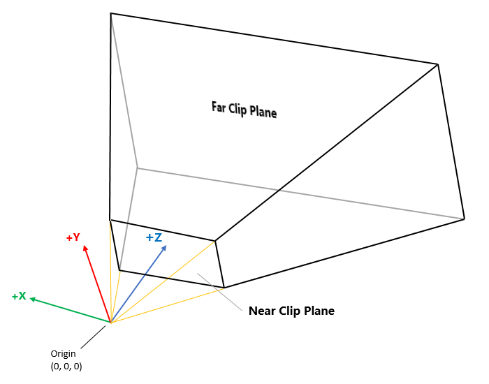

<center>图8-36 3D视锥体</center>

　　视锥体是由六个裁剪面围成的。构成视锥体的四个侧面称为上、左、下、右面，它们对应着输出窗口的四边。为了防止物体离摄像机过近，设置近裁剪面，从而去掉金字塔四棱锥的顶端。同理，也设置了视野的远端，因为太远的物体实际上太小而不可见，因此可有效而安全地去掉。后面我们会详细讨论视锥体的作用以及视锥体跟其他包围体的相交性检测，这里我们先讨论视锥体的表示。

　　视锥体的表示很简单，就是六个平面。下列代码给出了视锥体的数据结构：

```c++
struct Frustum
{
    Plane mPlane[6];
};
```

　　关于Frustum的构建以及变换我们后面在讨论渲染流水线的时候再详细讨论。这里仅仅讨论表示，方面后续的相交性检测讨论。

<div style="page-break-after:always;"></div>


# <center>九、3D数学——几何检测</center>

本篇概要

- 直线相交性检测

- 射线分别和三角形/平面、圆/球、AABB、OBB的相交性检测

- 两个圆/球的相交性检测

- 球分别和平面、AABB、OBB的相交性检测

- 两个AABB的相交性检测

- AABB分别和平面、OBB的相交性检测

- 两个OBB的相交性检测

- OBB和平面的相交性检测

## <center>9.1 两条射线相交性检测</center>


## <center>9.2 射线和三角形相交性检测</center>


## <center>9.3 射线和平面相交性检测</center>


## <center>9.4 射线和圆/球的相交性检测</center>


## <center>9.5 射线和AABB的相交性检测</center>


## <center>9.6 射线和OBB的相交性检测</center>


## <center>9.7 两个圆/球的相交性检测</center>


## <center>9.8 球和平面的相交性检测</center>


## <center>9.9 球和AABB的相交性检测</center>


## <center>9.10 球和OBB的相交性检测</center>


## <center>9.11 两个AABB的相交性检测</center>


## <center>9.12 AABB和平面的相交性检测</center>


## <center>9.13 AABB和OBB的相交性检测</center>


## <center>9.14 两个OBB的相交性检测</center>


## <center>9.15 OBB和平面的相交性检测</center>

<div style="page-break-after:always;"></div>


# <center>十、3D数学——渲染流水线</center>

 本篇概要

- 流水线和渲染流水线
- 应用阶段
- 几何阶段
- 光栅化阶段
- CPU和GPU之间的通信
- 渲染API —— DirectX、OpenGL、Vulkan、Metal
- 着色器


## <center>10.1 流水线和渲染流水线</center>

### 10.1.1 流水线

### 10.1.2 渲染流水线


## <center>10.2 应用阶段</center>


## <center>10.3 几何阶段</center>


## <center>10.4 光栅化阶段</center>


## <center>10.5 CPU和GPU之间的通信</center>


## <center>10.6 渲染API和着色器</center>

### 10.6.1 渲染API（DirectX/Open GL/Vulkan/Metal）

### 10.6.2 可编程渲染管线与着色器（DirectX/OpenGL/Vulkan/Metal）

### 10.6.3 固定渲染管线

<div style="page-break-after:always;"></div>


# <center>十一、基础系统——平台层</center>

本篇概要

- 辅助定位问题的简单Console类设计和实现
- 设备信息类设计和实现
- IO类设计和实现
- 时间和定时器相关类设计和实现


## <center>11.1 平台层功能</center>

　　平台层目标就是实现不同平台的隔离，让上层调用对平台无感知，对于一些通用和平台无关的在这里是不涉及的。在这里我们主要涉及几个实现，第一个是输出日志到对应平台调试窗口，主要就是方便查看调试的一些信息，这个就是——Console。第二个是设备信息的获取，这个根据不同平台需要获取到对应的信息，方便根据一些设备信息做对应的业务，这个就是——DeviceInfo。第三个是设计平台的IO操作的，对应不同平台都有一定的差别，所以我们这里也给进行封装，这个是几个类的集合，后面会逐一介绍。最后就是时间和定时器相关的，每个平台关于这部分也是有差别，这里也是一些类的集合，后面也会逐一介绍。


## <center>11.2 简单的Console</center>

　　首先，先说下我们控制台有什么功能。其实功能很简单，就只有一个，就是把文本输出到对应平台的控制台上，方便调试。我们看看各自平台和对应IDE环境下，控制台输出具体是哪里。

- 在Windows上，使用Visual Studio，控制台就是输出到Visual Studio的Console窗口里。
- 在Mac OS X上，使用XCode，控制台就是输出到XCode的控制台窗口。
- 在Linux上，不管使用什么IDE或者不使用，控制台都是指命令行窗口。
- 在iOS上，使用XCode，控制台跟Mac OS X一样，输出到XCode的控制台窗口。
- 在Android上，不管使用什么IDE或者不使用，控制台都是指logcat。

　　接着，我们来看看这个控制台相关类设计，如下图11-1：


<center>图11-1 控制台相关类图设计</center>

　　从类图可以看到，Console又一次用到了抽象工厂模式来设计其结构。接下来我们直接看代码吧，因为这个也比较简单，通过代码看看有什么接口及其功能。

```c++
class T3D_PLATFORM_API Console : public Singleton<Console>
{
    T3D_DISABLE_COPY(Console);

public:
    static const uint32_t MAX_CONTENT_SIZE;

    Console();
    virtual ~Console();

    void print(const char *pText, ...);

protected:
    IConsole    *mConsole;
};
```

Console类，这个类主要就是提供一个输出接口：

　　**void print(const char *pText, ...)**

该接口主要就是打印文本到对应控制台上。从这里面可以看出来，Console类里面有个成员IConsole类的对象，这个就是对应各自平台实现的对象，会根据不同平台的工厂类生成平台相关的IConsole对象。接下来，我们看看这个IConsole类。

```c++
class IConsole
{
    T3D_DECLARE_INTERFACE(IConsole);

public:
    /**
     * @brief 输出文本到控制台.
     * @param [in] pText : 以'\0'结尾的字符串文本
     */
    virtual void print(const char *pText) = 0;
};
```

IConsole类，其实就是定义一个抽象接口：

　　**void print(const char *pText)**

该接口主要就是一种规范，让每个平台各自实现其平台相关功能。各自平台的Win32Console类、OSXConsole类、LinuxConsole类、iOSConsole类和AndroidConsole类相关的实现，各位请直接查看源码。


## <center>11.2 获取设备信息</center>

```c++
class IDeviceInfo
{
    T3D_DECLARE_INTERFACE(IDeviceInfo);

public:
    /**
     * @brief 获取平台类型
     */
    virtual uint32_t getPlatform() const = 0;

    /**
     * @brief 获取软件版本号字符串
     */
    virtual const String &getSoftwareVersion() const = 0;

    /**
     * @brief 设置软件版本号字符串
     */
    virtual void setSoftwareVersion(const char *version) = 0;

    /**
     * @brief 获取操作系统版本号字符串
     */
    virtual const String &getOSVersion() const = 0;

    /**
     * @brief 获取设备机型版本信息字符串
     */
    virtual const String &getDeviceVersion() const = 0;

    /**
     * @brief 获取屏幕宽度.
     */
    virtual int32_t getScreenWidth() const = 0;

    /**
     * @brief 获取屏幕高度.
     */
    virtual int32_t getScreenHeight() const = 0;

    /**
     * @brief 获取屏幕像素密度.
     */
    virtual float getScreenDPI() const = 0;

    /**
     * @brief 获取CPU类型信息.
     */
    virtual const String &getCPUType() const = 0;

    /**
     * @brief 获取CPU架构
     */
    virtual const String &getCPUArchitecture() const = 0;

    /**
     * @brief 获取CPU核数.
     */
    virtual int32_t getCPUCores() const = 0;

    /**
     * @brief 获取系统内存总数.
     */
    virtual uint32_t getSystemRAM() const = 0;

    /**
     * @brief 获取设备ID.
     */
    virtual const String &getDeviceID() const = 0;
};
```


## <center>11.3 IO类</center>

　　IO类？其实这里的IO类不仅仅是一个类，而是一组用于IO操作的类。这里的设计主要是基于三个目的：

- 可以无缝切换文件IO操作和内存缓冲区IO操作；
- 可以在未来扩展出基于网络IO操作的类；
- 跨平台的文件系统操作类；

　　介绍完设计目的，我们先看看基于流式数据的IO类结构和设计，如下图10-3：


<center>图11-3 流式数据类图</center>


## <center>11.4 时间和定时器</center>

<div style="page-break-after:always;"></div>


# <center>十二、基础系统——日志系统</center>

本篇概要

- 输出日志到文件
- 输出日志到相应平台的Console
- 日志输出和日志文件清理策略

　　搭建完开发环境并且验证正常运行后，接下来就是设计和实现一套日志系统，为后续工作提供更多方法去辅助开发和调试。


## <center>12.1 日志系统设计</center>

　　先看看我们日志系统有什么功能，这样子才有明确目标去开发。我们日志系统具备以下功能：

- 能够输出日志信息到对应平台的console窗口，方便运行调试时查看日志
- 能够输出日志信息到文件里，方便程序运行后查看日志
- 能够输出平台一些基本信息到日志
- 在程序启动时把过期的日志文件删掉，避免磁盘占用越来越多
- 日志文件按照时间来归类，方便删除过期日志文件
- 每条日志信息带有的信息是：日志时间、日志级别、输出日志的现成ID、输出日志的源码文件名、输出日志的源码行数、日志内容
- 防止IO操作频繁而卡住主线程，主线程把日志cache，异步线程做IO写操作
- 防止删除过期文件时候IO操作卡住主线程，在异步线程进行检查过期日志文件并删除
- 日志写回文件策略，避免日志没有及时写会文件
- 进程挂起和继续时，日志系统的处理，避免进程挂起后被直接杀掉无法及时写会文件导致日志丢失

　　好了，从上面这么多功能点可以看出来，日志系统看起来很简单，以为就是写日志到文件，实际上功能还是不少的。下面我们就一点点来设计和完善日志系统。先来看看整体类图，看看需要些什么类和结构，如下图12-1：


<center>图12-1 日志系统类图</center>

　　从上图看出来，我们类不多，在后面现部分会讲解一下每个类及其公有接口的用途。下面先来根据上面列出来的功能，把一些公用平台库缺乏的功能补上。


## <center>12.2 日志系统实现</center>


## <center>12.3 移动设备的特殊处理</center>


## <center>12.4 关于定位问题的更多思考</center>


<div style="page-break-after:always;"></div>


# <center>十三、基础系统——事件系统</center>

本篇概要

- 事件系统的作用和目的
- 事件系统的设计
- 事件系统的实现
- 事件发送和派发的优化
- 事件系统和函数调用、观察者模式的比较

　　引擎需要很多模块或者相同模块之间的通信，这里引入事件系统来处理相互之间的通信。


## <center>13.1 事件系统的作用和目的</center>

　　首先，我们聊聊这里的事件系统是什么。

　　大家应该很熟悉Windows系统，Windows系统里面的窗口就是基于消息通信的，窗口与窗口之间的通信都是通过SendMessage(HWND, UINT, WPARAM, LPARAM)或者PostMessage(HWND, UINT, WPARAM, LPARAM)这两个接口来发送消息，然后通过实现WndProc(HWND, UINT, WPARAM, LPARAM)函数来作为一个消息中心响应消息处理。这里的事件系统也就是类似于Windows的窗口系统里面的消息机制。

　　为什么要用事件系统呢？一是我们开发过程中，需要一种通信方式来实现各个模块或者对象之间的通信；二是事件系统可以进一步降低各个模块之间的耦合，因为使用事件系统后，每个模块只需要定义模块本身嫩够处理的事件和事件参数，不需要关注是哪个模块触发的事件，这样子才能进一步解耦。

## <center>13.2 事件系统设计</center>


## <center>13.3 事件系统实现</center>


## <center>13.4 事件收发的优化</center>


## <center>13.5 事件系统的优劣</center>


<div style="page-break-after:always;"></div>


# <center>十四、基础系统——内存管理</center>

本篇概要

- 内存管理的常用方式
- 内存池
- 对象池
- 垃圾回收机制
- 引用计数机制


## <center>14.1 内存管理的常用方法</center>

## <center>14.2 内存池</center>

## <center>14.3 对象池</center>

## <center>14.4 垃圾回收</center>

## <center>14.5 引用计数</center>


<div style="page-break-after:always;"></div>


# <center>十五、基础系统——插件系统</center>

本篇概要

- 什么是插件系统
- 插件系统的作用
- Windows 的实现方式
- 非 Windows 的实现方式

# <center>十六、核心系统——渲染系统</center>

# <center>十七、核心系统——场景管理</center>

# <center>十八、核心系统——资源管理</center>

# <center>十九、核心系统——纹理和材质</center>

# <center>二十、核心系统——模型和动画<center>

# <cneter>二十一、核心系统——字体管理</center>

# <center>二十二、核心系统——地型系统</center>

# <center>二十三、核心系统——粒子系统</center>

# 附录

## 附录 A

#### 1、 奔驰定理

　　在讨论三个特殊点之前，我们先讨论一个重要的定理——奔驰定理。后面三个特殊点的坐标推导等都需要用到这个定理。什么是奔驰定理呢？如下：

> 已知 $\vec P$ 为三角形ABC内一点，则：
>
> $S_{A}\vec{PA} + S_{B}\vec{PB} + S_{C}\vec{PC} = \vec{0} \tag{10.28}$
>
> 其中 $S_{A}$、$S_{B}$、$S_{C}$ 分别是 $\triangle BPC$、$\triangle CPA$、$\triangle APB$ 的面积，$\vec 0$ 表示零向量。

　　如下图10-19所示：


<center>图10-19 奔驰定理</center>

　　从上图10-19看，这个图跟奔驰的logo很相似，所以我们把它称为奔驰定理。接下来我们简单证明下这个定理。这个定理有很多证明方式，我们这里简单的利用三角恒等式来证明。

　　记 $\angle{APB}=\alpha$，$\angle{APC}=\beta$，$|\vec{PA}|=x$、$|\vec{PB}|=y$、$|\vec{PC}|=z$，欲证公式10.28左边与 $\vec{PA}$ 作点积，如下：
$$
\begin{aligned}
&(S_{A} \vec{PA} + S_{B} \vec{PB} + S_{C} \vec{PC}) \cdot \vec{PA}
\\
=& S_{A} \vec{PA} \cdot \vec{PA} + S_{B} \vec{PB} \cdot \vec{PA} + S_{C} \vec{PC} \cdot \vec{PA}
\\
=& S_{A} \cdot x^2 + S_{B} \cdot xy \cos{\alpha} + S_{C} \cdot xz \cos{\beta}
\end{aligned}
$$
　　其中，$S_{A} = \frac{1}{2} yz \sin[\pi - (2 \pi - \alpha + \beta)]$ ， $S_{B} = \frac{1}{2} xz \sin(\pi - \beta)$ ， $S_{C} = \frac{1}{2} xy \sin(\pi - \alpha)$ ，而 $\sin(\pi-\theta)=\sin(\theta)$ ， $\sin(2\pi - \theta) = -\sin(\theta)$ ，代入上述等式得：
$$
\begin{aligned}
&(S_{A} \vec{PA} + S_{B} \vec{PB} + S_{C} \vec{PC}) \cdot \vec{PA}
\\
=& S_{A} \vec{PA} \cdot \vec{PA} + S_{B} \vec{PB} \cdot \vec{PA} + S_{C} \vec{PC} \cdot \vec{PA}
\\
=& S_{A} \cdot x^2 + S_{B} \cdot xy \cos{\alpha} + S_{C} \cdot xz \cos{\beta}
\\
=& \frac{1}{2} yz \sin(2 \pi - \alpha + \beta) \cdot x^2 + \frac{1}{2} xz \sin{\beta} \cdot xy \cos{\alpha} + \frac{1}{2} xy \sin(\pi - \alpha) \cdot xz \cos{\beta}
\\
=& \frac{1}{2} x^2yz[-\sin(\alpha + \beta) + \cos{\alpha} \sin{\beta} + \sin{\alpha} \cos{\beta}]
\end{aligned}
$$
　　根据三角函数和角差公式 $\sin(x+y) = \sin{x}\cos{y} + \cos{x}\sin{y}$ ，代入上述等式可得：
$$
\begin{aligned}
&(S_{A} \vec{PA} + S_{B} \vec{PB} + S_{C} \vec{PC}) \cdot \vec{PA}
\\
=& S_{A} \vec{PA} \cdot \vec{PA} + S_{B} \vec{PB} \cdot \vec{PA} + S_{C} \vec{PC} \cdot \vec{PA}
\\
=& S_{A} \cdot x^2 + S_{B} \cdot xy \cos{\alpha} + S_{C} \cdot xz \cos{\beta}
\\
=& \frac{1}{2} yz \sin(2 \pi - \alpha + \beta) \cdot x^2 + \frac{1}{2} xz \sin{\beta} \cdot xy \cos{\alpha} + \frac{1}{2} xy \sin(\pi - \alpha) \cdot xz \cos{\beta}
\\
=& \frac{1}{2} x^2yz[-\sin(\alpha + \beta) + \cos{\alpha} \sin{\beta} + \sin{\alpha} \cos{\beta}]
\\
=&  \frac{1}{2} x^2yz[-\sin{\alpha}\cos{\beta} - \cos{\alpha}\sin{\beta} + \cos{\alpha}\sin{\beta} + \sin{\alpha}\cos{\beta}]
\\
=& 0
\end{aligned}
$$
　　同理可证公式10.28分别与 $\vec{PB}$ 、$\vec{PC}$作点积得到的结果也均为0，而向量 $\vec{PA}$ 、$\vec{PB}$ 、$\vec{PC}$ 不共线，因此公式左边为零向量，奔驰定理得证。

　　奔驰定理在下面三个心的坐标推导上面都起了重要作用。接下来引申一下奔驰定理公式，方便后续三个特殊点的推导使用。

　　设 $\triangle{ABC}$ 三点坐标分别为：$A(x_1, y_1, z_1)$，$B(x_2, y_2, z_2)$，$C(x_3, y_3, z_3)$，$\angle{A}$ 对边 $|\vec{BC}|=a$ ， $\angle{B}$ 对边 $|\vec{AC}|=b$ ， $\angle{C}$ 对边 $|\vec{AB}|=c$ ， 点$\vec{P}$ 坐标为(x, y, z)，有：
$$
\begin{aligned}
&\vec{PA} = (x_1-x, y_1-y, z_1-z) \\
&\vec{PB} = (x_2-x, y_2-y, z_2-z) \\
&\vec{PC} = (x_3-x, y_3-y, z_3-z)
\end{aligned}
$$
　　代入奔驰公式（公式10.28），则：
$$
\begin{aligned}
&S_{A}(x_1-x) + S_{B}(x_2-x) + S_{C}(x_3-x) = 0 \\
&S_{A}(y_1-y) + S_{B}(y_2-y) + S_{C}(y_3-y) = 0 \\
&S_{A}(z_1-z) + S_{B}(z_2-z) + S_{C}(z_3-z) = 0 \\
\end{aligned}
$$
　　整理可得：
$$
\begin{aligned}
&x = \frac{S_{A}x_1 + S_{B}x_2 + S_{C}x_3}{S_{A} + S_{B} + S_{C}} \\
&y = \frac{S_{A}y_1 + S_{B}y_2 + S_{C}y_3}{S_{A} + S_{B} + S_{C}} \\
&z = \frac{S_{A}z_1 + S_{B}z_2 + S_{C}z_3}{S_{A} + S_{B} + S_{C}}
\end{aligned}
$$
　　其中 $S_{\triangle} = S_{A} + S_{B} + S_{C}$ ，则：
$$
\begin{aligned}
&x = \frac{S_{A}x_1 + S_{B}x_2 + S_{C}x_3}{S_{\triangle}} \\
&y = \frac{S_{A}y_1 + S_{B}y_2 + S_{C}y_3}{S_{\triangle}} \\
&z = \frac{S_{A}z_1 + S_{B}z_2 + S_{C}z_3}{S_{\triangle}}
\end{aligned}
\tag{10.29}
$$
　　到此，我们引申了一下奔驰定理，把三角形内一点跟三角形面积关联上，后面需要使用公式10.29来获得特殊点的坐标。